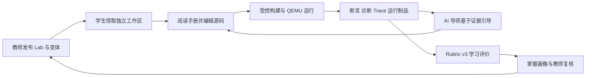
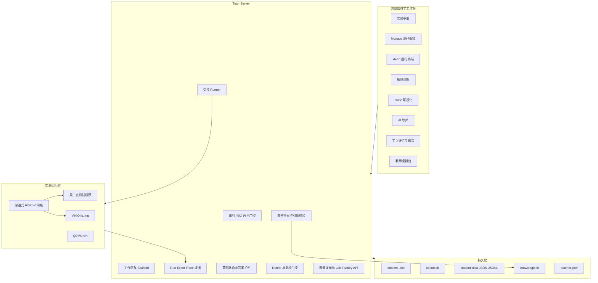
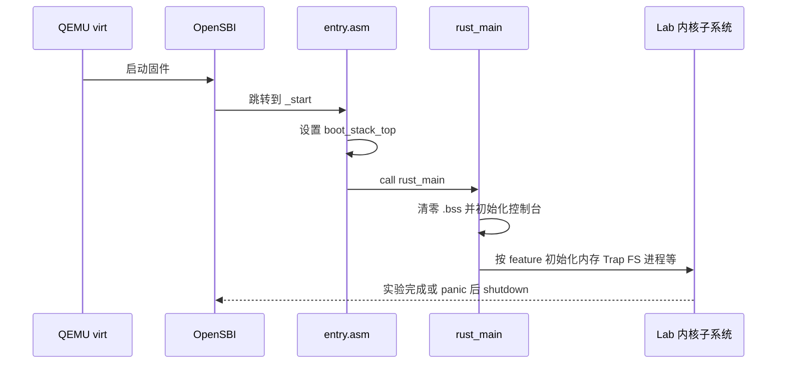
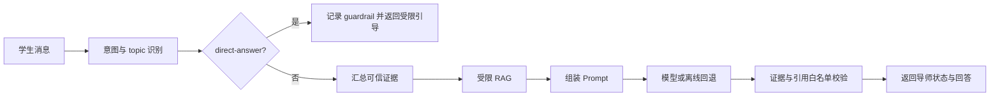
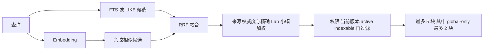
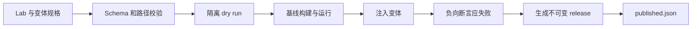

# EVOLVE实验技术文档

---

## 1. 项目定位与技术目标

EVOLVE：Evolving Virtual OS Learning & Verfication Environment是一套面向操作系统课程的完整实验系统。项目将以下能力放在同一条可追踪链路中：

1. 一套由 Lab1 逐步演进到 Lab8 的 RISC-V 教学内核；
2. 为每名学生隔离的源码工作区、实验发放、代码编辑与受控运行环境；
3. 基于真实运行、断言、编译诊断和 Trace 的可信证据系统；
4. 受答案护栏和知识权限约束的 AI 导师；
5. 基于过程、结果、反思证据的自动评价与教师复核；
6. 面向教师的班级管理、实验变体、知识库、报告和期末任务管理；
7. 可版本化的 Lab Package、测试流水线、部署和备份恢复机制。

项目希望解决的核心问题是：学生不仅要“把内核跑起来”，还要能够说明自己观察到了什么、为什么形成某个判断、用什么实验验证了判断；教师则需要看到可核查的过程，而不是只看到一个退出码或一份最终代码。

### 1.1 核心技术闭环（待完善评价与AI导师的闭环）

系统围绕“代码、运行、证据、辅导、评价”形成闭环：



这条链路中，浏览器状态不是最终事实来源。实验开放范围、学生源码、可信运行结果、证据引用、评价结果和教师复核均由服务端或持久化存储提供权威状态。

### 1.2 技术栈

| 层次 | 当前实现 |
| --- | --- |
| 教学内核 | Rust 2021、`no_std`、RISC-V 64、Sv39、SBI、QEMU `virt` |
| 内核组件 | Cargo Workspace，共 10 个成员；内核按 `lab1` 至 `lab8` feature 渐进编译 |
| 块设备与文件系统 | `virtio-drivers`、`tg-rcore-tutorial-easy-fs`、QEMU VirtIO block |
| 学生前端 | Vue 3、VitePress 1.6.3、Monaco Editor 0.56、xterm 6 |
| 可视化与文档 | Markdown-it、Mermaid、Lucide Vue |
| 教学服务 | Node.js 22、原生 HTTP 服务、SSE、`child_process.spawn` |
| 业务存储 | Node `node:sqlite`、JSON/JSONL 文件、学生工作区快照 |
| 知识检索 | SQLite FTS5 trigram、向量余弦检索、Reciprocal Rank Fusion |
| 文档处理 | Python 3，支持 PDF、EPUB、Markdown、TXT、DOCX 规范化与分块 |
| 工程验证 | Node Test Runner、Rust host tests、Python unittest、QEMU、GitHub Actions |

### 1.3 当前代码规模

按核心教学源码统计，当前实现约为：

| 范围 | 文件数 | 非空源码行数 |
| --- | ---: | ---: |
| `os-lab/kernel/src` | 22 | 4,456 |
| 8 个组件 crate 的 `src` | 15 | 2,076 |
| `os-lab/user/src` | 31 | 2,100 |
| 合计 | 68 | 8,632 |

上述统计只用于说明核心内核与用户程序规模，不包含前端、Tutor、知识库、测试、文档、生成数据和依赖代码。

---

## 2. 总体架构

### 2.1 分层结构



### 2.2 关键边界

系统中有四条需要明确区分的边界：

| 边界 | 含义 |
| --- | --- |
| 浏览器与服务端 | 浏览器负责交互展示；权限、运行、评分和证据归属由服务端判定 |
| 学生源码与平台源码 | 学生只编辑 `student-labs/<username>/` 中发放的系统源码，不能通过文件 API 浏览平台内部目录 |
| 任意命令与可信验证 | 白名单命令可以运行，但只有服务端预定义 recipe 才能生成可信断言和 `verified=true` |
| 教学知识与运行证据 | 知识块用于解释机制；真实 run、diagnostic、trace 才能证明本次代码实际发生了什么 |

### 2.3 目录职责

| 路径 | 技术职责 |
| --- | --- |
| `os-lab/kernel/` | 内核入口、Trap、调度、内存、进程、文件系统、信号、线程和同步 |
| `os-lab/user/` | 用户态运行库、syscall 封装和 Lab 验证程序 |
| `os-lab/os-*` | SBI、上下文、系统调用 ABI、分配器、虚存、文件、信号、同步组件 |
| `os-lab/labs/` | Lab1-Lab8 学生手册与教师答案材料 |
| `os-lab/lab-packages/` | `lab.yaml`、概念规格、任务变体、发布目录 |
| `os-lab/scaffold/` | 学生初始工作区和 fill/debug/remedial 变体文件 |
| `os-lab/handbook/` | VitePress 前端、Vue 组件、Tutor Server、前端测试 |
| `os-lab/tutor/` | 运行 recipe、Tutor 状态与轮次策略、证据契约、Prompt 评测 |
| `os-lab/learning/` | 账号与学习数据库、评价、掌握画像、复核、学生制品、知识库 |
| `os-lab/docs/` | 架构、AI、部署、验收等工程文档 |

---

## 3. 渐进式 RISC-V 教学内核

### 3.1 单一内核、逐层 feature

`os-lab/Cargo.toml` 定义了 10 个 Workspace 成员：

```text
kernel
user
os-sbi
os-context
os-syscall
os-alloc
os-vm
os-fs
os-signal
os-sync
```

`kernel/Cargo.toml` 使用链式 feature 表达实验依赖：

```text
lab1 -> lab2 -> lab3 -> lab4 -> lab5 -> lab6 -> lab7 -> lab8
```

例如启用 `lab8` 会递归启用前面全部实验能力，并额外引入 `os-sync`。这种结构保证学生在同一份系统上逐步增加机制，也使后续 Lab 能直接回归前面已经实现的 syscall、文件系统和进程行为。

`kernel/src/main.rs` 再用 `#[cfg(feature = "labN")]` 控制模块和初始化路径。Lab2-Lab3 使用任务管理器，Lab4 起切换为进程管理器，Lab8 再引入进程/线程双层管理；这些变化发生在同一内核入口中，而不是维护八份互相复制的内核。

### 3.2 裸机启动与运行环境

启动链路为：



关键实现：

- `kernel/src/entry.asm` 设置 256 KiB 启动栈并进入 `rust_main`；
- `kernel/src/main.rs` 使用 `#![no_std]`、`#![no_main]`，清零 `.bss`，执行按 Lab 分层的初始化；
- `os-sbi/src/lib.rs` 封装控制台输出、定时器和关机 SBI 调用；
- 链接脚本固定内核装载布局，QEMU 以 RISC-V `virt` 机器运行。

Lab1 只保留最小启动、输出和关机路径。Lab2 起初始化 Trap 和用户程序；Lab3 起初始化页表；Lab5 起初始化堆、同步和文件系统；Lab6 起映射 VirtIO MMIO；Lab8 起初始化线程和阻塞同步所需状态。

### 3.3 Trap、特权级与系统调用 ABI

`os-context` 定义 `TrapContext`，其内存布局与 `trap.asm` 一致：32 个通用寄存器后跟 `sstatus`、`sepc` 和内核栈信息。用户态通过 `ecall` 进入内核后，`kernel/src/trap.rs` 完成以下工作：

1. 从 `scause` 区分用户 `ecall`、Supervisor `ecall`、定时器中断和其他异常；
2. 对系统调用先推进 `sepc`，避免返回用户态后重复执行同一条 `ecall`；
3. 从 `a7` 读取 syscall 编号，从 `a0-a2` 等寄存器读取参数；
4. 按 feature 分派到进程、内存、文件、信号或同步模块；
5. 把返回值写回 `a0`；
6. 在启用分页时切换内核/用户 `satp` 并执行 `sfence.vma`；
7. 恢复 Trap 上下文并通过 `sret` 回到用户态。

系统调用编号和共享结构放在 `os-syscall/src/lib.rs`，用户态封装放在 `user/src/syscall.rs`，因此用户 ABI 不依赖在内核中复制常量。

### 3.4 内存管理

内存子系统由 `os-alloc`、`os-vm` 和 `kernel/src/mm.rs` 组成：

- `os-alloc` 提供物理页帧分配器、释放回收和内核堆分配；
- `os-vm` 实现 Sv39 虚拟页号、三级页表、页表项、映射权限、`MapArea` 和 `MemorySet`；
- `MemorySet::map_elf_pt_load` 按 ELF `PT_LOAD` 段建立代码、数据映射并复制内容；
- 每个任务或进程持有独立 `space_id`，内核通过对应页表 token 激活用户地址空间；
- 用户代码页、数据页和栈页带用户访问权限，内核页不向 U-mode 暴露；
- `fork_user_space` 为子进程重新分配物理页并复制父进程内容；
- `replace_user_space` / `replace_user_space_from_elf` 为 `exec` 重建地址空间；
- Lab6 的 `sys_mmap` / `sys_munmap` 对页对齐区间执行匿名页映射和解除映射。

当前 `fork` 是逐页深拷贝，不包含写时复制；当前 `mmap` 也不是完整的文件映射接口。这两个限制是当前教学实现的明确边界。

### 3.5 任务、进程和线程调度

调度模型随实验推进发生三次演进：

| 阶段 | 控制块 | 核心实现 | 调度模型 |
| --- | --- | --- | --- |
| Lab2-Lab3 | `TaskControlBlock` | `kernel/src/task.rs` | 固定任务表、Ready/Running/Exited、轮转查找 |
| Lab4-Lab7 | `ProcessControlBlock` | `kernel/src/process.rs` | 进程表、父子关系、Zombie、wait，Lab6 支持 stride |
| Lab8 | PCB + `ThreadControlBlock` | `process.rs` + `processor.rs` | 进程拥有地址空间，线程拥有 Trap 上下文、栈和调度状态 |

Lab8 的 `Processor` 使用固定容量 ready queue 和线程槽位，线程状态包含 `Ready`、`Running`、`Blocked`、`Zombie`。进程继续负责共享地址空间、文件描述符、信号和同步对象，线程负责独立执行上下文。这使“进程是资源容器，线程是调度单位”直接体现在代码结构中。

### 3.6 组件化职责

| crate | 职责 |
| --- | --- |
| `os-sbi` | SBI 控制台、定时器和关机调用 |
| `os-context` | Trap 上下文布局、汇编入口和用户态恢复 |
| `os-syscall` | 内核与用户态共享的 syscall 编号、Stat、SignalAction 等 ABI |
| `os-alloc` | 页帧分配、释放、内核堆和测试钩子 |
| `os-vm` | Sv39 页表、映射区域、地址空间和 ELF 段映射 |
| `os-fs` | 文件描述符种类和磁盘文件接口抽象 |
| `os-signal` | 信号位图、动作、掩码和进程信号状态 |
| `os-sync` | 等待队列、阻塞互斥锁、信号量和条件变量 |

组件 crate 将可独立测试的数据结构与内核调度、硬件操作分开。当前 host Rust 测试主要覆盖这些纯逻辑组件，QEMU 测试再覆盖它们与 Trap、地址空间和设备的集成。

---

## 4. Lab1-Lab8 技术实现

### 4.1 Lab1：裸机启动与最小内核

**教学目标**：理解无标准库程序、链接地址、启动栈、SBI 和内核入口之间的关系。

**实现链路**：

- `_start` 在 `entry.asm` 中设置栈顶；
- `rust_main` 清零 `.bss` 并初始化控制台；
- `println!` 经 `os-sbi` 输出到 QEMU 控制台；
- 打印启动标记后调用 SBI shutdown。

**可信验证**：`lab1.verify.v1` 检查 `Hello, OS!` 和 QEMU `virt` 启动标记，而不是只检查进程退出码。

### 4.2 Lab2：Trap、系统调用与协作式调度

**教学目标**：打通用户态到内核态的 `ecall`、Trap 上下文保存恢复和多任务轮转。

**核心实现**：

- `os-context/src/trap.asm` 保存和恢复寄存器；
- `TrapContext` 对 syscall 编号、参数、返回值和 `sepc` 提供结构化访问；
- `trap_handler` 分派 `write`、`exit`、`yield`；
- `task.rs` 保存每个任务的 Trap 上下文和状态；
- `find_next_task` / `run_next_task` 跳过已退出任务并轮转 Ready 任务；
- `trace-edu` feature 输出 `TRACE_V1` 机器帧，记录 `trap_enter` 和 `task_switch`。

**可信验证**：`lab2.verify-trace.v1` 同时检查 Hello、Power 自检、至少五次 Yield、全部应用退出以及两类 Trace 事件。它专门防止“QEMU 正常结束但任务提前退出”的假通过。

### 4.3 Lab3：Sv39 虚拟内存与进程隔离基础

**教学目标**：从物理内存直接运行演进到每个任务拥有独立虚拟地址空间。

**核心实现**：

- 初始化物理页帧池和内核地址空间；
- 创建 Sv39 三级页表并生成 `satp` token；
- 根据 ELF `PT_LOAD` 段权限映射用户代码与数据；
- 为用户栈分配独立页；
- Trap 进入后切回内核页表，返回前激活当前用户页表；
- 使用 `U/R/W/X` 权限约束用户态可访问范围。

**验证重点**：用户程序不仅要有正确入口，还必须具有正确的用户页权限；缺失 U 位、段权限或地址空间切换都会在取指、访存或 syscall 参数访问处暴露。

### 4.4 Lab4：进程、fork/exec/wait

**教学目标**：建立 Unix 风格进程生命周期和父子关系。

**核心实现**：

- `ProcessManager` 管理固定容量进程槽位和 PID；
- PCB 保存父槽位、子槽位、退出码、状态和地址空间；
- `fork` 分配子进程槽位，深拷贝用户地址空间和 Trap 上下文，并让子进程返回 0；
- `execve` 从 ELF 重新构建地址空间和入口上下文；
- `exit` 将进程置为 Zombie 并保留退出码；
- `wait4` 查找并回收匹配的僵尸子进程；
- 调度器不会继续运行 Zombie 进程。

**实现边界**：进程容量为 16，每个进程记录的子槽位上限为 8；`fork` 不实现 COW。

### 4.5 Lab5：文件描述符、内嵌文件与管道

**教学目标**：把进程、文件和进程间通信连接起来。

**核心实现**：

- `fs/embedded.rs` 提供编译时内嵌的只读文件内容；
- 进程初始化、继承和关闭自己的 fd 表；
- `openat/read/write/close` 通过 fd 访问文件或控制台；
- 管道使用固定容量环形缓冲区，读端和写端由 fd 引用；
- `fork` 后复制 fd 表引用，使父子进程可以通过管道通信；
- 共享可变状态通过内核同步封装保护。

**实现边界**：默认最大 fd 数为 16，管道缓冲区为 256 字节，最多维护 8 个并发管道实例。这是教学环境容量，不是通用操作系统限制设计。

### 4.6 Lab6：VirtIO 磁盘文件系统、mmap、spawn 与 stride

**教学目标**：从内嵌文件提升到真实块设备路径，并加入内存映射和调度策略实验。

**核心实现**：

- `virtio_block.rs` 对接 QEMU `virtio-blk-device`；
- `mm::map_mmio_devices` 映射 `0x1000_1000` 的 VirtIO MMIO 区；
- 内核以 `fs.img` 挂载 easy-fs；
- `fs/disk.rs` 实现磁盘文件 open/read/write/close、fd 表和文件元数据；
- `spawn` 直接从文件系统读取 ELF，创建新进程和地址空间；
- `mmap/munmap` 建立和解除匿名用户页；
- PCB 增加 `priority` 与 `stride`，调度时选择最小 stride，并按 priority 计算 pass；
- 新增 `linkat`、`unlinkat`、`fstat` 等 syscall 和对应用户态测试。

**可信验证**：`lab6.verify.v1` 通过构建内核、挂载 VirtIO 磁盘并启动 QEMU，检查文件、链接、mmap、spawn、stride、文件系统和管道回归输出。

**实现边界**：当前 `link/unlink/nlink` 是 easy-fs 之上的内存元数据与别名层，能够满足当前教学测试，但不是跨重启保持完整语义的持久化硬链接实现；`mmap` 是匿名映射，不支持文件回写、共享映射等完整 POSIX 语义。

### 4.7 Lab7：统一 fd 与信号

**教学目标**：理解统一 I/O 抽象、描述符复制和异步信号对控制流的改变。

**核心实现**：

- fd 表统一分派普通文件、管道读端和管道写端；
- `dup` 复制 fd 表项及其底层引用；
- `os-signal` 表达信号集合、动作和掩码；
- PCB 保存信号状态、原 Trap 上下文和是否处于 handler；
- `kill` 设置目标进程待处理信号；
- `sigaction` 注册动作，`sigprocmask` 调整屏蔽集合；
- 信号投递时改写用户 Trap 上下文进入 handler；
- `sigreturn` 恢复被信号打断前的上下文；
- 默认终止行为和屏蔽期间的待处理状态由内核决定。

**可信验证**：`lab7.verify.v1` 检查 `dup_test`、`signal_test`、`signal_mask_test` 和管道回归。

### 4.8 Lab8：线程、阻塞同步与死锁检测

**教学目标**：区分进程资源与线程执行上下文，理解阻塞、唤醒、互斥、信号量、条件变量和死锁判定。

**线程模型**：

- PCB 继续拥有地址空间和进程级资源；
- TCB 保存 TID、所属进程、Trap 上下文、线程状态、退出码和用户栈；
- `thread_create` 为新线程分配用户栈和内核执行上下文；
- `waittid` 等待线程进入 Zombie 后回收；
- ready queue 只调度 Ready 线程；同步失败时线程进入 Blocked，唤醒后重新入队。

**同步模型**：

- `os-sync` 实现 `WaitQueue`、`MutexBlocking`、`Semaphore` 和 `Condvar`；
- mutex unlock 可以把所有权 handoff 给等待者，并通过 `re_enque` 恢复调度；
- semaphore down 在资源不足时排队，up 唤醒一个等待线程；
- condvar wait 原子地释放互斥锁并进入等待，signal 选择等待者，随后恢复锁获取流程。

**阻塞 syscall 协议**：

```text
返回 0       操作完成
返回 -1      当前操作需要阻塞；Trap 路径将 sepc 回退 4 字节并切走线程
返回 -0xDEAD 启用检测后判定会形成死锁，立即拒绝本次请求
```

之所以回退 `sepc`，是为了让被唤醒线程重新执行原 `ecall`，再次检查锁、信号量或 handoff 状态；如果只把线程唤醒而不重试 syscall，用户态会把“进入等待队列”误认为“操作已经成功”。

**死锁检测**：

- mutex 使用等待线程到锁持有者的 wait-for 链，沿链发现回到当前线程即拒绝；
- semaphore 记录资源总量、已分配量和等待需求，使用 Banker 风格安全性检查判断本次申请后是否仍存在安全序列；
- 线程退出时清理其等待和持有记录。

**可信验证**：`lab8.verify.v1` 检查线程创建与传参、mutex、condvar、两类 pipe 回归以及 mutex/semaphore 死锁测试。

**实现边界**：当前最多 32 个内核线程槽位；每个进程只有一个可选阻塞 mutex、一个可选 condvar 和一个 semaphore 列表。该模型用于把阻塞、唤醒和死锁算法讲清楚，并不是可任意创建多种同步对象的完整 POSIX 线程库。

---

## 5. 学生工作区与实验发放

### 5.1 每名学生独立源码树

学生登录后，平台把其可编辑系统解析到：

```text
os-lab/student-labs/<username>/
```

文件 API 只暴露内核、组件、用户程序和构建配置等教学源码，并排除 `.git`、`target`、`node_modules`、`handbook`、`tutor`、`learning`、`docs`、`labs` 等平台内部目录。路径解析会拒绝绝对路径和 `..`，并再次校验解析后的绝对路径仍位于学生工作区下。

源码树、文件内容、保存和状态查询均由 Tutor Server 提供；Monaco 中的内容只是当前编辑视图，不是独立数据源。

### 5.2 渐进式 Scaffold

Scaffold 按 Lab 顺序把新增文件、任务文件和生成文件发放到学生工作区：

- 学生首次初始化获得 Lab1 基线；
- 教师开放下一 Lab 后，学生在系统构建路径中领取；
- 升级只补充该层需要的文件，不覆盖学生已完成的已有工作；
- fill/debug/remedial 变体从 `scaffold/exercises/<lab>/<variant>/` 注入指定任务文件；
- 每次发放形成基线记录，用于文件状态和后续重置。

机器可读来源是 `lab-packages/labN/lab.yaml` 中的 `starter_files`、`variants` 和 `verification`，避免由前端再维护一份容易漂移的 Lab 文件清单。

### 5.3 文件状态与快照

服务端比较 Scaffold 基线 hash 与当前文件 hash，生成工作区状态：

| 标记 | 含义 | 判定依据 |
| --- | --- | --- |
| `A` | 本 Lab 新增 | 文件由当前 Lab 的 `starter_files.added` 引入且未改动 |
| `M` | 学生已修改 | 当前 hash 与基线 hash 不同 |
| `T` | 待完成 | 文件来自任务变体 |
| `G` | 自动生成 | 文件属于 `starter_files.generated` 且与基线一致 |
| `!` | 冲突或过期 | 自动生成文件与预期基线冲突 |

每次 Lab 发放后，系统在下列目录保存完整工作区快照：

```text
os-lab/student-labs/.snapshots/<username>/<labId>/
```

`POST /fs/reset` 优先整份恢复该快照，使“重置”回到该 Lab 刚领取时的状态，而不是简单从参考答案复制几个文件。旧数据没有完整快照时才回退为基线文件恢复。

### 5.4 教师配置优先级

实验开放和任务变体按以下顺序合并：

```text
学生级覆盖 - 班级级覆盖 - 全局配置
```

因此教师可以先为全班开放某一层，再给某个班级或学生覆盖任务类型。学生最终能看到和领取什么由服务端 `effectiveConfigFor` 的合并结果决定，不由前端按钮状态自行推断。

### 5.5 期末探索任务

教师可按全局、班级或学生发布期末探索任务，内容包括方向、Markdown 任务书、要求使用的系统机制、可选验证命令和评分维度。学生完成 Lab8 且命中已发布作用域后，服务端在 `/learning/access` 中返回解锁状态。

学生端通过 `FinalProjectPane.vue` 查看任务书，并继续复用 Lab8 工作区进行代码编辑和运行。当前期末节点的解锁事实来自服务端，不把浏览器点击或教师手工勾选当作“已完成”证据。

---

## 6. 可信执行、断言与诊断

### 6.1 为什么不能只看退出码

QEMU 退出码为 0 只能说明进程正常结束，不能证明指定用户程序都执行、调度发生、输出次数正确或 Trace 存在。os-lab 因此把一次运行拆成“命令来源、进程退出、行为断言、运行制品”四个维度。

只有同时满足以下条件才设置 `verified=true`：

```text
trusted == true
exitCode == 0
assertions.length > 0
所有 assertion.passed == true
```

### 6.2 命令执行边界

Tutor Server 不启动 shell，而是解析输入后直接调用：

```js
spawn(binary, argv, { cwd, env, windowsHide: true })
```

当前允许的可执行程序只有：

```text
cargo
make
qemu-system-riscv64
rustc
rustup
rust-objcopy
```

解析器拒绝分号、`&`、`|`、`<`、`>`、反引号、`$`、引号、重定向、命令替换和管道等 shell 语法。即使可执行程序在白名单中，学生自定义命令也只被标记为 `trusted=false`，不会生成实验通过断言。

其他执行约束：

- 每名用户同时最多一个活动运行；
- 整体运行超时 300 秒；
- 输出最多保留 262,144 个字符；
- 浏览器断开时终止子进程，避免遗留 QEMU；
- Cargo 命令自动补充 `--message-format=json`；
- 构建和 QEMU 都在当前学生工作区中执行。

### 6.3 可信 Recipe

`tutor/run-recipes.mjs` 为 Lab1-Lab8 定义固定 recipe。Lab1-Lab5 主要通过 `cargo run`，Lab6-Lab8 先构建内核，再以 VirtIO `fs.img` 启动 QEMU。

| Lab | Recipe | 关键断言类型 |
| --- | --- | --- |
| Lab1 | `lab1.verify.v1` | 最小内核启动输出 |
| Lab2 | `lab2.verify-trace.v1` | 输出、次数、Trace 类型 |
| Lab3 | `lab3.verify.v1` | 用户程序、Yield 次数、全部退出 |
| Lab4 | `lab4.verify.v1` | 父子分支、fork、进程退出 |
| Lab5 | `lab5.verify.v1` | 文件读取、文件测试、pipe 回归 |
| Lab6 | `lab6.verify.v1` | VirtIO FS、link、mmap、spawn、stride、pipe |
| Lab7 | `lab7.verify.v1` | dup、signal、mask、pipe |
| Lab8 | `lab8.verify.v1` | thread、mutex、condvar、deadlock、pipe |

断言结果同时保存 `id`、`label`、`passed`、`expected`、`observed` 和针对失败现象的 `hint`。因此 Problems、测试结果、AI 导师和学习评价消费的是同一份服务端结果。

### 6.4 运行记录与工作区版本

每次运行开始前，服务端遍历源码和构建配置文件，按相对路径与内容计算 SHA-256，生成 `workspaceVersion`。`target`、平台目录和生成数据被排除，避免无关文件改变版本。

一次运行至少记录：

```text
runId
userId / labId / sessionId
recipeId
workspaceVersion
trusted
startedAt / finishedAt / durationMs
exitCode / verified
assertions
diagnostics
output hash / bytes / path
trace version / count / hash / path
```

这使教师或评价系统可以回答：“这个断言属于哪名学生、哪次运行、哪一版工作区”，而不是把某次历史通过结果错误地附到修改后的代码上。

### 6.5 Cargo 诊断与 Problems 面板

服务端从 Cargo JSON 流中解析结构化诊断，保留级别、错误码、消息、文件、起止行列和渲染文本，并按 `runId` 存储。前端 Problems 面板只查询当前运行的诊断：

1. 点击诊断条目打开对应工作区文件；
2. Monaco 跳转到具体行；
3. 上报 `diagnostic_opened` 事件；
4. 导师可引用 `diag:` 证据，但不能捏造不存在的诊断。

### 6.6 Trace 采集与完整性

Lab2 的 `trace-edu` 路径输出 `TRACE_V1` 机器帧，服务端从终端输出中提取合法事件并保存为 JSONL。机器帧默认不直接污染学生终端，但原始 `output.log` 仍完整保存。

Trace 获取时会校验：

- `runId` 是否存在；
- 运行是否属于当前用户；
- Trace 文件路径是否位于学生数据目录；
- JSONL 是否能按 `trace-v1` 解析；
- 文件 SHA-256 是否与运行记录一致。

前端再进行一次事件形态校验，然后提供事件顺序、任务时间线、播放、单步、速度和过滤。没有真实 Trace 时显示空态，不生成预设动画冒充运行轨迹。

---

## 7. AI 导师技术实现

### 7.1 服务端权威的七类意图

当前默认路由不再以 UI 阶段决定回答策略，而是根据本轮问题识别七类意图：

| 意图 | 目标动作 |
| --- | --- |
| `concept` | 解释当前机制，并要求学生给出自己的判断 |
| `code-reading` | 根据源码上下文梳理控制流或数据流 |
| `debug` | 承认已观察到的失败，要求形成可证伪假设 |
| `verification` | 定义可观察证据，给出最小验证步骤 |
| `reflection` | 把结论连接到证据，并追问限制 |
| `transfer` | 区分不变量和变化条件，要求迁移预测 |
| `direct-answer` | 触发答案护栏，拒绝交付可直接提交的完整实现 |

`turn-policy.mjs` 使用显式规则识别意图，并返回服务端权威的 `intent`、`responseMode`、`actions`、`gate`、`topicKey`、`hintLevel` 和可引用证据。UI 仍保存 `activeStage` 用于导航、历史会话和分析，但默认 `intent` 模式下阶段不会选择回答策略，也不直接增加学习评分。

旧的 stage 路由仍可通过兼容配置启用，主要用于历史会话回放和对照测试。

### 7.2 意图与首轮回应模式分离

意图说明学生正在完成什么学习任务，`responseMode` 则说明回答的第一步应该怎么组织。当前有四种回应模式：

| 回应模式 | 触发与行为 |
| --- | --- |
| `answer-first` | 一般问题先回应当前问题，再追加至多一个引导动作 |
| `definition-first` | “X 是什么/有什么作用/怎么理解”先直接给出定义或作用，再补一个实验边界 |
| `evidence-first` | debug 或 verification 问题先回应现象或验证目标，再给一个最小证据动作 |
| `guardrail` | 完整实现请求先说明不能代写，但仍回答其中可以解释的机制问题 |

这种双轴设计避免把“概念意图”等同于“先反问学生”。例如“fd 是什么”仍属于 `concept`，但会进入 `definition-first`；“怎样证明 task switch 真的发生”属于 `verification`，进入 `evidence-first`。服务端将 `responseMode` 一并写入 Tutor 状态和 Prompt 框架，离线回退也为 fd、inode、sepc、sscratch、pipe、offset、satp 等常见定义提供直接回答。

### 7.3 按问题线程递进的 L0-L4 提示

提示等级不是整场会话共用的全局计数。系统先从消息中的机制词、源码路径和诊断键生成稳定 `topicKey`，再按用户、会话、Lab、topic 保存提示状态：

```text
(userId, sessionId, labId, topicKey) -> hintLevel
```

学生在同一问题线程中继续请求提示时，等级最多递进到 L4；切换到不同机制或不同诊断后生成新的 `topicKey`，提示从该问题自己的状态开始。这样可以避免学生在 Trap 问题上用到 L3 后，转问文件系统时被错误地直接推到高等级答案。

### 7.4 答案护栏先于 RAG

当消息命中“完整代码、最终答案、替我写完、可提交 patch”等直接答案请求时，服务端先执行护栏，再决定是否检索知识。默认回复要求学生提供局部代码、自己的判断或失败现象，不向模型发送可能用于拼装完整答案的检索片段。

顺序是：



### 7.5 Prompt 分层组装

服务端按层组装 Prompt，而不是把所有上下文拼成一段无边界文本：

1. 系统教学原则和答案边界；
2. 当前 Lab 的机制上下文；
3. 当前意图的回答策略；
4. 手册阅读选段；
5. 工作区代码、终端、诊断或测试附件；
6. 本轮服务端策略与可信证据摘要；
7. 经过权限过滤的知识块。

知识块使用带 `citation` 和 `contentClass` 的结构化边界包裹。模型只能引用本轮召回的 `kb:` 标识，以及当前用户拥有的 `run:`、`trace:`、`diag:` 证据。输出后服务端再次检查引用，不允许模型凭空声明“已运行”“已通过”或引用未召回材料。

### 7.6 模型接入与降级

模型配置优先级为：

```text
教师允许时的学生配置 > 教师统一配置 > 服务端环境默认
```

主调用使用 OpenAI 兼容的 `/chat/completions`，同时支持 `/responses` 和非流式 Chat Completions 兼容回退。上游不可用、超时或响应不合法时，服务端返回规则驱动的 `offline-tutor` 回答，并继续携带 Tutor 状态和可用证据，不把网络故障伪装成模型成功。

教师统一 API Key 不通过 `GET /teacher/overview` 回传原文，前端只看到“已设置”状态；学生自配是否允许由教师控制。

### 7.7 证据优先级

AI 导师使用以下事实优先级：

```text
本次可信运行与断言
> 本次 Cargo 诊断与 Trace
> 当前工作区代码和学生附件
> 当前发布的 Lab 规格与手册
> 受限知识库材料
> 模型一般知识
```

因此知识库可以解释“stride 调度通常如何工作”，但不能据此断言学生这一版内核已经通过 `stride_test`；后者必须有当前用户拥有的可信 run 证据。

---

## 8. 知识库与混合 RAG

### 8.1 可追踪的知识生产链

知识数据采用以下权威关系：

```text
Source -> Version -> Document -> Block -> Chunk -> FTS / Embedding
```

- Source 表示稳定来源；
- Version 由内容 hash 和版本号标识，历史版本不可就地覆盖；
- Document 保存规范化文本和原始定位信息；
- Block 保留章节结构；
- Chunk 不跨 `sectionPath` 合并，并携带权限、Lab 范围、概念、答案风险和可索引状态；
- FTS 与向量只是可重建派生索引，不改变 Source/Version/Chunk 的权威关系。

### 8.2 来源选择和内容规范化

当前内置来源包括本项目 Lab 手册、Lab Package、OSTEP 章节、RISC-V 资料、课程讲义和 rCore 教程等。来源选择规则优先使用可哈希、可审计、文本层质量可靠的版本，并禁止学生 Tutor 索引答案、参考补丁和完整参考实现。

教师上传支持：

```text
PDF / EPUB / Markdown / TXT / DOCX
```

旧式二进制 `.doc` 因缺少稳定解析器被明确拒绝。上传文件先保存原件，再经过与内置来源相同的规范化、章节感知分块、质量过滤和审核流程；自动建议的 Lab 范围不会直接发布。

### 8.3 四类内容权限

| 内容类 | Tutor 行为 |
| --- | --- |
| `student-safe` | 可检索并可按 citation 引用 |
| `guided-hint` | 可用于形成提示，但不能直接作为答案引用 |
| `teacher-only` | 学生 Tutor 不可访问 |
| `system-metadata` | 服务端控制器可用，不进入学生全文检索 |

教师上传默认进入 `teacher-only` 和待审核状态。教师必须确认范围、许可状态、内容类和风险后发布，才能改变 Tutor 可检索集合。

### 8.4 SQLite FTS5 与短词检索

知识库独立存储在：

```text
os-lab/learning/knowledge/knowledge.db
```

中文全文检索使用 FTS5 `trigram` tokenizer。长度不足三个 Unicode 字符的查询无法稳定形成 trigram，因此使用带同等权限、版本、active 和 scope 过滤的 `LIKE` 回退。检索不会因为换用短词路径而绕过权限条件。

当前数据库实测状态为：

| 指标 | 数量 |
| --- | ---: |
| Source | 8 |
| Version | 35 |
| Document | 1,129 |
| 历史 Chunk | 16,099 |
| 当前 active Chunk | 1,384 |
| 当前已索引 Chunk | 1,360 |
| 本地 embedding | 1,360 |

这些数量是 2026-08-11 对当前 `knowledge.db` 执行统计命令所得，后续重新摄取来源或切换版本后会变化。

### 8.5 向量与混合排序

默认向量提供者是确定性的离线模型：

```text
local-feature-hash-v1-384
```

它把中文 trigram、代码标识符和操作系统概念别名映射为 384 维向量，适合离线教学环境和可重复测试。也可以配置 OpenAI 兼容 `/embeddings` 服务；远程向量失败时降级为 FTS，并把降级原因写入检索诊断。

混合检索流程为：



RRF 让词法命中和语义相似可以互补，同时避免把两种分数直接粗暴归一化。最终权限过滤仍在融合后执行，排序算法不能提升越权内容。

### 8.6 发布、回滚与审计

教师知识工作台提供 Source、Version、Document、Section、Chunk 的完整追踪，并支持：

- 上传新来源或创建来源新版本；
- 审核和发布版本；
- 停用来源；
- 回滚到历史版本；
- 修改单个 Chunk 的范围、权限、风险和索引状态；
- 软删除 Chunk 并清理对应向量；
- 查看检索和内容变更审计。

版本发布、停用、回滚和 Chunk 变更使用事务处理。旧版本保留用于审计，不通过覆盖旧正文伪造历史。

---

## 9. 学习评价、掌握画像与教师复核（待完善Agent协作评价）

### 9.1 事件和运行证据

评价输入不是聊天次数或页面停留时长，而是结构化学习事件与运行记录。关键事件包括：

```text
student_message
code_open / code_save
run_started / run_finished
verification_attempt
diagnostic_opened
trace_inspected
hint_requested
guardrail_triggered
reflection_submitted
report_submitted
```

事件带 `userId`、`sessionId`、`labId`、时间、阶段和可选 `runId`。运行断言、诊断和 Trace 通过引用接入评价，不把 AI 文本判断直接当成实验事实。

### 9.2 Rubric v3

当前评价版本为 `rubric-v3.0.0`，共 14 个细项：

| 维度 | 细项 | 含义 |
| --- | --- | --- |
| 过程 | `P2` | 用分析推进，而不是只索要答案 |
| 过程 | `J1` | 提出自己的判断 |
| 过程 | `E1` | 引用可检查证据 |
| 过程 | `H1` | 形成可证伪假设 |
| 过程 | `V1` | 完成可信验证 |
| 过程 | `I1` | 失败后修改并复验 |
| 结果 | `R1-R4` | Hello、Power、五轮 Yield、全部退出断言 |
| 反思 | `F1` | 区分自己的判断 |
| 反思 | `F2` | 区分 AI 帮助与实际证据 |
| 反思 | `T1` | 完成迁移对照 |
| 反思 | `T2` | 解释退出码等单一证据的反例 |

总分公式为：

```text
total = round(process * 0.45 + result * 0.35 + reflection * 0.20)
```

每次答案护栏事件从过程分扣 5 分，累计最多扣 25 分。该扣分不是惩罚使用 AI，而是约束持续索要可直接提交答案的行为。

没有观察到的项保持 `score=null`、`status=unobserved`。系统不会因为缺少数据而补零后假装完整，也不会把没有证据的项目默认记为满分。

### 9.3 过程评价如何形成

- `J1` 在学生消息中寻找明确判断，并检查是否带因果或可观察后果；
- `E1` 检查学生是否提到源码、输出、诊断、Trace 或断言，并与真实工作台事件或可信 run 连接；
- `H1` 要求假设包含可以被实验区分的预测；
- `V1` 只有可信运行才能达到完整验证；
- `I1` 查找“可信失败 -> 保存修改 -> 后续可信通过”的时间顺序；
- `F1/F2/T1/T2` 从提交的反思事件中检查独立判断、AI 边界、迁移和反例意识。

因此，单次最终通过和经过定位、修改、复验后通过，会在结果相同的情况下形成不同的过程证据。

### 9.4 当前结果评分边界

Rubric v3 已可由所有 Lab 的 `/assessment` 接口调用，但 `R1-R4` 的命名和断言映射仍以 Lab2 的 Hello、Power、Yield、全部退出为中心。Lab6-Lab8 虽然拥有自己的可信 recipe 和测试断言，当前评价代码尚未把这些断言映射成各 Lab 专属结果项。

因此当前实现可以准确展示各 Lab 的可信运行和断言，也可以评价通用过程与反思；但不能宣称 Lab1-Lab8 已经全部具备完整的 Lab 专属结果量规。后续应把结果项改为由 `lab.yaml.verification.assertions[].assesses` 驱动。

### 9.5 掌握画像

评价结果进一步投影为概念掌握状态：

```text
proficient
developing
needs-support
```

状态综合相关 Rubric 项平均值、是否独立完成可信验证、使用过的最高提示等级、误区和证据数量，并生成置信度。当前概念投影主要覆盖 syscall ABI、上下文切换、调试证据链和迁移能力。

### 9.6 教师复核门控

系统定义六个硬门控和三个软门控：

| 类型 | 代码 | 触发示例 |
| --- | --- | --- |
| 硬 | `H1` | 结果满分但过程证据极低 |
| 硬 | `H2` | Yield 断言缺失或输出被截断 |
| 硬 | `H3` | 反思满分但没有直接运行引用 |
| 硬 | `H4` | 多次触发答案护栏但过程分仍异常偏高 |
| 硬 | `H5` | 任务变体自动分与教师抽检不一致 |
| 硬 | `H6` | 学生提出错判申诉 |
| 软 | `S1` | 迁移回答与本 Lab 证据冲突 |
| 软 | `S2` | 长期停滞后突然满分 |
| 软 | `S3` | 报告与同班样本高度相似 |

硬门控决定 `requiresReview`。教师可以确认、纠正或驳回复核项，但自动结果保持只读；每次决定作为带理由、证据引用、教师身份和 revision 的新记录追加到 `review_decisions`，不覆盖原始自动结果。

---

## 10. Lab Package、任务变体与教师发布

### 10.1 机器可读 Lab 规格

每个实验在 `lab-packages/labN/lab.yaml` 中声明：

```text
schema_version / id / title / version / feature
prerequisites / manual / answers / tutor_context
knowledge / tasks / starter_files
variants / verification / misconceptions / rubric_ref
```

这份规格把原来分散在手册、Scaffold、Prompt 和测试脚本中的契约收敛到可校验入口。例如 Lab8 明确声明：

- 新增 `processor.rs`、`sync_syscall.rs`、`deadlock.rs` 和 `os-sync`；
- fill/debug 都修改 `kernel/src/sync_syscall.rs`；
- 可信命令为 `make test-lab8`；
- 必须观察线程、锁、条件变量、死锁和管道断言；
- 教学误区包括“-1 是死锁”和“handoff 等于已重新入队”。

### 10.2 变体机制

Lab2-Lab8 当前均提供 fill/debug 变体，部分目录还包含 remedial。变体 manifest 描述：

- 要替换的学生文件；
- 预期故障或待填写位置；
- 负向断言；
- 提示和教学目标；
- 与参考基线的关系。

教师下发 random 时，服务端为作用域内每名学生写入一个具体变体，而不是让浏览器每次刷新随机选择。学生级 assignment 最终覆盖班级和全局设置。

### 10.3 Lab Factory 流水线

后端保留完整 Lab Factory 能力：



Factory API 可以校验、测试和发布，发布目录记录版本、文件 hash、验证结果和来源。但当前教师前端主要通过 `TeacherPublishPanel` 直接完成教学安排和任务下发，没有对教师展示独立 Lab Factory 页面。文档因此只把它定义为已实现的后端内容生产流水线，不宣称当前有可见的工厂 UI。

### 10.4 教师控制面

教师端当前可以完成：

- 创建班级并约束学生注册选择；
- 按全局、班级、学生开放 Lab；
- 下发指定或随机任务变体；
- 查看学生有效配置和个别调整；
- 导出班级任务名单；
- 配置统一 AI 模型并检测连通性；
- 决定是否允许学生自配模型；
- 配置报告模板、查看提交和写反馈；
- 查看自动评价、证据引用和复核队列；
- 管理知识来源与发布版本；
- 发布期末探索任务。

所有 `/teacher/` 路由先检查会话角色。教师界面隐藏入口只是交互层，真正的授权仍由服务端完成。

---

## 11. 前端工作台实现

### 11.1 页面结构

学生主工作台入口是 `handbook/.vitepress/theme/components/LabWorkspace.vue`。它负责组合以下区域：

| 区域 | 主要组件 | 作用 |
| --- | --- | --- |
| 左侧手册 | `ManualPane.vue` / `FinalProjectPane.vue` | Markdown 手册、目录、阅读位置、期末任务书 |
| 工作区上部 | `CodePanel.vue`、Monaco 组件 | 文件树、文件状态、编辑和保存 |
| 工作区底部 | `TerminalPanel.vue`、Problems、测试结果 | 命令执行、诊断、断言 |
| 学习支持 | `ReportPanel.vue`、`AssessmentPane.vue`、`TraceViewer.vue` | 报告、学习评价、Trace |
| 浮层 | Tutor 对话相关组件 | AI 导师、证据条、附件 chips |
| 教师侧 | Teacher 系列组件 | 发布、报告、复核、知识库和配置 |

桌面端采用“手册 + 实践区”的主分栏，实践区再纵向划分工作区和学习支持；编辑器与底部终端之间也可调整高度。面板关闭、铺满和拖动尺寸由 `LabWorkspace` 统一协调。

### 11.2 Monaco 与源码定位

工作区通过服务端文件树加载允许展示的源码，Monaco 提供编辑、选区、行号跳转和保存。诊断点击、Trace 源码入口、导师附件回跳都汇聚到工作区的文件打开和 `revealLine` 能力，避免不同面板各自维护一份编辑器状态。

发送给导师的代码附件优先取 Monaco 选区；没有选区时只取光标附近片段。终端、Problems、测试结果和手册也可以附加上下文，单次最多五段，每段限制长度，附件在对话中保留来源信息并可回跳。

### 11.3 xterm 终端

终端使用 xterm 6，支持最多四个前端会话、滚动历史、推荐命令、上下键、Tab 补全、Ctrl+C 和粘贴。它不是 PTY，也不是浏览器 shell：学生输入完成后，整条命令提交给 Tutor Server 的受控解析器。

SSE 持续返回 `step`、`output`、`run` 和 `exit` 帧。前端可以实时显示 ANSI 输出，但可信状态取最终 `exit` 帧中的 `trusted`、`verified`、assertions 和 result，不根据终端文本自行猜测通过。

### 11.4 证据导航

前端统一解释证据引用：

| 引用 | 导航位置 |
| --- | --- |
| `run:<id>` | 测试结果或对应终端运行 |
| `trace:<id>` | Trace 面板和播放位置 |
| `diag:<id>` | Problems 和源码行 |
| `event:<id>` | 报告或事件相关视图 |
| `kb:<id>` | 知识来源引用，只在本轮允许集合中展示 |

没有真实 run、diagnostic 或 trace 时只切换到可信空态，不制造占位证据。

### 11.5 实验报告

每名学生每个 Lab 的报告草稿存储在：

```text
learning/student-data/<userId>/reports/<labId>/draft.json
```

报告支持模板填写和 Markdown 自由编写，图片附件可上传、重命名、插入和预览。预览、提交和导出使用同一份 Markdown 源，避免三种视图生成不同内容。教师更新模板时，未填写报告可以换用新骨架，已有内容保留。

### 11.6 前端状态原则

前端实现遵守以下原则：

- 解锁、完成、任务变体和期末任务来自 `/learning/access`；
- 文件状态来自 `/fs/status`；
- 运行状态来自 SSE 和运行记录；
- 评分来自 `/assessment`，不使用本地启发式模拟 V3；
- Tutor 证据条来自服务端 `tutorState`；
- 请求失败时显示错误或空态，不回退到伪造的通过数据。

当前主题目录包含 34 个 Vue 组件，Tutor Server 中有 70 行显式路由条件；这反映了当前实现规模，不构成固定 API 数量承诺。

---

## 12. 数据存储、安全、部署与恢复

### 12.1 存储划分

| 数据 | 位置 | 说明 |
| --- | --- | --- |
| 学生源码 | `student-labs/<username>/` | 每名学生独立工作区 |
| Lab 快照 | `student-labs/.snapshots/...` | 发放后的完整重置点 |
| 账号和学习主库 | `learning/os-lab.db` | 用户、会话、run、断言、事件、评价、复核、报告索引 |
| 学生大制品 | `learning/student-data/<userId>/` | output、trace、对话、报告和附件 |
| 知识库 | `learning/knowledge/knowledge.db` | Source/Version/Document/Chunk/FTS/Embedding/审计 |
| 教师发布配置 | `scaffold/teacher.json` | 全局、班级、学生开放范围和任务配置 |
| 教师上传 | `learning/uploads/` | 材料、知识源等原文件 |

主学习库与知识库分离：知识索引可以从版本化来源重建，不应与账号、运行证据和教师复核的事务生命周期耦合。

### 12.2 账号和会话

`learning/db.mjs` 使用随机 16 字节 salt 和 `scryptSync` 生成 32 字节密码 hash，比较时使用 `timingSafeEqual`。登录成功后生成随机 UUID token，会话有效期为 30 天；过期 token 在解析时删除。

注册入口只创建学生账号，并要求从教师已创建的班级中选择。首次启动会创建 `admin/admin123` 教师账号，因此部署后必须立即修改默认密码。

### 12.3 服务端安全控制

- Tutor Server 默认监听本机地址，远程部署应置于 TLS 反向代理之后；
- `OS_LAB_TUTOR_ORIGIN` 应配置明确前端来源；
- `/teacher/`、学生评价、报告和工作区接口均进行会话/角色校验；
- 文件路径解析防止绝对路径和目录逃逸；
- 运行通道没有 shell，命令和输出均有限制；
- API Key 不应写入仓库、前端包、日志或分析导出；
- 运行、Trace、报告附件和知识文件按用户或角色检查归属；
- 匿名分析默认移除用户名、班级、消息正文、报告正文、命令、文件路径和原始时间戳。

当前服务适合课程内受控部署。它不是多租户公网代码执行平台；如果放到不可信公网，还需要容器/虚拟机级资源隔离、网络策略、限流、审计告警和密钥托管。

### 12.4 在线备份

学习主库在线备份使用 Node SQLite backup API，而不是直接复制正在写入的数据库。备份流程：

1. 对源库执行 `PRAGMA integrity_check`；
2. 创建一致性 SQLite 快照；
3. 对备份再次执行完整性检查；
4. 生成 manifest，记录 SHA-256、schema migration 和关键表行数；
5. 返回备份数据库和 manifest 路径。

建议保留最近 7 个日备份和 4 个周备份，并将加密副本放到不同故障域。

### 12.5 离线恢复

恢复必须在 Tutor Server 停止后执行，并显式传入 `allowOverwrite: true`。工具先校验 manifest hash 和数据库完整性，再把旧库移动为 `.pre-restore-*.bak`，最后安装新库并再次检查。恢复后应运行 Node 测试、smoke、站点构建，并抽查账号、run、assessment 和 review 历史。

恢复函数不会暴露为在线覆盖数据库的普通 API，这是防止在数据库仍被服务使用时破坏一致性的有意限制。

---

## 13. 测试、CI 与当前验证状态

### 13.1 分层测试策略

| 层次 | 验证内容 |
| --- | --- |
| Rust host tests | 页帧、页表、文件抽象、信号、等待队列、mutex、semaphore、condvar 等纯逻辑 |
| Node unit/contract tests | 运行 recipe、断言、诊断、Trace、Tutor 策略、RAG、评价、复核、数据库、Factory |
| Python tests | 文档规范化、章节分块、质量过滤、Lab 知识投影 |
| Tutor harness | 答案泄漏、证据门控、错误假设、冲突、长上下文和引用准确性 |
| Smoke tests | Tutor Server 登录、接口、工作区和关键业务链 |
| QEMU tests | RISC-V 内核、用户程序、VirtIO 磁盘和各 Lab 行为断言 |
| VitePress build | 内容同步、Vue 编译、依赖解析和静态站点生成 |

### 13.2 GitHub Actions

`.github/workflows/os-lab-ci.yml` 在 `os-lab/**` 变更时执行，环境包括 Node 22、Python 3.11、Rust、RISC-V target、`cargo-binutils` 和 QEMU。主命令是：

```text
npm run test:day7
```

该命令串联：

```text
npm test
npm run test:harness
npm run test:smoke
npm run build
```

### 13.3 本次文档核对时的实际结果

截至 2026-08-11，本次按当前工作区执行得到：

| 检查 | 结果 |
| --- | --- |
| Handbook/Tutor/Learning Node tests | 101/101 通过 |
| 8 个组件 crate 的 host Rust tests | 42/42 通过 |
| VitePress production build | 通过 |
| 本地开发服务页面 | HTTP 200 |
| Python knowledge tests | 32/32 通过 |

`test_platform_concepts_are_projected_to_semantic_blocks` 已按当前 Lab Package 的 20 个投影概念更新基线，并改为从测试文件位置解析仓库根目录，不再依赖命令执行目录。完整 32 项测试分别从仓库根目录和 `os-lab` 目录执行，均全部通过。

### 13.4 回归命令

常用验证入口：

```powershell
# 前端、Tutor、评价和数据库
cd os-lab/handbook
npm test
npm run test:harness
npm run test:smoke
npm run build

# 知识库
npm run knowledge:stats
npm run knowledge:embed

# 内核 QEMU 回归（在 os-lab 下）
make test-lab6
make test-lab7
make test-lab8
```

---

## 14. 当前实现边界

当前未完成的生产级实现：

| 领域 | 当前真实边界 |
| --- | --- |
| `fork` | 深拷贝用户页，没有 COW |
| `mmap` | 匿名页映射，不是完整文件映射和共享映射 |
| 硬链接 | 内存元数据/别名层，未实现跨重启完整持久化语义 |
| 文件系统 | 面向教学测试的 easy-fs 接入，不包含完整权限、日志和崩溃一致性体系 |
| 进程容量 | 固定最多 16 个进程槽位，子进程记录最多 8 个 |
| fd/pipe | 每进程最多 16 个 fd，最多 8 个管道，缓冲区 256 字节 |
| Lab8 线程 | 固定最多 32 个线程槽位，单核教学调度 |
| Lab8 同步 | 每进程一个 mutex、一个 condvar、一个 semaphore 列表 |
| 死锁检测 | 进程内 mutex wait-for 链和 semaphore Banker 风格检查，不是系统级通用资源图 |
| Trace | 当前可视化和可信 Trace 重点覆盖 Lab2 的 `trap_enter` / `task_switch` |
| Rubric 结果项 | `R1-R4` 仍以 Lab2 断言为中心，尚未完全数据驱动适配 Lab1-Lab8 |
| Lab Factory UI | 后端 API 和发布流水线存在，当前教师前端主要直接下发，不显示独立工厂页 |
| Web 终端 | xterm 交互层，不是 PTY 和任意 shell |
| 运行隔离 | 有用户目录、路径、命令、超时和输出限制，但不是公网多租户沙箱 |

后续扩展应优先保持现有证据契约和回归测试，再逐步增加 COW、文件映射、持久化链接、多同步对象、多核调度和 Lab 专属评分项。

---

## 15. 相对初赛的演进

初赛版本主要完成参考练习验证、自研 Lab1-Lab5 教学内核和静态 VitePress 手册。当前版本在保留这条内核主线的基础上，完成了三方面扩展：

1. **内核能力扩展**：由 Lab1-Lab5 推进到 Lab1-Lab8，引入 VirtIO 磁盘、easy-fs、信号、线程、阻塞同步和死锁检测；
2. **教学平台扩展**：由静态手册推进到账号制学生工作区、教师控制面、可信运行、诊断、Trace、报告和期末任务；
3. **智能教学扩展**：由开发过程中的 AI 协作记录推进到受策略、证据、RAG 权限和教师复核约束的 AI 导师与学习评价系统。

更重要的变化不是页面和文件数量增加，而是技术对象之间形成了稳定关系：Lab 规格决定发放与验证，学生工作区产生可哈希版本，可信运行生成断言和制品，导师只能引用真实证据，评价把证据映射为细项，教师纠正以审计记录追加。项目因此从“可以完成实验的代码仓库”演进为“可以组织教学、实践、取证和评价的操作系统实验平台”。

---

## 16. 代码事实索引

以下文件是本文主要事实来源，后续维护文档时应优先核对：

| 主题 | 源码或规格入口 |
| --- | --- |
| Cargo Workspace 与 feature 链 | `os-lab/Cargo.toml`、`os-lab/kernel/Cargo.toml` |
| 启动与初始化 | `kernel/src/entry.asm`、`kernel/src/main.rs` |
| Trap 与 syscall 分派 | `kernel/src/trap.rs`、`os-context/src/lib.rs`、`os-context/src/trap.asm` |
| 任务调度 | `kernel/src/task.rs` |
| 内存与 Sv39 | `kernel/src/mm.rs`、`os-alloc/src/lib.rs`、`os-vm/src/lib.rs` |
| 进程 | `kernel/src/process.rs` |
| 文件与 VirtIO | `kernel/src/fs/embedded.rs`、`kernel/src/fs/disk.rs`、`kernel/src/virtio_block.rs` |
| 信号 | `kernel/src/signal.rs`、`os-signal/src/lib.rs` |
| 线程与同步 | `kernel/src/processor.rs`、`kernel/src/sync_syscall.rs`、`kernel/src/deadlock.rs`、`os-sync/src/` |
| 用户态 ABI 和测试 | `user/src/syscall.rs`、`user/src/bin/` |
| 学生主工作台 | `handbook/.vitepress/theme/components/LabWorkspace.vue` |
| Tutor Server | `handbook/tutor-server.mjs` |
| 可信 recipe | `tutor/run-recipes.mjs` |
| Tutor 意图与提示策略 | `tutor/turn-policy.mjs` |
| 证据与 Trace 契约 | `tutor/contracts.mjs`、`tutor/trace-store.mjs` |
| 账号和学习数据 | `learning/db.mjs`、`learning/student-data-store.mjs` |
| Rubric 与掌握画像 | `learning/rubric-v3.mjs`、`learning/mastery.mjs` |
| 教师复核 | `learning/review-gates.mjs` |
| 知识库 | `learning/knowledge/knowledge-store.mjs`、`hybrid-retriever.mjs`、`knowledge-schema.sql` |
| Lab 规格与发布 | `lab-packages/labN/lab.yaml`、`lab-packages/published.json` |
| CI | `.github/workflows/os-lab-ci.yml` |

配套技术说明可继续参考：

- `os-lab/docs/architecture.md`
- `os-lab/docs/agent-system-technical.md`
- `os-lab/docs/ai-tutor-stage-guide.md`
- `os-lab/docs/deployment-and-recovery.md`
- `os-lab/handbook/docs/workbench-ui.md`
- `os-lab/learning/knowledge/README.md`
- `os-lab/lab-packages/README.md`

当配套文档中的数量、阶段策略或界面描述与当前源码冲突时，应以本节列出的源码、当前 `lab.yaml`、数据库统计命令和实际测试输出为准。

---

## 17. 团队分工

| 成员 | 主要分工 |
| --- | --- |
| **AM-SuSh** | 负责系统总体集成和服务端证据链建设；推进渐进式内核与学生工作区联调；完成可信 Run/Trace、Cargo 诊断、多用户隔离和学生学习数据持久化；构建AI 导师Agent，设计回复状态、意图路由、按问题线程提示等并进行 Prompt 评测；建设版本化知识库、中文 FTS、向量混合检索、教师知识工作台；构建评分Agent，实现证据驱动评价、掌握画像、教师复核、Lab Factory、CI、备份恢复等平台闭环。 |
| **SIZN** | 负责教学 IDE 和教师端主要交互；实现 Monaco/xterm 工作区、Problems、测试结果、Trace Viewer、多终端和证据回跳；完善学生报告、评价展示和教师改分留痕；实现班级注册与实验开放、完整快照重置、随机任务分发、名单导出和批量下发；参与编写Lab Tutor Prompt、金标准示例、技术文档和答辩材料。 |
| **RnTs1002** | 负责教学内容规格化和实验任务设计；建立 Lab Package 样板、概念规格、检查点、金标准对话、量规与 OPRE/知识路径材料；系统重写和校准 Lab1-Lab8 手册、答案及 fill/debug 变体；重点迁移实验代码到真实内核实现文件，并同步 Scaffold、导师上下文和前端文件列表；参与学习材料架、工作区布局、入门导航和前端设计。 |

---

## 18. 比赛收获

### 18.1 从“实现功能”转向“建立可验证系统”

操作系统实验最容易停留在“QEMU 能启动、测试能退出”的层面。本次比赛让我们团队真正认识到，功能结果必须和可核查证据绑定。我们为运行增加工作区版本、可信 recipe、行为断言、诊断、Trace 和制品 hash，并把它们继续连接到 AI 导师、学习评价和教师复核。这个过程使团队形成了更严格的工程判断：退出码、页面状态和模型回答都不能单独证明系统行为，重要结论必须能回到源码、运行和断言。

### 18.2 把操作系统知识组织成渐进式工程

从 Lab1 到 Lab8 的建设，我们不再把启动、Trap、页表、进程、文件、信号和线程看成彼此独立的知识点。链式 Cargo feature、共享 syscall ABI 和持续回归要求每一层既能展示新机制，又不能破坏已有能力。尤其在处理分页后的 Trap、fork 地址空间复制、VirtIO 文件系统、信号上下文恢复以及同步 syscall 重试时，我们更深入地理解了机制之间的依赖关系，也学会主动标注 COW、文件映射、硬链接持久化和同步对象容量等实现边界。

### 18.3 重新理解 AI 在教学中的位置

AI 导师并不是把答案生成能力接入网页。实际建设表明，一个可用于教学的 AI 系统还需要问题意图、首轮回应模式、按 topic 递进的提示、直接答案护栏、可信工具摘要、RAG 权限和引用白名单。模型可以帮助解释机制、提出最小实验和促进反思，但不能替代学生判断，也不能把知识库内容说成学生代码已经运行通过。这种“先回答真实问题，再引导学生形成证据”的设计，是我们在多轮评测和实际回复优化中获得的重要认识。

### 18.4 团队多人协作

团队三名成员分别深入平台服务、前端交互和教学内容，最初很容易出现手册、Scaffold、前端文件列表、Prompt 和验证命令各自演进的问题。后续通过 `lab.yaml`、run-result、event、trace、evidenceRefs、Rubric 等机器可读契约，接口责任逐渐清晰。Git 提交、自动测试和 CI 也让合并不再依赖口头确认。比赛让我们团队学会在多人并行开发中先冻结数据边界和验收标准，再让各模块独立推进。

### 18.5 从课程作品走向可持续教学平台

初期目标是完成一套能运行的实验环境，后续逐步加入学生隔离工作区、教师发布、报告、知识库、评价、备份恢复和期末探索任务。这个演进使团队开始从教师和学生的真实工作流审视系统：学生需要可恢复的实践环境和可信反馈，教师需要分层下发、证据复核和内容版本管理，平台还要面对数据安全、部署和故障恢复。比赛最终留下的不只是一次演示，而是一套可以继续扩充实验机制、课程知识和教学评价的工程基础。
