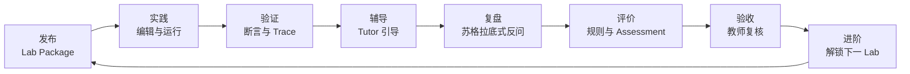
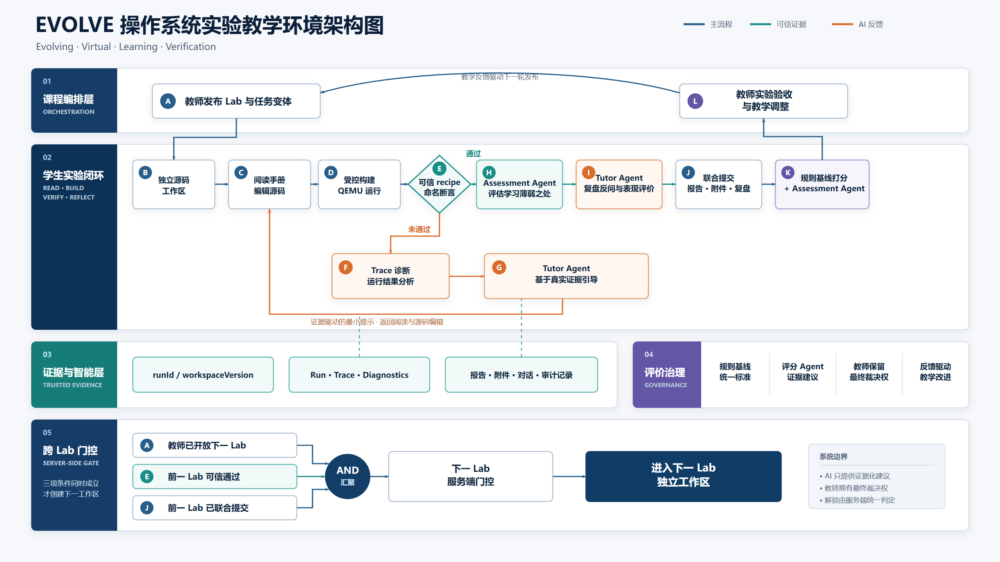
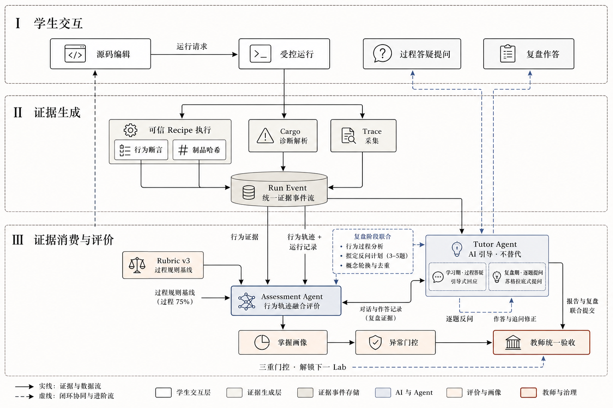

# EVOLVE

# Evolving Virtual OS Learning & Verification Environment

EVOLVE 是面向操作系统课程的渐进式实验、可信验证与智能辅导环境。项目以 Rust、RISC-V 64 和 QEMU `virt` 为技术基线，在同一套教学内核上组织 Lab1-Lab8 的能力演进，并将代码编辑、受控运行、行为断言、Trace、AI 辅导、学习评价和教师复核连接为可追踪的教学闭环。

本项目关注的核心问题是：在生成式 AI 可以直接产出代码的背景下，如何让操作系统实验仍然能够促进机制理解、工程实践与可验证的学习过程。

> 完整的问题分析、系统设计、实验数据与实现边界见 [EVOLVE 总体实验技术文档](EVOLVE总体实验技术文档.md)。

## 项目入口

| 入口 | 内容 |
| --- | --- |
| [总体实验技术文档](EVOLVE总体实验技术文档.md) | 项目背景、相关工作、系统设计、实验评估、团队协作与附录 |
| [自研系统源码](os-lab/) | Rust 教学内核、实验平台、Tutor、Assessment、知识库与测试 |
| [Lab 实验总览](os-lab/labs/overview.md) | Lab1-Lab8 的知识地图、实验任务和验证路径 |
| [环境与复现指南](docs/environment_setup.md) | Rust、QEMU、Node.js 与本地环境配置 |
| [参考练习报告](docs/reference-report.md) | `tg-rcore-tutorial` 五章练习、补丁和 checker 结果 |
| [研发与验证记录](progress.md) | 版本演进、实现过程、测试记录与阶段收口 |
| [答辩演示文稿](EVOLVE答辩PPT.pptx) / [PDF](EVOLVE答辩PPT.pdf) | 项目答辩材料 |

## 研究目标与设计原则

EVOLVE 将操作系统实验视为一个由课程内容、运行事实、学习行为和教学决策共同构成的系统。设计遵循四项原则：

| 原则 | 工程落实 |
| --- | --- |
| 渐进式内核 | 单一 Rust 内核通过 `lab1` 到 `lab8` 的链式 feature 逐步引入 Trap、虚拟内存、进程、文件、信号、线程与同步 |
| 过程可验证 | 可信 recipe、代码版本、行为断言、诊断、Trace 与制品哈希共同定义一次有效运行，不把退出码等同于学习完成 |
| AI 引导 | Tutor 先执行意图判断、答案护栏和知识权限控制，再进行检索与生成；回复以追问、局部提示和可复验建议为主；基于行为实现苏格拉底式复盘提问 |
| 教师保留裁决权 | Assessment 只生成带证据的量规建议；风险项、改分、验收和申诉均进入教师复核与审计流程 |

项目形成如下教学闭环：



## 系统架构





## 实验体系

| Lab | 主题 | 代表性机制 | 指导文档 |
| --- | --- | --- | --- |
| Lab1 | 裸机启动 | RISC-V 启动、SBI、控制台 | [实验手册](os-lab/labs/lab1-bare-metal.md) |
| Lab2 | Trap 与多任务 | 中断、异常、系统调用、任务切换 | [实验手册](os-lab/labs/lab2-trap-and-task.md) |
| Lab3 | 内存管理 | 物理页、Sv39 页表、地址空间 | [实验手册](os-lab/labs/lab3-memory.md) |
| Lab4 | 进程管理 | `fork`、`exec`、`wait` | [实验手册](os-lab/labs/lab4-process.md) |
| Lab5 | 文件与管道 | 内嵌文件系统、fd、pipe | [实验手册](os-lab/labs/lab5-fs-and-sync.md) |
| Lab6 | 磁盘文件系统 | VirtIO、硬链接、`mmap`、stride | [实验手册](os-lab/labs/lab6-disk-fs.md) |
| Lab7 | IPC 与信号 | `dup`、signal、统一 fd | [实验手册](os-lab/labs/lab7-ipc-signal.md) |
| Lab8 | 线程与同步 | thread、mutex、semaphore、condvar、死锁检测 | [实验手册](os-lab/labs/lab8-thread-sync.md) |

## 验证与实验结果

| 验证层次 | 结果 |
| --- | --- |
| Node 单元与契约测试 | **143/143** 通过 |
| 8 个组件 crate 的 Rust host tests | **40/40** 通过 |
| Python knowledge tests | **32/32** 通过 |
| 自动与契约测试合计 | **215/215** 通过 |
| Lab1-Lab8 QEMU recipe | **8/8** 完成，行为与 Trace 断言 **54/54** 通过 |
| Tutor V3 真实模型评测 | 19 条用例，规则修正后综合分 **96**；无泄漏与证据忠实度均为 **100** |
| Assessment Harness | **5/5** 通过 |
| RAG Harness | 6 个案例通过契约门槛；教师内容泄漏率为 **0** |
| Tutor Server Smoke / VitePress build | 通过 |

## 快速开始

### 环境要求

- Rust stable，目标 `riscv64gc-unknown-none-elf`
- `rust-src`、`llvm-tools-preview`、`cargo-binutils`
- QEMU `qemu-system-riscv64` 7.0 或更高版本
- Node.js 22（教学工作台、Tutor Server 与 Node 测试）
- Python 3.11（知识处理与相关测试）

完整安装步骤和已验证版本见 [环境与复现指南](docs/environment_setup.md)。Windows 用户可基于 `scripts/activate-os-env.ps1` 创建本机 `.local.ps1` 配置。

### 运行教学内核

```powershell
Set-Location os-lab
cargo run -p kernel --features lab1 --release
```

Lab1-Lab5 可直接使用对应 feature 运行；Lab6-Lab8 需要 VirtIO 磁盘镜像，使用 Makefile recipe：

```bash
make test-lab6
make test-lab7
make test-lab8
```

### 启动教学工作台

首次运行先安装依赖：

```powershell
Set-Location os-lab/handbook
npm ci
```

分别启动 Tutor Server 与 VitePress 开发服务器：

```powershell
# 终端 1
npm run tutor

# 终端 2
npm run dev
```

### 执行主要验证

```powershell
Set-Location os-lab/handbook
npm test
npm run test:smoke
npm run build
```

## 仓库结构

```text
.
├── os-lab/
│   ├── kernel/              # 渐进式 RISC-V 教学内核
│   ├── user/                # 用户态运行库与验证程序
│   ├── os-*/                # 8 个可独立测试的组件 crate
│   ├── labs/                # Lab1-Lab8 手册与参考材料
│   ├── lab-packages/        # Lab 规格、变体、断言与发布记录
│   ├── scaffold/            # 学生工作区模板与 fill/debug 变体
│   ├── handbook/            # VitePress/Vue 工作台与 Tutor Server
│   ├── tutor/               # 可信运行、Tutor、RAG 与 Harness
│   ├── learning/            # 学习数据、Assessment、Rubric 与知识库
│   ├── tests/               # 集成验证说明
│   └── scripts/             # 验证、脚手架与镜像工具
├── docs/                    # 环境、复现、参考练习与阶段材料
├── assets/                  # 架构图、界面截图与评测图
├── reference-patches/       # 参考环境五章 exercise 补丁
├── scripts/                 # 根目录环境与文档构建脚本
├── EVOLVE总体实验技术文档.md # 完整技术报告
├── progress.md              # 研发与验证记录
└── README.md
```

## 文档与交付材料

| 材料 | 说明 |
| --- | --- |
| [EVOLVE总体实验技术文档.md](EVOLVE总体实验技术文档.md) | 当前完整实验报告与技术依据 |
| [docs/os-lab.md](docs/os-lab.md) | 自研系统验证、运行和教学工作台入口 |
| [os-lab/docs/agent-system-technical.md](os-lab/docs/agent-system-technical.md) | Tutor、Assessment、RAG 与证据门控实现 |
| [os-lab/docs/socratic-review-implementation.md](os-lab/docs/socratic-review-implementation.md) | 苏格拉底式复盘与教师复核流程 |
| [docs/reference-report.md](docs/reference-report.md) | 参考环境基线、exercise 与 checker 结果 |
| [docs/8.12阶段性实验技术文档.md](docs/8.12阶段性实验技术文档.md) | 阶段性技术文档归档 |
| [progress.md](progress.md) | 项目迭代、验证过程与协作记录 |

## 参考基线

赛题参考部分基于 `tg-rcore-tutorial` 的 `test` 分支、提交 `d6330a6`。项目完成 ch3、ch4、ch5、ch6 和 ch8 的 exercise，补丁保存在 [reference-patches/](reference-patches/)，复现过程及 checker 结果见 [参考练习报告](docs/reference-report.md)。EVOLVE 自研系统位于 `os-lab/`，不直接修改参考仓库源码。

## 适用边界

- 当前验证证明软件契约、AI 行为边界和关键内核路径在记录环境中可复现；真实学习增益仍需通过课堂样本、对照实验和长期数据检验。
- Runner 面向本地教学和受控单机场景，不应直接视为公网多租户安全沙箱；公网部署需要额外的容器或虚拟机隔离、资源配额与网络策略。
- 教学内核优先保证机制清晰和实验可观察性，部分文件系统、内存和多核机制采用教学化实现；具体限制以技术文档为准。
- 模型评测衡量当前案例集上的策略与输出契约，不代表模型在未覆盖问题上的绝对正确性。

## 许可证

- `os-lab/` 自研源码采用 [BSD 3-Clause License](os-lab/LICENSE)。
- `docs/` 及同步到教学手册的技术文档采用 [CC BY-SA 4.0](docs/LICENSE)。

第三方教材、论文和参考项目仍遵循各自的版权与许可条款。
