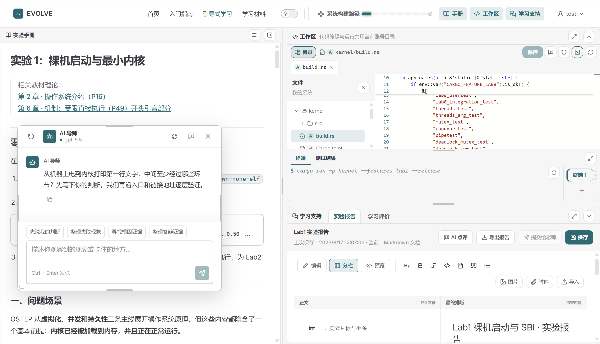
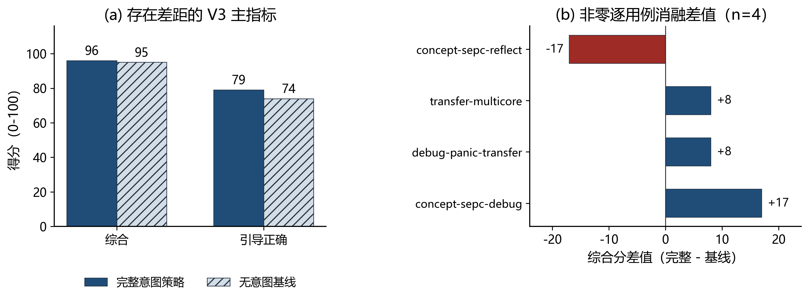

# EVOLVE: Evolving Virtual OS Learning & Verification Environment

EVOLVE 是一套面向操作系统课程的渐进式实验、可信验证与智能辅导环境。系统以 Rust + RISC-V 64 教学内核为基础，覆盖 Lab1-Lab8，并提供学生隔离工作区、受控运行、行为断言、编译诊断、Trace、AI 导师、知识库、学习评价和教师管理。

## 系统架构

EVOLVE 总体架构：以 Rust + RISC-V 64 教学内核为基础，串联 Lab 平台、可信执行、AI Tutor 与学习评价体系。

## 仓库总览

本仓库汇总 EVOLVE 当前阶段的源码、实验内容、技术文档和答辩材料。

| 阶段性材料 | 说明 |
| --- | --- |
| [docs/8.12阶段性实验技术文档.md](docs/8.12阶段性实验技术文档.md) | **阶段性技术文档**：架构、内核、教学平台、AI/RAG、评价、测试、分工与比赛收获 |
| [docs/8.12阶段性PPT.pptx](docs/8.12阶段性PPT.pptx) | **阶段性答辩演示文稿** |
| [EVOLVE总体实验技术文档.md](EVOLVE总体实验技术文档.md) | 完整实验报告文档 |
| [os-lab/](os-lab/) | EVOLVE 当前实现源码、实验手册、教学服务与测试 |
| [progress.md](progress.md) | 开发过程和阶段记录 |

## 目录结构

| 路径 | 说明 |
| --- | --- |
| [os-lab/](os-lab/) | EVOLVE 主工程：Cargo workspace、内核、教学服务、实验手册与测试 |
| [docs/](docs/) | 阶段性技术文档、答辩 PPT、环境配置与参考复现报告 |
| [assets/](assets/) | README 引用的架构图、界面截图与评测结果图 |
| [reference-patches/](reference-patches/) | 参考环境练习补丁 |
| [scripts/](scripts/) | 环境激活与文档构建脚本 |
| [student-labs/](student-labs/) | 学生实验工作区示例与检查记录 |

## 项目基线

本仓库在赛题参考环境 **[tg-rcore-tutorial](https://github.com/rcore-os/tg-rcore-tutorial)** 基础上开展练习与自研工作：

| 项 | 说明 |
| --- | --- |
| 参考环境 | `tg-rcore-tutorial`（branch `test`，commit `d6330a6`） |
| 30% 练习 | 在参考环境 ch3/ch4/ch5/ch6/ch8 完成 exercise，补丁见 `reference-patches/` |
| 70% 自研 | 独立实现 EVOLVE；源码位于 `os-lab/`，不修改上游参考仓库 |

当前实现与技术边界以 `docs/8.12阶段性实验技术文档.md` 为准；参考环境的复现过程见 [docs/reference-report.md](docs/reference-report.md)。

## 许可证与证书核查

| 范围 | 许可证 | 文件 |
| --- | --- | --- |
| 技术文档（`docs/`、`os-lab/docs/`、`os-lab/labs/` 等 Markdown） | **CC BY-SA 4.0** | [docs/LICENSE](docs/LICENSE) |
| EVOLVE 自研源码（`os-lab/` workspace） | **BSD-3-Clause** | [os-lab/LICENSE](os-lab/LICENSE)、[os-lab/Cargo.toml](os-lab/Cargo.toml) |

`docs/` 目录及其子目录中的 Markdown 技术文档采用 **[CC BY-SA 4.0](https://creativecommons.org/licenses/by-sa/4.0/)** 许可：署名 OS Lab Team；再发布或演绎时须以相同许可（BY-SA）共享。许可证全文见 `docs/LICENSE`。

核查结论（2026-08-17）：仓库内未发现 TLS 证书、私钥或签名证书文件（`*.crt`、`*.pem`、`*.key`、`*.pfx`、`*.p12` 等）；现有许可证均为无固定有效期的开源许可，两份 LICENSE 的版权年份为 2026，无需重新生成或续期。后续若引入 HTTPS 证书，按实际部署域名和有效期单独管理即可。

## 按赛题权重

### 30%：参考环境练习

| 文档 | 说明 |
| --- | --- |
| [docs/reference-report.md](docs/reference-report.md) | 参考环境 base/exercise、checker 结果与复现命令 |
| [reference-patches/](reference-patches/) | 相对基线 `d6330a6` 的练习实现补丁 |

### 70%：EVOLVE 自研系统

| 文档或目录 | 说明 |
| --- | --- |
| [docs/8.12阶段性实验技术文档.md](docs/8.12阶段性实验技术文档.md) | **当前阶段完整技术说明与实现边界** |
| [docs/os-lab.md](docs/os-lab.md) | 环境验证、复现和教学工作台入口 |
| [os-lab/docs/agent-system-technical.md](os-lab/docs/agent-system-technical.md) | AI 导师、证据门控、RAG 与评价技术说明 |
| [os-lab/handbook/docs/workbench-ui.md](os-lab/handbook/docs/workbench-ui.md) | 学生工作台和教师端交互契约 |
| [os-lab/docs/socratic-review-implementation.md](os-lab/docs/socratic-review-implementation.md) | 苏格拉底式复核实现说明 |
| [os-lab/lab-packages/](os-lab/lab-packages/) | Lab1-Lab8 机器可读规格和任务变体 |

学生隔离工作区与实验界面：

## 验证与交付

| 入口 | 说明 |
| --- | --- |
| [docs/8.12阶段性实验技术文档.md](docs/8.12阶段性实验技术文档.md) | 当前测试结果、实现说明和团队分工 |
| [docs/8.12阶段性PPT.pptx](docs/8.12阶段性PPT.pptx) | 当前阶段答辩材料 |
| [docs/environment_setup.md](docs/environment_setup.md) | Rust、QEMU、Git 安装与配置 |
| [.github/workflows/os-lab-ci.yml](.github/workflows/os-lab-ci.yml) | Node、Python、Rust、QEMU 与 VitePress CI |
| [progress.md](progress.md) | 研发过程、验证记录和阶段收口 |

Prompt 评测与消融实验结果：

## 附录：初赛归档

| 文档 | 说明 |
| --- | --- |
| [docs/初赛项目总报告.md](docs/初赛项目总报告.md) | 初赛项目报告归档，不作为本次阶段性技术说明 |
| [docs/初赛PPT.pptx](docs/初赛PPT.pptx) | 初赛答辩材料归档 |

## 代码入口

| 路径 | 说明 |
| --- | --- |
| [os-lab/Cargo.toml](os-lab/Cargo.toml) | 10 成员 Cargo Workspace：kernel、user 与 8 个组件 crate |
| [os-lab/kernel/](os-lab/kernel/) | Lab1-Lab8 渐进式 RISC-V 教学内核 |
| [os-lab/handbook/](os-lab/handbook/) | VitePress/Vue 教学工作台与 Tutor Server |
| [os-lab/tutor/](os-lab/tutor/) | 可信 recipe、Tutor 策略、证据契约与评测 |
| [os-lab/learning/](os-lab/learning/) | 学习数据、评价、复核和知识库 |
| `reference/`（本地 clone，可选） | 上游参考仓库；练习 diff 已提交至 [reference-patches/](reference-patches/) |
