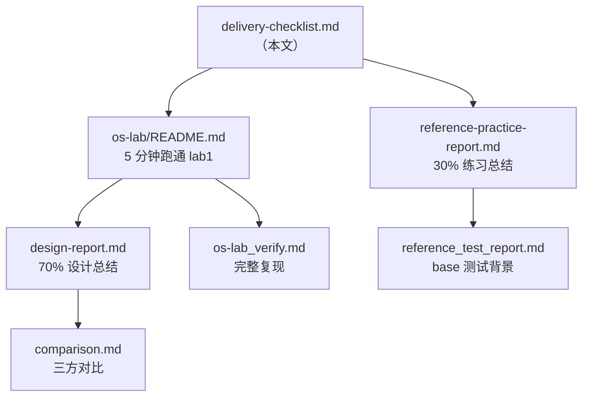

# 赛题交付清单

> 对应 [Task.md](../Task.md) 技术指标与评审四维度（创新性 30%、完整性 20%、代码质量 25%、文档完整性 25%）。  
> 评审方建议从本文开始，按「快速验证」或「完整验证」任选一条路径复现。

## 1. 赛题主线对照

| 权重 | 赛题要求 | 交付状态 | 主入口 |
| --- | --- | --- | --- |
| **30%** | 参考环境 5 章 **练习（exercise）** + 练习实现总结报告 | ✅ 已完成 | [reference-practice-report.md](reference-practice-report.md) |
| **70%** | 自研 `os-lab` 教学环境 + 设计总结报告 + 对比评估 + 习题/答案 | ✅ 已完成 | [os-lab.md](os-lab.md) → [design-report.md](../os-lab/docs/design-report.md) |

### 1.1 参考练习（30%）验收摘要

| 章节 | checker（exercise） | 报告章节 |
| --- | --- | --- |
| ch3 `sys_trace` | **7/7** | [reference-practice-report.md §2](reference-practice-report.md) |
| ch4 `mmap`/`munmap` | **16/16** | 同上 |
| ch5 `spawn` + stride | **17/17** | 同上 |
| ch6 硬链接 + `fstat` | **33/33** | 同上 |
| ch8 死锁检测 | **25/25** | 同上 |

- **base 测试**（参考框架自带，非 exercise）：见 [reference_test_report.md](reference_test_report.md)  
- **本地实现位置**：`reference/tg-rcore-tutorial/`（可选 clone；练习 diff 已提交至 [reference-patches/](../reference-patches/)）  
- **复现命令**：见 [reference-practice-report.md §5](reference-practice-report.md)

### 1.2 自研环境（70%）验收摘要

| 类别 | 数量/状态 | 主入口 |
| --- | --- | --- |
| Lab 实验（QEMU） | lab1–lab5 均可运行 | [os-lab/labs/overview.md](../os-lab/labs/overview.md) |
| 实验指导 | 5 篇 | `os-lab/labs/lab*.md` |
| **Web 学习手册** | VitePress 静态站 | [docs/handbook.md](handbook.md) → `os-lab/handbook/` |
| 习题 + 参考答案 | 各 5 篇 | `os-lab/labs/exercises/`、`os-lab/labs/answers/` |
| 组件单元测试（host） | **24/24** 通过 | [os-lab_verify.md §17](os-lab_verify.md) |
| clippy 全绿 | workspace + lab1–lab5 feature | [os-lab_verify.md §17](os-lab_verify.md) |
| 设计总结报告 | 1 篇 | [design-report.md](../os-lab/docs/design-report.md) |
| 三方对比 + 学习效率 | 1 篇 + 数据附录 | [comparison.md](../os-lab/docs/comparison.md)、[comparison-data.md](../os-lab/docs/comparison-data.md) |
| AI 协作记录 | 1 篇 | [ai-collaboration.md](../os-lab/docs/ai-collaboration.md) |
| 许可证 | BSD-3-Clause | [os-lab/LICENSE](../os-lab/LICENSE) |

---

## 2. 交付物文件清单

### 2.1 仓库根目录与通用文档

| 路径 | 用途 |
| --- | --- |
| [Task.md](../Task.md) | 赛题原文 |
| [README.md](../README.md) | **仓库总览**（评审导航、基线说明、许可证、文档授权） |
| [docs/LICENSE](LICENSE) | 技术文档 CC BY-SA 4.0 许可证 |
| [docs/technical-proposal.md](technical-proposal.md) | **完整技术方案文档**（大赛提交用） |
| [docs/delivery-checklist.md](delivery-checklist.md) | 本文：交付清单与验收路径 |
| [docs/environment_setup.md](environment_setup.md) | Rust / QEMU / Git 环境安装 |
| [docs/os-lab_verify.md](os-lab_verify.md) | 自研环境分 Day 验证指令（可复制执行） |
| [docs/reference-practice-report.md](reference-practice-report.md) | 参考练习实现总结（30%） |
| [docs/reference_test_report.md](reference_test_report.md) | 参考 base 测试记录 |
| [docs/project_plan.md](project_plan.md) | 项目计划与分工（过程文档） |
| [scripts/activate-os-env.ps1](../scripts/activate-os-env.ps1) | Windows 实验环境激活 |
| [progress.md](../progress.md) | 施工与验证进度日志 |

### 2.2 自研代码与教学文档（`os-lab/`）

| 路径 | 用途 |
| --- | --- |
| [os-lab/README.md](../os-lab/README.md) | 自研环境快速开始 |
| [os-lab/kernel/](../os-lab/kernel/) | 单内核主体（feature `lab1`–`lab5`） |
| [os-lab/os-sbi/](../os-lab/os-sbi/) … [os-fs/](../os-lab/os-fs/) | 6 个组件 crate |
| [os-lab/user/](../os-lab/user/) | 用户态测试程序 |
| [os-lab/handbook/](../os-lab/handbook/) | **Web 学习手册**（VitePress：文档聚合 + 学习进度） |
| [os-lab/labs/](../os-lab/labs/) | 实验指导、习题、答案 |
| [os-lab/docs/design-report.md](../os-lab/docs/design-report.md) | 设计总结报告（70% 核心） |
| [os-lab/docs/architecture.md](../os-lab/docs/architecture.md) | 架构与数据流 |
| [os-lab/docs/comparison.md](../os-lab/docs/comparison.md) | 三方对比与学习效率 |
| [os-lab/tests/README.md](../os-lab/tests/README.md) | 集成测试与 Day6/Day7 细则 |
| [os-lab/LICENSE](../os-lab/LICENSE) | BSD-3-Clause 许可证 |

### 2.3 参考练习补丁

| 路径 | 用途 |
| --- | --- |
| [reference-patches/](../reference-patches/) | ch3/ch4/ch5/ch6/ch8 exercise `.patch`（基线 `d6330a6`） |
| [reference-patches/README.md](../reference-patches/README.md) | 补丁清单与应用说明 |
| `reference/tg-rcore-tutorial/`（可选 clone） | 完整参考仓库；打补丁后复现 exercise |

---

## 3. 评审维度自查

| 维度 | 权重 | 对应交付物 | 自查结论 |
| --- | --- | --- | --- |
| **创新性** | 30% | 单内核 feature gate、问题驱动文档、AI 协作模板、精简 crate 拆分 | ✅ 见 [design-report.md §四](../os-lab/docs/design-report.md)、[comparison.md](../os-lab/docs/comparison.md) |
| **完整性** | 20% | lab1–5 可运行、5 章参考 exercise 全绿、指导/习题/答案齐全 | ✅ |
| **代码质量** | 25% | 24 项单元测试、clippy `-D warnings`、QEMU 关键输出可复现 | ✅ 2026-06-27 终验 |
| **文档完整性** | 25% | 设计报告、对比分析、实验指导、验证文档、交付清单 | ✅ 见 [README.md](../README.md)、[delivery-checklist.md](delivery-checklist.md) |

---

## 4. 评审方验证路径

### 4.1 快速验证（约 15 分钟）

**环境**：先读 [environment_setup.md](environment_setup.md)，再执行：

```powershell
cd <仓库根目录>
. .\scripts\activate-os-env.ps1
```

**自研 os-lab（抽样）**

```powershell
cd os-lab
cargo run -p kernel --features lab1 --release    # 期望：Hello, OS!
cargo run -p kernel --features lab5 --release    # 期望：fs_test pass、pipe_test pass
cargo test -p os-context -p os-syscall -p os-sbi -p os-fs --target x86_64-pc-windows-msvc
```

**参考 exercise（需先 clone 参考仓库到 `reference/`）**

```powershell
$env:CHAPTER = "6"
cd reference\tg-rcore-tutorial\tg-rcore-tutorial-ch6
cargo clean
cargo run --features exercise 2>&1 | Tee-Object ..\..\os-lab\ch6-check.out
Get-Content ..\..\os-lab\ch6-check.out | tg-rcore-tutorial-checker --ch 6 --exercise
# 期望：Test PASSED: 33/33
```

### 4.2 完整验证（终验标准）

按 [os-lab_verify.md §17](os-lab_verify.md) 一键块执行：workspace 编译、clippy、24 项单元测试、lab5→lab1 QEMU 倒序回归。

参考 exercise 五章分别设置 `CHAPTER=3/5/6/8`（ch4 任意非负）后 `cargo clean` + `cargo run --features exercise`，用 checker 验收；详见 [reference-practice-report.md §5](reference-practice-report.md)。

---

## 5. 未纳入 Git 的说明

| 项 | 原因 | 评审方如何获取 |
| --- | --- | --- |
| `reference/` | `.gitignore`：第三方教程仓库体积大（约 1.5GB） | 按 [reference_test_report.md §1](reference_test_report.md) clone 基线后，应用 [reference-patches/](../reference-patches/) 内补丁 |
| `os-lab/ch*.out`、`_tmp-*.txt` | 本地 QEMU/构建日志，非正式交付物 | 评审方自行运行生成，或阅读报告中的 checker 摘要 |
| `**/*.local.ps1` | 本机路径配置 | 使用 `scripts/activate-os-env.ps1` 或自建 `*.local.ps1` |

---

## 6. 推荐阅读顺序（评审方）



1. **本文** → 了解交付范围与验收状态  
2. **[design-report.md](../os-lab/docs/design-report.md)** → 自研环境设计与评审自查  
3. **[reference-practice-report.md](reference-practice-report.md)** → 参考练习实现与 AI 协作  
4. **[os-lab_verify.md](os-lab_verify.md)** → 动手复现  
5. **[labs/overview.md](../os-lab/labs/overview.md)** → 教学实验与知识点地图  

---

## 7. 版本与状态

| 项 | 值 |
| --- | --- |
| 交付状态 | **可提交评审**（2026-06-27） |
| 自研终验 | clippy 全绿 + lab1–5 QEMU + 24 项单测 |
| 参考 exercise | ch3/ch4/ch5/ch6/ch8 checker 全绿 |
| 进度日志 | [progress.md](../progress.md) 最新条目 |
