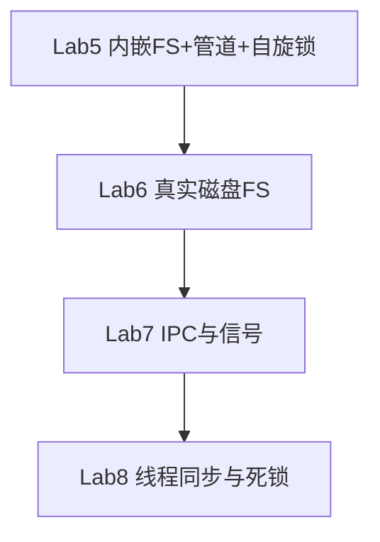

# Lab6–8 二期总览

> os-lab 扩展 **Lab6（磁盘 FS）→ Lab7（IPC 与信号）→ Lab8（线程与同步）** 的依赖、分工、验收与进度。  
> 一期 Lab1–5 见 [progress.md](../progress.md)。  
> 文档更新：2026-07-26（Lab1–8 二期交付完成）

| 项目 | 内容 |
|------|------|
| 周期 | 4 周集中交付（第 0 周前置 + 第 1–4 周） |
| 团队 | 3 人（成员 A 内核 / 成员 B 组件与测例 / 成员 C 文档） |
| 前置条件 | Lab1–Lab5 已交付 |

---

## 一、里程碑

| 里程碑 | 目标 | 状态 | 证据 |
|--------|------|------|------|
| **M0** | 第 0 周：feature 骨架 + mmap/spawn/stride + 接口冻结 | ✅ | A/B/C 代码与文档已合入 |
| **M-L6** | 第 1 周末：Lab6 QEMU 通过 link/fstat 测例 | ✅ | `make test-lab6` 全链通过 |
| **M-L7** | 第 2 周末：Lab7 信号 + 管道 IPC | ✅ | `make test-lab7` 全链 pass |
| **M-L8** | 第 3 周末：Lab8 线程/同步/死锁 | ✅ | `make test-lab8` 8 行 expected |
| **M-DONE** | 第 4 周末：Lab1–8 回归 + 文档齐全 | ✅ | 本文 §五–§十四 |

图例：✅ 完成 · 🟡 进行中 · ⬜ 未开始

---

## 二、依赖关系

### 2.1 一句话

**Lab6 → Lab7 → Lab8 必须按顺序做**，对应参考环境 **ch6 → ch7 → ch8**。

### 2.2 依赖链



| 依赖 | 原因 |
|------|------|
| Lab5 → Lab6 | Lab5 有 fd 表与管道骨架；Lab6 将 `os-fs` 升级为磁盘 FS |
| Lab6 → Lab7 | ch7 `initproc` 从磁盘 FS 加载；统一 fd 对接真实文件 |
| Lab7 → Lab8 | ch8 exercise 会回归前期输出；须保持 Lab7 信号/管道可用 |

### 2.3 与 tg-rcore-tutorial 对照

| os-lab | 参考章节 | 核心内容 | 验收 |
|--------|---------|---------|------|
| **Lab6** | ch6 | VirtIO、easy-fs、`linkat`/`unlinkat`/`fstat` | `make test-lab6` |
| **Lab7** | ch7 | 统一 fd、信号、`dup`；重构 Lab5 管道 | `make test-lab7`（自建 expected） |
| **Lab8** | ch8 | 线程、mutex/semaphore/condvar、死锁 | `make test-lab8` |

> ch7 无官方 exercise checker 分数；os-lab 以 `labs.json` + 用户测例定义验收。

### 2.4 Lab6 前置（第 0 周）

| 前置项 | 模块 | 说明 |
|--------|------|------|
| `mmap`/`munmap` | `mm.rs` | ch6 exercise 依赖 |
| `spawn` syscall | `process.rs` | 从 `fs.img` 加载 ELF |
| stride + `set_priority` | 调度器 | ch5 exercise 对齐 |
| `fs.img` 构建 | `build.rs` | Lab6 磁盘镜像 |

### 2.5 Lab6 内部分阶段

| 阶段 | 内容 |
|------|------|
| **6a base** | VirtIO + easy-fs + `file_test` |
| **6b exercise** | `link`/`unlink`/`fstat` + spawn 从镜像加载 |

### 2.6 组件 Crate

| Crate | 时机 | 职责 |
|-------|------|------|
| `os-fs`（扩展） | Lab6 | 内嵌表 → 磁盘 inode |
| `os-signal` | Lab7 | 信号集/动作/屏蔽字 |
| `os-sync` | Lab8 | 阻塞 mutex/semaphore/condvar |

### 2.7 Feature Gate（已落地）

```toml
lab6 = ["lab5", "easy-fs", "virtio-drivers", "spin"]
lab7 = ["lab6", "dep:os-signal"]
lab8 = ["lab7", "dep:os-sync"]
```

### 2.8 范围外

网络驱动、GPU/键盘等 ch8 扩展驱动、ch3 `sys_trace`（一期未实现）。

---

## 三、分工与排期

### 3.1 团队

| 成员 | 职责 | 目录 |
|------|------|------|
| **A** | 内核、feature、VirtIO/信号/线程/死锁 | `os-lab/kernel/` |
| **B** | 组件 crate、用户测例、host 单测、Makefile | `os-*/`、`user/`、`tests/` |
| **C** | 指导书、习题、答案、overview/handbook | `os-lab/labs/`、`handbook/` |

### 3.2 协作接口

| 接口 | 提供方 | 交付物 |
|------|--------|--------|
| syscall 签名 | A | 本文 §十一–§十三 |
| expected 输出 | B | `handbook/data/labs.json` |
| 验证命令 | B | `make test-lab6/7/8` |
| 知识点图 | C | `os-lab/labs/overview.md` |

### 3.3 四周排期

| 阶段 | 目标 | 状态 |
|------|------|------|
| 第 0 周 | feature + mmap/spawn/stride | ✅ |
| 第 1 周 | **Lab6** 文件系统 | ✅ |
| 第 2 周 | **Lab7** IPC 与信号 | ✅ |
| 第 3 周 | **Lab8** 线程与同步 | ✅ |
| 第 4 周 | Lab1–8 回归 + 文档终审 | ✅ |

### 3.4 各周任务摘要

**第 0 周**：`lab6/7/8` feature；mmap/spawn/stride；syscall 接口冻结（§十一）。

**第 1 周 Lab6**：VirtIO、`fs.img`、磁盘 FS、`link`/`unlink`/`fstat`；`make test-lab6`。

**第 2 周 Lab7**：统一 fd、信号框架、`os-signal`、`dup`；`make test-lab7`。

**第 3 周 Lab8**：双层线程、`os-sync`、死锁检测、`lab8_integration_test`；`make test-lab8`。

**第 4 周**：host 单测扩展、三件套自查、Lab6–8 QEMU 回归、`progress.md` 更新。

### 3.5 风险与应对（摘要）

| 风险 | 应对 |
|------|------|
| VirtIO + easy-fs 超预期 | 先 6a base，再 6b exercise |
| Lab5 管道与 ch7 冲突 | Lab7 先做 fd 迁移重构 |
| Lab8 范围大 | 最小交付：线程 + 阻塞同步 + pipetest + 死锁 |
| 无本地 reference 目录 | 以 `reference-patches/` 为对照 |

---

## 四、验证方法

### 4.1 环境（Windows）

```powershell
cd E:\HomeWorkForDaSE\Or2-1-OS
. .\scripts\activate-os-env.ps1
cd os-lab
```

详见 [environment_setup.md](environment_setup.md)。

### 4.2 编译冒烟

```powershell
make check          # lab1–lab8 feature
cargo check -p kernel --features lab6   # 或 lab7 / lab8
```

### 4.3 QEMU 验收（Lab6–8 须 VirtIO + fs.img）

```powershell
make test-lab6
make test-lab7
make test-lab8
```

Lab8 建议先编 user 再编 kernel 以刷新 `fs.img`：

```powershell
cargo build -p user --bin lab8_integration_test --release --target riscv64gc-unknown-none-elf
cargo build -p kernel --features lab8 --release
make test-lab8
```

> 勿用裸 `cargo run --features lab6`（默认 runner 无 VirtIO）。

### 4.4 host 单测

```powershell
cargo test -p os-context -p os-syscall -p os-sbi -p os-fs -p os-signal -p os-sync -p os-alloc -p os-vm --target x86_64-pc-windows-msvc
```

2026-07-26：**42 passed**（≥24 目标）。

| Crate | 测试数 |
|-------|--------|
| os-alloc | 6 |
| os-context | 3 |
| os-fs | 11 |
| os-sbi | 2 |
| os-signal | 4 |
| os-sync | 7 |
| os-syscall | 4 |
| os-vm | 5 |

---

## 五、文档与 `labs.json` 验收

### 5.1 三件套

| Lab | 指导书 | 习题 | 答案 |
|-----|--------|------|------|
| Lab6 | `labs/lab6-disk-fs.md` | `exercises/lab6-exercises.md` | `answers/lab6-answers.md` |
| Lab7 | `labs/lab7-ipc-signal.md` | `exercises/lab7-exercises.md` | `answers/lab7-answers.md` |
| Lab8 | `labs/lab8-thread-sync.md` | `exercises/lab8-exercises.md` | `answers/lab8-answers.md` |

`overview.md` 与 handbook 侧栏已含 Lab6–8 路由。

### 5.2 `expected` 与指导书对照

**Lab6**（`make test-lab6`）：`file_test pass`、`Test link OK!`、`mass open/unlink OK!`、`mmap_test pass`、`spawn_test pass`、`stride_test pass`、`fs_test pass`、`pipe_test pass`。

**Lab7**（`make test-lab7`）：`dup_test pass`、`signal_test pass`、`signal_mask_test pass`、`pipe_test pass`。

**Lab8**（`make test-lab8`，initproc `lab8_integration_test`）：`threads_test pass`、`threads_arg_test pass`、`mutex_test pass`、`condvar_test pass`、`pipetest passed!`、`deadlock test mutex 1 OK!`、`deadlock test semaphore 1 OK!`、`pipe_test pass`。

### 5.3 接口文档与指导书交叉引用

| 内容 | 本文章节 | 指导书 |
|------|----------|--------|
| Lab6 syscall | §十一 | lab6 §零 |
| Lab7 syscall | §十二 | lab7 §零 |
| Lab8 syscall | §十三 | lab8 §零 |
| ch8 继承测例 | §十四 | lab8 §2.6 |

---

## 六、QEMU 回归结论

| Lab | 命令 | 结果 |
|-----|------|------|
| Lab6 | `make test-lab6` | ✅ |
| Lab7 | `make test-lab7` | ✅ |
| Lab8 | `make test-lab8` | ✅（2026-07-26） |
| Lab1–5 | 一期交叉回归 | ✅（见 `progress.md`） |

**Lab8 关键修复**（2026-07-26）：

- exec 地址空间复用（`unmap_range`，消除 `MemorySet` 泄漏）
- 内核堆 1MB；initproc `lab8_integration_test`
- condvar：`wait_with_mutex` 入队释放 mutex；`signal` + `unlock` handoff
- 阻塞路径识别 `mutex_handoff`，完成 syscall 返回用户态

---

## 七、交付物清单

| 类别 | 路径 |
|------|------|
| 二期总览 + syscall 接口 | `docs/lab6-8.md`（本文档） |
| 实验指导 | `os-lab/labs/lab6-disk-fs.md` … `lab8-thread-sync.md` |
| 习题与答案 | `os-lab/labs/exercises/`、`answers/` |
| 用户测例 | `os-lab/user/src/bin/` |
| `os-signal` / `os-sync` | `os-lab/os-signal/`、`os-sync/` |
| 手册 | `os-lab/handbook/data/labs.json` |
| 参考补丁 | [reference-patches/](../reference-patches/) |

---

## 八、进度摘要（按周）

| 周次 | A（内核） | B（测例/组件） | C（文档） |
|------|-----------|----------------|-----------|
| 0 | feature、mmap/spawn/stride | 用户 syscall、Makefile | overview、前置知识 |
| 1 Lab6 | VirtIO、磁盘 FS、link/fstat | `lab6_usertest`、os-fs 测 | lab6 三件套 |
| 2 Lab7 | `os-signal`、统一 fd、信号 syscall | `lab7_usertest`、fd_kind 测 | lab7 三件套 |
| 3 Lab8 | `processor`、`os-sync`、死锁 | `lab8_integration_test`、os-sync 7 测 | lab8 三件套 |
| 4 | exec/condvar 修复、堆 1MB | host 42 项、QEMU 回归 | 自查、comparison 更新 |

---

## 九、变更日志

### 2026-07-26 — Lab8 QEMU 全链 + M-DONE

- `make test-lab8` 8 行 expected + `All threads exited`
- 文档合并为 `docs/lab6-8.md`（含 syscall 接口 §十一–§十四）
- `labs.json` Lab8 checklist 改为 `lab8_integration_test`
- host：`os-sync` 7 项 → workspace 42 passed
- `progress.md`、根 README、`technical-proposal.md` 二期同步列入 §十五待补

### 2026-07-25 — 第 4 周收尾

- Lab6–8 三件套自查；Lab7 QEMU 全链
- Lab8 初测：condvar 前 OOM / scheduler stall（已于 07-26 修复）

### 2026-07-25 — M0 + M-L6

- `make test-lab6` 全链 pass；三方交叉验收 10 项 ✅

---

## 十一、Lab6 系统调用接口

> 成员 A 交付。对应内核 feature：`lab6`（含第 0 周前置：`mmap`/`munmap`、`spawn`、`set_priority` + stride 调度）。

### 11.1 继承 syscall（Lab1–5）

与 Lab5 相同。用户态包装见 `os-lab/user/src/syscall.rs`。

| 编号 | 名称 | 说明 |
|------|------|------|
| 64 | write | 标准输出 / 管道写 |
| 93 | exit | 进程退出 |
| 124 | yield | 主动让出 CPU |
| 172 | getpid | 当前 PID |
| 220 | clone | 教学简化 fork |
| 221 | execve | `a1` = 路径字节长度（非 argv） |
| 260 | wait4 | 等待子进程 |
| 56 | openat | `a1` = 路径长度，`a2` = open flags |
| 57 | close | 关闭 fd |
| 63 | read | 读文件 / 管道 |
| 59 | pipe | `a0` → `[read_fd, write_fd]` |

### 11.2 Lab6 新增 syscall

**内存（ch4 exercise 前置）**

| 编号 | 名称 | 参数 | 返回值 |
|------|------|------|--------|
| 222 | mmap | addr, len, prot, flags, fd, offset | 0 / -1 |
| 215 | munmap | addr, len | 0 / -1 |

`prot`：`0x1` R、`0x2` W、`0x4` X。`addr`、`len` 页对齐（4096）；区间不得重叠。

**进程（ch5 exercise 前置）**

| 编号 | 名称 | 参数 | 返回值 |
|------|------|------|--------|
| 400 | spawn | path, path_len | 子 PID / -1 |
| 140 | set_priority | prio | prio / -1（`prio < 2`） |

`spawn` 从磁盘 `fs.img` 加载 ELF；`set_priority` 设置 stride 优先级（默认 16）。

**文件系统（ch6）**

| 编号 | 名称 | 参数 | 返回值 |
|------|------|------|--------|
| 37 | linkat | olddirfd, oldpath, newdirfd, newpath, flags | 0 / -1 |
| 35 | unlinkat | dirfd, path, flags | 0 / -1 |
| 80 | fstat | fd, stat_buf | 0 / -1 |

路径为以 `\0` 结尾的 C 字符串。`openat flags`：`RDONLY=0`、`WRONLY=1`、`RDWR=2`、`CREATE=512`、`TRUNC=1024`。

`fstat` 输出 `os_syscall::Stat`：`dev`、`ino`、`mode`（`FILE=0o100000`、`DIR=0o040000`）、`nlink` 等。硬链接由 `FileIndex` 维护；`unlink` 细粒度锁避免死锁。

### 11.3 错误码

| 返回值 | 含义 |
|--------|------|
| `0` | 成功（void） |
| `>0` | 成功（fd、pid、字节数等） |
| `-1` | 通用失败 |

### 11.4 构建验证

```powershell
cargo check -p kernel --features lab6
make test-lab6
```

`build.rs` 打包 `fs.img`；initproc 默认 `lab6_usertest`。

### 11.5 与成员 B/C 的接口

| 消费方 | 用途 |
|--------|------|
| B | `file_test`、`link`/`fstat` 测例；`labs.json` verifyCmd |
| C | Lab6 指导书 syscall 表、习题 3–5 答案对照 |

冻结点：第 0 周末（随 Lab6 内核合入）。

---

## 十二、Lab7 系统调用接口

> 对应 feature：`lab7`（继承 lab6 全部能力）。

### 12.1 继承

与 Lab6 相同，见 [§十一](#十一lab6-系统调用接口)。

### 12.2 统一 fd 抽象

`kernel/src/fs/disk.rs` 中 `FdType` 分发：

| 类型 | read | write |
|------|------|-------|
| Regular | ✅ | ✅ |
| PipeRead | ✅ | ❌ |
| PipeWrite | ❌ | ✅ |

`read`/`write`/`close`/`dup` 经同一 fd 表；管道 fd 的 `files[]` 槽位为 `None`。

**dup**：复制 fd 表项；管道增加引用计数；常规文件共享 `OpenedFile` 与偏移。

### 12.3 Lab7 新增 syscall

**dup**

| 编号 | 名称 | 参数 | 返回值 |
|------|------|------|--------|
| 23 | dup | old_fd | 新 fd / -1 |

**信号**

| 编号 | 名称 | 参数 | 返回值 |
|------|------|------|--------|
| 129 | kill | pid, signum | 0 / -1 |
| 134 | sigaction | signum, action, old_action | 0 / -1 |
| 135 | sigprocmask | mask | 旧 mask |
| 139 | sigreturn | — | 0 / -1 |

`SignalAction`：`handler`（0=默认）、`mask`。默认：`SIGKILL(9)`/`SIGINT(2)` 终止，其他忽略。`SIGKILL` 不可屏蔽。

`kill`：`pid` 为正且存在；`signum` 范围 `1..=31`。

`sigaction`：`action == 0` 查询；`old_action != 0` 写回旧 handler。

投递时机：`trap_handler` 返回用户态前 `handle_pending`；有 handler 则改 `sepc`/`a0`，处理函数以 `sigreturn` 结束。

### 12.4 argc-argv（延后）

`execve` 仍用 Lab4 ABI：`a0` 路径、`a1` 路径长度。ch7 完整 argc/argv 待 B 测例就绪后联调。

### 12.5 用户态包装（成员 B）

```rust
pub fn dup(fd: usize) -> isize { syscall(SYS_DUP, fd, 0, 0) }
pub fn kill(pid: isize, signum: u8) -> isize { syscall(SYS_KILL, pid as usize, signum as usize, 0) }
// sigaction / sigprocmask / sigreturn 见 ch7 user/lib.rs
```

### 12.6 验收

```powershell
cargo check -p kernel --features lab7
cargo test -p os-signal --test signal_state --target x86_64-pc-windows-msvc
make test-lab7
```

host 单测：`os-signal` 4 项（pending/mask、fork 继承、默认致命、SIGKILL 绕过屏蔽）。

---

## 十三、Lab8 系统调用接口

> 对应 feature：`lab8`（lab7 + 线程 + 阻塞同步 + 死锁检测）。

### 13.1 继承

与 Lab7 相同，见 [§十二](#十二lab7-系统调用接口)。

### 13.2 线程

| 编号 | 名称 | 参数 | 返回值 |
|------|------|------|--------|
| 1000 | thread_create | entry, arg | tid / -1 |
| 1001 | gettid | — | 当前 tid |
| 1002 | waittid | tid | 退出码 / -1 |

- `exit(93)`：线程退出；末线程退出后进程 zombie，由 `wait4` 回收。
- `thread_create`：同地址空间、独立用户栈。
- `waittid`：阻塞等待目标线程；不可等待自身。

### 13.3 阻塞同步

| 编号 | 名称 | 参数 | 返回值 |
|------|------|------|--------|
| 1010 | mutex_create | blocking(=1) | id / -1 |
| 1011 | mutex_lock | mutex_id | 0 / -1 / -0xDEAD |
| 1012 | mutex_unlock | mutex_id | 0 / -1 |
| 1020 | semaphore_create | res_count | sem id |
| 1021 | semaphore_up | sem_id | 0 |
| 1022 | semaphore_down | sem_id | 0 / -1 / -0xDEAD |
| 1030 | condvar_create | — | cv id |
| 1031 | condvar_signal | cv_id | 0 |
| 1032 | condvar_wait | cv_id, mutex_id | 0 / -1 |

**阻塞约定**：资源不可用时返回 `-1`，线程 `Blocked`；用户态重试 syscall。

- `condvar_signal`：弹出 waiter → `pending_condvar_wake`；在 **`mutex_unlock`** 时 `admit_handoff` + `re_enque`（Mesa：signal 时仍持锁）。
- `mutex_unlock` / `semaphore_up`：`mark_mutex_handoff` + `re_enque`。
- 阻塞瞬间若已有 `mutex_handoff`：`block_thread_slot_and_run_next` 直接完成 syscall（`a0=0`，跳过 `ecall`）。

### 13.4 死锁检测

| 编号 | 名称 | 参数 | 返回值 |
|------|------|------|--------|
| 469 | enable_deadlock_detect | 0/1 | 0 / -1 |

开启后 `mutex_lock` / `semaphore_down` 可能返回 `-0xDEAD`（-57005），不阻塞。`DeadlockState` 挂进程层（银行家 + 等待图），对照 `reference-patches/ch8-exercise.patch`。

### 13.5 内核模块

| 模块 | 职责 |
|------|------|
| `processor.rs` | TCB、就绪队列、线程 syscall |
| `sync_syscall.rs` | mutex / semaphore / condvar |
| `deadlock.rs` | 死锁检测 |
| `os-sync/` | 阻塞原语 host 测 |

### 13.6 构建与 initproc

```powershell
cargo build -p user --bin lab8_integration_test --release --target riscv64gc-unknown-none-elf
cargo build -p kernel --features lab8 --release
make test-lab8
```

initproc：`lab8_integration_test`（单进程全链，末尾 `exec pipe_test`）。

用户测例：`user/src/bin/lab8_*`、`threads_*`、`mutex_test`、`condvar_test`、`pipetest`、`deadlock_*`。

---

## 十四、ch8 exercise 继承项清单

> 对照 `reference-patches/ch8-exercise.patch` 与 `lab8_integration_test` 全链。

### 14.1 线程

| 测例 | 说明 | 状态 |
|------|------|------|
| `threads_test` | create / waittid / 退出码 | ✅ |
| `threads_arg_test` | 线程参数传递 | ✅ |

### 14.2 阻塞同步

| 测例 | 说明 | 状态 |
|------|------|------|
| `mutex_test` | 阻塞 mutex 计数器 | ✅ |
| `condvar_test` | wait / signal | ✅ |
| `pipetest` | fork + 管道 | ✅ |

### 14.3 死锁检测

| 测例 | 说明 | 状态 |
|------|------|------|
| `deadlock_mutex_test` | 重复加锁 → `-0xDEAD` | ✅ |
| `deadlock_sem_test` | 信号量环路 | ✅ |

### 14.4 Lab1–7 回归

| 测例 | 说明 | 状态 |
|------|------|------|
| `pipe_test` | Lab5/7 管道 | ✅（链末 exec） |

### 14.5 参考 ch8 未纳入

| 项 | 原因 |
|----|------|
| `phil_din_mutex` / `mpsc_sem` / `race_adder` 完整版 | 已由 `mutex_test` 等覆盖核心语义 |
| `sleep` / `clock_gettime` | 未实现 |
| GPU / 键盘 / Doom | 分工裁剪 |

### 14.6 验收命令

```powershell
cd os-lab
cargo build -p user --bins --release --target riscv64gc-unknown-none-elf
make test-lab8
```

---

## 十五、待补对外文档（后续）

二期内核、测例与教学三件套已交付；下列**项目级入口文档**尚未同步 Lab6–8，计划后续补全：

| 文档 | 当前状态 | 待补内容 |
|------|----------|----------|
| [progress.md](../progress.md) | 开篇与里程碑表仍为一期 Lab1–5（最新日记录止于 2026-06-30） | 成员分工扩展至 lab6–8；里程碑表增加 M-L6 / M-L7 / M-L8 / M-DONE；追加 2026-07 Lab6–8 QEMU 与 host 验收记录 |
| 根 [README.md](../README.md)、[technical-proposal.md](technical-proposal.md) | 对外描述仍以 5 个 lab 为主，未链入二期 | 8 lab 覆盖说明、`make test-lab6/7/8` 验收摘要、链至本文与 `labs.json` |

> 教学侧入口（`overview.md`、`labs.json`、指导书/习题/答案）已对齐；上表仅影响仓库首页与技术方案等**对外索引**。

---

## 十、相关资源

- [progress.md](../progress.md) — 一期 Lab1–5 日记录（二期里程碑**待补**，见 §十五）
- [reference-report.md](reference-report.md) — 参考环境练习报告
- [os-lab/labs/overview.md](../os-lab/labs/overview.md) — 八 lab 知识点图
- [next-phase-roadmap.md](next-phase-roadmap.md) — 后续 Portal/Server 规划
