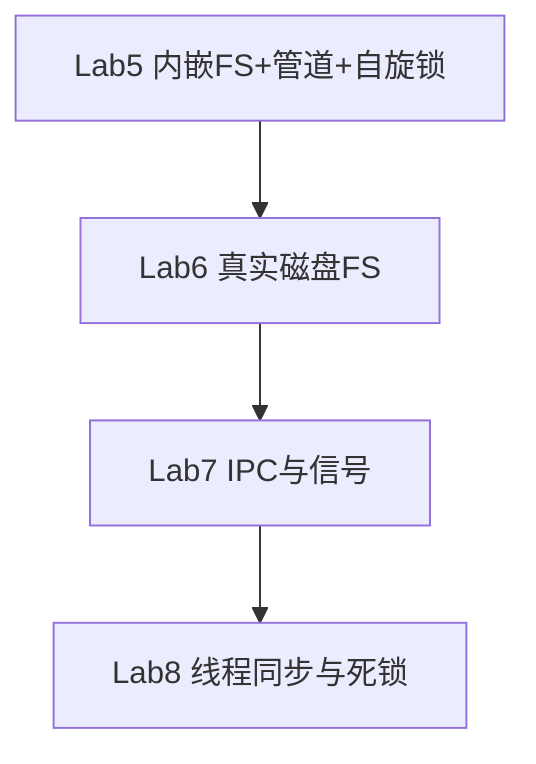

# EVOLVE 自研教学实验环境

仓库 `os-lab/` 为赛题**自研环境**：基于 Rust + RISC-V 64 的单内核渐进式教学实验，通过 `lab1`–`lab8` feature 在同一代码库中从裸机演进到磁盘文件系统、信号与线程同步，并配套 EVOLVE 教学工作台提供学生隔离工作区、可信运行、AI 导师与教师管理。

本文为自研环境统一说明文档，集中提供环境入口、验证与复现、教学工作台使用方式。交付范围总览见 [README.md](../README.md)；当前阶段完整技术说明见 [8.12阶段性实验技术文档.md](../8.12阶段性实验技术文档.md)；仓库索引见本文与根目录 README。

## 1. 交付物入口


| 类别             | 入口                                                                                                                |
| -------------- | ----------------------------------------------------------------------------------------------------------------- |
| 设计总结报告         | [os-lab/docs/design-report.md](../os-lab/docs/design-report.md)                                                   |
| EVOLVE 与 xv6 对比      | [xv6-comparison.md](../xv6-comparison.md)（根目录独立对比文档） | 
| 架构与 feature 设计 | [os-lab/docs/architecture.md](../os-lab/docs/architecture.md)                                                     |
| AI 协作记录        | [os-lab/docs/ai-collaboration.md](../os-lab/docs/ai-collaboration.md)                                             |
| 实验指导（lab1–8）   | [os-lab/labs/overview.md](../os-lab/labs/overview.md)；syscall 接口见本文 §6                          |
| 参考答案（对应【任务二】） | [os-lab/labs/answers/](../os-lab/labs/answers/)                                                                   |
| 当前阶段技术说明     | [8.12阶段性实验技术文档.md](../8.12阶段性实验技术文档.md)                                                           |
| 学生工作台/教师端契约 | [os-lab/handbook/docs/workbench-ui.md](../os-lab/handbook/docs/workbench-ui.md)                                   |
| 教学工作台源码     | `os-lab/handbook/`                                                                                                |
| 源码 workspace   | [os-lab/README.md](../os-lab/README.md)                                                                           |


## 2. 自研环境概览

`os-lab` 使用单内核 + feature gate 方案：


| Lab  | 主题          | 关键输出                            |
| ---- | ----------- | ------------------------------- |
| lab1 | 裸机启动与 SBI   | `Hello, OS!`                    |
| lab2 | Trap 与批处理任务 | `409684505`、`Yield round`       |
| lab3 | Sv39 虚存     | `virtual memory ready`          |
| lab4 | 进程管理        | `fork_test pass`                |
| lab5 | 文件系统与管道     | `fs_test pass`、`pipe_test pass` |
| lab6 | VirtIO 磁盘文件系统 | `file_test pass`、`Test link OK!`、`spawn_test pass`、`stride_test pass` |
| lab7 | IPC 与信号       | `dup_test pass`、`signal_test pass`、`signal_mask_test pass` |
| lab8 | 线程与同步        | `threads_test pass`、`mutex_test pass`、`condvar_test pass`、死锁检测 |


所有 `cargo` 命令均在 `os-lab/` 目录下执行。每次新开终端须先激活环境，否则可能出现 `cargo`、`qemu-system-riscv64` 或 `bash` 找不到。

## 3. 环境激活

环境安装见 [environment_setup.md](environment_setup.md)。在仓库根目录打开 PowerShell：

```powershell
cd <仓库根目录>
. .\scripts\activate-os-env.ps1
```

若脚本内路径与本机不符，可复制为 `scripts/activate-os-env.local.ps1` 后修改路径再执行。

## 4. 快速验证

最小验证路径如下：

```powershell
cd <仓库根目录>
. .\scripts\activate-os-env.ps1

cd os-lab
cargo run -p kernel --features lab1 --release
cargo run -p kernel --features lab5 --release
cargo test -p os-context -p os-syscall -p os-sbi -p os-fs -p os-signal -p os-sync --target x86_64-pc-windows-msvc
cargo test -p os-alloc -p os-vm --target x86_64-pc-windows-msvc -- --test-threads=1
```

期望结果：

- Lab1 输出 `Hello, OS!`
- Lab5 输出 `fs_test pass`、`pipe_test pass`
- 组件测试 42 项全部 `ok`

Lab6–8 依赖 VirtIO 块设备，快速验收见 §5.10。


## 5. 验证与复现


### 5.1 验证总览


| 范围   | 编译检查                                                | 组件单元测试（host）                        | QEMU 运行                                         | 关键输出                                        |
| ---- | --------------------------------------------------- | ----------------------------------- | ----------------------------------------------- | ------------------------------------------- |
| Lab1 | `cargo check -p os-sbi`、`-p kernel --features lab1` | 无                                   | `cargo run -p kernel --features lab1`           | `Hello, OS!`                                |
| Lab2 | `-p kernel --features lab2`                         | `os-context` 3 项 + `os-syscall` 4 项 | `cargo run -p kernel --features lab2`           | `409684505`、`Yield round`                   |
| Lab3 | `-p kernel --features lab3`                         | `os-alloc` 6 项 + `os-vm` 5 项        | `cargo run -p kernel --features lab3`           | 虚存启用日志、5 轮 `Yield round`                    |
| Lab4 | `-p kernel --features lab4`                         | Lab2/3 组件回归                         | `cargo run -p kernel --features lab4 --release` | `fork_test pass`、`I am parent`/`I am child` |
| Lab5 | `-p kernel --features lab5`                         | 24 项（一期基线）                       | `cargo run -p kernel --features lab5 --release` | `fs_test pass`、`pipe_test pass`             |
| Lab6 | `-p kernel --features lab6`                         | `os-fs` 11 项等                         | `make test-lab6`                                 | `file_test pass`、`Test link OK!`、`spawn_test pass`、`stride_test pass` |
| Lab7 | `-p kernel --features lab7`                         | `os-signal` 4 项                        | `make test-lab7`                                 | `dup_test pass`、`signal_test pass`、`signal_mask_test pass` |
| Lab8 | `-p kernel --features lab8`                         | `os-sync` 7 项                          | `make test-lab8`                                 | `threads_test pass`、`mutex_test pass`、`condvar_test pass`、死锁断言 |
| 完整回归 | `cargo check --workspace` + clippy                  | 全量 42 项                             | Lab1→Lab8 正序（Lab6–8 用 `make test-labN`）       | 见 [§5.14 完整验证](#514-完整验证)                   |


推荐顺序：激活环境 → 工具检查 → workspace 编译 → 组件单元测试 → Lab1 → Lab2 → Lab3 → Lab4 → Lab5 → Lab6 → Lab7 → Lab8（Lab6–8 用 `make test-labN`）。

host 单元测试必须指定本机 `--target`：


| 平台                  | `--target`                 |
| ------------------- | -------------------------- |
| Windows x64         | `x86_64-pc-windows-msvc`   |
| Linux x64           | `x86_64-unknown-linux-gnu` |
| macOS Apple Silicon | `aarch64-apple-darwin`     |
| macOS Intel         | `x86_64-apple-darwin`      |


### 5.2 检查工具版本

```powershell
Get-Command rustc,cargo,rustup,qemu-system-riscv64,bash | Format-Table Name,Source -AutoSize

rustc --version
cargo --version
qemu-system-riscv64 --version
bash --version
```


### 5.3 编译检查

```powershell
cd os-lab

cargo check --workspace
cargo check -p os-sbi
cargo check -p kernel --features lab1
cargo check -p kernel --features lab2
cargo check -p kernel --features lab3
cargo check -p kernel --features lab4
cargo check -p kernel --features lab5
cargo check -p kernel --features lab6
cargo check -p kernel --features lab7
cargo check -p kernel --features lab8
```

各级命令均应输出 `Finished`，无 `error`。若使用 Git Bash 且已安装 `make`，也可执行：

```bash
cd os-lab
make check
```

`os-sbi` 含 2 项 host 单元测试（Legacy 功能号常量断言），并以 Lab1 QEMU 输出为准。

### 5.4 组件单元测试（host）

`os-context` / `os-vm` 含 RISC-V 相关逻辑，不能在 `riscv64gc-unknown-none-elf` 目标上执行 `cargo test`，须在本机 host triple 上运行。

#### 5.4.1 `os-context` + `os-syscall`

Windows：

```powershell
cd os-lab
cargo test -p os-context -p os-syscall --target x86_64-pc-windows-msvc
```

成功标准：

```text
running 3 tests
test result: ok. 3 passed; 0 failed

running 4 tests
test result: ok. 4 passed; 0 failed
```


#### 5.4.2 `os-alloc` + `os-vm`

`os-vm` 页表测试共享全局页帧分配器，必须加 `-- --test-threads=1`。

```powershell
cd os-lab
cargo test -p os-alloc -p os-vm --target x86_64-pc-windows-msvc -- --test-threads=1
```

成功标准：

```text
running 6 tests
test result: ok. 6 passed; 0 failed

running 5 tests
test result: ok. 5 passed; 0 failed
```


#### 5.4.3 全部组件测试

```powershell
cd os-lab
cargo test -p os-context -p os-syscall -p os-sbi -p os-fs -p os-signal -p os-sync --target x86_64-pc-windows-msvc
cargo test -p os-alloc -p os-vm --target x86_64-pc-windows-msvc -- --test-threads=1
```

预期合计 **42 项**全部 `ok`（含二期 `os-signal` 4 项、`os-sync` 7 项与 `os-fs` 11 项）。


### 5.5 运行 Lab1

```powershell
cd os-lab
cargo run -p kernel --features lab1
```

或使用 cargo alias：

```powershell
cargo run-lab1
```

成功标准：

```text
Hello, OS!
EVOLVE kernel lab1 is running on QEMU virt.
```

OpenSBI 日志中应出现：

```text
Domain0 Next Address        : 0x0000000080200000
```

进程正常关机后回到 PowerShell 提示符，exit code 0。

### 5.6 运行 Lab2

```powershell
cd os-lab
cargo check -p kernel --features lab2
cargo run -p kernel --features lab2
```

成功标准：

```text
EVOLVE kernel lab2: trap and multitask.
Loading 3 user apps (batch slot at 0x80400000)...
Hello from user app!
Power test start
2^1000000002 % 998244353 = 409684505
Power check ok
Yield test start
Yield round
Yield round
Yield round
Yield round
Yield round
All user apps exited.
```

说明：

- 幂模结果应为 `409684505`
- yield 通常输出 5 轮 `Yield round`


### 5.7 运行 Lab3

```powershell
cd os-lab
cargo check -p kernel --features lab3
cargo run -p kernel --features lab3
```

成功标准：

```text
EVOLVE kernel lab3: enabling virtual memory...
EVOLVE kernel lab3: virtual memory ready.
Loading 3 user apps (batch slot at 0x80400000)...
Hello from user app!
Power test start
2^1000000002 % 998244353 = 409684505
Power check ok
Yield test start
Yield round
Yield round
Yield round
Yield round
Yield round
All user apps exited.
```

说明：

- 必须出现 `enabling virtual memory` 与 `virtual memory ready`
- yield 测试应完整输出 5 轮 `Yield round`


### 5.8 运行 Lab4

```powershell
cd os-lab
cargo check -p kernel --features lab4
cargo run -p kernel --features lab4
```

成功标准：

```text
I am parent, child_pid=2
I am child, pid=2
Process 2 exited with code 0
fork_test pass
Process 1 exited with code 0
All processes exited.
```

说明：

- lab4 嵌入的用户程序为 `fork_test`、`exec_test`、`hello`
- 若验证 `exec_test`，可将 `kernel/src/config.rs` 的 `INITPROC_APP_ID` 改为 `1` 后重编；预期 `Before exec` 后直接进入新程序输出，无 `After exec`


### 5.9 运行 Lab5

```powershell
cd os-lab
cargo build -p user --bin fs_test --bin pipe_test --bin fork_test --bin exec_test --bin hello --target riscv64gc-unknown-none-elf --release

cargo check -p kernel --features lab5
cargo run -p kernel --features lab5 --release
```

成功标准：

```text
EVOLVE kernel lab5: filesystem and sync.
Hello from testfile!
fs_test pass
pipe says hi
pipe_test pass
All processes exited.
```

说明：

- lab5 嵌入 5 个用户程序：`fs_test`、`pipe_test`、`fork_test`、`exec_test`、`hello`
- `pipe_test pass` 由子进程在成功读取管道数据后打印
- host 单测与 QEMU 共用 `DEFAULT_FILES` 文件表


### 5.10 运行 Lab6–Lab8（VirtIO 验收）

Lab6–8 依赖 VirtIO 块设备与 `fs.img`，请勿用裸 `cargo run --features lab6`。先构建用户程序，再执行 Makefile 验收：

```powershell
cd os-lab
cargo build -p user --bins --release --target riscv64gc-unknown-none-elf
make test-lab6
make test-lab7
make test-lab8
```

关键输出（OpenSBI 日志可忽略）：

- Lab6：`file_test pass`、`Test link OK!`、`mmap_test pass`、`spawn_test pass`、`stride_test pass`、`fs_test pass`、`pipe_test pass`
- Lab7：`dup_test pass`、`signal_test pass`、`signal_mask_test pass`、`pipe_test pass`
- Lab8：`threads_test pass`、`threads_arg_test pass`、`mutex_test pass`、`condvar_test pass`、`pipetest passed!`、`deadlock test mutex 1 OK!`、`deadlock test semaphore 1 OK!`、`pipe_test pass`

Lab6–8 依赖与 syscall 接口见本文 §6。


### 5.13 快速验证

```powershell
cd <仓库根目录>
. .\scripts\activate-os-env.ps1

cd os-lab
cargo run -p kernel --features lab1 --release
cargo run -p kernel --features lab5 --release
cargo test -p os-context -p os-syscall -p os-sbi -p os-fs -p os-signal -p os-sync --target x86_64-pc-windows-msvc
cargo test -p os-alloc -p os-vm --target x86_64-pc-windows-msvc -- --test-threads=1
```

期望：Lab1 输出 `Hello, OS!`；Lab5 输出 `fs_test pass`、`pipe_test pass`；组件测试 42 项全部 `ok`；Lab6–8 按 §5.10 用 `make test-labN`。

### 5.14 完整验证

```powershell
cd <仓库根目录>
. .\scripts\activate-os-env.ps1
$ErrorActionPreference = 'Continue'

cd os-lab
cargo check --workspace

cargo clippy -p os-alloc -p os-context -p os-vm -p os-syscall -p os-sbi -p os-fs -p os-signal -p os-sync -- -D warnings

cargo test -p os-context -p os-syscall -p os-sbi -p os-fs -p os-signal -p os-sync --target x86_64-pc-windows-msvc
cargo test -p os-alloc -p os-vm --target x86_64-pc-windows-msvc -- --test-threads=1

cargo run -p kernel --features lab1 --release
cargo run -p kernel --features lab2 --release
cargo run -p kernel --features lab3 --release
cargo run -p kernel --features lab4 --release

cargo build -p user --bin fs_test --bin pipe_test --bin fork_test --bin exec_test --bin hello --target riscv64gc-unknown-none-elf --release
cargo run -p kernel --features lab5 --release

cargo build -p user --bins --release --target riscv64gc-unknown-none-elf
make test-lab6
make test-lab7
make test-lab8
```

Linux/macOS 仅需将 `cargo test` 的 `--target` 改成对应 host triple；`os-vm` 测试必须保留 `-- --test-threads=1`。

成功标准摘要：

- `cargo check --workspace` 与 clippy 无 error 或 warning
- 42 项 host 单元测试全部 `ok`
- 各 Lab QEMU 输出符合 [§5.5](#55-运行-lab1) 至 [§5.9](#59-运行-lab5) 以及 §5.10 的成功标准


## 6. Lab6–8 依赖与 syscall 接口

### 6.1 依赖关系

**Lab6 → Lab7 → Lab8 必须按顺序做**，对应参考环境 **ch6 → ch7 → ch8**。



| 依赖 | 原因 |
|------|------|
| Lab5 → Lab6 | Lab5 有 fd 表与管道骨架；Lab6 将 `os-fs` 升级为磁盘 FS |
| Lab6 → Lab7 | ch7 `initproc` 从磁盘 FS 加载；统一 fd 对接真实文件 |
| Lab7 → Lab8 | ch8 exercise 会回归前期输出；须保持 Lab7 信号/管道可用 |

#### 6.1.1 与 tg-rcore-tutorial 对照

| os-lab | 参考章节 | 核心内容 | 验收 |
|--------|---------|---------|------|
| **Lab6** | ch6 | VirtIO、easy-fs、`linkat`/`unlinkat`/`fstat` | `make test-lab6` |
| **Lab7** | ch7 | 统一 fd、信号、`dup`；重构 Lab5 管道 | `make test-lab7`（自建 expected） |
| **Lab8** | ch8 | 线程、mutex/semaphore/condvar、死锁 | `make test-lab8` |

> ch7 无官方 exercise checker 分数；os-lab 以 `labs.json` + 用户测例定义验收。

#### 6.1.2 Lab6 前置与组件

| 前置项 | 模块 | 说明 |
|--------|------|------|
| `mmap`/`munmap` | `mm.rs` | ch6 exercise 依赖 |
| `spawn` syscall | `process.rs` | 从 `fs.img` 加载 ELF |
| stride + `set_priority` | 调度器 | ch5 exercise 对齐 |
| `fs.img` 构建 | `build.rs` | Lab6 磁盘镜像 |

| Crate | 时机 | 职责 |
|-------|------|------|
| `os-fs`（扩展） | Lab6 | 内嵌表 → 磁盘 inode |
| `os-signal` | Lab7 | 信号集/动作/屏蔽字 |
| `os-sync` | Lab8 | 阻塞 mutex/semaphore/condvar |

Feature Gate（已落地）：

```toml
lab6 = ["lab5", "easy-fs", "virtio-drivers", "spin"]
lab7 = ["lab6", "dep:os-signal"]
lab8 = ["lab7", "dep:os-sync"]
```

范围外：网络驱动、GPU/键盘等 ch8 扩展驱动、ch3 `sys_trace`（一期未实现）。

### 6.2 Lab6 系统调用接口

> 对应内核 feature：`lab6`（含第 0 周前置：`mmap`/`munmap`、`spawn`、`set_priority` + stride 调度）。

#### 6.2.1 继承 syscall（Lab1–5）

与 Lab5 相同。用户态包装见 `os-lab/user/src/syscall.rs`。

| 编号 | 名称 | 说明 |
|------|------|------|
| 64 | write | 标准输出 / 管道写 |
| 93 | exit | 进程退出 |
| 124 | yield | 主动让出 CPU |
| 172 | getpid | 当前 PID |
| 220 | clone | 教学简化 fork |
| 221 | execve | `a1` = 路径字节长度（非 argv） |
| 260 | wait4 | 等待子进程 |
| 56 | openat | `a1` = 路径长度，`a2` = open flags |
| 57 | close | 关闭 fd |
| 63 | read | 读文件 / 管道 |
| 59 | pipe | `a0` → `[read_fd, write_fd]` |

#### 6.2.2 Lab6 新增 syscall

**内存（ch4 exercise 前置）**

| 编号 | 名称 | 参数 | 返回值 |
|------|------|------|--------|
| 222 | mmap | addr, len, prot, flags, fd, offset | 0 / -1 |
| 215 | munmap | addr, len | 0 / -1 |

`prot`：`0x1` R、`0x2` W、`0x4` X。`addr`、`len` 页对齐（4096）；区间不得重叠。

**进程（ch5 exercise 前置）**

| 编号 | 名称 | 参数 | 返回值 |
|------|------|------|--------|
| 400 | spawn | path, path_len | 子 PID / -1 |
| 140 | set_priority | prio | prio / -1（`prio < 2`） |

`spawn` 从磁盘 `fs.img` 加载 ELF；`set_priority` 设置 stride 优先级（默认 16）。

**文件系统（ch6）**

| 编号 | 名称 | 参数 | 返回值 |
|------|------|------|--------|
| 37 | linkat | olddirfd, oldpath, newdirfd, newpath, flags | 0 / -1 |
| 35 | unlinkat | dirfd, path, flags | 0 / -1 |
| 80 | fstat | fd, stat_buf | 0 / -1 |

路径为以 `\0` 结尾的 C 字符串。`openat flags`：`RDONLY=0`、`WRONLY=1`、`RDWR=2`、`CREATE=512`、`TRUNC=1024`。

`fstat` 输出 `os_syscall::Stat`：`dev`、`ino`、`mode`（`FILE=0o100000`、`DIR=0o040000`）、`nlink` 等。硬链接由 `FileIndex` 维护；`unlink` 细粒度锁避免死锁。

#### 6.2.3 错误码

| 返回值 | 含义 |
|--------|------|
| `0` | 成功（void） |
| `>0` | 成功（fd、pid、字节数等） |
| `-1` | 通用失败 |

#### 6.2.4 构建验证

```powershell
cargo check -p kernel --features lab6
make test-lab6
```

`build.rs` 打包 `fs.img`；initproc 默认 `lab6_usertest`。

### 6.3 Lab7 系统调用接口

> 对应 feature：`lab7`（继承 lab6 全部能力）。

#### 6.3.1 继承

与 Lab6 相同，见 [§6.2](#62-lab6-系统调用接口)。

#### 6.3.2 统一 fd 抽象

`kernel/src/fs/disk.rs` 中 `FdType` 分发：

| 类型 | read | write |
|------|------|-------|
| Regular | ✅ | ✅ |
| PipeRead | ✅ | ❌ |
| PipeWrite | ❌ | ✅ |

`read`/`write`/`close`/`dup` 经同一 fd 表；管道 fd 的 `files[]` 槽位为 `None`。

**dup**：复制 fd 表项；管道增加引用计数；常规文件共享 `OpenedFile` 与偏移。

#### 6.3.3 Lab7 新增 syscall

**dup**

| 编号 | 名称 | 参数 | 返回值 |
|------|------|------|--------|
| 23 | dup | old_fd | 新 fd / -1 |

**信号**

| 编号 | 名称 | 参数 | 返回值 |
|------|------|------|--------|
| 129 | kill | pid, signum | 0 / -1 |
| 134 | sigaction | signum, action, old_action | 0 / -1 |
| 135 | sigprocmask | mask | 旧 mask |
| 139 | sigreturn | — | 0 / -1 |

`SignalAction`：`handler`（0=默认）、`mask`。默认：`SIGKILL(9)`/`SIGINT(2)` 终止，其他忽略。`SIGKILL` 不可屏蔽。

`kill`：`pid` 为正且存在；`signum` 范围 `1..=31`。

`sigaction`：`action == 0` 查询；`old_action != 0` 写回旧 handler。

投递时机：`trap_handler` 返回用户态前 `handle_pending`；有 handler 则改 `sepc`/`a0`，处理函数以 `sigreturn` 结束。

#### 6.3.4 argc-argv（延后）

`execve` 仍用 Lab4 ABI：`a0` 路径、`a1` 路径长度。ch7 完整 argc/argv 待测例就绪后联调。

#### 6.3.5 用户态包装

```rust
pub fn dup(fd: usize) -> isize { syscall(SYS_DUP, fd, 0, 0) }
pub fn kill(pid: isize, signum: u8) -> isize { syscall(SYS_KILL, pid as usize, signum as usize, 0) }
// sigaction / sigprocmask / sigreturn 见 ch7 user/lib.rs
```

#### 6.3.6 验收

```powershell
cargo check -p kernel --features lab7
cargo test -p os-signal --test signal_state --target x86_64-pc-windows-msvc
make test-lab7
```

host 单测：`os-signal` 4 项（pending/mask、fork 继承、默认致命、SIGKILL 绕过屏蔽）。

### 6.4 Lab8 系统调用接口

> 对应 feature：`lab8`（lab7 + 线程 + 阻塞同步 + 死锁检测）。

#### 6.4.1 继承

与 Lab7 相同，见 [§6.3](#63-lab7-系统调用接口)。

#### 6.4.2 线程

| 编号 | 名称 | 参数 | 返回值 |
|------|------|------|--------|
| 1000 | thread_create | entry, arg | tid / -1 |
| 1001 | gettid | — | 当前 tid |
| 1002 | waittid | tid | 退出码 / -1 |

- `exit(93)`：线程退出；末线程退出后进程 zombie，由 `wait4` 回收。
- `thread_create`：同地址空间、独立用户栈。
- `waittid`：阻塞等待目标线程；不可等待自身。

#### 6.4.3 阻塞同步

| 编号 | 名称 | 参数 | 返回值 |
|------|------|------|--------|
| 1010 | mutex_create | blocking(=1) | id / -1 |
| 1011 | mutex_lock | mutex_id | 0 / -1 / -0xDEAD |
| 1012 | mutex_unlock | mutex_id | 0 / -1 |
| 1020 | semaphore_create | res_count | sem id |
| 1021 | semaphore_up | sem_id | 0 |
| 1022 | semaphore_down | sem_id | 0 / -1 / -0xDEAD |
| 1030 | condvar_create | — | cv id |
| 1031 | condvar_signal | cv_id | 0 |
| 1032 | condvar_wait | cv_id, mutex_id | 0 / -1 |

**阻塞约定**：资源不可用时返回 `-1`，线程 `Blocked`；用户态重试 syscall。

- `condvar_signal`：弹出 waiter → `pending_condvar_wake`；在 **`mutex_unlock`** 时 `admit_handoff` + `re_enque`（Mesa：signal 时仍持锁）。
- `mutex_unlock` / `semaphore_up`：`mark_mutex_handoff` + `re_enque`。
- 阻塞瞬间若已有 `mutex_handoff`：`block_thread_slot_and_run_next` 直接完成 syscall（`a0=0`，跳过 `ecall`）。

#### 6.4.4 死锁检测

| 编号 | 名称 | 参数 | 返回值 |
|------|------|------|--------|
| 469 | enable_deadlock_detect | 0/1 | 0 / -1 |

开启后 `mutex_lock` / `semaphore_down` 可能返回 `-0xDEAD`（-57005），不阻塞。`DeadlockState` 挂进程层（银行家 + 等待图），对照 `reference-patches/ch8-exercise.patch`。

#### 6.4.5 内核模块

| 模块 | 职责 |
|------|------|
| `processor.rs` | TCB、就绪队列、线程 syscall |
| `sync_syscall.rs` | mutex / semaphore / condvar；**Lab8 任务文件**（`finish_blocking_syscall` / unlock `re_enque`） |
| `deadlock.rs` | 死锁检测 |
| `os-sync/` | 阻塞原语 host 测 |

#### 6.4.6 构建与 initproc

```powershell
cargo build -p user --bin lab8_integration_test --release --target riscv64gc-unknown-none-elf
cargo build -p kernel --features lab8 --release
make test-lab8
```

initproc：`lab8_integration_test`（单进程全链，末尾 `exec pipe_test`）。**不是** fill/debug 任务文件——任务下发覆盖的是 `kernel/src/sync_syscall.rs`。

用户测例：`user/src/bin/lab8_*`、`threads_*`、`mutex_test`、`condvar_test`、`pipetest`、`deadlock_*`。

### 6.5 ch8 exercise 继承项清单

> 对照 `reference-patches/ch8-exercise.patch` 与 `lab8_integration_test` 全链。

#### 6.5.1 线程

| 测例 | 说明 | 状态 |
|------|------|------|
| `threads_test` | create / waittid / 退出码 | ✅ |
| `threads_arg_test` | 线程参数传递 | ✅ |

#### 6.5.2 阻塞同步

| 测例 | 说明 | 状态 |
|------|------|------|
| `mutex_test` | 阻塞 mutex 计数器 | ✅ |
| `condvar_test` | wait / signal | ✅ |
| `pipetest` | fork + 管道 | ✅ |

#### 6.5.3 死锁检测

| 测例 | 说明 | 状态 |
|------|------|------|
| `deadlock_mutex_test` | 重复加锁 → `-0xDEAD` | ✅ |
| `deadlock_sem_test` | 信号量环路 | ✅ |

#### 6.5.4 Lab1–7 回归

| 测例 | 说明 | 状态 |
|------|------|------|
| `pipe_test` | Lab5/7 管道 | ✅（链末 exec） |

#### 6.5.5 参考 ch8 未纳入

| 项 | 原因 |
|----|------|
| `phil_din_mutex` / `mpsc_sem` / `race_adder` 完整版 | 已由 `mutex_test` 等覆盖核心语义 |
| `sleep` / `clock_gettime` | 未实现 |
| GPU / 键盘 / Doom | 分工裁剪 |

#### 6.5.6 验收命令

```powershell
cd os-lab
cargo build -p user --bins --release --target riscv64gc-unknown-none-elf
make test-lab8
```

---

## 7. EVOLVE 教学工作台与 Web 手册

`os-lab/handbook/` 是基于 VitePress + Vue 的 EVOLVE 教学工作台，包含学生工作区（Monaco 编辑器、xterm 终端、Problems 诊断、Trace、实验报告）、AI 导师、教师控制台与 Tutor Server；学生需登录后按实验开放范围使用，不再是纯静态手册。

### 7.1 主要功能


| 功能      | 说明                                              |
| ------- | ----------------------------------------------- |
| 文档聚合    | 实验指导、参考答案、设计报告等统一浏览                          |
| 学生工作区  | 每名学生独立源码树，Monaco 编辑、保存与文件状态                  |
| 受控运行    | 白名单命令、xterm 终端、可信 recipe 与断言                    |
| Trace 与证据 | 内核 Trace、诊断、测试结果与证据引用回跳                      |
| AI 导师    | 意图路由、答案护栏、知识库 RAG 与证据门控                      |
| 教师端     | 发布 Lab、班级/账号、评分复核与报告模板                       |


### 7.2 本地运行

前置： [Node.js](https://nodejs.org/) 18+（含 `npm`）

```powershell
cd os-lab/handbook
npm install
npm run dev
```

浏览器打开终端提示的地址（默认 `http://localhost:5173`）。

`npm run dev` 与 `npm run build` 会自动从 `os-lab/labs/`、`os-lab/docs/`、仓库 `docs/` 同步 Markdown 到站点内容目录。完整交互契约见 `os-lab/handbook/docs/workbench-ui.md`，平台技术说明见 [8.12阶段性实验技术文档.md](../8.12阶段性实验技术文档.md)。

### 7.3 构建静态站点

```powershell
cd os-lab/handbook
npm run build
npm run preview
```

构建产物位于 `os-lab/handbook/.vitepress/dist/`。

### 7.4 与验证路径的关系

工作台是教学体验与证据入口，不改变内核代码与 QEMU 验证结论；终端复现以本文第 4 节、第 5 节为准。

## 8. 常见问题


| 现象                                 | 处理                                                      |
| ---------------------------------- | ------------------------------------------------------- |
| `cargo` / `rustc` 找不到              | 未激活环境或新开终端后未重新执行激活脚本                                    |
| `could not find Cargo.toml`        | 未进入 `os-lab/`，先 `cd os-lab`                             |
| `rustc` 路径不对                       | 重新执行激活脚本；见 [environment_setup.md](environment_setup.md) |
| `qemu-system-riscv64` 找不到          | 确认 QEMU 已安装且在 `PATH` 中                                  |
| `cargo test` 报 host 相关错误           | 未指定本机 `--target`                                        |
| PowerShell 中 `lab1~lab5` 无效        | 逐条执行 `lab1`、`lab2`、`lab3`、`lab4`、`lab5`                 |
| `os-vm` 单元测试崩溃                     | 加 `-- --test-threads=1`                                 |
| Lab2 yield 不足 5 轮                  | 确认 `SYS_YIELD` 路径触发；实现差异可能导致输出轮数变化                      |
| Lab3 无虚存启用日志                       | 确认使用 `--features lab3`                                  |
| Lab4 无 `fork_test pass`            | 确认使用 `--features lab4`，检查 fork 返回值与 waitpid             |
| 用 lab4 跑 lab2/3 测试失败               | 各 Lab 构建集不同，须分别用对应 feature 回归                           |
| `cargo run --features lab5` 长时间无输出 | 先单独 `cargo build -p user ... --release` 再运行             |
| Lab5 无 `fs_test pass`              | 检查 `open`/`read` syscall 与 `os-fs` `DEFAULT_FILES`      |
| Lab5 无 `pipe_test pass`            | 检查 `SYS_PIPE` 与 fork 后 pipe fd 继承                       |
| `make test-lab6` 无输出/卡住          | 先 `cargo build -p user --bins --release --target riscv64gc-unknown-none-elf` 刷新 `fs.img` |
| 裸 `cargo run --features lab6` 失败   | Lab6–8 须用 `make test-lab6/7/8`（VirtIO 块设备）                |
| Lab6–8 缺 VirtIO 设备                | 确认 QEMU ≥ 7.0，并使用 `make test-labN` 而非裸 `cargo run`      |
| host 单测不足 42 项                  | 确认包含 `os-signal`、`os-sync` 与二期 `os-fs` 测例                 |


## 9. 相关文档

- [README.md](../README.md)：仓库导航与交付索引
- [environment_setup.md](environment_setup.md)：工具链安装
- [progress.md](../progress.md)：开发进度、团队分工、里程碑与每日记录
- [os-lab/README.md](../os-lab/README.md)：源码 workspace 快速开始
- [os-lab/tests/README.md](../os-lab/tests/README.md)：集成测试说明
- [os-lab/labs/overview.md](../os-lab/labs/overview.md)：实验总览
- [os-lab/docs/design-report.md](../os-lab/docs/design-report.md)：设计总结报告
- [8.12阶段性实验技术文档.md](../8.12阶段性实验技术文档.md)：当前阶段完整技术说明


## 10. 与参考环境的关系

参考环境 `reference/tg-rcore-tutorial` 用于 **30% 练习** 对照；自研环境在 `os-lab/` 独立演进，不修改参考仓库。base 测试与练习实现见 [reference-report.md](reference-report.md)；二期 Lab6–8 对照见本文 §6。
