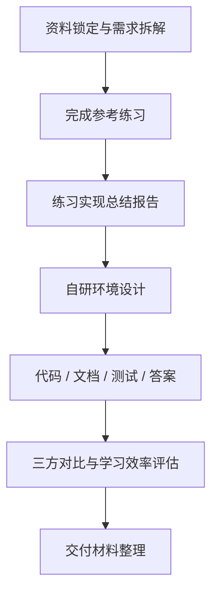

# 项目阶段计划表

依据赛题 [Task.md](../Task.md) 制定的项目实施计划。项目周期 **2026-06-01 ～ 2026-06-30**（30 天），三人协作、全程结合 AI 工具辅助开发与文档撰写。交付物索引见 [delivery-checklist.md](delivery-checklist.md)。

## 1. 项目目标

与 AI 协作完成可评审、可运行、可验证的操作系统课教学实验环境，形成两条主线成果：

核心成果分为两条主线：

1. 完成参考资料中“最新教学实验环境”的5个基础实验练习，并提交练习实现总结报告。
2. 设计并实现一个有自身特点的操作系统内核教学实验环境，包含实验指导文档、实验代码、测试用例、实验答案、文字类习题和答案，并完成教学实验环境设计总结报告。

## 2. 成功标准
- 参考环境 ch3/ch4/ch5/ch6/ch8 exercise checker 全部通过。
- 自研环境使用 Rust + RISC-V 64，lab1–lab5 均在 QEMU 可运行；组件化 crate 具备 host 单元测试与系统测试入口。
- 提供实验指导、习题、参考答案、设计总结报告、三方对比与学习效率评估、AI 协作记录。
- 文档采用 Markdown + mermaid；自研相对参考环境有明确的改进、裁剪或重构点。

## 3. 总体路线

## 4. 阶段计划表

| 阶段 | 时间 | 目标 | 主要工作 | 产出物 | 交付入口 |
| --- | --- | --- | --- | --- | --- |
| **0 资料锁定** | 06-01～06-19 | 固化可复现基线 | 锁定参考仓库提交号；梳理 exercise 验收项；搭建 Rust/QEMU 环境；制定本计划 | 环境配置说明、参考 base 测试记录、本计划表 | [environment_setup.md](environment_setup.md)、[reference-report.md](reference-report.md) |
| **1 参考练习** | 06-19～06-28 | 完成 30% 练习主线 | 在 ch3/ch4/ch5/ch6/ch8 实现 exercise；记录实现过程与 checker 结果；整理可审阅补丁 | 练习补丁、练习实现总结 | [reference-patches/](../reference-patches/)、[reference-report.md](reference-report.md) |
| **2 自研设计** | 06-20～06-23 | 确定 70% 架构与教学路径 | 单内核 + feature gate 方案；6 组件 crate 边界；lab1–5 知识点与实验目录规划 | 架构说明、实验总览 | [architecture.md](../os-lab/docs/architecture.md)、[labs/overview.md](../os-lab/labs/overview.md) |
| **3 自研实现** | 06-21～06-27 | 代码与教学文档落地 | 内核 lab1–5 逐级实现；组件单测与 QEMU 回归；5 篇指导 + 习题 + 答案 | `os-lab/` 源码、实验文档、验证说明 | [os-lab/README.md](../os-lab/README.md)、[os-lab.md](os-lab.md) |
| **4 评估对比** | 06-23～06-27 | 证明教学价值 | 本校 / 参考 / 自研三方对比；学习效率数据采集与分析 | 对比报告与数据附录 | [comparison.md](../os-lab/docs/comparison.md)、[comparison-data.md](../os-lab/docs/comparison-data.md) |
| **5 交付整理** | 06-27～06-30 | 形成可提交包 | 设计总结报告、AI 协作记录、Web 手册、技术方案、交付清单 | 全套评审材料 | [design-report.md](../os-lab/docs/design-report.md)、[os-lab.md](os-lab.md)、[delivery-checklist.md](delivery-checklist.md) |

各阶段按「单项主责 + 交叉复核」推进；涉及同一源码文件时串行修改，不同 crate 或文档目录可并行。

## 5. 里程碑一览

| 里程碑 | 计划节点 | 验收依据 |
| --- | --- | --- | --- |
| M1 资料与环境就绪 | T0 + 2 天 | 参考仓库基线 `d6330a6` 锁定；工具链可复现 |
| M2 参考练习通过 | T0 + 10 天 | 五章 exercise checker 全绿 |
| M3 自研方案定稿 | T0 + 14 天 | 架构与 lab 目录确定，差异点可表述 |
| M4 自研环境可运行 | T0 + 24 天 | lab1–5 QEMU 通过；24 项 host 单测通过 |
| M5 报告与交付完成 | T0 + 30 天 | 设计报告、对比评估、交付清单齐备 |

T0 = 2026-06-01。

## 6. 风险与应对

| 风险 | 影响 | 应对 |
| --- | --- | --- |
| 参考仓库持续更新 | exercise 接口与测试口径变化 | 锁定提交号 `d6330a6`；补丁独立存放于 `reference-patches/` |
| 工具链配置失败 | 无法运行 QEMU 与 host 单测 | 编写通用安装指南；提供环境激活脚本 |
| 自研范围过大 | 难以按期完成五档 lab | 坚持 feature gate 渐进式；先闭环再扩展 |
| AI 生成内容不可靠 | 错误代码或解释进入交付 | 人工审查 + 编译/QEMU/单测验证；关键决策记入协作记录 |
| 文档与代码不同步 | 影响可评审性 | 每 lab 完成后同步更新指导、答案与验证说明 |
