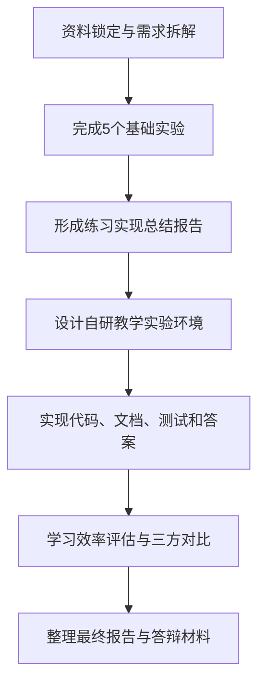

# AI合作操作系统课教学实验环境完成计划

## 1. 项目目标

本项目目标是与AI充分协作，完成一套适合学生本人自学的操作系统内核教学实验环境，并形成可评审、可运行、可验证的交付物。

核心成果分为两条主线：

1. 完成参考资料中“最新教学实验环境”的5个基础实验练习，并提交练习实现总结报告。
2. 设计并实现一个有自身特点的操作系统内核教学实验环境，包含实验指导文档、实验代码、测试用例、实验答案、文字类习题和答案，并完成教学实验环境设计总结报告。

## 2. 前提假设

- 本计划基于仓库根目录 `Task.md` 的赛题要求制定。
- 参考实验环境持续更新，正式实施前需要锁定参考仓库、课程资料和测试用例的具体版本或提交号。
- 当前计划阶段不直接实现实验代码；进入实验实施阶段后，再确认是否使用项目自己的虚拟环境、Rust工具链、QEMU和RISC-V目标配置。
- 团队共有三人，本计划按“单项负责人 + 交叉评审”的方式分工，避免多人同时修改同一文件造成冲突。

## 3. 成功标准

项目完成时应满足以下标准：

- 5个基础实验均完成实现、测试、答案整理和实现总结。
- 自研教学实验环境使用 Rust 作为内核编程语言，面向 RISC-V 64，并可在 QEMU 上运行。
- 代码按 Rust Crate 方式组件化组织，每个内核主体或内核模块具备单元测试和系统测试入口。
- 文档采用 Markdown 编写，架构图、流程图优先使用 mermaid 等文本图形方式表达。
- 自研环境相对参考环境有明确的改进、扩展、裁剪或重构点，不能只是简单复制。
- 提供与本校已有教学实验环境、参考教学实验环境、自研教学实验环境的定性和定量对比分析。
- 提供学习效率评估，包括理论概念掌握、实践开发能力提升、测试通过情况和AI协作效果。
- 最终材料能直接支撑评审维度：创新性、完整性、代码质量和文档完整性。

## 4. 总体路线

## 5. 阶段计划

### 阶段0：资料锁定与评审框架建立

目标：把持续更新的参考资料固化为可复现的项目基线，避免后续实现和报告口径不一致。

主要工作：

- 锁定参考实验环境仓库的分支、提交号和实验目录结构。
- 收集本校已有教学实验环境的实验目标、实验数量、技术栈、测试方式和文档形式。
- 梳理5个基础实验的名称、目标、输入输出、测试入口和对应知识点。
- 建立评审映射表，把创新性、完整性、代码质量、文档完整性对应到具体交付物。
- 建立AI协作记录模板，记录使用的AI工具、提问目标、关键回答、采纳结果和人工修正。

验证方式：

- 资料基线表中包含所有外部资料链接、访问日期、版本或提交号。
- 每个基础实验都有明确验收项。
- 评审映射表能覆盖赛题给出的4个评分维度。

### 阶段1：完成5个基础实验练习

目标：先通过参考环境的基础实验，建立对参考代码、测试体系和核心知识点的真实理解。

主要工作：

- 按参考环境顺序完成5个基础实验，不跳过前置实验。
- 每个实验先阅读指导文档，再用AI辅助分析目标、关键代码路径和测试方式。
- 实现时只做实验要求内的必要改动，不提前做额外重构。
- 为每个实验整理实验答案、关键实现说明、失败尝试和修正记录。
- 每个实验完成后立即执行对应单元测试和系统测试。

验证方式：

- 5个基础实验均有可复现的测试命令和测试结果。
- 每个实验都有实验答案和简短实现记录。
- 练习实现总结报告能说明“做了什么、为什么这样做、测试如何证明通过、AI在哪些环节起作用”。

### 阶段2：自研教学实验环境设计

目标：设计一套不同于参考环境、但仍覆盖操作系统核心知识点并适合自学的实验环境。

设计原则：

- 简单优先：只保留能支撑学习目标的实验和模块。
- 组件化优先：每个核心能力尽量拆成可测试的 Rust Crate。
- 学习闭环优先：每个实验都应包含目标、背景、步骤、代码入口、测试、常见错误、答案和扩展问题。
- AI协作可追踪：每个实验都保留建议的AI提问方式和人工校验点，但不让AI替代学生理解。

建议模块：

- 启动与最小内核：理解 RISC-V 启动流程、链接脚本、QEMU运行方式。
- 内存管理：理解地址空间、页表、物理页分配和虚拟内存。
- 中断与系统调用：理解 trap、异常处理、用户态到内核态切换。
- 任务与调度：理解任务控制块、上下文切换、调度策略。
- 文件或设备抽象：理解简单文件接口、块设备或控制台设备的抽象方式。

验证方式：

- 每个模块都有独立学习目标、实验任务、测试入口和答案。
- 自研环境与参考环境的差异点能用表格说明。
- 设计方案能解释为什么更适合团队成员自学。

### 阶段3：自研环境实现与测试

目标：把设计方案落成可运行、可测试、可阅读的实验环境。

主要工作：

- 搭建 Rust workspace，明确内核主体、内核模块、实验代码和测试代码的目录边界。
- 配置 RISC-V 64 目标、QEMU运行命令和必要构建脚本。
- 为每个模块补齐单元测试，关键实验补齐系统测试。
- 编写实验指导文档、实验答案、文字类习题和文字类答案。
- 整理每个 Crate 的基本元信息、README、许可证说明和发布前检查项，使其具备发布到 crates.io 的条件。

验证方式：

- `cargo check`、`cargo test` 或项目定义的等价命令可执行并有记录。
- QEMU系统测试能启动并通过关键实验断言。
- Markdown文档链接有效，mermaid图能正确表达核心流程。
- 代码、测试、答案和文档之间一一对应。

### 阶段4：学习效率评估与三方对比分析

目标：证明自研环境不仅能运行，而且确实更适合自学。

主要工作：

- 建立学习效率指标，包括完成时间、测试通过率、概念覆盖度、错误定位时间、AI协作轮次和复盘质量。
- 对比三类环境：本校已有教学实验环境、参考教学实验环境、自研教学实验环境。
- 定性分析维度包括学习路径清晰度、实验难度梯度、文档友好度、测试反馈速度和可扩展性。
- 定量分析维度包括实验数量、核心知识点覆盖数、自动化测试数量、文档页数、平均完成时间和失败修正次数。

验证方式：

- 对比表中的每个数据都有来源记录。
- 评估结论能回到赛题目标：帮助学生理解理论概念、掌握核心知识点并提升实践开发能力。

### 阶段5：最终报告与提交材料整理

目标：把过程成果整理成评审可直接阅读和验证的交付包。

最终交付物：

- 5个基础实验练习实现总结报告。
- 自研教学实验环境设计总结报告。
- 自研实验环境代码。
- 实验指导文档。
- 测试用例和测试结果记录。
- 实验答案、文字类习题和文字类答案。
- AI协作记录。
- 三方对比分析和学习效率评估。

验证方式：

- 按评分维度进行最终自查：创新性30%、完整性20%、代码质量25%、文档完整性25%。
- 从零开始按 README 或实验指导文档执行一次关键路径，确认新人能复现实验流程。

## 6. 里程碑安排

| 里程碑 | 时间建议 | 主要产出 | 验收标准 |
| --- | --- | --- | --- |
| M1 资料基线完成 | T0 + 2天 | 资料基线表、实验清单、评审映射表 | 参考资料版本明确，5个基础实验验收项明确 |
| M2 基础实验完成 | T0 + 10天 | 5个实验实现、答案、测试记录 | 每个实验均完成实现和测试闭环 |
| M3 自研方案定稿 | T0 + 14天 | 架构设计、实验目录、知识点覆盖表 | 设计与参考环境差异明确，范围可实现 |
| M4 自研环境可运行 | T0 + 24天 | 代码、测试、指导文档初稿 | QEMU关键路径可运行，主要测试通过 |
| M5 评估与报告完成 | T0 + 30天 | 总结报告、对比分析、AI协作记录 | 材料覆盖全部评分维度，可直接提交 |

## 7. 风险与应对

| 风险 | 影响 | 应对 |
| --- | --- | --- |
| 参考仓库持续更新 | 实验目标和代码接口可能变化 | 阶段0锁定提交号，报告中说明基线版本 |
| QEMU或RISC-V工具链配置失败 | 影响系统测试和演示 | 优先准备最小可运行环境，并记录安装步骤 |
| 自研范围过大 | 代码和文档难以按期完成 | 先保证核心实验闭环，再做扩展实验 |
| AI生成内容不可靠 | 可能引入错误解释或不可运行代码 | 所有AI建议必须经过人工阅读、测试和记录 |
| 文档与代码不同步 | 影响完整性和可评审性 | 每个实验完成后同步更新指导、答案和测试记录 |

## 8. 团队三人任务分工

### 成员A：项目统筹与文档负责人

职责：

- 负责资料基线、评审映射表、AI协作记录模板和整体进度跟踪。
- 主写练习实现总结报告、自研环境设计总结报告、三方对比分析和学习效率评估。
- 负责最终提交材料的结构统一、术语统一和Markdown/mermaid文档质量检查。

交付物：

- 资料基线表。
- 评审维度映射表。
- 总结报告和对比评估章节。
- 最终提交清单。

### 成员B：基础实验与答案负责人

职责：

- 主负责参考环境5个基础实验的实现、调试和测试记录。
- 整理每个实验的实验答案、关键实现说明和常见错误说明。
- 协助成员A提炼基础实验总结报告中的实现过程和AI协作过程。

交付物：

- 5个基础实验实现记录。
- 5个基础实验测试记录。
- 实验答案和常见问题记录。
- 基础实验实现总结素材。

### 成员C：自研环境架构与测试负责人

职责：

- 主负责自研Rust workspace、组件化Crate边界、RISC-V 64/QEMU运行路径和测试体系设计。
- 负责自研实验环境的核心代码实现、单元测试、系统测试和发布条件检查。
- 协助成员A整理架构图、测试说明和代码质量说明。

交付物：

- 自研实验环境代码结构。
- 构建、运行和测试脚本或命令说明。
- 单元测试和系统测试记录。
- 组件发布条件检查清单。

### 协作规则

- 每个阶段只设一个主负责人，另外两人做评审，避免责任不清。
- 涉及同一文件时串行修改；涉及不同模块时可以并行推进。
- 每完成一个实验或模块，必须同步完成“实现、验证、记录”闭环。
- 最终提交前由三人共同按评分维度做一次交叉审查。
