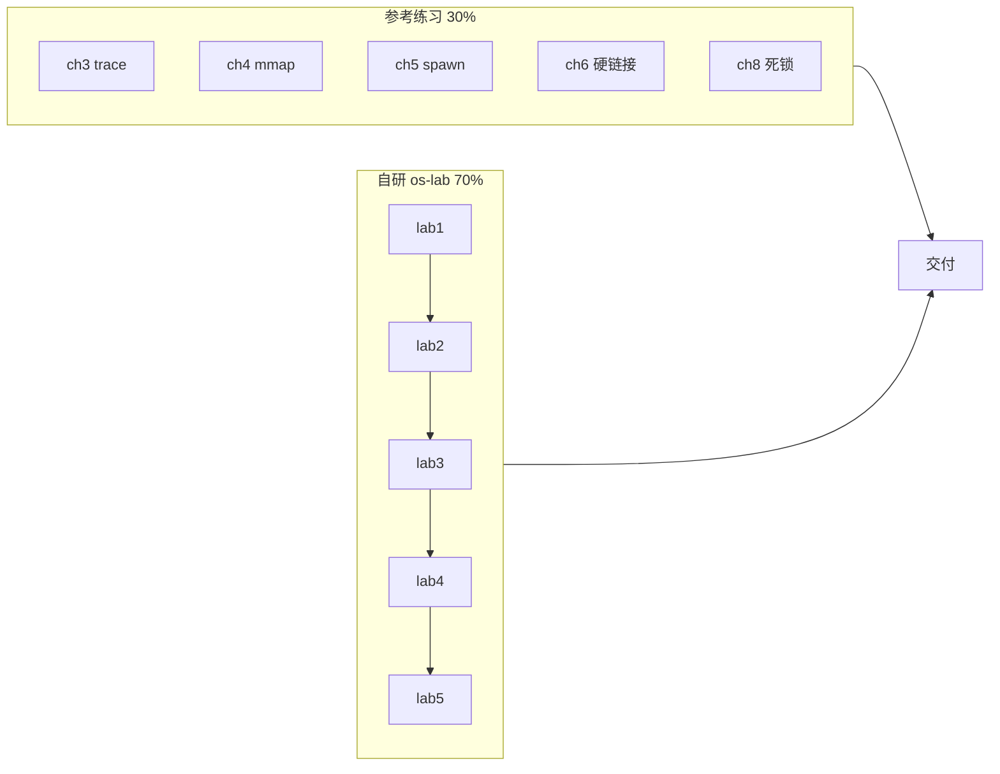
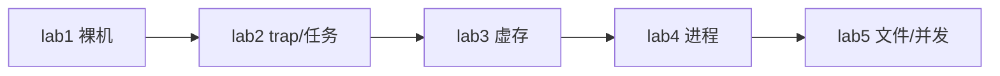

# AI 合作的操作系统课教学实验环境 — 技术方案文档

> 全国大学生计算机系统能力大赛「功能挑战」赛道 · 设计提案与开发文档合一稿  
> 赛题原文：[Task.md](../Task.md) · 仓库：[https://github.com/AM-SuSh/Or2-1-OS](https://github.com/AM-SuSh/Or2-1-OS)  
> 团队 Or2-1（三人）· 文档版本 v2.0 · 2026-06-29  
> 文档许可 [CC BY-SA 4.0](https://creativecommons.org/licenses/by-sa/4.0/) · 源码许可见 [os-lab/LICENSE](../os-lab/LICENSE)（BSD-3-Clause）

---

## 目录

1. [项目概述](#1-项目概述)
2. [基线项目与团队增量贡献](#2-基线项目与团队增量贡献)
3. [设计思路](#3-设计思路)
4. [技术架构与实现描述](#4-技术架构与实现描述)
5. [代码说明](#5-代码说明)
6. [研发问题与解决方案](#6-研发问题与解决方案)
7. [测试结果分析](#7-测试结果分析)
8. [AI 工具使用披露](#8-ai-工具使用披露)
9. [外部来源与许可说明](#9-外部来源与许可说明)
10. [提交物清单](#10-提交物清单)
11. [总结与展望](#11-总结与展望)

---

## 1. 项目概述

### 1.1 赛题背景与我们做的事

操作系统课有个老毛病：课上听得懂虚存、中断、进程，一打开代码又不知道从哪行看起。成熟教学内核（xv6、rCore）功能完整，但仓库大、crate 多、章节之间跳转频繁，初学者很容易在「这一章的内核和上一章有什么关系」这个问题上卡住。近几年 AI 能帮忙读代码、解释报错，但如果学生只抄答案不验证，反而加深了「原理和实践脱节」。

赛题要求我们做两件事。第一条：在官方参考教学环境上完成 5 个基础实验的编程练习（exercise），写实现总结。第二条：自己设计一套能自学的 OS 教学实验环境，要有指导文档、代码、测试、习题和答案，还要和本校环境、参考环境做对比，说明学习效率。

我们的交付可以概括成「练」和「建」两条线。练的部分在 `reference/tg-rcore-tutorial` 上打补丁，五章 exercise 全部通过官方 checker。建的部分是自研 `os-lab`：一个 Rust 写的、在 QEMU 上跑的 RISC-V 64 单内核，用 Cargo feature 从 lab1 逐步长到 lab5，配套五套实验文档、24 个 host 单元测试、Web 学习手册，以及设计报告和三方对比。参考环境报告见 [reference-report.md](reference-report.md)，自研环境设计见 [design-report.md](../os-lab/docs/design-report.md)。




### 1.2 赛题硬性约束与对应实现

内核语言用 Rust，目标平台 RISC-V 64，在 `qemu-system-riscv64` 的 `virt` 机器上跑。代码按 Rust workspace 拆 crate，每个组件 crate 能在 host 上跑单元测试，内核通过 QEMU 用户态程序做集成验证。文档全部 Markdown，架构和流程用 mermaid 画。各 crate 的 `Cargo.toml` 已填 `license`、`authors`、`repository`、`description`，满足「具备发布到 crates.io 条件」。

### 1.3 成果规模

自研内核主体加六个组件 crate。参考环境 tg-rcore-tutorial 同口径约 36455 行、29 个 crate。

教学文档方面：5 篇实验指导、5 套文字习题、5 套参考答案、1 篇实验总览、4 份项目级报告（设计、架构、对比、AI 协作），外加 VitePress 静态学习手册。验证方面：2026-06-27 终验时 clippy `-D warnings` 全绿、host 单元测试 24/24 通过、lab1 到 lab5 正序和倒序 QEMU 回归均通过。

---

## 2. 基线项目与团队增量贡献

### 2.1 基线项目与版本锁定

练习的基线是 [rcore-os/tg-rcore-tutorial](https://github.com/rcore-os/tg-rcore-tutorial)，锁定 branch `test`、commit `d6330a6`。仓库体积大（本地 clone 约 1.5GB），所以放在 `reference/` 并由 `.gitignore` 排除，文档和测试报告里已注明完整 clone 命令，见 [reference-report.md](reference-report.md)。

架构对照用的是同系列的 [rCore-Tutorial-in-single-workspace](https://github.com/rcore-os/rCore-Tutorial-in-single-workspace)（branch `test`），用于比较 crate 数量、依赖层数和知识点覆盖。三方对比里的「本校环境」指 MIT 6.S081 的 xv6-riscv。运行时还依赖 OpenSBI 固件和 QEMU，许可遵循各自上游。

### 2.2 在参考环境上的增量

以下功能不是上游 exercise 自带的完成态，是本地修改，并用 `tg-rcore-tutorial-checker` 验收。

**ch3（sys_trace，7/7）**  
在 `task.rs` 给每个任务维护 syscall 计数；在 `main.rs` 实现 `trace_request` 的三种模式（读计数、写内存、读内存）。这章用以熟悉「用户态测例 → syscall 分发 → 内核数据结构」这条链。

**ch4（mmap/munmap，16/16）**  
在 `Process` 上实现映射和解除映射：页对齐、prot 权限位、区域重叠检查。测例会继承 ch3 的输出，所以改 mmap 时不能弄坏 trace。

**ch5（spawn + stride，17/17）**  
实现 stride 调度、`spawn` 从 APPS 表加载 ELF、`set_priority`。Windows 上没设 `CHAPTER=5` 时 `initproc` 会进 shell，QEMU 卡在 `>>`，看起来像内核死循环，其实是用户态 init 程序选错了。必须 `cargo clean` 后带环境变量重编，因为 `CHAPTER` 是编译期 `option_env!` 读的。

**ch6（硬链接 + fstat + spawn，33/33）**  
实现 `linkat`、`unlinkat`、`fstat`，`spawn` 从 `fs.img` 加载 ELF；从 ch5 把 `mmap`/`munmap` 迁到 ch6 的 `Process`。其中 `unlink` 里持着 `fs.lock()` 又调了会再次 `lock` 的 `clear()`，自旋锁不可重入，子进程挂死、父进程 `waitpid` 永远等不到。拆锁作用域后才过 mass open/unlink 测例。

**ch8（死锁检测，25/25）**  
在 `process.rs` 加 `DeadlockState`：信号量走银行家算法，互斥锁走等待图；`mutex_lock`、`semaphore_down` 等路径在检测到死锁时返回 `-0xDEAD`。这里未修改 `tg-sync` crate，把检测状态挂在进程层，降低和上游合并的冲突。

### 2.3 自研 os-lab 的增量

os-lab 不是 tg-rcore 的拷贝，是重新设计的教学仓库。和参考环境的主要差别如下。

**单内核 + feature gate**  
参考环境每章一个独立内核二进制，共 8 个。本仓库只有一个 `kernel`，用 `lab1`…`lab5` 五个 feature 逐级打开模块。学生始终在同一个 `main.rs` 和同一套目录结构里工作，切换 feature 就能看到 trap、mm、process 是怎么「长进来」的。

**精简 crate**  
6 个组件库（os-sbi、os-context、os-syscall、os-alloc、os-vm、os-fs）加 kernel 和 user，两层依赖。参考环境约 23 个组件 crate、四层依赖。

**问题驱动文档**  
每篇 lab 文档先抛场景（「如果你来设计 trap 入口，第一步做什么」），再给学生动手任务和验证命令，习题单独成篇。

**内嵌测试**  
组件 crate 里写 `#[cfg(test)]`，在 Windows/Linux host 上跑，不启动 QEMU 也能验证页表拆解、帧分配等逻辑。参考环境主要靠外部 checker，单元测试为 0。

**Web 学习手册**  
`os-lab/handbook/` 用 VitePress 把 labs、报告聚合成可浏览的静态站，带 Lab 进度勾选和命令一键复制。

**AI 协作留痕**  
[ai-collaboration.md](../os-lab/docs/ai-collaboration.md) 按 Lab 记录「问了什么、AI 怎么答、我们怎么验证的」。

---

## 3. 设计思路

### 3.1 针对的学习痛点

普遍学 OS 时都遇到过以下情况：讲义里虚存讲得很清楚，打开页表代码却不知道 `vpn` 怎么拆；xv6 或 rCore 的代码能跑，但不知道「这一版和上一版差在哪」。C 语言还要分心对付指针和未定义行为，调试一次 QEMU 挂死可能耗掉整个晚上。

os-lab 想解决的不是「再做一个功能更全的内核」，而是「让学生少迷路」。三条设计取向：

降低入门门槛。选 Rust 是为了把一部分内存安全问题交给编译器，让学生把精力放在机制上。规模控制在两千行以内，一个学期内能看完核心路径。

保持演进脉络。单仓库 + feature gate，lab2 是在 lab1 上长出来的，不是换了一个陌生仓库。学生 diff 相邻 feature 就能看到增加了哪些模块。

逼学生先想。文档里先问「你会怎么设计」，再给实现和测例。AI 可以辅助，但本仓库要求学生先自己填写一版，再对照，避免变成「AI 写、学生贴」。

### 3.2 和参考环境、本校 xv6 的定位关系

xv6 覆盖 11 个 lab，含网络、mmap、COW，适合系统深化。rCore 功能完整，适合对照「工业级」组件拆分。os-lab 只做 5 个核心机制（裸机、trap、虚存、进程、文件+并发），每个机制文档写透。

对比报告里建议的路径是：先用 os-lab 建立「内核怎么长出来」的直觉，再用 xv6 拓宽覆盖面。三者是互补关系，不是谁取代谁。细节见 [comparison.md](../os-lab/docs/comparison.md)。

### 3.3 架构决策

**为什么单内核而不是八内核**  
八内核的优点是每章干净，缺点是学生每章都要重新认目录、找入口。本仓库优先机制。feature gate 在 `kernel/Cargo.toml` 里声明依赖，缺 feature 的模块根本不会编译进二进制，避免「代码在那里但学生不知道何时生效」。

**为什么六个 crate 而不是全塞进 kernel**  
trap 上下文、页表、syscall 编号这些边界清晰，拆出去可以在 host 上单测。kernel 负责集成和策略（怎么调度、怎么处理 fork），组件负责可复用的数据结构。拆太碎又会回到 rCore 23 crate 的复杂度。

**为什么文档用「问题场景」开头**  
lab2 讲 trap 时，如果直接贴 `__alltraps` 汇编，学生只会背顺序。提出问题：用户态和内核态的栈是不是同一个？如果是，进 trap 的第一条指令必须解决什么？学生带着这个问题看 `csrrw sp, sscratch, sp`，理解会深很多。




更细的模块依赖图见 [architecture.md](../os-lab/docs/architecture.md)。

---

## 4. 技术架构与实现描述

### 4.1 仓库布局

```
os-lab/
├── kernel/          # 可执行内核，feature gate 主体
├── os-sbi/          # SBI 调用封装（lab1 起）
├── os-context/      # TrapContext、上下文切换（lab2 起）
├── os-syscall/      # 系统调用号（lab2 起）
├── os-alloc/        # 物理帧、堆分配（lab3 起）
├── os-vm/           # Sv39 页表、地址空间（lab3 起）
├── os-fs/           # 内嵌只读文件系统（lab5）
├── user/            # 用户态测例（lab2 起）
├── labs/            # 指导、习题、答案
├── handbook/        # VitePress 手册
└── docs/            # 设计报告、对比、AI 记录
```

根目录另有 `docs/`（赛题交付索引）、`scripts/activate-os-env.ps1`（Windows 环境激活）、`Task.md`。

### 4.2 Feature 逐级打开的内容

`lab1` 只有 `main`、`console` 和 os-sbi。上电后 OpenSBI 把控制权交给 `0x80200000` 的 `_start`，汇编设栈，`rust_main` 清 BSS，通过 SBI 打印 `Hello, OS!`。学生在这一章搞懂链接脚本、入口段、QEMU 启动参数。

`lab2` 打开 `trap`、`task`，依赖 os-context 和 os-syscall。`__alltraps` 保存寄存器，`trap_handler` 根据 `scause` 分发。任务以批处理方式跑用户程序，`ecall` 进内核。用户态有 `hello`、`yield` 等小程序。

`lab3` 打开 `mm`，引入 os-alloc 和 os-vm。物理帧分配器、`PageTable` 三级遍历、`MemorySet` 构建内核和用户地址空间。开分页前必须做内核恒等映射，否则一切访存立刻 fault。这一章概念密度最高，文档里用大量位运算示意和「先画地址拆解图再读代码」的建议。

`lab4` 打开 `process`。`fork` 复制地址空间和 TrapContext，子进程返回 0；`exec` 换 ELF 映像；`wait4` 收僵尸子进程。`fork_test` 测父子打印顺序，`exec_test` 测旧代码路径不会再执行。

`lab5` 打开 `fs` 和 `sync`，用 os-fs。文件描述符表、内嵌只读文件、`SpinLock` 保护共享数据、环形缓冲管道。`fs_test` 和 `pipe_test` 是 QEMU 终验的关键输出。

### 4.3 各 Lab 实现要点

**Lab1 启动链**  
QEMU 加载 OpenSBI → 跳转内核入口 → 设栈 → Rust 入口。链接地址 `0x80200000` 来自 OpenSBI 与内核的约定，实验里让学生改错地址看崩溃，加深印象。控制台输出走 SBI `console_putchar`，不直接摸 UART 寄存器，降低 lab1 难度。

**Lab2 Trap**  
RISC-V 进 trap 时 `sp` 可能还指着用户栈，所以用 `sscratch` 和 `csrrw` 交换内核栈和用户栈。保存 29 个通用寄存器（x0 不存，x1 单独存），再保存 `sepc`、`sstatus`、`scause`。返回用 `sret`。系统调用和异常走不同分支。调度目前是批处理风格，lab2 单独跑 `yield` 时轮转次数有限，lab3 之后多轮 yield 行为更直观。

**Lab3 虚存**  
Sv39：虚拟地址 39 位有效，分三级 9 位索引加 12 位页内偏移。PTE 低 10 位是权限位，物理帧号左移 10 位填入（不是 12 位，这点学生常混）。`FrameAllocator` 管理物理页，`MemorySet::map` 建区域，`activate` 写 `satp`。用户程序和内核映射进不同地址空间。

**Lab4 进程**  
`fork` 的「一次调用两次返回」靠复制 trap 上下文并改子进程 `a0` 为 0 实现，硬件没有特殊 syscall。`exec` 用新的 trap 上下文覆盖旧的，`sepc` 指向新程序入口，所以 `exec` 后面的代码不会执行。`wait` 循环等子进程退出并回收资源。

**Lab5 文件与并发**  
文件系统是教学用内嵌镜像，只读，没有真实磁盘驱动。管道用环形缓冲，写满时当前实现可能忙等或依赖 yield，文档任务三里让学生改写成满时阻塞。自旋锁用 `compare_exchange_weak`。

### 4.4 构建与验证命令

Windows 上先激活环境再进 `os-lab`：

```powershell
. .\scripts\activate-os-env.ps1
cd os-lab
cargo run -p kernel --features lab1 --release
cargo run -p kernel --features lab5 --release
```

组件单测（host）：

```powershell
cargo test -p os-context -p os-syscall -p os-sbi -p os-fs --target x86_64-pc-windows-msvc
cargo test -p os-alloc -p os-vm --target x86_64-pc-windows-msvc -- --test-threads=1
```

`os-vm` 测试必须单线程，否则全局分配器状态会打架。完整验证步骤见 [os-lab.md](os-lab.md) §5。

---

## 5. 代码说明

### 5.1 内核主体 `kernel/`

`entry.asm`：入口标签、设栈指针、跳 Rust。  
`main.rs`：`rust_main`、按 feature 声明模块、加载用户程序、主循环。  
`console.rs`：格式化打印，底层走 SBI。  
`config.rs`：内核/User 内存布局、栈大小、应用数量上限。  
`trap.rs`（lab2+）：汇编入口对接、`trap_handler`、syscall 分发。  
`task.rs`（lab2+）：任务控制块、当前任务、批处理切换。  
`mm.rs`（lab3+）：激活页表、切换地址空间。  
`process.rs`（lab4+）：`fork`/`exec`/`wait` 实现。  
`fs.rs`、`sync.rs`（lab5）：fd 表、管道、自旋锁。

读代码建议从 lab1 的 `cargo run` 开始。每升一级 feature，对照 [labs/overview.md](../os-lab/labs/overview.md) 的知识点地图。组件逻辑可以先读各 crate 里的 `#[test]`，再在 kernel 里看怎么调用。

### 5.2 组件 crate

`os-sbi` 封装 `console_putchar`、`shutdown` 等 SBI 调用。  
`os-context` 定义 `TrapContext` 布局和 `switch` 汇编。  
`os-syscall` 放 syscall 编号常量，和内核分发表一致。  
`os-alloc` 管物理帧和内核堆。  
`os-vm` 管 `VirtAddr`、`PageTable`、映射/取消映射。  
`os-fs` 提供内嵌 inode 和只读 `open`/`read`。

每个 crate 的测试覆盖边界情况。

### 5.3 用户态测例 `user/`

`hello`：最简 write syscall。  
`yield`：主动让出 CPU，看调度顺序。  
`fork_test`：父子不同返回值。  
`exec_test`：验证镜像替换。  
`fs_test`：读内嵌文件内容。  
`pipe_test`：两进程通过管道通信，检验锁和缓冲。

这些程序由 kernel 在启动时按 feature 加载；QEMU 回归以 `fork_test pass`、`fs_test pass`、`pipe_test pass` 等输出为判据。

---

## 6. 研发问题与解决方案

### 6.1 参考练习阶段

**ch5 QEMU 挂在** `>>`  
现象像内核死循环，实际是 `initproc` 进了交互 shell。根因是 Windows 上没设 `CHAPTER=5`，且用户程序是编译期选分支，改环境变量不 `cargo clean` 不会生效。解决：文档写死「设 CHAPTER → clean → 再 run」，并在 [reference-report.md](reference-report.md) 里用一整节说明。

**ch6 waitpid 永不返回**  
用 QEMU 打日志发现子进程卡在 unlink 路径。持锁重入 `fs.lock()` 导致自旋锁死锁。解决：缩短锁持有范围，先释放再 `clear()`。

**ch8 不想改 tg-sync**  
死锁检测如果写进同步原语 crate，会和上游 exercise 骨架缠在一起。把 `DeadlockState` 放在 `process.rs`，在 syscall 返回前检查，冲突时返回 `-0xDEAD`。checker 三个 deadlock 测例全过。

**Windows 上跑 checker**  
PowerShell 管道和 bash 不一样，采用 `Tee-Object` 存输出再喂给 `tg-rcore-tutorial-checker`，步骤见 [environment_setup.md](environment_setup.md) 与练习报告。

### 6.2 自研 os-lab 阶段

**lab1 改链接地址就黑屏**  
学生按任务改 `linker.ld` 后无输出。对照 OpenSBI 日志里的 `Next Address` 才确认正确加载地址。

**clippy** `-D warnings` **不过**  
Rust 2024 对 `static mut` 引用更严。全局内核状态改用 `SyncUnsafeCell` 包一层，终验时 clippy 全绿。

**lab5 管道偶发数据错**  
去掉自旋锁跑 `pipe_test` 会偶发错乱，符合「数据竞争不一定每次都崩」的课堂讲法。加上 CAS 锁后稳定通过。

**kernel 构建长时间无输出**  
有时是 user 程序没先编出来。验证文档里加了先 `cargo build -p user` 的说明，Makefile 里也串了依赖。

### 6.3 协作与文档

同一文件串行改，不同 crate 可并行；每完成一个模块须通过 QEMU、checker 或 `cargo test` 验证后再合并。

参考仓库体积大未纳入 Git；文档中写明 commit 号与 clone 步骤，可按 [reference-report.md](reference-report.md) 复现 exercise 验收。

---

## 7. 测试结果分析

### 7.1 功能测试：参考练习

五章 exercise 全部用官方 checker 验收，结果如下：ch3 7/7，ch4 16/16，ch5 17/17，ch6 33/33，ch8 25/25。实现摘要与复现命令见 [reference-report.md](reference-report.md)。

base 测试（非 exercise）记录见 [reference-report.md §3](reference-report.md)。exercise 在 base 之上加编程题，checker 会检查继承章节的输出是否仍然正确。

### 7.2 功能测试：自研 os-lab

2026-06-27 终验结果：

QEMU：lab1 到 lab5 正序跑通，再倒序回归一遍，关键字符串都在。lab1 有 `Hello, OS!`；lab2 有 `409684505` 和 `All user apps exited.`；lab4 有 `fork_test pass`；lab5 有 `fs_test pass`、`pipe_test pass`、`Hello from testfile!`。

单元测试：os-context、os-syscall、os-sbi、os-fs、os-alloc、os-vm 合计 24 项，host 目标全部 `ok`。

静态检查：`cargo clippy --all -- -D warnings` 以及各 `kernel --features lab1`…`lab5` 均无 warning。

手册：`npm run build` 同步 24 篇 Markdown，无 dead link 阻断。

复现命令见 [os-lab.md](os-lab.md) §5。

### 7.3 与同类项目的对比

os-lab 约 1882 行、29 个源文件；tg-rcore-tutorial 约 36455 行、548 个源文件；xv6-riscv 内核大约六千到八千行 C（粗略值，以课程仓库为准）。

实验数量上，共 5 个 lab，参考 exercise 覆盖 5 章，xv6 有 11 个 lab。测试方式上，共有 24 个内嵌单元测试加 QEMU 测例；参考环境靠外部 checker；xv6 用 `grade-lab-*` 脚本。

编译时间上，本机完整跑 lab5 是「数分钟」量级，rCore 多 crate 更长一些。

原始数字和采集方法见 [comparison-data.md](../os-lab/docs/comparison-data.md)，分析见 [comparison.md](../os-lab/docs/comparison.md)。

### 7.4 赛题要求对照

**创新性**  
单内核 feature gate、问题驱动文档、AI 协作模板、Web 手册，与参考环境、xv6 形成差异化教学路径；详见 [design-report.md](../os-lab/docs/design-report.md) 与 [comparison.md](../os-lab/docs/comparison.md)。

**完整性**  
覆盖裸机启动（lab1）、trap 与任务（lab2）、虚存（lab3）、进程（lab4）、文件系统与并发（lab5）；参考 exercise 五章 checker 全绿。未纳入网络、mmap、真实磁盘 FS、完整抢占调度，局限见设计报告。

**代码质量**  
Rust 实现；clippy `-D warnings` 全绿；24 项 host 单元测试与 lab1–lab5 QEMU 回归通过；`unsafe` 集中于 trap 与汇编边界并附注释。

**文档完整性**  
技术方案、设计报告、练习报告、对比报告、五套实验指导与习题答案、验证说明、交付清单、Web 学习手册均已提供；索引见 [delivery-checklist.md](delivery-checklist.md)。

---

## 8. AI 工具使用披露

### 8.1 工具

**Cursor IDE** 里的 AI Agent / Composer：代码骨架、解释汇编、改 clippy 报错、起草文档、编排验证命令。  
辅助是 **通用对话模型**（ChatGPT、Claude）：概念问答、死锁算法结构、对照 OSTEP 段落。

### 8.2 团队约束

人为读代码或讲义，带着具体问题问。  
优先要思路和解释，而非整段未审查代码直接贴进仓库。  
所有关键结论必须 QEMU、checker 或 `cargo test` 过一遍才写进报告。  
有价值的问答记进 [ai-collaboration.md](../os-lab/docs/ai-collaboration.md)。

### 8.3 分环节说明

参考 exercise：帮读 syscall 语义、猜编译错误原因。  
os-lab 代码：模块骨架和 trap 注释。  
实验文档：排章节、画 mermaid。  
对比数据：脚本统计行数和 crate 数。

### 8.4 记录存放

Lab 级问答：[ai-collaboration.md](../os-lab/docs/ai-collaboration.md)  
练习阶段 AI 摘要：[reference-report.md](reference-report.md) 第 5、7 节  

本文档经团队审校；事实部分以仓库代码为准。

---

## 9. 外部来源与许可说明

### 9.1 源码

自研 `os-lab/` 使用 **BSD-3-Clause**，见 [os-lab/LICENSE](../os-lab/LICENSE) 和各 crate 的 `Cargo.toml`。

参考练习补丁见 [reference-patches/](../reference-patches/)，完整参考仓库 clone 后应用；遵循上游 tg-rcore-tutorial 许可。

### 9.2 文档与演示材料

本技术方案、`docs/`、`os-lab/labs/`、`os-lab/docs/` 适用 **CC BY-SA 4.0**，许可证全文见 [docs/LICENSE](LICENSE)。

### 9.3 引用与依赖

tg-rcore-tutorial：clone + 本地修改，文档注明 commit `d6330a6`。  
rCore 教程文档、OS 课在线讲义：仅链接引用，未复制全文。  
xv6-book / 6.S081：三方对比的概念来源。  
OpenSBI、QEMU：运行时依赖。  
VitePress、Vue：手册站点构建依赖，npm 许可各自上游。

### 9.4 未进 Git 的内容

`reference/` 约 1.5GB，按 [reference-report.md](reference-report.md) clone 后应用 [reference-patches/](../reference-patches/)。  
`target/`、本地构建日志为运行产物，执行验证命令即可生成。

---

## 10. 提交物清单


| 赛题要求项     | 交付物                                                                                                                                                                    |
| --------- | ---------------------------------------------------------------------------------------------------------------------------------------------------------------------- |
| 设计提案与开发文档 | 本文；[design-report.md](../os-lab/docs/design-report.md)、[reference-report.md](reference-report.md)、[comparison.md](../os-lab/docs/comparison.md) 等分报告 |
| 项目源代码     | 自研 `os-lab/` 完整在仓；参考练习补丁见 [reference-patches/](../reference-patches/)                                                                                                  |
| 测试结果分析    | 本文第 7 节；[comparison.md](../os-lab/docs/comparison.md)、[comparison-data.md](../os-lab/docs/comparison-data.md)                                                          |
| 项目阶段计划    | [project_plan.md](project_plan.md)                                                                                                                                     |
| 交付索引与复现   | [delivery-checklist.md](delivery-checklist.md)、[os-lab.md](os-lab.md)                                                                                               |


推荐阅读顺序：[delivery-checklist.md](delivery-checklist.md) → 本文 → [design-report.md](../os-lab/docs/design-report.md) → [os-lab.md](os-lab.md) 动手复现。

---

## 11. 总结与展望

项目完成两条主线：参考环境五章 exercise checker 全绿，自研 os-lab 从裸机演进到文件系统与管道，文档与测试可支撑复现。os-lab 的价值在于给学生一条更短、更直的内核入门路径，与 xv6、rCore 互补而非替代。

后续若继续迭代，计划收集真实课堂的学习耗时与错题数据，验证学习效率评估；技术上可扩展磁盘 FS、抢占调度与更多 lab，同时保持「单仓库渐进」主线。

---

## 附录：相关文档索引


| 类别     | 文档                                                                                                                                                            |
| ------ | ------------------------------------------------------------------------------------------------------------------------------------------------------------- |
| 赛题与交付  | [Task.md](../Task.md)、[delivery-checklist.md](delivery-checklist.md)、[project_plan.md](project_plan.md)                                                       |
| 参考练习   | [reference-report.md](reference-report.md)、[reference-patches/](../reference-patches/) |
| 自研环境   | [design-report.md](../os-lab/docs/design-report.md)、[architecture.md](../os-lab/docs/architecture.md)、[comparison.md](../os-lab/docs/comparison.md)           |
| AI 与验证 | [ai-collaboration.md](../os-lab/docs/ai-collaboration.md)、[os-lab.md](os-lab.md)、[environment_setup.md](environment_setup.md)                                  |


---

*Or2-1 团队撰写。事实与测试结论以仓库代码为准。*