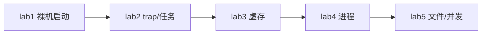
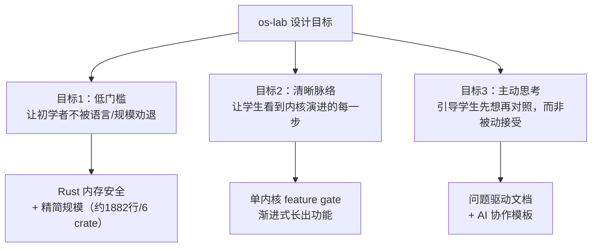
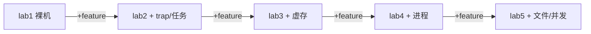

# AI 合作的操作系统课教学实验环境技术方案

> 仓库：[https://github.com/AM-SuSh/Or2-1-OS](https://github.com/AM-SuSh/Or2-1-OS) 
> 文档许可：CC BY-SA 4.0（见 `docs/LICENSE`） 
> 自研源码许可：BSD-3-Clause（见 `os-lab/LICENSE`）

---

## 目录

1. [项目概述](#1-项目概述)
2. [项目研发设计思路](#2-项目研发设计思路)
3. [技术架构与实现描述](#3-技术架构与实现描述)
4. [代码说明](#4-代码说明)
5. [测试结果与学习效率评估](#5-测试结果与学习效率评估)
6. [研发问题与解决方法](#6-研发问题与解决方法)
7. [非本队来源说明](#7-非本队来源说明)
8. [开发时使用 AI 工具的成果](#8-开发时使用-ai-工具的成果)
9. [提交内容与结论](#9-提交内容与结论)

---

## 1. 项目概述

### 1.1 赛题理解

本赛题要求团队完成两类工作：

1. 在官方参考教学环境中完成 5 个基础实验练习，并写出练习实现总结报告。
2. 设计一套适合学生自学的操作系统内核教学实验环境，包含实验指导文档、实验代码、测试用例、实验答案、文字习题与文字答案，并与参考环境、本校环境做定性和定量对比。

我们把项目拆成两条主线：

- **参考练习线**：在 `tg-rcore-tutorial` 的 ch3、ch4、ch5、ch6、ch8 中完成 exercise，实现结果通过官方 checker 验收。
- **自研环境线**：实现 `os-lab`，即一个 Rust + RISC-V 64 + QEMU 的渐进式操作系统教学实验环境，用 `lab1` 到 `lab5` 的 feature gate 展示内核从裸机到文件系统和并发的演进。

### 1.2 总体成果

本项目完成了以下交付：

| 类别 | 内容 |
| --- | --- |
| 参考练习 | 五章 exercise：ch3 `sys_trace`、ch4 `mmap/munmap`、ch5 `spawn+stride`、ch6 文件相关 syscall、ch8 死锁检测 |
| 自研源码 | `os-lab/` workspace，包含 `kernel`、6 个组件 crate、`user` 用户态测试程序 |
| 教学材料 | 5 篇 Lab 指导、5 套文字习题、5 套参考答案、实验总览 |
| 测试验证 | 24 项 host 单元测试、lab1 到 lab5 QEMU 回归、clippy `-D warnings` |
| 学习支撑 | AI 协作记录、Web 学习手册、三方对比数据、项目过程记录 |

自研环境的目标不是替代 xv6 或 rCore，而是给初学者提供一条更短、更清晰的入门路径：先用 `os-lab` 建立内核演进直觉，再用 xv6 或 rCore 深化完整系统理解。

### 1.3 技术指标对应

| 赛题要求 | 对应实现 |
| --- | --- |
| Rust 编写内核 | `os-lab/` 全部自研源码使用 Rust，少量 RISC-V 汇编用于入口和 trap |
| RISC-V 64 + QEMU | 目标为 `riscv64gc-unknown-none-elf`，运行于 `qemu-system-riscv64 virt` |
| Rust crate 组件化 | `kernel` + `os-sbi` / `os-context` / `os-syscall` / `os-alloc` / `os-vm` / `os-fs` / `user` |
| 单元测试和系统测试 | 组件 crate host 单元测试、QEMU 集成测试、参考环境 checker |
| Markdown 文档 | 所有实验指导、报告、习题和答案均为 Markdown |
| mermaid 图 | 技术方案、设计报告、架构说明、学习手册中使用 mermaid 表示流程和架构 |

> 补充材料：参考练习的完整 checker 记录见 `docs/reference-report.md`；自研环境入口与验证步骤见 `docs/os-lab.md`。

---

## 2. 项目研发设计思路

### 2.1 面向的学习痛点

学生学习操作系统内核时，常见问题有三类：

1. **原理与代码脱节**：课堂上能理解虚存、trap、进程等概念，但面对真实代码时不知道从入口、页表、上下文结构中的哪一处开始看。
2. **缺少演进脉络**：成熟教学内核功能完整，但仓库大、模块多，学生很难判断「这一章比上一章多了什么」。
3. **环境与语言门槛高**：C 指针、手动内存管理、QEMU 黑屏、交叉编译报错，会把大量学习时间消耗在非核心机制上。

`os-lab` 的设计目标是让学生少迷路，而不是做一个功能最全的内核。我们把学习对象控制在 5 个核心机制：裸机启动、trap、虚存、进程、文件与并发。

### 2.2 三个设计目标

| 目标 | 设计选择 | 作用 |
| --- | --- | --- |
| 降低入门门槛 | Rust + 精简代码规模 | 让学生少被指针和未定义行为拖住，把精力放在机制理解上 |
| 保持演进脉络 | 单内核 + feature gate | 学生在同一份代码里看到内核逐步长出 trap、mm、process、fs |
| 引导主动思考 | 问题驱动文档 + AI 提问模板 | 先问「为什么要这样设计」，再看实现，避免机械抄代码 |

### 2.3 为什么采用单内核 feature gate

参考环境每章是一个独立内核，优点是章节干净，缺点是学生每章都要重新认目录、找入口、比较差异。自研环境改为一个 `kernel` 二进制，通过 Cargo feature 逐级启用功能：



这种设计让每章新增内容更直观：

| Feature | 新增能力 | 学生重点理解 |
| --- | --- | --- |
| `lab1` | 裸机入口、SBI 输出、关机 | 内核如何被 OpenSBI 加载并开始运行 |
| `lab2` | trap、系统调用、批处理任务 | 用户态如何进入内核，内核如何保存上下文 |
| `lab3` | 物理帧、Sv39 页表、地址空间 | 虚拟地址如何翻译，用户空间如何隔离 |
| `lab4` | PCB、fork、exec、wait | 进程如何被创建、替换和回收 |
| `lab5` | fd 表、只读文件、管道、自旋锁 | 文件抽象和并发同步如何进入内核 |

### 2.4 为什么保持精简组件化

所有逻辑都塞进 `kernel` 会让代码边界混乱；拆得太碎又会回到大型参考环境的认知负担。因此本项目只拆出边界清晰、适合单测的组件：

| 组件 | 设计边界 |
| --- | --- |
| `os-sbi` | SBI 调用封装，负责 console 和 shutdown |
| `os-context` | `TrapContext`、上下文切换汇编和相关布局 |
| `os-syscall` | 系统调用编号常量，保持用户态与内核一致 |
| `os-alloc` | 物理帧分配与内核堆分配 |
| `os-vm` | 地址类型、Sv39 页表、映射和 ELF 解析 |
| `os-fs` | 内嵌只读文件系统 |

这样既保留 Rust crate 组件化，又让学生能在较短时间内读完核心路径。

### 2.5 自研系统中的 AI 协作教学设计

本项目不是只在开发过程中使用 AI，也把「怎样和 AI 一起学 OS」设计进了自研教学环境。这里的 AI 协作属于作品教学方案的一部分，不是开发工具披露。

我们把 AI 定位为**学习伙伴**，不是代码代写器。学生做实验时先读背景、看代码、写下猜想；遇到卡点后再用 AI 澄清概念、解释现象、追问原因；最后必须通过 QEMU 输出、单元测试或文字习题验证 AI 的回答。

每个 Lab 文档都采用相同的学习闭环：


文档中具体落地为三类内容：

| 设计项 | 落地方式 | 目的 |
| --- | --- | --- |
| AI 提问模板 | 每个 Lab 的「五、AI 提问模板」给出概念澄清、现象解释、代码追因、对比深化、动手探索等问法 | 教学生提出具体问题，而不是让 AI 直接写答案 |
| 答案与正文分离 | 实验正文只给背景、任务和验证要求，逐行解释放在 `labs/answers/` | 让学生先独立阅读和实验，再对照答案 |
| 协作记录 | `os-lab/docs/ai-collaboration.md` 提供五条原则、记录模板和 Lab1 到 Lab5 样例 | 让 AI 使用过程可复盘，也能作为学习效果证据 |

典型例子包括：Lab1 让学生问「为什么内核链接地址是 `0x80200000`」并用 OpenSBI 日志验证；Lab2 让学生追问 `csrrw sp, sscratch, sp` 为什么必须第一条执行；Lab3 让学生区分 PTE 中帧号左移 10 位和地址页偏移 12 位；Lab5 让学生通过去掉锁观察数据竞争。这些都要求学生用实验现象反证或确认 AI 的解释。

### 2.6 三方对比与学习效率

三套环境对比如下：

| 维度 | 自研 `os-lab` | 参考 `tg-rcore-tutorial` | 本校 xv6-riscv |
| --- | --- | --- | --- |
| 语言 | Rust | Rust | C |
| 架构 | 单内核 + feature gate | 多个章节内核 | 单一 C 源码树 |
| 代码规模 | 约 1882 行核心代码 | 约 36455 行 | 内核约 6000 到 8000 行 C |
| 组件复杂度 | 6 个组件 crate，2 层依赖 | 约 23 个组件 crate，4 层依赖 | 无 crate，靠 C 文件组织 |
| 实验覆盖 | 5 个核心机制 | ch3 到 ch8 参考练习 | 11 个 lab，覆盖更广 |
| 教学风格 | 问题驱动、先想再对照、AI 协作模板 | 实现导向、checker 验收 | 经典教材和步骤式任务 |

建议学习路径是：先用 `os-lab` 建立内核演进直觉，再用 xv6 或 rCore 扩展覆盖面。三者是互补关系：`os-lab` 负责降低入门门槛，参考环境负责成熟实现对照，xv6 负责系统性深化。

> 补充材料：自研环境的完整设计总结见 `os-lab/docs/design-report.md`；feature gate、crate 边界和 Lab 数据流见 `os-lab/docs/architecture.md`；EVOLVE 与 xv6 详细对比见根目录 `xv6-comparison.md`；学生侧 AI 协作模板和样例见 `os-lab/docs/ai-collaboration.md`。

---

## 3. 技术架构与实现描述

### 3.1 仓库结构

```text
os-lab/
├── kernel/          # 可执行内核，feature gate 主体
├── os-sbi/          # SBI 调用封装
├── os-context/      # TrapContext 与上下文切换
├── os-syscall/      # 系统调用编号
├── os-alloc/        # 物理帧与堆分配
├── os-vm/           # Sv39 页表与地址空间
├── os-fs/           # 内嵌只读文件系统
├── user/            # 用户态测试程序
├── labs/            # 实验指导、习题、答案
├── docs/            # 架构、对比、AI 协作记录
├── handbook/        # VitePress Web 学习手册
└── tests/           # 测试说明
```

根目录下的 `docs/` 存放比赛提交用技术文档，`reference-patches/` 存放参考环境练习补丁，`scripts/activate-os-env.ps1` 用于 Windows 环境激活。

### 3.2 Lab1：裸机启动

Lab1 只包含最小内核入口和 SBI 输出。QEMU 启动后先进入 OpenSBI，OpenSBI 将控制权交给加载地址 `0x80200000` 的 S-mode 内核入口 `_start`。入口汇编设置栈指针，再跳转到 Rust 的 `rust_main`。`rust_main` 清空 BSS 后通过 SBI 输出 `Hello, OS!`，最后调用 SBI shutdown。

核心机制：

- 链接脚本固定内核加载地址；
- `entry.asm` 提供 `_start`；
- `console.rs` 将 Rust 格式化输出落到 SBI `console_putchar`；
- 实验任务要求学生修改链接地址并观察崩溃，以理解 OpenSBI 与内核的加载约定。

### 3.3 Lab2：trap 与任务

Lab2 引入用户态程序、trap 入口、系统调用和批处理任务调度。用户程序执行 `ecall` 后进入 S-mode trap。RISC-V 进入 trap 时 `sp` 仍可能指向用户栈，所以入口第一步用 `csrrw sp, sscratch, sp` 完成用户栈与内核栈交换。随后保存通用寄存器、`sepc`、`sstatus` 等上下文，进入 Rust 的 `trap_handler`。

实现要点：

- `os-context` 定义 `TrapContext` 和 trap 汇编布局；
- `os-syscall` 定义 `SYS_WRITE`、`SYS_EXIT`、`SYS_YIELD` 等编号；
- `kernel/trap.rs` 根据 `scause` 分发系统调用与异常；
- `kernel/task.rs` 保存任务状态并在用户程序退出或 yield 时切换。

### 3.4 Lab3：虚存管理

Lab3 引入物理帧分配器、Sv39 页表和用户地址空间。Sv39 虚拟地址由 27 位 VPN 和 12 位页内偏移组成，VPN 再拆为 3 个 9 位索引。PTE 低 10 位存权限，物理帧号放在高位，因此写入 PTE 时帧号左移 10 位，而不是地址转换时的 12 位。

实现要点：

- `os-alloc` 管理物理页帧和内核堆；
- `os-vm` 实现 `VirtAddr`、`PhysAddr`、`PageTable`、`MemorySet`；
- `kernel/mm.rs` 建立内核恒等映射和每个用户程序的独立地址空间；
- 开启分页前必须保证内核关键区间恒等映射，否则分页开启瞬间内核自身访存会 fault。

### 3.5 Lab4：进程管理

Lab4 在任务模型上增加进程控制块、父子关系、僵尸进程和动态调度。`fork` 的关键是复制父进程地址空间和 trap 上下文，然后将子进程 trap 上下文中的 `a0` 改为 0；父进程返回子 PID，子进程返回 0，从而实现一次调用两次返回。`exec` 则用新 ELF 映像替换当前进程地址空间，并让 `sepc` 指向新程序入口。

实现要点：

- `process.rs` 实现 `ProcessControlBlock`、就绪队列、父子关系和僵尸回收；
- `fork_user_space` 深拷贝用户地址空间；
- `exec` 根据嵌入的 ELF 名称替换地址空间；
- `wait4` 等待子进程退出并回收资源。

### 3.6 Lab5：文件系统与并发

Lab5 增加文件描述符表、内嵌只读文件系统、管道和自旋锁。文件系统是教学简化版，不实现真实块设备和磁盘驱动，而是通过 `os-fs` 提供静态只读文件。管道使用环形缓冲区，在读写端之间共享，配合引用计数管理资源释放。

实现要点：

- `fs.rs` 为每个进程维护 fd 表，支持 regular file 与 pipe 两类 fd；
- `os-fs` 提供 `EmbeddedFs::default_fs()`，内置 `testfile` 等教学文件；
- `sync.rs` 用 `AtomicBool` 和 `compare_exchange_weak` 实现 `SpinMutex`；
- `pipe_test` 验证管道通信和共享缓冲同步；
- 去掉锁后可能出现偶发数据错乱，用作并发教学中的反例。

### 3.7 Web 学习手册

`os-lab/handbook/` 使用 VitePress 构建 Web 学习手册。它会同步实验指导、习题、答案和项目报告，提供 Lab 进度勾选、命令复制和 mermaid 渲染。手册不是内核运行所必需，但提升了自学体验。

> 补充材料：更细的模块依赖图、Lab1 启动时序图、Lab5 syscall/fd 数据流图见 `os-lab/docs/architecture.md`；自研环境快速开始见 `os-lab/README.md`；Web 手册说明和完整验证命令见 `docs/os-lab.md`。

---

## 4. 代码说明

### 4.1 内核主体 `kernel/`

| 文件 | 说明 |
| --- | --- |
| `entry.asm` | 内核入口 `_start`，设置栈并跳转 Rust |
| `main.rs` | `rust_main`、feature 模块声明、初始化顺序、主控制流 |
| `console.rs` | `print!` / `println!`，底层调用 SBI 输出 |
| `config.rs` | 内存布局、栈大小、最大任务/进程数等配置 |
| `cell.rs` | 包装全局可变状态，减少 Rust 2024 `static mut` 警告 |
| `loader.rs` | 构建期嵌入用户程序，按名称或 ID 取 ELF |
| `trap.rs` | trap 入口对接、syscall 分发、异常处理 |
| `task.rs` | lab2/lab3 批处理任务管理 |
| `mm.rs` | 内核地址空间、用户地址空间、satp 切换 |
| `process.rs` | PCB、fork、exec、wait、进程调度 |
| `fs.rs` | fd 表、open/read/write/close、pipe fd 接入 |
| `sync.rs` | 自旋锁、管道缓冲、引用计数 |

### 4.2 组件 crate

| crate | 主要内容 | 测试情况 |
| --- | --- | --- |
| `os-sbi` | SBI legacy console/shutdown 封装 | 通过编译和 Lab1 QEMU 验证 |
| `os-context` | `TrapContext` 与 trap 汇编 | 3 项 host 单元测试 |
| `os-syscall` | 系统调用编号 | 4 项 host 单元测试 |
| `os-alloc` | 页帧分配器、堆分配器 | 6 项 host 单元测试 |
| `os-vm` | Sv39 页表、映射、地址空间 | 5 项 host 单元测试，需单线程 |
| `os-fs` | 内嵌只读文件系统 | 4 项 host 单元测试 |

组件测试集中覆盖可在 host 上验证的纯逻辑，如页表索引、帧分配回收、文件读取边界等。内核态行为通过 QEMU 验证。

### 4.3 用户态测试程序

| 程序 | 用途 |
| --- | --- |
| `hello` | 最小 write syscall 测试 |
| `power` | 计算输出，验证用户程序运行 |
| `yield` | 主动让出 CPU，观察调度 |
| `fork_test` | 验证父子进程返回值和等待 |
| `exec_test` | 验证地址空间替换和入口跳转 |
| `fs_test` | 读取内嵌文件，输出 `Hello from testfile!` |
| `pipe_test` | 父子进程通过管道通信，输出 `pipe_test pass` |

### 4.4 构建与运行

Windows 下先在仓库根目录激活环境：

```powershell
. .\scripts\activate-os-env.ps1
cd os-lab
```

运行各 Lab：

```powershell
cargo run -p kernel --features lab1 --release
cargo run -p kernel --features lab2 --release
cargo run -p kernel --features lab3 --release
cargo run -p kernel --features lab4 --release
cargo run -p kernel --features lab5 --release
```

组件单元测试：

```powershell
cargo test -p os-context -p os-syscall -p os-sbi -p os-fs --target x86_64-pc-windows-msvc
cargo test -p os-alloc -p os-vm --target x86_64-pc-windows-msvc -- --test-threads=1
```

`os-vm` 测试共享全局分配器状态，因此必须加 `-- --test-threads=1`。

---

## 5. 测试结果与学习效率评估

### 5.1 参考环境练习测试

参考仓库锁定 branch `test`、commit `d6330a6db1f81c8c1cfba5ec3db9923199398f24`。本队只提交相对基线的补丁，不提交完整参考仓库。

base 模式通过情况：

| 章节 | checker |
| --- | --- |
| ch3 | 4/4 |
| ch4 | 6/6 |
| ch5 | 14/14 |
| ch6 | 15/15 |
| ch8 | 22/22 |

exercise 模式通过情况：

| 章节 | 实现内容 | checker |
| --- | --- | --- |
| ch3 | `sys_trace` | 7/7 |
| ch4 | `mmap` / `munmap` | 16/16 |
| ch5 | `spawn` + stride 调度 | 17/17 |
| ch6 | `linkat` / `unlinkat` / `fstat` + spawn | 33/33 |
| ch8 | 死锁检测 | 25/25 |

### 5.2 自研环境测试

2026-06-27 终验结果如下：

| 测试类型 | 结果 |
| --- | --- |
| Lab1 QEMU | 输出 `Hello, OS!` |
| Lab2 QEMU | 输出 `409684505`、`Yield round`、`All user apps exited.` |
| Lab3 QEMU | 虚存开启后用户程序正常运行，yield 多轮输出 |
| Lab4 QEMU | 输出 `fork_test pass` |
| Lab5 QEMU | 输出 `Hello from testfile!`、`fs_test pass`、`pipe_test pass` |
| host 单元测试 | 24 项全部 `ok` |
| clippy | workspace 与各 lab feature 均通过 `-D warnings` |
| handbook | `npm run build` 可同步并构建静态手册 |

### 5.3 学习效率评估

基于项目设计和与参考环境、xv6 的对比，我们认为 `os-lab` 对初学者的学习效率提升体现在四方面：

| 维度 | 表现 | 原因 |
| --- | --- | --- |
| 认知负担 | 较低 | 代码规模小、crate 数少、feature 演进清楚 |
| 反馈速度 | 较快 | Rust 编译器、host 单测、QEMU 成功字符串 |
| 学习动机 | 较强 | 每章都能看到内核新增能力，成就感明确 |
| 知识留存 | 较好 | 文档先提问再解释，配合习题和答案复盘 |

需要说明的是，学习效率评估目前主要来自设计分析与自测经验，尚未经过大规模课堂数据验证。后续可收集学生耗时、错题类型、QEMU 调试次数等指标进一步量化。

> 补充材料：参考练习 base/exercise 逐章验收与复现命令见 `docs/reference-report.md`；自研环境完整验证步骤见 `docs/os-lab.md` 和 `os-lab/tests/README.md`；EVOLVE 与 xv6 对比见根目录 `xv6-comparison.md`。

---

## 6. 研发问题与解决方法

操作系统课程历来是计算机专业最难啃的骨头之一。学生在学习时普遍面临三个痛点：

- **原理与实践脱节**：听懂了「虚存是什么」，但面对真实的页表代码仍无从下手。
- **缺少全局脉络**：成熟教学内核（如 xv6、rCore）功能完整，但代码量大、结构复杂，学生容易迷失在细节里，看不到「内核是怎么一步步长出来的」。
- **环境门槛高**：C 语言的指针陷阱、庞大的依赖结构、晦涩的错误诊断，让初学者把大量精力耗在「调指针 bug」而非「理解机制」上。

### 6.1 设计目标与总体方案

针对上述痛点，`os-lab` 确立了三个设计目标：



这三个目标直接落到本队自研系统的具体方案中：

| 设计目标 | 真实方案 | 对应改进 |
| --- | --- | --- |
| 低门槛 | 采用 Rust，实现规模控制在约 1882 行核心代码，组件压缩到 6 个 crate、2 层依赖 | 相比参考环境约 36455 行、29 个 crate，学生更容易读完核心路径 |
| 清晰脉络 | 一个 `kernel` 通过 `lab1` 到 `lab5` feature 逐级启用功能 | 学生始终在同一套目录和入口里观察内核从裸机长到文件系统 |
| 主动思考 | Lab 文档采用「问题驱动 + 先想再对照」，并配套 AI 提问模板、习题和答案 | 学生不是被动抄代码，而是先形成猜想，再通过 AI、代码和实验验证 |

### 6.2 核心架构决策

**决策一：单内核 + feature gate 渐进式** 
不是 8 个独立内核，而是一个内核通过 Cargo feature 逐步启用功能。学生始终在同一个代码库工作，切换 feature 就能看到内核「长出」新能力。这让 OS 演进脉络清晰可见。



**决策二：精简组件化** 
将参考环境中较复杂的 crate 体系压缩为 6 个组件 crate：`os-sbi`、`os-context`、`os-syscall`、`os-alloc`、`os-vm`、`os-fs`。每个 crate 职责聚焦、边界清晰，适合 host 单元测试。`kernel` 只负责集成和策略，如调度、进程生命周期、fd 表和系统调用分发。

**决策三：Rust + 问题驱动文档** 
用 Rust 的内存安全让学生聚焦机制本身，不被 C 指针问题拖累；文档采用「问题驱动 + 先想再对照」风格，每个机制先让学生猜测「如果是我会怎么设计」，再揭示实际实现。例如 lab2 不直接告诉学生 `csrrw sp, sscratch, sp` 的答案，而是先问「进 trap 时 sp 还指向哪里」。学生带着这个问题读汇编，更容易理解为什么第一条指令必须交换栈。

**决策四：AI 协作模板作为教学创新改进** 
这是本队自研系统相对参考环境和 xv6 的明确创新点之一。参考环境和 xv6 本身并没有内置「学生如何与 AI 协作学习 OS」的流程；`os-lab` 把 AI 协作方法写进每个 Lab 文档。每章都设置「AI 提问模板」，引导学生问概念澄清、现象解释、代码追因、对比深化、动手探索类问题，而不是直接要求 AI 生成完整答案。

具体落地方式如下：

| 设计项 | 落地位置 | 教学作用 |
| --- | --- | --- |
| AI 提问模板 | 每个 `lab*.md` 的「五、AI 提问模板」 | 训练学生提出具体问题，如「为什么 PTE 帧号左移 10 位」 |
| 答案与正文分离 | `labs/answers/` | 先做实验再对照答案，减少直接抄答案 |
| 协作记录模板 | `os-lab/docs/ai-collaboration.md` | 记录问了什么、AI 怎么引导、自己如何验证 |
| 验证闭环 | QEMU 输出、host 单元测试、文字习题 | 用实验结果约束 AI，避免轻信模型输出 |

因此，AI 在自研系统里不是一个附加说明，而是教学流程的一部分：学生先读背景和代码，带着具体问题问 AI，再通过 QEMU、`cargo test` 或习题验证回答。这样既符合赛题「AI 合作」主题，也避免把 AI 变成代写工具。

### 6.3 教学覆盖与取舍

`os-lab` 的 5 个 Lab 覆盖操作系统三大核心主题：

| OS 主题 | 对应 Lab | 核心知识点 |
| --- | --- | --- |
| 基础机制 | lab1、lab2 | 裸机启动、SBI、trap、系统调用、上下文切换 |
| 虚拟化 | lab3、lab4 | Sv39 页表、地址空间、fork / exec / wait |
| 并发 | lab5 | 自旋锁、数据竞争、管道 IPC、环形缓冲 |
| 持久化 | lab5 | 文件描述符、内嵌只读文件系统 |

本队没有把网络、mmap、真实磁盘文件系统、抢占式调度全部塞进第一版，而是有意控制范围。Lab5 的文件系统使用内嵌只读文件，调度采用协作式/批处理风格，fork 使用地址空间深拷贝而非 COW。这些是教学简化，不是隐藏缺陷；目的是让学生先理解核心路径，后续再扩展更复杂机制。

### 6.4 自研实现中的工程问题

| 问题 | 原因 | 解决方法 |
| --- | --- | --- |
| lab1 修改链接地址后黑屏 | 链接地址与 OpenSBI 跳转地址不一致 | 对照 OpenSBI 日志 `Next Address`，在文档中说明 `0x80200000` 的来源 |
| lab3 开分页后容易崩溃 | 内核地址未恒等映射，分页开启后自身访存失效 | 先建立内核关键区间恒等映射，再写 `satp` |
| lab4 fork/exec 语义难验证 | fork 一次调用两次返回、exec 替换上下文不直观 | 写 `fork_test` 和 `exec_test`，用输出顺序验证返回值与入口 |
| lab5 管道偶发数据错 | 去掉锁后环形缓冲出现数据竞争 | 用 CAS 自旋锁保护共享缓冲，并在文档中把错误作为并发反例 |
| Rust 2024 下 clippy 报 `static mut` 相关警告 | 全局内核状态需要内部可变性，但裸 `static mut` 更严格 | 用 `SyncUnsafeCell` 封装全局状态，集中 unsafe 边界 |
| lab5 长时间无输出 | 用户态测试程序未先构建或内嵌 ELF 不完整 | 验证流程加入 `cargo build -p user ... --release`，Makefile 串起依赖 |

### 6.5 参考练习阶段问题

| 问题 | 原因 | 解决方法 |
| --- | --- | --- |
| ch5 QEMU 卡在 `>>` | 未设置 `CHAPTER=5`，`initproc` 进入交互 shell | 设置 `CHAPTER` 后 `cargo clean` 并重编，因为 `CHAPTER` 是编译期环境变量 |
| ch6 `waitpid` 永不返回 | `unlink` 路径持有 `fs.lock()` 时再次调用需要加锁的 `clear()`，自旋锁不可重入 | 缩短锁作用域，释放锁后再清理 inode |
| ch8 死锁检测容易污染同步 crate | 若直接改 `tg-sync`，会和上游 exercise 骨架耦合太紧 | 将 `DeadlockState` 放在进程层，在 syscall 路径检查并返回 `-0xDEAD` |
| Windows checker 管线不顺 | PowerShell 管道行为与 bash 不同 | 用 `Tee-Object` 保存输出，再交给 checker 判定 |

> 补充材料：自研系统设计目标、架构决策、AI 协作经验和局限性见 `os-lab/docs/design-report.md`；参考练习阶段各章实现摘要和 AI 协助说明见 `docs/reference-report.md`；开发过程与验证留痕见 `progress.md`。

---

## 7. 非本队来源说明

### 7.1 参考与对比来源

| 来源 | 用途 | 处理方式 |
| --- | --- | --- |
| `tg-rcore-tutorial` | 赛题 30% 参考练习基线 | 完整仓库不提交；仅提交相对基线的补丁与报告 |
| `rCore-Tutorial-in-single-workspace` | 自研架构设计和三方对比参照 | 仅作为公开参考资料，不复制源码进自研环境 |
| MIT 6.S081 / xv6-riscv | 本校教学环境对比对象 | 仅用于对比语言、规模、实验覆盖和教学路径 |
| OS 课程讲义、OSTEP、CSAPP、RISC-V Reader | 概念学习和文档背景 | 仅引用思想和公开链接，不复制正文 |
| OpenSBI、QEMU、Rust 工具链 | 运行和构建依赖 | 按各自上游许可证使用 |
| VitePress / Vue | Web 学习手册 | 作为前端构建依赖使用 |

### 7.2 团队自研范围

本队自研范围包括：

- `os-lab/` workspace 的内核、组件 crate、用户态测试程序；
- Lab1 到 Lab5 实验指导、习题、参考答案；
- host 单元测试、QEMU 测试说明；
- 设计、架构、对比、AI 协作记录和本技术方案；
- Web 学习手册配置与同步脚本；
- 参考环境 exercise 的补丁实现。

### 7.3 许可与边界

自研源码采用 BSD-3-Clause；技术文档采用 CC BY-SA 4.0。参考仓库体积较大，不纳入 Git；`target/`、QEMU 输出、临时日志等运行产物不作为正式提交内容。AI 生成的代码建议、文档草稿和 mermaid 草图只有经过人工审查与测试验证后才进入仓库。

> 补充材料：文档许可证见 `docs/LICENSE`；自研源码许可证见 `os-lab/LICENSE`；参考练习补丁说明见 `reference-patches/README.md`。

---

## 8. 开发时使用 AI 工具的成果

本节说明团队在开发项目时使用 AI 工具完成了哪些工作。

### 8.1 使用工具

| 工具 | 用途 |
| --- | --- |
| Cursor IDE Agent / Composer | 多文件编辑、代码解释、文档重构、验证命令编排 |
| ChatGPT / Claude 等通用模型 | 概念问答、算法结构讨论、错误原因分析、文档措辞参考 |

未将 API 密钥、账号信息、私有对话原文提交到仓库。

### 8.2 在参考练习中的成果

| 章节 | AI 参与成果 | 最终验证 |
| --- | --- | --- |
| ch3 | 帮助理解 `trace_request` 语义和 syscall 计数插入位置 | checker 7/7 |
| ch4 | 协助梳理 `mmap` 权限位、页对齐和重叠检查路径 | checker 16/16 |
| ch5 | 帮助定位 QEMU 卡在 shell 与 `CHAPTER` 变量相关 | checker 17/17 |
| ch6 | 辅助分析硬链接、`nlink` 更新和自旋锁重入问题 | checker 33/33 |
| ch8 | 提供银行家算法和等待图的结构参考 | checker 25/25 |

AI 的作用主要是帮助理解和定位，不替代最终实现。所有修改都通过 checker 验收。

### 8.3 在 `os-lab` 中的成果

| 研发环节 | AI 帮助完成的内容 | 人工确认方式 |
| --- | --- | --- |
| 内核实现 | 初始整体模块骨架、trap 注释、syscall 分发草稿 | QEMU 逐 lab 运行 |
| 组件 crate | 页表位运算解释、测试用例草稿、边界条件提醒 | 24 项 host 单测 |
| 用户态测例 | `fork_test`、`fs_test`、`pipe_test` 的测试思路 | QEMU 输出判定 |
| 文档体系 | Lab 文档结构、习题组织、mermaid 草图、对比表 | 团队人工走查 |

### 8.4 人工审查机制

研发过程中采用以下约束：

1. 先读代码或讲义，再带具体问题问 AI。
2. 优先要思路和解释，不直接索要整段未审查代码。
3. 所有代码进入仓库前人工读 diff。
4. 关键结论必须由 QEMU、checker、`cargo test` 或 clippy 验证。
5. 文档中的版本号、测试分数、路径和命令由人工核对。

> 补充材料：Lab1 到 Lab5 的学生侧 AI 协作记录模板与样例见 `os-lab/docs/ai-collaboration.md`；每日研发过程、测试命令和修改记录见 `progress.md`。

---

## 9. 提交内容与结论

### 9.1 正式提交内容

| 类别 | 路径 |
| --- | --- |
| 项目总报告 / 技术方案 | `项目总报告.md` |
| 环境说明 | `docs/environment_setup.md` |
| 自研环境说明与验证 | `docs/os-lab.md` |
| 参考练习报告 | `docs/reference-report.md` |
| 自研源码 | `os-lab/` |
| 实验指导、习题、答案 | `os-lab/labs/` |
| 设计、架构、对比、AI 记录 | `os-lab/docs/` |
| Web 学习手册 | `os-lab/handbook/` |
| 参考环境补丁 | `reference-patches/` |
| 项目过程记录 | `progress.md` |

### 9.2 项目结论

本项目完成了赛题要求的两条主线：参考环境五章 exercise checker 全部通过，自研 `os-lab` 从裸机启动逐步演进到文件系统与管道，配套教学文档、习题答案、测试说明、Web 手册和 AI 协作记录。

`os-lab` 的核心价值在于教学路径清晰：学生始终在同一个内核中观察功能逐步加入，用 Rust 降低内存错误干扰，用问题驱动文档和 AI 提问模板促进主动思考。它不追求覆盖所有 OS 主题，而是把 5 个核心机制讲清楚，为后续学习 xv6、rCore 或更完整的系统内核打基础。

后续迭代方向包括：加入真实磁盘文件系统、实现抢占式调度、增加 mmap / COW / 网络等扩展 lab等。
