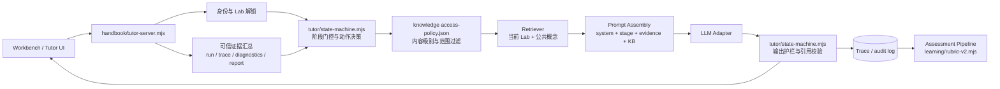
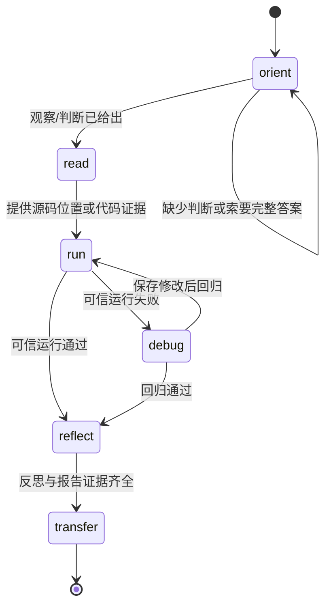
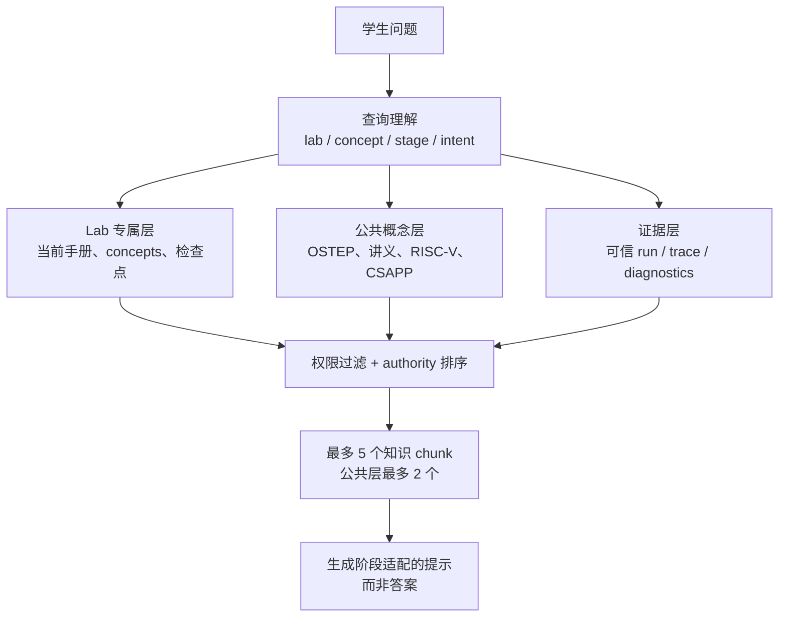
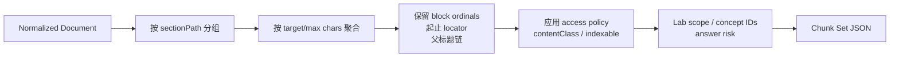

# Agent 系统技术设计与实现记录

本文记录 OS Lab 中 AI 导师、AI 学习评价和 Harness 工程的可执行技术契约。它描述当前已经落地的边界与接口，不把尚未实现的向量检索或自动评分能力写成既成事实。

## 1. 总体目标与边界

系统中的两个 Agent 应保持职责分离：

| 组件 | 输入 | 核心职责 | 输出 | 权限边界 |
| --- | --- | --- | --- | --- |
| AI Tutor | 当前 Lab、阶段状态、学生消息、代码/运行/Trace 证据、允许的知识片段 | 通过递进提示促成判断、观察、假设、验证和迁移；拒绝直接交付答案 | 一轮教学回复、最多一个反问、动作和合法引用 | 不能改变服务端阶段，不能声称没有证据的运行结果，不能读取 `teacher-only` |
| AI Assessment | 学习事件、运行断言、报告、Tutor 对话、知识库元数据 | 汇总学习过程并给出带证据的量规建议 | 细项分数、证据引用、待复核项、学习摘要 | 不拥有最终成绩裁决权；没有证据的项必须标为未观察到 |
| Tutor Harness | Tutor fixture、阶段/证据上下文、候选回复 | 离线回归教学安全与行为契约 | 泄漏率、阶段准确率、动作召回、引用准确率等 | 不访问真实学生数据，不调用生产模型 |
| Assessment Harness | 事件序列、报告和评分候选 | 回归评分稳定性、证据完整性和边界行为 | 量规断言、证据覆盖率、越权/幻觉统计 | 与 Tutor Harness 分开计分，允许共享事件 fixture |

两个 Harness 不是一个混合评分器。它们可以共享 `event-v2`、`run-result-v1` 等输入 schema 和测试运行器，但必须拥有独立的期望字段、阈值和失败门槛；这样 Tutor 的“是否追问”不会被 Assessment 的“是否评分”掩盖。

## 2. 运行时架构



当前 Tutor 的权威控制点在服务端：`decideTutorTurn()` 先于模型调用执行阶段和证据门控，`enforceTutorOutput()` 在模型输出后执行答案泄漏与 `run:/trace:/event:` 引用校验。RAG 只能提供不可信的教学材料，不能覆盖这两个控制点。

### Tutor 一轮的状态转换



每个阶段只允许一个主要教学动作（例如 `request-source-evidence` 或 `request-falsifiable-hypothesis`）。直接索要完整代码时，状态保持不变并执行 `apply-answer-guardrail`；提示层级最多递进到 L4，防止一次回复越过学习阶段。

## 3. Harness 工程

Tutor Harness 的实现入口是 [tutor/harness.mjs](../tutor/harness.mjs)，fixture 位于 `tutor/fixtures/harness-cases-v1.json`，命令入口是 `tutor/harness-cli.mjs`。当前阈值包括：答案泄漏率不高于 5%、阶段准确率和动作召回不低于 85%、引用准确率不低于 90%、无证据判断率为 0、单轮最多一个问题的比例不低于 90%。

Harness 对每一轮同时检查：

1. 回复是否命中 `forbiddenPatterns`（完整实现、patch、直接答案等）。
2. 服务端选择的阶段是否在 `allowedStages`，是否包含 `requiredActions`。
3. 回复中的引用是否属于本轮输入证据；任何越权引用都失败。
4. `mastered/passed/correct/incorrect` 等判断是否绑定了有效证据。
5. 是否只问一个可执行问题。

Assessment Harness 应复用事件和证据引用 schema，但使用独立 fixture，例如“相同代码结果、不同反思质量”的样例，验证评分项是否只引用 `event:`、`run:`、`report:` 等真实记录。Tutor Harness 的通过不代表评分 Harness 通过，二者在 CI 中应分别报告。

## 4. 知识库分层与 RAG 契约

知识库采用“公共概念 + Lab 专属 + 运行时证据”的三层检索上下文：



证据层不是普通文本 RAG：它来自服务端验证过的运行和 Trace，优先级高于书本解释。知识片段必须携带 `sourceId`、`contentClass`、`labScope`、`sectionPath` 和稳定 locator；Tutor 的 `kb:` 引用只能指向本轮实际召回的 chunk。未解锁 Lab 不允许通过公共资源回退获取专属材料。

### Step 1：规范知识源

机器可读清单位于 [learning/knowledge/sources.json](../learning/knowledge/sources.json)，只登记去重后实际入库的 8 个 canonical source：

- 平台 Lab 手册、Lab package 概念/检查点、发布目录（平台行为的最高权威）。
- 根目录 OSTEP 中文完整版和 RISC-V Reader 本地 PDF（稳定、可复现的本地副本）。
- LearningOS 讲义 Markdown 源仓库（固定 commit 后快照）。
- rCore Tutorial Guide 和 CSAPP 中文 GitBook（快照后作为补充资料）。

镜像、拆分 PDF、参考实现和测试仓库不作为重复 Source 记录；去重决策写在 `learning/knowledge/README.md`。远程资料只有在 commit/content hash 和许可证复核完成后才可进入发布索引。`validate-sources.mjs` 会检查 ID 唯一性、格式、路径存在性以及路径是否越出工作区。

### Step 2：权限与敏感级别

[learning/knowledge/access-policy.json](../learning/knowledge/access-policy.json) 定义四类内容：

- `student-safe`：可检索、可有限引用（最多 240 字符）。
- `guided-hint`：只能转换成一个阶段适配的问题或观察目标，不得原文引用。
- `teacher-only`：仅评分和教师复核使用。
- `system-metadata`：仅服务端门控使用，不进入全文索引。

策略同时绑定来源权威等级、Lab 作用域、冲突规则和硬拒绝路径。当前 Tutor 只允许前两类，最多召回 5 个 chunk，其中公共概念最多 2 个；运行/Trace 证据优先于知识；直接索要答案时跳过知识检索。教师上传通过 `uploaded -> parsing -> pending-review -> published` 生命周期，默认 `teacher-only`，需要许可证、范围、答案风险和教师审批字段齐全后才进入索引。

## 5. 多格式规范化（Step 3）

规范化入口是 `learning/knowledge/normalize.py`，输出契约由 [document-schema.json](../learning/knowledge/document-schema.json) 固定。不同输入先解析成统一 `Document`，再由后续章节感知分块器消费：

```json
{
  "schemaVersion": 1,
  "documentId": "source-id:sha256-prefix",
  "sourceId": "platform-lab-manuals",
  "format": "markdown",
  "language": "mixed",
  "contentHash": "<sha256>",
  "blocks": [{
    "id": "block-000001",
    "ordinal": 1,
    "type": "paragraph",
    "text": "...",
    "sectionPath": ["实验 2", "入口"],
    "locator": {"path": "...", "lineStart": 7, "lineEnd": 9}
  }]
}
```

Markdown/HTML 保留标题层级、章节路径、代码语言、HTML anchor；JSON/YAML 保留为 `structured` block，避免把字段关系破坏成无序文本；TXT 和 PDF 按空行/标题聚合段落。PDF 使用 `pdfplumber` 抽取、`pypdf` 读取元数据，并记录 page/line locator；重复页眉页脚会被过滤，文本密度低于阈值时设置 `requiresOcr` 和 warning，而不是静默生成空文本。

### Step 3 验证结果

- `python -m unittest -v learning/knowledge/test_normalize.py`：3/3 通过。
- Lab2 Markdown：145 blocks，章节路径和 Rust 代码块 locator 正常。
- OSTEP PDF 预览：492 页总量、处理 3 页、19 blocks、`partial=true`、`requiresOcr=false`。
- RISC-V Reader PDF 预览：164 页总量、处理 2 页、6 blocks、`partial=true`、`requiresOcr=false`。
- 三份输出均通过 `document-schema.json` 的 Draft 2020-12 校验，所有 block 非空且 ordinal 连续。
- 已安装 Poppler 25.07.0-0，并用 `pdftoppm` 抽样渲染 OSTEP 正文页和 RISC-V Reader 封面；页面清晰，无裁切、重叠或乱码。

这里的 PDF 预览只验证解析器和质量信号，尚未代表全量入库；全量处理应在数据库表结构、增量更新和失败恢复策略确定后执行。

## 6. 章节感知分块（Step 4）

分块入口是 `learning/knowledge/chunk.py`，输出契约由 [chunk-schema.json](../learning/knowledge/chunk-schema.json) 固定。算法以规范化 block 为最小可追溯单元，相邻 block 只有在 `sectionPath` 完全相同时才允许合并；遇到新标题立即结束当前 chunk，因此不会把“Trap 入口”和“任务切换”混成同一检索证据。



每个 chunk 保存以下关键字段：

- `sectionPath`：完整父标题链，作为检索过滤与提示上下文，不把标题字符串重复写入正文。
- `blockOrdinals`、`locatorStart`、`locatorEnd`：支持从 `kb:` 引用回到 Markdown 行号、HTML anchor 或 PDF 页码。
- `contentClass`、`indexable`：由来源绑定、路径覆盖和硬拒绝规则推导；`system-metadata` 和硬拒绝路径不会进入全文索引。
- `labScope`：同时识别 `lab2/` 目录和 `lab2-trap-and-task.md` 文件名，公共教材标为 `global`。
- `conceptIds`：从结构化 block 的 `id/conceptId/concept_id` 字段抽取，供后续概念过滤和学习评价关联。
- `answerRisk`：`low/medium/high/blocked` 四级；代码、guided hint、答案关键词和硬拒绝路径逐级提高风险。

默认目标长度为 1000 字符、硬上限 1400 字符。算法不做隐式 overlap：跨 chunk 复制文本会让引用范围和泄漏审计变得含糊，而完整标题链已经提供稳定上下文。超长单 block 会按句子或固定窗口切分，并标记 `splitFromLongBlock=true`。

### Step 4 验证结果

- 新增 `build_lab_chunks.py`，从 `sources.json` 自动发现且强制要求 Lab1-Lab8 齐全；每个 Lab 依次执行 normalize、Document Schema、chunk、Chunk Schema 校验。
- 规范化、分块与八 Lab 集成测试合计 10/10 通过，覆盖章节边界、locator、Lab 文件名识别、概念 ID、权限覆盖、硬拒绝路径、超长代码 fence 和全 Lab 产物完整性。
- Lab1-Lab8 共 840 blocks 生成 145 chunks；每个 chunk 都只属于对应 Lab，locator 使用工作区相对路径，不写入本机盘符。
- OSTEP 三页预览：19 blocks 生成 3 chunks，全部为 `global` scope。
- 所有 Chunk Set 均通过 Draft 2020-12 Schema 校验，chunk ordinal 连续且保留有效 block 引用。

| Lab | Blocks | Chunks | Chunk characters |
| --- | ---: | ---: | ---: |
| Lab1 | 133 | 16 | 9,692 |
| Lab2 | 145 | 22 | 10,356 |
| Lab3 | 100 | 19 | 6,378 |
| Lab4 | 91 | 19 | 5,883 |
| Lab5 | 102 | 17 | 8,137 |
| Lab6 | 89 | 17 | 7,475 |
| Lab7 | 87 | 17 | 7,253 |
| Lab8 | 93 | 18 | 7,327 |

可检查产物位于 `learning/knowledge/build/lab-manuals/`：`manifest.json` 是总览，`documents/` 保存规范化中间层，`chunks/` 保存每个 Lab 的实际分块。该目录是确定性构建输出并被 Git 忽略，源手册或算法变化后重新运行 `python learning/knowledge/build_lab_chunks.py` 即可刷新。

## 7. 教师新增知识的接口预留

教师资料不应直接写入向量表。建议由服务端提供 `POST /teacher/knowledge-sources`：先保存原文件、SHA-256、上传者和 MIME，生成 `sourceId`，进入 `pending-review`；审核接口补充 `licenseStatus`、`contentClass`、`scope`、`answerRiskReviewed` 和 `teacherApproval` 后才允许发布。发布动作触发规范化、分块、索引任务，并保留 parser/version/content hash，便于回滚到上一版。

该接口与 `sources.json` 的静态平台清单并不冲突：平台内置来源走版本控制，教师来源走数据库生命周期；两者最终都必须产出相同的 Document/Block 元数据和同一套 access policy 决策。

## 8. 当前状态与后续步骤

| 步骤 | 状态 | 交付物 |
| --- | --- | --- |
| 1. 知识源盘点 | 已完成 | `sources.json`、校验脚本、去重规则 |
| 2. 权限矩阵 | 已完成 | `access-policy.json`、校验脚本、教师上传生命周期 |
| 3. 多格式规范化 | 已完成 | `normalize.py`、Schema、单测和 PDF 预览 |
| 4. 章节感知分块 | 已完成 | `chunk.py`、Chunk Schema、权限/范围/风险元数据和单测 |
| 5. SQLite + FTS | 待确认 | 文档/块/来源表、FTS5、版本和回滚 |
| 6. Tutor 服务接入 | 待确认 | policy gate、检索 API、prompt adapter |
| 7. 向量检索与混合排序 | 待确认 | embedding、BM25/FTS + 向量融合、重排 |
| 8. RAG Tutor Harness | 待确认 | RAG 泄漏、引用归属、权限越权和稳定性回归 |

Step 5 将把 Source、Document、Chunk 和 ingestion run 分开建表，以 FTS5 只索引 `indexable=true` 的正文；`contentClass`、`labScope`、`conceptIds` 和 `answerRisk` 保留为结构化过滤字段，而不是拼进检索文本。
