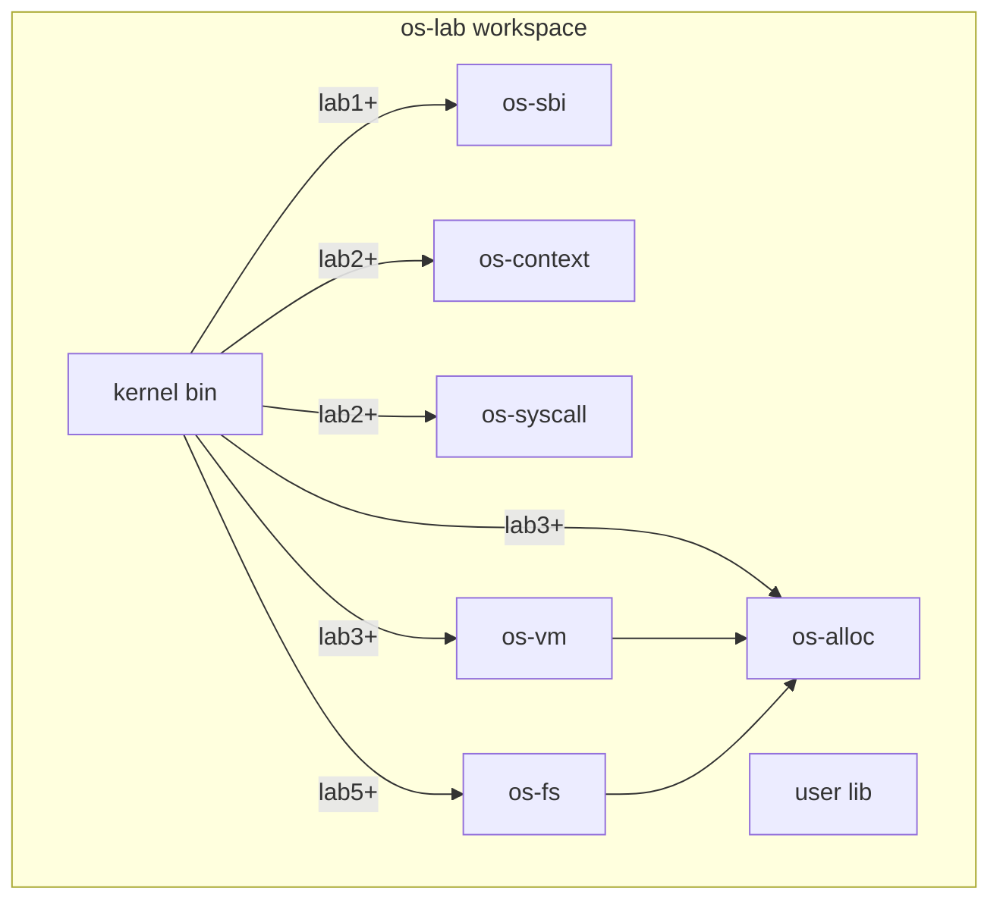
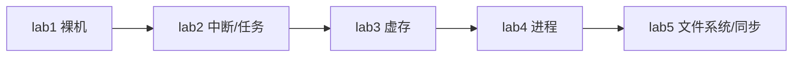
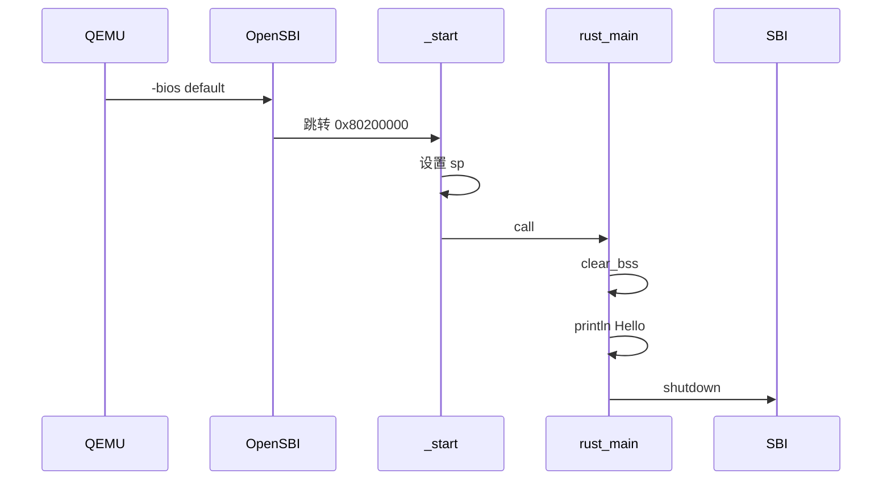

# os-lab 架构说明

## 设计目标

与参考环境 `tg-rcore-tutorial`（8 个独立内核 + 23 个 crate）不同，本环境采用：

1. **单内核渐进式架构**：一个 `kernel` 二进制，通过 Cargo feature 逐级启用功能。
2. **精简组件化**：7 个独立库 crate，两层依赖，降低初学者认知负担。
3. **内嵌验证**：后续在内核与组件中通过 `#[cfg(test)]` 与集成测试自证正确性。

## Workspace 结构



## Feature Gate 层级



| Feature | 内核模块 | 依赖 crate |
|---------|----------|------------|
| lab1 | `main`, `console` | os-sbi |
| lab2 | + `trap`, `task` | os-context, os-syscall |
| lab3 | + `mm` | os-alloc, os-vm |
| lab4 | + `process` | （沿用 lab3） |
| lab5 | + `fs`, `sync` | os-fs |

## Lab1 启动流程（当前已实现）



### 关键地址与文件

- 内核加载地址：`0x80200000`（`kernel/linker.ld`）
- 入口汇编：`kernel/src/entry.asm` → `_start`
- Rust 入口：`kernel/src/main.rs` → `rust_main`
- SBI 封装：`os-sbi` crate（legacy console / shutdown）
- 构建：`kernel/build.rs` 注入链接脚本；`.cargo/config.toml` 配置 `build-std` 与 QEMU runner

## 协作边界（三人分工）

| 目录 | 负责人 | 说明 |
|------|--------|------|
| `kernel/src/` | 成员 A | 内核主体与 feature 集成 |
| `os-*/`, `user/`, `tests/` | 成员 B | 组件 crate 与测试 |
| `labs/`, `docs/`（实验文档） | 成员 C | 实验指导与评估文档 |

Day 1 由成员 A 搭建内核骨架；成员 B 完成 `os-sbi` 与组件 crate 占位，待 Day 2–5 填充实现。

## Lab2 当前状态（Day2 已完成）

- 内核模块：`trap.rs`（syscall write/exit/yield + 定时器抢占）、`task.rs`（TCB + 批处理调度）、`loader.rs`（构建期嵌入 `.bin` 加载）。
- 组件：`os-context`（TrapContext + `trap.asm`）、`os-syscall`（编号 64/93/124 等）。
- 用户程序：`hello`、`power`、`yield`。
- 验证：`cargo run -p kernel --features lab2` 通过；`cargo test -p os-context -p os-syscall` host 测试通过。

## Lab3 当前状态（Day3 已完成）

- 组件（成员 B）：`os-alloc`（栈式页帧分配 + Bump 堆分配器，6 项 host 测试）、`os-vm`（Sv39 三级页表 + `MemorySet` + `parse_elf`，5 项 host 测试）。
- 内核（成员 A）：
  - `mm.rs`：内核地址空间恒等映射 `stext..FRAME_POOL_START`；每任务 `USER_SPACES[i]` + `user_token`；`create_user_space` 经 ELF PT_LOAD 映射私有用户页；用户地址空间用 `map_kernel_trap_regions_user` **排除**用户槽 `0x80400000..0x80420000`，避免与 ELF 段争用恒等映射物理页。
  - `loader.rs`：lab3+ 嵌入 ELF（`hello`/`power`/`yield`），`get_app_elf` + `elf_entry_point`。
  - `task.rs`：`init_tasks` 为每任务建独立地址空间；`sys_write` 在用户 satp 下拷贝缓冲区后再切回内核 satp 输出。
  - `trap.rs`：`activate_kernel` / `restore_to_user_paged`（内核 satp 恢复寄存器，sret 前切用户 satp）；`stvec` 仍指向内核 VA 的 `__alltraps`。
  - `os-context`：`trap.asm` 保存/恢复用户 `sp`（`sscratch`）；`RESTORE_SCRATCH` 槽位于 `ekernel..FRAME_POOL_START` 恒等映射区。
- 文档（成员 C）：`labs/lab3-memory.md`、`labs/answers/lab3-answers.md`、`docs/comparison-data.md`。
- 验证：`cargo run -p kernel --features lab3` 输出 `Hello from user app!`、`409684505`、`Power check ok`、5 次 `Yield round`、`All user apps exited.`；`cargo run -p kernel --features lab2` 回归通过；`cargo test -p os-alloc -p os-vm` host 11 项全过。

**已知简化（不阻断 Day3 验收，Day4 可顺带演进）**：尚未实现 `TRAMPOLINE`/`TRAP_CONTEXT` 高地址跳板副本；用户地址空间仍含内核 trap 区恒等映射（非严格用户/内核隔离）。

## Lab4 当前状态（Day4 已完成）

- 内核（成员 A）：
  - `process.rs`：`ProcessControlBlock`（pid/父子关系/僵尸态）、`ProcessManager` 就绪队列；`sys_getpid`/`sys_fork`（`SYS_CLONE`）/`sys_execve`/`sys_wait4`（`SYS_WAIT4`）。
  - `mm.rs`：`fork_user_space` 深拷贝用户页；`replace_user_space` 供 exec 重建映射。
  - `task.rs`：lab3 批处理链保留；lab4 由 `process` 驱动调度，`sys_exit` 标记僵尸后 `run_next_process`。
  - `trap.rs`：分发 lab4 syscall；`main.rs` 打印 `lab4: process management` 并运行 `initproc`（`fork_test`）。
  - `loader.rs`：lab4 嵌入 `fork_test`/`exec_test`/`hello`；`get_app_elf_by_name` 供 exec 查找。
  - `config.rs`：`MAX_PROCESS_NUM`、`INITPROC_APP_ID`、`MAX_CHILDREN`。
- 用户态（验证用最小测试程序）：`fork_test`、`exec_test` 及 `clone`/`execve`/`wait`/`getpid` 封装（`exec` 经 `a1` 传路径长度，避免 rodata 相邻字符串误读）。
- 验证：`cargo run -p kernel --features lab4` — `fork_test pass`；`initproc=exec_test` 时 `Before exec` → `Hello from user app!`；lab3 回归通过。

**已知简化**：fork 全量拷贝地址空间（无 COW）；exec 仅支持嵌入 ELF 名、不经文件系统；`wait4` 通过 yield 轮询等待子进程僵尸。

## Lab5 当前状态（Day5 待开工）

```powershell
cd os-lab
cargo run -p kernel --features lab1    # QEMU 输出 Hello 并退出
cargo run -p kernel --features lab2    # 多用户程序 + syscall（Day2）
cargo run -p kernel --features lab4    # fork/exec/wait（Day4）
make check                           # 验证 lab1–lab5 feature 均可编译
```
