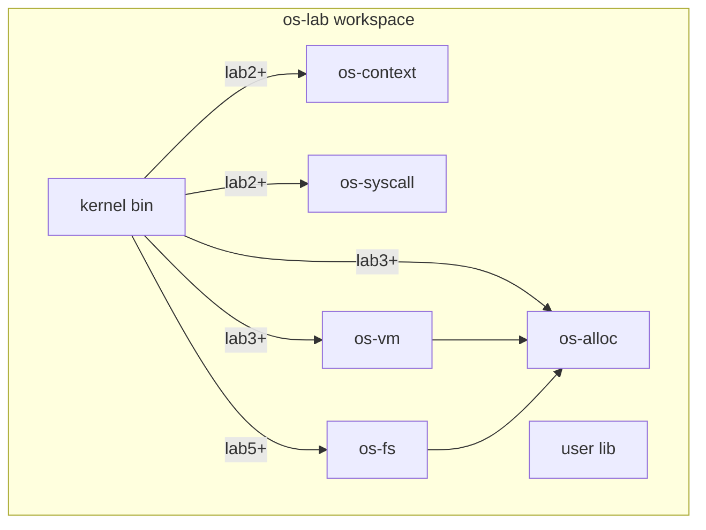
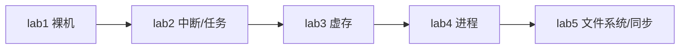
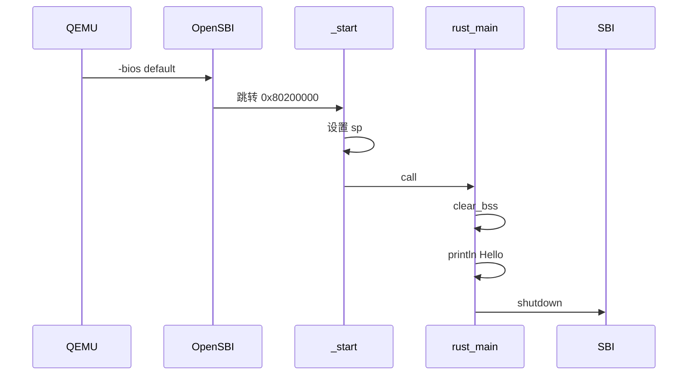

# os-lab 架构说明

## 设计目标

与参考环境 `tg-rcore-tutorial`（8 个独立内核 + 23 个 crate）不同，本环境采用：

1. **单内核渐进式架构**：一个 `kernel` 二进制，通过 Cargo feature 逐级启用功能。
2. **精简组件化**：6 个独立库 crate，两层依赖，降低初学者认知负担。
3. **内嵌验证**：后续在内核与组件中通过 `#[cfg(test)]` 与集成测试自证正确性。

## Workspace 结构



## Feature Gate 层级



| Feature | 内核模块 | 依赖 crate |
|---------|----------|------------|
| lab1 | `main`, `console`, `sbi` | 无 |
| lab2 | + `trap`, `task` | os-context, os-syscall |
| lab3 | + `mm` | os-alloc, os-vm |
| lab4 | + `process` | （沿用 lab3） |
| lab5 | + `fs`, `sync` | os-fs |

## Lab1 启动流程（当前已实现）



### 关键地址与文件

- 内核加载地址：`0x80200000`（`kernel/linker.ld`）
- 入口汇编：`kernel/src/entry.asm` → `_start`
- Rust 入口：`kernel/src/main.rs` → `rust_main`
- SBI 封装：`kernel/src/sbi.rs`（legacy console / shutdown）
- 构建：`kernel/build.rs` 注入链接脚本；`.cargo/config.toml` 配置 `build-std` 与 QEMU runner

## 协作边界（三人分工）

| 目录 | 负责人 | 说明 |
|------|--------|------|
| `kernel/src/` | 成员 A | 内核主体与 feature 集成 |
| `os-*/`, `user/`, `tests/` | 成员 B | 组件 crate 与测试 |
| `labs/`, `docs/`（实验文档） | 成员 C | 实验指导与评估文档 |

Day 1 由成员 A 搭建骨架；组件 crate 当前为占位，待 Day 2–5 填充实现。

## 验证入口

```powershell
cd os-lab
cargo run -p kernel --features lab1    # QEMU 输出 Hello 并退出
make check                           # 验证 lab1–lab5 feature 均可编译
```
