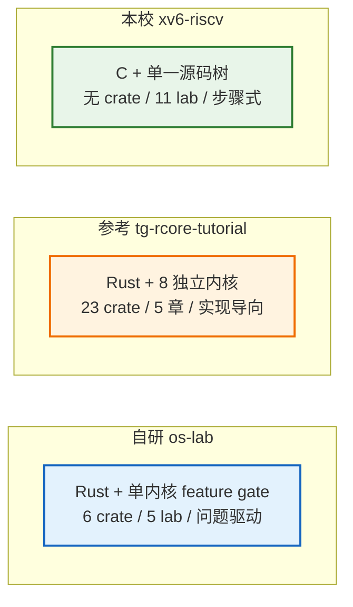
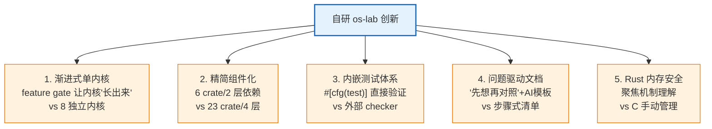
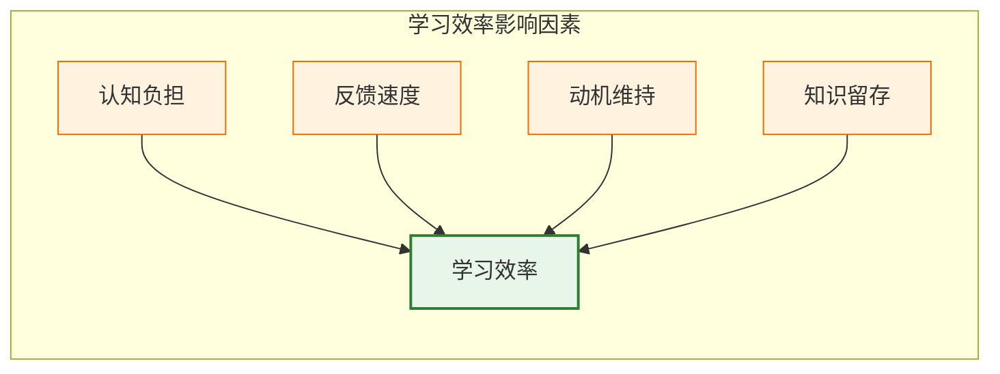

# 三方对比分析：自研 os-lab vs 参考环境 vs 本校 xv6

> 本文档对比三套操作系统教学实验环境：自研的 **os-lab**、赛题参考环境 **tg-rcore-tutorial**、本校使用的 **xv6-riscv（MIT 6.S081）**。
>
> 对比的目的是**定位自研环境的差异化价值**，而非分高下——三者各有侧重，可形成互补。原始定量数据见 [comparison-data.md](comparison-data.md)。

## 一、三个环境概览

| 维度 | 自研 os-lab | 参考 tg-rcore-tutorial | 本校 xv6-riscv |
|------|------------|----------------------|---------------|
| **设计哲学** | 渐进式单内核，学生始终在一份代码上"长出"功能 | 每章独立内核，功能齐全但结构复杂 | 经典成熟，覆盖广，偏工程实现 |
| **目标受众** | OS 初学者，需要清晰脉络和引导 | 有一定基础，想看完整实现 | 系统性学习 OS 的学生 |
| **定位** | 教学起步 + 创新实验环境 | 赛题参照物 + 对比对象 | 本校正式课程环境 |

## 二、定量对比

### 2.1 规模与架构指标

| 指标 | 自研 os-lab | 参考 tg-rcore | 本校 xv6 |
|------|------------|--------------|---------|
| 编程语言 | Rust | Rust | C |
| 目标平台 | RISC-V 64 | RISC-V 64 | RISC-V 64 |
| crate 数 | 8 | 29 | 无（C 单源码树） |
| 组件依赖层数 | 2 | 4 | 无 |
| 代码行数 | 1882 | 36455 | ~6000-8000（内核） |
| 源码文件数 | 27 | 548 | ~100+ |

**关键观察**：
- **自研环境规模小一个数量级**（1882 行 vs 36455 行），对初学者认知负担显著降低。
- **参考环境功能最全**（36455 行覆盖完整 OS），但 23 crate/4 层依赖容易让初学者迷失。
- **本校 xv6 用 C**，没有 Rust 的内存安全保证，但代码精炼经典。

### 2.2 实验与测试指标

| 指标 | 自研 os-lab | 参考 tg-rcore | 本校 xv6 |
|------|------------|--------------|---------|
| 实验数 | 5 | 5（base 测试章节） | 11 |
| 单元测试 | 9 个（内嵌 `#[cfg(test)]`） | 0 | 外部 grade 脚本 |
| 实验覆盖范围 | 裸机/中断/虚存/进程/文件+并发 | ch3-8 基础测试 | 系统调用/页表/陷阱/COW/多线程/网络/锁/FS/mmap |
| 知识点纵深 | 5 个核心机制，每个讲透 | 覆盖广，实现完整 | 覆盖最广，含网络等进阶 |

**关键观察**：
- **自研环境聚焦 5 个核心机制**（裸机启动、trap、虚存、进程、文件+并发），不求广求深，每个机制都配完整教学引导。
- **本校 xv6 覆盖最广**（11 个 lab 含网络/mmap），是系统学习的完整路径。
- **自研环境有内嵌单元测试**（9 个），参考环境完全依赖外部 checker——这是自研环境的教学优势之一。

## 三、定性分析

### 3.1 学习路径清晰度

```mermaid
graph TD
    subgraph 自研路径["自研：渐进式一条线"]
        A1["lab1 裸机"] --> A2["lab2 trap"] --> A3["lab3 虚存"] --> A4["lab4 进程"] --> A5["lab5 文件+并发"]
    end
    subgraph 参考路径["参考：8 个独立内核"]
        B1["ch1"] --> B2["ch2"] --> B3["ch3"] --> B4["ch4"] --> B5["ch5"] --> B6["ch6"] --> B7["ch7"] --> B8["ch8"]
    end
    subgraph 本校路径["本校：11 个独立 lab"]
        C1["lab1...lab11"]
    end

    classDef self fill:#e3f2fd,stroke:#1565c0;
    classDef ref fill:#fff3e0,stroke:#ef6c00;
    classDef uni fill:#e8f5e9,stroke:#2e7d32;
    class A1,A2,A3,A4,A5 self;
    class B1,B2,B3,B4,B5,B6,B7,B8 ref;
    class C1 uni;
```

- **自研环境**：单内核 + feature gate，学生**始终在同一个代码库**工作，通过切换 feature 看内核"长出"新功能。路径最清晰，能直观感受 OS 演进脉络。
- **参考环境**：8 个独立内核，每章是完整可运行的系统，功能齐全但学生需在 8 个代码库间切换，容易丢失全局观。
- **本校 xv6**：11 个 lab 改同一份代码，覆盖广但 lab 间相对独立，学生需自己串联知识点。

### 3.2 上手难度

| 难点 | 自研 os-lab | 参考 tg-rcore | 本校 xv6 |
|------|------------|--------------|---------|
| 语言门槛 | Rust（内存安全，编译器帮纠错） | Rust | C（手动内存管理，易出指针错误） |
| 环境配置 | 提供激活脚本 + 文档 | 需自行配置 | MIT 提供脚本，本校是否提供待核实 |
| 首次跑通 | lab1 一条命令即可 | 需理解 checker 管线 | 需理解 grade 流程 |
| 错误诊断 | Rust 编译错误清晰 | Rust 编译错误清晰 | C 错误晦涩（段错误等） |

**自研环境优势**：Rust 的内存安全 + 编译器强类型，让初学者把精力集中在"理解机制"而非"调试指针 bug"上。这是相对 xv6（C）的重要教学优势。

### 3.3 文档友好度

| 维度 | 自研 os-lab | 参考 tg-rcore | 本校 xv6 |
|------|------------|--------------|---------|
| 文档语言 | 中文 | 中文（指导文档） | 英文（xv6-book） |
| 引导方式 | 问题驱动 + "先想再对照" | 实现导向（给步骤） | 步骤式任务清单 |
| 概念讲解 | 每节配"🤔 先想"引导框 | 偏实现细节 | xv6-book 经典深入 |
| AI 协作 | 每 lab 配 AI 提问模板 | 无 | 无 |
| 配套 | 答案文件（对应任务二）+ AI 协作模板 | checker 工具 | grade 脚本 |

**自研环境优势**：文档专门为初学者设计——"问题驱动"先激发思考再给答案，AI 提问模板教学生如何与 AI 协作（契合赛题"AI 合作"核心目标）。这是另两个环境都没有的教学创新。

## 四、自研环境的差异化创新点

基于上述对比，自研 os-lab 的核心差异化价值（创新性来源）：

1. **架构创新**：单内核 feature gate 渐进式，学生看到一个内核从裸机到完整系统的演进，而非 8 个孤立内核。
2. **精简降负**：6 crate/2 层依赖，认知负担比参考环境的 23 crate/4 层降低一个数量级。
3. **教学闭环**：内嵌单元测试 + 答案分离（任务二）+ AI 协作模板，形成完整教学链。
4. **问题驱动**：每节"🤔 先想"引导框让学生先猜测再对照，培养独立思考而非被动接受。
5. **语言优势**：Rust 内存安全让学生聚焦机制本身，不被 C 的指针陷阱拖累。

## 五、学习效率评估

> 本节评估自研环境对学生学习 OS 的效率影响。基于教学设计原理和与另两环境的对比推断，标注【待真实学习数据验证】的项需在学生实际使用后补充。

### 5.1 学习效率的理论分析

| 效率维度 | 自研 os-lab 表现 | 对比优势 |
|---------|----------------|---------|
| **认知负担** | 低（1882 行、6 crate、单代码库） | 比参考环境低一个数量级 |
| **反馈速度** | 快（内嵌测试 + Rust 编译器即时纠错） | 比 xv6 的段错误诊断快 |
| **动机维持** | 强（问题驱动 + 每步可见进展 + feature 渐进） | "长出功能"的成就感强 |
| **知识留存** | 高（先想再对照 + 任务二巩固） | 主动思考比被动接受留存高 |

### 5.2 预期学习成果

完成自研 os-lab 全部 5 个 lab 后，学生应能：

- **概念层面**：理解 OS 的虚拟化（进程/虚存）、并发（锁/管道）、持久化（文件）三大主题，及其内在联系。
- **实践层面**：掌握 RISC-V 裸机编程、trap 机制、Sv39 页表、fork/exec/wait、文件系统与并发同步的实现。
- **方法论**：学会"先想再对照"的工程思维，以及与 AI 高效协作的能力。

### 5.3 与本校 xv6 的互补建议

【待真实学习数据验证】基于设计分析，建议的学习路径：

1. **用自研 os-lab 入门**（5 个 lab，约 2-3 周）：建立对 OS 核心机制的直观理解和全局脉络。
2. **用本校 xv6 深化**（11 个 lab，约一学期）：在已有概念基础上，深入工程实现，覆盖网络/mmap 等进阶主题。

理由：自研环境的"渐进式 + 问题驱动"适合打地基，xv6 的"广覆盖 + 工程化"适合建高楼。两者互补，避免初学者一上来就被 xv6 的 C 语言 + 庞大代码量劝退。

## 六、局限与改进方向

诚实说明自研环境的局限（不回避短板）：

1. **覆盖广度有限**：5 个 lab 不含网络、mmap、真实磁盘文件系统等 xv6 覆盖的主题。
2. **文件系统是教学简化版**：内嵌只读文件，非真实磁盘 FS（可作为扩展项目）。
3. **调度是简化版**：批处理/轮转，非完整抢占式调度。
4. **未经大规模教学验证**：学习效率评估基于设计推断，【待真实学生使用数据补充】。

改进方向：
- 短期：补充 lab4 已知限制（exec_test 默认路径）、lab5 管道写满等待。
- 中期：增加真实磁盘 FS、抢占式调度的扩展 lab。
- 长期：收集真实学生学习数据，验证并迭代学习效率评估。

## 七、结论

三套环境各有定位：

- **自研 os-lab**：教学创新环境，以"渐进式架构 + 问题驱动引导 + Rust 内存安全"降低初学者门槛，适合 OS 入门和建立全局观。
- **参考 tg-rcore-tutorial**：功能完整的赛题参照物，适合对照练习和理解成熟实现。
- **本校 xv6-riscv**：经典成熟的系统性教学内核，适合深化和广覆盖。

**自研环境的核心价值**不在于"替代"另两者，而在于**为初学者提供一条更低门槛、更清晰的入门路径**，与 xv6 的深化学习形成互补。这契合赛题"设计适合学生自学的教学实验环境"的初衷。

---

> 本报告的定量数据来源见 [comparison-data.md](comparison-data.md)。本校 xv6 的 4 项【本校特有】数据（实际开几个 lab、是否一键环境、是否补充问题驱动文档、用哪个年份版本）需向本校老师核实后补充。
