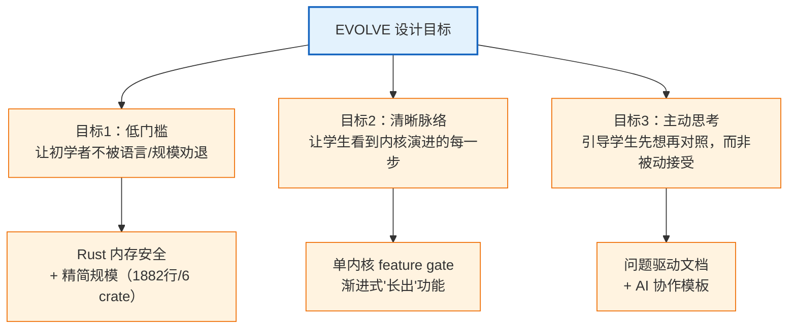
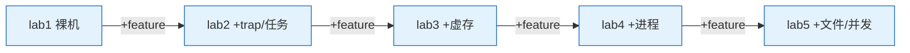
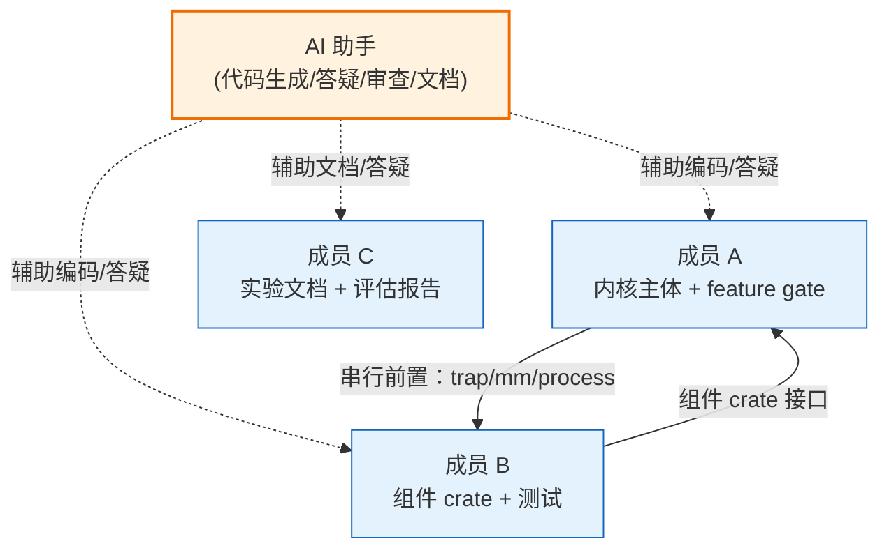
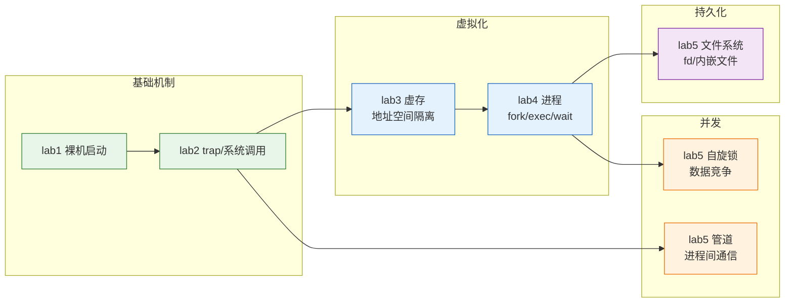
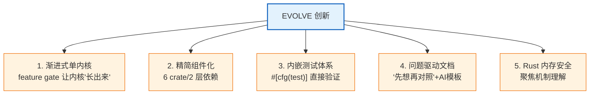

# EVOLVE 设计总结报告

> 本报告总结自研操作系统教学实验环境 EVOLVE 的设计思路、与 AI 合作的实现过程，以及学习效果评估。
>
> 配套文档：架构与 AI 系统技术说明见 [agent-system-technical.md](agent-system-technical.md)、三方对比见 [comparison.md](comparison.md)、原始对比数据见 [comparison-data.md](comparison-data.md)。

## 一、设计思路与目标

### 1.1 设计动机：初学者学 OS 的痛点

操作系统课程历来是计算机专业最难啃的骨头之一。学生在学习时普遍面临三个痛点：

- **原理与实践脱节**：听懂了"虚存是什么"，但面对真实的页表代码仍无从下手。
- **缺少全局脉络**：成熟教学内核（如 xv6、rCore）功能完整，但代码量大、结构复杂，学生容易迷失在细节里，看不到"内核是怎么一步步长出来的"。
- **环境门槛高**：C 语言的指针陷阱、庞大的依赖结构、晦涩的错误诊断，让初学者把大量精力耗在"调指针 bug"而非"理解机制"上。

### 1.2 设计目标

针对上述痛点，EVOLVE 确立了三个设计目标：

### 1.3 核心架构决策

为达成目标，EVOLVE 做了三个关键的架构决策（技术细节见 [agent-system-technical.md](agent-system-technical.md)）：

**决策一：单内核 + feature gate 渐进式**

不是 8 个独立内核（如 rCore），而是**一个内核通过 Cargo feature 逐步启用功能**。学生始终在同一个代码库工作，切换 feature 就能看到内核"长出"新能力。这让 OS 演进脉络清晰可见。

**决策二：精简组件化**

将 rCore 的 23 crate/4 层依赖精简为 **6 crate/2 层依赖**（kernel + os-context/os-syscall/os-alloc/os-vm/os-fs）。每个 crate 职责聚焦、边界清晰，认知负担降低一个数量级。

**决策三：Rust + 问题驱动文档**

用 Rust 的内存安全让学生聚焦机制本身（不被 C 指针拖累）；文档采用"问题驱动 + 🤔 先想再对照"风格，每个机制先让学生猜测"如果是我会怎么设计"，再揭示实际实现，培养独立思考。

## 二、与 AI 合作的实现过程

### 2.1 三人协作模型

EVOLVE 由三人团队协作完成，AI 贯穿需求分析、实现、测试与文档复核，但所有关键结论均由代码和运行证据校验：

- **成员 A**（内核主体）：与 AI 合作实现 kernel 主体、feature gate、trap/mm/process/fs/sync 集成。
- **成员 B**（组件 crate）：与 AI 合作实现 os-context/os-syscall/os-alloc/os-vm/os-fs 及单元测试、用户程序。
- **成员 C**（文档与评估，即本报告作者）：与 AI 合作编写 5 个 lab 的实验指导、任务二参考答案、三方对比报告、设计总结。

### 2.2 AI 在各环节的作用

| 环节 | AI 的具体作用 | 人的把关 |
|------|-------------|---------|
| 代码实现 | 生成函数骨架、解释汇编/位运算、诊断编译错误 | 人审查正确性、做架构决策、验证运行 |
| 概念讲解 | 解释 trap/虚存/fork 等机制的"为什么" | 人对照 OSTEP 教材交叉验证 |
| 文档撰写 | 协助组织文档结构、生成 mermaid 图 | 人定教学定位、做学生视角走查 |
| 测试验证 | 协助设计测试用例、分析失败原因 | 人实测每个 lab 的运行结果 |

### 2.3 AI 协作的关键经验

AI 系统技术说明见 [agent-system-technical.md](agent-system-technical.md)，核心经验：

1. **先想后问**：自己先读代码/读书，带着具体困惑问 AI，收益最大。
2. **要思路不要答案**：让 AI 解释"为什么"，而非直接要代码。
3. **验证而非轻信**：AI 可能出错（尤其涉及具体版本），关键结论用实验验证。本项目中 lab1 的"改链接地址"练习就发现 AI 最初描述的现象与实测不符，经实测修正。
4. **记录关键交互**：形成知识库，便于复盘。

## 三、学习效果评估

### 3.1 教学覆盖度

EVOLVE 的 8 个 Lab 覆盖了操作系统三大核心主题：

| OS 主题 | 对应 lab | 核心知识点 |
|--------|---------|-----------|
| 虚拟化 | lab3、lab4 | Sv39 页表、地址空间、fork/exec/wait、进程树 |
| 并发 | lab5 | 自旋锁、数据竞争、管道 IPC、环形缓冲 |
| 持久化 | lab5 | 文件描述符、内嵌只读文件系统 |
| 基础机制 | lab1、lab2 | 裸机启动、SBI、trap、系统调用、上下文切换 |

### 3.2 学习效率分析（详见 [comparison.md](comparison.md) 第五节）

基于教学设计原理的推断（【待真实学习数据验证】）：

| 效率维度 | EVOLVE 表现 | 优势来源 |
|---------|------------|---------|
| 认知负担 | 低 | 1882 行/6 crate/单代码库，比 rCore 低一个数量级 |
| 反馈速度 | 快 | Rust 编译器即时纠错 + 内嵌单元测试（9 个） |
| 动机维持 | 强 | feature 渐进式"长出功能"的成就感 + 问题驱动引导 |
| 知识留存 | 高 | "先想再对照"主动思考 + 任务二巩固 |

### 3.3 预期学习成果

完成全部 5 个 lab 后，学生应能：

- **概念层面**：理解 OS 虚拟化、并发、持久化三大主题及其内在联系。
- **实践层面**：掌握 RISC-V 裸机编程、trap 机制、Sv39 页表、fork/exec/wait、文件系统与并发同步的实现。
- **方法论**：学会"先想再对照"的工程思维，以及与 AI 高效协作的能力。

### 3.4 与本校 xv6 的互补

【待真实学习数据验证】基于设计分析，建议的学习路径：**EVOLVE 入门（建脉络）→ xv6 深化（广覆盖）**。EVOLVE 的渐进式与问题驱动设计用于建立系统脉络，xv6 的工程化与广覆盖适合深化；两者定位互补。

## 四、创新点与差异化价值

EVOLVE 相对参考环境（tg-rcore-tutorial）和本校环境（xv6-riscv）的核心创新（详见 [comparison.md](comparison.md) 第四节）：

核心定位：**差异化互补，而非替代**。os-lab 为初学者提供低门槛、脉络清晰的入门路径，与 xv6 的深化学习互补。

## 五、局限与改进方向

诚实说明局限（不回避短板）：

1. **覆盖广度有限**：5 个 lab 不含网络、mmap、真实磁盘文件系统等 xv6 覆盖的主题。
2. **系统语义仍是教学子集**：Lab6 已接入 VirtIO/easy-fs 磁盘文件系统和匿名 `mmap/munmap`，但硬链接别名未实现完整跨重启持久化，`mmap` 也不含文件回写与共享映射。
3. **调度与隔离仍为教学实现**：具备时间片、轮转、stride 与阻塞同步，但尚未覆盖多核调度、COW 和严格的内核/用户高地址跳板隔离。
4. **学习效率评估仍需扩样**：当前自动回归与人工流程试用可以证明工程闭环，不能替代规模化真人对照实验。

改进方向：
- 短期：补充各 lab 已知限制（lab4 exec_test 默认路径、lab5 管道写满等待）。
- 中期：增加真实磁盘 FS、抢占式调度的扩展 lab。
- 长期：收集真实学生学习数据，验证并迭代学习效率评估。

## 六、按评审维度的自查

按赛题评审维度（创新性 30%、完整性 20%、代码质量 25%、文档完整性 25%）的自查：

| 维度 | 权重 | EVOLVE 表现 | 证据 |
|------|------|------------|------|
| 创新性 | 30% | 强 | 渐进式单内核+feature gate、问题驱动文档、AI 协作模板，与 rCore/xv6 明显差异化 |
| 完整性 | 20% | 中上 | 8 个 Lab 覆盖 OS 三大主题；局限是无网络、COW、文件映射与多核调度 |
| 代码质量 | 25% | 中上 | Rust 内存安全、6 crate 组件化、9 个单元测试；局限是部分 unsafe 用法、警告未全清 |
| 文档完整性 | 25% | 强 | 5 lab 指导 + 5 答案（对应任务二）+ 架构/对比/设计/协作四份报告 + overview 总览，文档体系完整 |

## 七、总结

EVOLVE 是一套面向 OS 初学者的自研教学实验环境，通过渐进式单内核、精简组件化、可信证据链与受约束 AI 辅助，让学生能清晰看到内核从裸机到线程同步的演进脉络。

它的价值不在于替代成熟的 xv6 或功能完整的 rCore，而在于**为初学者提供一条更低门槛、更清晰的入门路径**，与深化学习形成互补。这契合赛题"设计适合学生自学的教学实验环境"的初衷。

整个项目在与 AI 的充分合作下，由三人团队 7 天完成，体现了 AI 时代高效协作的开发模式。

---

> 本报告基于项目实际交付物撰写。原始对比数据见 [comparison-data.md](comparison-data.md)，AI 系统技术实现见 [agent-system-technical.md](agent-system-technical.md)。
