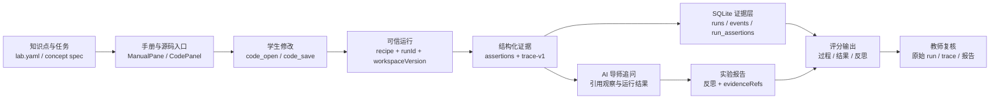

# Lab2 M0 纵向闭环验收

> 冻结日期：2026-07-29
>
> 范围：第一周“基线和契约”共同验收
>
> 样板：Lab2 Trap、系统调用与协作式调度

## 一张图说明完整数据流



这条链只认服务端产生的可信证据。自定义命令即使退出码为 0，也不会产生
`verified=true`；没有真实诊断或 trace 时，界面保持可信空态，不展示 mock 数据。

## 契约冻结

M0 公开契约由 `tutor/schema/m0-contract-baseline-v1.json` 统一登记：

| 契约 | 冻结版本 | 权威源 |
| --- | --- | --- |
| Lab 教学规格 | Lab spec v1 | `tutor/schema/lab-spec-v1.schema.json`、`lab-packages/lab2/lab.yaml` |
| 学习事件 | event v2 | `tutor/schema/event-v2.schema.json` |
| 可信运行结果 | run-result v1 | `tutor/schema/run-result-v1.schema.json` |
| 教学 trace | trace v1 | `tutor/schema/trace-v1.schema.json` |

冻结版本不可原地改变既有字段语义。新增可选字段需要保持旧消费者可读；删除字段、
改变类型或改变必填规则必须发布新主版本。事件 v1 只保留兼容读取，所有新运行链写入 event v2。

## 演示脚本

1. 从 `lab-packages/lab2/lab.yaml` 选择 `os.trap.context-switch`，沿 `concept_ref` 打开机制 spec。
2. 在工作台阅读 Lab2 手册，打开 `kernel/src/task.rs`，完成 fill/debug 任务并保存。
3. 执行 `lab2.verify-trace.v1`。服务端生成 `runId` 和 `workspaceVersion`，而不是接受浏览器自报成功。
4. 检查 4 项输出断言和 `trap_enter`、`task_switch` 两项 trace 断言全部通过。
5. 用观察到的任务切换现象向 AI 导师提问；同步 `student_message`、`ai_response` 和 `trace_inspected`。
6. 将 `run:<runId>` 与 `trace:<runId>` 写入报告证据，提交反思并生成评分摘要。
7. 教师从运行、断言、trace 和报告回查评分依据；AI 不拥有最终裁决权。

自动 smoke 使用本机 mock 模型复现第 3-6 步，并验证证据实际写入临时 SQLite；它不会依赖外部模型或污染正式学习数据库。

## 可复现命令

从 `os-lab/handbook/` 执行：

```powershell
npm test
npm run test:smoke
```

从 `os-lab/` 执行完整基线：

```powershell
node scripts/verify.mjs baseline
```

通过标准：契约测试全绿；smoke 返回可信 run、6 项通过断言、真实 trace、AI 回复、报告和评分；完整基线同时通过 handbook 构建、host 测试与 Lab2 QEMU。

## 2026-07-29 验收结果

- `npm test`：16 项通过，包含四契约冻结与 Lab2 spec/runtime 防漂移测试。
- `npm run test:smoke`：通过；临时库中有 2 条可信运行、6 项通过断言、10 条 Lab2 同会话事件和 1 份报告。
- `node scripts/verify.mjs baseline`：通过；handbook 构建成功，host 测试 7 项通过，Lab2 QEMU 观察到 28 条 `trap_enter`、6 条 `task_switch`，6 项可信断言全部通过。

据此，M0“基线冻结”的成员任务和周末共同验收均已完成。后续工作进入 M1，不在 M0 契约上原地引入破坏性变更。
