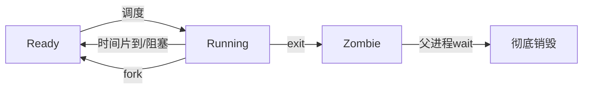

# Lab4 参考答案与代码解读

> 本文件是 [lab4-process.md](../lab4-process.md) 的配套答案，含完整代码逐行解读和阅读理解题答案。
> **使用建议**：先独立完成 lab4 的【任务二：阅读理解】，再来对答案。

## 一、完整代码逐行解读

### 1.1 进程控制块 PCB（`kernel/src/process.rs`）

```rust
pub enum ProcessStatus { UnInit, Ready, Running, Zombie }   // 4 种状态

pub struct ProcessControlBlock {
    pub pid: usize,                          // 进程唯一标识（单调递增）
    pub parent_slot: Option<usize>,          // 父进程槽位（None = initproc）
    pub child_slots: [usize; MAX_CHILDREN],  // 子进程槽位列表
    pub child_count: usize,
    pub exit_code: i32,                      // 退出码（留给 wait 取）
    pub status: ProcessStatus,
    pub trap_cx: TrapContext,                // 上下文（fork/exec 的核心）
    pub space_id: usize,                     // 地址空间编号（关联 mm 层）
}

// 内核栈不在 PCB 内：模块级数组，按槽位取栈顶
static mut KERNEL_STACKS: [[u8; KERNEL_STACK_SIZE]; MAX_PROCESS_NUM] = ...;
fn kernel_stack_top(slot: usize) -> usize { ... }
```

进程的状态机：



注意从 lab3 的 `Exited` 变成了 `Zombie`——这是 lab4 引入的：子进程 exit 后不立刻消失，要等父进程 wait 才回收。

### 1.2 ProcessManager：进程表

```rust
pub struct ProcessManager {
    next_pid: usize,                                          // 下一个可用 PID
    current: usize,                                           // 当前运行进程槽位
    process_count: usize,
    slots: [Option<ProcessControlBlock>; MAX_PROCESS_NUM],    // 槽位数组
}
```

- `alloc_slot`：找第一个空槽位（None）分配给新进程。
- `alloc_space_id`：找第一个空闲地址空间（配合 mm 层）。
- `find_next_ready`：从当前槽位往后环形找下一个 Ready 进程（轮转调度）。
- `spawn`：创建新 PCB 并填入槽位，分配 PID、建父子关系。

### 1.3 sys_fork：一次调用返回两次

```rust
pub fn sys_fork(cx: &mut TrapContext) -> isize {
    let parent_slot = PROCESS_MANAGER.current;
    let parent_space = ...parent.space_id;
    let child_slot = PROCESS_MANAGER.alloc_slot();
    let child_space = PROCESS_MANAGER.alloc_space_id();

    mm::fork_user_space(parent_space, child_space);   // ① 深拷贝父进程地址空间

    let mut child_trap_cx = *cx;                       // ② 复制父进程的 TrapContext
    child_trap_cx.set_return_value(0);                 // ③ 关键：子进程返回值设为 0

    let child_pid = PROCESS_MANAGER.spawn(
        child_slot, child_space,
        cx.sepc,            // ④ 子进程从 fork 调用点继续（sepc = 父进程的 sepc）
        Some(parent_slot),  // ⑤ 建立父子关系
    );
    let child_pcb = ...;
    child_pcb.trap_cx = child_trap_cx;                 // ⑥ 写回子进程的 TrapContext
    child_pcb.trap_cx.kernel_sp = ...;                 // ⑦ 子进程用自己的内核栈
    child_pcb.status = ProcessStatus::Ready;
    child_pid as isize                                  // ⑧ 父进程返回子进程 PID
}
```

精髓在第 ②③步：子进程的 TrapContext 是父进程的副本，但把返回值（a0）改成 0。父进程走第 ⑧ 步返回 PID，子进程被调度后从同一 sepc 恢复、读到 a0=0。

### 1.4 sys_execve：换身不换魂

```rust
pub fn sys_execve(cx: &mut TrapContext, path: *const u8, path_len: usize, _envp: usize) -> isize {
    let name_buf = read_user_str(path, path_len)?;     // 从用户空间读程序名
    let elf = get_app_elf_by_name(name)?;              // 找到对应的 ELF

    let space_id = ...current.space_id;
    mm::replace_user_space(space_id, elf);             // ① 销毁旧地址空间，建新的
    let entry = elf_entry_point(elf);                  // ② 新程序入口
    let user_sp = APP_BASE_ADDRESS + APP_REGION_SIZE - 16;
    *cx = trap_cx_init(entry, user_sp, kstack_top);    // ③ 整个覆盖 TrapContext！
    run_user_task(cx);                                  // ④ 从新入口开始跑
}
```

第 ③ 步 `*cx = trap_cx_init(...)` 是关键——整个 TrapContext 被重置，原程序的 sepc、寄存器全没了。这就是"exec 后原代码跑不到"的根本原因。注意 PID、父子关系都没动（因为没创建新进程）。

### 1.5 sys_wait4：阻塞等待 + 回收僵尸

```rust
pub fn sys_wait4(cx: &mut TrapContext, want_pid: isize, status_ptr: *mut i32) -> isize {
    loop {
        // ① 找一个 Zombie 状态的子进程
        if let Some((pid, code)) = reap_zombie_child(parent_slot, want_pid) {
            write_user_i32(status_ptr, code);   // 把退出码写回用户空间
            return pid as isize;                 // 返回回收的子进程 PID
        }
        // ② 没有 Zombie 子进程：检查还有没有活着的子进程
        if want_pid >= 0 && !has_child { return -1; }  // 子进程都没了，错误返回
        // ③ 有子进程但还没退出：阻塞——保存上下文、让出 CPU
        sync_current_trap_cx(cx);
        mark_current_ready();
        run_next_process();    // 让出 CPU，下次调度回来再 loop 检查
    }
}
```

`loop { 找僵尸; 没有就让出 }` 这就是阻塞等待的实现：条件不满足就 sleep，被唤醒后再试。`reap_zombie_child` 负责真正释放僵尸的地址空间和 PCB。

### 1.6 sys_exit：变僵尸

```rust
pub fn sys_exit(exit_code: i32) -> ! {
    let pcb = ...current;
    pcb.exit_code = exit_code;
    pcb.status = ProcessStatus::Zombie;    // 不释放，变僵尸等 wait
    run_next_process();                      // 切到下一个进程
}
```

注意 exit **不释放资源**——只标记为 Zombie，退出码留着。资源要等父进程 wait 时才回收。这是为了把退出码交给父进程。

### 1.7 initproc：进程树的根

开机时 `process::init()` 创建第一个进程 `initproc`（PID 1），它没有父进程（`parent_slot: None`）。initproc 跑 `fork_test`，fork 出子进程演示进程创建。所有进程都是 initproc 的后代，形成进程树。

## 二、阅读理解题参考答案

### 任务二第 1 题：fork 怎么返回两次 / 为什么子进程返回 0

fork 复制父进程 TrapContext 给子进程，然后把子进程的 a0（返回值寄存器）设成 0（`set_return_value(0)`）。父进程的 a0 是 sys_fork 返回的子 PID。这样父子从同一调用点恢复，但读到不同的 a0，实现"一次调用返回两次"。子进程返回 0 是 Unix 约定，让程序用 `if pid == 0` 简洁区分父子分支。

### 任务二第 2 题：子进程从哪开始执行

子进程从**父进程调用 fork 的下一条指令**开始，不是 main 开头。因为子进程 TrapContext 的 sepc 是父进程 sepc 的副本（`spawn(..., cx.sepc, ...)`）。如果从 main 跑，子进程会重复父进程的所有初始化，那就不是"复制"而是"重跑"。

### 任务二第 3 题：exec 后原代码为什么跑不到

exec 用 `*cx = trap_cx_init(entry, ...)` 整个覆盖 TrapContext，sepc 设成新程序入口、sp 设成新栈顶。原程序的返回地址、寄存器全丢。CPU 从新 entry 开始跑，再也不可能回到 exec 之后的代码——那条代码的地址已经不在 TrapContext 里了。这就是"换身不换魂"。

### 任务二第 4 题：`After exec` 会不会执行

不会。exec 把地址空间整个替换成 hello 的，exec_test 的代码（含 `After exec`）要么被覆盖、要么不再映射。即便内存还在，sepc 也指向 hello 入口而非 `After exec`，CPU 永远执行不到那行。exec 成功后，原程序后续代码全部"消失"。

### 任务二第 5 题：wait 的"找不到就让出"叫什么

叫**阻塞（block/sleep）**。父进程 wait 时子进程可能还没退出，父进程不空转，而是保存上下文、把状态设为 Ready、`run_next_process()` 让出 CPU。下次调度回来再 loop 检查。这种"条件不满足就 sleep、被唤醒再试"是操作系统的核心同步机制，信号量、条件变量都基于它。代码 `loop { 检查; 让出 }` 就是阻塞等待。

## 三、任务三动手修改的现象参考

- **修改 1（fork 两个孩子）**：父进程两次 fork、两次 wait，看到两个子进程各自输出。体会进程树如何通过 fork 长出来——每个 fork 都是树的一个分叉。
- **修改 2（不 wait 直接 exit）**：子进程 exit 变 Zombie，父进程也 exit。观察僵尸子进程是否被回收——真实系统由 init 收养孤儿进程，本实验简化版可能让僵尸留到关机。这演示了"不 wait 导致僵尸堆积"的内存泄漏问题。
- **修改 3（exec 跑 power）**：子进程 fork 后 exec("power")，子进程的逻辑被 power 的输出（`409684505`）取代。验证"exec 换身不换魂"——进程还是那个进程（PID 不变），但跑的代码变了。
