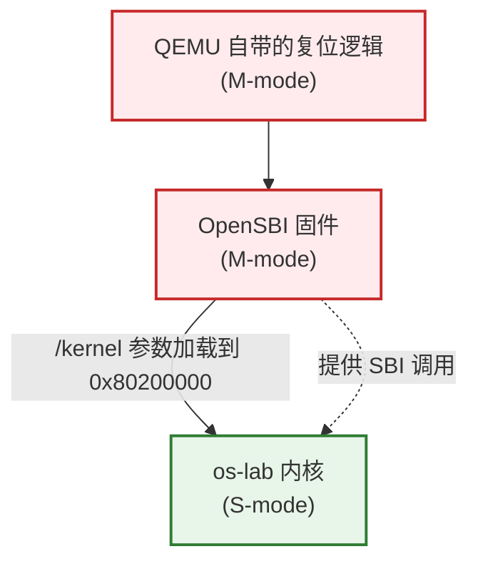
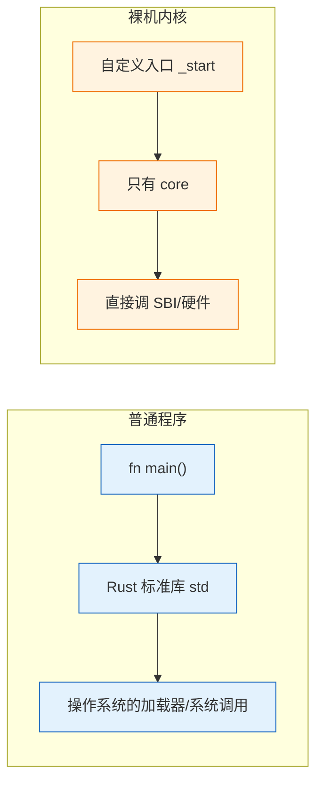
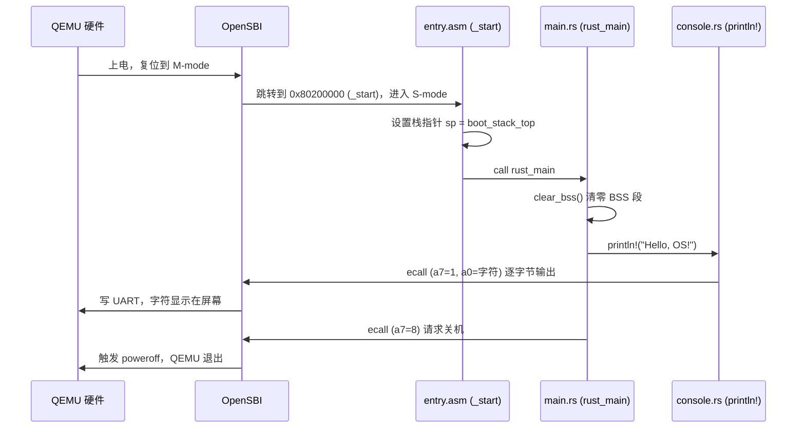

# 实验 1：裸机启动与最小内核

> 对应 feature：`lab1`（默认启用）。这是整个 os-lab 学习路径的起点：先让一段 Rust 代码脱离操作系统、直接在裸机（QEMU 模拟的 RISC-V 硬件）上跑起来。

## 一、问题场景

写一个普通程序，我们习惯 `cargo new` 然后 `cargo run`，背后其实依赖了操作系统提供的大量基础设施：加载器把程序放进内存、标准库初始化运行时、`println!` 最终通过系统调用写到终端。

但是——**操作系统自己开机时，世界上还没有操作系统**。第一个内核程序面临的问题就是：

- 谁来把我加载进内存？
- 没有 `std` 标准库，我还能输出字符吗？
- 没有 `main` 函数约定，CPU 从哪里开始执行我的代码？
- 执行完之后怎么正常退出，而不是让 CPU 飞到非法地址？

本实验的目标就是回答这些问题，最终让一个最小内核在 QEMU 里输出 `Hello, OS!` 并正常关机。这看起来简单，但它建立了后续所有实验的地基：**如何让代码在裸机上跑起来**。

## 二、背景知识

### 2.1 RISC-V 的启动层级

RISC-V 有三个特权级，开机时硬件并不直接执行我们的内核代码，而是按层级逐级交接：



- **M-mode（机器模式）**：权限最高，开机即处于此模式。QEMU 上电后先跑自己 ROM 里的复位逻辑，然后跳到 OpenSBI 固件。
- **OpenSBI**：一段运行在 M-mode 的固件（QEMU `-bios default` 提供）。它负责初始化硬件、设置 S-mode 的入口，最后把控制权交给内核。它还提供 **SBI 调用**——这是内核在没有驱动的情况下，"请 OpenSBI 代劳"做事的标准接口（比如输出一个字符、关机）。
- **S-mode（监督模式）**：内核运行的模式。OpenSBI 把内核加载到固定地址 `0x80200000` 并跳过去，我们的内核就从这里开始跑。

> 关键认知：内核不是被操作系统加载的，而是被**更底层的固件**加载的。所以内核的链接地址必须和 OpenSBI 约定的加载地址（`0x80200000`）一致。

### 2.2 为什么需要 `#![no_std]` 和 `#![no_main]`



- `#![no_std]`：不链接 Rust 标准库 `std`（它依赖操作系统），只能用 `core`（与 OS 无关的基础类型/trait）。这意味着没有 `Vec`、`String`、`println!` 等便利设施，一切靠自建。
- `#![no_main]`：不使用 Rust 默认的 `main` 函数约定（那套约定假设有 C 运行时和加载器）。改为自定义入口符号，由汇编手动调用。

### 2.3 从上电到 `rust_main` 的执行流程

下图展示一段字符从内核代码走到屏幕的完整链路，这也是本实验代码的全部主干。



## 三、实验任务

本实验的代码已由成员 A 实现并验证通过，你的任务是**读懂它**，理解每一部分解决的是什么问题。代码分布在以下文件（路径相对 `os-lab/`）：

### 3.1 汇编入口 `kernel/src/entry.asm`

内核真正的第一条指令不是 Rust，而是汇编。它只做两件事：设置好栈、跳转到 Rust 函数。

```asm
    .section .text.entry
    .globl _start
_start:
    la sp, boot_stack_top      # 设置栈指针到栈顶
    call rust_main             # 进入 Rust 世界

    .section .bss.stack
    .globl boot_stack
boot_stack:
    .space 4096 * 16           # 预留 64KB 启动栈
boot_stack_top:
```

> 思考点：为什么需要先设置栈？因为 Rust（以及任何 C-like 语言）的函数调用约定要用栈来保存返回地址和局部变量。在 `sp` 指向有效内存之前，不能调用任何 Rust 函数。

### 3.2 Rust 入口 `kernel/src/main.rs`

```rust
#![no_std]
#![no_main]

mod console;
mod sbi;

use core::arch::global_asm;
global_asm!(include_str!("entry.asm"));   // 把汇编嵌入进来

#[no_mangle]
pub extern "C" fn rust_main() -> ! {
    clear_bss();          // 1. 清零未初始化全局变量段
    console::init();      // 2. 控制台初始化（当前为空占位）
    println!("Hello, OS!");                 // 3. 输出
    println!("os-lab kernel lab1 is running on QEMU virt.");
    sbi::shutdown();      // 4. 关机
}
```

逐项解释：

- `#[no_mangle]`：禁止 Rust 改名，保证汇编里 `call rust_main` 能找到这个符号。
- `extern "C"`：用 C 的调用约定，这样汇编能正确传参/返回。
- `-> !`：返回类型表示"永不返回"——内核主循环不该返回，返回了就是错误。
- `clear_bss()`：BSS 段是"未初始化的全局变量"，Rust 假设它初值为 0，但在裸机上没人保证这点，必须手动清零，否则可能读到垃圾值。
- 末尾的 `#[panic_handler]` 是 Rust 强制要求的：`no_std` 程序必须自己定义发生 panic 时怎么办（本内核选择打印后关机）。

### 3.3 SBI 调用 `kernel/src/sbi.rs`

内核没有驱动，怎么在屏幕上画字？答案是请 OpenSBI 代劳，通过 `ecall` 指令陷入 M-mode。

```rust
pub fn console_putchar(ch: u8) {
    unsafe {
        core::arch::asm!(
            "ecall",
            in("a7") 1usize,          // SBI Legacy: console putchar
            in("a0") ch as usize,     // 要输出的字符
            in("a6") 0usize,
            lateout("a0") _,
        );
    }
}

pub fn shutdown() -> ! {
    unsafe {
        core::arch::asm!("ecall",
            in("a7") 8usize,          // SBI Legacy: shutdown
            in("a6") 0usize,
            options(noreturn));
    }
}
```

- `a7` 寄存器放"功能编号"（1 = 输出字符，8 = 关机），`a0` 放参数。
- `ecall` 是 RISC-V 的"环境调用"指令，执行后 CPU 陷入更高特权级，由 OpenSBI 处理。

### 3.4 控制台输出 `kernel/src/console.rs`

它把"逐字节输出"包装成 Rust 标准的 `core::fmt::Write` trait，再定义 `println!` 宏，这样就能用熟悉的语法输出格式化文本。

```rust
impl Write for Stdout {
    fn write_str(&mut self, s: &str) -> fmt::Result {
        for byte in s.bytes() {
            crate::sbi::console_putchar(byte);   // 每个字节走一次 SBI
        }
        Ok(())
    }
}
```

### 3.5 链接脚本 `kernel/linker.ld`

告诉链接器：内核必须放在 `0x80200000`（和 OpenSBI 的加载地址一致），并且把 `.text.entry` 段放在最前面——因为入口 `_start` 必须是内核镜像的第一个字节。

## 四、验证

确认环境已激活（`rustc --version`、`qemu-system-riscv64 --version` 能输出版本），然后：

```powershell
cd os-lab
cargo run -p kernel --features lab1
# 或用 Makefile 封装
make run
```

**预期输出**（截取关键部分，前面会有一大段 OpenSBI 的启动 banner）：

```text
OpenSBI v1.7
   ...（OpenSBI banner）...
Hello, OS!
os-lab kernel lab1 is running on QEMU virt.
```

看到 `Hello, OS!` 且 QEMU 自动退出（进程返回，没有卡住），即本实验通过。

> 本文档中的命令已在本机实测：lab1 内核能在 QEMU 11.0.50 中正确输出 `Hello, OS!` 并正常关机（exit code 0）。

## 五、AI 提问模板

做实验时，建议用以下切入点和 AI 交互，引导自己思考而非直接要答案：

1. **概念澄清型**：「RISC-V 上电后，从 M-mode 切到 S-mode 的过程中，OpenSBI 具体做了哪几件事？为什么内核不能直接从 M-mode 起步？」
2. **现象解释型**：「如果我把 `linker.ld` 里的 `BASE_ADDRESS` 从 `0x80200000` 改成 `0x80100000`，重新跑会怎样？为什么？」
3. **代码追因型**：「我的内核跑起来输出了一串乱码，但没 panic，最可能的原因是什么？提示：和 `clear_bss` 有关吗？」
4. **对比深化型**：「`#![no_std]` 之后我还能用 `Option`、`Result` 吗？为什么？它们和 `std::` 里的版本有什么区别？」
5. **动手探索型**：「我想在 `Hello, OS!` 后面再打印一个数字 `42`，用 `println!("{}", 42)` 行不行？需要满足什么前提？」

## 六、思考题与参考答案

### 习题 1

**为什么内核链接地址选择 `0x80200000`？**

参考答案：这是 QEMU `virt` 机器上 OpenSBI 固件与内核约定的加载地址。OpenSBI 自身占据 `0x80000000` 起的低地址区域（约 317KB），它把后续要跳转的 S-mode 内核镜像加载到 `0x80200000` 并从这个地址开始执行。如果内核链接地址与之不符，符号地址和实际加载地址就会错位，跳转和访存都会指向错误位置导致崩溃。可以在 OpenSBI 启动日志里看到 `Domain0 Next Address : 0x0000000080200000`，正是这个约定。

### 习题 2

**OpenSBI 在启动过程中扮演什么角色？**

参考答案：OpenSBI 是运行在 M-mode（最高特权级）的固件，扮演"硬件抽象层"和"启动加载器"双重角色。启动阶段它负责初始化硬件、配置好 S-mode 的运行环境（如设置 PMP、准备好跳转目标地址），然后把控制权交给位于 `0x80200000` 的内核。运行阶段它通过 SBI 调用接口（`ecall` 指令）为内核提供基础服务——本实验用到的输出字符（功能号 1）和关机（功能号 8）就是 SBI Legacy 扩展提供的服务。内核自己不写 UART 驱动，而是"委托"OpenSBI 完成。

### 习题 3

**`#![no_std]` 与 `#![no_main]` 分别解决什么问题？去掉其中任意一个会怎样？**

参考答案：

- `#![no_std]` 告诉编译器不链接标准库 `std`。`std` 依赖操作系统（如堆分配、线程、文件 IO），内核作为"要建立操作系统"的程序，运行时根本没有 OS 可用，所以必须舍弃 `std`，只保留与 OS 无关的 `core`。去掉它会报"std 不可用于 `riscv64gc-unknown-none-elf` 目标"，因为该裸机目标根本不提供 `std`。
- `#![no_main]` 告诉编译器不使用标准运行时的 `main` 入口。默认入口机制假设有 C runtime 初始化、有加载器调用——这些在裸机上都不存在。本内核用汇编 `entry.asm` 里的 `_start` 作为真正入口，手动设栈后 `call rust_main`。去掉它，链接器找不到符合裸机约定的入口符号，链接阶段会失败。
