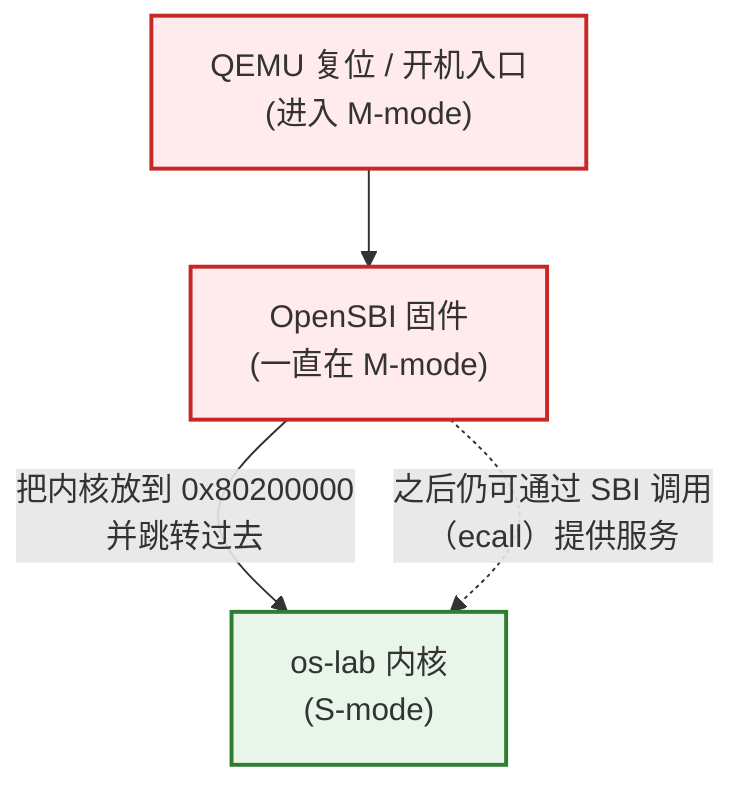
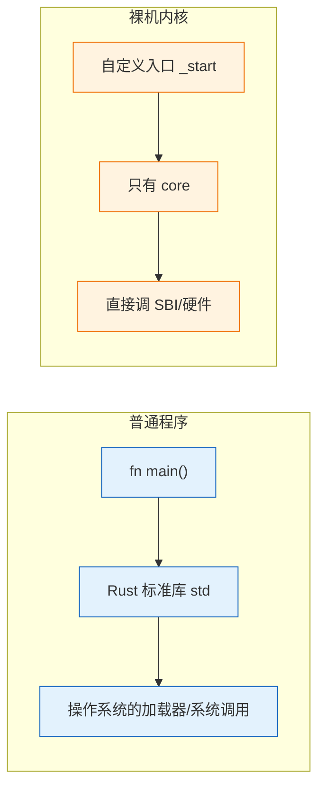
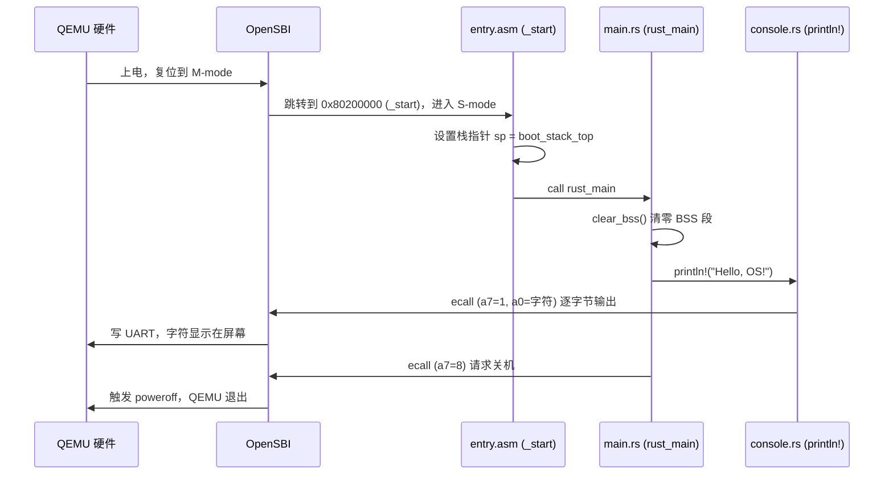

# 实验 1：裸机启动与最小内核

> 对应 feature：`lab1`。

这是整个 os-lab 学习路径的起点。教材《操作系统导论》开篇会说：操作系统管理硬件，并给程序提供易于使用的抽象。本实验把这句话再往前推一步：**先亲手做一个还几乎什么都不会的最小内核，看清楚在这些抽象出现之前，程序到底怎么跑起来**。

## 零、开始之前

在开始完成你的最小内核之前，请确认已完成以下准备：

1. **本机环境已就绪**：按仓库根目录 `docs/environment_setup.md` 装好 Rust（含 `riscv64gc-unknown-none-elf` target）、QEMU、（Windows 还需 MSVC Build Tools）。
2. **进入工作目录**：在本仓库根目录下，进入自研实验环境目录：
  ```powershell
   cd os-lab
  ```
3. **（可选）激活当前终端环境**：如果你新开了一个终端，在仓库**根目录**（不是 os-lab 目录）执行以下命令，让本会话能找到 Rust 和 QEMU：
  ```powershell
   . .\scripts\activate-os-env.ps1
   cd os-lab
  ```
4. **快速自检**：以下两条命令都能输出版本号，说明环境就绪：
  ```powershell
   rustc --version          # 预期：rustc 1.96.0 ...
   qemu-system-riscv64 --version   # 预期：QEMU emulator version 11.0.50 ...
  ```

> 如果上面任何一步报"找不到命令"，回到 `docs/environment_setup.md` 检查安装。


## 一、问题场景

《操作系统导论》里提到，普通程序能跑起来，是因为操作系统在背后提供了一组抽象：把程序装进内存、准备运行环境，并通过**系统调用**提供打印、读写文件等服务。你平时写 Rust 时 `cargo new` 再 `cargo run`，背后几乎全靠这些「看不见的帮忙」。

但教材讨论虚拟化、并发、持久性时，默认「操作系统已经在那里了」。本实验要先问一个更靠前的问题：

**操作系统自己第一次开机时，世界上还没有操作系统。那第一个内核程序，靠谁帮它？**

我们把这个大问题拆开，就是本实验要直面的几件事：

- 教材里说程序由操作系统装进内存——**内核**自己还没有「加载器」可用，那谁把它放进内存？
- 教材里把系统调用写成程序请求 OS 服务的接口——**内核**自己就是 OS，没有人可请求，它还能往屏幕打字吗？
- 应用程序常从 `main` 开始——那是有 OS 与标准运行时之后的约定。**裸机**上没有这套约定，CPU 从哪里开始执行？
- 程序结束可以「正常退出」；**内核**若不善后，CPU 可能跑到非法地址，机器就会表现得很奇怪。

本实验的具体目标是：在 QEMU 模拟的 RISC-V 硬件上，让一个最小内核输出 `Hello, OS!` 并正常关机。它看起来只是打一行字，却是后续所有抽象的地基——**启动（boot）与运行时初始化**：代码如何被装进内存、如何找到入口、如何在没有标准库的情况下完成最基本的输入输出。

> 一句话解释本实验：先学会「让内核在裸机上活下来」，后面教材中的 CPU/内存虚拟化、并发与持久性才有地方站脚。


## 二、背景知识

虽然理论知识读起来很无聊，但是还是希望你在真正的动手实验之前了解这些名词。当你在动手的时候有一种「原来书上那句话，在代码里长这样」，这就是我们学习理论的意义。

### 2.1 RISC-V 的启动层级

《操作系统导论》在讲 **CPU 虚拟化** 时会反复强调一件事：程序跑在**用户态**，操作系统跑在**内核态**；权限不同，所以普通程序不能直接操作硬件，只能通过系统调用“请客服”。

RISC-V 把这件事写进了硬件：**特权级（privilege level）**。和教材里“用户态 / 内核态”二分法相比，RISC-V 常见会提到三档（后面实验会陆续碰到）：


| 特权级        | 名字   | 谁在用（本实验语境）    | 和教材怎么对应            |
| ---------- | ---- | ------------- | ------------------ |
| **U-mode** | 用户模式 | 用户程序（Lab2 起）  | 教材里的**用户态**        |
| **S-mode** | 监督模式 | 操作系统内核（本实验开始） | 教材里的**内核态**一侧      |
| **M-mode** | 机器模式 | 固件 OpenSBI    | 比“内核态”更底层，教材通常着墨较少 |


Lab1 还没有用户程序，所以你暂时主要和 **M-mode、S-mode** 打交道。更重要的是：开机时，CPU **不会**一上电就执行我们的内核，而是按层级“交班”。




可以按时间顺序理解这三步：

1. **上电，进入 M-mode**
  CPU 复位后处于权限最高的 **机器模式（M-mode）**。可以把它想成“硬件刚醒来时的默认身份”：此时还谈不上操作系统，也谈不上用户程序。
2. **OpenSBI（固件）先跑**
  在 QEMU 里，我们通常用默认固件（`-bios default`），它提供的就是 **OpenSBI**。OpenSBI 跑在 **M-mode**，职责大致有两类：  
  - **启动阶段**：做必要的硬件初始化，准备好 S-mode 的运行环境，把内核镜像放到约定地址，然后把控制权交给内核。  
  - **运行阶段**：继续留在“更底层”，通过 **SBI（Supervisor Binary Interface）** 给内核提供少量基础服务。  
   Lab1 里你会用到的服务包括：往控制台输出一个字符、关机。内核暂时不用自己写 UART 驱动，而是“请客服（OpenSBI）代劳”。
3. **内核在 S-mode 开始执行**
  OpenSBI 把我们的内核放到固定地址 `0x80200000`，并跳转到这里，CPU 进入 **S-mode（监督模式）**。从这一刻起，才轮到 `entry.asm` 里的 `_start`、以及后面的 `rust_main`。  
   这也是为什么 `linker.ld` 里必须写：
   两边约好“在这个门牌号见面”：OpenSBI 跳到 `0x80200000`，内核也必须按这个地址链接。约错了，CPU 取到的就不是正确指令，后面的 `Hello, OS!` 自然出不来。

**和教材对照，记住两句就够：**

- 书里说：“程序由操作系统加载。”——那是操作系统已经存在之后的故事。  
- Lab1 说：“内核由更底层的**固件**加载。”——内核不是被另一个 OS 装进来的，所以启动地址必须和 OpenSBI 的约定一致。

**补充：SBI 调用和系统调用长得很像**  
后面你读 `os-sbi` 时会看到：内核在 S-mode 里执行 `ecall`，把功能号放进寄存器（例如输出字符、关机），然后陷入到 M-mode，由 OpenSBI 处理。  
这和《操作系统导论》里“用户程序用系统调用请求内核”是同一类套路，只是：

- 教材常见路径：用户态 →（系统调用）→ 内核态  
- Lab1 这条路径：内核（S-mode）→（SBI 调用）→ 固件（M-mode）

等 Lab2 有了用户程序，你才会真正走通教材里那条“用户态 ↔ 内核态”的路径。

### 2.2 为什么需要 `#![no_std]` 和 `#![no_main]`

《操作系统导论》反复强调：应用程序站在操作系统提供的抽象之上。Rust 的标准库 `std` 也假设「底下有操作系统」。现在我们要写的恰恰是操作系统本身，所以不能再站在那套假设上。




- `#![no_std]`：不链接依赖操作系统的标准库 `std`，只保留与 OS 无关的 `core`（基础类型、`Option`/`Result` 等）。因此没有现成的 `Vec`、`String`、`println!`，输出要自己用 SBI 拼出来（本实验在 `console.rs` 里做了这件事）。
- `#![no_main]`：不使用「有 C 运行时和加载器时」那套默认 `main` 入口约定。改为自定义入口符号，由汇编先做好最基本的准备工作，再调用我们的 Rust 函数。

> 如果把普通程序比作「住进已经装修好的宿舍」，裸机内核更像「空地盖第一栋楼」：电梯（`std`）、门禁（加载器）都还没有，得自己先把地基打好。


### 2.3 从上电到 `rust_main` 的执行流程

教材讨论系统调用、进程之前，机器总得先把内核跑起来。下图就是「上电 → 固件 → 内核 → 输出 → 关机」在本实验代码里的完整版本。




读这张图时，可以边读边问自己三个「对照教材的问题」：

1. **谁把内核装进内存？** —— OpenSBI（固件），不是操作系统自己（书中「OS 加载程序」的故事，在这里还轮不到内核来演）。
2. **没有系统调用，怎么打印？** —— 内核通过 `ecall` 发起 **SBI 调用**，请 OpenSBI 写串口（UART）。这和教材里「用户程序用系统调用请求内核」是同一类套路，只是请求对象换成了更底层的固件。
3. **入口在哪？** —— 不是 `main`，而是 `entry.asm` 里的 `_start`：先设好栈，再 `call rust_main`。


### 2.4 BSS 段与 `clear_bss`

时序图里，`println!` 之前有一步 `clear_bss()`。教材讲进程/地址空间时，常默认「程序已被正确装入且数据区就绪」；在裸机上，**有些全局数据开机时并不会自动变成 0，得有人负责初始化**。

**BSS 段是什么**：未初始化、或初值就是 0 的全局/静态变量，会被链接器放进名为 `.bss` 的内存区域。在有操作系统的环境里，加载器会在程序开始前把这块区域清成 0；裸机上没有加载器，这块内存里往往是随机垃圾值。

**为什么必须手动清零**：Rust 会假设静态变量一开始就是合法状态（例如「空」的 `Option`）。若 BSS 没清零，读到的是垃圾，后面的行为就不可预测——乱码、死循环、莫名崩溃都可能出现。

**为什么必须在** `println!` **之前**：`println!` 的实现链路（`console.rs` → 格式化输出）可能用到位于 BSS 的静态状态。BSS 还是垃圾时就打印，输出可能错乱甚至卡住。所以 `rust_main` 的第一件事是 `clear_bss()`，把 BSS 逐字节写成 0，之后才能安全做事。

> 一句话：`clear_bss()` 是裸机版的「运行时初始化第一步」，对应有 OS 时加载器偷偷帮你做的那件事。它必须赶在任何可能用到静态变量的代码之前。


## 三、实验任务

> **本实验的定位**：lab1 是整个 os-lab 的**起跑线**——它是一份已经能跑通的最小内核，你不需要从零实现它。本实验的任务是：**跑通内核、把启动流程和《操作系统导论》里的基础概念对上号、做几个小修改建立裸机开发的直觉**。从 Lab2 开始，你才会在 feature gate 的指引下亲手「长出」虚拟化等能力。

lab1 涉及的代码分布在以下文件（路径相对 `os-lab/`）。建议先浏览一遍，边看边想「它对应背景知识里的哪一步」：


| 文件                      | 角色               | 你要重点理解的点                                                     |
| ----------------------- | ---------------- | ------------------------------------------------------------ |
| `kernel/src/entry.asm`  | 汇编入口             | 第一条指令做了什么、为什么入口先用汇编（设栈）而不是直接写 Rust                           |
| `kernel/src/main.rs`    | Rust 入口          | `#![no_std]`/`#![no_main]` 的含义、`clear_bss` 的作用、panic 时怎么办    |
| `os-sbi/src/lib.rs`     | SBI 调用（独立 crate） | 没有设备驱动时，内核如何「委托」OpenSBI 输出字符和关机；`lab1` feature 依赖 `os-sbi`   |
| `kernel/src/console.rs` | 控制台              | 如何把「逐字节输出」包装成你熟悉的 `println!`（内部调用 `os_sbi::console_putchar`） |
| `kernel/linker.ld`      | 链接脚本             | 为什么内核必须链接到固定地址 `0x80200000`（和固件约定一致）                         |


> 提示：本实验不给完整代码讲解（那样就变成抄答案了）。每个文件的「为什么这么写」，请结合上面的【背景知识】自己读代码、想明白；想不通的地方正是【五、AI 提问模板】的用武之地。完整代码的逐行解读见 `labs/answers/lab1-answers.md`，**建议先自己读完再对照答案**。

本实验分为三档任务，按顺序完成：

### 任务一：跑通内核

确认环境已激活（`rustc --version`、`qemu-system-riscv64 --version` 能输出版本），在 `os-lab` 目录执行：

```powershell
cargo run -p kernel --features lab1
# 或用 Makefile 封装
make run
```

**预期输出**：屏幕会先刷出约 **40 行 OpenSBI 启动日志**（平台信息、HART 信息等，**这些是固件的输出，不是你的内核，无需逐行读懂**），最后两行才是你的内核输出：

```text
OpenSBI v1.7
   ____                    _____ ____ _____
  ...（约 40 行 OpenSBI 平台/HART 日志，可忽略）...
Boot HART MEDELEG           : 0x0000000000f4b509
Hello, OS!                              ← 你的内核从这里开始输出
os-lab kernel lab1 is running on QEMU virt.
```

> 新手提示：前面一大段 OpenSBI 日志是正常的——那正好对应「固件先跑、内核后跑」。**只要最后出现** `Hello, OS!` **就对了**。如果连 OpenSBI 的 banner 都没出现，说明 QEMU 没启动成功，检查 QEMU 安装。

**通过标准**：看到 `Hello, OS!` 且 QEMU 自动退出（终端命令返回，没有卡住或报错）。

> 如果卡住不退出：检查是不是没装 QEMU、或 `.cargo/config.toml` 里的 runner 路径不对。本命令已在本机实测通过（QEMU 11.0.50，exit code 0）。


### 任务二：阅读理解与思考题（必做）

带着下面的问题去读代码。每个问题请先自己用「教材语言 + 代码位置」试着回答；**参考答案见** `labs/answers/lab1-answers.md`。

1. 在 `entry.asm` 里，`_start` 为什么要先 `la sp, boot_stack_top` 再 `call rust_main`？如果直接 `call rust_main` 会发生什么？（提示：函数调用需要栈。）
2. 在 `main.rs` 里，`rust_main` 为什么返回类型是 `-> !`（never）？`clear_bss()` 为什么必须在 `println!` 之前调用？
3. 在 `os-sbi/src/lib.rs` 里，输出一个字符时 `a7` 和 `a0` 寄存器分别放了什么？关机和输出字符用的是同一个指令吗？（提示：对照教材里「系统调用号 + 参数」的模式。）
4. 在 `linker.ld` 里，`BASE_ADDRESS = 0x80200000` 这个数字从哪里来？为什么内核必须链接到这个地址？如果把它改成别的值（如任务三修改 2 中的 `0x88000000`）会发生什么？
5. OpenSBI 在启动过程中扮演什么角色？（启动阶段与运行阶段分别做什么？）
6. `#![no_std]` 与 `#![no_main]` 分别解决什么问题？去掉其中任意一个会怎样？

> 阅读提示：对照【2.3 执行流程时序图】，把「一段字符从你的代码走到屏幕」的完整链路在脑中走一遍。能用自己的话讲清这张图，lab1 就过关了。


### 任务三：动手小修改

在能跑通的基础上，做几个小改动，亲手感受「改内核会发生什么」。每项改完后 `cargo run` 验证，验证通过再改回原样（保持仓库干净）。

**修改 1：换一句欢迎语**

在 `main.rs` 的 `rust_main` 函数里（lab1 分支，`println!("Hello, OS!")` 那一行），把欢迎语改成输出你自己的学号或名字，例如：

```rust
println!("Hello, OS! 我学号是 xxx");
```

- 通过标准：`cargo run` 后屏幕显示出你改的文字，且内核仍正常退出。

**修改 2：观察链接地址错误的后果（理解性实验）**

在 `linker.ld` 里把 `BASE_ADDRESS = 0x80200000;` 改成 `BASE_ADDRESS = 0x88000000;`（注意是 `0x8800`，不是 `0x8020`），然后 `cargo clean && cargo run`。

- 预期现象：QEMU 启动后立即报错退出，例如 `qemu-system-riscv64: No enough memory to place DTB after kernel/initrd`，进程 exit code 非 0，**看不到** `Hello, OS!`。
- 通过标准：观察到上述崩溃现象，能用自己的话解释**为什么**（提示：OpenSBI 仍跳到 `0x80200000`，内核却按 `0x88000000` 链接，约定的「见面地址」对不上，CPU 取不到正确指令）。
- 做完务必改回 `0x80200000` 并 `cargo clean && cargo run` 确认恢复正常。
- 这个练习不求「跑通」，恰恰是要体会「加载地址必须与约定入口一致」有多硬（书中程序加载也依赖正确的地址约定，这里换成了固件与内核）。

> ⚠️ 不要改成 `0x80100000` 这种离 `0x80200000` 太近的值——因为 lab1 内核镜像很小（几十 KB），`0x80100000` 与 `0x80200000` 相差仅 1MB，OpenSBI 跳转后仍可能落在内核镜像范围内，加上 RISC-V 的 PC 相对寻址，内核**可能照常运行**，你就观察不到崩溃了。要用 `0x88000000` 这种远离的值才能稳定复现。

**修改 3：调整启动栈大小**

当前 `entry.asm` 里是 `.space 4096 * 64`（256KB）。把它改成 `.space 4096 * 4`（16KB），`cargo run` 观察是否仍正常。

- 通过标准：lab1 这种简单内核 16KB 栈够用，应仍能正常输出和退出。能解释「为什么改小也能跑」（lab1 没有深层函数调用、也没有很大的局部变量）。


## 四、验证

本实验以【任务一】的 `cargo run -p kernel --features lab1` 能输出 `Hello, OS!` 并正常退出为主要验证标准。其余任务的验证标准见各任务说明。

## 五、AI 提问模板

做实验时，建议用以下切入点和 AI 交互，引导自己思考而非直接要答案：

1. **概念澄清型**：「《操作系统导论》强调用户态与内核态。落到 RISC-V 上，上电后从 M-mode 到 S-mode，OpenSBI 具体做了哪几件事？为什么我们的内核通常不直接从 M-mode 一直跑下去？」
2. **现象解释型**：「如果我把 `linker.ld` 里的 `BASE_ADDRESS` 从 `0x80200000` 改成 `0x80100000`，重新跑会怎样？为什么有时看起来『还能跑』？」
3. **代码追因型**：「我的内核跑起来输出了一串乱码，但没 panic，最可能的原因是什么？提示：和 `clear_bss`、加载器初始化有关吗？」
4. **对比深化型**：「`#![no_std]` 之后我还能用 `Option`、`Result` 吗？为什么？它们和 `std::` 里的版本有什么区别？」
5. **动手探索型**：「我想在 `Hello, OS!` 后面再打印一个数字 `42`，用 `println!("{}", 42)` 行不行？需要满足什么前提？」

