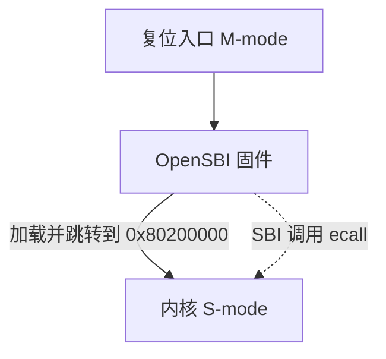
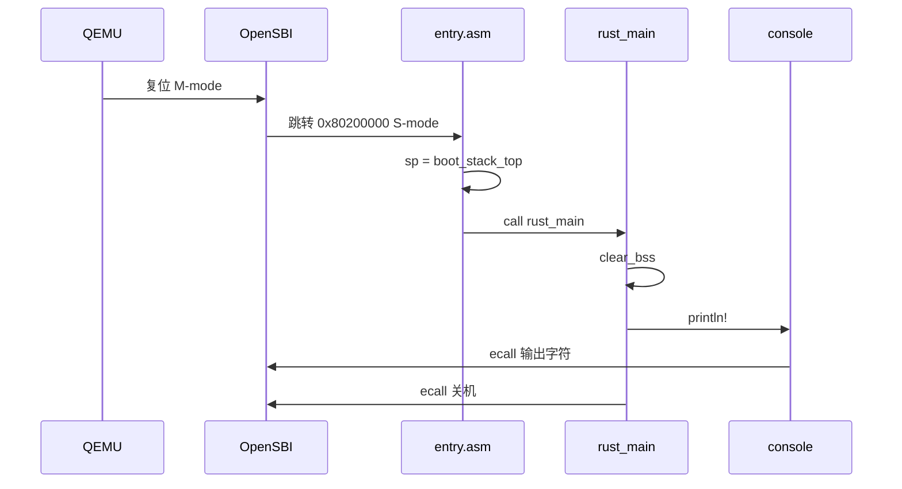

# 实验 1：裸机启动与最小内核

> 对应 feature：`lab1`。

> **配套教材**（《操作系统导论》OSTEP 中译）：[第 2 章 · 操作系统简介（PDF 第 16 页）](/downloads/ostep-zh.pdf#page=16) · [全书入口](/downloads/ostep-zh.pdf)  
> Lab1 发生在教材「已有 OS」假设之前；可顺带翻 [第 6 章开头（PDF 第 49 页）](/downloads/ostep-zh.pdf#page=49) 为 Lab2 铺垫。

这是整个 os-lab 学习路径的起点。教材《操作系统导论》开篇会说：操作系统管理硬件，并给程序提供易于使用的抽象。本实验把这句话再往前推一步：**先亲手做一个还几乎什么都不会的最小内核，看清楚在这些抽象出现之前，程序到底怎么跑起来**。

## 零、开始之前

在开始完成你的最小内核之前，请确认已完成以下准备：

1. **本机环境已就绪**：按 [环境搭建指南](/setup/environment) 装好 Rust（含 `riscv64gc-unknown-none-elf` target）、QEMU、（Windows 还需 MSVC Build Tools）。
2. **进入工作目录**：在本仓库根目录下，进入自研实验环境目录：
  ```powershell
   cd os-lab
  ```
3. **（可选）激活当前终端环境**：如果你新开了一个终端，在仓库**根目录**（不是 os-lab 目录）执行以下命令，让本会话能找到 Rust 和 QEMU：
  ```powershell
   . .\scripts\activate-os-env.ps1
   cd os-lab
  ```
4. **快速自检**：以下两条命令都能输出版本号，说明环境就绪：
  ```powershell
   rustc --version          # 预期：rustc 1.96.0 ...
   qemu-system-riscv64 --version   # 预期：QEMU emulator version 11.0.50 ...
  ```

> 如果上面任何一步报"找不到命令"，回到 [环境搭建指南](/setup/environment) 检查安装。

5. **建议先读书**：OSTEP 第一部分（导论）+ 第 6 章开头（受限的直接执行，为 Lab2 铺垫）。Lab1 的启动发生在教材「已有 OS」假设之前。


## 一、问题场景

OSTEP 从虚拟化、并发、持久性讲起，默认内核已经能运行。Lab1 要补更早的一步：**第一个内核程序是谁加载的、从哪条指令开始、如何在没有 OS 的情况下输出字符**。

| 平时写应用 | 裸机内核 |
| --- | --- |
| 加载器把程序放进内存 | OpenSBI 加载内核到 `0x80200000` |
| 从 `main` 开始 | 从 `_start`（汇编）开始 |
| `println!` 经 OS 写终端 | 经 SBI `ecall` 写 UART |
| 进程结束由 OS 回收 | 内核须主动 `shutdown` |

本实验目标：在 QEMU RISC-V 上输出 `Hello, OS!` 并正常关机。后续 Lab2–8 的 trap、虚存、进程、文件系统都建立在这套启动与 SBI I/O 之上。


## 二、背景知识

本节对应《操作系统导论》（OSTEP）第二部分的铺垫：Lab1 还没有用户程序，但已经涉及**特权级**、**启动加载**和**内核如何获得最基本 I/O**——这些在后续「CPU 虚拟化」「内存虚拟化」章节里会反复出现。

### 2.1 RISC-V 的启动层级

OSTEP 第 6 章讲**受限的直接执行**时，默认操作系统已经在运行。Lab1 要回答更靠前的问题：内核本身是谁加载、从哪条指令开始执行的。

RISC-V 用硬件**特权级**区分谁能直接访问哪些资源。本实验涉及三档：

| 特权级 | 名称 | 本实验里谁在用 | 与 OSTEP 概念 |
| --- | --- | --- | --- |
| **U-mode** | 用户模式 | 用户程序（Lab2 起） | 用户态 |
| **S-mode** | 监督模式 | 操作系统内核 | 内核态 |
| **M-mode** | 机器模式 | OpenSBI 固件 | 比内核更底层，教材着墨较少 |

上电后 CPU 从 **M-mode** 开始执行，不会直接跳进我们的内核。QEMU `virt` 机器默认加载 **OpenSBI** 固件，启动顺序如下：



1. **OpenSBI 完成启动**：初始化平台，准备好 S-mode 环境，把内核镜像放到 `0x80200000` 并跳转过去。OpenSBI 日志里的 `Domain0 Next Address : 0x0000000080200000` 就是这个约定。
2. **内核从 `_start` 运行**：`entry.asm` 设栈后进入 `rust_main`，此时已在 **S-mode**。
3. **运行期服务**：内核输出字符、关机仍通过 **SBI**（`ecall` + 功能号）委托 OpenSBI 完成——Lab1 尚未编写 UART 驱动。

因此 `linker.ld` 里必须写 `BASE_ADDRESS = 0x80200000`：链接地址与 OpenSBI 跳转地址不一致，CPU 取到的就不是正确指令。

OSTEP 里「程序由 OS 加载进内存」描述的是**已有操作系统**之后的情形；Lab1 里**加载内核的是固件**，不是另一个 OS。

**SBI 与系统调用的关系**：两者都用 `ecall` 陷入更高特权级，通过寄存器传功能号/参数。Lab1 是 S-mode 内核 → M-mode 固件；Lab2 起是 U-mode 用户程序 → S-mode 内核。机制相同，方向不同。

### 2.2 为什么需要 `#![no_std]` 和 `#![no_main]`

普通 Rust 程序依赖 `std`，而 `std` 假设底下已有操作系统（堆分配、文件 I/O、线程等）。写内核时这个前提不成立。

| | 普通程序 | 裸机内核 |
| --- | --- | --- |
| 入口 | `main` | `_start`（汇编） |
| 标准库 | `std` | 仅 `core` |
| I/O | 经 OS 系统调用 | SBI 或驱动 |

- **`#![no_std]`**：不链接 `std`，只保留 `core`。没有 `Vec`/`String`/内置 `println!`，输出需在 `console.rs` 里自行实现。
- **`#![no_main]`**：不用编译器默认的 `main` 入口；由 `entry.asm` 的 `_start` 完成栈初始化后再 `call rust_main`。

### 2.3 从上电到 `rust_main` 的执行流程



读代码时可对照三个问题：

1. **谁加载内核？** OpenSBI，不是内核自己。
2. **没有用户态系统调用，如何打印？** 内核经 SBI 写 UART（功能号 1）。
3. **入口在哪？** `_start`，不是 `main`。

### 2.4 BSS 段与 `clear_bss`

`.bss` 段存放未初始化或初值为 0 的全局/静态变量。有 OS 时，加载器会在程序运行前把 BSS 清零；裸机没有加载器，这块内存开机时是未定义值。

Rust 假定静态变量初值合法。BSS 未清零就读，可能乱码、死循环或 panic。`println!` 的实现可能间接用到 BSS 中的静态状态，因此 `rust_main` 第一件事是 `clear_bss()`——把 `[sbss, ebss)` 逐字节写 0，等价于加载器在进程启动时做的初始化。

### 2.5 把启动链与后续系统调用对照起来

本地版手册曾用“空地盖第一栋楼”解释裸机启动：普通应用入住的是已经有加载器、标准库和系统调用的环境；内核启动时这些设施还不存在，所以必须先自己建立栈、运行时初始状态和最小 I/O。这个类比可以和远端复核版的精确调用链放在一起理解：


这里有两条以后会反复出现的“向更高特权级请求服务”路径：

| 阶段 | 请求者 | 服务者 | `ecall` 中携带的内容 |
| --- | --- | --- | --- |
| Lab1 SBI 调用 | S-mode 内核 | M-mode OpenSBI | SBI 功能号与字符/关机参数 |
| Lab2+ 系统调用 | U-mode 用户程序 | S-mode 内核 | syscall 编号与参数 |

因此 Lab1 不只是“打印一句话”：它建立了入口地址、栈、BSS、特权级切换和寄存器传参这些约定。后续系统调用只是把同一种机制移到 U-mode 与 S-mode 之间。


## 三、实验任务

> **本实验怎么学**：先 `cargo run --features lab1` 看输出，再按【二、背景知识】对照 `entry.asm`、`main.rs`、`os-sbi` 读代码。Lab1 代码已能跑通，重点是理解启动链，不是从零实现。

主要文件（路径相对 `os-lab/`）：

| 文件 | 角色 | 阅读时重点确认 |
| --- | --- | --- |
| `kernel/src/entry.asm` | 汇编入口：设栈、`call rust_main` | 第一条指令为何不能直接进入 Rust |
| `kernel/src/main.rs` | `#![no_std]` / `clear_bss` / `rust_main` | BSS 初始化为何早于任何格式化输出 |
| `os-sbi/src/lib.rs` | SBI `ecall` 封装（输出、关机） | `a7` 与 `a0` 如何表达功能号和参数 |
| `kernel/src/console.rs` | `println!` 包装 | 如何把格式化文本拆成逐字符输出 |
| `kernel/linker.ld` | 链接地址 `0x80200000` | 链接地址如何与固件跳转地址一致 |

> 完整逐行解读见 [lab1 参考答案](/answers/lab1-answers)。

### 任务一：跑通内核

确认环境已激活（`rustc --version`、`qemu-system-riscv64 --version` 能输出版本），在 `os-lab` 目录执行：

```powershell
cargo run -p kernel --features lab1
# 或用 Makefile 封装
make run
```

**预期输出**：屏幕会先刷出约 **40 行 OpenSBI 启动日志**（平台信息、HART 信息等，**这些是固件的输出，不是你的内核，无需逐行读懂**），最后两行才是你的内核输出：

```text
OpenSBI v1.7
   ____                    _____ ____ _____
  ...（约 40 行 OpenSBI 平台/HART 日志，可忽略）...
Boot HART MEDELEG           : 0x0000000000f4b509
Hello, OS!                              ← 你的内核从这里开始输出
os-lab kernel lab1 is running on QEMU virt.
```

> 新手提示：前面一大段 OpenSBI 日志是正常的——那正好对应「固件先跑、内核后跑」。**只要最后出现** `Hello, OS!` **就对了**。如果连 OpenSBI 的 banner 都没出现，说明 QEMU 没启动成功，检查 QEMU 安装。

**通过标准**：看到 `Hello, OS!` 且 QEMU 自动退出（终端命令返回，没有卡住或报错）。

> 如果卡住不退出：检查是不是没装 QEMU、或 `.cargo/config.toml` 里的 runner 路径不对。本命令已在本机实测通过（QEMU 11.0.50，exit code 0）。


### 任务二：阅读理解（必做）

参考答案见 [lab1 参考答案](/answers/lab1-answers)。

1. `_start` 为什么要先 `la sp, boot_stack_top` 再 `call rust_main`？如果没有合法栈，函数调用会先破坏什么？
2. `rust_main` 为何返回 `-> !`？对照 `main.rs`，解释 `clear_bss()` 为何必须在 `println!` 之前。
3. 对照 `os-sbi/src/lib.rs`：输出字符时 `a7`/`a0` 各放什么？关机是否复用同一条 `ecall` 指令？
4. 对照 `linker.ld` 与 OpenSBI 日志：`BASE_ADDRESS = 0x80200000` 从哪来？改成 `0x88000000` 会怎样？
5. OpenSBI 在启动阶段与运行阶段分别做什么？哪些职责在未来会被内核驱动取代？
6. `#![no_std]` 与 `#![no_main]` 各解决什么问题？去掉其中任意一个时，编译或启动链会在哪里断开？


### 任务三：动手小修改

在能跑通的基础上，做几个小改动，亲手感受「改内核会发生什么」。每项改完后 `cargo run` 验证，验证通过再改回原样（保持仓库干净）。

**修改 1：换一句欢迎语**

在 `main.rs` 的 `rust_main` 函数里（lab1 分支，`println!("Hello, OS!")` 那一行），把欢迎语改成输出你自己的学号或名字，例如：

```rust
println!("Hello, OS! 我学号是 xxx");
```

- 通过标准：`cargo run` 后屏幕显示出你改的文字，且内核仍正常退出。

**修改 2：观察链接地址错误的后果（理解性实验）**

在 `linker.ld` 里把 `BASE_ADDRESS = 0x80200000;` 改成 `BASE_ADDRESS = 0x88000000;`（注意是 `0x8800`，不是 `0x8020`），然后 `cargo clean && cargo run`。

- 预期现象：QEMU 启动后立即报错退出，例如 `qemu-system-riscv64: No enough memory to place DTB after kernel/initrd`，进程 exit code 非 0，**看不到** `Hello, OS!`。
- 通过标准：观察到上述崩溃现象，能用自己的话解释**为什么**（提示：OpenSBI 仍跳到 `0x80200000`，内核却按 `0x88000000` 链接，约定的「见面地址」对不上，CPU 取不到正确指令）。
- 做完务必改回 `0x80200000` 并 `cargo clean && cargo run` 确认恢复正常。
- 这个练习不求「跑通」，恰恰是要体会「加载地址必须与约定入口一致」有多硬（书中程序加载也依赖正确的地址约定，这里换成了固件与内核）。

> ⚠️ 不要改成 `0x80100000` 这种离 `0x80200000` 太近的值——因为 lab1 内核镜像很小（几十 KB），`0x80100000` 与 `0x80200000` 相差仅 1MB，OpenSBI 跳转后仍可能落在内核镜像范围内，加上 RISC-V 的 PC 相对寻址，内核**可能照常运行**，你就观察不到崩溃了。要用 `0x88000000` 这种远离的值才能稳定复现。

**修改 3：调整启动栈大小**

当前 `entry.asm` 里是 `.space 4096 * 64`（256KB）。把它改成 `.space 4096 * 4`（16KB），`cargo run` 观察是否仍正常。

- 通过标准：lab1 这种简单内核 16KB 栈够用，应仍能正常输出和退出。能解释「为什么改小也能跑」（lab1 没有深层函数调用、也没有很大的局部变量）。


### 提交清单（自查）

- [ ] `cargo run -p kernel --features lab1` 输出 `Hello, OS!` 且 QEMU 正常退出
- [ ] 能说明 OpenSBI → `_start` → `rust_main` → SBI 输出的顺序
- [ ] 能解释 `0x80200000` 与 `linker.ld` 的关系
- [ ] 完成任务二 6 道阅读理解（对照答案自查）

## 四、验证

| 验证项 | 命令 | 通过标准 |
| --- | --- | --- |
| 主编译 | `cargo check -p kernel --features lab1` | 无 error |
| QEMU | `cargo run -p kernel --features lab1 --release` | `Hello, OS!`、`os-lab kernel lab1 is running on QEMU virt.` |
| 组件单测（可选） | `cargo test -p os-sbi --target x86_64-pc-windows-msvc` | 2 项通过 |

手册交互清单见 handbook「Lab1 裸机启动」页（`handbook/data/labs.json`）。

## 五、AI 提问模板

做实验时，建议用以下切入点和 AI 交互，引导自己思考而非直接要答案：

1. **概念澄清型**：「《操作系统导论》强调用户态与内核态。落到 RISC-V 上，上电后从 M-mode 到 S-mode，OpenSBI 具体做了哪几件事？为什么我们的内核通常不直接从 M-mode 一直跑下去？」
2. **现象解释型**：「如果我把 `linker.ld` 里的 `BASE_ADDRESS` 从 `0x80200000` 改成 `0x80100000`，重新跑会怎样？为什么有时看起来『还能跑』？」
3. **代码追因型**：「我的内核跑起来输出了一串乱码，但没 panic，最可能的原因是什么？提示：和 `clear_bss`、加载器初始化有关吗？」
4. **对比深化型**：「`#![no_std]` 之后我还能用 `Option`、`Result` 吗？为什么？它们和 `std::` 里的版本有什么区别？」
5. **动手探索型**：「想在 `Hello, OS!` 后打印数字 `42`，需要满足什么前提？」

## 六、思考题与参考答案

完整答案与代码走读见 [lab1 参考答案](/answers/lab1-answers)。

### 习题 1（链接地址）

**为什么 OpenSBI 跳到 `0x80200000`，内核就必须链接到同一地址？**

参考答案：CPU 从该物理地址取指执行。链接脚本决定符号与段在镜像中的偏移；若 `BASE_ADDRESS` 与固件跳转地址不一致，PC 指向的内容不是本内核的指令，表现为无输出或 QEMU 报错。OpenSBI 日志中 `Domain0 Next Address : 0x0000000080200000` 即这一约定。

