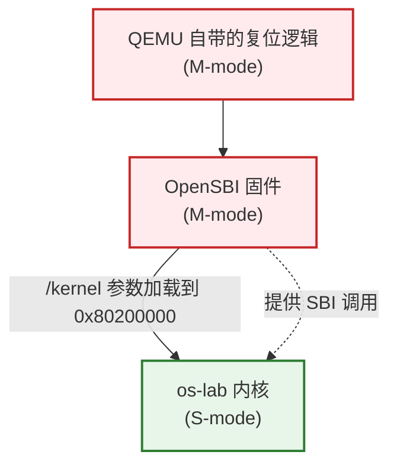
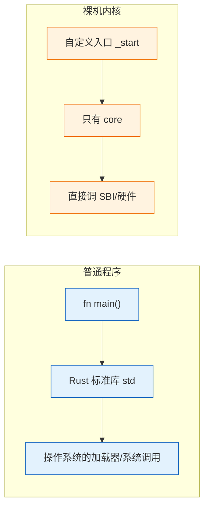
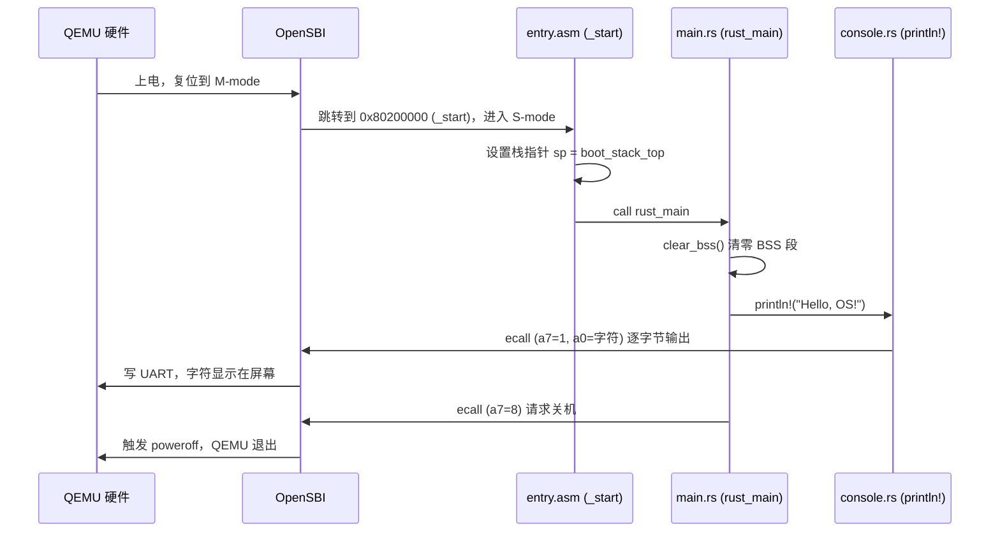

# 实验 1：裸机启动与最小内核

> 对应 feature：`lab1`（默认启用）。这是整个 os-lab 学习路径的起点：先让一段 Rust 代码脱离操作系统、直接在裸机（QEMU 模拟的 RISC-V 硬件）上跑起来。

## 零、开始之前

在动手前，请确认已完成以下准备：

1. **本机环境已就绪**：按仓库根目录 `docs/environment_setup.md` 装好 Rust（含 `riscv64gc-unknown-none-elf` target）、QEMU、（Windows 还需 MSVC Build Tools）。
2. **进入工作目录**：在本仓库根目录下，进入自研实验环境目录：
   ```powershell
   cd os-lab
   ```
3. **（可选）激活当前终端环境**：如果你新开了一个终端，在仓库**根目录**（不是 os-lab 目录）执行以下命令，让本会话能找到 Rust 和 QEMU：
   ```powershell
   . .\scripts\activate-os-env.ps1
   cd os-lab
   ```
4. **快速自检**：以下两条命令都能输出版本号，说明环境就绪：
   ```powershell
   rustc --version          # 预期：rustc 1.96.0 ...
   qemu-system-riscv64 --version   # 预期：QEMU emulator version 11.0.50 ...
   ```

> 如果上面任何一步报"找不到命令"，回到 `docs/environment_setup.md` 检查安装。

## 一、问题场景

写一个普通程序，我们习惯 `cargo new` 然后 `cargo run`，背后其实依赖了操作系统提供的大量基础设施：加载器把程序放进内存、标准库初始化运行时、`println!` 最终通过系统调用写到终端。

但是——**操作系统自己开机时，世界上还没有操作系统**。第一个内核程序面临的问题就是：

- 谁来把我加载进内存？
- 没有 `std` 标准库，我还能输出字符吗？
- 没有 `main` 函数约定，CPU 从哪里开始执行我的代码？
- 执行完之后怎么正常退出，而不是让 CPU 飞到非法地址？

本实验的目标就是回答这些问题，最终让一个最小内核在 QEMU 里输出 `Hello, OS!` 并正常关机。这看起来简单，但它建立了后续所有实验的地基：**如何让代码在裸机上跑起来**。

## 二、背景知识

### 2.1 RISC-V 的启动层级

RISC-V 有三个特权级，开机时硬件并不直接执行我们的内核代码，而是按层级逐级交接：



- **M-mode（机器模式）**：权限最高，开机即处于此模式。QEMU 上电后先跑自己 ROM 里的复位逻辑，然后跳到 OpenSBI 固件。
- **OpenSBI**：一段运行在 M-mode 的固件（QEMU `-bios default` 提供）。它负责初始化硬件、设置 S-mode 的入口，最后把控制权交给内核。它还提供 **SBI 调用**——这是内核在没有驱动的情况下，"请 OpenSBI 代劳"做事的标准接口（比如输出一个字符、关机）。
- **S-mode（监督模式）**：内核运行的模式。OpenSBI 把内核加载到固定地址 `0x80200000` 并跳过去，我们的内核就从这里开始跑。

> 关键认知：内核不是被操作系统加载的，而是被**更底层的固件**加载的。所以内核的链接地址必须和 OpenSBI 约定的加载地址（`0x80200000`）一致。

### 2.2 为什么需要 `#![no_std]` 和 `#![no_main]`



- `#![no_std]`：不链接 Rust 标准库 `std`（它依赖操作系统），只能用 `core`（与 OS 无关的基础类型/trait）。这意味着没有 `Vec`、`String`、`println!` 等便利设施，一切靠自建。
- `#![no_main]`：不使用 Rust 默认的 `main` 函数约定（那套约定假设有 C 运行时和加载器）。改为自定义入口符号，由汇编手动调用。

### 2.3 从上电到 `rust_main` 的执行流程

下图展示一段字符从内核代码走到屏幕的完整链路，这也是本实验代码的全部主干。



### 2.4 BSS 段与 `clear_bss`

时序图里有一行 `clear_bss() 清零 BSS 段`，它在 `println!` 之前执行。为什么？

**BSS 段是什么**：程序里"未初始化或初值为 0 的全局变量/静态变量"会被链接器放进一个叫 `.bss` 的内存区域。在有操作系统的环境里，加载器会在程序运行前把 BSS 段自动清零；但**裸机上没有加载器**，BSS 段里开机时是随机的垃圾值。

**为什么必须手动清零**：Rust 语言假设所有静态变量初值是合法的（比如 `static mut` 的初值、`Option` 的 `None`）。如果 BSS 没清零，这些变量开机后读到的是垃圾值，程序行为不可预测——可能打印乱码、可能死循环、可能崩溃。

**为什么必须在 `println!` 之前**：`println!` 宏的实现链路里（`console.rs` → `Stdout` → `Write` trait）可能间接引用位于 BSS 段的静态状态（例如格式化用的缓冲、锁标志等）。如果 BSS 还没清零就先 `println!`，这些状态是垃圾值，输出可能错乱甚至卡死。所以 `rust_main` 的第一件事必须是 `clear_bss()`，把 BSS 段逐字节写成 0（`main.rs` 里的 `write_bytes` 调用就是干这个的），之后才能安全地做任何事。

> 一句话：`clear_bss()` 是裸机程序"初始化运行时"的第一步，对应有 OS 环境里加载器自动做的事。它必须赶在所有可能用到静态变量的代码之前。

## 三、实验任务

> **本实验的定位**：lab1 是整个 os-lab 的**起跑线**——它是一份已经能跑通的最小内核，你不需要从零实现它。本实验的任务是：**跑通内核、读懂启动流程、做几个小修改建立裸机开发的直觉**。从 Lab2 开始，你才会在 feature gate 的指引下亲手"长出"新功能。

lab1 涉及的代码分布在以下文件（路径相对 `os-lab/`），请先逐个打开浏览一遍，建立整体印象：

| 文件 | 角色 | 你要重点理解的点 |
|------|------|------------------|
| `kernel/src/entry.asm` | 汇编入口 | 第一条指令做了什么、为什么是汇编而不是 Rust |
| `kernel/src/main.rs` | Rust 入口 | `#![no_std]`/`#![no_main]` 的含义、`clear_bss` 的作用、panic 处理 |
| `os-sbi/src/lib.rs` | SBI 调用（独立 crate） | 内核没有驱动时如何"委托"OpenSBI 输出字符和关机；`lab1` feature 依赖 `os-sbi` |
| `kernel/src/console.rs` | 控制台 | 如何把逐字节输出包装成 `println!` 宏（内部调用 `os_sbi::console_putchar`） |
| `kernel/linker.ld` | 链接脚本 | 为什么内核要链接到固定地址 `0x80200000` |

> 提示：本实验不给完整代码讲解（那样就变成抄答案了）。每个文件的"为什么这么写"，请你结合上面的【背景知识】自己读代码、想明白；想不通的地方正是【五、AI 提问模板】的用武之地。完整代码的逐行解读见 `labs/answers/lab1-answers.md`，**建议先自己读完再对照答案**。

本实验分为三档任务，按顺序完成：

### 任务一：跑通内核（必做）

确认环境已激活（`rustc --version`、`qemu-system-riscv64 --version` 能输出版本），在 `os-lab` 目录执行：

```powershell
cargo run -p kernel --features lab1
# 或用 Makefile 封装
make run
```

**预期输出**：屏幕会先刷出约 **40 行 OpenSBI 启动日志**（平台信息、HART 信息等，**这些是固件的输出，不是你的内核，无需关心**），最后两行才是你的内核输出：

```text
OpenSBI v1.7
   ____                    _____ ____ _____
  ...（约 40 行 OpenSBI 平台/HART 日志，可忽略）...
Boot HART MEDELEG           : 0x0000000000f4b509
Hello, OS!                              ← 你的内核从这里开始输出
os-lab kernel lab1 is running on QEMU virt.
```

> 新手提示：看到前面一大段 OpenSBI 日志别慌，那是固件的正常输出。**只要最后出现 `Hello, OS!` 就对了**。如果连 OpenSBI 的 banner 都没出现，说明 QEMU 没启动成功，检查 QEMU 安装。

**通过标准**：看到 `Hello, OS!` 且 QEMU 自动退出（终端命令返回，没有卡住或报错）。

> 如果卡住不退出：检查是不是没装 QEMU、或 `.cargo/config.toml` 里的 runner 路径不对。本命令已在本机实测通过（QEMU 11.0.50，exit code 0）。

### 任务二：阅读理解（必做）

带着下面的问题去读代码，每个问题请在脑中或笔记里给出答案（答案见习题部分与 `labs/answers/`）：

1. 在 `entry.asm` 里，`_start` 为什么要先 `la sp, boot_stack_top` 再 `call rust_main`？如果直接 `call rust_main` 会发生什么？
2. 在 `main.rs` 里，`rust_main` 为什么返回类型是 `-> !`（never）？`clear_bss()` 为什么必须在 `println!` 之前调用？
3. 在 `os-sbi/src/lib.rs` 里，输出一个字符时 `a7` 和 `a0` 寄存器分别放了什么？关机和输出字符用的是同一个指令吗？
4. 在 `linker.ld` 里，`BASE_ADDRESS = 0x80200000` 这个数字从哪里来？把它改成别的值会发生什么（见任务三第 2 项）？

> 阅读提示：对照【2.3 执行流程时序图】，把"一段字符从你的代码走到屏幕"的完整链路在脑中走一遍。能讲清楚这张图，lab1 就过关了。

### 任务三：动手小修改（选做，建议完成）

在能跑通的基础上，做几个小改动，亲手感受"改内核会发生什么"。每项改完后 `cargo run` 验证，验证通过再改回原样（保持仓库干净）。

**修改 1：换一句欢迎语**

在 `main.rs` 的 `rust_main` 函数里（lab1 分支，`println!("Hello, OS!")` 那一行），把欢迎语改成输出你自己的学号或名字，例如：

```rust
println!("Hello, OS! 我学号是 xxx");
```

- 通过标准：`cargo run` 后屏幕显示出你改的文字，且内核仍正常退出。

**修改 2：观察链接地址错误的后果（理解性实验）**

在 `linker.ld` 里把 `BASE_ADDRESS = 0x80200000;` 改成 `BASE_ADDRESS = 0x88000000;`（注意是 `0x8800`，不是 `0x8020`），然后 `cargo clean && cargo run`。

- 预期现象：QEMU 启动后立即报错退出，例如 `qemu-system-riscv64: No enough memory to place DTB after kernel/initrd`，进程 exit code 非 0，**看不到 `Hello, OS!`**。
- 通过标准：观察到上述崩溃现象，能用自己的话解释**为什么**（提示：OpenSBI 固定跳转到 `0x80200000`，而内核被链接到了 `0x88000000`，两者对不上，CPU 取不到正确的指令）。
- 做完务必改回 `0x80200000` 并 `cargo clean && cargo run` 确认恢复正常。
- 这个练习不求"跑通"，恰恰是要体会"地址对不上"的后果。

> ⚠️ 不要改成 `0x80100000` 这种离 `0x80200000` 太近的值——因为 lab1 内核镜像很小（几十 KB），`0x80100000` 与 `0x80200000` 相差仅 1MB，OpenSBI 跳转后仍可能落在内核镜像范围内，加上 RISC-V 的 PC 相对寻址，内核**可能照常运行**，你就观察不到崩溃了。要用 `0x88000000` 这种远离的值才能稳定复现。

**修改 3：调整启动栈大小**

当前 `entry.asm` 里是 `.space 4096 * 64`（256KB）。把它改成 `.space 4096 * 4`（16KB），`cargo run` 观察是否仍正常。

- 通过标准：lab1 这种简单内核 16KB 栈够用，应仍能正常输出和退出。能解释"为什么改小也能跑"（lab1 没有深层函数调用/大局部变量）。

### 提交清单（自查）

完成本实验后，你应该能做到：

- [ ] 能在 QEMU 中跑通 lab1，输出 `Hello, OS!` 并正常退出
- [ ] 能口述"从上电到 Hello 输出"的完整流程（对照时序图）
- [ ] 能回答任务二的 4 个阅读理解问题
- [ ]（选做）完成至少 1 个任务三的修改并理解现象

## 四、验证

本实验以【任务一】的 `cargo run -p kernel --features lab1` 能输出 `Hello, OS!` 并正常退出为主要验证标准。其余任务的验证标准见各任务说明。

## 五、AI 提问模板

做实验时，建议用以下切入点和 AI 交互，引导自己思考而非直接要答案：

1. **概念澄清型**：「RISC-V 上电后，从 M-mode 切到 S-mode 的过程中，OpenSBI 具体做了哪几件事？为什么内核不能直接从 M-mode 起步？」
2. **现象解释型**：「如果我把 `linker.ld` 里的 `BASE_ADDRESS` 从 `0x80200000` 改成 `0x80100000`，重新跑会怎样？为什么？」
3. **代码追因型**：「我的内核跑起来输出了一串乱码，但没 panic，最可能的原因是什么？提示：和 `clear_bss` 有关吗？」
4. **对比深化型**：「`#![no_std]` 之后我还能用 `Option`、`Result` 吗？为什么？它们和 `std::` 里的版本有什么区别？」
5. **动手探索型**：「我想在 `Hello, OS!` 后面再打印一个数字 `42`，用 `println!("{}", 42)` 行不行？需要满足什么前提？」

## 六、思考题与参考答案

### 习题 1

**为什么内核链接地址选择 `0x80200000`？**

参考答案：这是 QEMU `virt` 机器上 OpenSBI 固件与内核约定的加载地址。OpenSBI 自身占据 `0x80000000` 起的低地址区域（约 317KB），它把后续要跳转的 S-mode 内核镜像加载到 `0x80200000` 并从这个地址开始执行。如果内核链接地址与之不符，符号地址和实际加载地址就会错位，跳转和访存都会指向错误位置导致崩溃。可以在 OpenSBI 启动日志里看到 `Domain0 Next Address : 0x0000000080200000`，正是这个约定。

### 习题 2

**OpenSBI 在启动过程中扮演什么角色？**

参考答案：OpenSBI 是运行在 M-mode（最高特权级）的固件，扮演"硬件抽象层"和"启动加载器"双重角色。启动阶段它负责初始化硬件、配置好 S-mode 的运行环境（如设置 PMP、准备好跳转目标地址），然后把控制权交给位于 `0x80200000` 的内核。运行阶段它通过 SBI 调用接口（`ecall` 指令）为内核提供基础服务——本实验用到的输出字符（功能号 1）和关机（功能号 8）就是 SBI Legacy 扩展提供的服务。内核自己不写 UART 驱动，而是"委托"OpenSBI 完成。

### 习题 3

**`#![no_std]` 与 `#![no_main]` 分别解决什么问题？去掉其中任意一个会怎样？**

参考答案：

- `#![no_std]` 告诉编译器不链接标准库 `std`。`std` 依赖操作系统（如堆分配、线程、文件 IO），内核作为"要建立操作系统"的程序，运行时根本没有 OS 可用，所以必须舍弃 `std`，只保留与 OS 无关的 `core`。去掉它会报"std 不可用于 `riscv64gc-unknown-none-elf` 目标"，因为该裸机目标根本不提供 `std`。
- `#![no_main]` 告诉编译器不使用标准运行时的 `main` 入口。默认入口机制假设有 C runtime 初始化、有加载器调用——这些在裸机上都不存在。本内核用汇编 `entry.asm` 里的 `_start` 作为真正入口，手动设栈后 `call rust_main`。去掉它，链接器找不到符合裸机约定的入口符号，链接阶段会失败。
