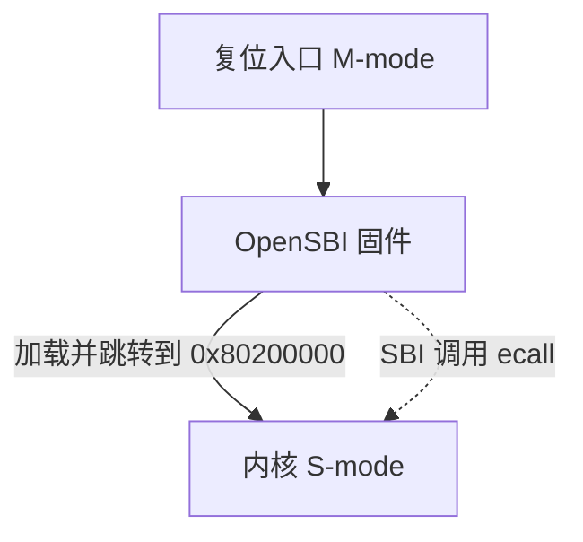
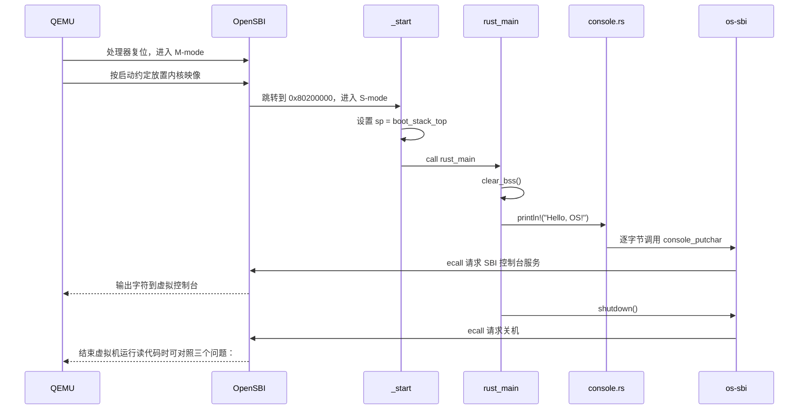

# 实验 1：裸机启动与最小内核

> 相关教材理论：
>
>  [第 2 章 · 操作系统介绍（P16）](/downloads/ostep-zh.pdf#page=16)
>
>  [第 6 章 · 机制：受限直接执行（P49）开头引言部分](/downloads/ostep-zh.pdf#page=49)

## 零、开始之前（还是最后check）

在开始完成你的最小内核之前，请确认已完成以下准备：

1. **本机环境已就绪**：按 [环境搭建指南](/setup/environment) 装好 Rust（含 `riscv64gc-unknown-none-elf` target）、QEMU、（Windows 还需 MSVC Build Tools）。
2. **进入工作目录**：在本仓库根目录下，进入自研实验环境目录：
  ```powershell
   cd os-lab
  ```
3. **（可选）激活当前终端环境**：如果你新开了一个终端，请在仓库**根目录**（不是 os-lab 目录）执行以下命令，让本会话能找到 Rust 和 QEMU：
  ```powershell
   . .\scripts\activate-os-env.ps1
   cd os-lab
  ```
4. **快速自检**：以下两条命令都能输出版本号，说明环境就绪：
  ```powershell
   rustc --version          # 预期：rustc 1.96.0 ...
   qemu-system-riscv64 --version   # 预期：QEMU emulator version 11.0.50 ...
  ```

> 如果上面任何一步报"找不到命令"，回到 [环境搭建指南](/setup/environment) 检查安装。

1. **建议先读书**：OSTEP 第一部分（导论）+ 第 6 章开头（受限的直接执行，为 Lab2 铺垫）。Lab1 的启动发生在教材「已有 OS」假设之前。


## 一、问题场景

OSTEP 从**虚拟化、并发和持久性**三条主线展开操作系统原理，但这些内容都隐含了一个基本前提：**内核已经被加载到内存，并且正在正常运行**。

那么，在操作系统尚未运行时，内核本身是如何启动的？内核映像由谁放入内存？处理器从哪条指令开始执行？没有现成的标准库和系统调用，内核又如何输出字符并结束运行？

在编写普通 Rust/C 应用程序时，我们通常只关注如下过程：

```
main → 输出信息 → 程序退出
```

但在这条看似简单的执行路径背后，操作系统、程序加载器和语言运行时已经完成了大量工作：

```
操作系统加载程序
→ 语言运行时初始化执行环境
→ 运行时调用 main
→ 程序通过系统调用请求输出
→ 操作系统回收进程资源
```

因此，`main`、标准输出和程序退出都不是程序天然具备的能力，而是建立在既有操作系统和运行时环境之上的抽象。内核启动时其实不存在一个更高层的操作系统来提供这些服务。

本实验希望你借助 QEMU 和 OpenSBI，显式建立一条属于你自己的最小内核运行链路。

普通应用程序与本实验内核的运行过程可以对照如下：


| 执行环节  | 普通应用程序                             | 本实验中的内核                                |
| ----- | ---------------------------------- | -------------------------------------- |
| 程序装载  | 操作系统加载器将程序装入进程地址空间                 | QEMU 按启动约定将内核映像放置到 `0x80200000`        |
| 控制权移交 | 语言运行时完成初始化后调用 `main`               | OpenSBI 完成固件初始化后跳转到内核入口 `_start`       |
| 字符输出  | `println!` 最终通过系统调用请求操作系统输出        | 内核执行 `ecall`，通过 SBI 控制台服务请求 OpenSBI 输出 |
| 程序结束  | 程序调用 `exit` 或从 `main` 返回，由操作系统回收资源 | 内核通过 SBI System Reset 服务请求 QEMU 关机     |


也即本实验需要解决的**四个核心问题**：

- 内核映像如何装入内存？
- 处理器如何进入内核入口？
- 内核如何输出字符？
- 内核如何结束运行？

**实验目标**：在 QEMU RISC-V 平台上启动一个最小内核，使其输出 `Hello, OS!`，随后通过 SBI 正常关闭虚拟机。实验将由此建立最基本的内核启动和固件调用路径，为后续 Lab2–8 中的异常与中断、虚拟内存、进程管理和文件系统等内容提供统一的运行基础。

## 二、背景知识

上节列出的本实验需要解决的四个核心问题共同构成了一个最小内核从固件获得控制权，到完成第一次输出并主动关机的完整启动链。后续实验中的异常处理、虚拟内存、进程管理和文件系统，都是在这条启动链已经建立的基础上继续扩展的。

### 2.1 内核映像如何装入内存

在 OSTEP 中，“程序由操作系统加载到内存”通常描述的是操作系统已经运行之后的场景。对于 Lab1我们想要实现的内核本身就是第一个需要被加载和启动的程序，因此不能假设已经存在一个更高层的操作系统来完成这项工作。

本实验使用 QEMU 模拟 RISC-V `virt` 平台，并由 OpenSBI 提供机器模式下的固件环境。在当前启动配置中，QEMU 按约定将内核映像放置到物理地址 `0x80200000`，OpenSBI 完成必要的固件初始化后，将控制权移交给该地址处的内核入口。

这里需要区分不同角色：


| 组件      | 主要职责                                    |
| ------- | --------------------------------------- |
| QEMU    | 模拟处理器、内存和外设，并按照启动参数放置内核映像               |
| OpenSBI | 在 M-mode 中运行，初始化平台，提供 SBI 服务，并将控制权移交给内核 |
| 操作系统内核  | 在 S-mode 中运行，建立自身的执行环境并实现后续操作系统功能       |


因此，`0x80200000` 是固件、QEMU 和内核之间的启动约定，而不是 RISC-V 架构规定的唯一地址。内核必须通过链接脚本使用相同的地址：

```
BASE_ADDRESS = 0x80200000;
```


### 2.2 处理器如何进入内核入口

RISC-V 使用特权级区分不同软件组件能够执行的操作。本实验涉及以下三个特权级：


| 特权级    | 名称   | 本实验中的执行者   | 作用               |
| ------ | ---- | ---------- | ---------------- |
| U-mode | 用户模式 | 后续实验中的用户程序 | 执行受限制的用户代码       |
| S-mode | 监督模式 | 操作系统内核     | 管理用户程序和系统资源      |
| M-mode | 机器模式 | OpenSBI 固件 | 执行最底层的平台初始化和固件服务 |


处理器复位后首先在 M-mode 中执行 OpenSBI，而不会直接从 Rust 的 `main` 函数开始运行。OpenSBI 完成初始化后，按照启动约定跳转到 `0x80200000`，此时内核在 S-mode 中开始执行。




内核从 `_start` 运行：首先完成启动栈设置，然后调用Rust函数 `rust_main`，此时已在 S-mode。

设置栈是进入高级语言代码之前的**必要步骤**，因为函数调用、局部变量和寄存器保存都依赖有效的栈空间。（kernel/src/entry.asm）

```asm
_start:
    la sp, boot_stack_top
    call rust_main
```

但是，拥有栈并不意味着 Rust 所依赖的全部初始条件都已经满足。普通 Rust 应用程序启动时，语言运行时和操作系统加载器通常已经完成了内存段初始化；裸机内核不能直接假设这些工作已经完成。

内核通过以下 crate 级属性声明自己的运行环境（kernel/src/main.rs）：

```rust
#![no_std]
#![no_main]
```

- `#![no_std]` 表示不链接依赖操作系统的 Rust 标准库，只使用 `core` 等不依赖 OS 的基础功能；
- `#![no_main]` 表示不使用编译器默认的 `main` 入口，而是由链接脚本指定汇编入口 `_start` 建立执行环境后，显式调用 `rust_main`。

除此之外，内核还必须初始化 `.bss` 段。

`.bss` 段保存未显式初始化，或者初始值为零的全局变量和静态变量。例如：

```
static mut COUNTER: usize = 0;
```

这类变量的初始值通常不会作为大量零字节直接存储在内核映像中。链接脚本只记录相应内存区域的位置和大小，程序启动时再由加载器或启动代码将其清零。

在普通应用程序中，这项工作通常由操作系统加载器完成；在本实验中，内核需要自行完成。Rust 假定静态变量初值合法。BSS 未清零就读，可能乱码、死循环或 panic。`println!` 的实现可能间接用到 BSS 中的静态状态，因此 `rust_main` 第一件事是 `clear_bss()`——把 `[sbss, ebss)` 逐字节写 0，等价于加载器在进程启动时做的初始化。

```rust
pub extern "C" fn rust_main() -> ! {
    clear_bss();
    console::init();
}
```

`clear_bss()` 使用链接脚本导出的 `sbss` 和 `ebss` 符号，将下面的内存区间清零：

```
[sbss, ebss) → 0
```

需要注意，BSS 清零并不是为了专门支持 `println!`。它是在执行一般 Rust 内核代码之前建立正确的全局和静态变量初始状态。本实验的控制台实现即使没有直接使用 BSS，后续模块仍可能依赖其中的静态数据，因此内核应当在其他初始化和功能代码之前完成这一工作。

于是，从汇编入口进入 Rust 环境的过程可以概括为：

```
_start
→ 设置启动栈
→ 调用 rust_main
→ 清零 BSS
→ 初始化内核模块
→ 执行内核功能
```


### 2.3 内核如何输出字符

普通 Rust 程序中的 `println!` 依赖标准库和操作系统提供的标准输出。内核使用 `#![no_std]` 后，不再拥有由 `std` 提供的文件 I/O、终端和内置标准输出，因此必须自行实现最小的输出路径。此外，本实验调用的 SBI 控制台服务 `console_putchar` 一次只能传递一个字符参数，而不能直接传递一个字符串。

因此本实验的输出链实现如下：

首先`kernel/src/console.rs` 使用 `core::fmt::Write` 完成格式化，将格式化后的字符串拆分为一个个字节，再调用 `os_sbi::console_putchar` 输出：

```
for byte in s.bytes() {
    os_sbi::console_putchar(byte);
}
```

由于`console_putchar` 并不是由硬件直接提供的普通 Rust 函数。OpenSBI 对外提供的是一套基于寄存器和 `ecall` 指令的调用约定。内核必须先把服务编号和参数放入指定寄存器，再执行 `ecall`，OpenSBI 才能识别并处理该请求。

所以为了避免控制台代码直接处理内联汇编、寄存器分配和 SBI 功能号，本实验在 `os-sbi/src/lib.rs` 中将这套底层协议封装成普通 Rust 函数：

```rust
pub fn console_putchar(ch: u8) {
    unsafe {
        core::arch::asm!(
            "ecall",
            in("a7") SBI_LEGACY_CONSOLE_PUTCHAR,
            in("a0") ch as usize,
            in("a6") 0usize,
            lateout("a0") _,
        );
    }
}
```

这样，上层控制台模块只需要调用`os_sbi::console_putchar(byte)`而不需要关心 `a0`、`a6`、`a7` 分别保存什么，也不需要在多处重复编写 `unsafe` 汇编代码。

请仔细理解这里“对 SBI 调用进行封装”的含义：**将底层的寄存器调用约定转换成上层可以直接使用的 Rust 函数接口**。

本实验使用的是传统的 Legacy SBI 控制台输出服务。执行调用时：


| 寄存器或指令  | 本实验中的作用                          |
| ------- | -------------------------------- |
| `a7`    | 保存 Legacy SBI 功能号；控制台输出的功能号为 `1` |
| `a0`    | 保存待输出的字符字节                       |
| `a6`    | Legacy 调用不使用该寄存器；本实验将其显式置为 `0`   |
| `ecall` | 产生环境调用异常，使处理器进入固件的异常处理流程         |


需要特别注意，`ecall` 本身并不表示“输出字符”，处理器也不理解 SBI 的功能号。对处理器而言，`ecall` 只是一次环境调用异常。真正解释寄存器内容的是 OpenSBI。

在本实验的启动环境中，执行过程如下：

```
S-mode 内核准备寄存器
→ 在 a7 中写入控制台功能号
→ 在 a0 中写入待输出字节
→ 执行 ecall
→ 处理器产生来自 S-mode 的环境调用异常
→ OpenSBI 在 M-mode 中接管该异常
→ OpenSBI 读取 a7 和 a0
→ OpenSBI 识别出控制台输出请求
→ OpenSBI 调用平台控制台实现
→ QEMU 将字符显示到宿主机终端
→ OpenSBI 返回 S-mode
→ 内核继续输出下一个字节
```

因此，内核不是通过 `ecall` 直接写入 UART 寄存器。`ecall` 只负责把控制权交给 OpenSBI；实际的平台控制台访问由 OpenSBI 完成。

本实验实现的是“通过 SBI 请求固件输出”，尚未实现 UART 设备驱动。如果后续内核直接读写 UART 的 MMIO 寄存器，输出路径会变成：

```
内核
→ 读写 UART MMIO 寄存器
→ QEMU 模拟 UART
→ 宿主机终端
```

此时 UART 输出不再需要通过 SBI 和 OpenSBI，进一步减少对固件服务的依赖。


### 2.4 内核如何结束运行

普通应用程序从 `main` 返回，或者调用 `exit` 后，由操作系统负责回收进程资源。裸机内核没有更高层的操作系统负责回收，因此必须显式请求虚拟机结束运行。

本实验通过 SBI 的关机服务完成这一操作：

```
os_sbi::shutdown();
```

该函数执行 `ecall`，将关机功能号传递给 OpenSBI。OpenSBI 处理请求后，QEMU 退出，终端命令正常返回。

由于关机调用不会返回，`rust_main` 被声明为：

```
pub extern "C" fn rust_main() -> !
```

其中 `!` 表示该函数永不返回。内核启动完成后只有两种预期结果：

```
正常运行 → 输出信息 → 请求关机
异常发生 → panic 处理 → 请求关机
```

如果 `rust_main` 在没有明确后继执行路径的情况下返回，内核就无法像普通应用程序那样回到一个由操作系统提供的调用者。

### 2.5 从上电到关机的完整执行链




本实验的意义不只是输出一行字符串，而是建立了后续操作系统实验所依赖的几项基本约定：

```
内核装载地址
→ 入口符号
→ 启动栈
→ BSS 初始化
→ 特权级之间的服务请求
→ 内核主动结束运行
```

后续 Lab2 及之后的系统调用，仍然采用**低特权级通过** `ecall` **请求高特权级服务**的基本思想，只是请求者由本实验的 S-mode 内核变为用户程序，服务者由 M-mode 的 OpenSBI 变为 S-mode 的操作系统内核。

## 三、实验任务

本实验主要相关文件：


| 文件                      | 角色                                       | 阅读时重点确认                |
| ----------------------- | ---------------------------------------- | ---------------------- |
| `kernel/src/entry.asm`  | 汇编入口：设栈、`call rust_main`                 | 第一条指令为何不能直接进入 Rust     |
| `kernel/src/main.rs`    | `#![no_std]` / `clear_bss` / `rust_main` | BSS 初始化为何早于任何格式化输出     |
| `os-sbi/src/lib.rs`     | SBI `ecall` 封装（输出、关机）                    | `a7` 与 `a0` 如何表达功能号和参数 |
| `kernel/src/console.rs` | `println!` 包装                            | 如何把格式化文本拆成逐字符输出        |
| `kernel/linker.ld`      | 链接地址 `0x80200000`                        | 链接地址如何与固件跳转地址一致        |


### 任务一：跑通内核

确认环境已激活，运行以下命令可输出版本号：

```
rustc --version
qemu-system-riscv64 --version
```

运行实验：

```powershell
cargo run -p kernel --features lab1
# 或用 Makefile 封装
make run
```

**预期输出**：屏幕会先刷出**OpenSBI 启动日志**（平台信息、HART 信息等），最后两行是你的内核输出：

```text
OpenSBI v1.7
   ____                    _____ ____ _____
  ...（OpenSBI 平台/HART 日志，可忽略）...
Boot HART MEDELEG           : 0x0000000000f4b509
Hello, OS!                              ← 你的内核从这里开始输出
os-lab kernel lab1 is running on QEMU virt.
```

**通过标准**：看到 `Hello, OS!` 且 QEMU 自动退出（终端命令返回，没有卡住或报错）。

### 任务二：阅读理解

1. `_start` 为什么要先 `la sp, boot_stack_top` 再 `call rust_main`？如果没有合法栈，函数调用会先破坏什么？
2. 对照 `main.rs`，解释 `clear_bss()` 为何必须在 `println!` 之前。
3. 对照 `os-sbi/src/lib.rs`：输出字符时 `a7`/`a0` 各放什么？关机是否复用同一条 `ecall` 指令？
4. OpenSBI 在启动阶段与运行阶段分别做什么？哪些职责在未来会被内核驱动取代？
5. `#![no_std]` 与 `#![no_main]` 各解决什么问题？去掉其中任意一个时，编译或启动链会在哪里断开？


### 任务三：动手修改

**修改 1：换一句欢迎语**

找到main文件中默认输出欢迎文字的代码部分，将欢迎语改成输出你自己的学号或名字，例如：

```rust
println!("Hello, OS! 我是 xxx");
```

- 通过标准：`cargo run` 后屏幕显示出你改的文字，且内核仍正常退出。

**修改 2：观察链接地址错误的后果**

在 `linker.ld` 里把 `BASE_ADDRESS = 0x80200000;` 改成 `BASE_ADDRESS = 0x88000000;`，然后 `cargo clean && cargo run`。

- 预期现象：QEMU 启动后立即报错退出，例如 `qemu-system-riscv64: No enough memory to place DTB after kernel/initrd`，进程 exit code 非 0。
- 通过标准：观察到上述崩溃现象，用自己的话解释**为什么**
- **做完务必改回并** `cargo clean && cargo run` **确认恢复正常**。

> ⚠️ 不要改成 `0x80100000` 这种离 `0x80200000` 太近的值——因为 lab1 内核镜像很小（几十 KB），`0x80100000` 与 `0x80200000` 相差仅 1MB，OpenSBI 跳转后仍可能落在内核镜像范围内，加上 RISC-V 的 PC 相对寻址，内核**可能照常运行**，你就观察不到崩溃了。要用 `0x88000000` 这种远离的值才能稳定复现。

**修改 3：调整启动栈大小**

当前 `entry.asm` 里是 `.space 4096 * 64`（256KB）。把它改成 `.space 4096 * 4`（16KB），`cargo run` 观察是否仍正常。

- 通过标准：lab1 这种简单内核 16KB 栈够用，应仍能正常输出和退出。解释「为什么改小也能跑」（lab1 没有深层函数调用、也没有很大的局部变量）。
- **做完务必改回并** `cargo clean && cargo run` **确认恢复正常**。


## 四、验证命令


| 验证项      | 命令                                                     | 通过标准                                                       |
| -------- | ------------------------------------------------------ | ---------------------------------------------------------- |
| 主编译      | `cargo check -p kernel --features lab1`                | 无 error                                                    |
| QEMU     | `cargo run -p kernel --features lab1 --release`        | `Hello, OS!`、`os-lab kernel lab1 is running on QEMU virt.` |
| 组件单测（可选） | `cargo test -p os-sbi --target x86_64-pc-windows-msvc` | 2 项通过                                                      |


