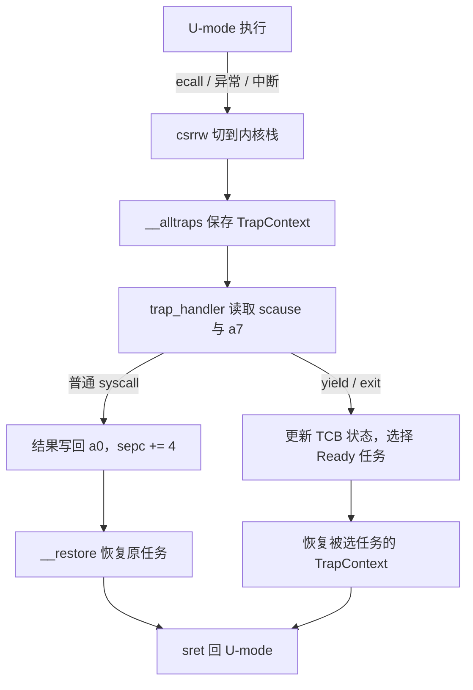

# 实验 2：中断处理与多任务

> 相关教材理论：
>
>  [第 6 章 · 机制：受限直接执行（P49）](/downloads/ostep-zh.pdf#page=49)
>
>  [第 7 章 · 调度导论（P60）](/downloads/ostep-zh.pdf#page=60)

## 零、开始之前

在开始完成中断处理与多任务之前，请确认已完成以下准备：

1. **已完成 Lab1**：理解了裸机启动、SBI 调用、`#![no_std]` 等基础（见 [Lab1 裸机启动](/labs/lab1-bare-metal)）。
2. **进入工作目录**：在本仓库根目录下，进入自研实验环境目录：
  ```powershell
   cd os-lab
  ```
3. **（可选）激活当前终端环境**：如果你新开了一个终端，请在仓库**根目录**（不是 os-lab 目录）执行以下命令，让本会话能找到 Rust 和 QEMU：
  ```powershell
   . .\scripts\activate-os-env.ps1
   cd os-lab
  ```
4. **快速自检**：以下两条命令都能输出版本号，说明环境就绪：
  ```powershell
   rustc --version          # 预期：rustc 1.96.0 ...
   qemu-system-riscv64 --version   # 预期：QEMU emulator version 11.0.50 ...
  ```

> 如果上面任何一步报"找不到命令"，回到 [环境搭建指南](/setup/environment) 检查安装。

1. **建议先读书**：OSTEP 第 6 章（受限的直接执行）+ 第 7 章（调度导论）。Lab2 是 CPU 虚拟化的起点；对应 feature 为 `lab2`（依赖 `lab1`）。


## 一、问题场景

Lab1 让内核在裸机上完成启动与 SBI 调用，但此时内核只能输出写死在代码里的文字，不能运行用户程序，也不能在多个程序之间切换。Lab2 对应《操作系统导论》里的 **CPU 虚拟化**：让用户程序跑在用户态，通过**系统调用**请求内核服务，并在多个程序之间切换。

**本实验知识路径（课本 → 项目 → 实践 → 证据 → 迁移）**：

```text
OSTEP Ch.6/7 受限执行与调度
        ↓
RISC-V U/S 特权 + ecall/sret + TCB 轮转（本仓库实现）
        ↓
跑通 hello / power / yield
        ↓
必须看见：用户输出、409684505、Yield round×5、All user apps exited.
        ↓
可迁移到：抢占式调度、异常处理、虚拟化 VM Exit
```


| Lab1           | Lab2                          |
| -------------- | ----------------------------- |
| 内核一直在 S-mode   | 用户程序在 U-mode，通过 syscall 请求服务  |
| 无 trap / 上下文保存 | TrapContext 保存寄存器，`sret` 原样恢复 |
| 单线程内核          | 多任务 Ready/Running/Exited 轮转   |


OSTEP 第 6 章 **Limited Direct Execution**：程序在用户态直接执行，速度快，但是特权受限；需要服务时 `ecall` 陷入内核。第 7 章用快速切换 CPU 制造「多程序同时跑」的幻觉。

也即本实验需要解决的**四个核心问题**：

- 用户程序如何在 U-mode 运行，并通过 `ecall` 请求内核服务？
- trap 发生时如何保存并恢复用户程序的上下文？
- 内核如何按 RISC-V ABI 分发 `sys_write` / `sys_exit` / `sys_yield`？
- 多个任务之间如何通过 Ready / Running / Exited 状态轮转？

**实验目标**：加载并运行 `hello` / `power` / `yield`，走通系统调用与任务切换。后续虚存、进程、文件系统都建立在这条 trap 路径上。

## 二、背景知识

对应 OSTEP 第 6 章（受限的直接执行）和第 7 章（调度导论）。Lab2 的主线是：**用户程序在 U-mode 运行，通过** `ecall` **陷入 S-mode 内核，内核处理完再** `sret` **返回**；多个程序时在内核里插入调度。

```text
U-mode 运行 → ecall → trap 进 S-mode → 保存现场 → 处理 → 恢复现场 → sret
（多任务时在「处理」后选下一个 Ready 任务）
```


### 2.1 特权级与 trap

Lab1 内核一直在 S-mode；Lab2 起引入 **U-mode** 跑用户程序，与 S-mode 内核形成权限隔离。


| 模式         | 权限              | 本实验  |
| ---------- | --------------- | ---- |
| **U-mode** | 低，不能直接访问设备/内核内存 | 用户程序 |
| **S-mode** | 高，可代用户访问硬件      | 内核   |


**trap** 指 CPU 从低特权级切到高特权级。OSTEP 第 6 章把 OS 的设计概括为 **Limited Direct Execution（受限的直接执行）**：程序在 CPU 上直接跑，速度快，但特权受限；需要服务、出错或收到中断时必须 trap 回内核。


| 类型   | 触发           | 本实验示例                                  |
| ---- | ------------ | -------------------------------------- |
| 系统调用 | 用户主动 `ecall` | `sys_write` / `sys_exit` / `sys_yield` |
| 异常   | 非法指令、页错误等    | Lab3 页错误                               |
| 中断   | 时钟、外设        | Lab2 以理解为主                             |


trap 后内核读 **CSR（控制与状态寄存器，Control and Status Register）** 判断原因。先记三个：


| CSR       | 作用                         |
| --------- | -------------------------- |
| `sepc`    | trap 时的 PC，返回时从这里继续        |
| `scause`  | trap 原因（syscall / 异常 / 中断） |
| `sstatus` | 特权与中断状态，返回时需恢复             |


Lab1 里内核用 `ecall` 找 OpenSBI（M-mode）；Lab2 里用户程序用 `ecall` 找内核（S-mode）。指令相同，陷入的目标不同。

`sret` 是 RISC-V 的监督模式返回指令：内核处理完 trap 后执行它，把特权级从 S-mode 降回 trap 发生前的 U-mode，并让 PC 回到 `sepc` 指定的位置。它与 `ecall` 正好构成一对进出内核的边界。

### 2.2 用户栈与内核栈：`sscratch`

trap 瞬间 `sp` 指向**用户栈**，不能把 TrapContext 写在用户栈上（可能破坏用户数据、空间不足、Lab3 后还有权限问题）。


| 栈   | 用途                  |
| --- | ------------------- |
| 用户栈 | 用户函数局部变量、返回地址       |
| 内核栈 | TrapContext、内核函数调用帧 |


`sscratch` 平时保存**内核栈顶**。trap 入口第一条指令：

```text
csrrw sp, sscratch, sp
```

交换 `sp` 与 `sscratch`：用户 `sp` 暂存到 `sscratch`，`sp` 指向内核栈，随后可以安全 `sd` 保存寄存器。返回前再次 `csrrw` 换回用户栈。

`csrrw` 和 `csrr` 是 RISC-V 的 CSR 读写指令：`csrrw` 交换 CSR 与通用寄存器的值，`csrr` 只读取 CSR。这里正是用 `csrrw` 完成 `sp` 与 `sscratch` 的交换。

### 2.3 上下文保存与恢复

trap 时用户程序的寄存器和 CSR 必须完整保存，否则 `sret` 回去后程序状态错误。本实验用 **TrapContext** 结构体保存 32 个 GPR 以及 `sstatus`、`sepc`、`kernel_sp`。

流程：`__alltraps`（汇编保存）→ `trap_handler`（Rust 分发）→ `__restore` 或 `run_user_task`（恢复）。

`trap.asm` 里的 `x0`–`x31` 是 RISC-V 通用寄存器：`x0` 恒为 0，`x1` 保存返回地址，`x2`（即 `sp`）是栈指针；`sd` 是 RISC-V 的 64 位存数指令，用于把寄存器值写入内存。

`trap.asm` 中的要点：

- `x0` 恒为 0，不保存；`x1` 单独 `sd`。
- `.rept 29` 保存 `x3`–`x31`（`.set n, 3`）。
- 用户 `sp`（`x2`）：`csrrw` 换栈后暂存在 `sscratch`，再 `csrr` 读出写入 `2*8(sp)`。
- `sstatus`、`sepc` 在 `32*8(sp)`、`33*8(sp)`；`kernel_sp` 在 `34*8(sp)`。
- `__restore` 末尾 `csrrw sp, sscratch, sp` 换回用户栈，再 `sret`。

保存/恢复顺序必须严格对应。trap 入口不能用 Rust 函数——调用会破坏正要保存的寄存器，所以先用汇编存现场。

`ecall` 触发 trap 后 `sepc` 指向 `ecall` 本身；返回前须 `advance_sepc()`（`sepc += 4`），否则会反复陷入同一条指令。

### 2.4 系统调用约定

`ecall` 只表示「请求内核服务」；具体服务由**调用约定**决定。本实验遵循 **RISC-V Linux ABI**：


| 寄存器       | 用途    |
| --------- | ----- |
| `a7`      | 系统调用号 |
| `a0`–`a6` | 参数    |
| `a0`      | 返回值   |


| 编号  | 名称          | 作用            |
| --- | ----------- | ------------- |
| 64  | `sys_write` | 写 fd（本实验用于屏幕） |
| 93  | `sys_exit`  | 退出            |
| 124 | `sys_yield` | 让出 CPU        |


以 `sys_write` 为例：用户侧把 fd/buf/len 放入 `a0`/`a1`/`a2`、`64` 放入 `a7`，执行 `ecall`；内核 `trap_handler` 读 `scause` 和 `a7`，调 `sys_write`，结果写回 `a0`，`advance_sepc()` 后返回。

### 2.5 任务调度

OSTEP 第 7 章：多程序「同时运行」靠**快速切换 CPU** 制造幻觉。本实验用简单的 Ready / Running / Exited 三态和轮转调度。

三个状态的含义：**Ready** 表示已可调度、尚未占用 CPU；**Running** 表示当前正占用 CPU；**Exited** 表示已经退出、等待回收。

每个用户程序对应一个 **TaskControlBlock（TCB）**，记录：

- 状态（Ready / Running / Exited）
- `TrapContext`（切换时的寄存器快照）
- 用户栈、内核栈
- Lab3+ 的地址空间 token

调度时两个 syscall 会更新 TCB：

- `sys_exit`：标 Exited，调度下一个 Ready 任务。
- `sys_yield`：标 Ready，让出 CPU。

轮转调度指每次从当前任务之后按顺序找下一个 Ready 任务，把 CPU 交给它。`sys_yield` 主动让出，`sys_exit` 退出后也由调度器选下一个任务。

`user/src/bin/yield.rs` 循环 5 次 `sys_yield`，预期 5 行 `Yield round`。若只有 1 行，检查 `trap.asm` 双栈切换和 `SYS_YIELD` 分发——也要怀疑「让出」是否被误写成「退出」。

### 2.6 把 trap 与调度放进同一条时间线

trap 并不必然发生任务切换：普通 `sys_write` 处理后恢复当前任务；只有 `yield`、`exit` 或未来的时钟中断才会让调度器选择另一个 Ready 任务。




要区分两种“上下文”：**TrapContext** 是一次用户态陷入的寄存器快照；**TCB** 是任务长期存在的档案，除 TrapContext 外还记录状态、栈和后续 Lab 使用的地址空间。保存现场解决“回来时接着算”，调度解决“现在轮到谁算”。

## 三、实验任务

本实验主要相关文件（路径相对 `os-lab/`）：


| 文件                           | 角色                       | 阅读时重点确认                              |
| ---------------------------- | ------------------------ | ------------------------------------ |
| `os-context/src/lib.rs`      | TrapContext 定义           | GPR、CSR 与 `kernel_sp` 的布局            |
| `os-context/src/trap.asm`    | 保存 / 恢复汇编（双栈、`sscratch`） | 保存和恢复槽位是否严格对称                        |
| `os-syscall/src/lib.rs`      | syscall 编号               | 用户态与内核是否共享同一编号约定                     |
| `kernel/src/trap.rs`         | trap 分发                  | `scause`、`a7`、`advance_sepc()` 的先后关系 |
| `kernel/src/task.rs`         | 任务管理与调度                  | Ready / Running / Exited 如何转换        |
| `kernel/src/loader.rs`       | 用户程序加载                   | 程序字节、入口和两套栈从何而来                      |
| `user/src/lib.rs`、`bin/*.rs` | 用户程序与 syscall 封装         | 参数如何进入 `a0`–`a7`                     |


> 完整代码走读与参考答案见 [lab2 参考答案](/answers/lab2-answers)。


### 任务一：跑通内核

确认环境已激活，运行以下命令可输出版本号：

```powershell
rustc --version
qemu-system-riscv64 --version
```

运行实验：

```powershell
cargo run -p kernel --features lab2
```

**预期输出**（前面约 40 行 OpenSBI 日志可忽略）：

```text
Hello from user app!                    ← hello 程序通过 sys_write 输出
App 0 exited with code 0                ← hello 调用 sys_exit
Power test start
2^1000000002 % 998244353 = 409684505    ← power 程序的快速幂结果
Power check ok
App 1 exited with code 0
Yield test start
Yield round
Yield round
Yield round
Yield round
Yield round
App 2 exited with code 0
All user apps exited.                   ← 全部退出，关机
```

**通过标准**：看到 `Hello from user app!`、`409684505`、`All user apps exited.`，且 QEMU 正常退出（终端命令返回，没有卡住或报错）。

### 任务二：阅读理解

参考答案见 [lab2 参考答案](/answers/lab2-answers)。

1. `__alltraps` 里 `csrrw sp, sscratch, sp` 为什么必须在最前面？对照 2.2 说明此时两个位置各保存哪一个栈指针。
2. `TrapContext` 要保存哪些内容？漏保存 `sepc` 会怎样？漏保存普通 GPR 又会出现哪类“偶发错误”？
3. 处理 `sys_write` 返回用户态时 PC 应指向哪里？为什么必须在恢复前 `advance_sepc()`？
4. 从 `user/src/syscall.rs` 到 `kernel/src/trap.rs`，按 RISC-V ABI 走一遍 `a7`/`a0`/`a1`/`a2` 的传递链。
5. 一个 TCB 要记录哪些状态？用户栈与内核栈为何分开？再说明 TrapContext 与 TCB 各解决什么问题。


### 任务三：动手修改

每项改完 `cargo run -p kernel --features lab2` 验证，通过后改回原样。

**修改 1：让 hello 多说一句**

在 `user/src/bin/hello.rs` 的 `exit(0)` 前加：

```rust
println("Hello again from user!");
```

- 通过标准：看到两行 Hello。

**修改 2：观察 sscratch 的作用（理解性实验）**

在 `os-context/src/trap.asm` 的 `__alltraps` 开头，临时注释掉 `csrrw sp, sscratch, sp`，再跑。

- 预期：崩溃或卡死。做完**务必改回**。

**修改 3：增加一个新系统调用（进阶）**

仿照 `SYS_YIELD`，在 `trap_handler` 为自定义号（如 999）打印 `Custom syscall received!` 并返回 0；在 `user/src/bin/` 写小程序调用它。

- 通过标准：内核打印出对应信息。


## 四、验证命令


| 验证项      | 命令                                                         | 通过标准           |
| -------- | ---------------------------------------------------------- | -------------- |
| 主编译      | `cargo check -p kernel --features lab2`                    | 无 error        |
| QEMU     | `cargo run -p kernel --features lab2 --release`            | 同时满足下列**输出断言** |
| 组件单测（可选） | `cargo test -p os-context --target x86_64-pc-windows-msvc` | 通过             |


**输出断言（与** `lab-packages/lab2/lab.yaml` **对齐；缺一不算通过）**：


| 断言 id               | 必须看到                    |
| ------------------- | ----------------------- |
| `hello-output`      | `Hello from user app!`  |
| `power-result`      | `409684505`             |
| `yield-five-rounds` | `Yield round` 出现不少于 5 次 |
| `all-exited`        | `All user apps exited.` |


> 任意白名单命令「退出码 0」**不等于** Lab 通过；例如 `Yield round` 不足 5 行时，命令仍可能返回 0。
