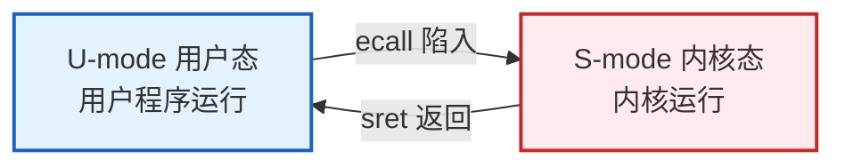
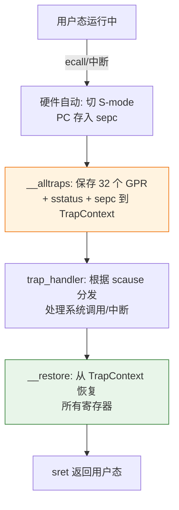

# 实验 2：中断处理与多任务

> 对应 feature：`lab2`（依赖 `lab1`）。在 lab1 的裸机内核基础上，让它能响应用户程序的"请求"（系统调用）、能在多个程序之间切换。这是内核从"只会说 Hello"变成"能干活"的关键一步。

## 零、开始之前

1. **已完成 Lab1**：理解了裸机启动、SBI 调用、`#![no_std]` 等基础（见 [lab1-bare-metal.md](lab1-bare-metal.md)）。
2. **进入工作目录**：
   ```powershell
   cd os-lab
   ```
3. **（可选）激活环境**：新开终端时在仓库根目录执行 `. .\scripts\activate-os-env.ps1` 后 `cd os-lab`。
4. **自检**：`rustc --version` 与 `qemu-system-riscv64 --version` 能输出版本。

## 一、问题场景

Lab1 的内核只会开机、打印一行字、关机——它不能运行"用户程序"。但真正的操作系统要能同时管理多个程序：浏览器、编辑器、终端……这些程序运行时，会不断向内核提需求（读文件、写屏幕、申请内存）。

内核和用户程序之间隔着一条**特权级边界**：用户程序运行在低特权（U-mode），不能直接碰硬件；它要做事，必须**"请求"内核代劳**。这个请求机制就是**系统调用（syscall）**，而请求的"动作"叫**陷入（trap）**。

本实验要回答的问题：

- 用户程序怎么"陷入"内核？内核怎么知道是"请求"还是"出错"？
- 陷入前用户程序的寄存器怎么办？返回时怎么恢复？
- 内核怎么让多个程序轮流使用 CPU，而不是一个程序独占到底？

学完本实验，你的内核将能加载并运行 3 个用户程序（`hello`/`power`/`yield`），并通过系统调用与它们交互。

## 二、背景知识

### 2.1 特权级与 trap

RISC-V 有多个特权级，本实验关心两个：



- **U-mode（用户态）**：用户程序运行的模式，权限受限，不能直接访问硬件或内核内存。
- **S-mode（监督态）**：内核运行的模式（lab1 就在这里），权限较高。
- **trap（陷入）**：从低特权转到高特权的过程。触发 trap 的原因有两类：
  - **系统调用**：用户程序主动执行 `ecall` 指令，请求内核服务。
  - **异常/中断**：程序出错（如非法地址）或外部事件（如时钟中断）。

内核通过 `scause` 寄存器判断 trap 的具体原因，再做相应处理。

### 2.2 上下文保存与恢复

trap 发生时，CPU 从用户态切到内核态，但**用户程序的寄存器状态不能丢**——否则返回后程序没法继续。所以内核必须先把所有通用寄存器（x0-x31）和几个关键 CSR（`sstatus`、`sepc`）保存到一个结构体里，这个结构体就是 **TrapContext**。



保存和恢复的**顺序必须严格对应**（保存的第 N 个寄存器，恢复时也要取第 N 个），否则用户程序会拿到错的值。本实验用一段汇编（`trap.asm`）完成这件事。

### 2.3 两个栈的切换：`sscratch` 的妙用

trap 发生时有个鸡生蛋问题：要保存寄存器就要用栈，但栈指针 `sp` 本身就是用户态的值（指向用户栈），内核不能往用户栈写。怎么拿到内核栈？

答案是 **`sscratch` 寄存器**——它平时保存着内核栈指针。trap 入口的第一条指令是 `csrrw sp, sscratch, sp`：把 `sp`（用户栈）和 `sscratch`（内核栈）**交换**。这一条指令同时完成了"保存用户栈到 sscratch"和"把内核栈装入 sp"两件事，非常巧妙。

### 2.4 系统调用的约定

RISC-V Linux ABI 的系统调用约定：

- `a7`（x17）：系统调用号（告诉内核"我要哪个服务"）
- `a0`-`a6`（x10-x16）：参数
- `a0`（x10）：返回值

本实验用到的系统调用（定义在 `os-syscall`）：

| 编号 | 名称 | 用途 | 参数 |
|------|------|------|------|
| 64 | `sys_write` | 写入（本实验用于屏幕输出） | fd, buf, len |
| 93 | `sys_exit` | 退出程序 | exit_code |
| 124 | `sys_yield` | 主动让出 CPU | 无 |

### 2.5 任务调度：批处理与轮转

内核要让多个程序"同时"跑（实际是轮流跑）。本实验用的是**简单的批处理/轮转调度**：


- 每个任务有一个 **TaskControlBlock（TCB）**，记录它的状态（Ready/Running/Exited）、TrapContext、用户栈、内核栈。
- 当前任务调用 `exit` 或 `yield`，调度器选下一个 Ready 的任务运行。
- 所有任务都 Exited 时，内核关机。

> ⚠️ **本实验的已知限制**：当前调度器是批处理式的——`yield` 在某些情况下可能只触发一次切换就继续往下走到 `exit`。这是简化实现的取舍，不影响理解 trap 机制本身。完整的抢占式调度在后续实验/扩展中补全。

## 三、实验任务

> **本实验的定位**：和 lab1 一样，lab2 的代码已由成员 A/B 实现并验证通过。你的任务是**跑通内核、读懂 trap 流程、做小修改建立直觉**。理解 trap 机制是后续所有实验的基础——后面每个 lab 都建立在"用户程序能陷入内核"这个前提上。

lab2 涉及的代码分布在以下文件，请先浏览一遍：

| 文件 | 角色 | 重点理解 |
|------|------|---------|
| `os-context/src/lib.rs` | TrapContext 定义 | 字段布局（32 GPR + sstatus + sepc + kernel_sp）、API |
| `os-context/src/trap.asm` | 保存/恢复汇编 | `__alltraps`/`__restore`、`sscratch` 交换 |
| `os-syscall/src/lib.rs` | syscall 编号 | SYS_WRITE/EXIT/YIELD 的数值约定 |
| `kernel/src/trap.rs` | trap 分发 | `trap_handler` 如何按 scause 分发 |
| `kernel/src/task.rs` | 任务管理 | TCB、调度、sys_write/sys_exit |
| `user/src/lib.rs`、`bin/*.rs` | 用户程序 | 用户态怎么发起 syscall |

> 提示：本实验不给完整代码讲解（避免变成抄答案）。每个文件的"为什么这么写"请结合【背景知识】自己读、想明白。完整代码解读见 `labs/answers/lab2-answers.md`，建议先自己读完再对照。

本实验分为三档任务：

### 任务一：跑通 lab2（必做）

```powershell
cargo run -p kernel --features lab2
```

**预期输出**（前面约 40 行 OpenSBI 日志可忽略，以下是内核与用户程序部分）：

```text
Hello from user app!                    ← hello 程序通过 sys_write 输出
App 0 exited with code 0                ← hello 调用 sys_exit
Power test start
2^1000000002 % 998244353 = 409684505    ← power 程序的快速幂结果
Power check ok
App 1 exited with code 0
Yield test start
Yield round                             ← yield 程序（可能只输出 1 轮，见已知限制）
All user apps exited.                   ← 全部退出，关机
```

**通过标准**：看到 `Hello from user app!`、`409684505`、`All user apps exited.`，且 QEMU 正常退出。

> 如果看不到用户程序输出：检查是不是漏了 `--features lab2`（默认是 lab1，不含 trap/task）。

### 任务二：阅读理解（必做）

带着下面的问题读代码（答案见习题部分与 `labs/answers/`）：

1. 在 `trap.asm` 的 `__alltraps` 里，第一条指令 `csrrw sp, sscratch, sp` 做了什么？为什么这一步必须在保存任何寄存器之前？
2. `TrapContext` 为什么要保存 32 个通用寄存器 + `sstatus` + `sepc` + `kernel_sp`，而不是只保存几个？漏保存 `sepc` 会怎样？
3. 在 `trap.rs` 的 `trap_handler` 里，处理 `SYS_WRITE` 时为什么要先 `cx.advance_sepc()`？不调用它会怎样？
4. 用户程序（`user/src/syscall.rs`）发起 `sys_write` 时，`a7`、`a0`、`a1`、`a2` 分别放了什么？这些值怎么传到内核的 `sys_write(fd, buf, len)`？
5. 在 `task.rs` 里，`TaskControlBlock` 为什么要把"用户栈"和"内核栈"分开存？合成一个栈行不行？

> 阅读提示：对照【2.2 上下文保存恢复】和【2.3 sscratch】的图，把"一次 sys_write 从用户代码走到屏幕"的完整链路在脑中走一遍。

### 任务三：动手小修改（选做，建议完成）

**修改 1：让 hello 程序多说一句**

在 `user/src/bin/hello.rs` 的 `main` 里，在 `exit(0)` 前再加一行：

```rust
println("Hello again from user!");
```

- 通过标准：`cargo run --features lab2` 后看到两行 Hello 输出。
- 这个练习让你确认：用户程序的修改 → 重新编译 → 内核加载运行，整条链路通畅。

**修改 2：观察 sscratch 的作用（理解性实验）**

在 `os-context/src/trap.asm` 的 `__alltraps` 开头，临时把 `csrrw sp, sscratch, sp` 这一行注释掉（行首加 `#`），重新 `cargo run --features lab2`。

- 预期现象：崩溃或卡死（因为 sp 还是用户栈，内核往里写会破坏用户数据或访问非法地址）。
- 通过标准：观察到异常，能解释"为什么少了这一行交换就崩"。做完**务必改回**。

**修改 3：增加一个新系统调用（进阶）**

仿照 `SYS_YIELD` 的处理，在 `trap.rs` 的 `trap_handler` 里加一个新分支：当 syscall 号为某个自定义值（比如 999）时，打印 `Custom syscall received!` 并返回 0。然后在 `user/src/bin/` 新建一个小程序调用它。

- 通过标准：用户程序调用自定义 syscall 后，内核打印出对应信息。
- 这个练习让你完整走一遍"定义 syscall → 内核分发 → 用户调用"的闭环。

### 提交清单（自查）

- [ ] 能在 QEMU 中跑通 lab2，看到 hello/power/yield 输出
- [ ] 能口述"用户程序 sys_write → trap → 内核处理 → 返回"的完整流程
- [ ] 能回答任务二的 5 个阅读理解问题
- [ ]（选做）完成至少 1 个任务三的修改并理解现象

## 四、验证

本实验以【任务一】的 `cargo run -p kernel --features lab2` 能输出 `Hello from user app!`、`409684505`、`All user apps exited.` 并正常退出为主要验证标准。其余任务的验证标准见各任务说明。

## 五、AI 提问模板

1. **概念澄清型**：「RISC-V 的 `ecall` 指令执行后，硬件具体做了哪些事？`sstatus`、`sepc`、`scause` 分别在什么时候被设置？」
2. **现象解释型**：「我的内核跑 lab2 时用户程序输出乱码，但没 panic，可能的原因是什么？提示：和 TrapContext 的保存/恢复顺序有关吗？」
3. **代码追因型**：「`__alltraps` 里用 `.rept 29` 保存 x2-x30，为什么是 29 个而不是 32 个？x0 和哪两个寄存器被特殊处理了？」
4. **对比深化型**：「`sys_write` 里内核要从用户传入的 `buf` 指针读数据，这为什么不安全？后续 lab3 有了虚存后会怎么改进？」
5. **动手探索型**：「我想让时钟中断真正打断用户程序（抢占式调度），需要设置哪些 CSR？当前 lab2 的 yield 是"主动让出"，和"被动抢占"有什么区别？」

## 六、思考题与参考答案

### 习题 1

**`trap.asm` 里 `csrrw sp, sscratch, sp` 这一步为什么必须在最前面？**

参考答案：这一步同时完成两件事——把当前 `sp`（用户栈指针）存进 `sscratch`，把 `sscratch` 里保存的内核栈指针装入 `sp`。必须在最前面，因为后续所有"保存寄存器到栈"的操作（`sd x1, 1*8(sp)` 等）都依赖 `sp` 已经指向内核栈。如果先保存寄存器再换栈，就会写到用户栈里，破坏用户数据甚至访问非法地址导致崩溃。

### 习题 2

**`TrapContext` 为什么要保存这么多？漏保存 `sepc` 会怎样？**

参考答案：用户程序随时可能被 trap 打断，打断时它的全部状态（32 个通用寄存器 + 当前的特权级状态 `sstatus` + 下一条指令地址 `sepc`）都必须完整保存，否则返回后没法精确恢复执行。`sepc` 记录"trap 发生时用户程序的 PC"，漏保存会导致 `sret` 返回到错误地址——程序跳到不可预测的位置执行，必然崩溃。

### 习题 3

**处理 `SYS_WRITE` 时为什么要先 `cx.advance_sepc()`？**

参考答案：`ecall` 触发 trap 后，`sepc` 指向 `ecall` 这条指令本身。如果返回时不把 `sepc` 加 4（跳到下一条指令），`sret` 后 CPU 会重新执行同一个 `ecall`，陷入死循环——用户程序永远卡在系统调用上。所以 `advance_sepc()` 在处理逻辑之前调用，保证返回后从 `ecall` 的下一条指令继续。

### 习题 4

**用户态 `sys_write` 的参数怎么传到内核？**

参考答案：按 RISC-V Linux ABI 约定，用户程序把 `fd` 放 `a0`、`buf` 指针放 `a1`、`len` 放 `a2`、syscall 号 64 放 `a7`，执行 `ecall`。trap 后这些寄存器被 `__alltraps` 保存进 TrapContext 的 `x[]` 数组（a0=x10、a1=x11、a2=x12、a7=x17）。内核的 `trap_handler` 通过 `cx.syscall_arg(0/1/2)`（取 x10/11/12）和 `cx.syscall_id()`（取 x17）把这些值取出来，传给 `sys_write(fd, buf, len)`。这就是"用户态寄存器 → TrapContext → 内核函数参数"的传递链路。

### 习题 5

**为什么用户栈和内核栈要分开？**

参考答案：隔离与安全。用户栈在用户地址空间，用户程序可以随意写它；内核栈在内核地址空间，用户程序碰不到。如果合成一个栈：① 用户程序的 bug（栈溢出）会破坏内核数据；② 内核处理 trap 时往用户栈写，可能写到非法地址（用户栈可能没映射）；③ 没法实现特权级隔离（后续 lab3 的虚存会把内核/用户地址空间彻底分开）。分开后，trap 时切到内核栈，内核有自己安全的栈空间，互不干扰。
