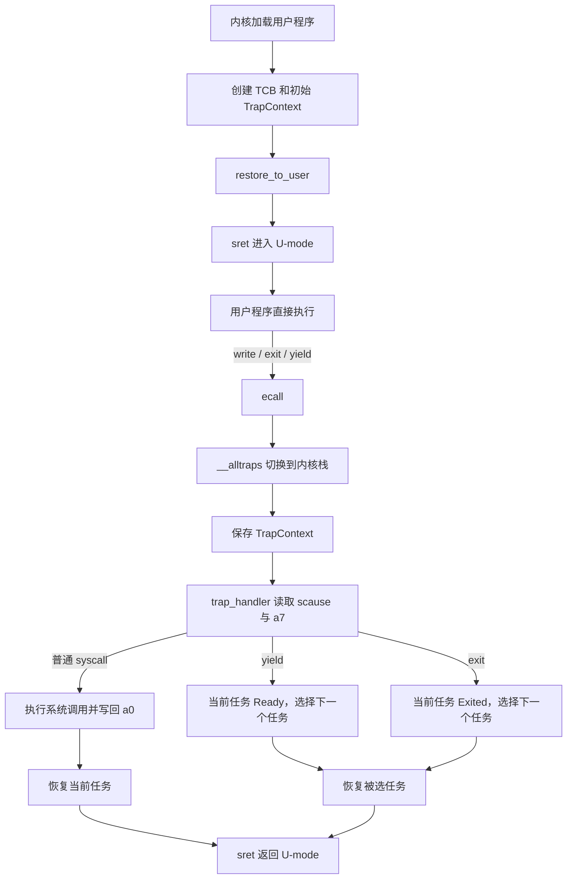

# 实验 2：中断处理与多任务

> 相关教材理论：
>
> [第 6 章 · 机制：受限直接执行（P49）](/downloads/ostep-zh.pdf#page=49)
>
> [第 7 章 · 调度导论（P60）](/downloads/ostep-zh.pdf#page=60)

## 零、开始之前

在开始完成中断处理与多任务之前，请确认已完成以下准备：

1. **已完成 Lab1**：理解了裸机启动、SBI 调用、`#![no_std]`、内核入口与关机流程。Lab2 在 Lab1 的启动链上继续扩展。
2. **进入工作目录**：在本仓库根目录下，进入自研实验环境目录：

   ```powershell
   cd os-lab
   ```

3. **（可选）激活当前终端环境**：如果你新开了一个终端，请在仓库**根目录**（不是 os-lab 目录）执行以下命令，让本会话能找到 Rust 和 QEMU：

   ```powershell
   . .\scripts\activate-os-env.ps1
   cd os-lab
   ```

4. **快速自检**：以下两条命令都能输出版本号，说明环境就绪：

   ```powershell
   rustc --version                    # 预期：rustc 1.96.0 ...
   qemu-system-riscv64 --version      # 预期：QEMU emulator version 11.0.50 ...
   ```

> 如果上面任何一步报“找不到命令”，回到 [环境搭建指南](/setup/environment) 检查安装。

5. **建议先读书**：OSTEP 第 6 章（受限的直接执行）+ 第 7 章（调度导论）。Lab2 是 CPU 虚拟化的起点，对应 feature 为 `lab2`（依赖 `lab1`）。

## 一、问题场景

Lab1 建立了一条完整的启动链路：QEMU 加载内核映像到 `0x80200000`，OpenSBI 完成固件初始化后跳转到内核入口 `_start`，内核随后通过 SBI 调用输出 `Hello, OS!` 并正常关机。

到这里，我们有了一个能在 RISC-V 裸机上独立执行的程序，但它还不能被称为**操作系统内核**，因为它缺少三个关键能力：

**第一，隔离与保护。** Lab1 的内核全程运行在 S-mode（监督模式）。未来的用户程序不应直接拥有 S-mode 的全部权限：如果一个用户程序可以随意修改内核内存或直接访问外设，整个系统的安全边界就形同虚设。操作系统必须把用户程序约束在 U-mode（用户模式），让特权操作经过内核的审查与代理。

**第二，受控的服务接口。** 用户程序不能直接操作硬件，但它仍然需要输出字符、申请内存、读写文件。内核必须提供一组**系统调用**，让用户程序通过受控入口请求内核服务。这正是 OSTEP 第 6 章“受限直接执行”的核心机制：程序在用户态直接执行以保持性能；需要特权服务时通过 `ecall` 陷入内核，由内核代为完成，完成后通过 `sret` 返回用户态。

**第三，CPU 的虚拟化与复用。** 如果内核只服务一个用户程序，它不过是比 Lab1 多绕了一层路的引导程序。操作系统之所以为操作系统，在于它能在多个程序之间**切换 CPU**，制造出“多个程序同时运行”的假象。这便是 OSTEP 第 7 章调度机制的起点，也是 **CPU 虚拟化** 的内涵：每个程序都“觉得”自己独占一颗 CPU，而内核在幕后把物理 CPU 分时复用在多个程序之间。

针对这三个关键能力，本实验将讨论：U-mode 与 S-mode 的权限隔离、`ecall` / `sret` 陷入与返回路径、系统调用分发（`sys_write` / `sys_exit` / `sys_yield`）、TrapContext 上下文保存与恢复，以及 Ready / Running / Exited 多任务状态轮转。

**本实验的知识路径**：

```text
OSTEP 受限直接执行 + 调度导论
        ↓
RISC-V U/S 特权级、ecall/sret、TrapContext、TCB
        ↓
在 QEMU 中运行 hello / power / yield 三个用户程序
        ↓
用输出断言证明：用户输出、快速幂结果、Yield round×5、全部退出
        ↓
可迁移到：时钟中断抢占、异常处理、虚拟机 VM Exit
```

**Lab1 与 Lab2 的对照**：

| 维度 | Lab1 | Lab2 |
| --- | --- | --- |
| 执行者 | 内核一直在 S-mode | 用户程序在 U-mode，通过 syscall 请求内核服务 |
| 服务入口 | 内核 `ecall` 到 OpenSBI（M-mode） | 用户 `ecall` 到内核（S-mode） |
| 上下文保存 | 无 | TrapContext 保存寄存器与关键 CSR，`sret` 原样恢复 |
| 程序数量 | 一个内核程序 | 多个用户任务，Ready / Running / Exited 轮转 |
| 输出方式 | 内核直接 SBI 输出 | 用户 `sys_write` → 内核 → OpenSBI |

本实验需要解决的**四个核心问题**：

- 用户程序如何在 U-mode 运行，并通过 `ecall` 请求内核服务？
- trap 发生时如何保存并恢复用户程序的上下文？
- 内核如何按 RISC-V ABI 分发系统调用？
- 多个任务之间如何通过 Ready / Running / Exited 状态轮转？

**实验目标**：加载并运行 `hello` / `power` / `yield`，走通系统调用与任务切换。后续虚存、进程、文件系统都建立在这条 trap 路径上。

## 二、背景知识

本节所有路径都相对 `os-lab/` 根目录。建议按下面的顺序阅读，每读完一小节就打开对应文件确认，不要只背概念。

| 阅读顺序 | 文件 | 回答的问题 |
| --- | --- | --- |
| 1 | `kernel/src/main.rs` | 内核启动后先调用了哪些模块？ |
| 2 | `os-context/src/lib.rs`、`os-context/src/trap.asm` | TrapContext 长什么样？谁保存、谁恢复？ |
| 3 | `kernel/src/trap.rs`、`kernel/src/riscv.rs` | trap 如何分发到 syscall / timer / 异常？ |
| 4 | `os-syscall/src/lib.rs`、`user/src/syscall.rs`、`user/src/bin/*.rs` | 用户侧如何把参数放进寄存器并发起 `ecall`？ |
| 5 | `kernel/src/loader.rs`、`kernel/src/task.rs` | 用户程序何时被复制到内存？任务状态如何切换？ |

### 2.1 从 SBI 调用到系统调用

Lab1 和 Lab2 都使用 `ecall`，但调用者和服务提供者不同：

| 项目 | Lab1 | Lab2 |
| --- | --- | --- |
| 调用者 | S-mode 内核 | U-mode 用户程序 |
| 服务者 | M-mode OpenSBI | S-mode 操作系统内核 |
| 服务内容 | 控制台输出、虚拟机关机 | `write`、`exit`、`yield` |
| 返回路径 | 由 OpenSBI 返回内核 | 内核执行 `sret` 返回用户态 |

`ecall` 本身只表示“请求环境服务”，并不包含具体的服务含义。具体请求由寄存器中的功能号和参数决定。因此同一个 `ecall` 指令，在 Lab1 中是 SBI 调用，在 Lab2 中就是系统调用。

这体现了 OSTEP 第 6 章“受限的直接执行”：

```text
用户程序直接使用 CPU 执行普通指令
→ 遇到需要特权的操作
→ 通过 ecall 进入内核
→ 内核完成受控服务
→ 通过 sret 返回用户程序
```

需要注意，trap 并不严格等于“从低特权级切换到高特权级”。更准确地说，trap 是由**系统调用、异常或中断**引起的控制转移：

| 类型 | 触发方式 | 本实验示例 | 后续实验 |
| --- | --- | --- | --- |
| 系统调用（syscall） | 用户程序主动执行 `ecall` | `sys_write` / `sys_exit` / `sys_yield` | Lab6 进程相关 syscall |
| 异常（exception） | 指令执行出错 | 无 | Lab3 页错误（page fault） |
| 中断（interrupt） | 外部设备（时钟、外设） | 本实验以理解为主 | Lab3+ 时钟中断抢占 |

RISC-V 通过特权级组织不同软件组件：

| 模式 | 本实验中的角色 | 主要职责 |
| --- | --- | --- |
| U-mode | 用户程序 | 执行受限制的应用代码 |
| S-mode | 操作系统内核 | 处理 trap、分发系统调用、管理任务 |
| M-mode | OpenSBI | 提供更底层的固件服务 |

trap 发生后，硬件自动记录三个关键信息到 CSR（控制与状态寄存器）：

| CSR | 全称 | trap 时硬件写入的内容 | 返回时软件必须处理的方式 |
| --- | --- | --- | --- |
| `sepc` | Supervisor Exception PC | trap 发生时的 PC（指向 `ecall` 指令本身） | 返回前对 syscall 做 `sepc += 4`，否则反复陷入同一条指令 |
| `scause` | Supervisor Cause | trap 原因编码（syscall / 异常类型 / 中断号） | 内核据此分发到对应处理函数 |
| `sstatus` | Supervisor Status | trap 前的特权级与中断使能状态 | `sret` 时硬件从 `sstatus` 恢复特权级 |

`sret` 是 RISC-V 的监督模式返回指令，与 `ecall` 构成一对进出内核的边界。内核处理完 trap 后执行 `sret`，硬件自动完成两件事：

1. 将特权级恢复为 trap 发生前的级别（从 S-mode 降回 U-mode）；
2. 将 PC 设置为 `sepc` 的值。

本实验尚未启用页表，`satp=0`，用户程序和内核仍使用同一物理地址空间。因此 Lab2 主要演示**特权指令和服务入口的隔离**，还不是完整的用户地址空间隔离。真正的内核空间与用户空间隔离会在 Lab3 的虚拟内存机制中建立。

代码对照：

- `kernel/src/riscv.rs` 定义了 `SCAUSE_USER_ECALL`（8）、`SCAUSE_SUPERVISOR_ECALL`（9）、`SCAUSE_SUPERVISOR_TIMER` 等常量。
- `kernel/src/trap.rs` 在 `trap_handler` 里读取 `scause`，再按这些常量分发。
- 用户侧发起请求的 `ecall` 在 `user/src/syscall.rs`，内核侧处理请求的入口在 `kernel/src/trap.rs`。

### 2.2 用户程序如何首次进入 U-mode

用户程序不是从 QEMU 或 OpenSBI 直接开始执行的，而是由内核完成加载和初始化。

在 `kernel/src/main.rs` 中，`rust_main` 启动后依次完成：

```rust
trap::init();            // kernel/src/trap.rs::init：把 stvec 设为 __alltraps
loader::load_apps();     // kernel/src/loader.rs::load_apps：登记并打印 3 个 app
task::init();            // kernel/src/task.rs::init：创建每个 app 的 TCB
task::run_first_task();  // kernel/src/task.rs::run_first_task：加载 app0 并进入用户态
```

其中：

- `trap::init()` 将 `stvec` 设置为 `__alltraps`，指定 S-mode trap 入口；
- `loader::load_apps()` 只做“程序清单”的登记与打印，并检查 `NUM_APP <= MAX_APP_NUM`；
- `task::init()` 为每个用户程序创建一个 `TaskControlBlock`；
- `task::run_first_task()` 调用 `loader::load_app(0)` 把第一个用户程序复制到应用区，再进入用户态。

这里要特别注意一个容易误读的点：**真正把用户程序二进制复制到约定内存地址的是 `loader::load_app(app_id)`，不是 `loader::load_apps()`**。`load_apps()` 在 `kernel/src/loader.rs` 中只负责输出“Loading 3 user apps ...”并检查数量；`load_app(0)` 才执行：

```rust
core::ptr::copy_nonoverlapping(app_data.as_ptr(), APP_BASE_ADDRESS as *mut u8, app_data.len());
core::arch::asm!("fence.i");
```

`APP_BASE_ADDRESS` 在 `kernel/src/config.rs` 中是 `0x8040_0000`。`sys_exit` 准备运行下一个 app 时也会再次调用 `load_app(next)`。

每个任务的 TCB（Task Control Block，任务控制块）是内核为每个任务维护的一份管理记录，至少保存：

```text
任务状态
TrapContext
用户栈
内核栈
```

`TaskManager::init_tasks` 在 `kernel/src/task.rs` 中为每个 app 创建 TCB，并调用 `trap_cx_init(entry, user_sp, kstack_top)` 构造初始 TrapContext。`TrapContext::init_user` 会设置：

- `sepc` 为用户程序入口地址；
- `x[2]` 为用户栈指针；
- `kernel_sp` 为该任务的内核栈顶；
- `sstatus.SPP = 0`，使 `sret` 返回 U-mode；
- `sstatus.SPIE = 1`，使返回用户态后能够接收后续中断。

随后 `run_user_task` 调用 `prepare_user_return` 和 `restore_to_user`：

```text
读取 TrapContext
→ 写入 sepc、sstatus
→ 设置 sscratch 为内核栈顶
→ 装载通用寄存器
→ 执行 sret
→ 从用户程序入口开始执行
```

这里的第一次 `sret` 并不是“处理一次已经发生的 trap”，而是复用了 trap 恢复路径，把预先构造好的上下文转换为一次用户态启动。因此：

```text
内核加载用户程序
→ 创建 TCB
→ 构造初始 TrapContext
→ restore_to_user
→ sret
→ 用户程序在 U-mode 开始执行
```

### 2.3 trap 如何保存和恢复用户上下文

用户程序执行 `ecall` 后，处理器会自动完成一部分工作：

1. 将当前 PC 写入 `sepc`；
2. 将 trap 原因写入 `scause`；
3. 在 `sstatus` 中记录陷入前的特权级和中断状态；
4. 根据 `stvec` 跳转到 S-mode trap 入口。

硬件只保存了少量 CSR，不能保存用户程序的全部通用寄存器。trap handler 是普通 Rust 函数，会使用 `a0`、`a1`、`a7`、`t0`、`ra`、`sp` 等寄存器，所以必须先由汇编代码保存完整的用户现场。

**用户栈与内核栈**

trap 发生时，`sp` 仍然指向用户栈。内核不能直接把 TrapContext 保存到用户栈，因为用户栈：

- 由用户程序控制，内容不可信；
- 可能剩余空间不足；
- 在后续启用虚拟内存后，可能不具备 S-mode 所需的访问权限。

因此 trap 入口首先使用 `sscratch` 完成栈切换。`os-context/src/trap.asm` 的 `__alltraps` 第一条指令是：

```asm
csrrw sp, sscratch, sp
```

在用户态运行时：

```text
sp        = 用户栈顶
sscratch  = 内核栈顶
```

执行交换后：

```text
sp        = 内核栈顶
sscratch  = 用户栈指针
```

这样，内核就可以在自己的栈上安全地分配 TrapContext。

**TrapContext 布局**

`os-context/src/lib.rs` 中 TrapContext 的字段顺序与 `trap.asm` 保存槽位严格对应：

```rust
pub struct TrapContext {
    pub x: [usize; 32],      // x0-x31，共 32 个通用寄存器
    pub sstatus: usize,      // trap 前的状态
    pub sepc: usize,         // 返回用户态后继续执行的 PC
    pub kernel_sp: usize,    // 内核栈顶
}
```

汇编里的实际槽位是：

```text
0*8  x0     硬件恒为 0，汇编不保存
1*8  x1     ra
2*8  x2     用户 sp（csrrw 后暂存在 sscratch，再由汇编写入）
3*8..31*8   x3-x31
32*8        sstatus
33*8        sepc
34*8        kernel_sp
```

`__alltraps` 的保存顺序（`os-context/src/trap.asm`）：

```asm
csrrw sp, sscratch, sp      # 交换用户栈/内核栈
addi sp, sp, -TRAP_CTX_SIZE # 在内核栈腾出 35*8 字节
sd x1, 1*8(sp)              # 保存 ra
.set n, 3
.rept 29                    # 保存 x3-x31
    SAVE_GP %n
    .set n, n+1
.endr
csrr t0, sstatus            # 读 CSR
csrr t1, sepc
sd t0, 32*8(sp)             # 保存 sstatus
sd t1, 33*8(sp)             # 保存 sepc
csrr t2, sscratch           # sscratch 里是交换后的用户 sp
sd t2, 2*8(sp)              # 保存 x2
addi t2, sp, TRAP_CTX_SIZE
sd t2, 34*8(sp)             # 保存 kernel_sp
mv a0, sp
call trap_handler
j __restore
```

`__restore` 按相同槽位反向恢复，最后执行：

```asm
addi sp, sp, TRAP_CTX_SIZE
csrrw sp, sscratch, sp      # 再次交换：sp 回到用户栈
sret
```

第一次进入用户态时，`run_user_task` 走的是 `os-context/src/lib.rs` 里的 `restore_to_user`，它不经过 `__alltraps`，但复用同一份 TrapContext 布局：先写 `sscratch`、`sepc`、`sstatus`，再装载通用寄存器，最后从 `x[2]` 装载用户栈并 `sret`。

**为什么 syscall 返回前要 `advance_sepc()`**

对于用户态 `ecall`，`sepc` 指向 `ecall` 指令本身。`sret` 会回到 `sepc`，如果不推进，就会再次执行同一条 `ecall`，用户程序无限次陷入内核。

`kernel/src/trap.rs` 在分发系统调用前先执行：

```rust
cx.advance_sepc();
```

`TrapContext::advance_sepc` 的实现就是 `self.sepc = self.sepc.wrapping_add(4);`。

需要区分：

- 用户态系统调用：`sepc += 4`，跳过 `ecall`；
- 时钟中断：通常保留被中断指令的 `sepc`，以便恢复后继续执行同一条指令。

Lab2 的 `trap.rs` 里已经有 `SCAUSE_SUPERVISOR_TIMER` 分支，但尚未真正开启定时器，所以本实验实际不会发生时钟抢占。

### 2.4 内核如何按 ABI 分发系统调用

`ecall` 只提供进入内核的入口，具体调用哪个服务由 RISC-V ABI 约定：

| 寄存器 | 用途 |
| --- | --- |
| `a7` | 系统调用号 |
| `a0`-`a6` | 系统调用参数 |
| `a0` | 系统调用返回值 |

Lab2 使用的主要系统调用：

| 编号 | 名称 | 作用 |
| --- | --- | --- |
| 64 | `sys_write` | 输出字符 |
| 93 | `sys_exit` | 结束当前用户程序 |
| 124 | `sys_yield` | 主动让出 CPU |

用户侧 `write` 的封装在 `user/src/syscall.rs`：

```rust
pub fn write(fd: usize, buf: &[u8]) -> isize {
    let ret;
    unsafe {
        asm!(
            "ecall",
            in("a7") SYS_WRITE,       // a7 = 64
            in("a0") fd,              // 参数 0：fd
            in("a1") buf.as_ptr(),    // 参数 1：buffer 地址
            in("a2") buf.len(),       // 参数 2：buffer 长度
            lateout("a0") ret,        // 返回值在 a0
        );
    }
    ret
}
```

内核侧 `trap_handler` 在 `kernel/src/trap.rs` 中先读 `scause`，确认是用户态 `ecall` 后读取 TrapContext 中的寄存器：

```rust
match cx.syscall_id() {
    SYS_WRITE => {
        let ret = sys_write(
            cx.syscall_arg(0),
            cx.syscall_arg(1) as *const u8,
            cx.syscall_arg(2),
        );
        cx.set_return_value(ret);
    }
    SYS_EXIT => {
        sys_exit(cx.syscall_arg(0) as i32);
    }
    SYS_YIELD => {
        sync_current_trap_cx(cx);
        mark_current_suspended();
        run_next_task();
    }
    id => {
        println!("Unsupported syscall {}.", id);
        cx.set_return_value(-1);
    }
}
```

`TrapContext` 提供了三个访问器：

- `syscall_id()`：读 `x[17]`，即 `a7`；
- `syscall_arg(n)`：读 `x[10 + n]`，即 `a0 + n`；
- `set_return_value(v)`：写 `x[10]`，即 `a0`。

以 `write` 为例，完整参数链路是：

```text
user/src/syscall.rs：a7=64, a0=fd, a1=buf, a2=len, ecall
→ __alltraps：把上述寄存器保存进 TrapContext.x
→ trap.rs：cx.syscall_id() 得到 64
→ trap.rs：cx.syscall_arg(0/1/2) 得到 fd / buf / len
→ task.rs：sys_write(fd, buf, len)
→ 返回值写回 cx.x[10]
→ sret 返回用户态
```

Lab2 的用户态输出路径与 Lab1 不同：

```text
用户 println!
→ user_lib::write
→ 用户态 ecall
→ S-mode trap_handler
→ sys_write
→ 内核 print!
→ kernel/src/console.rs
→ os_sbi::console_putchar
→ OpenSBI
→ QEMU 控制台
```

这里借用 RISC-V Linux 的寄存器和系统调用编号约定，但本实验只实现了教学所需的少量调用，并不等同于完整的 Linux 系统调用语义。另外，Lab2 的 `sys_write` 直接把用户传入的地址转换成切片，因为尚未启用页表，内核还没有做完整的用户指针验证；这个简化会在后续实验中改进。

### 2.5 任务状态与 CPU 调度

OSTEP 第 7 章指出，多程序“同时运行”的效果来自 CPU 的快速复用。内核保存当前任务的执行现场，再恢复另一个任务的现场，就能让多个程序交替获得 CPU。

`kernel/src/task.rs` 中的 TCB 结构：

```rust
pub struct TaskControlBlock {
    pub task_status: TaskStatus,
    pub trap_cx: TrapContext,
    pub user_token: usize,
    pub user_stack: [u8; USER_STACK_SIZE],
    pub kernel_stack: [u8; KERNEL_STACK_SIZE],
}
```

任务状态的基本转换：

```text
Ready → Running
Running → Ready      （sys_yield 或时钟中断）
Running → Exited     （sys_exit）
```

其中：

- `Ready`：任务已准备好运行，但当前未占用 CPU；
- `Running`：任务当前正在 CPU 上执行；
- `Exited`：任务已经结束，不再参与调度。

`TaskManager::find_next_task` 是调度器的核心选择函数，参考实现从任务表头部开始扫描，只选择 `task_status == TaskStatus::Ready` 的任务，并把 `self.current` 更新为选中下标：

```rust
fn find_next_task(&mut self) -> Option<usize> {
    for i in 0..self.num_app {
        if let Some(task) = self.tasks[i].as_ref() {
            if task.task_status == TaskStatus::Ready {
                self.current = i;
                return Some(i);
            }
        }
    }
    None
}
```

更“轮转”的做法是从 `self.current + 1` 开始循环扫描。本实验的参考实现从 0 开始扫描，属于简化实现。需要说明的是，本实验默认的 hello / power / yield 是顺序 batch：hello 和 power 都先 `sys_exit` 再运行下一个，所以默认输出里通常只有一个任务处于 Ready，两种扫描起点不一定能直接看出差异；差异要在系统里同时存在多个 Ready 任务时才会显现。这也是任务一 fill 变体和任务二思考题的重点。

两个触发任务切换的 syscall：

- `sys_yield`：先 `sync_current_trap_cx(cx)` 把当前 TrapContext 写回 TCB，再 `mark_current_suspended()` 把当前任务置为 `Ready`，最后 `run_next_task()` 选择下一个 Ready 任务；
- `sys_exit`：把当前任务置为 `Exited`，加载下一个 app，并进入其用户态。

当前采用的是简化的**协作式调度**：任务只有主动调用 `sys_yield` 或退出时，内核才会切换任务。`trap.rs` 中的时钟中断分支为后续抢占式调度提供了基础，但不能把当前实现直接描述为完整的时钟抢占系统。

`user/src/bin/yield.rs` 循环 5 次 `sys_yield`：

```rust
for _ in 0..5 {
    println("Yield round");
    yield_();
}
```

因此，参考实现或修复后的变体应看到 5 行 `Yield round`。如果只看到 1 行后系统就打印 `All user apps exited.`，说明某个任务在 `yield` 时被错误地当成“退出”处理了，这正是 debug 变体的排查对象。

### 2.6 把 trap 与调度放进同一条时间线

trap 并不必然发生任务切换。普通 `sys_write` 处理后恢复当前任务；只有 `yield`、`exit` 或未来的时钟中断才会让调度器选择另一个 Ready 任务。



一句话概括：**trap 负责“进出内核”，调度发生在 `trap_handler` 处理完 `yield` / `exit` 之后**。普通 syscall 只把控制权还给当前任务，不换人。

## 三、实验任务

Lab2 复用了初赛阶段留下的 `kernel/src/task.rs` 作业。老师可能通过工作台下发 fill（挖空）或 debug（排错）变体；文件头注释会明确告诉你当前是哪一种。如果没有下发变体，`kernel/src/task.rs` 就是完整参考实现，可以直接跑通。

主要相关文件（路径相对 `os-lab/`）：

| 文件 | 角色 | 阅读时重点确认 |
| --- | --- | --- |
| `os-context/src/lib.rs` | TrapContext 定义 | GPR、CSR 与 `kernel_sp` 的布局 |
| `os-context/src/trap.asm` | 保存 / 恢复汇编（双栈、`sscratch`） | 保存和恢复槽位是否严格对称 |
| `os-syscall/src/lib.rs` | syscall 编号 | 用户态与内核是否共享同一编号约定 |
| `kernel/src/trap.rs` | trap 分发 | `scause`、`a7`、`advance_sepc()` 的先后关系 |
| `kernel/src/task.rs` | 任务管理与调度 | Ready / Running / Exited 如何转换 |
| `kernel/src/loader.rs` | 用户程序加载 | `load_apps` 与 `load_app` 的职责差别 |
| `user/src/syscall.rs` | 用户态 syscall 封装 | 参数如何进入 `a0`-`a7` |
| `user/src/lib.rs`、`user/src/bin/*.rs` | 用户程序入口与业务逻辑 | `println` / `exit` / `yield_` 如何使用 |

### 任务一：完成实验

本实验的任务文件为 `kernel/src/task.rs`，请在工作区中打开文件，并根据注释提示完成实验 。

运行验证：

```powershell
cargo run -p kernel --features lab2 --release
```

**预期输出**（前面约 40 行 OpenSBI 日志可忽略）：

```text
Hello from user app!                    ← hello 程序通过 sys_write 输出
App 0 exited with code 0                ← hello 调用 sys_exit
Power test start
2^1000000002 % 998244353 = 409684505    ← power 程序的快速幂结果
Power check ok
App 1 exited with code 0
Yield test start
Yield round
Yield round
Yield round
Yield round
Yield round
App 2 exited with code 0
All user apps exited.                   ← 全部退出，关机
```

**通过标准**（四条输出断言缺一不可）：

| 断言 | 必须看到 |
| --- | --- |
| `hello-output` | `Hello from user app!` |
| `power-result` | `409684505` |
| `yield-five-rounds` | `Yield round` 出现不少于 5 次 |
| `all-exited` | `All user apps exited.` |

且 QEMU 正常退出（终端命令返回，没有卡住或报错）。

### 任务二：阅读理解

1. `__alltraps` 里 `csrrw sp, sscratch, sp` 为什么必须在最前面？对照 2.3 说明执行前、执行后两个位置各保存哪一个栈指针。
2. `TrapContext` 要保存哪些内容？漏保存 `sepc` 会怎样？漏保存普通 GPR 又会出现哪类“偶发错误”？
3. 处理 `sys_write` 返回用户态时 PC 应指向哪里？为什么必须在恢复前 `advance_sepc()`？
4. 从 `user/src/syscall.rs` 到 `kernel/src/trap.rs`，按 RISC-V ABI 走一遍 `a7` / `a0` / `a1` / `a2` 的传递链。
5. 一个 TCB 要记录哪些状态？用户栈与内核栈为何分开？再说明 TrapContext 与 TCB 各解决什么问题。
6. 普通 `sys_write` 与 `sys_yield` 都经过 `__alltraps → trap_handler → 恢复 → sret`，为什么前者不切换任务、后者会切换？请指出 `trap_handler` 中分叉的那几行。
7. `find_next_task` 从 0 号槽开始扫描，和从 `self.current + 1` 开始轮转扫描，在系统同时存在多个 Ready 任务时各有什么影响？本实验默认的 hello / power / yield 顺序执行，为什么单靠默认输出不一定能区分这两种写法？
8. “让出”和“退出”在任务状态上应该分别转换成什么？如果这两个转换写反，你最可能在 `Yield round` 输出上看到什么现象？
9. `loader::load_apps()` 和 `loader::load_app(i)` 的职责各是什么？为什么不能说 `load_apps` 负责把用户程序复制到应用区？

### 任务三：动手修改

每项改完都运行 `cargo run -p kernel --features lab2 --release` 验证，通过后改回原样。

**修改 1：让 hello 多说一句**

在 `user/src/bin/hello.rs` 的 `exit(0)` 前加：

```rust
println("Hello again from user!");
```

注意本项目用户库里的 `println` 是普通函数，不是带 `!` 的宏。通过标准：看到 `Hello from user app!` 和 `Hello again from user!` 两行输出。

**修改 2：观察 sscratch 的作用（理解性实验）**

在 `os-context/src/trap.asm` 的 `__alltraps` 开头，临时注释掉 `csrrw sp, sscratch, sp`，再运行。

预期：崩溃或卡死。因为后续 `sd x, offset(sp)` 会写进用户栈而不是内核栈。做完**务必改回**。

**修改 3：增加一个新系统调用（进阶）**

仿照 `SYS_YIELD` 走一遍“定义 → 分发 → 调用”闭环：

1. 在 `os-syscall/src/lib.rs` 增加自定义编号常量，如 `SYS_CUSTOM: usize = 999`；
2. 在 `kernel/src/trap.rs` 的 `match cx.syscall_id()` 增加 `SYS_CUSTOM` 分支，打印 `Custom syscall received!` 并 `cx.set_return_value(0)`；
3. 在 `user/src/syscall.rs` 增加 `custom()` 封装，`a7` 填 `SYS_CUSTOM` 后 `ecall`；
4. 在 `user/src/bin/` 写一个小程序调用它。

通过标准：内核打印出 `Custom syscall received!`，且程序正常退出。

## 四、验证命令

| 验证项 | 命令 | 通过标准 |
| --- | --- | --- |
| 主编译 | `cargo check -p kernel --features lab2` | 无 error |
| QEMU | `cargo run -p kernel --features lab2 --release` | 同时满足下列**输出断言** |
| 组件单测（可选） | `cargo test -p os-context --target x86_64-pc-windows-msvc` | 通过 |

**输出断言（与 `lab-packages/lab2/lab.yaml` 对齐；缺一不算通过）**：

| 断言 id | 必须看到 |
| --- | --- |
| `hello-output` | `Hello from user app!` |
| `power-result` | `409684505` |
| `yield-five-rounds` | `Yield round` 出现不少于 5 次 |
| `all-exited` | `All user apps exited.` |

> 任意白名单命令“退出码 0”**不等于** Lab 通过；例如 `Yield round` 不足 5 行时，命令仍可能返回 0。
