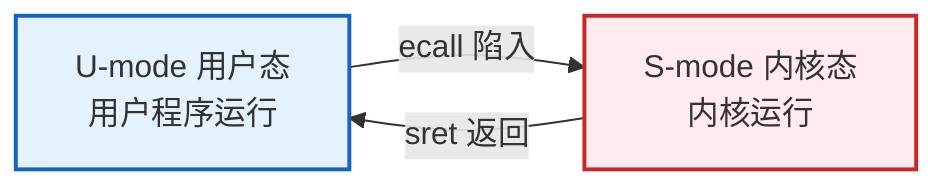
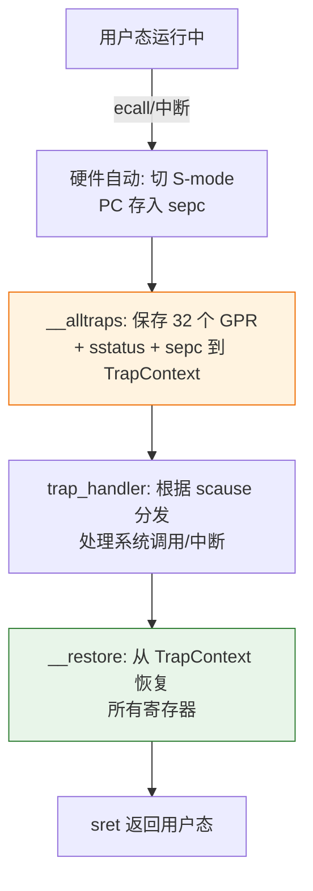

# 实验 2：中断处理与多任务

> 对应 feature：`lab2`（依赖 `lab1`）。

Lab1 让内核在裸机上活了下来；接下来，我们要让它从「只会说 Hello」变成「能干活」。Lab2 对应《操作系统导论》里的 **CPU 虚拟化**：让用户程序跑在用户态，通过**系统调用**请求内核服务，并在多个程序之间切换。

## 零、开始之前

1. **已完成 Lab1**：理解了裸机启动、SBI 调用、`#![no_std]` 等基础（见 [lab1-bare-metal.md](lab1-bare-metal.md)）。
2. **激活环境（可选）**：如果你使用了新的终端，请在仓库根目录执行 `. .\scripts\activate-os-env.ps1` 。
3. **进入工作目录**： `cd os-lab`
4. **自检**：`rustc --version` 与 `qemu-system-riscv64 --version` 能输出版本。

## 一、问题场景

Lab1 结束时，你已经有了一个能开机关机，能打印 `Hello, OS!`的内核。但现在它有个尴尬的局限：**它只会自言自语**。所有输出都是内核自己写死的，不能运行「用户程序」，更不能同时管几个程序。

《操作系统导论》讲 **CPU 虚拟化** 时，核心矛盾其实很具体：只有一颗（或很少几颗）CPU，却要让多个程序都能跑起来；与此同时，程序又**不能直接操作硬件**（比如屏幕、磁盘），否则一个捣乱的程序就能搞垮整台机器。教材中提到的解决方法是——让程序在 CPU 上直接执行（这样快），但把它们放在**低特权**里，需要硬件服务时必须「请客服」。落到我们刚搭好的内核上，就是三个绕不开的问题：

- **程序该怎么和内核说话？**  
用户程序跑在低特权（U-mode）时，**没有权限直接写屏幕**，而是需要通过**请求内核代劳**。教材把这种「请客服」的接口叫作**系统调用**。可请求具体是个什么动作？内核又怎么知道它是来求助的，而不是触发了错误？
- **切换的一瞬间，数据怎么办？**  
从用户态切到内核态时，用户程序寄存器里还装着中间结果。若不保存，返回后程序就崩溃。保存到哪里？用什么节奏保存？
- **多个程序怎么轮流用 CPU？**  
教材说操作系统制造「好多程序同时在跑」的幻觉，实际是**分时/轮转**。切换具体意味着什么？每个程序的状态记在哪？

这三个问题——**怎么陷入、怎么保存、怎么调度**——就是本实验要走通的路：让内核加载并运行 3 个用户程序（`hello` / `power` / `yield`），通过系统调用与它们交互。

> 一句话记住本实验：先打通「用户态 ↔ 内核态」这条路，后面的虚存、进程、文件才有地方挂系统调用。


## 二、背景知识

希望你在本节能抓住一条主线串联起所有知识：

```text
用户程序在 U-mode 跑
    → 需要服务时执行 ecall（系统调用）
    → 硬件 trap 进 S-mode 内核
    → 保存现场 → 内核处理 → 恢复现场
    → sret 回到用户程序
（多个程序时，再在「处理」这一步插入调度）
```


### 2.1 特权级与 trap

Lab1 里内核几乎一直待在 **S-mode**，自己打印、自己关机。Lab2 要开始跑**用户程序**，于是正式启用教材中的 **用户态 / 内核态** 分工。

回忆一下 Lab1 的三档特权级：M-mode（固件）、S-mode（内核）、U-mode（用户程序）。本实验最常来回切换的是后两档：




- **U-mode（用户态）**：用户程序运行的模式。权限低——不能直接写屏幕、不能随便碰内核内存。这就是教材说的「不能为所欲为」。
- **S-mode（监督态 / 内核态）**：操作系统内核运行的模式。权限更高，可以代表用户去完成「碰硬件」这类事。
- **trap（陷入）**：CPU 从低特权转到高特权的过程。可以把它想成：用户程序正在跑，突然「按门铃」把控制权交给内核。

《操作系统导论》把这类设计概括成 **受限的直接执行（Limited Direct Execution）**：

1. 程序尽量在 CPU 上**直接跑**（快）；
2. 但特权受限，一旦要做敏感事，或出了错、来了中断，就必须 **trap 回操作系统**。

trap 常见有三类来源：


| 类型       | 谁主动？     | 例子                  | 本实验里你会碰到                               |
| -------- | -------- | ------------------- | -------------------------------------- |
| **系统调用** | 用户程序主动   | 执行 `ecall` 请求写屏幕、退出 | `sys_write` / `sys_exit` / `sys_yield` |
| **异常**   | 程序出错被动触发 | 非法指令、以后 lab3 的页错误   | 做错了会进 trap 处理                          |
| **中断**   | 外部事件     | 时钟滴答、设备就绪           | lab2 以理解机制为主，完整抢占留待扩展                  |


硬件 trap 进来之后，内核还要回答：「到底发生了什么？」靠的是一批 **CSR（控制和状态寄存器）**。本实验里先记住三个名字：


| CSR       | 作用（直觉）                              |
| --------- | ----------------------------------- |
| `sepc`    | 「返回用户态后从哪条指令继续？」——通常记下 trap 发生时的 PC |
| `scause`  | 「为什么陷入？」——系统调用？异常？中断？               |
| `sstatus` | 「当时的特权/中断等状态长什么样？」——返回时要恢复          |


内核读 `scause` 做分发：若是系统调用，就去看调用号；若是别的原因，就走对应处理或报错。

> 和 Lab1 对照：Lab1 里内核用 `ecall` 找 **OpenSBI（M-mode）** 帮忙；Lab2 里用户程序用 `ecall` 找 **内核（S-mode）** 帮忙。指令名字一样，服务对象差一层。


### 2.2 上下文保存与恢复

> 先停一下想：用户程序发出 `ecall` 的一瞬间，通用寄存器里可能装着循环变量、返回地址、刚算到一半的结果。内核处理完要返回时，这些值必须原封不动还回去。你会存到哪？存多少个？

trap 发生时，CPU 已经切到内核态，但**用户程序的「现场」不能丢**。这里的「现场」就是教材常说的**上下文（context）**：至少包括

- 32 个通用寄存器（x0–x31，其中 `sp`、`a0`–`a7`、`ra` 等特别重要）；
- 关键 CSR：`sepc`、`sstatus` 等。

本实验把它们打包进一个结构体，名叫 **TrapContext**。可以把它想成：「这张用户程序的快照，等会儿原样贴回去」。




有两点特别需要注意：

1. **保存和恢复的顺序必须严格对应**
  保存时第 N 个槽位放的是某个寄存器，恢复时也必须从第 N 个槽位取回同一个寄存器。顺序错了，用户程序会「醒来后世界乱了」——轻则算错，重则崩溃。
2. **这一步必须用汇编（**`trap.asm`**）开头**
  刚 trap 进来时，你还不能像平时那样随便调用 Rust 函数：函数调用本身会改 `ra`、用栈、搅乱寄存器，反而破坏你正要保存的现场。所以惯例是：汇编先把现场安全存好，再跳进 Rust 的 `trap_handler` 做「讲道理」的分发。

再强调一个和系统调用相关的细节：`ecall` 触发 trap 后，`sepc` 往往指向 `ecall` **自己**。若返回时不把 `sepc` 挪到下一条指令，用户程序会再次执行同一个 `ecall`，死循环。本实验里对应的是处理系统调用前调用 `advance_sepc()`——后面阅读理解会再问你一次。

### 2.3 两个栈的切换：`sscratch` 的妙用

> 再想一个更难的：要「把寄存器保存到栈上」，可 trap 瞬间 `sp` 指向的是**用户栈**。内核不该（也不安全）把内核数据写进用户栈。怎样在几乎不破坏其他寄存器的前提下，换到内核自己的栈？

这里先建立两个概念：


| 栈       | 谁在用         | 放什么                  |
| ------- | ----------- | -------------------- |
| **用户栈** | 用户程序        | 用户函数的局部变量、返回地址等      |
| **内核栈** | 内核处理 trap 时 | TrapContext、内核函数调用帧等 |


如果 trap 后仍用用户栈：

- 可能破坏用户数据；
- 用户栈可能根本不够大或状态不可信；
- 后面有了虚存（Lab3）后，权限隔离会更严格——更不能混用。

RISC-V 为此准备了一个「便签」CSR：`sscratch`。本实验的约定是：平时让 `sscratch` 里躺着**内核栈顶指针**。

trap 入口的第一条指令往往是：

```text
csrrw sp, sscratch, sp
```

读作：把 `sp` 和 `sscratch` **交换**。于是一瞬间完成两件事：

1. 原来的用户栈指针被存进 `sscratch`（先保管好，返回时还要用）；
2. `sp` 变成内核栈指针，后面可以安全地 `sd` 保存寄存器。

这是整个 trap 路径里最值得反复体会的一步：「还没来得及用别的寄存器当临时变量，就已经换好了栈」。

### 2.4 系统调用的约定

> 先想：内核怎么知道这次是「写屏幕」还是「退出」？要写的内容、长度又放在哪？

光有 `ecall` 还不够——那只表示「我有事找内核」。内核还需要一套双方都遵守的**约定（calling convention / ABI）**，否则各说各话。教材里系统调用通常包含：

1. **系统调用号**：我要哪种服务；
2. **参数**：服务需要的数据；
3. **返回值**：成功/失败或写出了多少字节等。

本实验遵循常见的 **RISC-V Linux ABI**（操作系统课里的「普通话」）：


| 位置        | 含义            |
| --------- | ------------- |
| `a7`（x17） | 系统调用号         |
| `a0`–`a6` | 参数（从左到右）      |
| `a0`      | 返回值（处理完由内核写回） |


本实验用到的系统调用（编号定义在 `os-syscall`）：


| 编号  | 名称          | 用途              | 参数           |
| --- | ----------- | --------------- | ------------ |
| 64  | `sys_write` | 写入（本实验主要用于屏幕输出） | fd, buf, len |
| 93  | `sys_exit`  | 退出当前用户程序        | exit_code    |
| 124 | `sys_yield` | 主动让出 CPU，请调度器换人 | 无            |


以「用户程序打印一行字」为例，把链路走一遍：

1. 用户库把 `fd`、缓冲区指针、长度放进 `a0`/`a1`/`a2`，把 `64` 放进 `a7`；
2. 执行 `ecall` → 硬件 trap 进内核，现场被存进 TrapContext；
3. `trap_handler` 看 `scause` 确认是系统调用，再读出 `a7==64`；
4. 内核按参数完成输出（本实验仍可能经由 SBI 真正写到终端）；
5. 把返回值写进 TrapContext 里的 `a0`，`advance_sepc()` 后恢复现场，`sret` 回用户态。

> 和 Lab1 对照：Lab1 的 SBI 也是「`a7` 放功能号 + `ecall`」。Lab2 只是把「客服」从固件换成了你的内核——这正是教材系统调用在本实验中的落地形态。


### 2.5 任务调度：批处理与轮转

> 先想：现在假设系统调用已经能用了。若一次只跑完一个程序再跑下一个，那「多任务」体现在哪？若要轮流跑，每个程序要记住什么？

《操作系统导论》讲 CPU 虚拟化时，除了「陷入」，还有另一半：**调度（scheduling）**——决定下一个该轮到谁用 CPU。多个程序看起来「同时运行」，其实是快速轮流；这就是分时带来的幻觉。

本实验用很简单的 **批处理 / 轮转** 思想：


为了能切换，内核给每个用户程序准备一份档案，叫 **TaskControlBlock（TCB，任务控制块）**。初学可以把它理解成「这个程序的身份证 + 快照」，至少包括：

- **状态**：如 `Ready`（就绪，等待 CPU）、`Running`（正在跑）、`Exited`（已结束）。本实验**没有**完整的 `Suspended` 睡眠态模型；
- **TrapContext**：被切换走时的寄存器快照，下次回来要靠它恢复；
- **用户栈 / 内核栈**：两套栈的空间与指针相关信息；
- 预留给 Lab3+ 的字段（如与地址空间相关的 token）——现在可以先知道「以后会用到」。

什么时候换人？

- `sys_exit`：当前程序宣告结束 → 标为 `Exited`，调度下一个 `Ready`；
- `sys_yield`：当前程序主动说「我先让一让」→ 回到 `Ready`，选别人跑。

全部任务都 `Exited` 后，内核关机。

> ⚠️ **已知限制（读输出时别慌）**：当前实现偏批处理简化——`yield` 在某些情况下可能只明显切换一轮。这不影响你理解 trap / 系统调用主路径。看到 `Yield round` 只出现一次时不要以为自己错了；Lab3 打开分页后，yield 往往会更稳定地多轮输出。真正的时钟中断抢占式调度，是更后面的扩展方向。


## 三、实验任务

> **本实验怎么学**：trap 是后续所有实验的地基。代码已准备好可运行版本，但**不要急着通读**。建议：先猜「如果是我怎么设计」，再对照实现，最后用【任务三】验证。

lab2 涉及的代码分布如下（路径相对 `os-lab/`）：


| 文件                           | 角色             | 先想「如果是我会怎么设计」       |
| ---------------------------- | -------------- | ------------------- |
| `os-context/src/lib.rs`      | TrapContext 定义 | 要保存用户态的哪些东西？        |
| `os-context/src/trap.asm`    | 保存 / 恢复汇编      | 入口第一条指令该干什么？        |
| `os-syscall/src/lib.rs`      | syscall 编号     | 怎么认出 write 还是 exit？ |
| `kernel/src/trap.rs`         | trap 分发        | 怎么区分系统调用和异常？        |
| `kernel/src/task.rs`         | 任务管理           | 一个任务要记录什么？          |
| `kernel/src/loader.rs`       | 用户程序加载         | 程序字节从哪来、入口怎么定？      |
| `user/src/lib.rs`、`bin/*.rs` | 用户程序           | 用户态怎么发起一次系统调用？      |


> 完整代码解读与【任务二】参考答案见 `labs/answers/lab2-answers.md`，**建议先独立完成任务二再对照答案**。


### 任务一：跑通 lab2

```powershell
cargo run -p kernel --features lab2
```

**预期输出**（前面约 40 行 OpenSBI 日志可忽略）：

```text
Hello from user app!                    ← hello 程序通过 sys_write 输出
App 0 exited with code 0                ← hello 调用 sys_exit
Power test start
2^1000000002 % 998244353 = 409684505    ← power 程序的快速幂结果
Power check ok
App 1 exited with code 0
Yield test start
Yield round                             ← yield 程序（可能只输出 1 轮，见已知限制）
All user apps exited.                   ← 全部退出，关机
```

**通过标准**：看到 `Hello from user app!`、`409684505`、`All user apps exited.`，且 QEMU 正常退出。

### 任务二：阅读理解与思考题（必做）

带着下面的问题去读代码。每道题建议**先合上代码想答案，再打开对照**；**参考答案见** `labs/answers/lab2-answers.md`。

1. 在 `trap.asm` 的 `__alltraps` 里，`csrrw sp, sscratch, sp` 为什么必须在最前面？（提示：对照 2.3 双栈切换。）
2. `TrapContext` 要保存哪些东西才能让用户程序「原样恢复」？漏保存 `sepc` 会怎样？
3. 处理 `sys_write` 返回用户态时，PC 应指向哪里？为什么要先 `cx.advance_sepc()`？
4. 用户态 `sys_write` 的参数怎么传到内核？按 2.4 的 ABI 约定，把 `a7`/`a0`/`a1`/`a2` 到内核 `sys_write` 的完整链路走一遍。
5. 一个任务（TCB）要记录哪些状态？用户栈和内核栈为什么要分开？

> 能讲清「用户程序发起 sys_write → 寄存器约定 → trap 保存 → 内核处理 → 返回」整条链路，lab2 就过关了。


### 任务三：动手小修改

每项改完 `cargo run --features lab2` 验证，通过后改回原样。

**修改 1：让 hello 多说一句**

在 `user/src/bin/hello.rs` 的 `exit(0)` 前加：

```rust
println("Hello again from user!");
```

- 通过标准：看到两行 Hello。

**修改 2：观察 sscratch 的作用（理解性实验）**

在 `os-context/src/trap.asm` 的 `__alltraps` 开头，临时注释掉 `csrrw sp, sscratch, sp`，再跑。

- 预期：崩溃或卡死。做完**务必改回**。

**修改 3：增加一个新系统调用（进阶）**

仿照 `SYS_YIELD`，在 `trap_handler` 为自定义号（如 999）打印 `Custom syscall received!` 并返回 0；在 `user/src/bin/` 写小程序调用它。

- 通过标准：内核打印出对应信息。


## 四、验证

本实验以【任务一】的 `cargo run -p kernel --features lab2` 能输出 `Hello from user app!`、`409684505`、`All user apps exited.` 并正常退出为主要验证标准。其余任务的验证标准见各任务说明。

## 五、AI 提问模板

1. **概念澄清型**：「《操作系统导论》里的受限直接执行，和 RISC-V 的 `ecall` / `sret` 怎么对应？`sstatus`、`sepc`、`scause` 分别在什么时候被设置？」
2. **现象解释型**：「lab2 用户程序输出乱码但没 panic，可能和 TrapContext 保存/恢复顺序有关吗？」
3. **代码追因型**：「`__alltraps` 里 `.rept 29` 保存 x2–x30，为什么不是 32 个？x0 和哪两个寄存器被特殊处理了？」
4. **对比深化型**：「`sys_write` 里内核从用户 `buf` 指针读数据为什么不安全？lab3 有了虚存后会怎么改进？」
5. **动手探索型**：「想做真正的抢占式调度，需要设置哪些 CSR？主动 `yield` 和被动抢占有什么区别？」