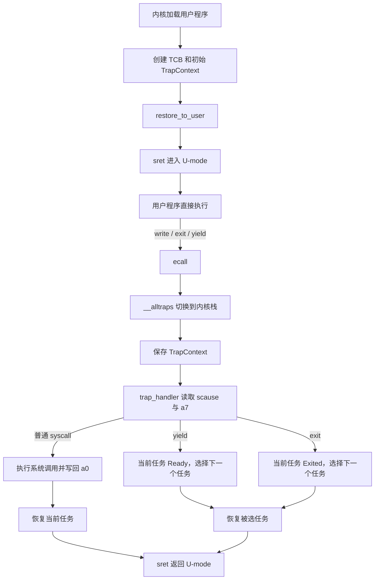

# 实验 2：中断处理与多任务

> 相关教材理论：
>
>  [第 6 章 · 机制：受限直接执行（P49）](/downloads/ostep-zh.pdf#page=49)
>
>  [第 7 章 · 调度导论（P60）](/downloads/ostep-zh.pdf#page=60)

## 零、开始之前

在开始完成中断处理与多任务之前，请确认已完成以下准备：

1. **已完成 Lab1**：理解了裸机启动、SBI 调用、`#![no_std]` 等基础（见 [Lab1 裸机启动](/labs/lab1-bare-metal)）。
2. **进入工作目录**：在本仓库根目录下，进入自研实验环境目录：
  ```powershell
   cd os-lab
  ```
3. **（可选）激活当前终端环境**：如果你新开了一个终端，请在仓库**根目录**（不是 os-lab 目录）执行以下命令，让本会话能找到 Rust 和 QEMU：
  ```powershell
   . .\scripts\activate-os-env.ps1
   cd os-lab
  ```
4. **快速自检**：以下两条命令都能输出版本号，说明环境就绪：
  ```powershell
   rustc --version          # 预期：rustc 1.96.0 ...
   qemu-system-riscv64 --version   # 预期：QEMU emulator version 11.0.50 ...
  ```

> 如果上面任何一步报"找不到命令"，回到 [环境搭建指南](/setup/environment) 检查安装。

1. **建议先读书**：OSTEP 第 6 章（受限的直接执行）+ 第 7 章（调度导论）。Lab2 是 CPU 虚拟化的起点；对应 feature 为 `lab2`（依赖 `lab1`）。


## 一、问题场景

Lab1 建立了一条完整的启动链路：QEMU 加载内核映像到 `0x80200000`，OpenSBI 完成固件初始化后跳转到内核入口 `_start`，内核随后通过 SBI 调用输出 `Hello, OS!` 并正常关机。至此，我们拥有了一个能在 RISC-V 裸机上独立执行的程序——但它还不能被称为**操作系统内核**，因为它缺少三个关键能力。

**第一，隔离与保护。** Lab1 的内核全程运行在 S-mode（监督模式），但未来的用户程序不应直接拥有 S-mode 的全部权限。如果一个用户程序可以随意修改内核内存或直接访问外设，那么整个系统的安全边界就形同虚设。操作系统必须将用户程序约束在 U-mode（用户模式）中，使特权操作必须经过内核的审查与代理。

**第二，受控的服务接口。** 用户程序不能直接操作硬件，但它仍然需要输出字符、申请内存、读写文件。内核必须提供一组**系统调用**，让用户程序通过受控的入口请求内核服务。这正是 OSTEP 第 6 章所述受限直接执行的核心机制：程序在用户态直接执行以保持性能，但当它需要特权服务时，通过 `ecall` 指令陷入内核，由内核代为完成，完成后通过 `sret` 返回用户态继续执行。

**第三，CPU 的虚拟化与复用。** 如果内核只服务一个用户程序，那么"操作系统"不过是比 Lab1 多绕了一层路的引导程序。操作系统之所以为操作系统，在于它能够在多个程序之间**切换 CPU**，制造出"多个程序同时运行"的假象。这便是 OSTEP 第 7 章调度机制的起点，也是**CPU 虚拟化**的内涵：每个程序都"觉得"自己独占一颗 CPU，而内核在幕后将物理 CPU 分时复用在多个程序之间。

针对这三个关键能力，本实验将讨论：引入 U-mode 与 S-mode 的权限隔离、`ecall`/`sret` 陷入与返回路径、系统调用分发（`sys_write` / `sys_exit` / `sys_yield`）、TrapContext 上下文保存与恢复，以及 Ready → Running → Exited 多任务状态轮转等内容。

本实验需要解决的**四个核心问题**为：

- 用户程序如何在 U-mode 运行，并通过 `ecall` 请求内核服务？
- trap 发生时如何保存并恢复用户程序的上下文？
- 内核如何按 RISC-V ABI 分发 系统调用？
- 多个任务之间如何通过 Ready / Running / Exited 状态轮转？

**实验目标**：加载并运行 `hello` / `power` / `yield`，走通系统调用与任务切换。后续虚存、进程、文件系统都建立在这条 trap 路径上。

## 二、背景知识

### 2.1 从 SBI 调用到系统调用

Lab1 和 Lab2 都使用 `ecall`，但调用者和服务提供者不同：

| 项目     | Lab1                   | Lab2                       |
| -------- | ---------------------- | -------------------------- |
| 调用者   | S-mode 内核            | U-mode 用户程序            |
| 服务者   | M-mode OpenSBI         | S-mode 操作系统内核        |
| 服务内容 | 控制台输出、虚拟机关机 | `write`、`exit`、`yield`   |
| 返回指令 | 由 OpenSBI 返回内核    | 内核执行 `sret` 返回用户态 |

`ecall` 本身只表示“请求环境服务”，并不包含具体的服务含义。具体请求由寄存器中的功能号和参数决定。

这体现了 OSTEP 第 6 章“受限的直接执行”思想：

```
用户程序直接使用 CPU 执行普通指令
→ 遇到需要特权的操作
→ 通过 ecall 进入内核
→ 内核完成受控服务
→ 通过 sret 返回用户程序
```

需要注意，trap 并不严格等于“从低特权级切换到高特权级”。更准确地说，trap 是由系统调用、异常或中断引起的控制转移。在本实验中：

- 用户态 `ecall`：U-mode → S-mode；
- Lab1 中的 SBI `ecall`：S-mode → M-mode；
- 时钟中断：通常由硬件中断进入 S-mode trap handler。

|          类型           |         触发方式         |               本实验示例               |         后续实验          |
| :---------------------: | :----------------------: | :------------------------------------: | :-----------------------: |
| **系统调用**（syscall） | 用户程序主动执行 `ecall` | `sys_write` / `sys_exit` / `sys_yield` |   Lab6 进程相关 syscall   |
|  **异常**（exception）  |       指令执行出错       |                   —                    | Lab3 页错误（page fault） |
|  **中断**（interrupt）  |  外部设备（时钟、外设）  |            本实验以理解为主            |    Lab3+ 时钟中断抢占     |

RISC-V 通过以下特权级组织不同的软件组件：

| 模式   | 本实验中的角色 | 主要职责                          |
| ------ | -------------- | --------------------------------- |
| U-mode | 用户程序       | 执行受限制的应用代码              |
| S-mode | 操作系统内核   | 处理 trap、分发系统调用、管理任务 |
| M-mode | OpenSBI        | 提供更底层的固件服务              |

**trap 发生后，硬件自动记录三个关键信息到 CSR**（控制与状态寄存器）：

| CSR       | 全称                    | trap 时硬件写入的内容                        | 返回时软件必须处理的方式                   |
| --------- | ----------------------- | -------------------------------------------- | ------------------------------------------ |
| `sepc`    | Supervisor Exception PC | trap 发生时的 PC（指向 `ecall` 指令本身）    | 返回前 `sepc += 4`，否则反复陷入同一条指令 |
| `scause`  | Supervisor Cause        | trap 原因编码（syscall / 异常类型 / 中断号） | 内核据此分发到对应处理函数                 |
| `sstatus` | Supervisor Status       | trap 前的特权级与中断使能状态                | `sret` 时硬件从 `sstatus` 恢复特权级       |

`sret` （Supervisor Return）是 RISC-V 的监督模式返回指令，与 `ecall` 正好构成一对进出内核的边界。内核处理完 trap 后执行 `sret`，硬件自动完成两件事：

​	(1) 将特权级恢复为 trap 发生前的级别（从 S-mode 降回 U-mode）；

​	(2) 将 PC 设置为 `sepc` 的值。`ecall` 和 `sret` 构成一对进出内核的"门"——所有用户程序与内核的交互都必须通过这对门。

U-mode 可以阻止用户程序执行特权指令、直接读写 S-mode CSR 或执行 `sret` 等特权操作。但是，本实验尚未启用页表，`satp=0`，用户程序和内核仍使用同一物理地址空间。因此，本实验主要演示的是**特权指令和服务入口的隔离**，还不是完整的用户地址空间隔离。真正的内核空间与用户空间隔离将在 Lab3 的虚拟内存机制中建立。

### 2.2 用户程序如何首次进入 U-mode

用户程序不是从 QEMU 或 OpenSBI 直接开始执行的，而是由内核完成加载和初始化。

在 `kernel/src/main.rs` 中，内核启动后依次完成：

```
trap::init();
loader::load_apps();
task::init();
task::run_first_task();
```

其中：

- `trap::init()` 将 `stvec` 设置为 `__alltraps`，指定 S-mode trap 入口；
- `loader::load_apps()` 将用户程序复制到约定的应用区域；
- `task::init()` 为每个用户程序创建一个 `TaskControlBlock`；
- `task::run_first_task()` 选择第一个 Ready 任务并进入用户态。

每个任务的 TCB（Task Control Block, 任务控制块），是内核为每个任务维护的一份管理记录。至少保存：

```
任务状态
TrapContext
用户栈
内核栈
```

`TrapContext::init_user` 为首次进入用户态构造一个“初始现场”：

- `sepc` 设置为用户程序入口地址；
- `x[2]` 设置为用户栈指针；
- `kernel_sp` 保存该任务的内核栈顶；
- `sstatus.SPP` 清零，使 `sret` 返回到 U-mode；
- `sstatus.SPIE` 设置，使返回用户态后能够接收后续中断。

随后，`run_user_task` 调用 `restore_to_user`：

```
读取 TrapContext
→ 写入 sepc、sstatus 和通用寄存器
→ 设置 sscratch 为内核栈顶
→ 执行 sret
→ 从用户程序入口开始执行
```

这里的第一次 `sret` 并不是“处理一次已经发生的 trap”，而是复用了 trap 恢复路径，将预先构造好的上下文转换为一次用户态启动。因此，用户程序的首次执行过程可以表示为：

```
内核加载用户程序
→ 创建 TCB
→ 构造初始 TrapContext
→ restore_to_user
→ sret
→ 用户程序在 U-mode 开始执行
```

### 2.3 trap 如何保存和恢复用户上下文

用户程序执行 `ecall` 后，处理器会自动完成一部分工作：

1. 将当前 PC 写入 `sepc`；
2. 将 trap 原因写入 `scause`；
3. 在 `sstatus` 中记录陷入前的特权级和中断状态；
4. 根据 `stvec` 跳转到 S-mode trap 入口。

硬件只保存了少量 CSR，不能保存用户程序的全部通用寄存器。由于 trap handler 是普通的 Rust 函数，会使用 `a0`、`a1`、`a7`、`t0`、`ra` 和 `sp` 等寄存器，因此必须先由汇编代码保存完整的用户现场。

本实验的 trap 处理链为：

```
U-mode 执行
→ ecall / 异常 / 中断
→ __alltraps
→ 切换到内核栈
→ 保存通用寄存器和关键 CSR
→ trap_handler
→ 恢复某个任务的 TrapContext
→ sret
→ 回到 U-mode
```

**用户栈与内核栈**

trap 发生时，`sp` 仍然指向用户栈。内核不能直接把 TrapContext 保存到用户栈，因为用户栈：

- 由用户程序控制，内容不可信；
- 可能剩余空间不足；
- 在后续启用虚拟内存后，可能不具备 S-mode 所需的访问权限。

因此，trap 入口首先使用 `sscratch` 完成栈切换：

```
csrrw sp, sscratch, sp
```

在用户态运行时：

```
sp        = 用户栈顶
sscratch  = 内核栈顶
```

执行交换后：

```
sp        = 内核栈顶
sscratch  = 用户栈指针
```

这样，内核就可以在自己的栈上安全地分配 TrapContext。

**TrapContext 保存内容**

本实验的 TrapContext 包含：

```
x0–x31 的寄存器槽位
sstatus
sepc
kernel_sp
```

其中 `x0` 的值恒为零，实际不需要恢复；`x2`（用户栈指针）在 `csrrw` 后暂时保存在 `sscratch`，再由汇编代码写入 TrapContext。

保存和恢复的顺序必须严格一致：

```
__alltraps 保存
→ trap_handler 读取和修改
→ __restore 按相同槽位恢复
→ csrrw 换回用户栈
→ sret
```

对于用户态 `ecall`，`sepc` 指向 `ecall` 指令本身。因此，内核在返回前必须执行：

```
cx.advance_sepc();
```

否则 `sret` 会再次回到同一条 `ecall`，用户程序将无限次陷入内核。

需要区分：

- 对用户态系统调用，需要将 `sepc` 加 4；
- 对时钟中断，通常应保留被中断指令的 `sepc`，以便恢复后继续执行。

### 2.4 内核如何按 ABI 分发系统调用

`ecall` 只提供进入内核的入口，具体调用哪个服务由 RISC-V ABI 约定：

| 寄存器    | 用途           |
| --------- | -------------- |
| `a7`      | 系统调用号     |
| `a0`–`a6` | 系统调用参数   |
| `a0`      | 系统调用返回值 |

Lab2 使用的主要系统调用为：

| 编号 | 名称        | 作用             |
| ---- | ----------- | ---------------- |
| 64   | `sys_write` | 输出字符         |
| 93   | `sys_exit`  | 结束当前用户程序 |
| 124  | `sys_yield` | 主动让出 CPU     |

以 `write` 为例，用户态代码执行：

```
a7 = 64
a0 = fd
a1 = buffer 地址
a2 = buffer 长度
ecall
```

trap 入口保存寄存器后，`trap_handler` 执行：

```
读取 scause
→ 确认是用户态 ecall
→ 读取 TrapContext 中的 a7
→ 根据系统调用号选择 sys_write
→ 读取 a0、a1、a2 作为参数
→ 将返回值写回 a0
→ sret 返回用户程序
```

Lab2 的用户态输出路径与 Lab1 不同：

```
用户 println!
→ user_lib::write
→ 用户态 ecall
→ S-mode trap_handler
→ sys_write
→ 内核 print!
→ kernel/src/console.rs
→ os_sbi::console_putchar
→ OpenSBI
→ QEMU 控制台
```

这里借用了 RISC-V Linux 的寄存器和系统调用编号约定，但本实验只实现了教学所需的少量调用，并不等同于完整的 Linux 系统调用语义。

此外，Lab2 的 `sys_write` 直接将用户传入的地址转换为切片。由于此时尚未启用页表，内核还没有进行完整的用户指针验证。这个简化实现将在后续实验中进一步优化。


### 2.5 任务状态与 CPU 调度

OSTEP 第 7 章指出，多程序“同时运行”的效果来自 CPU 的快速复用。内核保存当前任务的执行现场，再恢复另一个任务的现场，就能让多个程序交替获得 CPU。

如前所述，本实验通过 `TaskControlBlock` 管理任务：

```
TaskStatus
TrapContext
用户栈
内核栈
```

任务状态的基本转换为：

```
Ready → Running
Running → Ready      （sys_yield 或时钟中断）
Running → Exited     （sys_exit）
```

其中：

- `Ready`：任务已准备好运行，但当前未占用 CPU；
- `Running`：任务当前正在 CPU 上执行；
- `Exited`：任务已经结束，不再参与调度。

`TrapContext` 与 TCB 的职责不同：

- `TrapContext` 保存某一次陷入时的寄存器和 CSR 快照；
- TCB 保存一个任务长期存在所需的状态、栈和上下文。

可以将两者理解为：

```
TrapContext  解决“当前任务回来时从哪里继续执行”
TCB          解决“系统中有哪些任务以及下一次应该运行谁”
```

本实验主要通过两个系统调用触发任务状态变化：

- `sys_yield`：保存当前上下文，将当前任务置为 Ready，再选择其他 Ready 任务；
- `sys_exit`：将当前任务置为 Exited，并选择下一个可运行任务。

需要说明的是，当前采用的是简化的协作式调度：任务只有主动调用 `sys_yield` 或退出时，内核才会切换任务。`trap.rs` 中的时钟中断分支为后续抢占式调度提供了基础，但不能将当前的实现直接描述为完整的时钟抢占系统。

另外，当前 `find_next_task` 从任务数组的起点开始扫描，属于简化的 Ready 任务搜索，并非严格意义上从“当前任务之后”开始的标准轮转调度。

`user/src/bin/yield.rs` 循环 5 次 `sys_yield`，预期 5 行 `Yield round`。

### 2.6 同一执行链上

trap 并不必然发生任务切换：普通 `sys_write` 处理后恢复当前任务；只有 `yield`、`exit` 或未来的时钟中断才会让调度器选择另一个 Ready 任务。




## 三、实验任务


| 文件                           | 角色                       | 阅读时重点确认                              |
| ---------------------------- | ------------------------ | ------------------------------------ |
| `os-context/src/lib.rs`      | TrapContext 定义           | GPR、CSR 与 `kernel_sp` 的布局            |
| `os-context/src/trap.asm`    | 保存 / 恢复汇编（双栈、`sscratch`） | 保存和恢复槽位是否严格对称                        |
| `os-syscall/src/lib.rs`      | syscall 编号               | 用户态与内核是否共享同一编号约定                     |
| `kernel/src/trap.rs`         | trap 分发                  | `scause`、`a7`、`advance_sepc()` 的先后关系 |
| `kernel/src/task.rs`         | 任务管理与调度                  | Ready / Running / Exited 如何转换        |
| `kernel/src/loader.rs`       | 用户程序加载                   | 程序字节、入口和两套栈从何而来                      |
| `user/src/lib.rs`、`bin/*.rs` | 用户程序与 syscall 封装         | 参数如何进入 `a0`–`a7`                     |


### 任务一：跑通内核（补充实际代码的实验）

确认环境已激活，运行以下命令可输出版本号：

```powershell
rustc --version
qemu-system-riscv64 --version
```

运行实验：

```powershell
cargo run -p kernel --features lab2
```

**预期输出**（前面约 40 行 OpenSBI 日志可忽略）：

```text
Hello from user app!                    ← hello 程序通过 sys_write 输出
App 0 exited with code 0                ← hello 调用 sys_exit
Power test start
2^1000000002 % 998244353 = 409684505    ← power 程序的快速幂结果
Power check ok
App 1 exited with code 0
Yield test start
Yield round
Yield round
Yield round
Yield round
Yield round
App 2 exited with code 0
All user apps exited.                   ← 全部退出，关机
```

**通过标准**：看到 `Hello from user app!`、`409684505`、`All user apps exited.`，且 QEMU 正常退出（终端命令返回，没有卡住或报错）。


### 任务二：阅读理解

1. `__alltraps` 里 `csrrw sp, sscratch, sp` 为什么必须在最前面？对照 2.2 说明此时两个位置各保存哪一个栈指针。
2. `TrapContext` 要保存哪些内容？漏保存 `sepc` 会怎样？漏保存普通 GPR 又会出现哪类“偶发错误”？
3. 处理 `sys_write` 返回用户态时 PC 应指向哪里？为什么必须在恢复前 `advance_sepc()`？
4. 从 `user/src/syscall.rs` 到 `kernel/src/trap.rs`，按 RISC-V ABI 走一遍 `a7`/`a0`/`a1`/`a2` 的传递链。
5. 一个 TCB 要记录哪些状态？用户栈与内核栈为何分开？再说明 TrapContext 与 TCB 各解决什么问题。


### 任务三：动手修改

每项改完 `cargo run -p kernel --features lab2` 验证，通过后改回原样。

**修改 1：让 hello 多说一句**

在 `user/src/bin/hello.rs` 的 `exit(0)` 前加：

```rust
println("Hello again from user!");
```

- 通过标准：看到两行 Hello。

**修改 2：观察 sscratch 的作用（理解性实验）**

在 `os-context/src/trap.asm` 的 `__alltraps` 开头，临时注释掉 `csrrw sp, sscratch, sp`，再跑。

- 预期：崩溃或卡死。做完**务必改回**。

**修改 3：增加一个新系统调用（进阶）**

仿照 `SYS_YIELD`，在 `trap_handler` 为自定义号（如 999）打印 `Custom syscall received!` 并返回 0；在 `user/src/bin/` 写小程序调用它。

- 通过标准：内核打印出对应信息。


## 四、验证命令


| 验证项      | 命令                                                         | 通过标准           |
| -------- | ---------------------------------------------------------- | -------------- |
| 主编译      | `cargo check -p kernel --features lab2`                    | 无 error        |
| QEMU     | `cargo run -p kernel --features lab2 --release`            | 同时满足下列**输出断言** |
| 组件单测（可选） | `cargo test -p os-context --target x86_64-pc-windows-msvc` | 通过             |


**输出断言（与** `lab-packages/lab2/lab.yaml` **对齐；缺一不算通过）**：


| 断言 id               | 必须看到                    |
| ------------------- | ----------------------- |
| `hello-output`      | `Hello from user app!`  |
| `power-result`      | `409684505`             |
| `yield-five-rounds` | `Yield round` 出现不少于 5 次 |
| `all-exited`        | `All user apps exited.` |


> 任意白名单命令「退出码 0」**不等于** Lab 通过；例如 `Yield round` 不足 5 行时，命令仍可能返回 0。
