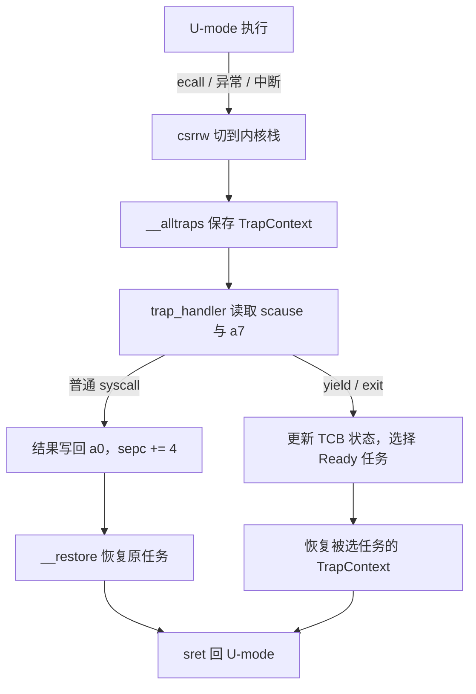

# 实验 2：中断处理与多任务

> 对应 feature：`lab2`（依赖 `lab1`）。

> **配套教材**（《操作系统导论》OSTEP 中译）：[第 6 章 · 受限的直接执行（PDF 第 49 页）](/downloads/ostep-zh.pdf#page=49) · [第 7 章 · 调度导论（PDF 第 60 页）](/downloads/ostep-zh.pdf#page=60) · [全书入口](/downloads/ostep-zh.pdf)

Lab1 让内核在裸机上活了下来；接下来，我们要让它从「只会说 Hello」变成「能干活」。Lab2 对应《操作系统导论》里的 **CPU 虚拟化**：让用户程序跑在用户态，通过**系统调用**请求内核服务，并在多个程序之间切换。

**本实验知识路径（课本 → 项目 → 实践 → 证据 → 迁移）**：

```text
OSTEP Ch.6/7 受限执行与调度
        ↓
RISC-V U/S 特权 + ecall/sret + TCB 轮转（本仓库实现）
        ↓
跑通 hello / power / yield；按需完成 fill 或 debug 变体
        ↓
必须看见：用户输出、409684505、Yield round×5、All user apps exited.
        ↓
可迁移到：抢占式调度、异常处理、虚拟化 VM Exit
```

结构化规格见 `lab-packages/lab2/`（供工作台 / 评分 / 变体发放引用；你仍以本文正文为主阅读）。

> **推荐：打开引导式 LLM 外壳。** 如果你想按“先判断 → 再提问 → 跑验证 → 写复盘”的方式完成本实验，可以先进入 [Lab2 AI 引导学习](/guide/ai-tutor)。导师不会替你交付完整代码，但会把你的提问、验证和复盘记录成可导出的学习 trace，便于最后答辩说明“我是怎么学会的”。

## 零、开始之前

1. **已完成 Lab1**：理解了裸机启动、SBI 调用、`#![no_std]` 等基础（见 [Lab1 裸机启动](/labs/lab1-bare-metal)）。
2. **激活环境（可选）**：如果你使用了新的终端，请在仓库根目录执行 `. .\scripts\activate-os-env.ps1` 。
3. **进入工作目录**： `cd os-lab`
4. **自检**：`rustc --version` 与 `qemu-system-riscv64 --version` 能输出版本。
5. **建议先读书**：OSTEP 第 6 章（受限的直接执行）+ 第 7 章（调度导论）。Lab2 是 CPU 虚拟化的起点。

## 一、问题场景

Lab1 内核只会「自言自语」——输出写死在内核里，不能跑用户程序，也不能在多个程序间切换。

| Lab1 | Lab2 |
| --- | --- |
| 内核一直在 S-mode | 用户程序在 U-mode，通过 syscall 请求服务 |
| 无 trap / 上下文保存 | TrapContext 保存寄存器，`sret` 原样恢复 |
| 单线程内核 | 多任务 Ready/Running/Exited 轮转 |

OSTEP 第 6 章 **Limited Direct Execution**：程序在用户态直接执行（快），特权受限；需要服务时 `ecall` 陷入内核。第 7 章用快速切换 CPU 制造「多程序同时跑」的幻觉。

本实验目标：加载并运行 `hello` / `power` / `yield`，走通系统调用与任务切换。后续虚存、进程、文件系统都建立在这条 trap 路径上。


## 二、背景知识

对应 OSTEP 第 6 章（受限的直接执行）和第 7 章（调度导论）。Lab2 的主线是：**用户程序在 U-mode 运行，通过 `ecall` 陷入 S-mode 内核，内核处理完再 `sret` 返回**；多个程序时在内核里插入调度。

```text
U-mode 运行 → ecall → trap 进 S-mode → 保存现场 → 处理 → 恢复现场 → sret
（多任务时在「处理」后选下一个 Ready 任务）
```

### 2.1 特权级与 trap

Lab1 内核一直在 S-mode；Lab2 起引入 **U-mode** 跑用户程序，与 S-mode 内核形成权限隔离。

| 模式 | 权限 | 本实验 |
| --- | --- | --- |
| **U-mode** | 低，不能直接访问设备/内核内存 | 用户程序 |
| **S-mode** | 高，可代用户访问硬件 | 内核 |

**trap** 指 CPU 从低特权级切到高特权级。OSTEP 第 6 章把 OS 的设计概括为 **Limited Direct Execution（受限的直接执行）**：程序在 CPU 上直接跑（快），但特权受限；需要服务、出错或收到中断时必须 trap 回内核。

| 类型 | 触发 | 本实验示例 |
| --- | --- | --- |
| 系统调用 | 用户主动 `ecall` | `sys_write` / `sys_exit` / `sys_yield` |
| 异常 | 非法指令、页错误等 | Lab3 页错误 |
| 中断 | 时钟、外设 | Lab2 以理解为主 |

trap 后内核读 **CSR** 判断原因。先记三个：

| CSR | 作用 |
| --- | --- |
| `sepc` | trap 时的 PC，返回时从这里继续 |
| `scause` | trap 原因（syscall / 异常 / 中断） |
| `sstatus` | 特权与中断状态，返回时需恢复 |

Lab1 里内核用 `ecall` 找 OpenSBI（M-mode）；Lab2 里用户程序用 `ecall` 找内核（S-mode）。指令相同，陷入的目标不同。

| 层次 | 本小节对应什么 |
| --- | --- |
| **课本** | OSTEP「受限的直接执行」：快，但特权受限 |
| **项目** | U-mode 用户程序 + S-mode 内核；`ecall` 进入 `trap_handler` |
| **实践** | 对照 Lab1 特权模型，说出为何需要 trap |
| **证据** | QEMU 里出现用户程序输出（而不仅是内核写死的 Hello） |
| **迁移** | 系统调用入口、缺页异常、虚拟机 Exit |

### 2.2 上下文保存与恢复

trap 时用户程序的寄存器和 CSR 必须完整保存，否则 `sret` 回去后程序状态错误。本实验用 **TrapContext** 结构体保存 32 个 GPR 以及 `sstatus`、`sepc`、`kernel_sp`。

流程：`__alltraps`（汇编保存）→ `trap_handler`（Rust 分发）→ `__restore` 或 `run_user_task`（恢复）。

`trap.asm` 中的要点：

- `x0` 恒为 0，不保存；`x1` 单独 `sd`。
- `.rept 29` 保存 `x3`–`x31`（`.set n, 3`）。
- 用户 `sp`（`x2`）：`csrrw` 换栈后暂存在 `sscratch`，再 `csrr` 读出写入 `2*8(sp)`。
- `sstatus`、`sepc` 在 `32*8(sp)`、`33*8(sp)`；`kernel_sp` 在 `34*8(sp)`。
- `__restore` 末尾 `csrrw sp, sscratch, sp` 换回用户栈，再 `sret`。

保存/恢复顺序必须严格对应。trap 入口不能用 Rust 函数——调用会破坏正要保存的寄存器，所以先用汇编存现场。

`ecall` 触发 trap 后 `sepc` 指向 `ecall` 本身；返回前须 `advance_sepc()`（`sepc += 4`），否则会反复陷入同一条指令。

| 层次 | 本小节对应什么 |
| --- | --- |
| **课本** | 上下文切换：打断处的状态必须可恢复 |
| **项目** | `TrapContext` + `trap.asm` 的 `__alltraps` / `__restore` |
| **实践** | 任务二 Q1–Q2；任务三临时注释 `csrrw`（务必改回） |
| **证据** | 正常返回后用户程序继续输出；破坏双栈则崩溃/卡死 |
| **迁移** | 线程切换现场、信号 handler 栈帧 |

### 2.3 用户栈与内核栈：`sscratch`

trap 瞬间 `sp` 指向**用户栈**，不能把 TrapContext 写在用户栈上（可能破坏用户数据、空间不足、Lab3 后还有权限问题）。

| 栈 | 用途 |
| --- | --- |
| 用户栈 | 用户函数局部变量、返回地址 |
| 内核栈 | TrapContext、内核函数调用帧 |

`sscratch` 平时保存**内核栈顶**。trap 入口第一条指令：

```text
csrrw sp, sscratch, sp
```

交换 `sp` 与 `sscratch`：用户 `sp` 暂存到 `sscratch`，`sp` 指向内核栈，随后可以安全 `sd` 保存寄存器。返回前再次 `csrrw` 换回用户栈。

### 2.4 系统调用约定

`ecall` 只表示「请求内核服务」；具体服务由**调用约定**决定。本实验遵循 **RISC-V Linux ABI**：

| 寄存器 | 用途 |
| --- | --- |
| `a7` | 系统调用号 |
| `a0`–`a6` | 参数 |
| `a0` | 返回值 |

| 编号 | 名称 | 作用 |
| --- | --- | --- |
| 64 | `sys_write` | 写 fd（本实验用于屏幕） |
| 93 | `sys_exit` | 退出 |
| 124 | `sys_yield` | 让出 CPU |

以 `sys_write` 为例：用户侧把 fd/buf/len 放入 `a0`/`a1`/`a2`、`64` 放入 `a7`，执行 `ecall`；内核 `trap_handler` 读 `scause` 和 `a7`，调 `sys_write`，结果写回 `a0`，`advance_sepc()` 后返回。

| 层次 | 本小节对应什么 |
| --- | --- |
| **课本** | 系统调用是「受限执行」里主动请求 OS 服务的接口 |
| **项目** | `os-syscall` 编号 + `user/syscall.rs` + `trap.rs` 分发 |
| **实践** | 任务二 Q3–Q4；可选任务三自定义 syscall |
| **证据** | `Hello from user app!`、`409684505`、`App N exited with code 0` |
| **迁移** | Linux syscall ABI、能力检查 / seccomp 插入点 |

### 2.5 任务调度

OSTEP 第 7 章：多程序「同时运行」靠**快速切换 CPU** 制造幻觉。本实验用简单的 Ready / Running / Exited 三态和轮转调度。

每个用户程序对应一个 **TaskControlBlock（TCB）**，记录：

- 状态（Ready / Running / Exited）
- `TrapContext`（切换时的寄存器快照）
- 用户栈、内核栈
- Lab3+ 的地址空间 token

- **`sys_exit`**：标 Exited，调度下一个 Ready 任务。
- **`sys_yield`**：标 Ready，让出 CPU。

`user/src/bin/yield.rs` 循环 5 次 `sys_yield`，预期 5 行 `Yield round`。若只有 1 行，检查 `trap.asm` 双栈切换和 `SYS_YIELD` 分发——也要怀疑「让出」是否被误写成「退出」（见下方任务四 debug 变体）。

| 层次 | 本小节对应什么 |
| --- | --- |
| **课本** | 调度制造「多程序同时跑」的幻觉（协作式让出） |
| **项目** | `task.rs` 中 Ready/Running/Exited 与 `find_next_task` |
| **实践** | 数 `Yield round`；fill 补调度 / debug 排错状态机 |
| **证据** | `Yield round` 不少于 5 行 + `All user apps exited.` |
| **迁移** | 时间片抢占、用户态协程调度 |

### 2.6 把 trap 与调度放进同一条时间线

本地版的两张图分别强调“现场保存”和“换下一个任务”，远端复核版补充了精确的寄存器槽位。合在一起看，trap 并不必然发生任务切换：普通 `sys_write` 处理后恢复当前任务；只有 `yield`、`exit` 或未来的时钟中断才会让调度器选择另一个 Ready 任务。



要区分两种“上下文”：**TrapContext** 是一次用户态陷入的寄存器快照；**TCB** 是任务长期存在的档案，除 TrapContext 外还记录状态、栈和后续 Lab 使用的地址空间。保存现场解决“回来时接着算”，调度解决“现在轮到谁算”。


## 三、实验任务

> **本实验怎么学**：先 `cargo run --features lab2` 看输出，再按【二、背景知识】对照 `trap.asm`、`trap.rs`、`task.rs` 读代码。trap 是后续实验的地基，重点是理解 syscall 与上下文切换。

主要文件（路径相对 `os-lab/`）：

| 文件 | 角色 | 阅读时重点确认 |
| --- | --- | --- |
| `os-context/src/lib.rs` | TrapContext 定义 | GPR、CSR 与 `kernel_sp` 的布局 |
| `os-context/src/trap.asm` | 保存 / 恢复汇编（双栈、`sscratch`） | 保存和恢复槽位是否严格对称 |
| `os-syscall/src/lib.rs` | syscall 编号 | 用户态与内核是否共享同一编号约定 |
| `kernel/src/trap.rs` | trap 分发 | `scause`、`a7`、`advance_sepc()` 的先后关系 |
| `kernel/src/task.rs` | 任务管理与调度 | Ready / Running / Exited 如何转换 |
| `kernel/src/loader.rs` | 用户程序加载 | 程序字节、入口和两套栈从何而来 |
| `user/src/lib.rs`、`bin/*.rs` | 用户程序与 syscall 封装 | 参数如何进入 `a0`–`a7` |

> 完整走读见 [lab2 参考答案](/answers/lab2-answers)。


### 任务一：跑通 lab2

```powershell
cargo run -p kernel --features lab2
```

**预期输出**（前面约 40 行 OpenSBI 日志可忽略）：

```text
Hello from user app!                    ← hello 程序通过 sys_write 输出
App 0 exited with code 0                ← hello 调用 sys_exit
Power test start
2^1000000002 % 998244353 = 409684505    ← power 程序的快速幂结果
Power check ok
App 1 exited with code 0
Yield test start
Yield round
Yield round
Yield round
Yield round
Yield round
App 2 exited with code 0
All user apps exited.                   ← 全部退出，关机
```

**通过标准**：看到 `Hello from user app!`、`409684505`、`All user apps exited.`，且 QEMU 正常退出。

### 任务二：阅读理解（必做）

参考答案见 [lab2 参考答案](/answers/lab2-answers)。

1. `__alltraps` 里 `csrrw sp, sscratch, sp` 为什么必须在最前面？对照 2.3 说明此时两个位置各保存哪一个栈指针。
2. `TrapContext` 要保存哪些内容？漏保存 `sepc` 会怎样？漏保存普通 GPR 又会出现哪类“偶发错误”？
3. 处理 `sys_write` 返回用户态时 PC 应指向哪里？为什么必须在恢复前 `advance_sepc()`？
4. 从 `user/src/syscall.rs` 到 `kernel/src/trap.rs`，按 RISC-V ABI 走一遍 `a7`/`a0`/`a1`/`a2` 的传递链。
5. 一个 TCB 要记录哪些状态？用户栈与内核栈为何分开？再说明 TrapContext 与 TCB 各解决什么问题。

### 任务三：动手小修改

每项改完 `cargo run --features lab2` 验证，通过后改回原样。

**修改 1：让 hello 多说一句**

在 `user/src/bin/hello.rs` 的 `exit(0)` 前加：

```rust
println("Hello again from user!");
```

- 通过标准：看到两行 Hello。

**修改 2：观察 sscratch 的作用（理解性实验）**

在 `os-context/src/trap.asm` 的 `__alltraps` 开头，临时注释掉 `csrrw sp, sscratch, sp`，再跑。

- 预期：崩溃或卡死。做完**务必改回**。

**修改 3：增加一个新系统调用（进阶）**

仿照 `SYS_YIELD`，在 `trap_handler` 为自定义号（如 999）打印 `Custom syscall received!` 并返回 0；在 `user/src/bin/` 写小程序调用它。

- 通过标准：内核打印出对应信息。

### 任务四：教师发放的变体（若有）

若老师给你的工作区里，`kernel/src/task.rs` 来自 **fill（补全）** 或 **debug（排错）** 变体，请先确认文件头注释，再按对应目标完成。规格细节也写在 `lab-packages/lab2/variants/`。

#### A. fill：补全调度器

- **学习目标**：实现 `find_next_task`，只从 **Ready** 任务里选出下一个，并更新 `current`；跑通任务一全部输出。
- **常见误区**：选中 Exited；忘记写 `current`；恒返回 `None`；只会从 0 号槽扫描却说不清与轮转扫描的差别。
- **通过断言**（缺一不可）：`Hello from user app!`、`409684505`、`Yield round`×≥5、`All user apps exited.`
- **提示阶梯**（先自己做；卡住再向下看一层）：
  1. 只看函数注释：Ready 才能选；选中后要改 `current`。
  2. 问自己：从 `current+1` 扫和从 `0` 扫，yield 输出顺序会怎样？
  3. 对照 `run_next_task` / `all_exited`：没有 Ready 时应如何收场？
  4. （最后一层）讨论轮转扫描的循环下标写法，仍不要直接要完整粘贴答案。

#### B. debug：yield 只打一轮就关机

- **学习目标**：按「现象 → 假设 → 最小实验 → 证据 → 结论」找到状态机错误并修复；理解 **让出 ≠ 退出**。
- **典型现象**：只有 **1** 行 `Yield round`，随后 `All user apps exited.`；进程退出码仍可能是 0——**所以不能只看退出码判通过**。
- **常见误区**：先怪 `trap.asm` 双栈；只改 `exit` 路径；报告只写「改好了」没有假设链。
- **通过断言**：与 fill / 任务一相同（尤其 `Yield round`×≥5）。
- **提示阶梯**：
  1. 复现并**数清** `Yield round` 行数。
  2. 假设：主动让出的任务为何再也没被调度？Ready 与 Exited 差在哪？
  3. 沿 `SYS_YIELD` → `mark_current_suspended` → `run_next_task` 读，找能证伪假设的一行。
  4. 修复后重跑；把假设与被否证/证实的证据写进报告。

### 提交清单（自查）

- [ ] `cargo run -p kernel --features lab2` 输出 `Hello from user app!`、`409684505`、`All user apps exited.`
- [ ] 若有变体：`Yield round` 不少于 5 行（不要只用退出码判断）
- [ ] 能说明 `ecall` → `__alltraps` → `trap_handler` → `sret` 的顺序
- [ ] 能解释 `sscratch` 双栈切换的作用
- [ ] 完成任务二 5 道阅读理解（对照答案自查）
- [ ] （可选）能用一句话对照「课本概念 / 本项目文件 / 可观察输出」

## 四、验证

| 验证项 | 命令 | 通过标准 |
| --- | --- | --- |
| 主编译 | `cargo check -p kernel --features lab2` | 无 error |
| QEMU（受信 recipe） | `cargo run -p kernel --features lab2 --release` | 同时满足下列**输出断言** |
| 组件单测（可选） | `cargo test -p os-context --target x86_64-pc-windows-msvc` | 通过 |

**输出断言（与 `lab-packages/lab2/lab.yaml` 对齐；缺一不算通过）**：

| 断言 id | 必须看到 |
| --- | --- |
| `hello-output` | `Hello from user app!` |
| `power-result` | `409684505` |
| `yield-five-rounds` | `Yield round` 出现不少于 5 次 |
| `all-exited` | `All user apps exited.` |

> 任意白名单命令「退出码 0」**不等于** Lab 通过。debug 变体未修复时就常出现「早关机但仍可能是 0」。

手册交互清单见 handbook「Lab2 中断与任务」页（`handbook/data/labs.json`）。

## 五、AI 提问模板

做实验时，建议用以下切入点和 AI 交互，引导自己思考而非直接要答案：

1. **概念澄清型**：「《操作系统导论》里的受限直接执行，和 RISC-V 的 `ecall` / `sret` 怎么对应？`sstatus`、`sepc`、`scause` 分别在什么时候被设置？」
2. **现象解释型**：「lab2 用户程序输出乱码但没 panic，可能和 TrapContext 保存/恢复顺序有关吗？」
3. **代码追因型**：「`__alltraps` 里 `.rept 29` 保存的是哪些寄存器？`x2`（用户栈）从哪来？`x0` 为什么不存？」
4. **对比深化型**：「`sys_write` 里内核从用户 `buf` 指针读数据为什么不安全？lab3 有了虚存后会怎么改进？」
5. **动手探索型**：「想做真正的抢占式调度，需要设置哪些 CSR？主动 `yield` 和被动抢占有什么区别？」

## 六、思考题与参考答案

完整答案与代码走读见 [lab2 参考答案](/answers/lab2-answers)。

### 习题 1（双栈切换）

**`__alltraps` 入口为何必须先 `csrrw sp, sscratch, sp`？**

参考答案：trap 瞬间 `sp` 仍指向用户栈，若在用户栈上保存 TrapContext 会破坏用户数据且空间可能不足。`sscratch` 平时存内核栈顶；交换后 `sp` 指向内核栈，用户 `sp` 暂存于 `sscratch`，随后可安全 `sd` 保存全部寄存器。返回前再次 `csrrw` 换回用户栈。
