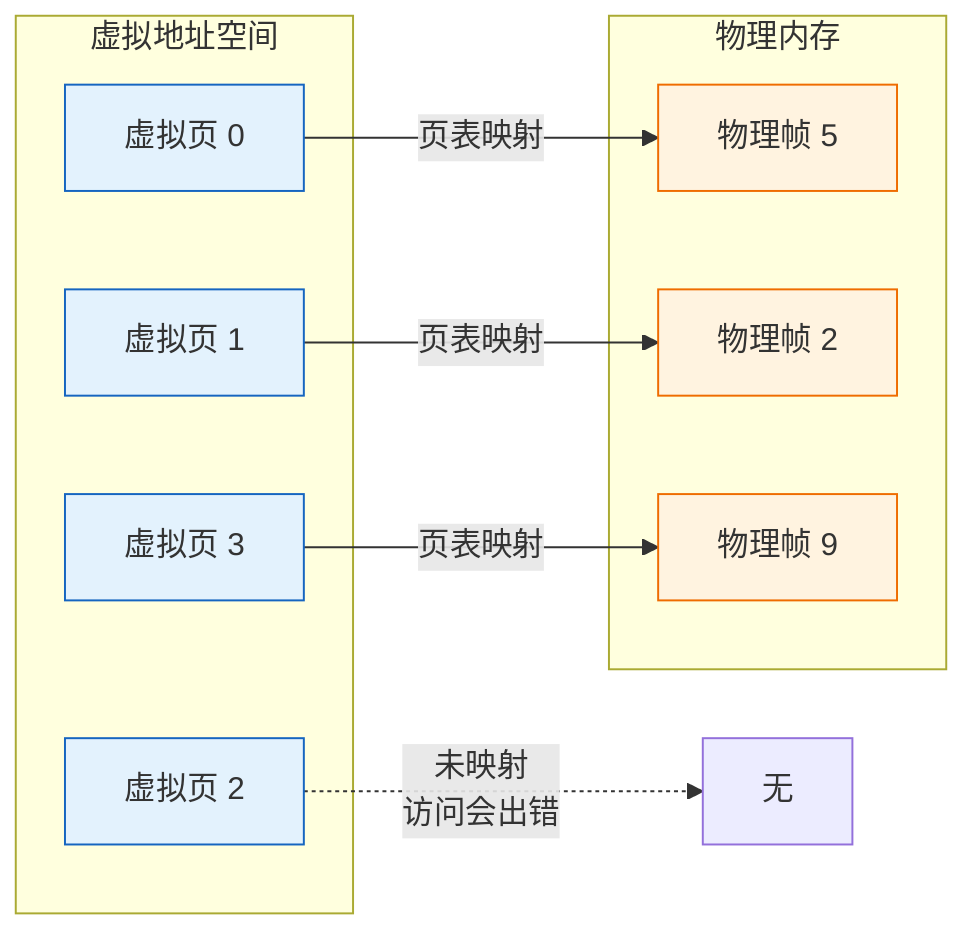
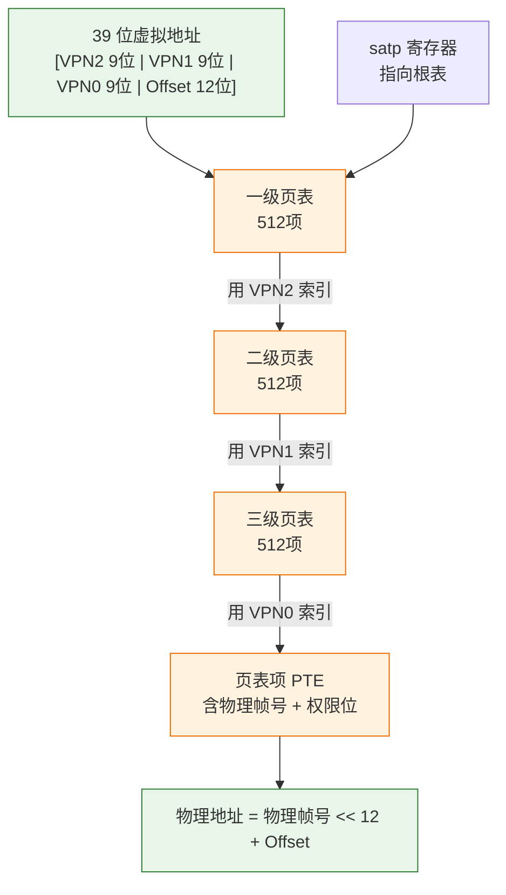
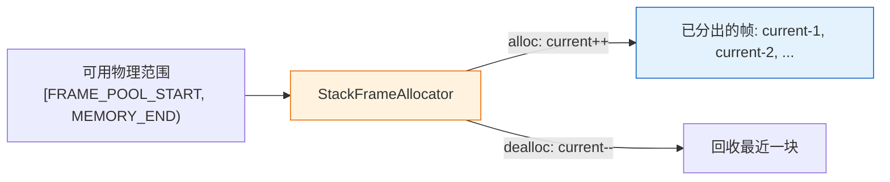
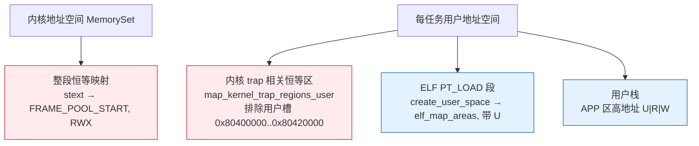

# 实验 3：内存管理与虚存

> 对应 feature：`lab3`（依赖 `lab2`）。这是整个内核学习中**概念最难、但最关键**的一步——让内核拥有"虚拟内存"。学完它，你的内核才能真正隔离不同程序、保护自己不被用户程序的 bug 拖垮。

## 零、开始之前

1. **已完成 Lab2**：理解了 trap、系统调用、上下文切换、任务调度（见 [lab2-trap-and-task.md](lab2-trap-and-task.md)）。
2. **进入工作目录**：`cd os-lab`，必要时先 `. .\scripts\activate-os-env.ps1` 激活环境。
3. **自检**：`rustc --version` 与 `qemu-system-riscv64 --version` 能输出版本。
4. **建议先读书**：虚存是 OSTEP 第 12-17 章的核心内容，动手前先读这几章，你会轻松很多。

## 一、问题场景

到目前为止（lab1/lab2），你的内核和用户程序都"直来直去"地用**物理地址**——代码里写地址 `0x80400000`，CPU 就真的去访问物理内存的 `0x80400000`。这种方式在小实验里能跑，但如果你是真正的操作系统设计者，会立刻撞上三个致命问题：

- **一个程序的 bug 会炸毁整个系统**。用户程序如果手滑写了内核所在的物理地址，内核代码就被覆盖了，整个系统崩溃。你没有任何防护。
- **没法同时运行两个程序**。两个程序都想加载到 `0x80400000`，它们会踩在同一块物理内存上互相覆盖。你只能让它们一个跑完再跑下一个。
- **每个程序的可用内存被物理内存大小死死卡住**。物理内存就那么大，程序再大就没法跑——可现代程序动辄几个 GB，物理内存根本不够分。

如果你来设计，会怎么解决？**虚拟内存（Virtual Memory）** 就是操作系统的答案：给每个程序一套**它自己以为的、独立的、从 0 开始的地址空间**，再由内核在背后偷偷把"虚拟地址"翻译成"物理地址"。这样每个程序都觉得自己独占整个内存，互不干扰；内核也能控制谁能访问什么。

但要做到这件事，你得解决三个子问题：

- **怎么记录"虚拟地址 → 物理地址"的映射关系？** 几十亿个虚拟地址，不可能一个个记，得用一种紧凑的数据结构——这就是**页表**。
- **谁来分配物理内存？** 物理内存要按页（4KB）分给不同的用途，得有个"管理员"记账——这就是**页帧分配器**。
- **怎么让多个程序各有各的地址空间，又共享同一份内核？** 这就是**地址空间（MemorySet）**要解决的问题。

本实验带你走通这条路。学完后你会发现一个有意思的现象：lab3 之前的 `yield` 程序只输出 1 轮就结束了，lab3 之后它居然能规规矩矩输出 5 轮——分页让任务隔离得更干净，调度也跟着受益了。

## 二、背景知识

### 2.1 为什么要分页：地址空间的抽象

> 🤔 **先想**：假设你想给每个程序一套独立的"假"地址，让它们都觉得自己从地址 0 开始。最笨的办法是什么？——给每个程序的每个字节都记一条"虚拟地址 → 物理地址"。但一个程序可能几个 GB，字节级记录根本存不下。你会怎么压缩这个映射？

答案：**按"页"为单位**来管理。把虚拟地址空间和物理地址空间都切成固定大小的块（RISC-V 上是 4KB = 4096 字节），每一块叫一**页**（虚拟页）/ 一**帧**（物理页帧）。映射只记到"页"这一级：虚拟页 N → 物理帧 M。页内偏移量直接对应，不用记。



关键认知：**虚拟地址 = [虚拟页号] + [页内偏移]**。翻译时，页号通过页表查到物理帧号，偏移量原样拼回去，就得到物理地址。偏移量占 12 位（因为 4KB = 2^12）。

### 2.2 Sv39：RISC-V 的三级页表

> 🤔 **先想**：用一张"大表"记录所有虚拟页到物理帧的映射，问题是什么？——64 位地址空间有 2^52 个虚拟页（去掉 12 位偏移），一张表要存 2^52 项，每项 8 字节就是几万 TB，比物理内存还大！你会怎么避免把这张巨表全放进内存？

答案是**多级页表**：把大表拆成树状。RISC-V 的 Sv39 模式用 **3 级**：



- 每级 9 位索引，每级 512 个表项（2^9）。三级共 27 位，加上 12 位偏移 = 39 位虚拟地址。
- **精髓**：只有真正用到的虚拟页，才会分配对应的页表项。没用到的虚拟地址根本不占内存。这正是多级页表省内存的原因。
- 一次访存要查 3 级页表（3 次内存访问）+ 1 次取数据 = 4 次内存访问，太慢？别担心，硬件有 **TLB**（Translation Lookaside Buffer）缓存最近翻译，绝大多数时候一次命中。

### 2.3 页表项 PTE：权限位的世界

> 🤔 **先想**：页表项里除了"物理帧号"，还得记什么？——如果一个页既能被读、又能被写、还能被执行，那一个恶意程序可以读走内核密码、改写内核代码。你会怎么让内核控制"这个页能干什么"？

页表项（PTE）是 64 位的，布局是 `[物理帧号 44 位 | 权限位 10 位]`：

```
63    54 53           10 9  8 7 6 5 4 3 2 1 0
[保留位]  [  物理帧号   ] [U X W R V ...]
                                  |  |  |  |  └ V: 有效位（这页是否映射了）
                                  |  |  |  └── R: 可读
                                  |  |  └──── W: 可写
                                  |  └─────── X: 可执行
                                  └────────── U: 用户态可访问
```

本实验用到的权限（定义在 `os-vm`）：

- `R`/`W`/`X`：读/写/执行。内核可以给代码页只设 `X`（执行不可写），给数据页设 `RW`（读写不可执行），从源头杜绝"数据被当代码执行"的攻击。
- `U`（User）：**这是隔离的关键**。带 `U` 位的页，用户态才能访问；不带的页，用户态一碰就触发异常（页错误）。内核正是靠这个位，让用户程序碰不到内核内存。

### 2.4 页帧分配器：物理内存的记账员

> 🤔 **先想**：内核要给页表、给用户程序分物理帧，可用的物理帧是有限的。你怎么知道哪些帧"还没分出去"、哪些"已经用了"？你会用什么数据结构记账？

本实验用最简单的 **`StackFrameAllocator`**（栈式分配器）：维护一段连续的物理范围 `[current, end)`，分配时 `current` 往前推一格，回收时退一格。简单粗暴但够用——就像发扑克牌，从一叠里一张张抽。



> 说明：`config.rs` 里还有 `FRAME_ALLOC_START`，它是用户槽之上的保留区下界；真正喂给分配器的是更高的 **`FRAME_POOL_START`**（`FRAME_ALLOC_START + 0x20_0000`），避免与用户程序槽争用。

> 后续实验/真实系统会用更复杂的分配器（伙伴系统、slab），能处理"任意顺序回收"。本实验的栈式只能回收最后分配的那块，但对 lab3 够用。

### 2.5 地址空间 MemorySet：内核与用户的隔离

> 🤔 **先想**：现在你有页表、有分配器。一个程序运行时，它要看到自己的代码、数据、栈，还要能调用内核——可内核代码又不能让它直接碰。你会怎么组织一个程序的"全部可见内存"？

答案是把一个程序能看到的内存组织成一个 **地址空间（MemorySet）**，它由若干 **映射区（MapArea）** 组成，每个区是一段连续的虚拟页，映射到物理帧并带权限。本实验大致长这样：



- **恒等映射（identity map）**：虚拟页号 = 物理帧号。内核侧一次 `map_identical_region(stext, FRAME_POOL_START)`，保证开分页后内核还能照常运行。
- **用户区**：`create_user_space` 经 ELF PT_LOAD（`elf_map_areas`）映射私有用户页并带 `U` 位；再映射用户栈。
- **激活**：把地址空间的根页表物理帧号写进 `satp` 寄存器（`satp = (8 << 60) | root_ppn`，其中 8 表示 Sv39 模式），再 `sfence.vma` 刷新 TLB，分页就生效了。

## 三、实验任务

> **本实验怎么学**：和 lab2 一样，代码已经为你准备好了一份完整可运行的版本。虚存是所有 OS 概念里最绕的，所以这里**更要先想再对照**：每个机制先自己猜"如果是我会怎么设计"，再去看已有实现。位运算和地址拆分容易算错，动手前一定把【2.2 Sv39】和【2.3 PTE】的图看明白。
>
> 读完之后，用【任务三】的动手修改去验证理解。

lab3 涉及的代码分布在这些文件，先浏览建立印象：

| 文件 | 角色 | 先想"如果是我会怎么设计" |
|------|------|-------------------------|
| `os-alloc/src/lib.rs` | 页帧分配器 | 怎么记账"哪些帧分出去了"？分配/回收接口怎么定？ |
| `os-vm/src/lib.rs` | Sv39 页表 + 地址空间 | 怎么用位运算拆 39 位虚拟地址？PTE 的位怎么布局？ |
| `kernel/src/mm.rs` | 内核内存管理 | 内核地址空间要映射哪些区？用户程序怎么塞进来？ |
| `kernel/src/trap.rs` | trap（lab3 改动） | 开分页后，trap 入口多了什么步骤？ |
| `kernel/src/task.rs` | 任务（lab3 改动） | 每个任务现在怎么映射它的用户程序？ |

> 提示：本实验不给完整代码讲解。每个文件"为什么这么写"请结合【背景知识】自己想明白。完整代码解读见 `labs/answers/lab3-answers.md`，**强烈建议先自己想完再对照答案**。

本实验分为三档任务：

### 任务一：跑通 lab3（必做）

```powershell
cargo run -p kernel --features lab3
```

**预期输出**（前面约 40 行 OpenSBI 日志可忽略，以下是内核与用户程序部分）：

```text
Hello from user app!                    ← hello 在虚存模式下运行
App 0 exited with code 0
Power test start
2^1000000002 % 998244353 = 409684505    ← power 在虚存下正确计算
Power check ok
App 1 exited with code 0
Yield test start
Yield round                             ← 注意：lab3 下 yield 输出 5 轮！
Yield round                             ←   （lab2 只输出 1 轮，这是分页带来的改进）
Yield round
Yield round
Yield round
App 2 exited with code 0
All user apps exited.
```

**通过标准**：看到 `Hello from user app!`、`409684505`、`All user apps exited.`，且 QEMU 正常退出（exit code 0）。

> 对比 lab2：lab3 下 yield 输出 **5 轮**，而 lab2 只有 1 轮。这不是巧合——分页让每个任务的地址空间更干净，调度器也更稳定地轮转。这就是虚存带来的实际好处，值得体会。

### 任务二：阅读理解（必做）

每道题**先合上代码，自己猜一个答案或画一张图，再打开代码对照**：

1. 打开 `os-vm/src/lib.rs` 的 `VirtPageNum::indexes` 前，先想：Sv39 的 39 位虚拟地址，你要怎么拆成 `[3 个 9 位索引 + 12 位偏移]`？写出位运算式子，再看代码里的 `(vpn >> 18) & 0x1ff` 等是怎么做的。`0x1ff` 这个魔数代表什么？
2. 打开 `PageTableEntry::new_ppn` 前，先想：PTE 是 64 位，要装"44 位物理帧号 + 权限位"，你会怎么把物理帧号塞进去？再看代码里 `ppn.0 << 10 | flags`——为什么是左移 10 位？
3. 打开 `kernel/src/mm.rs` 的 `init` 前，先想：开启分页的那一刻，内核自己还在物理地址上跑，如果虚拟地址和物理地址对不上，内核立刻崩溃。你会怎么保证"开分页后内核还能跑"？再看代码里的恒等映射（`map_identical_region`）是怎么解决的。
4. 打开 `os-vm` 的 `PageTable::find_pte` 前，先想：三级页表查找，每级用一段 9 位索引定位下一级表。如果中间某级表项是空的（没分配），你要不要自动创建？看代码里 `alloc` 参数的作用。
5. 打开 `kernel/src/trap.rs` 前，先想：开启分页后，用户程序 trap 进内核时，内核的页表和用户的页表是同一张还是不同张？`satp` 在 trap 时要不要切换？看 lab3 的 trap 入口比 lab2 多了什么（提示：`activate_kernel`、`sscratch` 设置）。

> 学习提示：这 5 题串起来是"一次用户程序访存的完整旅程"——虚拟地址拆分 → 三级页表查找 → PTE 权限检查 → 物理地址。能把这条链路从头讲到尾，lab3 就过关了。

### 任务三：动手小修改（选做，建议完成）

读懂代码后，动手验证你的理解。每个改完 `cargo run --features lab3` 验证，验证完改回。

**修改 1：观察页错误的后果（理解性实验）**

`MapPermission` 只是权限标志位集合，本身不包含某段映射。用户程序的 `U` 位是在映射时加上的：ELF 段在 `os-vm` 的 `elf_map_areas` / `parse_elf` 里默认带 `MapPermission::U`，用户栈在 `kernel/src/mm.rs` 的 `map_elf_and_stack` 里用 `U|R|W`。临时在这些构造权限的地方去掉 `U`，重新跑。

- 预期现象：用户程序一访问自己的代码/数据就触发页错误（因为不带 `U` 位，用户态访问被拒），内核报错或崩溃。
- 通过标准：观察到异常，能解释"为什么去掉 U 位用户程序就跑不了"。做完**务必改回**。

**修改 2：改大页大小？不行，理解为什么（思考题）**

`PAGE_SIZE` 定义为 4096。有人想"改成 8192 不是更省页表项吗"。先自己想：为什么不能简单地把 `PAGE_SIZE` 改成 8192？哪些地方会出问题？（提示：Sv39 的偏移位、硬件约定）。想清楚后不必动手改，能讲明白即可。

**修改 3：追踪一次地址翻译（进阶）**

在 `os-vm/src/lib.rs` 的 `PageTable::translate` 里临时加几行 `println`，打印"输入的虚拟页号、各级索引、最终物理帧号"。然后跑 lab3，观察 hello 程序的某个地址是怎么被翻译的。

- 通过标准：能看到一次完整的翻译链路，验证你对 Sv39 三级查找的理解。

### 提交清单（自查）

- [ ] 能在 QEMU 中跑通 lab3（虚存模式），看到 hello/power/yield 输出
- [ ] 能口述"虚拟地址 → 三级页表查找 → 物理地址"的完整链路
- [ ] 能解释 U 位为什么能隔离内核和用户程序
- [ ]（选做）完成至少 1 个任务三的修改并理解现象

## 四、验证

本实验以【任务一】的 `cargo run -p kernel --features lab3` 能输出 `Hello from user app!`、`409684505`、`All user apps exited.` 并正常退出为主要验证标准。其余任务的验证标准见各任务说明。

## 五、AI 提问模板

1. **概念澄清型**：「Sv39 里虚拟地址是 39 位，可物理地址空间才那么大，为什么虚拟地址要这么大？多出来的虚拟地址有什么用？」
2. **现象解释型**：「我的 lab3 跑起来内核直接卡死，没有任何输出，最可能的原因是什么？提示：和恒等映射、satp 设置有关吗？」
3. **代码追因型**：「`PageTableEntry` 里 `ppn.0 << 10`，为什么是 10 不是 12？PTE 的低位都给了谁？」
4. **对比深化型**：「lab2 没有分页，lab3 有了分页。为什么 lab3 的 yield 能输出 5 轮而 lab2 只 1 轮？分页具体改善了什么？」
5. **动手探索型**：「我想给每个用户程序独立的地址空间（现在它们共享内核页表），需要改哪些地方？这会带来什么好处？」

## 六、思考题与参考答案

### 习题 1

**Sv39 虚拟地址怎么拆成 3 个索引 + 偏移？`0x1ff` 代表什么？**

参考答案：39 位虚拟地址 = `[VPN2(9位) | VPN1(9位) | VPN0(9位) | Offset(12位)]`。`indexes()` 里 `(vpn >> 18) & 0x1ff` 取最高 9 位（VPN2），`(vpn >> 9) & 0x1ff` 取中间 9 位（VPN1），`vpn & 0x1ff` 取最低 9 位（VPN0）。`0x1ff` = 二进制 `1_1111_1111` = 9 个 1，就是"取低 9 位"的掩码。12 位偏移在 `VirtAddr` 里单独处理（`page_offset()` 用 `& (PAGE_SIZE-1)` 即 `& 0xfff`）。

### 习题 2

**PTE 里为什么物理帧号左移 10 位？**

参考答案：PTE 是 64 位，低 10 位留给权限标志位（V/R/W/X/U 等，本实验用到的位在 0-4 位），高 44 位放物理帧号。所以帧号要左移 10 位腾出低位给 flags。提取时反向操作：`(pte.0 >> 10) & ((1<<44)-1)` 取回帧号。注意不是左移 12 位——虽然页大小是 4KB（2^12），但 PTE 的低 10 位是权限位，不是页内偏移；物理帧号拼物理地址时才左移 12 位（`PhysPageNum::addr` 里 `ppn << 12`）。

### 习题 3

**开分页后内核为什么还能跑？恒等映射怎么解决这个问题？**

参考答案：开启分页（写 satp + sfence.vma）后，CPU 访问任何地址都要先过页表翻译。如果内核代码在物理地址 `0x80200000`，而页表里虚拟地址 `0x80200000` 没映射，CPU 一执行就页错误崩溃。恒等映射让"虚拟页号 = 物理帧号"，即虚拟地址 `0x80200000` → 物理地址 `0x80200000`，这样开分页前后内核看到的地址不变，照常运行。代码里 `map_identical_region(stext, ekernel, ...)` 就是把内核镜像恒等映射，`map_identical_region(boot_stack, ...)` 映射启动栈，还额外映射了一段可分配内存窗口让分配器分出的帧也有效。

### 习题 4

**三级页表查找时，中间表项为空怎么办？`alloc` 参数的作用？**

参考答案：查找时如果某一级表项无效（`is_valid()` 为 false，即 V 位=0），说明这一级页表还没分配。`find_pte(vpn, alloc)` 的 `alloc` 参数决定怎么办：`alloc=true`（用于 map）时自动 `frame_alloc` 一个新页清零，填进当前表项作为"指向下一级表的指针"，继续往下找；`alloc=false`（用于 translate/unmap）时直接返回 None，表示这个虚拟页没映射。这样多级页表"按需分配"——没用到的虚拟地址根本不占内存。

### 习题 5

**lab3 的 trap 入口比 lab2 多了什么？为什么？**

参考答案：lab2 没有分页，trap 进出内核不需要管 satp。lab3 开了分页后，用户程序运行时用的是包含用户区映射的页表（共享内核页表），trap 进内核时要确保内核代码能被正确访问。lab3 的 trap 入口增加了 `activate_kernel`（切回内核页表）和 `sscratch` 的设置——保证 trap 后内核在自己的地址空间里安全运行，返回用户态时再恢复。这是分页时代 trap 处理必须多走的一步。
