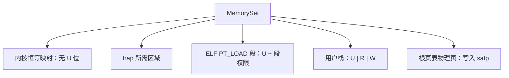

# 实验 3：内存管理与虚存

> 相关教材理论：
>
>  [第 13 章 · 抽象：地址空间（P97）](/downloads/ostep-zh.pdf#page=97)
>
>  [第 15 章 · 机制：地址转换（P112）](/downloads/ostep-zh.pdf#page=112)
>
>  [第 16 章 · 分段（P123）](/downloads/ostep-zh.pdf#page=123)
>
>  [第 18 章 · 分页：介绍（P144）](/downloads/ostep-zh.pdf#page=144)

## 一、问题场景

Lab2 已经能加载用户程序、处理系统调用，并在多个任务之间切换。但此时，内核与用户程序仍**直接使用物理地址**：程序写 `0x80400000`，CPU 就真的访问那块物理内存。

与实际场景中的操作系统相比，我们目前为止完成的这个小系统还存在很严重的三个问题：


| 问题    | 后果                    |
| ----- | --------------------- |
| 无地址隔离 | 用户程序的 bug 可能覆盖内核代码或数据 |
| 无独立空间 | 多个程序难以安全地使用相近的加载地址    |
| 无虚拟地址 | 可用内存被物理 RAM 大小直接卡死    |


OSTEP 中给出解决这些的问题的方法是**虚拟内存**：让每个程序拥有独立的虚拟地址空间，由内核维护页表完成翻译，并用页表项（PTE）上的权限位（读 / 写 / 执行、`U` 位）做隔离。

Lab2 与本实验可以对照如下：


| 执行环节    | Lab2（物理地址）    | 本实验 Lab3（Sv39 虚存）              |
| ------- | ------------- | ------------------------------ |
| 访存含义    | 程序地址 ≈ 物理地址   | 程序地址为虚拟地址，须经页表翻译               |
| 隔离手段    | 主要靠特权级        | 特权级 + 每任务独立页表 + `U` 位          |
| 内核自身    | 开分页前即可按物理地址取指 | 开分页后须先有**恒等映射**，否则一开分页就页错误     |
| Trap 路径 | 保存 / 恢复通用寄存器  | 在此基础上增加进入内核 / 返回用户时的 `satp` 切换 |


也即完成本实验后你需要学会回答的4个问题：

- 如何按页管理物理帧，并建立页表？
- 如何用 RISC-V Sv39 三级页表完成地址翻译？
- 如何为内核与用户分别建立映射（含 `U` 位）？
- 开分页后 trap 进出内核时如何切换地址空间？

**实验目标**：在 RISC-V Sv39 上实现地址空间抽象（页帧分配、`MemorySet`、开分页后的 trap 路径扩展），使多个用户程序各自运行在带 `U` 位权限的独立虚拟地址空间中，同时内核通过恒等映射保护自身。

## 二、背景知识

在Lab3 中我们需要完成从物理地址直达」到「按地址空间隔离」的升级，具体来说就是前面提到我们用**虚拟内存**可以实现的：每个程序建立独立的虚拟地址空间，由硬件页表完成翻译，并用 PTE 权限位做隔离，接下来我们将一一了解。

### 2.1 地址空间：从虚拟视图到 MemorySet

先分清两套「地址世界」：


| 名称       | 谁在用                      | 含义                             |
| -------- | ------------------------ | ------------------------------ |
| **虚拟地址** | 程序（以及习惯上「按虚拟地址写代码」的内核）   | 进程眼里的地址；不同进程可以各自以为自己从 `0` 附近排开 |
| **物理地址** | CPU 真正访问内存条 / DRAM 时用的地址 | 机器上唯一的那一套底层编号                  |


**地址空间**，就是某个进程能看见、能使用的那一整段虚拟地址视图。通常按用途分成几块：代码段、数据段、堆、栈等。进程并不直接「看见」物理内存有多大；它只在自己的地址空间里读写。Lab2 尚未建立这套抽象时，程序地址大致就是物理地址；Lab3 起，用户程序必须先经过页表，才能落到真正的物理内存上。

**为何按「页」映射，而不是按字节**

如果内核按**每一个字节**单独记录「虚拟地址 ↔ 物理地址」，页表会大到无法接受。因此真实系统把内存切成固定大小的块来管理：

- 虚拟侧叫**页（page）**
- 物理侧叫**帧（frame）**（也叫物理页）
- 本实验页大小为 **4KB**，即 2^{12} 字节；页内有 **12 位偏移**

映射的基本单位是「一整页 ↔ 一整帧」，而不是单个字节。页内偏移在翻译前后保持不变：虚拟页里的第 k 个字节，对应到物理帧里的第 k 个字节。

于是可以把虚拟地址拆成两部分：

```text
虚拟地址 = 虚拟页号（VPN） + 页内偏移（12 位）
```

翻译过程可以记成三步：

```text
1. 从虚拟地址取出 VPN 与偏移
2. 查页表：VPN → 物理帧号（PPN / 帧号）
3. 物理地址 = 物理帧号拼上原来的页内偏移
```

页表就是内核为每个地址空间维护的「目录」：哪些虚拟页有效、对应哪块物理帧、允许读 / 写 / 执行等。若程序访问**尚未映射**的虚拟页，或权限不允许，硬件会触发**页错误（page fault）**，陷入内核；内核再决定补映射、换页，或终止该进程。

**在本实验里：MemorySet 就是「完整地址空间」**

若把页表比作「目录」，**MemorySet** 就是「这个进程完整的内存视图」：它内部持有根页表，并由若干 **MapArea**（一段连续的虚拟页范围 + 统一权限）描述代码、数据、栈等区域。概念上的「地址空间」，落到代码里主要就是这份 MemorySet。定义与操作集中在 `os-vm/src/lib.rs`。

本实验里三类映射最重要：

1. **内核恒等映射（identity map）**
    虚拟地址数值等于物理地址。开分页之后，CPU 每一次取指、访存都要走页表；如果内核自己的代码 / 数据还没有映射，一打开分页就会立刻页错误。因此 `mm::init` 会在开启分页前，把内核需要的区间（大致从 `stext` 到帧池起点一带）先做成恒等映射，且通常不带 `U`。
2. **用户映射**
    解析 ELF 的 `PT_LOAD` 段，按段权限映射到用户虚拟地址，并加上 `U`；再为用户栈分配帧并映射为可读写的用户页。为用户建立「仍需用到的内核 trap 相关区域」时，会小心地跳过用户程序占用的物理区间（如 `APP_BASE..APP_BASE+APP_REGION`），避免和用户镜像冲突。
3. **激活与切换**
    把该地址空间根页表的物理页号写入 `satp`（并设置 Sv39 模式），再 `sfence.vma`。多任务时，每个任务绑定自己的用户 MemorySet；调度切换用户任务，本质上常常伴随「换一套页表」。

代码对照：

- `MemorySet::new_bare()` 分配根页表；
- `map_identical_region` / `map_area` / `map_elf_pt_load` 往里挂映射；
- `MemorySet::token()` / `activate()` 生成 `satp` 值并写入硬件。


### 2.2 Sv39 三级页表

2.1 里的「查页表」如果做成一张巨大的扁平表（每个虚拟页一项），在 39 位乃至更大的地址空间下会浪费大量内存。OSTEP 的做法是**多级页表**：只为真正用到的那部分虚拟地址分配中间表，按需生长。

RISC-V **Sv39** 约定：有效虚拟地址用 **39** 位（高位按符号扩展），并拆成「三级页号 + 页内偏移」：

```text
[ VPN2: 9 位 | VPN1: 9 位 | VPN0: 9 位 | Offset: 12 位 ]
         ↑           ↑           ↑            ↑
      一级索引     二级索引     三级索引      页内偏移
```

可以这样理解：


| 部件                     | 作用                                  |
| ---------------------- | ----------------------------------- |
| **VPN2 / VPN1 / VPN0** | 每级 9 位，取值范围 `0..511`，用来在本级页表里选中一项   |
| **Offset（12 位）**       | 页内偏移，翻译时原样带到物理地址                    |
| **每一级页表**              | 占一页（4KB），内含 512 个页表项（PTE）           |
| `satp` **寄存器**         | 指出「当前地址空间」的根页表在物理内存的哪里（并标明 Sv39 模式） |


`os-vm` 里把「页号」包成 `VirtPageNum`，拆分就在 `indexes`：

```rust
impl VirtPageNum {
    pub fn indexes(&self) -> [usize; 3] {
        let vpn = self.0;
        [
            (vpn >> 18) & 0x1ff, // VPN2
            (vpn >> 9) & 0x1ff,  // VPN1
            vpn & 0x1ff,         // VPN0
        ]
    }
}
```

`0x1ff` 正好是 9 位全 1（511），所以能取出每一级索引。硬件（或软件走表）查表顺序是固定的：

```text
从 satp 找到根页表
→ 用 VPN2 索引得到下一级页表地址
→ 用 VPN1 再索引
→ 用 VPN0 到达叶级 PTE
→ 从叶级 PTE 取出物理帧号，拼上 Offset
```

对应实现是 `PageTable::find_pte(vpn, alloc)`：

- `alloc == false`：只查询；中间缺表就返回 `None`（翻译失败 / 未映射）；
- `alloc == true`：建立映射时用；中间缺表就 `frame_alloc` 新页并写成「指针 PTE」。

查表很贵，所以 CPU 用 **TLB** 缓存近期翻译。换掉根页表之后必须 `sfence.vma`，否则可能仍用上一进程的缓存结果。`os-vm` 的 `activate(token)` 正是：

```rust
asm!("csrw satp, {}", in(reg) token);
asm!("sfence.vma");
```


### 2.3 页表项 PTE

每一级页表里的一项叫 **PTE（Page Table Entry）**。在本实验的 Sv39 布局里，一项是 **64 位**：高位附近放物理帧号，最低 10 位放标志位。示意如下：

```text
63            54 53                    10 9 8 7 6 5 4 3 2 1 0
[   保留/扩展  ] [     物理帧号 PPN      ] [标志：… U X W R V]
```

本实验里最先要认清的标志：


| 位             | 含义               | 不满足时常见后果           |
| ------------- | ---------------- | ------------------ |
| **V**         | 该项有效，存在映射        | 访存触发页错误            |
| **R / W / X** | 允许读 / 写 / 执行     | 权限不符 → 页错误         |
| **U**         | 用户态（U-mode）是否可访问 | 用户访问无 `U` 的页 → 页错误 |


隔离的关键点之一是：**内核页通常不带** `U`**，用户代码 / 数据 / 栈带** `U`。这样用户态即使猜到内核虚拟地址，硬件也会在权限检查处拦住。

`MapPermission` 与 PTE 标志的对应在 `os-vm`：

```rust
pub const R: Self = Self(1 << 1);
pub const W: Self = Self(1 << 2);
pub const X: Self = Self(1 << 3);
pub const U: Self = Self(1 << 4);
```

写入叶级 PTE 时：

```rust
fn new_ppn(ppn: PhysPageNum, perm: MapPermission) -> Self {
    let mut flags = PTE_V; // V 位自动置上
    // 按 perm 或上 R/W/X/U …
    Self(ppn.0 << 10 | flags)
}
```

两个容易混的移位，请分开记：


| 操作               | 左移几位   | 原因                      |
| ---------------- | ------ | ----------------------- |
| 把 PPN **写入 PTE** | **10** | 低 10 位要留给 V/R/W/X/U 等标志 |
| 把 PPN **拼成物理地址** | **12** | 一帧 4KB，帧号要对齐到页边界        |


也就是说：`<< 10` 是「塞进表项格式」，`<< 12` 是「变成可访存的物理地址」。

已有映射只改权限时，用 `PageTable::remap`（同一 VPN、同一 PPN，换一套 `perm`），不要再 `map` 一次——`map` 会断言「尚未映射」。fill / debug 练习都会用到 `leaf_perm` → `translate` → `remap` 这条链。

### 2.4 页帧分配器

页表页本身要占物理帧；用户 ELF 段、用户栈也要占物理帧。没有「帧从哪来」，页表和映射都建不起来。

本实验在 `os-alloc` 里使用简化的 **StackFrameAllocator（栈式帧分配器）**：

- 维护一段可用物理区间 `[current, end)`
- `alloc`：取出 `current` 对应的一帧，然后 `current` 向前推进
- `dealloc`：实现很简化，通常只方便回收「刚刚分配」的那一类场景，而不是通用的任意空洞回收

可以把它想成：从一大片连续空闲物理页里「往前掰帧」，够本实验创建页表和装用户程序即可。

布局上，`kernel/src/config.rs` 会把帧池起点 `FRAME_POOL_START` 抬到足够高的位置，避开用户程序常用的物理槽位（例如 `0x80400000` 一带），避免「帧池」和「用户镜像」抢同一块物理内存。真正的操作系统里常见 buddy、slab 等更复杂的分配器；Lab3 用栈式分配，是为了把注意力留在页表与地址空间上。

`mm::init` 开头调用 `init_frame_allocator(FRAME_POOL_START, MEMORY_END)`；之后 `PageTable::new` / `map_frame` 都会从这里取帧。开分页后新分配的帧还要通过 hook 补进内核恒等映射（见下一小节），否则内核自己都访问不了刚分到的页表页。

### 2.5 内核如何开启分页：`mm::init`

用户程序不是「突然」进入虚存世界的：必须先让**内核自己**在分页下仍能取指、访存。

在 `kernel/src/main.rs` 中，Lab3 及以上 feature 会在 trap / 任务初始化之前调用：

```rust
println!("EVOLVE kernel lab3: enabling virtual memory...");
mm::init();
println!("EVOLVE kernel lab3: virtual memory ready.");
```

`kernel/src/mm.rs` 的 `init` 大致做这些事：

```text
init_frame_allocator(FRAME_POOL_START, MEMORY_END)
→ MemorySet::new_bare()                    // 分配内核根页表
→ map_kernel_trap_regions(...)             // stext .. FRAME_POOL_START 恒等映射（无 U）
→ identity_map_allocated_frames(...)       // 把已分配的页表帧也恒等映射进去
→ 保存 KERNEL_SPACE，PAGING_ENABLED = true
→ set_frame_alloc_hook(on_frame_allocated) // 之后再 alloc 的帧自动补映射
→ KERNEL_SPACE.activate()                  // 写 satp，真正打开 Sv39
```

其中：

- `map_kernel_trap_regions` 用 `kernel_perm()`（`R|W|X`，**没有** `U`）做恒等映射；
- 开分页后若再分配页表页却未映射，内核访问该物理页会立刻页错误，所以需要 `on_frame_allocated` 钩子；
- `activate()` 之后，CPU 取指地址仍是原来的数值，但已经走页表——这正是恒等映射存在的意义。

对照 Lab2：Lab2 全程 `satp=0`（或等价地不启用分页），用户与内核共物理地址；Lab3 从这里开始，「当前用哪套页表」成为 trap 路径上的显式状态。

### 2.6 用户地址空间如何建立，以及 `U` 位为何关键

每个用户任务在 `task::init` → `TaskManager::init_tasks` 里会调用：

```rust
mm::create_user_space(i, get_app_elf(i));
let user_token = mm::user_token(i);
```

`create_user_space`（`kernel/src/mm.rs`）的骨架是：

```text
activate_kernel()                          // 改页表时先站在内核空间
→ MemorySet::new_bare()                    // 该任务自己的根页表
→ map_kernel_trap_regions_user(...)        // 内核 trap 仍要能跑，但跳过用户镜像槽
→ map_elf_and_stack(...)                   // ELF PT_LOAD + 用户栈
→ 存入 USER_SPACES[space_id]
```

`map_elf_and_stack` 正常应做两件事：

1. `user_space.map_elf_pt_load(elf, 0)`
    在 `os-vm` 里解析 ELF 的 `PT_LOAD`：对每个段先以 `MapPermission::U` 为底，再按 `p_flags` 或上 R/W/X，然后分配帧、拷贝段内容。
2. 在 `[APP_BASE + APP_REGION - USER_STACK_SIZE, APP_BASE + APP_REGION)` 映射用户栈，权限为 `U | R | W`。

因此，**健康状态下**：用户代码页带 `U`（通常还有 `R|X`），用户栈带 `U|R|W`；内核恒等映射不带 `U`。

TCB 里多出来的 `user_token` 就是该任务根页表对应的 `satp` 值（`8 << 60 | root_ppn`），返回用户态时要把它写回硬件。

```text
映射在、R/W/X 也在，但若叶子 PTE 没有 U
→ U-mode 取指 / 访存仍会页错误
→ 往往看不到 Hello from user app!
```

阅读 `strip_user_bit_for_exercise`（fill）或 debug 中改权限的循环时，请注意它如何用 `leaf_perm` / `translate` / `remap`：**改权限不等于重新分配一页**。实现或修复时若丢掉原来的 `X` 或 `W`，也会表现为取指失败或写栈失败——现象可能和「缺 U」类似，排查时要对照权限集合，不要只看「有没有映射」。

### 2.7 开分页后 trap 如何切换地址空间

Lab2 的 trap 路径保存 / 恢复通用寄存器与 `sepc` / `sstatus`；Lab3 在此基础上，进出内核时还要换页表。

`kernel/src/trap.rs` 里与虚存相关的关键点：

1. `trap_handler` **入口立刻** `activate_kernel()`
    用户 trap 进来时，`satp` 往往仍是用户页表。内核代码与数据主要挂在内核 MemorySet 上；先切回内核页表，后续 Rust 代码、帧分配、改用户页表才安全。
2. `trap_handler` **返回前** `activate_current_user()`
    处理完 syscall / 调度后，再切回当前任务的用户页表（通过 `user_token(current_app_id)`）。
3. **首次 / 再次进入用户态走** `run_user_task` **→** `restore_to_user_paged`
    与 Lab2 的 `restore_to_user` 相比，多传入用户 `satp`：


### 2.8 从一个虚拟地址走到物理内存

把 2.1–2.4 串成一次用户态访存，可以按下面检查清单走：


同时记住：地址空间不是「只有一张孤立的页表」，而是 MemorySet 下多块映射共同构成的视图：




最后再加强一下三个易混数字的记忆：


| 数字     | 出现在哪里                 | 含义           |
| ------ | --------------------- | ------------ |
| **12** | 页内偏移；PPN→物理地址         | 4KB 页，`2^12` |
| **9**  | VPN2/1/0；掩码常为 `0x1ff` | 每级 512 项     |
| **10** | PPN 写入 PTE 时的左移       | 给标志位腾出低 10 位 |


## 三、实验任务

本实验主要相关文件（路径相对 `os-lab/`）：


| 文件                    | 角色                    | 阅读时重点确认                            |
| --------------------- | --------------------- | ---------------------------------- |
| `os-alloc/src/lib.rs` | 页帧分配器                 | `[current, end)` 如何分配与回收           |
| `os-vm/src/lib.rs`    | Sv39 页表 + MemorySet   | VPN 拆分、PTE 布局、中间页表按需创建、`remap`     |
| `kernel/src/mm.rs`    | 内核与用户地址空间布局           | 恒等映射、用户 ELF / 栈与 `U` 位；**任务一动手点**  |
| `kernel/src/trap.rs`  | Lab3 trap 层 `satp` 切换 | 何时 `activate_kernel`、何时恢复用户页表      |
| `kernel/src/task.rs`  | 每任务独立用户映射             | `create_user_space` 与 `user_token` |


> 完整代码走读与参考答案见 [lab3 参考答案](/answers/lab3-answers)。


### 任务一：完成实验

本实验的任务文件为 `kernel/src/mm.rs`，请在工作区中打开文件，并根据注释提示完成实验。

运行验证：

```powershell
cargo run -p kernel --features lab3 --release
```

**预期输出**：屏幕会先刷出 **OpenSBI 启动日志**（可忽略），随后是用户程序输出。示意如下：

```text
OpenSBI v1.7
  ...（OpenSBI 平台/HART 日志，可忽略）...
Hello from user app!
App 0 exited with code 0
Power test start
2^1000000002 % 998244353 = 409684505
Power check ok
App 1 exited with code 0
Yield test start
Yield round                             ← lab3 下常输出 5 轮
Yield round
Yield round
Yield round
Yield round
App 2 exited with code 0
All user apps exited.
```

**通过标准**（四条输出断言缺一不可）：


| 断言                  | 必须看到                    |
| ------------------- | ----------------------- |
| `hello-output`      | `Hello from user app!`  |
| `power-result`      | `409684505`             |
| `yield-five-rounds` | `Yield round` 出现不少于 5 次 |
| `all-exited`        | `All user apps exited.` |


且 QEMU 正常退出（终端命令返回，没有卡住或报错）。

> 对比 Lab2：Lab3 下 yield 同样为 **5 轮**。Lab3 的可观察差异主要在虚存隔离——各用户程序有独立地址空间与 `U` 位权限。若缺 `U`，常见现象是**几乎看不到用户输出**（与 Lab2 debug 里「Yield 只打一轮就全退出」不同）。


### 任务二：阅读理解

1. 对照 `VirtPageNum::indexes`：Sv39 的 39 位虚拟地址如何拆成 3×9 + 12？`0x1ff` 为什么刚好取出一级索引？
2. 对照 `PageTableEntry::new_ppn`：PTE 里物理帧号为何左移 10 位而不是 12 位？这和形成物理地址时的移位有何区别？
3. 对照 `mm::init`：开分页后内核为何还能继续执行原地址附近的代码？恒等映射覆盖了哪些区域？`on_frame_allocated` 解决什么问题？
4. 三级页表查找时中间表项为空怎么办？`find_pte` 的 `alloc` 参数分别对应「查询」和「建立映射」中的哪种行为？
5. 开分页后 trap 进内核时要不要切 `satp`？沿 `activate_kernel` / `run_user_task` → `restore_to_user_paged` 说明 Lab3 在 Rust 层比 Lab2 多了什么。
6. `map_elf_pt_load` 给用户段加了哪些权限位？若叶子 PTE 有映射、有 `X`，但没有 `U`，用户态取指时会发生什么？这与任务一 fill / debug 的考点如何对应？
7. 为何改用户页权限时用 `remap` 而不是再次 `map`？若 `remap` 时丢掉原来的 `W` 或 `X`，你可能分别看到什么现象？


### 任务三：动手修改

**修改 1：去掉用户页的** `U` **位**

我们在背景知识里说过：用户访问没有 `U` 的页会页错误——隔离靠权限位，不是把地址藏起来。尝试在建立用户映射处（ELF `PT_LOAD`、用户栈）临时去掉 `MapPermission::U`（可在 `kernel/src/mm.rs` 或 `os-vm` 的 `map_elf_pt_load` 搜该符号），不要动内核恒等映射。执行：

```powershell
cargo run -p kernel --features lab3
```

- 预期现象：用户程序很快失败（页错误、异常退出，或看不到正常的 `Hello from user app!`）。
- 通过标准：观察到上述失败，并用自己的话解释**为什么**需要 `U` 位（内核页通常不带、用户页必须带）。
- **做完务必改回并** `cargo run -p kernel --features lab3` **确认恢复正常**。

**修改 2：为什么不能简单把** `PAGE_SIZE` **改成 8192？**

页大小看起来只是配置常量，实际同时约束地址怎么拆、页表几项、PPN 左移几位，以及硬件按多大页解释。只改软件数字却和 Sv39 的 4KB 约定不一致，整条链会对不上。

这一项**不必真的改代码验证运行错误**（真是修改还需要一并修改掩码、`<< 12` / `<< 10`、链接布局等内容，噪音很大）。想清楚后在实验报告里即可，例如：偏移变 13 位后 VA 怎么拆？`0x1ff` 还成立吗？`PPN << 12` 与 PTE 的 `<< 10` 哪些必须跟着变？硬件仍按 4KB 解释又会怎样？

**修改 3：追踪一次地址翻译**

在 `os-vm` 的 `PageTable::translate`（或实际走表函数）里临时加少量 `println!`，打印虚拟地址 / VPN、三级索引和最终 PPN。打印太多时，可只对第一次成功翻译或某个固定 VA 打一次，然后：

```powershell
cargo run -p kernel --features lab3
```

- 预期现象：hello 启动前后能看到与背景知识一致的拆分与查表输出。
- 通过标准：能对照真实输出，口述「VA → 三级索引 → 叶 PTE → PPN → 物理地址」。
- **做完务必去掉调试打印并** `cargo run -p kernel --features lab3` **确认输出恢复干净**。


## 四、验证命令


| 验证项      | 命令                                                                | 通过标准                                                                         |
| -------- | ----------------------------------------------------------------- | ---------------------------------------------------------------------------- |
| 主编译      | `cargo check -p kernel --features lab3`                           | 无 error + 四条输出断言                                                             |
| QEMU     | `cargo run -p kernel --features lab3 --release`                   | `Hello from user app!`、`409684505`、5 行 `Yield round`、`All user apps exited.` |
| 组件单测（可选） | `cargo test -p os-vm -p os-alloc --target x86_64-pc-windows-msvc` | 通过                                                                           |


> 任意白名单命令“退出码 0”**不等于** Lab 通过；例如 `Yield round` 不足 5 行时，命令仍可能返回 0。

