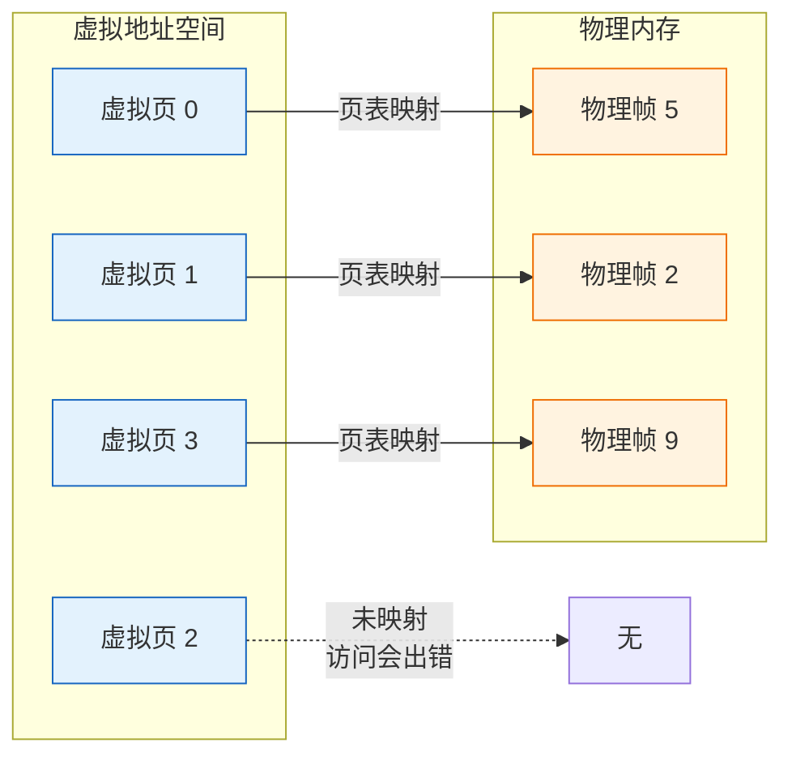
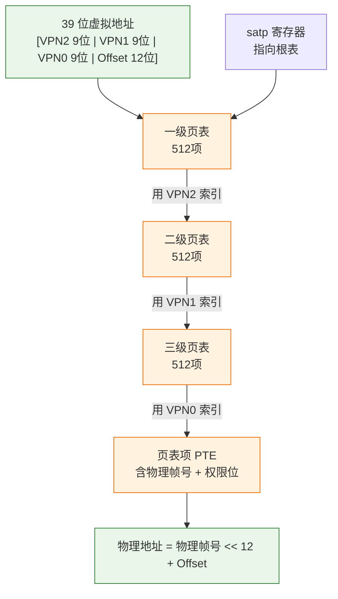
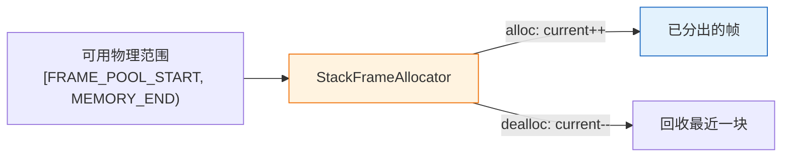
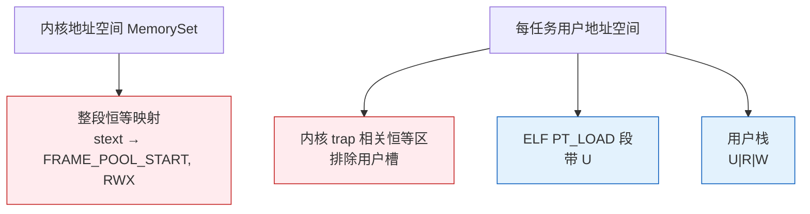

# 实验 3：内存管理与虚存

> 对应 feature：`lab3`（依赖 `lab2`）。

本实验对应《操作系统导论》里的 **内存虚拟化**：给每个程序一套自己以为的、独立的**地址空间**，由内核把虚拟地址翻译成物理地址。这是概念最绕、也最关键的一步——学完后，内核才能真正隔离程序、保护自己。

## 零、开始之前

1. **已完成 Lab2**：理解了 trap、系统调用、上下文切换、任务调度（见 [lab2-trap-and-task.md](lab2-trap-and-task.md)）。
2. **激活环境（可选）**：如果你使用了新的终端，请在仓库根目录执行 `. .\scripts\activate-os-env.ps1` 。
3. **进入工作目录**： `cd os-lab`
4. **自检**：`rustc --version` 与 `qemu-system-riscv64 --version` 能输出版本。
5. **建议先读书**：《操作系统导论》关于地址空间、分段与分页、页表的章节。动手前先读，会轻松很多。

## 一、问题场景

到目前为止（lab1–3），你的内核已经能跑用户程序、处理系统调用，还能在几个程序之间切换。但仔细看会发现：内核和用户程序仍然「直来直去」地使用**物理地址**——代码里写 `0x80400000`，CPU 就真的去访问物理内存的那一块。小实验能跑通，可一旦对照《操作系统导论》里的 **内存虚拟化**，你会立刻意识到这套做法站不住脚。

教材里反复强调：每个进程都应该拥有自己的**地址空间（address space）**——从 0 开始、看起来很大、彼此隔离的一套「假地址」。程序用自己的地址访问内存；真正落到哪块物理内存上，由操作系统偷偷翻译。Lab2 还没有这层翻译，于是三个致命问题会同时出现：

- **一个程序的 bug 会炸毁整个系统**  
用户程序如果手滑（或恶意）写出一个落在内核代码区的物理地址，就能把内核指令覆盖掉。整台机器当场崩溃，你没有任何「这是用户区 / 那是内核区」的硬件护栏。
- **没法安全地「同时」装两个程序**  
假设 `hello` 和 `power` 都被链接到相近甚至相同的加载地址。没有隔离时，它们会抢同一块物理内存，后加载的覆盖先加载的。你只能强制「一个跑完再跑下一个」，多任务也只是假象。
- **程序能用的内存被物理内存大小死死卡住**  
物理内存就那么大。教材强调虚拟内存的好处之一：程序可以以为自己有很大、很整齐的地址空间，而不必等于机器上真实插了多少内存；暂时用不到的部分甚至可以根本不占物理页（后面章节还会讲到交换等，本实验先抓住「翻译 + 隔离」）。

《操作系统导论》给出的答案就是 **虚拟内存（Virtual Memory）**：

1. 给每个程序一套独立的虚拟地址；
2. 内核维护「虚拟地址 → 物理地址」的映射，并检查权限（谁能读、写、执行）；
3. CPU 访存时由硬件按页表翻译——程序以为在用自己的地址，实际可能落在完全不同的物理页上。

要把这件事在本实验里做出来，你还会撞上三个更具体的实现问题（背景知识会逐个介绍）：

- **映射记在哪？** 几十亿个字节不可能一对一登记 → 用**页表**，按页（如 4KB）压缩记录。
- **物理页谁来发？** 页表本身、用户代码/数据都要占物理内存 → 需要**页帧分配器**记账。
- **多程序如何各有空间、又仍能陷入同一份内核？** → 用**地址空间（MemorySet）**组织「这个程序看得见的全部映射」，并在合适的时机切换。

> 一句话记住本实验：让「每个程序都以为自己独占内存」这件事，在硬件页表上真正成立。

## 二、背景知识

动手前先把教材里的名词和 RISC-V 上的实现对齐。虚存里位运算容易算错，下面几张图建议对照着读。

### 2.1 为什么要分页：地址空间的抽象

《操作系统导论》里的**地址空间**，指的是程序眼里那一套从低到高的地址：代码、数据、栈各自落在不同区间。为了让每个程序都觉得「这片地址是我的」，同时又真正落在有限的物理内存上，操作系统不会按「每一个字节」去登记映射——那样表会大到放不进内存。

实际做法是**按页管理**：把虚拟地址空间和物理地址空间都切成大小固定的块。本实验在 RISC-V 上使用 4KB 一页。虚拟侧的一块叫**页（page）**，物理侧的一块叫**帧（frame）**。映射只记到「页 → 帧」这一级；页内部的偏移量两边相同，直接拼进物理地址即可。




因此，一次访存用的**虚拟地址**可以拆成两部分：

**虚拟地址 = [虚拟页号] + [页内偏移]**

4KB = 2^12，所以页内偏移占 **12 位**。翻译时：用页号查页表得到物理帧号，再与偏移拼成物理地址。未映射的虚拟页一旦被访问，硬件会触发异常（页错误），内核据此拒绝非法访问。

### 2.2 Sv39：RISC-V 的三级页表

即便已经按页记录，若仍用一张「扁平大表」覆盖巨大的虚拟地址空间，表本身也会大到无法接受。《操作系统导论》因此强调**多级页表**：把大表拆成树状，只有真正用到的分支才分配下级表。

RISC-V 的 **Sv39** 模式使用 **3 级页表**。硬件用的虚拟地址有效宽度是 39 位，拆法如下：




- 每一级用 **9 位**索引，每张表最多 **512** 项（2^9）。
- 三级页号合计 27 位，加上 12 位偏移，正好是 39 位虚拟地址。
- CPU 通过 `satp` 寄存器找到根页表；再依次用 VPN2、VPN1、VPN0 走到叶级 **PTE**，取出物理帧号，与偏移拼出物理地址。

多级页表的关键收益是**按需分配**：程序从未用到的虚拟区间，不必为其建立下级页表，因而大幅节省内存。查三级再取数据看起来要多次访存，但硬件有 **TLB（Translation Lookaside Buffer）** 缓存最近用过的翻译结果，命中时几乎不必重走整条页表路径。

### 2.3 页表项 PTE：权限位的世界

页表项（PTE）不仅指出「这一页对应哪块物理帧」，还携带**权限**，决定这次访问是否合法。本实验里 PTE 是 64 位，布局可以概括为「高位放物理帧号，低位放标志」：

```
63    54 53           10 9  8 7 6 5 4 3 2 1 0
[保留位]  [  物理帧号   ] [U X W R V ...]
                                  |  |  |  |  └ V: 有效（是否存在映射）
                                  |  |  |  └── R: 可读
                                  |  |  └──── W: 可写
                                  |  └─────── X: 可执行
                                  └────────── U: 用户态可访问
```

在 `os-vm` 里你会直接碰到这些标志：

- `**R` / `W` / `X**`：控制读、写、执行。例如代码页可以只开执行、数据页开读写且不可执行，从机制上减少「把数据当代码跑」一类错误。
- `**U`（User）**：隔离的关键开关。带 `U` 的页允许用户态访问；不带 `U` 的页一旦被用户态碰到，就会触发页错误。内核内存通常不设 `U`，从而落实教材里说的**保护**与**隔离**：用户程序进不了内核的地址范围。

### 2.4 页帧分配器：物理内存的记账员

页表页、用户代码页、用户栈页都要占用真实的物理帧，因此内核需要一个**页帧分配器**记录：哪些帧还能分出去，哪些已经用了。

本实验采用最简单的 `**StackFrameAllocator`（栈式分配器）**：在一段连续物理区间 `[current, end)` 上工作——分配时把 `current` 向前推一格，回收时再退回来（主要方便回收「最后分出去的那一块」）。可以把它想成从一叠扑克里按顺序抽牌。




配置上，`config.rs` 里还有 `FRAME_ALLOC_START` 等边界；真正交给分配器使用的是更高的 `**FRAME_POOL_START**`，用来避开与用户程序槽位等区域的冲突。真实系统里常见伙伴系统、slab 等更复杂的分配器；对 Lab3 而言，栈式分配已经足够支撑页表与用户映射的建立。

### 2.5 地址空间 MemorySet：内核与用户的隔离

有了页表和分配器之后，还需要把「一个程序运行时看得见的全部内存」组织起来。本实验用 **MemorySet（地址空间）** 表示这一点：它由若干 **MapArea（映射区）** 组成，每个区是一段连续的虚拟页，映射到若干物理帧，并带上权限。

大致结构如下：




有三类要点需要记住：

1. **恒等映射（identity map）**
  虚拟页号等于物理帧号。开启分页的瞬间，CPU 之后的每一次访存都要走页表；若内核代码所在的物理地址在页表里没有对应映射，内核会立刻页错误崩溃。恒等映射让「开分页前后，内核看到的地址数值不变」，从而安全过渡。
2. **用户区**
  用户程序的 ELF 段与用户栈映射时带上 `U` 位，使它们能在 U-mode 下访问；内核私有区域则不带 `U`。
3. **激活地址空间**
  把该地址空间根页表的物理页号写入 `satp`（并标明 Sv39 模式），再执行 `sfence.vma` 刷新 TLB，此后 CPU 就按这套映射翻译地址。切换任务时，往往也要切换到对应的页表上下文（具体细节见代码与 trap 路径）。

把以上五节串起来：**分页给出地址空间抽象 → Sv39 多级页表做翻译 → PTE 管权限 → 分配器提供物理帧 → MemorySet 把一张「程序可见内存图」装起来并激活**。读代码时，可以按这条线在 `os-alloc`、`os-vm`、`kernel/src/mm.rs` 里对号入座。

## 三、实验任务

> **本实验怎么学**：虚存最绕，更要先想再对照。把【2.2】【2.3】的图看懂再动手。


| 文件                    | 角色             | 先想「如果是我会怎么设计」        |
| --------------------- | -------------- | -------------------- |
| `os-alloc/src/lib.rs` | 页帧分配器          | 怎么记账已分配帧？            |
| `os-vm/src/lib.rs`    | Sv39 页表 + 地址空间 | 怎么拆 39 位地址？PTE 怎么布局？ |
| `kernel/src/mm.rs`    | 内核内存管理         | 内核要映射哪些区？            |
| `kernel/src/trap.rs`  | trap（lab3 改动）  | 开分页后 trap 多了什么？      |
| `kernel/src/task.rs`  | 任务（lab3 改动）    | 每任务如何映射用户程序？         |


> 完整代码解读见 `labs/answers/lab3-answers.md`。

本实验分为三档任务，按顺序完成：

### 任务一：跑通 lab3

```powershell
cargo run -p kernel --features lab3
```

**预期输出**（OpenSBI 日志可忽略）：

```text
Hello from user app!
App 0 exited with code 0
Power test start
2^1000000002 % 998244353 = 409684505
Power check ok
App 1 exited with code 0
Yield test start
Yield round                             ← lab3 下常输出 5 轮
Yield round
Yield round
Yield round
Yield round
App 2 exited with code 0
All user apps exited.
```

**通过标准**：看到 `Hello from user app!`、`409684505`、`All user apps exited.`，QEMU 正常退出。

> 对比 lab2：lab3 下 yield 多为 **5 轮**。这是分页带来隔离更干净后的实际好处。

### 任务二：阅读理解与思考题（必做）

带着下面的问题去读代码。每个问题请先自己用「教材语言 + 代码位置」试着回答；**参考答案见** `labs/answers/lab3-answers.md`。

1. Sv39 的 39 位虚拟地址怎么拆成 3×9 + 12？`0x1ff` 代表什么？对照 `VirtPageNum::indexes`。
2. PTE 里物理帧号为什么左移 10 位而不是 12 位？对照 `PageTableEntry::new_ppn`。
3. 开分页后内核为什么还能跑？恒等映射怎么做？对照 `mm::init`。
4. 三级页表查找时，中间表项为空怎么办？`find_pte` 的 `alloc` 参数是什么意思？
5. 开分页后 trap 进内核时要不要切 `satp`？lab3 的 trap 入口比 lab2 多了什么？

> 能讲清「虚拟地址 → 三级页表 → 权限检查 → 物理地址」，lab3 就过关了。

### 任务三：动手小修改

**修改 1：去掉用户页的** `U` **位（理解性实验）**

在 ELF 映射 / 用户栈映射处临时去掉 `U`，再跑。

- 预期：用户态访问被拒，页错误。做完**务必改回**。

**修改 2：为什么不能简单把** `PAGE_SIZE` **改成 8192？（思考题）**

想清楚即可：牵涉 Sv39 偏移位宽与硬件约定。

**修改 3：追踪一次地址翻译（进阶）**

在 `PageTable::translate` 临时 `println` 打印 VPN、各级索引、最终 PPN，观察 hello 的某次翻译。

## 四、验证

以 `cargo run -p kernel --features lab3` 输出 `Hello from user app!`、`409684505`、`All user apps exited.` 并正常退出为主要标准。

## 五、AI 提问模板

1. **概念澄清型**：「《操作系统导论》里的地址空间，和 Sv39 的 39 位 VA 怎么对应？多出来的虚拟地址有什么用？」
2. **现象解释型**：「lab3 内核一启动就卡死无输出，和恒等映射、`satp` 有关吗？」
3. **代码追因型**：「`ppn.0 << 10` 为什么是 10 不是 12？」
4. **对比深化型**：「为什么 lab3 的 yield 能多轮而 lab2 往往只有 1 轮？」
5. **动手探索型**：「若让每个用户程序用完全独立的页表根，要改哪些地方？」

