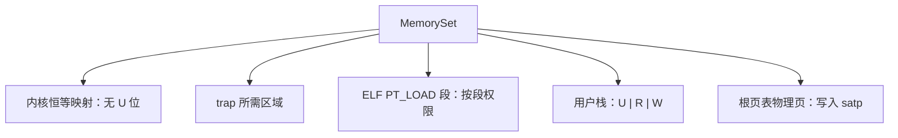

# 实验 3：内存管理与虚存

> 对应 feature：`lab3`（依赖 `lab2`）。

> **配套教材**（《操作系统导论》OSTEP 中译）：[第 13 章 · 地址空间（PDF 第 97 页）](/downloads/ostep-zh.pdf#page=97) · [第 15 章 · 地址翻译（PDF 第 112 页）](/downloads/ostep-zh.pdf#page=112) · [第 16 章 · 分段（PDF 第 123 页）](/downloads/ostep-zh.pdf#page=123) · [第 18 章 · 分页引言（PDF 第 144 页）](/downloads/ostep-zh.pdf#page=144) · [全书入口](/downloads/ostep-zh.pdf)

本实验对应《操作系统导论》里的 **内存虚拟化**：给每个程序一套自己以为的、独立的**地址空间**，由内核把虚拟地址翻译成物理地址。这是概念最绕、也最关键的一步——学完后，内核才能真正隔离程序、保护自己。

## 零、开始之前

1. **已完成 Lab2**：理解了 trap、系统调用、上下文切换、任务调度（见 [Lab2 中断与任务](/labs/lab2-trap-and-task)）。
2. **激活环境（可选）**：如果你使用了新的终端，请在仓库根目录执行 `. .\scripts\activate-os-env.ps1` 。
3. **进入工作目录**： `cd os-lab`
4. **自检**：`rustc --version` 与 `qemu-system-riscv64 --version` 能输出版本。
5. **建议先读书**：OSTEP 第 13–16 章（地址空间、地址翻译、分页）。Lab3 是内存虚拟化的核心实验。

## 一、问题场景

Lab2 能跑用户程序并在任务间切换，但内核与用户仍**直接使用物理地址**——程序写 `0x80400000`，CPU 就真的访问那块物理内存。对照 OSTEP 的**内存虚拟化**，三个问题同时出现：

| 问题 | 后果 |
| --- | --- |
| 无地址隔离 | 用户 bug 可能覆盖内核代码 |
| 无独立空间 | 多程序无法安全共存于相近加载地址 |
| 无虚拟地址 | 可用内存被物理 RAM 大小卡死 |

OSTEP 的答案是**虚拟内存**：每个程序有独立虚拟地址空间，内核维护页表做翻译与权限检查（读/写/执行、U 位）。

本实验在 RISC-V Sv39 上实现地址空间抽象：页帧分配器、`MemorySet`、开分页后的 trap 路径扩展。学完后内核才能真正隔离程序并保护自己。

## 二、背景知识

对应 OSTEP 第 13–16 章：地址空间、地址翻译、分页。Lab2 里用户程序与内核共用物理地址；Lab3 为每个程序建立独立的**虚拟地址空间**，由硬件页表完成翻译，并用 PTE 权限位做隔离。

### 2.1 分页与地址空间

OSTEP 第 13 章：**地址空间**是进程看到的连续虚拟地址（代码、数据、栈各据一段）。若按字节记录映射，页表会过大；实际按固定大小的**页**管理。本实验页大小 4KB（2^12）。

- 虚拟侧：**页（page）**
- 物理侧：**帧（frame）**
- 映射粒度：页 → 帧；页内偏移在两侧相同

**虚拟地址 = 虚拟页号（VPN）+ 页内偏移（12 位）**

查页表得物理帧号，拼上偏移得物理地址。访问未映射页触发**页错误**，由内核处理或终止进程。

### 2.2 Sv39 三级页表

OSTEP 第 16 章：多级页表按需分配，避免整张扁平大表。RISC-V **Sv39** 用 39 位有效虚拟地址：

```text
[ VPN2: 9位 | VPN1: 9位 | VPN0: 9位 | Offset: 12位 ]
```

- 每级 9 位索引 → 512 项/表
- `satp` 寄存器指向根页表
- 依次用 VPN2、VPN1、VPN0 索引，到达叶级 **PTE**，取出物理帧号

**TLB** 缓存近期翻译结果，减少重复查表开销。

### 2.3 页表项 PTE

PTE 含物理帧号和权限位（本实验 64 位，低 10 位为标志）：

```
63    54 53           10 9  8 7 6 5 4 3 2 1 0
[保留]  [  物理帧号   ] [U X W R V ...]
```

| 位 | 含义 |
| --- | --- |
| V | 有效，该页有映射 |
| R/W/X | 读 / 写 / 执行 |
| U | 用户态可访问 |

内核映射通常不带 **U**；用户 ELF 段和栈带 **U**，用户态才能访问。用户访问无 U 的页会页错误——这是隔离的核心机制。

PTE 中帧号左移 **10** 位（腾出权限位）；拼物理地址时帧号左移 **12** 位（页大小）。两者不要混淆。

### 2.4 页帧分配器

页表页、用户代码/栈都要占物理帧。本实验用 **StackFrameAllocator**：在 `[current, end)` 区间顺序分配，`alloc` 时 `current++`，`dealloc` 时仅回收最近一块（简化实现）。

`config.rs` 中 `FRAME_POOL_START` 在 `FRAME_ALLOC_START` 基础上再抬高，避开用户程序槽位 `0x80400000` 一带。生产环境常用 buddy、slab 等更复杂的分配器；Lab3 栈式分配足够用。

### 2.5 地址空间 MemorySet

**MemorySet** 描述一个程序可见的全部映射，由若干 **MapArea**（连续虚拟页 + 权限）组成。

1. **恒等映射**：虚拟地址 = 物理地址。开分页后每次访存都走页表；内核代码区必须先有映射，否则一开分页就页错误。`mm::init` 对 `stext` 到 `FRAME_POOL_START` 做恒等映射。
2. **用户区**：ELF `PT_LOAD` 段和用户栈映射时加 **U** 位。用户地址空间用 `map_kernel_trap_regions_user`，跳过 `APP_BASE..APP_BASE+APP_REGION`，避免与用户程序抢同一物理页。
3. **激活**：根页表物理页号写入 `satp`（Sv39 模式），`sfence.vma` 刷新 TLB。切换任务时换对应页表。

代码阅读顺序：`os-alloc`（帧分配）→ `os-vm`（页表、MemorySet）→ `kernel/mm.rs`（内核与用户空间布局）→ `kernel/trap.rs`（Lab3 在 Rust 层增加 `activate_kernel` / `restore_to_user_paged` 与 `satp` 切换）。

Lab3 相对 Lab2 的主要变化是**地址空间隔离**（独立页表、`U` 位），不是 yield 轮次——两者均可稳定输出 5 轮 `Yield round`。

### 2.6 从一个虚拟地址走到物理内存

本地版手册分别画出了页、三级页表和 MemorySet；远端复核版补充了实际内存边界、`satp` 切换与 Lab2/Lab3 的正确对比。把这些内容串起来，一次用户态访存可以沿下面的路径检查：


地址空间不是“只有一张页表”，而是若干映射区共同组成的内存视图：



这也解释了三个容易混淆的数字：页内偏移是 **12 位**；每级索引是 **9 位**，所以掩码为 `0x1ff`；PTE 给标志位预留 **10 位**，所以写入 PPN 时左移 10，形成物理地址时才左移 12。切换页表后执行 `sfence.vma`，是为了避免 TLB 继续使用上一地址空间的旧翻译。

## 三、实验任务

> **本实验怎么学**：先 `cargo run --features lab3` 看输出，再按【2.2】【2.3】理解 Sv39 与 PTE，对照 `os-vm`、`mm.rs`、`trap.rs` 读代码。

主要文件（路径相对 `os-lab/`）：

| 文件 | 角色 | 阅读时重点确认 |
| --- | --- | --- |
| `os-alloc/src/lib.rs` | 页帧分配器 | `[current, end)` 如何分配与回收 |
| `os-vm/src/lib.rs` | Sv39 页表 + MemorySet | VPN 拆分、PTE 布局、中间页表按需创建 |
| `kernel/src/mm.rs` | 内核与用户地址空间布局 | 恒等映射、用户 ELF 段和 U 位如何建立 |
| `kernel/src/trap.rs` | Lab3 trap 层 `satp` 切换 | 何时进入内核页表、何时恢复用户页表 |
| `kernel/src/task.rs` | 每任务独立用户映射 | 每个任务如何绑定自己的根页表 |

> 完整走读见 [lab3 参考答案](/answers/lab3-answers)。

### 任务一：跑通 lab3

```powershell
cargo run -p kernel --features lab3
```

**预期输出**（OpenSBI 日志可忽略）：

```text
Hello from user app!
App 0 exited with code 0
Power test start
2^1000000002 % 998244353 = 409684505
Power check ok
App 1 exited with code 0
Yield test start
Yield round                             ← lab3 下常输出 5 轮
Yield round
Yield round
Yield round
Yield round
App 2 exited with code 0
All user apps exited.
```

**通过标准**：看到 `Hello from user app!`、`409684505`、`All user apps exited.`，QEMU 正常退出。

> 对比 lab2：lab3 下 yield 同样为 **5 轮**（yield 程序自身循环调用 `sys_yield`）。Lab3 的可观察差异主要在虚存隔离——各用户程序有独立地址空间与 `U` 位权限，而非 yield 轮次。

### 任务二：阅读理解（必做）

参考答案见 [lab3 参考答案](/answers/lab3-answers)。

1. 对照 `VirtPageNum::indexes`：Sv39 的 39 位虚拟地址如何拆成 3×9 + 12？`0x1ff` 为什么刚好取出一级索引？
2. 对照 `PageTableEntry::new_ppn`：PTE 里物理帧号为何左移 10 位而不是 12 位？这和形成物理地址时的移位有何区别？
3. 对照 `mm::init`：开分页后内核为何还能继续执行原地址附近的代码？恒等映射覆盖了哪些区域？
4. 三级页表查找时中间表项为空怎么办？`find_pte` 的 `alloc` 参数分别对应“查询”和“建立映射”中的哪种行为？
5. 开分页后 trap 进内核时要不要切 `satp`？沿 `activate_kernel` / `restore_to_user_paged` 说明 Lab3 在 Rust 层比 Lab2 多了什么。

### 任务三：动手小修改

**修改 1：去掉用户页的** `U` **位（理解性实验）**

在 ELF 映射 / 用户栈映射处临时去掉 `U`，再跑。

- 预期：用户态访问被拒，页错误。做完**务必改回**。

**修改 2：为什么不能简单把** `PAGE_SIZE` **改成 8192？（思考题）**

想清楚即可：牵涉 Sv39 偏移位宽与硬件约定。

**修改 3：追踪一次地址翻译（进阶）**

在 `PageTable::translate` 临时 `println` 打印 VPN、各级索引、最终 PPN，观察 hello 的某次翻译。

### 提交清单（自查）

- [ ] `cargo run -p kernel --features lab3` 输出与 Lab2 相同测例且 QEMU 正常退出
- [ ] 能说明 Sv39 三级页表查表过程
- [ ] 能解释恒等映射与 `U` 位隔离
- [ ] 能说明 Lab3 trap 路径中 `satp` 切换时机
- [ ] 完成任务二 5 道阅读理解（对照答案自查）

## 四、验证

| 验证项 | 命令 | 通过标准 |
| --- | --- | --- |
| 主编译 | `cargo check -p kernel --features lab3` | 无 error |
| QEMU | `cargo run -p kernel --features lab3 --release` | `Hello from user app!`、`409684505`、5 行 `Yield round`、`All user apps exited.` |
| 组件单测（可选） | `cargo test -p os-vm -p os-alloc --target x86_64-pc-windows-msvc` | 通过 |

手册交互清单见 handbook「Lab3 内存管理」页（`handbook/data/labs.json`）。

## 五、AI 提问模板

1. **概念澄清型**：「《操作系统导论》里的地址空间，和 Sv39 的 39 位 VA 怎么对应？多出来的虚拟地址有什么用？」
2. **现象解释型**：「lab3 内核一启动就卡死无输出，和恒等映射、`satp` 有关吗？」
3. **代码追因型**：「`ppn.0 << 10` 为什么是 10 不是 12？」
4. **对比深化型**：「Lab3 相比 Lab2，trap 路径在 Rust 层多了哪些与 `satp` 相关的工作？这和地址空间隔离有什么关系？」
5. **动手探索型**：「若让每个用户程序用完全独立的页表根，要改哪些地方？」

## 六、思考题与参考答案

完整答案与代码走读见 [lab3 参考答案](/answers/lab3-answers)。

### 习题 1（PTE 帧号移位）

**PTE 中物理帧号为何左移 10 位存入，而不是 12 位？**

参考答案：Sv39 PTE 低 10 位为标志位（V/R/W/X/U 等），帧号占 `[53:10]`。`new_ppn` 将 PPN 左移 10 位腾出标志位；拼物理地址时再左移 12 位（页大小 4KB）。10 与 12 对应不同语义，不可混用。

