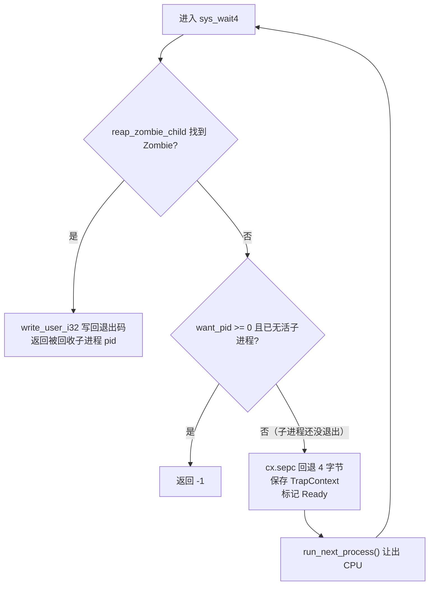
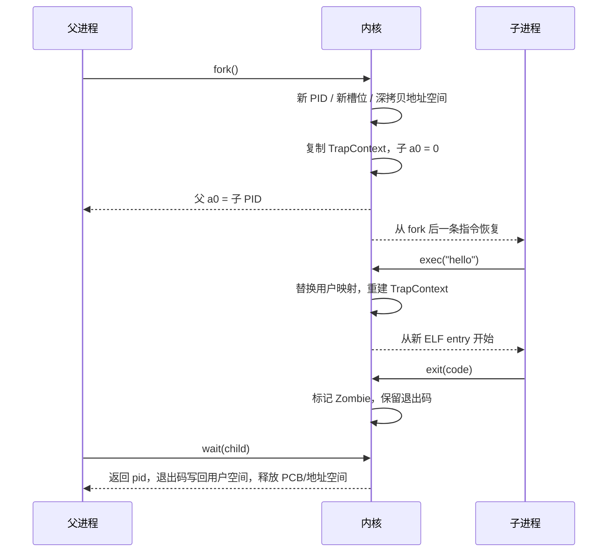

# 实验 4：进程管理

> 相关教材理论：
>
> [第 4 章 · 抽象：进程（P31）](/downloads/ostep-zh.pdf#page=31)
>
> [第 5 章 · 进程 API（P40）](/downloads/ostep-zh.pdf#page=40)

阅读顺序建议：先读第 4 章，理解“进程是运行中的程序”以及进程拥有哪些机器状态；再读第 5 章，理解 `fork` / `wait` / `exec` 的用户态 API 和它们为什么被设计成三个独立调用。PCB、Zombie、`wait4` 等落地细节，OSTEP 第 4–5 章没有完整展开，本手册会在后面结合代码补充。

## 零、开始之前

在开始完成进程管理之前，请确认已完成以下准备：

1. **已完成 Lab3**：理解了虚存、页表、地址空间隔离（见 [Lab3 内存管理](/labs/lab3-memory)）。Lab4 会在 Lab3 的每个用户地址空间之上，再增加“进程身份”和“进程生命周期”。
2. **快速自检**：以下两条命令都能输出版本号，说明环境就绪：
  ```powershell
   rustc --version                    # 预期：rustc 1.96.0 ...
   qemu-system-riscv64 --version      # 预期：QEMU emulator version 11.0.50 ...
  ```
3. **建议先读书**：OSTEP 第 4 章（进程抽象）与第 5 章（进程 API）。Lab4 是**进程抽象与进程 API**的核心实验；对应 feature 为 `lab4`（依赖 `lab3`）。


## 一、问题场景

Lab2 建立了 U-mode / S-mode、trap、系统调用和任务切换；Lab3 又为每个任务建立了独立的虚拟地址空间。到这一步，我们已经有“多个能跑、互相隔离的用户程序”，但它们仍然是一个**编译期写死**的名单：开机时一次性加载 N 个程序，任务数量、启动顺序和退出方式都由 `kernel/src/loader.rs` 里的静态列表决定。

真实操作系统不会这样工作。以 shell 为例，用户在终端里输入一条命令时，shell 并不知道要运行多少个程序、它们什么时候结束；它需要的是“在运行时创建一个新进程、用另一份程序替换它的代码、等它结束并取回结果”的能力。这对应三个经典系统调用：


| API      | 作用       | 本实验要点                                     |
| -------- | -------- | ----------------------------------------- |
| **fork** | 复制当前进程   | 调用一次、返回两次；父进程得到子 PID，子进程得到 0              |
| **exec** | 替换程序镜像   | PID 不变，用户地址空间与入口整体换掉                      |
| **wait** | 等待子进程并回收 | 子进程 `exit` 后先变 Zombie，父进程 `wait` 后才释放 PCB |


Lab3 的任务模型可以概括为“开机加载 → 顺序运行 → 全部退出”；Lab4 要升级为真正的**进程树**：


| 维度   | Lab3 任务        | Lab4 进程                         |
| ---- | -------------- | ------------------------------- |
| 数量   | 编译期固定          | 运行时通过 `fork` 可变                 |
| 创建   | 开机全部加载         | 只启动 `initproc`，之后动态创建           |
| 身份   | 没有独立 PID / PCB | 每个进程有 PID 和 PCB                 |
| 地址空间 | 每任务独立，但启动时固定   | `fork` 深拷贝，`exec` 替换            |
| 退出   | `Exited` 后立即消失 | `exit` 先变 Zombie，等父进程 `wait` 回收 |


也就是说，本实验需要解决**三个核心问题**：

- `fork` 如何做到“调用一次、返回两次”？
- `exec` 如何在不换 PID 的前提下替换程序镜像？
- `wait` 如何回收子进程并避免僵尸进程堆积？

**实验目标**：在本实验内核中实现 `fork` / `exec` / `wait` 与进程控制块（PCB），把 Lab2/3 的固定任务列表升级为以 `initproc` 为根的进程树，跑通 `fork_test`。

## 二、背景知识

本节所有路径都相对 `os-lab/` 根目录。


| 阅读顺序 | 文件                                                                            | 回答的问题                                                  |
| ---- | ----------------------------------------------------------------------------- | ------------------------------------------------------ |
| 1    | `kernel/src/config.rs`、`kernel/src/loader.rs`                                 | lab4 内置哪几个 ELF？`initproc` 是哪一个？                        |
| 2    | `kernel/src/process.rs`                                                       | PCB、进程表、`fork` / `exec` / `wait` / `exit` 在哪里实现？       |
| 3    | `user/src/syscall.rs`、`user/src/bin/fork_test.rs`、`user/src/bin/exec_test.rs` | 用户态如何发出 `fork` / `exec` / `waitpid`？                   |
| 4    | `kernel/src/trap.rs`                                                          | syscall 如何分发到 `sys_fork` / `sys_execve` / `sys_wait4`？ |
| 5    | `kernel/src/mm.rs`                                                            | 地址空间如何被复制、如何被替换？                                       |


### 2.1 任务 vs 进程

先分清两个概念：

- **程序（program）**：磁盘或镜像里的一堆指令和静态数据，例如 lab4 内置的 `fork_test` ELF。程序本身没有运行状态。
- **进程（process）**：一个正在运行的程序实例。除了程序代码，它还有 PID、寄存器现场（TrapContext）、地址空间、调度状态、退出码等运行时状态。

OSTEP 第 4 章把进程状态概括为：**地址空间**、**寄存器（含程序计数器）** 和 **I/O 信息**。本实验的代码里，这些状态主要落在两个地方：

- `TrapContext`：保存进程被切走时“该从哪一条指令继续”以及全部通用寄存器；它在 Lab2 已经见过。
- `ProcessControlBlock`（PCB）：保存 PID、父子关系、调度状态、地址空间编号、退出码等进程元数据；它在 `kernel/src/process.rs` 中定义。

开机时，Lab4 不再把 3 个用户程序全部创建为任务，而是只启动 `initproc`（初始用户进程，PID 1），其余进程由它运行时 `fork` 出来。这里的 **PID（Process ID，进程标识）** 是内核给每个进程分配的唯一编号，代码里由 `ProcessManager.next_pid` 单调递增。

### 2.2 fork

OSTEP 5.1 的关键结论是：`fork()` **调用一次，返回两次**——父进程得到子 PID，子进程得到 0。

从用户态看，`fork_test.rs` 只是调用 `user_lib::fork()`，然后用 `if pid == 0` 区分父子分支。真正“一次调用、两次返回”发生在内核里。

用户态的 `fork()` 在 `user/src/syscall.rs` 中把 `SYS_CLONE` 放进 `a7` 并执行 `ecall`。trap 进入 `kernel/src/trap.rs` 的 `trap_handler` 后，会先调用 `cx.advance_sepc()`，把 `sepc` 从 `ecall` 指令推进到下一条指令，再把 `SYS_CLONE` 分发给 `sys_fork(cx)`。

`sys_fork` 的核心步骤在 `kernel/src/process.rs`：

1. 取出父进程的槽位和地址空间编号。
2. 调用 `pm.alloc_slot()` / `pm.alloc_space_id()` 分配新槽位和新地址空间编号。
3. 调用 `mm::fork_user_space(parent_space, child_space)`，把父进程的用户页**深拷贝**到子地址空间。
4. 复制父进程的 TrapContext，并把子进程副本的返回值设为 0：
  ```rust
   let mut child_trap_cx = *cx;
   child_trap_cx.set_return_value(0);
  ```
5. 调用 `pm.spawn(child_slot, child_space, cx.sepc, Some(parent_slot))`，把父进程当前的 `sepc` 作为子进程入口，并记录父子关系。
6. 把步骤 4 的 `child_trap_cx` 写回子 PCB，设置子进程自己的内核栈顶，标记 `Ready`。
7. 父进程返回 `child_pid as isize`。

为什么子进程不需要从头执行 `main`？因为 `spawn` 收到的是父进程的 `cx.sepc`，也就是 `ecall` 之后的地址；子进程被调度时从同一个地方恢复，看到的寄存器是父进程 TrapContext 的副本，只有 `a0` 被改成了 0。于是父子双方都从 `fork()` 的下一条指令继续，只是靠 `a0` 拿到不同返回值。

### 2.3 exec

OSTEP 5.3：`exec()` 在**当前进程内**替换程序镜像，**PID 不变**。进程身份（PID、父子关系）仍然保留，但用户地址空间和入口全部换成新程序。

用户态 `exec(name)` 在 `user/src/syscall.rs` 中把 `SYS_EXECVE` 放进 `a7`，同时传 `name.as_ptr()`、`name.len()` 和 0。这里不是传 argv 向量，而是传**程序名字符串和字节长度**，方便内核只读取 `len` 字节，避免把相邻字符串误读成一个名字。

`sys_execve` 在 `kernel/src/process.rs` 中做四件事：

1. 通过 `read_user_str` 从用户空间读入程序名。
2. 调用 `get_app_elf_by_name` 找到对应的 ELF。Lab4 内置的可执行名字只有 `fork_test`、`exec_test`、`hello`，定义在 `kernel/src/loader.rs`。
3. 调用 `mm::replace_user_space(space_id, elf)`，销毁旧用户映射，按新 ELF 的 `PT_LOAD` 段建立新映射。
4. 用 `*cx = trap_cx_init(entry, user_sp, kernel_stack_top(slot))` 整体覆盖 TrapContext：`sepc` 指向新入口，`sp` 指向新栈顶，原程序的寄存器现场不再存在。

最后 `sys_execve` 调用 `run_user_task(cx)`，CPU 从新 ELF 的入口开始运行。成功的 `exec` 不会返回原程序；只有查找 ELF 或替换地址空间失败时，`sys_execve` 才返回 `-1`，原程序才会继续执行 `exec()` 之后的代码。

`user/src/bin/exec_test.rs` 正好演示这一点：它先打印 `Before exec`，再 `exec("hello")`。成功时后续的 `After exec` 和 `exit(-1)` 都不会执行，只会看到 hello 输出的 `Hello from user app!`。

### 2.4 进程控制块 PCB

**PCB（Process Control Block，进程控制块）** 是内核维护的“进程身份证”。OSTEP 第 4.5 节提到操作系统用进程列表跟踪所有进程；在本实验里，这张表是 `ProcessManager.slots`，每个元素是 `Option<ProcessControlBlock>`。

`kernel/src/process.rs` 中 PCB 的关键字段：


| 字段                            | 作用                                        |
| ----------------------------- | ----------------------------------------- |
| `pid`                         | 进程标识                                      |
| `parent_slot` / `child_slots` | 父子关系，`None` 表示没有父进程                       |
| `status`                      | `UnInit` / `Ready` / `Running` / `Zombie` |
| `trap_cx`                     | 上下文（fork/exec 的核心）                        |
| `space_id`                    | 关联的地址空间编号                                 |
| `exit_code`                   | 留给 `wait` 读取                              |


`ProcessManager` 还维护 `next_pid`（PID 分配）、`current`（当前运行槽位）和 `process_count`。这里的“槽位”指 `slots` 数组的下标；PCB 的 `parent_slot` / `child_slots` 存的就是这些下标，而不是直接存 PID。内核栈不放在 PCB 内，而是模块级数组 `KERNEL_STACKS[slot]`；fork 时会给子进程写自己的 `trap_cx.kernel_sp`。

进程状态机：


注意 Lab2/3 的 `Exited` 在 Lab4 中变成了 `Zombie`：进程 `exit` 后不立即消失，而是保留 PCB 和退出码，等待父进程来“领结果”。

### 2.5 wait 与僵尸进程

子进程 `exit` 后进入 **Zombie** 状态。`sys_exit` 只做两件事：把退出码写入 PCB，把 `status` 标记为 `Zombie`，然后调用 `run_next_process()` 切走。**它不释放地址空间，也不回收 PCB。**

父进程通过 `waitpid` 回收。用户态 `waitpid(pid, &mut exit_code)` 使用 `SYS_WAIT4`：`a0` 传要等的子 PID，`a1` 传用户提供的退出码指针。内核侧 `sys_wait4` 的逻辑是：



如果还有活子进程但尚未 `exit`，流程会回到 `A` 重新检查；这就是“阻塞等待”在代码里的循环形态。

这里的“阻塞”不是忙等：


| 忙等                | 阻塞（本实验 `sys_wait4`）     |
| ----------------- | ----------------------- |
| 条件不满足时持续占用 CPU 空转 | 条件不满足时保存现场、让出 CPU       |
| 自己反复检查标志位         | 被调度回来时从 `ecall` 重入，再次检查 |
| CPU 被无意义消耗        | 其他进程可以利用这段时间            |


`reap_zombie_child` 才是真正释放资源的地方：它找到符合条件的 Zombie 子进程后，取出 `pid` 和 `exit_code`，把 `pm.slots[i]` 置为 `None`，减少 `process_count`，并调用 `mm::free_user_space` 释放地址空间。

如果父进程从不 `wait`，僵尸进程会一直占着进程表槽位和退出信息。真实 Unix 中 `init` 会收养孤儿进程并负责回收；本实验的简化内核没有实现收养，所以“不 wait 导致僵尸堆积”会表现为槽位不被释放。

### 2.6 把 fork、exec、exit、wait 连成进程生命周期

shell 的典型路径是：自身先 `fork`，子进程再 `exec` 目标程序，父进程用 `wait` 取得退出码并回收资源。这样既保留 shell 本身，又让子进程获得全新的程序镜像。




代码里的关键锚点：


| 生命周期环节 | 用户侧                               | 内核侧                                                                              |
| ------ | --------------------------------- | -------------------------------------------------------------------------------- |
| 创建     | `user/src/syscall.rs` 的 `fork`    | `kernel/src/process.rs` 的 `sys_fork`，`kernel/src/mm.rs` 的 `fork_user_space`      |
| 替换     | `user/src/syscall.rs` 的 `exec`    | `kernel/src/process.rs` 的 `sys_execve`，`kernel/src/mm.rs` 的 `replace_user_space` |
| 退出     | `user/src/syscall.rs` 的 `exit`    | `kernel/src/process.rs` 的 `sys_exit`                                             |
| 回收     | `user/src/syscall.rs` 的 `waitpid` | `kernel/src/process.rs` 的 `sys_wait4` / `reap_zombie_child`                      |


## 三、实验任务

本实验主要相关文件（路径相对 `os-lab/`）：


| 文件                          | 角色                             | 阅读时重点确认                                      |
| --------------------------- | ------------------------------ | -------------------------------------------- |
| `kernel/src/process.rs`     | 进程管理、fork / wait               | PCB、父子槽位、Zombie 与退出码何时保留/释放                  |
| `kernel/src/mm.rs`          | fork 深拷贝、exec 替换地址空间           | `fork_user_space` 与 `replace_user_space` 的边界 |
| `kernel/src/trap.rs`        | fork / exec / wait / getpid 分发 | 父子 `a0`、`sepc` 与调度的先后关系                      |
| `user/src/bin/fork_test.rs` | fork + wait 测例                 | 用户态如何用返回值区分父子                                |
| `user/src/bin/exec_test.rs` | exec 测例                        | 为什么 `After exec` 不应出现                        |
| `user/src/syscall.rs`       | 用户态 syscall 封装                 | 参数与返回值如何遵循 syscall ABI                       |


### 任务一：完成实验

本实验的任务文件为 `kernel/src/process.rs`，请在工作区中打开文件，并根据注释提示完成实验。用户测试程序 `user/src/bin/fork_test.rs` 保持不变。

运行验证：

```powershell
cargo run -p kernel --features lab4 --release
```

**预期输出**（OpenSBI 日志可忽略）：

```text
os-lab kernel lab3: enabling virtual memory...
os-lab kernel lab3: virtual memory ready.
Loading 3 user apps (ELF, lab4 process model)...
  app 0: ... bytes ELF, entry ...
  app 1: ... bytes ELF, entry ...
  app 2: ... bytes ELF, entry ...
I am parent, child_pid=
2
I am child, pid=
2
Process 2 exited with code 0
waited pid done, exit_code=
0
fork_test pass
Process 1 exited with code 0
All processes exited.
```

**通过标准**（四条输出断言缺一不可）：


| 断言                     | 必须看到                    |
| ---------------------- | ----------------------- |
| `parent-output`        | `I am parent`           |
| `child-output`         | `I am child`            |
| `fork-pass`            | `fork_test pass`        |
| `all-processes-exited` | `All processes exited.` |


且 QEMU 正常退出（终端命令返回，没有卡住或报错）。

> 默认 initproc 跑 `fork_test`（`kernel/src/config.rs` 中 `INITPROC_APP_ID = 0`）。`exec_test` 不在默认路径自动跑。可选的 spot-check：把 `INITPROC_APP_ID` 临时改为 `1`，重编后应看到 `Before exec` → `Hello from user app!`，且**没有** `After exec`；验完记得改回 `0`。


### 任务二：阅读理解

任务二为思考题。先合上代码用自己的话写答案，再回到代码逐行核对，不要急着找现成结论。

1. 对照 `sys_fork` 与 `set_return_value(0)`：fork 如何实现「调用一次、返回两次」？子进程 `a0` 为何必须设为 0？
2. 子进程从哪里开始执行？`cx.sepc` 传给 spawn 意味着什么？它和 syscall 前的 `advance_sepc()` 有何关系？
3. 对照 `sys_execve` 与 `trap_cx_init`：exec 如何替换地址空间和 TrapContext？哪些进程身份仍然保留？
4. `exec_test.rs` 里 `exec("hello")` 后的 `println("After exec")` 会执行吗？分别解释 exec 成功和失败两种情况。
5. wait 时子进程未结束，父进程如何阻塞等待？说明“保存上下文 → 让出 CPU → 被唤醒后重试”与忙等的区别。
6. `fork_test.rs` 最后用 `waited == pid && exit_code == 0` 判断通过。为什么 `waitpid` 的返回值和写回的 `exit_code` 不能混用？它们分别来自哪条路径？
7. 为什么 lab4 开机只创建 `initproc`，而不是像 Lab3 一样把 3 个用户程序全部创建为进程？`parent_slot` / `child_slots` 记录了什么？


### 任务三：动手修改

> 下列修改用于加深理解，可在任务一通过后再做。每项改完都运行 `cargo run -p kernel --features lab4` 验证，通过后改回原样。

**修改 1：多 fork 一个孩子**

在 `user/src/bin/fork_test.rs` 的 `main` 中，把“fork 一次、wait 一次”扩展成“fork 两次、分别 wait”。可以用一个数组保存两个子 PID，再逐个 `waitpid` 并校验退出码。

```powershell
cargo run -p kernel --features lab4
```

- 通过标准：能看到两个子进程各自的输出与退出码，并解释进程树如何通过两次 `fork` 长出两个分叉。

**修改 2：故意不 wait（理解性实验）**

在 `user/src/bin/fork_test.rs` 中注释掉父进程的 `waitpid` 调用，让子进程 `exit` 后一直停留在 Zombie 状态。

```powershell
cargo run -p kernel --features lab4
```

- 预期：子进程退出后不被 `reap_zombie_child` 回收，进程表槽位和退出信息继续占用。观察点是 `sys_wait4` / `reap_zombie_child` 是否执行，而不是只看 QEMU 是否打印 `All processes exited.`。
- **做完务必改回并复跑，确认恢复** `fork_test pass`。

**修改 3：子进程 exec("hello")（进阶）**

把 `fork_test.rs` 的子进程分支改为先打印自己的 PID，再调用 `exec("hello")`。exec 成功后，子进程的地址空间和入口会整体换成 hello，原分支里 `exec` 之后的代码不再执行；父进程仍然可以通过 `waitpid` 回收它。

```powershell
cargo run -p kernel --features lab4
```

- 通过标准：能看到 `Hello from user app!`，且没有 `After exec` 之类的原程序后续输出。
- 注意：Lab4 内置 ELF 只有 `fork_test`、`exec_test`、`hello`。如果想把 `exec` 目标换成 `power`，需要先把 `power` 加入 `kernel/src/loader.rs` 的内置列表，属于额外进阶修改。


## 四、验证命令


| 验证项  | 命令                                              | 通过标准                                                                                  |
| ---- | ----------------------------------------------- | ------------------------------------------------------------------------------------- |
| 主编译  | `cargo check -p kernel --features lab4`         | 无 error                                                                               |
| QEMU | `cargo run -p kernel --features lab4 --release` | `I am parent`、`I am child`、`waited pid done`、`fork_test pass`、`All processes exited.` |


全部通过后，Lab4 的 feature 链即可正常交给下一层：下一步是 [Lab5 文件系统与并发](/labs/lab5-fs-and-sync)，对应 feature `lab5`（依赖 `lab4`）。
