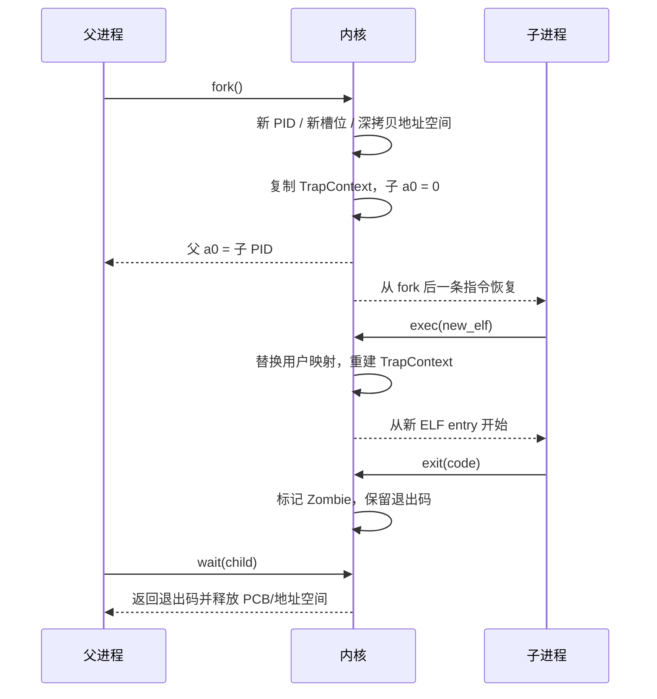

# 实验 4：进程管理

> 相关教材理论：
>
>  [第 4 章 · 抽象：进程（P31）](/downloads/ostep-zh.pdf#page=31)
>
>  [第 5 章 · 进程 API（P40）](/downloads/ostep-zh.pdf#page=40)

## 零、开始之前

在开始完成进程管理之前，请确认已完成以下准备：

1. **已完成 Lab3**：理解了虚存、页表、地址空间隔离（见 [Lab3 内存管理](/labs/lab3-memory)）。
2. **进入工作目录**：在本仓库根目录下，进入自研实验环境目录：
  ```powershell
   cd os-lab
  ```
3. **（可选）激活当前终端环境**：如果你新开了一个终端，请在仓库**根目录**（不是 os-lab 目录）执行以下命令，让本会话能找到 Rust 和 QEMU：
  ```powershell
   . .\scripts\activate-os-env.ps1
   cd os-lab
  ```
4. **快速自检**：以下两条命令都能输出版本号，说明环境就绪：
  ```powershell
   rustc --version          # 预期：rustc 1.96.0 ...
   qemu-system-riscv64 --version   # 预期：QEMU emulator version 11.0.50 ...
  ```

> 如果上面任何一步报"找不到命令"，回到 [环境搭建指南](/setup/environment) 检查安装。

1. **建议先读书**：OSTEP 第 4 章（进程抽象）与第 5 章（进程 API）。Lab4 是**进程抽象与进程 API**的核心实验；对应 feature 为 `lab4`（依赖 `lab3`）。


## 一、问题场景

本实验对接《操作系统导论》里的 **进程抽象** 与 **进程 API**：从「固定数量任务轮转」进化到可动态 `fork` / `exec` / `wait` 的真正进程模型。读懂书中「fork 调用一次、返回两次」，再在内核里把它做出来。

Lab3 能跑固定名单上的用户程序，但仍是**编译期写死**的几个任务——运行时无法动态创建新程序。真实系统（shell）需要：


| API      | 作用       | 本实验要点                      |
| -------- | -------- | -------------------------- |
| **fork** | 复制当前进程   | 调用一次、返回两次（父得子 PID，子得 0）    |
| **exec** | 替换程序镜像   | PID 不变，代码与地址空间整套换掉         |
| **wait** | 等待子进程并回收 | 子 exit 变僵尸，父 wait 后才释放 PCB |


OSTEP 第 5 章把这三者收成 Unix 经典组合。Lab4 把 Lab2/3 的固定任务列表升级为**进程树**：开机只起 `initproc`（PID 1），由它在运行时 fork / exec / wait 动态扩展。

也即本实验需要解决的**三个核心问题**：

- `fork` 如何做到“调用一次、返回两次”？
- `exec` 如何在不换 PID 的前提下替换程序镜像？
- `wait` 如何回收子进程并避免僵尸进程堆积？

**实验目标**：在本实验内核中实现 `fork` / `exec` / `wait` 与进程控制块（PCB），把 Lab2/3 的固定任务列表升级为以 `initproc` 为根的进程树，跑通 `fork_test`。

## 二、背景知识

对应 OSTEP 第 5 章（Process API）。Lab3 的任务模型是编译期固定的 N 个程序；Lab4 引入 **进程**——运行时可 `fork` 创建、`exec` 替换程序、`wait` 回收，形成进程树。

### 2.1 任务 vs 进程


|     | Lab3 任务 | Lab4 进程          |
| --- | ------- | ---------------- |
| 数量  | 编译期固定   | 运行时可变            |
| 创建  | 开机全部加载  | `fork` 动态创建      |
| 结构  | 线性列表    | 树（`initproc` 为根） |


开机只启动 **initproc**（初始用户进程，PID 1），其余进程由它在运行时 fork 出来。这里的 **PID（Process ID，进程标识）** 是内核给每个进程分配的唯一编号。

### 2.2 fork

OSTEP 5.1：`fork()` **调用一次，返回两次**——父进程得到子 PID，子进程得到 0。

内核 `sys_fork` 做的事：

1. 分配新 PID 和槽位
2. `fork_user_space` 深拷贝父进程地址空间
3. 复制父进程 `TrapContext`，子进程 `a0` 设为 0
4. 子进程标 Ready，等调度

子进程从父进程 `fork()` 调用点的**下一条指令**继续（不是从 `main` 重跑）。`trap_handler` 处理 syscall 前已 `advance_sepc()`，故返回时 PC 指向 `ecall` 之后；代码里 `pm.spawn(..., cx.sepc, ...)` 正是把这个 PC 作为子进程入口。这里的 `spawn` 是 `ProcessManager` 内部创建任务的方法。用户代码用 `if (pid == 0)` 区分父子。

### 2.3 exec

OSTEP 5.2：`exec()` 在当前进程内**替换**程序镜像，**PID 不变**。

1. `replace_user_space`：销毁旧用户映射，按新 ELF（Executable and Linkable Format，程序镜像的容器格式）建立映射
2. `*cx = trap_cx_init(entry, sp, ...)`：重置 TrapContext，`sepc` 指向新入口

原程序 `exec()` 之后的代码不会执行——`exec_test` 里 `After exec` 打印不出来是预期行为。

### 2.4 进程控制块 PCB

**PCB（Process Control Block，进程控制块）** 记录进程元数据：


| 字段                            | 作用                       |
| ----------------------------- | ------------------------ |
| `pid`                         | 进程标识                     |
| `parent_slot` / `child_slots` | 父子关系                     |
| `status`                      | Ready / Running / Zombie |
| `trap_cx`                     | 上下文（fork/exec 的核心）       |
| `space_id`                    | 关联地址空间                   |
| `exit_code`                   | 留给 wait 读取               |


内核栈不在 PCB 内，而是模块级 `KERNEL_STACKS[slot]`，fork 时写入子进程的 `trap_cx.kernel_sp`。`ProcessManager` 用槽位数组管理进程，`next_pid` 递增分配 PID。

### 2.5 wait 与僵尸进程

子进程 `exit` 后进入 **Zombie** 状态：保留退出码和 PCB，不再调度，等资源回收。

父进程 `wait`（本实验 `wait4`，即带参数的 wait 变体：指定等待的子进程，并把退出码写到用户提供的地址）：

- 找到 Zombie 子进程 → 读退出码 → 释放地址空间和 PCB
- 子进程尚未 exit → 父进程阻塞（阻塞指进程暂时不参与调度：保存上下文、让出 CPU，被唤醒后重试）

子进程 exit 后父进程从不 wait，僵尸进程会堆积。Unix 中 **init** 会收养孤儿进程并负责回收。

### 2.6 把 fork、exec、exit、wait 连成进程生命周期

shell 的典型路径是：自身先 `fork`，子进程再 `exec` 目标程序，父进程用 `wait` 取得退出码并回收资源。这样既保留 shell 本身，又让子进程获得全新的程序镜像。




其中有两条不变式：

1. **fork 后身份分开、执行点相同**：父子 PID、地址空间和 TrapContext 已独立，但二者都从 `ecall` 后一条指令继续，只靠 `a0` 返回值分支。
2. **exec 后身份不变、执行内容全换**：PID、父子关系仍属于同一进程，但旧用户映射与旧入口不再存在，所以成功的 `exec` 不会返回原程序继续执行。

Zombie 不是仍在运行的进程，而是“等待父进程领取结果”的最小记录。若父进程先结束，init 负责收养并回收孤儿；若长期没人 wait，进程表槽位和退出信息会持续占用。

## 三、实验任务

本实验主要相关文件（路径相对 `os-lab/`）：


| 文件                          | 角色                             | 阅读时重点确认                                      |
| --------------------------- | ------------------------------ | -------------------------------------------- |
| `kernel/src/process.rs`     | 进程管理、fork / wait               | PCB、父子槽位、Zombie 与退出码何时保留/释放                  |
| `kernel/src/mm.rs`          | fork 深拷贝、exec 替换地址空间           | `fork_user_space` 与 `replace_user_space` 的边界 |
| `kernel/src/trap.rs`        | fork / exec / wait / getpid 分发 | 父子 `a0`、`sepc` 与调度的先后关系                      |
| `user/src/bin/fork_test.rs` | fork + wait 测例                 | 用户态如何用返回值区分父子                                |
| `user/src/bin/exec_test.rs` | exec 测例                        | 为什么 `After exec` 不应出现                        |
| `user/src/syscall.rs`       | 用户态 syscall 封装                 | 参数与返回值如何遵循 syscall ABI                       |


> 完整代码走读与参考答案见 [lab4 参考答案](/answers/lab4-answers)。


### 任务一：跑通内核

**第一步：确认变体。** 如果教师通过工作台下发了 debug 变体，先打开 `user/src/bin/fork_test.rs` 文件头，应看到 `【Lab4 任务：排错】`；没有任务标记则用参考实现直接运行。

确认环境已激活，运行以下命令可输出版本号：

```powershell
rustc --version
qemu-system-riscv64 --version
```

运行实验：

```powershell
cargo run -p kernel --features lab4
# 或 release 验证
cargo run -p kernel --features lab4 --release
```

**预期输出**（OpenSBI 日志可忽略）：

```text
os-lab kernel lab3: enabling virtual memory...
os-lab kernel lab3: virtual memory ready.
Loading 3 user apps (ELF, lab4 process model)...
  ...（3 个 app 的 ELF 加载行）...
I am parent, child_pid=
2
I am child, pid=
2
Process 2 exited with code 0
waited pid done, exit_code=
0
fork_test pass
Process 1 exited with code 0
All processes exited.
```

**通过标准**：看到 `fork_test pass`、`I am parent`、`I am child`、`All processes exited.`，且 QEMU 正常退出（终端命令返回，没有卡住或报错）。

> 默认 initproc 跑 `fork_test`。`exec_test` 不在默认路径自动跑，需阅读代码或答案说明。


### 任务二：阅读理解

参考答案见 [lab4 参考答案](/answers/lab4-answers)。

1. 对照 `sys_fork` 与 `set_return_value(0)`：fork 如何实现「调用一次、返回两次」？子进程 `a0` 为何必须设为 0？
2. 子进程从哪里开始执行？`cx.sepc` 传给 spawn 意味着什么？它和 syscall 前的 `advance_sepc()` 有何关系？
3. 对照 `sys_execve` 与 `trap_cx_init`：exec 如何替换地址空间和 TrapContext？哪些进程身份仍然保留？
4. `exec_test.rs` 里 `exec("hello")` 后的 `println("After exec")` 会执行吗？分别解释 exec 成功和失败两种情况。
5. wait 时子进程未结束，父进程如何阻塞等待？说明“保存上下文 → 让出 CPU → 被唤醒后重试”与忙等的区别。


### 任务三：动手修改

**修改 1：多 fork 一个孩子**

父进程两次 fork，并分别 wait。

```powershell
cargo run -p kernel --features lab4
```

- 通过标准：能看到两个子进程各自的输出与退出码。

**修改 2：故意不 wait（理解性实验）**

子进程 exit，父进程注释掉 waitpid。

```powershell
cargo run -p kernel --features lab4
```

- 预期：子进程停留在 Zombie 状态，进程表槽位未被回收。
- **做完务必改回并复跑，确认恢复** `fork_test pass`。

**修改 3：子进程 exec("power")（进阶）**

观察「换身」后出现 power 的输出。

```powershell
cargo run -p kernel --features lab4
```

- 通过标准：能看到 `409684505` 等 power 程序输出，并解释 exec 后原程序代码不再继续执行。


## 四、验证命令


| 验证项  | 命令                                              | 通过标准                                                                                  |
| ---- | ----------------------------------------------- | ------------------------------------------------------------------------------------- |
| 主编译  | `cargo check -p kernel --features lab4`         | 无 error                                                                               |
| QEMU | `cargo run -p kernel --features lab4 --release` | `I am parent`、`I am child`、`waited pid done`、`fork_test pass`、`All processes exited.` |
