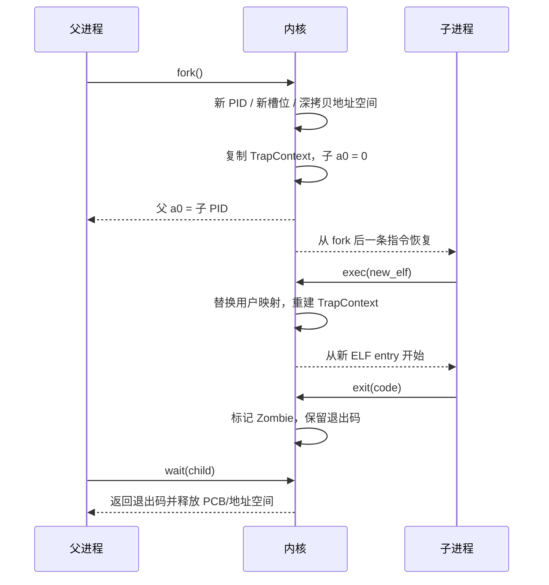

# 实验 4：进程管理

> 对应 feature：`lab4`（依赖 `lab3`）。

> **配套教材**（《操作系统导论》OSTEP 中译）：[第 4 章 · 抽象：进程（PDF 第 31 页）](/downloads/ostep-zh.pdf#page=31) · [第 5 章 · 进程 API（PDF 第 40 页）](/downloads/ostep-zh.pdf#page=40) · [全书入口](/downloads/ostep-zh.pdf)

本实验对接《操作系统导论》里的 **进程抽象** 与 **进程 API**：从「固定数量任务轮转」进化到可动态 `fork` / `exec` / `wait` 的真正进程模型。读懂书中「fork 调用一次、返回两次」，再在内核里把它做出来。

## 零、开始之前

1. **已完成 Lab3**：理解了虚存、页表、地址空间隔离（见 [Lab3 内存管理](/labs/lab3-memory)）。
2. **进入工作目录**：`cd os-lab`，如果启用了新的终端需要先 `. .\scripts\activate-os-env.ps1` 激活环境。
3. **自检**：`rustc --version` 与 `qemu-system-riscv64 --version` 能输出版本。
4. **建议先读书**：OSTEP 第 5 章（Process API）。动手前务必理解 fork「调用一次、返回两次」。

## 一、问题场景

Lab3 能跑固定名单上的用户程序，但仍是**编译期写死**的几个任务——运行时无法动态创建新程序。真实系统（shell）需要：

| API | 作用 | 本实验要点 |
| --- | --- | --- |
| **fork** | 复制当前进程 | 调用一次、返回两次（父得子 PID，子得 0） |
| **exec** | 替换程序镜像 | PID 不变，代码与地址空间整套换掉 |
| **wait** | 等待子进程并回收 | 子 exit 变僵尸，父 wait 后才释放 PCB |

OSTEP 第 5 章把这三者收成 Unix 经典组合。Lab4 把 Lab2/3 的固定任务列表升级为**进程树**：开机只起 `initproc`（PID 1），由它在运行时 fork / exec / wait 动态扩展。


## 二、背景知识

对应 OSTEP 第 5 章（Process API）。Lab3 的任务模型是编译期固定的 N 个程序；Lab4 引入 **进程**——运行时可 `fork` 创建、`exec` 替换程序、`wait` 回收，形成进程树。

### 2.1 任务 vs 进程

| | Lab3 任务 | Lab4 进程 |
| --- | --- | --- |
| 数量 | 编译期固定 | 运行时可变 |
| 创建 | 开机全部加载 | `fork` 动态创建 |
| 结构 | 线性列表 | 树（`initproc` 为根） |

开机只启动 **initproc**（PID 1），其余进程由它在运行时 fork 出来。

### 2.2 fork

OSTEP 5.1：`fork()` **调用一次，返回两次**——父进程得到子 PID，子进程得到 0。

内核 `sys_fork` 做的事：

1. 分配新 PID 和槽位
2. `fork_user_space` 深拷贝父进程地址空间
3. 复制父进程 `TrapContext`，子进程 `a0` 设为 0
4. 子进程标 Ready，等调度

子进程从父进程 `fork()` 调用点的**下一条指令**继续（不是从 `main` 重跑）。`trap_handler` 处理 syscall 前已 `advance_sepc()`，故返回时 PC 指向 `ecall` 之后。用户代码用 `if (pid == 0)` 区分父子。

### 2.3 exec

OSTEP 5.2：`exec()` 在当前进程内**替换**程序镜像，**PID 不变**。

1. `replace_user_space`：销毁旧用户映射，按新 ELF 建立映射
2. `*cx = trap_cx_init(entry, sp, ...)`：重置 TrapContext，`sepc` 指向新入口

原程序 `exec()` 之后的代码不会执行——`exec_test` 里 `After exec` 打印不出来是预期行为。

### 2.4 wait 与僵尸进程

子进程 `exit` 后进入 **Zombie** 状态：保留退出码和 PCB，不再调度，等资源回收。

父进程 `wait`（本实验 `wait4`）：

- 找到 Zombie 子进程 → 读退出码 → 释放地址空间和 PCB
- 子进程尚未 exit → 父进程阻塞（保存上下文、让出 CPU、被唤醒后重试）

子进程 exit 后父进程从不 wait，僵尸进程会堆积。Unix 中 **init** 会收养孤儿进程并负责回收。

### 2.5 进程控制块 PCB

**ProcessControlBlock** 记录进程元数据：

| 字段 | 作用 |
| --- | --- |
| `pid` | 进程标识 |
| `parent_slot` / `child_slots` | 父子关系 |
| `status` | Ready / Running / Zombie |
| `trap_cx` | 上下文（fork/exec 的核心） |
| `space_id` | 关联地址空间 |
| `exit_code` | 留给 wait 读取 |

内核栈不在 PCB 内，而是模块级 `KERNEL_STACKS[slot]`，fork 时写入子进程的 `trap_cx.kernel_sp`。`ProcessManager` 用槽位数组管理进程，`next_pid` 递增分配 PID。

### 2.6 把 fork、exec、exit、wait 连成进程生命周期

远端复核版给出了每个 API 的精确定义，本地版则更强调它们为什么必须组合使用。shell 的典型路径是：自身先 `fork`，子进程再 `exec` 目标程序，父进程用 `wait` 取得退出码并回收资源。这样既保留 shell 本身，又让子进程获得全新的程序镜像。



其中有两条不变式：

1. **fork 后身份分开、执行点相同**：父子 PID、地址空间和 TrapContext 已独立，但二者都从 `ecall` 后一条指令继续，只靠 `a0` 返回值分支。
2. **exec 后身份不变、执行内容全换**：PID、父子关系仍属于同一进程，但旧用户映射与旧入口不再存在，所以成功的 `exec` 不会返回原程序继续执行。

Zombie 不是仍在运行的进程，而是“等待父进程领取结果”的最小记录。若父进程先结束，init 负责收养并回收孤儿；若长期没人 wait，进程表槽位和退出信息会持续占用。

## 三、实验任务

> **本实验怎么学**：先 `cargo run --features lab4` 看 `fork_test` 输出，再对照 OSTEP 第 5 章读 `process.rs`、`mm.rs` 中 fork/exec/wait 实现。

主要文件（路径相对 `os-lab/`）：

| 文件 | 角色 | 阅读时重点确认 |
| --- | --- | --- |
| `kernel/src/process.rs` | 进程管理、fork / wait | PCB、父子槽位、Zombie 与退出码何时保留/释放 |
| `kernel/src/mm.rs` | fork 深拷贝、exec 替换地址空间 | `fork_user_space` 与 `replace_user_space` 的边界 |
| `kernel/src/trap.rs` | fork / exec / wait / getpid 分发 | 父子 `a0`、`sepc` 与调度的先后关系 |
| `user/src/bin/fork_test.rs` | fork + wait 测例 | 用户态如何用返回值区分父子 |
| `user/src/bin/exec_test.rs` | exec 测例 | 为什么 `After exec` 不应出现 |
| `user/src/syscall.rs` | 用户态 syscall 封装 | 参数与返回值如何遵循 syscall ABI |

> 完整走读见 [lab4 参考答案](/answers/lab4-answers)。


### 任务一：跑通 lab4

```powershell
cargo run -p kernel --features lab4
```

**预期输出**（OpenSBI 日志可忽略）：

```text
I am parent, child_pid=2
I am child, pid=2
waited pid done, exit_code=0          ← fork_test 的 wait 输出（中间行）
Process 2 exited with code 0
fork_test pass
Process 1 exited with code 0
All processes exited.
```

**通过标准**：看到 `fork_test pass`、`I am parent`、`I am child`、`All processes exited.`，QEMU 正常退出。

> 默认 initproc 跑 `fork_test`。`exec_test` 不在默认路径自动跑，需阅读代码或答案说明。


### 任务二：阅读理解（必做）

参考答案见 [lab4 参考答案](/answers/lab4-answers)。

1. 对照 `sys_fork` 与 `set_return_value(0)`：fork 如何实现「调用一次、返回两次」？子进程 `a0` 为何必须设为 0？
2. 子进程从哪里开始执行？`cx.sepc` 传给 spawn 意味着什么？它和 syscall 前的 `advance_sepc()` 有何关系？
3. 对照 `sys_execve` 与 `trap_cx_init`：exec 如何替换地址空间和 TrapContext？哪些进程身份仍然保留？
4. `exec_test.rs` 里 `exec("hello")` 后的 `println("After exec")` 会执行吗？分别解释 exec 成功和失败两种情况。
5. wait 时子进程未结束，父进程如何阻塞等待？说明“保存上下文 → 让出 CPU → 被唤醒后重试”与忙等的区别。


### 任务三：动手小修改

**修改 1：多 fork 一个孩子**  
父进程两次 fork，分别 wait。——体会进程树。

**修改 2：故意不 wait（理解性实验）**  
子进程 exit，父进程注释掉 waitpid。——观察僵尸；做完改回。

**修改 3：子进程 exec("power")（进阶）**  
观察「换身」后出现 power 的输出（如 `409684505`）。

### 提交清单（自查）

- [ ] `cargo run -p kernel --features lab4` 输出 `fork_test pass`、`All processes exited.`
- [ ] 能说明 fork 复制了哪些状态（地址空间、TrapContext、PID 关系）
- [ ] 能解释 exec 与 fork 的分工（为何不能合并成一个 spawn）
- [ ] 能说明僵尸进程与 wait 回收流程
- [ ] 完成任务二 5 道阅读理解（对照答案自查）

## 四、验证

| 验证项 | 命令 | 通过标准 |
| --- | --- | --- |
| 主编译 | `cargo check -p kernel --features lab4` | 无 error |
| QEMU | `cargo run -p kernel --features lab4 --release` | `I am parent`、`I am child`、`waited pid done`、`fork_test pass`、`All processes exited.` |

手册交互清单见 handbook「Lab4 进程管理」页（`handbook/data/labs.json`）。

## 五、AI 提问模板

1. **概念澄清型**：「《操作系统导论》为什么把 fork 设计成返回两次？若只允许返回一次会怎样？」
2. **现象解释型**：「子进程 getpid 和父进程一样，可能和 TrapContext 复制有关吗？」（提示：用于排查是否混淆了 fork 语义——正常时子 pid 与父 pid 不同。）
3. **代码追因型**：「`sys_execve` 为何整个覆盖 TrapContext？」
4. **对比深化型**：「为何 fork 与 exec 要分开，而不是一个 spawn？」
5. **动手探索型**：「真要做 shell，lab4 还缺管道、信号吗？」

## 六、思考题与参考答案

完整答案与代码走读见 [lab4 参考答案](/answers/lab4-answers)。

### 习题 1（fork 返回两次）

**fork 为何必须「调用一次、返回两次」？子进程返回值为何是 0 而不是父 PID？**

参考答案：一次 syscall 陷入内核后，父、子各有独立 TrapContext 与调度槽位。父进程在 `sys_fork` 中把子 PID 写入父的 `a0`；子进程复制父上下文后将 `a0` 覆写为 0，便于用户态用 `if (pid == 0)` 分支。子若返回父 PID 则无法与「fork 失败返回 -1」区分，也破坏 Unix 惯例。

