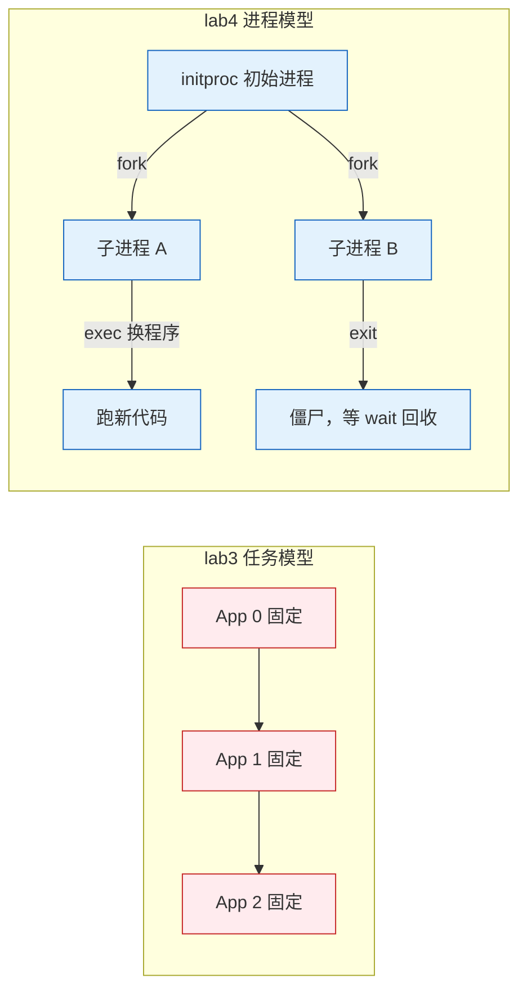
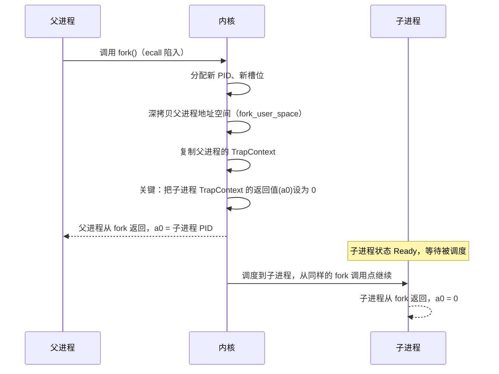
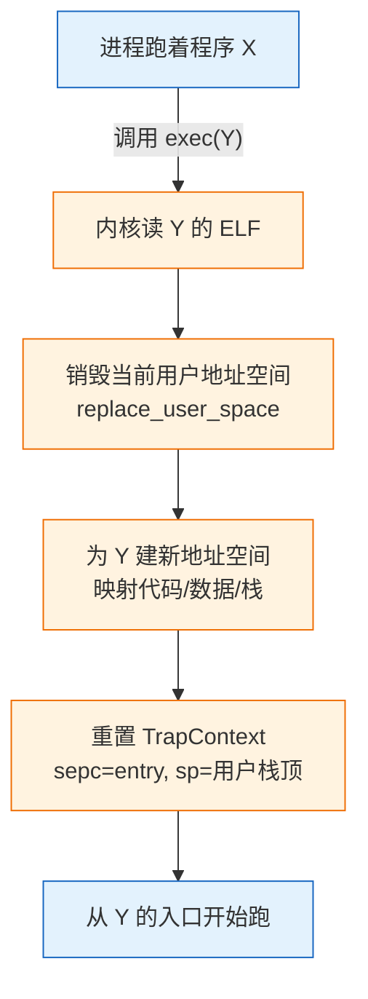
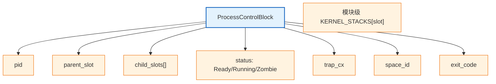

# 实验 4：进程管理

> 对应 feature：`lab4`（依赖 `lab3`）。

本实验对接《操作系统导论》里的 **进程抽象** 与 **进程 API**：从「固定数量任务轮转」进化到可动态 `fork` / `exec` / `wait` 的真正进程模型。读懂书中「fork 调用一次、返回两次」，再在内核里把它做出来。

## 零、开始之前

1. **已完成 Lab3**：理解了虚存、页表、地址空间隔离（见 [lab3-memory.md](lab3-memory.md)）。
2. **进入工作目录**：`cd os-lab`，如果启用了新的终端需要先 `. .\scripts\activate-os-env.ps1` 激活环境。
3. **自检**：`rustc --version` 与 `qemu-system-riscv64 --version` 能输出版本。
4. **建议先读书**：《操作系统导论》的《进程 API》一章。动手前务必精读，尤其是 fork「调用一次返回两次」。

## 一、问题场景

Lab3 结束后，你已经有了用户态、系统调用、调度，还有按程序隔离的地址空间。可开机时内核仍然只能跑**事先打包进来、数量固定**的几个程序——`hello` / `power` / `yield` 编进镜像，按固定名单轮流跑完就结束。

打开《操作系统导论》的 **进程** 与 **进程 API** 章节，你会发现真实的系统远不止「跑几个预置程序」：

- 用户可以随时启动新程序；
- 一个程序可以再拉起另一个程序；
- 父程序往往要知道子程序是否结束、退出码是多少。

这些能力，正是 shell（命令行）乃至整个 Unix 用户态世界的地基。对照现状，三个问题立刻浮现：

- **新进程从哪来？**  
你在 shell 里敲一行命令，系统就要「当场多出一个正在跑的程序」。Lab3 的名单却是编译期写死的——运行时没法凭空变出第 4、第 5 个程序。教材对应的接口是 `fork`**：复制当前进程**，得到一个几乎一样的子进程。
- **一个进程如何「换成」另一个程序？**  
shell 自己通常不会去实现 `ls` 的全部逻辑，而是让子进程**变成** `ls` 再跑。最自然的做法不是永远再开一个无关进程，而是**原地替换**当前进程的代码与地址空间，同时保留进程身份（如 PID、父子关系）。教材对应的是 `exec`**（本实验里常见为 execve）**——常被说成「换身不换魂」。
- **父进程如何得知子进程结束？**  
shell 启动了子进程之后，常常要等它跑完，拿到退出码，再打印提示符、执行下一命令。若子进程结束了却没人收拾，还会留下**僵尸进程**，占着内核里的进程记录。教材对应的是 `wait`：等待并回收子进程。

Unix / 《操作系统导论》把这三件事收成一套经典组合，也是本实验要亲手接通的核心：


| API      | 一句话直觉      | 本实验要体会的点                    |
| -------- | ---------- | --------------------------- |
| **fork** | 复制出子进程     | 「调用一次，返回两次」（父拿到子 PID，子拿到 0） |
| **exec** | 换成另一个程序继续跑 | PID 等身份不变，代码与地址空间整套换掉       |
| **wait** | 等孩子结束并善后   | 先变成僵尸留下退出码，父 wait 后才真正释放    |


学完后，你的内核就从「能跑几个预置任务」升级成教材里的 **进程树 + 进程 API**：开机可以只起一个 `initproc`，再由它在运行时 fork / exec / wait，动态长出一棵进程树。

> 一句话记住本实验：把 Lab2/3 的「能跑几个程序」，升级成教材里可以动态创建、替换与等待的进程模型。


## 二、背景知识


### 2.1 进程 vs 任务：从静态到动态

> 先想：lab3「任务」和 lab4「进程」本质差在哪？




- **lab3 任务**：开机打包 N 个程序，固定数量与顺序。
- **lab4 进程**：开机只起 `initproc`，运行时 fork 出子进程，形成**进程树**——这正是教材里的进程模型。


### 2.2 fork：调用一次，返回两次

> 先想：复制什么？同一个调用如何在父进程返回 PID、在子进程返回 0？




关键点（与教材一致）：

- **子进程不是从 main 开头跑**，而是从父进程 `fork` 调用点的**下一条**继续（TrapContext 是副本，`sepc` 相同）。
- **用 a0 区分返回值**：子进程 a0=0，父进程 a0=子 PID。于是用户代码可写 `if (pid == 0) { ... } else { ... }`。


### 2.3 exec：换身不换魂

> 先想：进程还在跑，如何抽掉脚下的地址空间再换一套？




- **PID 不变**：不创建新进程，只换代码与地址空间。
- `exec` **之后的代码不会执行**：TrapContext 被整体重置，`sepc` 指向新入口——所以 `exec_test` 里 `After exec` 打印不出来。这正是教材语义。


### 2.4 wait 与僵尸进程：资源的善后

> 先想：子进程退出后，退出码如何交给父进程？资源何时释放？


- 子进程 `exit` 时进入 **Zombie**：保留退出码，不再调度，暂不释放全部资源。
- 父进程 `wait` 成功后才真正回收地址空间与 PCB。
- 从不 wait → 僵尸堆积（内存泄漏）。真实系统里常由 init 回收孤儿进程。


### 2.5 进程控制块 PCB：进程的「身份证」

> 先想：PCB 要记哪些字段？




内核栈不在 PCB 字段里，而在模块级 `KERNEL_STACKS`，按槽位写入 `trap_cx.kernel_sp`。`ProcessManager` 用槽位数组管理 PCB，`next_pid` 保证 PID 唯一。

## 三、实验任务

> fork/exec/wait 是 trap + 虚存 + 调度的综合题。先对照教材猜实现，再读代码。


| 文件                          | 角色               | 先想「如果是我会怎么设计」               |
| --------------------------- | ---------------- | --------------------------- |
| `kernel/src/process.rs`     | 进程管理核心           | PCB？fork 怎么复制？wait 怎么收僵尸？   |
| `kernel/src/mm.rs`          | 地址空间（lab4 扩展）    | fork 深拷贝什么？exec 替换什么？       |
| `kernel/src/trap.rs`        | trap 分发（lab4 扩展） | fork/exec/wait/getpid 怎么分发？ |
| `user/src/bin/fork_test.rs` | fork 测试          | 如何用返回值区分父子？                 |
| `user/src/bin/exec_test.rs` | exec 测试          | exec 后原代码还会跑吗？              |
| `user/src/syscall.rs`       | 用户态封装            | 用户态如何发起这些调用？                |


> 完整解读见 `labs/answers/lab4-answers.md`。


### 任务一：跑通 lab4

```powershell
cargo run -p kernel --features lab4
```

**预期输出**（OpenSBI 日志可忽略）：

```text
I am parent, child_pid=2
I am child, pid=2
Process 2 exited with code 0
fork_test pass
Process 1 exited with code 0
All processes exited.
```

**通过标准**：看到 `fork_test pass`、`I am parent`、`I am child`、`All processes exited.`，QEMU 正常退出。

> 默认 initproc 跑 `fork_test`。`exec_test` 不在默认路径自动跑，需阅读代码或答案说明。


### 任务二：阅读理解与思考题（必做）

每道题建议**先合上代码想答案，再打开对照**；**参考答案见** `labs/answers/lab4-answers.md`。

1. fork 如何实现「一次调用返回两次」？为何子进程 a0 要单独设为 0？（对照 `sys_fork` 与 `set_return_value(0)`）
2. 子进程从哪里开始执行？`cx.sepc` 传给 `spawn` 意味着什么？
3. exec 如何改地址空间与 TrapContext？为何 exec 之后的原代码跑不到？（对照 `sys_execve` 与 `trap_cx_init`）
4. `exec_test.rs` 里 `exec("hello")` 后的 `println("After exec")` 会执行吗？为什么？
5. wait 时子进程未结束，父进程如何「等」？`loop` + `run_next_process` 是什么模式？这种「条件不满足就让出 CPU」叫什么？

> 能讲清「fork → 子进程跑 → exit 变僵尸 → wait 回收」，lab4 就过关了。


### 任务三：动手小修改

**修改 1：多 fork 一个孩子**  
父进程两次 fork，分别 wait。——体会进程树。

**修改 2：故意不 wait（理解性实验）**  
子进程 exit，父进程注释掉 waitpid。——观察僵尸；做完改回。

**修改 3：子进程 exec("power")（进阶）**  
观察「换身」后出现 power 的输出（如 `409684505`）。

## 四、验证

以 `cargo run -p kernel --features lab4` 输出 `fork_test pass`、`I am parent`、`I am child`、`All processes exited.` 并正常退出为主要标准。

## 五、AI 提问模板

1. **概念澄清型**：「《操作系统导论》为什么把 fork 设计成返回两次？若只允许返回一次会怎样？」
2. **现象解释型**：「子进程 getpid 和父进程一样，可能和 TrapContext 复制有关吗？」
3. **代码追因型**：「`sys_execve` 为何整个覆盖 TrapContext？」
4. **对比深化型**：「为何 fork 与 exec 要分开，而不是一个 spawn？」
5. **动手探索型**：「真要做 shell，lab4 还缺管道、信号吗？」

