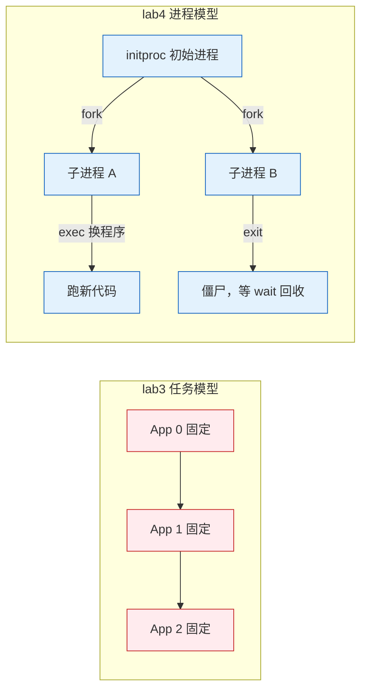
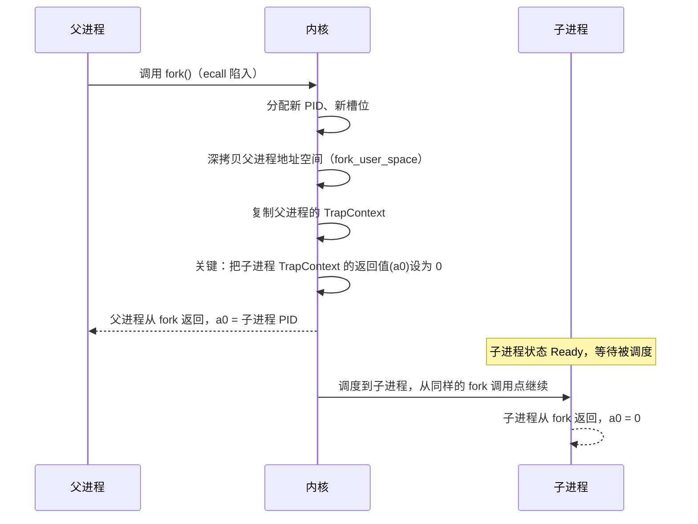
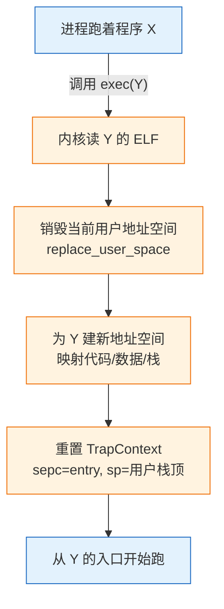
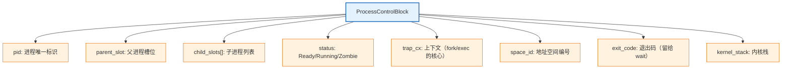

# 实验 4：进程管理

> 对应 feature：`lab4`（依赖 `lab3`）。从"固定数量的任务轮转"进化到"动态创建、可以像 shell 一样 fork 出子进程、exec 换程序、wait 等待"的真正进程模型。这是操作系统从"教学玩具"走向"能跑 shell"的关键一步。

## 零、开始之前

1. **已完成 Lab3**：理解了虚存、页表、地址空间隔离（见 [lab3-memory.md](lab3-memory.md)）。
2. **进入工作目录**：`cd os-lab`，必要时先 `. .\scripts\activate-os-env.ps1` 激活环境。
3. **自检**：`rustc --version` 与 `qemu-system-riscv64 --version` 能输出版本。
4. **建议先读书**：OSTEP 第 5 章《进程 API》是本实验的理论原文，动手前务必精读，特别是 fork"调用一次返回两次"的讲解。

## 一、问题场景

到目前为止（lab1-3），你的内核只能跑**固定数量、预编译进来**的程序——lab3 把 hello/power/yield 三个程序打包进内核镜像，开机按固定顺序跑。但如果你是真实操作系统的设计者，这远远不够：

- **shell 怎么实现？** 你敲一行命令，shell 要"创建一个新进程"来跑它。可你的内核现在没法在运行时凭空变出新程序——程序数是固定的。
- **一个程序怎么"换"成另一个？** shell 跑完 `ls` 想接着跑 `cat`，最自然的做法是"原地换掉当前进程的代码"，而不是开个新进程。可"换代码"具体怎么操作？
- **父进程怎么知道子进程跑完了？** shell 启动了 `ls`，它得等 `ls` 跑完拿到退出码才能继续。这个"等待"怎么实现？

如果你来设计，会怎么做？Unix 给出了优雅的三件套，也是本实验的核心：

- **fork**：复制当前进程，"变出"一个几乎一模一样的子进程。
- **exec**：把当前进程的代码替换成另一个程序，"换身"不换魂（进程还是那个进程，PID 不变，但跑的代码变了）。
- **wait**：父进程阻塞，等子进程结束并回收它的资源。

这套机制是 Unix 哲学的基石——shell、管道、作业控制全都建立在它之上。本实验带你实现这三者，让你的内核真正具备"动态进程"能力。

## 二、背景知识

### 2.1 进程 vs 任务：从静态到动态

> 🤔 **先想**：lab3 的"任务"和 lab4 的"进程"有什么本质区别？lab3 的三个 app 是开机前就定死的，那"进程"应该多了什么能力？



- **lab3 任务**：开机时把 N 个程序打包进内核，固定数量、固定顺序，跑完即止。
- **lab4 进程**：开机只起一个 `initproc`（初始进程），它在运行时通过 fork 动态创建子进程，子进程又能继续 fork/exec。进程数不固定，形成**进程树**。

### 2.2 fork：调用一次，返回两次

> 🤔 **先想**：fork 要"复制当前进程"。复制什么？代码、数据、栈、寄存器？更难的：fork 是一个函数调用，它要在父进程返回子进程的 PID，在子进程返回 0。同一个函数调用怎么能返回两次不同的值？你会怎么设计？

fork 的精髓就藏在这个"返回两次"里：



关键点：
- **子进程不是从 main 开始跑**，而是从父进程调用 fork 的那条指令的**下一条**继续——因为子进程的 TrapContext 是父进程的副本，`sepc` 指向同一个地方。
- **返回值靠 a0 寄存器区分**：内核在拷贝 TrapContext 后，把子进程的 a0 改成 0，父进程的 a0 保持子进程 PID。这就是"一个调用返回两次"的实现技巧。

### 2.3 exec：换身不换魂

> 🤔 **先想**：exec 要"把当前进程的代码换成另一个程序"。但进程还在跑，你要怎么把"脚下的地"抽掉再换一块？地址空间、寄存器、栈怎么处理？

exec 的做法是"整体替换"：



- **PID 不变**：exec 不创建新进程，只是给现有进程"换一套代码"。所以进程的身份（PID、父子关系）保留。
- **返回点消失了**：exec 把 TrapContext 整个重置，从新程序的入口开始跑——这意味着原程序里 `exec()` 之后的代码**永远不会执行**（因为 sepc 被改了）。这正是为什么 `exec_test` 里 `After exec` 那行打印不出来。

### 2.4 wait 与僵尸进程：资源的善后

> 🤔 **先想**：子进程跑完后如果直接消失，它的退出码父进程怎么拿到？如果父进程还没 wait，子进程的地址空间、PCB 占的内存怎么办——立刻释放还是留着？留着的话子进程处于什么状态？

这里有个经典问题：**僵尸进程（Zombie）**。


- 子进程 `exit` 时**不能立刻释放资源**——因为父进程还要拿它的退出码。所以它进入 `Zombie` 状态：PCB 留着、退出码留着，但不再被调度。
- 父进程调用 `wait` 时，遍历找处于 Zombie 的子进程，取出退出码，**这时才真正释放**它的地址空间和 PCB。
- 如果父进程从不 wait，子进程就永远僵尸——内存泄漏。真实系统里 init 进程会负责回收孤儿进程。

### 2.5 进程控制块 PCB：进程的"身份证"

> 🤔 **先想**：一个进程要记录哪些信息？PID、状态、地址空间、父子关系、退出码……你会怎么组织这个结构体？

本实验的 PCB（`ProcessControlBlock`）字段：



`ProcessManager` 用一个槽位数组管理所有 PCB，`next_pid` 单调递增保证 PID 唯一。

## 三、实验任务

> **本实验怎么学**：进程管理是 lab1-3 所有机制的综合应用（trap + 虚存 + 调度都参与），代码已为你准备好完整可运行版本。这里**更要先想再对照**：fork/exec/wait 的每个机制都先自己猜"如果是我会怎么实现"，再去看已有实现。尤其 fork 的"返回两次"和 exec 的"换身"，是 Unix 最精妙的设计，值得反复琢磨。

lab4 涉及的代码分布在这些文件，先浏览建立印象：

| 文件 | 角色 | 先想"如果是我会怎么设计" |
|------|------|-------------------------|
| `kernel/src/process.rs` | 进程管理核心 | PCB 字段怎么定？fork 怎么复制？wait 怎么回收僵尸？ |
| `kernel/src/mm.rs` | 地址空间（lab4 扩展） | fork 要深拷贝什么？exec 要替换什么？ |
| `kernel/src/trap.rs` | trap 分发（lab4 扩展） | 新增的 fork/exec/wait/getpid syscall 怎么分发？ |
| `user/src/bin/fork_test.rs` | fork 测试程序 | 怎么用 fork + 返回值区分父子？ |
| `user/src/bin/exec_test.rs` | exec 测试程序 | exec 之后原来的代码还会跑吗？ |
| `user/src/syscall.rs` | 用户态 syscall 封装 | fork/exec/wait 在用户态怎么发起？ |

> 提示：本实验不给完整代码讲解。每个文件"为什么这么写"请结合【背景知识】自己想明白。完整代码解读见 `labs/answers/lab4-answers.md`，**强烈建议先自己想完再对照答案**。

本实验分为三档任务：

### 任务一：跑通 lab4（必做）

```powershell
cargo run -p kernel --features lab4
```

**预期输出**（前面约 40 行 OpenSBI 日志可忽略，以下是内核与进程部分）：

```text
I am parent, child_pid=2               ← 父进程：fork 返回子进程 PID 2
I am child, pid=2                      ← 子进程：getpid 得到 2
Process 2 exited with code 0           ← 子进程 exit，变 Zombie
fork_test pass                         ← 父进程 wait 成功，退出码匹配
Process 1 exited with code 0
All processes exited.                  ← 全部回收，关机
```

**通过标准**：看到 `fork_test pass`、`I am parent`、`I am child`、`All processes exited.`，且 QEMU 正常退出（exit code 0）。

> 注意：默认 initproc 跑的是 `fork_test`。`exec_test` 是单独验证的程序（见任务二第 4 题），不在这条默认路径里自动运行。如果你想看 exec 的效果，需要阅读代码理解 initproc 如何选择测试程序，或参考答案文件里的说明。

### 任务二：阅读理解（必做）

每道题**先合上代码，自己猜一个答案，再打开代码对照**：

1. 打开 `sys_fork` 前，先想：fork 要让"一次调用返回两次"，你会怎么实现？然后看代码里 `child_trap_cx.set_return_value(0)`——为什么子进程的返回值要单独设成 0？父进程的返回值从哪来？
2. 打开 `sys_fork` 前，再想：fork 复制父进程，子进程会从哪里开始执行？是 main 开头还是 fork 调用点？看代码里 `cx.sepc` 传给 spawn 意味着什么。
3. 打开 `sys_execve` 前，先想：exec 要"换掉当前进程的代码"，你会怎么改地址空间和 TrapContext？然后看代码里 `replace_user_space` 和 `*cx = trap_cx_init(...)`——为什么 exec 后原来的代码（比如 `After exec`）再也跑不到？
4. 打开 `exec_test.rs` 前，先想：`exec("hello")` 之后紧接着的 `println("After exec")` 会不会执行？为什么？然后对照代码和答案验证。
5. 打开 `sys_wait4` 前，先想：wait 要等子进程结束，可子进程可能还没退出。你会让父进程怎么"等"？看代码里的 `loop` + `run_next_process`——这种"找不到就主动让出 CPU、下次再来"的模式叫什么？

> 学习提示：这 5 题串起来是"一次 fork + exec + wait 的完整进程生命周期"。能把"父进程 fork → 子进程跑 → 子进程 exit 变僵尸 → 父进程 wait 回收"这条链路从头讲到尾，lab4 就过关了。

### 任务三：动手小修改（选做，建议完成）

**修改 1：让 fork_test 多生一个孩子**

在 `fork_test.rs` 里，fork 一次后再 fork 一次，让父进程有两个子进程，分别 wait 它们。

- 通过标准：看到两个子进程的输出，父进程两次 wait 都成功。
- 这个练习让你体会"进程树"是怎么长出来的。

**修改 2：观察僵尸进程（理解性实验）**

在 `fork_test.rs` 里，让子进程先 exit，但父进程**故意不 wait**（注释掉 waitpid 那行），直接 exit。重新跑。

- 预期现象：子进程变 Zombie 后没人回收，但父进程也退出了——观察内核怎么处理（可能由其他机制兜底，或子进程永远僵尸直到系统关机）。
- 通过标准：观察到"不 wait 会怎样"，能解释僵尸进程的危害。做完**务必改回**。

**修改 3：用 exec 跑不同的程序（进阶）**

修改 initproc 或 fork_test，让它 fork 出子进程后，子进程调用 `exec("power")`（而不是直接跑 fork_test 的逻辑），观察子进程"换身"成 power 程序。

- 通过标准：看到子进程原本的逻辑被 power 的输出取代（如 `409684505`）。
- 这个练习让你亲手验证"exec 换身不换魂"。

### 提交清单（自查）

- [ ] 能在 QEMU 中跑通 lab4，看到 fork_test pass、父子进程输出
- [ ] 能解释 fork"一次调用返回两次"是怎么实现的
- [ ] 能解释 exec 为什么"换身不换魂"，为什么 exec 后原代码跑不到
- [ ] 能解释僵尸进程是什么、wait 为什么能回收它
- [ ]（选做）完成至少 1 个任务三的修改并理解现象

## 四、验证

本实验以【任务一】的 `cargo run -p kernel --features lab4` 能输出 `fork_test pass`、`I am parent`、`I am child`、`All processes exited.` 并正常退出为主要验证标准。其余任务的验证标准见各任务说明。

## 五、AI 提问模板

1. **概念澄清型**：「fork 为什么是"调用一次返回两次"？硬件和软件分别做了什么让这成为可能？如果只允许返回一次会怎样？」
2. **现象解释型**：「我的 fork_test 里子进程的 getpid 返回了和父进程一样的值，最可能哪里错了？提示：和 TrapContext 的复制有关吗？」
3. **代码追因型**：「sys_execve 里 `*cx = trap_cx_init(...)` 整个覆盖了 TrapContext，为什么不保留原来的值？这和"exec 后原代码跑不到"什么关系？」
4. **对比深化型**：「fork 和 exec 为什么是两个独立的系统调用，而不是合一个 "spawn"？Unix 这种分离设计有什么好处？」
5. **动手探索型**：「我想实现真正的 shell（能读命令、fork、exec、wait），lab4 现在还缺什么？管道、信号这些要不要？」

## 六、思考题与参考答案

### 习题 1

**fork 怎么实现"一次调用返回两次"？为什么子进程返回 0？**

参考答案：fork 在内核里复制父进程的 TrapContext 给子进程，然后把**子进程 TrapContext 的 a0（返回值寄存器）设成 0**（`child_trap_cx.set_return_value(0)`）。父进程的 a0 保持内核返回的子进程 PID（`sys_fork` 的返回值）。这样：父进程从 fork 返回时 a0=子PID，子进程被调度后从同一个 fork 调用点继续，a0=0。子进程返回 0 是 Unix 约定——让程序用 `if (pid == 0)` 简洁地区分父子分支。

### 习题 2

**子进程从哪里开始执行？为什么不是从 main 开头？**

参考答案：子进程从**父进程调用 fork 的那条指令的下一条**开始执行，不是 main 开头。原因是子进程的 TrapContext 是父进程的副本，其中 `sepc`（返回地址）指向 fork 这个 ecall 的下一条指令。代码里 `spawn(..., cx.sepc, ...)` 把父进程的 sepc 传给子进程，所以子进程恢复时 sepc 一样，从 fork 调用点继续。如果从 main 开头跑，子进程会重复执行父进程的所有初始化代码，那就不是"复制"而是"重跑"了。

### 习题 3

**exec 后为什么原代码（`After exec`）跑不到？**

参考答案：exec 的核心是 `*cx = trap_cx_init(entry, ...)`——**整个覆盖 TrapContext**，把 sepc 设成新程序的入口（entry）、sp 设成新用户栈顶。原程序的返回地址、寄存器全部丢失。子进程从新程序的 entry 开始跑，再也不可能回到 `exec()` 调用之后的代码——因为那条代码的地址已经不在 TrapContext 里了。这就是"换身不换魂"：进程身份（PID、父子关系）保留，但执行的内容彻底换成新程序。

### 习题 4

**`exec("hello")` 后的 `println("After exec")` 会执行吗？**

参考答案：**不会**。exec 把当前进程的地址空间整个替换成 hello 程序的，TrapContext 重置成 hello 的入口。原来 exec_test 的代码（包括 `After exec`）所在的内存要么被覆盖、要么不再映射。即使内存还在，sepc 也指向了 hello 的入口而非 `After exec`，所以 CPU 永远不会执行到那行。这正是 exec 的语义——成功 exec 后，原程序的所有后续代码都"消失"了。

### 习题 5

**wait 的"找不到就主动让出 CPU、下次再来"模式叫什么？**

参考答案：这叫**阻塞（block/sleep）**。父进程调用 wait 时，如果子进程还没退出（不是 Zombie），父进程不能空转浪费 CPU，所以它把自己的状态标记为 Ready、调用 `run_next_process()` 把 CPU 让给别人。等下次调度回来时再检查有没有 Zombie 子进程。这种"条件不满足就 sleep，被唤醒后再试"的模式是操作系统的核心同步机制——后续的信号量、条件变量都基于它。代码里 `sys_wait4` 的 `loop { 检查; 让出 }` 就是阻塞等待的实现。
