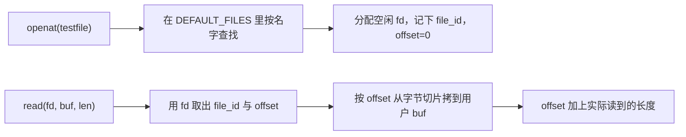
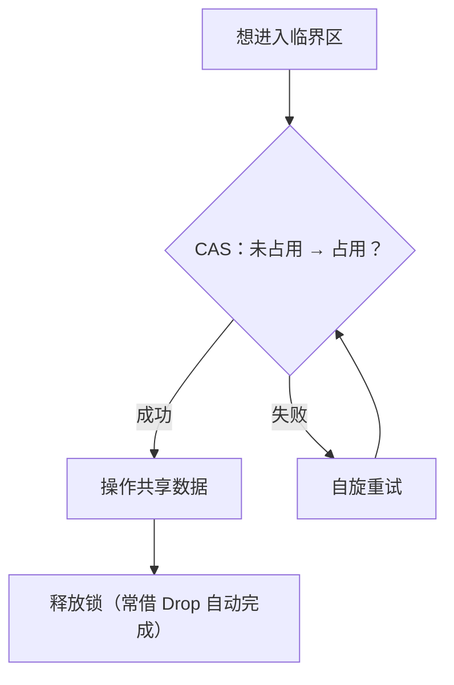

# 实验 5：文件系统与并发

> 相关教材理论：
>
>  [第 28 章 · 锁（P230）](/downloads/ostep-zh.pdf#page=230)
>
>  [第 36 章 · I/O 设备（P313）](/downloads/ostep-zh.pdf#page=313)
>
>  [第 39 章 · 插叙：文件和目录（P352）](/downloads/ostep-zh.pdf#page=352)

## 零、开始之前

在开始接入文件描述符、管道与自旋锁之前，请确认已完成以下准备：

1. **已完成 Lab4**：理解 `fork` / `exec` / `wait`（见 [Lab4 进程管理](/labs/lab4-process)）。本实验会继续用「父子进程 + 继承打开表」的直觉。
2. **进入工作目录**：在本仓库根目录下，进入自研实验环境目录：
  ```powershell
   cd os-lab
  ```
3. **（可选）激活当前终端环境**：如果你新开了一个终端，请在仓库**根目录**（不是 os-lab 目录）执行以下命令，让本会话能找到 Rust 和 QEMU：
  ```powershell
   . .\scripts\activate-os-env.ps1
   cd os-lab
  ```
4. **快速自检**：以下两条命令都能输出版本号，说明环境就绪：
  ```powershell
   rustc --version          # 预期：rustc 1.96.0 ...
   qemu-system-riscv64 --version   # 预期：QEMU emulator version ...
  ```

> 如果上面任何一步报“找不到命令”，回到 [环境搭建指南](/setup/environment) 检查安装。

1. **建议先读书**：OSTEP 第 28 章（锁）、第 36 章（I/O）、第 39 章（文件和目录）。带着「程序怎么读文件」「隔离进程如何传字节」「为什么要加锁」三个问题进来即可。Lab5 对应 feature 为 `lab5`（依赖 `lab4`）。


## 一、问题场景

Lab4 结束后，内核已经能创建进程、切换程序、等待子进程。但是换到日常写程序的视角，还是会在两件很普通的事上卡住：

> 「我想打开一份叫 `testfile` 的数据读出来；并且，父进程想给子进程传一句 `hi`——怎么做？」

想要解决第一件事，你要学会回答：**数据从哪来、怎么读**。总不能把整份内容写死在代码里，也不能假设用户程序能直接摸到内核或磁盘上的某一块内存。  
想要解决第二件事，你要学会回答：**已经隔离的进程之间，怎样安全地递几个字节**。我们在 Lab3 中把地址空间隔开了，A 不能再改 B 的变量；可 shell 里「前一个程序的输出变成后一个的输入」这种用法非常常见。

想要设计一个可以完成这两件事情的内核，我们需要完成：


| 需要完成                                 | 如果没有会怎样                               |
| ------------------------------------ | ------------------------------------- |
| 一套统一的「打开 → 读/写 → 关闭」接口（用 fd 指称已打开对象） | 每种对象各搞一套调用，或每次把整份数据塞进参数，接口又笨又难扩展      |
| 进程间传字节的通道（管道：一端写、一端读）                | 地址空间隔离后，父子无法安全互传数据；也做不成 shell 式的流水线协作 |
| 对内核共享缓冲区的互斥保护（如自旋锁）                  | 多端同时改读写指针或计数时，轻则数据错乱，重则指针越界           |


OSTEP 把这类问题分别收进两条主线：

- **持久性（Persistence）**：程序眼里的「文件」如何被打开、读写；数据如何以统一方式对待（本实验先用内嵌只读内容练手，真实磁盘留给 Lab6）。
- **并发（Concurrency）**：多个执行流同时碰共享数据时，如何避免乱套（本实验用自旋锁保护管道缓冲）。

本实验中的三条抓手是：

1. **文件描述符（fd）**：进程手里的小整数「门牌号」，用来指称已打开的对象；
2. **管道（pipe）**：内核里的字节通道，两端也是 fd，正好衔接 Lab4 的 `fork` 与打开表继承；
3. **自旋锁**：保护管道缓冲这类共享可变状态，避免数据竞争。

本实验新增能力与Lab4 已有能力，对照如下：


| 执行环节   | Lab4（进程）          | 本实验 Lab5（文件 + 同步）                               |
| ------ | ----------------- | ----------------------------------------------- |
| 用户侧读写  | 主要靠内存与打印          | 经 `open` / `read` / `write` / `close`，用 fd 指称对象 |
| 进程间协作  | `fork` / `wait` 等 | 再加管道：一端写、一端读；两端继承自打开表                           |
| 共享状态   | 进程内存彼此隔离          | 内核管道缓冲可被多端访问，需自旋锁保护                             |
| 磁盘文件系统 | 无                 | 仍无真实磁盘；用内嵌只读文件练 fd 语义（磁盘在 Lab6）                 |


完成本实验后，你需要能回答下面四个问题：

- 如何用每进程一张 **fd 表**，统一「打开 / 读 / 写 / 关」不同对象？
- 本实验的「文件」内容从哪里来？普通文件读与管道读有何不同？
- 管道如何配合 `fork` **继承打开表**，实现进程间传字节？
- 为何共享缓冲区需要临界区？自旋锁里的 **CAS** 解决了什么？

**实验目标**：在 Lab4 进程模型之上，实现每进程 fd 表、内嵌只读文件的 open/read、管道与环形缓冲，以及保护共享结构的自旋锁，使 `fs_test` / `pipe_test` 在 QEMU 中稳定通过。这里还没有真实磁盘文件系统，也没有工业级「写满就睡眠」的阻塞 I/O——我们先走通三条最短路径：「打开 → 读写 → 关掉」「一端写、一端读」「进临界区前先拿锁」。

## 二、背景知识

问题场景中的三个问题指向同一条线索：用户程序不想（也不能）直接操作「磁盘上的某一扇区」或「内核里某块私有内存」，它只想用一套尽量统一的说法完成读写。Unix 与 OSTEP 把这套说法叫做**文件抽象**；进程手里那个小整数，则是走进这套抽象的门牌号。

### 2.1 从「读一份数据」到文件描述符

设想用户程序说：打开名为 `testfile` 的东西，然后 `read` 若干字节。若每次都把「整份对象」塞进系统调用参数，接口会又笨又难扩展——管道、设备、以后的磁盘文件，形态各不相同。更干净的做法是分两步：

1. **打开**：内核认领某个对象，在**当前进程**的打开表里占一个空槽，把槽位下标返回给用户；
2. **读写 / 关闭**：用户只报这个下标，内核查表得知「到底在操作什么」。

这个下标就是**文件描述符（file descriptor，简称 fd）**。可以把它想成餐馆的取餐牌：顾客只拿号码，后厨根据号码找到对应订单。每个进程有自己的一张表，所以进程 A 的 `fd = 3` 和进程 B 的 `fd = 3` 完全可以指向不同对象。


上图里的「fd 表下标 3」只是门牌号；真正决定这次 `read` 去哪、能不能写的，是**槽位里记下的那一项**。用户态始终只说 `read(3, …)`，内核却必须先问清楚：3 号槽此刻指向的是普通文件，还是管道的某一端？若分不清，就会出现「对管道去找文件偏移」「对只读端执行写」这类错乱。

因此本实验在每进程的打开表里，用枚举 `FdType` 标明槽位类型。查表之后，系统调用再按类型分发到不同实现——这正是「统一入口、内核内部分岔」的落点。本实验要求学生至少要能区分：


| 变体                            | 含义                  | 查表之后内核还要记住什么    |
| ----------------------------- | ------------------- | --------------- |
| `Regular { file_id, offset }` | 普通「文件」（本实验里是内嵌只读内容） | 读的是哪一份内容、当前读到何处 |
| `PipeRead(id)`                | 管道读端                | 只能从该管道取字节，不能写   |
| `PipeWrite(id)`               | 管道写端                | 只能往该管道送字节，不能读   |


对 `Regular` 来说，`offset` **特别关键**：第一次 `read` 从 0 拷走一段后，必须把位置往前挪；否则下次仍从开头读，稍长一点的内容永远读不完。管道则不在 fd 上挂 offset，而是靠环形缓冲区内部的读写指针推进——形态不同，但对用户仍是同一个 `read(fd, …)` / `write(fd, …)`。

> 教材和 Unix 传统里常说「一切皆文件」。对本实验，先抓住它的**第一层含义**即可：普通文件、管道读端、管道写端在用户眼里都可以用同一套 `open` / `read` / `write` / `close` 来操作；你不必为每种对象各学一套系统调用。  
> **差别不在用户接口上，而在内核查完 fd 表之后**：槽位里的 `FdType` 告诉内核「这是文件还是管道、这一端能不能写」，再分发到不同实现。后面接上真实磁盘、设备时，多半仍走这扇门——只是表项背后的对象更丰富。  
> Lab5 先把这层「统一入口 + 内部分发」走通。


### 2.2 本实验的「文件」从哪里来

2.1 已经说明：用户用 fd 指称「打开的对象」，内核按 `FdType` 决定怎么读。那么，当类型是 `Regular`、名字叫 `testfile` 时，**字节内容本身存在哪里？**

完整磁盘文件系统要管超级块、inode、目录、块分配……对「刚接上 fd」这一阶段偏重。本实验先走更轻的一步：把若干只读内容**预先编进内核镜像**，放在 `os-fs` 的静态表 `DEFAULT_FILES` 里，再通过 `EmbeddedFs::default_fs()` 给全内核共用。可以把它想成：内核启动时就自带几本「只读小册子」，按名字能查到，按偏移能拷贝；**还没有真正的磁盘，也谈不上关机写回。**

于是用户侧的「打开 `testfile` 再读」在内核中大致走成两条链（对应 `openat` 与随后的 `read`）：




读的时候请抓住三点：

1. **名字 → 内容**：按名字查找发生在内核；用户态只交出路径字符串和自己的缓冲区，并不直接拿着文件字节。
2. **只读、无盘**：这里练的是 fd 语义（打开表、offset、`read` 分发），不是持久化。真正「写到盘上还能再读回来」会在后续实验用块设备接上。
3. **与 Lab4 的衔接**：测例仍是用户进程；`open` / `read` 经系统调用陷入内核完成，进程模型本身不必推倒重来。

代码上可以分工对照：`os-fs/src/lib.rs` 负责「有哪些内嵌文件、如何按偏移拷贝」；`kernel/src/fs.rs` 负责「每进程 fd 表如何分配与查找」。下一小节回答问题场景里的第二句：隔离的进程怎样互传几个字节。

### 2.3 进程之间怎样传一句话：管道

Lab3 的地址空间隔离解决了「别互相踩内存」，也带来新麻烦：父进程想把一句 `hi` 交给子进程时，不能再靠共享全局变量。这是就需要教材与 Unix 的经典通道：**管道（pipe）**——内核里的一段缓冲区，逻辑上像一根水管：字节从写端进去，从读端出来。


pipe在实际实现时通常做成**环形缓冲区（ring buffer）**：

- 维护读位置、写位置（或等价字段）以及当前可读字节数 `count`；
- 下标对缓冲区长度取模，写到物理末尾后绕回开头，避免每次把整段数据搬来搬去；
- **空**的时候，读端暂时读不到数据（本实验常返回错误码，由用户程序 `yield` 再试）；
- **满**的时候，写端停止继续写入（本实验简化为 `break`，尚未做成「阻塞直到有空位」那种真实阻塞 I/O）。

更关键的一点，正好与2.1中的知识对应：**管道的两端也是 fd**。创建管道时，内核会在当前进程的 fd 表里登记一个 `PipeRead`、一个 `PipeWrite`；之后用户仍调用同一个 `read` / `write`，内核查表发现类型是管道端，就去操作环形缓冲，而不是去动 `Regular` 的 `offset`。

这和 Lab4 中我们学习过的 `fork` 天然合拍，常见用法是：

```text
父进程 pipe（得到读端 fd、写端 fd）
→ fork（子进程复制打开表，两端都继承）
→ 父关掉自己不需要的一端，子关掉另一端
→ 形成清晰的单向流水线：一端只写，一端只读
```

shell 里「前一个程序的输出接到后一个程序的输入」，骨架正是上面这套：先建管道，再 `fork` 继承两端 fd，再各自关掉用不到的那一端。

这里还藏着一个容易漏掉的问题：**谁有资格拆掉那根「水管」？**  
`fork` 之后，父、子进程的打开表里可能**各自**握着指向同一根管道的写端 fd（读端同理）。对用户来说这是两个不同的 fd 号码；对内核来说，它们指向的是**同一块**环形缓冲区。于是内核要额外记一笔账，叫做**引用计数（reference count）**：

- 每多一个 fd 指向「这一侧」（例如又一个写端），计数就加一；
- 某个进程 `close` 掉自己的写端 fd，或进程退出、打开表被回收时，计数就减一；
- **只有某一侧的引用计数减到 0**，才表示「这一侧已经没有人再持有」——这时才可以释放相关资源，或通知另一侧「对端已经全部关闭」。

举个具体画面：父、子都继承了写端，父先 `close` 写端——此时写端引用计数还不是 0，因为子进程仍握着写端；读端若继续 `read`，不应误以为「不会再有人写了」。只有子进程也关掉（或退出）写端、写端计数归零后，读端再 `read` 才适合得到「没有更多数据了」这类结束信号（教材里常对应 **EOF** 的教学版语义）。

反过来，如果计数还没归零就拆掉环形缓冲，另一个进程手里的 fd 就会变成「门牌还在、房子没了」，一读写就踩空。所以：**管道缓冲区的寿命跟「还有没有 fd 指着它」绑定，而不是跟「某一个进程关没关某一个号码」简单等同。**

### 2.4 共享缓冲区上的交错：为何需要同步

上一节把管道接好了：字节躺在**内核里的那一块环形缓冲**里，读端、写端（可能还有更多进程）都会去改它的「还剩多少字节」「下一次读/写从哪开始」。**大家通过系统调用，轮流走进内核，去碰同一份内核数据**。这份数据一旦被同时改写，就会出现教材里说的 **数据竞争（data race）**。

先看一个最小例子。无保护的 `count += 1`，在机器上通常不是一步完成，而是：

```text
读出 count 的当前值
→ 在寄存器里加一
→ 把新值写回内存里的 count
```

设想两个执行流都想把 `count` 从 3 加到 4：

```text
执行流 A：读到 3
执行流 B：也读到 3          ← A 还没写回
执行流 A：写回 4
执行流 B：写回 4            ← 本该变成 5，结果仍是 4
```

最后只加了一次，这叫**更新丢失**。  
把同样的交错套到管道上：`count`、读位置、写位置都是「读出来改一改再写回去」的字段。交错一旦发生，可能出现：

- 可读字节数算错 → 多读、少读，或以为空/满了；
- 读写指针各走各的 → 字节错乱、重复或丢失；
- 更糟时指针越界 → 直接破坏内核里的缓冲结构。

所以，凡是「改这些共享字段」的那几行代码，同一时刻只应允许一个执行流待在里面。这样的代码区间叫做**临界区（critical section）**：

1. 进入临界区前：先拿到互斥权（下一节的自旋锁就是一种拿法）；
2. 在临界区里：安心读改写共享状态；
3. 离开临界区时：放开互斥权，让别人进来。

管道的 `pipe_read` / `pipe_write` 之所以要在整段操作外面包一层保护，原因就在这里——**不是「管道」这个词特殊，而是「内核里有一份会被多端同时改的状态」特殊。**

### 2.5 自旋锁：最短路上的互斥

本实验采用最简单的互斥原语之一——**自旋锁（spinlock）**。直觉上它就是一把门锁：

- 锁为「未占用」时，尝试把它改成「占用」；成功则进入临界区，安心改共享数据；
- 若已被占用，就在原地循环重试（「自旋」），直到对方释放；
- 离开临界区时把锁改回「未占用」，让等待者有机会进去。

「尝试改成占用」不能用普通赋值凑合——否则「看一眼是空闲」和「写成占用」之间仍可能被别人插队。硬件提供的原子操作里，常见形态是 **CAS（compare-and-swap / compare_exchange）**：仅当锁**仍是**「未占用」时才改为「占用」，否则本次失败。这样「测试 + 设置」不会被拆成可交错的两步。




代码里对应 `SpinMutex`：内部是 `AtomicBool`，用 `compare_exchange_weak` 抢锁；拿到的 `SpinMutexGuard` 在离开作用域时 `Drop`，自动解锁，减轻「忘了解锁」的风险。内存序上的 `Acquire` / `Release` 则保证：进入临界区后看到的共享数据，不会是「锁已经加上、数据视图却还是旧的」那种乱序结果——细节可在读 `sync.rs` 时对照教材或注释慢慢消化。

自旋锁也有边界，需要心里有数：

- 拿不到锁时会**空转占用 CPU**，不适合长时间持有；
- 在单核上，若持锁者必须等别的执行流先跑起来才能放锁，自旋方还可能把 CPU 占满，造成更糟的等待。

因此它更适合**内核中极短**的临界区（例如改几下管道指针）。教材后文会出现睡眠锁、信号量等；Lab8 还会把「拿不到就让出 CPU」做成面向用户线程的阻塞同步。Lab5 先把自旋锁当作同步问题的第一块踏脚石即可。

> 串起来看整条 Lab5 背景主线：用户用 **fd** 指称打开的对象；对象可以是**内嵌文件**，也可以是**管道**的一端；管道在连接隔离进程的同时，把**共享缓冲**推进了内核——于是**锁**成为刚需。下一节的任务，就是把这条链在 QEMU 里跑通。


## 三、实验任务

本实验主要相关文件（路径相对 `os-lab/`）：


| 文件                          | 角色           | 阅读时重点确认                              |
| --------------------------- | ------------ | ------------------------------------ |
| `os-fs/src/lib.rs`          | 内嵌文件抽象       | open/read 接口、按 offset 拷贝             |
| `kernel/src/fs.rs`          | 内核 FS 与 fd 表 | `FdTable` / `FdType`：Regular 与 Pipe  |
| `kernel/src/sync.rs`        | 自旋锁 + 管道     | CAS、环形缓冲、引用计数                        |
| `kernel/src/trap.rs`        | 系统调用分发       | openat / read / write / close / pipe |
| `user/src/bin/fs_test.rs`   | 文件测例         | open + read + 校验                     |
| `user/src/bin/pipe_test.rs` | 管道测例         | 父子各拿一端                               |


> 完整代码走读与参考答案见 [lab5 参考答案](/answers/lab5-answers)。


### 任务一：跑通内核

**第一步：确认变体。** 如果教师通过工作台下发了 debug 变体，先打开 `user/src/bin/fs_test.rs` 文件头，应看到 `【Lab5 任务：排错】`；没有任务标记则用参考实现直接运行。

确认环境已激活，运行以下命令可输出版本号：

```powershell
rustc --version
qemu-system-riscv64 --version
```

运行实验：

```powershell
cargo run -p kernel --features lab5
# 或 release 验证
cargo run -p kernel --features lab5 --release
```

**预期输出**：屏幕会先刷出 **OpenSBI 启动日志**（可忽略），随后是内核与用户测例输出。示意如下：

```text
OpenSBI v1.7
  ...（OpenSBI 平台/HART 日志，可忽略）...
os-lab kernel lab5: filesystem and sync.
Loading 5 user apps (ELF, lab4 process model)...
Hello from testfile!
fs_test pass
pipe says hi
pipe_test pass
All processes exited.
```

**通过标准**：看到 `Hello from testfile!`、`fs_test pass`、`pipe says hi`、`pipe_test pass`、`All processes exited.`，且 QEMU 正常退出（终端命令返回，没有卡住或报错）。

> 可能看到 `pipe write failed` 与某进程 `exited with code -1`——已知现象（占位处理），不影响以 `pipe_test pass` 为准。


### 任务二：阅读理解

参考答案见 [lab5 参考答案](/answers/lab5-answers)。

1. 对照 `FdTable` 与 `FdType`：fd 表如何设计？为什么 `Regular` 要记 `offset`？
2. 对照 `sys_read`：为什么要按 fd 类型分发？普通文件与管道读有何不同？
3. 对照 `SpinMutex`：自旋锁为何必须用原子 CAS（`compare_exchange_weak`）？`Acquire` / `Release` 内存序做什么？
4. 管道写满时为何 `break` 而非阻塞等待？与真实系统的「阻塞式 I/O」差在哪？
5. `fork` 后为何要继承 fd 表？管道为何要引用计数？

> 能讲清「建管道 → fork → 继承 fd → 写/读环形缓冲 → 引用计数回收」，Lab5 主线就过关了。


### 任务三：动手修改

**修改 1：新增内嵌文件**

在 `DEFAULT_FILES` 里加一项自定义名字与内容，再写（或改）用户程序 `open` + `read` 并打印出来，走通「加文件 → 打开 → 读出」闭环。

```powershell
cargo run -p kernel --features lab5
```

- 通过标准：能看到你新增文件的内容被正确读出，且原有 `fs_test pass` 仍保持通过。
- **做完务必改回并** `cargo run -p kernel --features lab5` **确认恢复正常**（若你希望保留新文件作展示，可另开分支，不要污染主测例预期）。

**修改 2：去掉管道锁**

在管道读写路径上临时不持锁（或注释掉保护共享缓冲的加锁），再反复跑 `pipe_test`。

```powershell
cargo run -p kernel --features lab5
```

- 预期现象：可能偶发乱码、断言失败或表现不稳定——这正是数据竞争的直观后果。
- 通过标准：观察到异常或不稳定，并用自己的话解释**为什么**管道缓冲需要锁。
- **做完务必改回并** `cargo run -p kernel --features lab5` **确认** `pipe_test pass` **恢复**。

**修改 3：写满时 yield 再写**

当前写满缓冲区时常直接 `break`。试着结合 `sys_yield`（或用户侧循环 yield）在「缓冲满」时让出 CPU，争取写出超过缓冲区大小的数据，体验阻塞式 I/O 的雏形。

- 通过标准：能说明「满则让出 / 再试」与「满则 break」的差别；若改动能跑通更大写入，记下现象即可。
- **做完务必改回并** `cargo run -p kernel --features lab5` **确认恢复正常**。


## 四、验证命令


| 验证项      | 命令                                                    | 通过标准                                                                                          |
| -------- | ----------------------------------------------------- | --------------------------------------------------------------------------------------------- |
| 主编译      | `cargo check -p kernel --features lab5`               | 无 error                                                                                       |
| QEMU     | `cargo run -p kernel --features lab5 --release`       | `Hello from testfile!`、`fs_test pass`、`pipe says hi`、`pipe_test pass`、`All processes exited.` |
| 组件单测（可选） | `cargo test -p os-fs --target x86_64-pc-windows-msvc` | **11** 项通过（`os-fs` 库测：内嵌文件 open/read 4 项、`fd_kind` 3 项、disk 辅助 4 项）                           |


> 组件单测在 `os-lab/` 目录下执行；`--target x86_64-pc-windows-msvc` 表示在宿主机上跑，不经过 QEMU。终端末尾应看到类似：`test result: ok. 11 passed; 0 failed; …`。

