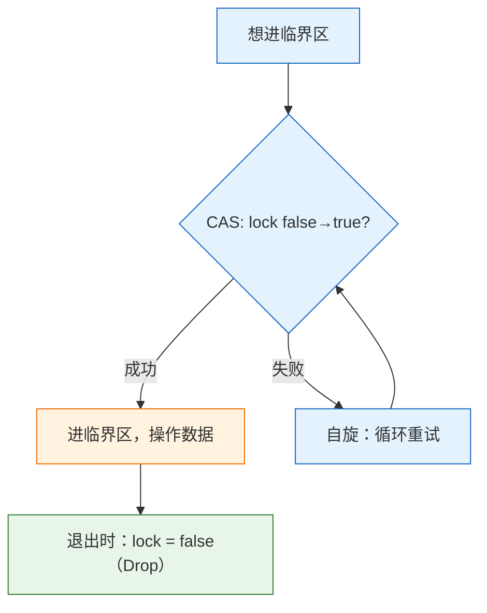

# 实验 5：文件系统与并发

> 对应 feature：`lab5`（依赖 `lab4`）。

本实验对接《操作系统导论》的两大主题：**持久性（Persistence）** 与 **并发（Concurrency）**——用文件描述符抽象「可读可写的对象」，用管道做进程间通信，用锁保护共享数据。学完后，内核才更像一本教材末尾画出的「现代 OS 雏形」。

## 零、开始之前

1. **已完成 Lab4**：理解了 fork/exec/wait 进程模型（见 [lab4-process.md](lab4-process.md)）。
2. **进入工作目录**：`cd os-lab`，必要时先 `. .\scripts\activate-os-env.ps1` 激活环境。
3. **自检**：`rustc --version` 与 `qemu-system-riscv64 --version` 能输出版本。
4. **建议先读书**：《操作系统导论》中关于锁 / 条件变量 / 并发错误的章节，以及文件与文件系统导论。

## 一、问题场景

Lab4 结束后，你的内核已经会动态创建进程、替换程序、等待子进程——看起来离「能用的操作系统」很近了。但若对照《操作系统导论》的后半部分，仍会发现两块明显空缺：**持久性（Persistence）** 与 **并发（Concurrency）**。

先看持久性。到目前为止，进程产生的数据大多待在自己的内存里：进程一退出，数据也就没了；两个进程想交换一段话，也不能直接读写对方的地址空间（Lab3 已经把它们隔开了）。教材把「把字节组织成可命名、可读写的对象」抽象成**文件**，把「进程手里那张打开表」抽象成**文件描述符（fd）**。没有这层抽象时，你会卡住：

- **数据从哪读、往哪写？**  
用户程序总不能每次都把整份测试数据硬编码进自己的 `.text`。需要一种统一说法：`open` 打开、`read`/`write` 读写、`close` 关掉——内核在背后找到真正的数据源。
- **进程之间如何传数据？**  
shell 里常见的 `ls | grep`，本质是「前一个进程的输出，变成后一个进程的输入」。两边地址空间隔离，不能共享普通变量。教材与 Unix 的经典答案是**管道（pipe）**：内核里有一段缓冲区，一端写、一端读；两端都用 fd 表示，于是「一切皆文件」的接口仍然统一。

再看并发。管道缓冲区、引用计数等结构，可能被多个进程几乎同时访问（父进程写、子进程读，或多次 fork 后多个持有者）。若没有保护，就会出现教材里反复警告的 **数据竞争（data race）**：例如两个执行流同时对 `count += 1`，读–改–写交错后，更新可能丢失，数据会错乱。教材的基础答案是**锁**等同步原语：同一时刻只允许一个执行流进入临界区。

因此本实验要同时补上两套机制：


| 主题      | 教材问题         | 本实验落地                                               |
| ------- | ------------ | --------------------------------------------------- |
| **持久性** | 如何抽象文件与 I/O？ | 内嵌只读文件 + fd 表；`openat` / `read` / `write` / `close` |
| **IPC** | 隔离的进程如何传字节？  | **管道**（环形缓冲 + 读/写端 fd），常配合 fork 继承 fd               |
| **并发**  | 共享结构如何避免交错？  | **自旋锁**保护管道等临界区                                     |


学完后，你应能跑通 `fs_test`（打开并读出内嵌文件）和 `pipe_test`（父子进程通过管道传一句消息）。这不会变成完整磁盘文件系统或工业级调度器，但已经把教材末尾那张「现代 OS 素描」里最关键的两笔——**文件抽象**与**同步**——画进你的内核里了。

> 一句话记住本实验：用 fd 接通「文件 / 管道」抽象，用锁保证并发下共享数据不错乱。


## 二、背景知识


### 2.1 文件描述符 fd：一切皆文件的入口

> 先想：进程 `read` 时，内核怎么知道读的是哪个对象？

答案是教材与 Unix 共同强调的 **fd 表**：每个进程有一张表，用户手里的整数 fd 是下标，内核查到真正的打开对象。


本实验 `FdType` 有：`Regular`（普通文件，带 file_id 与 offset）、`PipeRead`、`PipeWrite`。「文件和管道都用 fd」——正是「一切皆文件」的教学版。

### 2.2 内嵌只读文件：最简文件系统

> 先想：完整磁盘 FS（inode、目录树）太重。教学上如何让进程「读到文件内容」？

最简方案：**把文件内容编进镜像**。静态表在 `os-fs/src/lib.rs` 的 `DEFAULT_FILES`；内核经 `EmbeddedFs::default_fs()` 共用。`openat` 查到字节切片，`read` 按 offset 拷贝。

```mermaid
graph LR
    O["openat(\"testfile\")"] --> F["FS.open → DEFAULT_FILES 查到 file_id"]
    F --> A["分配 fd，记录 file_id + offset=0"]
    R["read(fd, buf, len)"] --> G["查 fd 得 file_id, offset"]
    G --> C["FS.read_at 拷贝到用户 buf"]
    C --> U["offset 前移"]

    classDef open fill:#e3f2fd,stroke:#1565c0;
    classDef data fill:#fff3e0,stroke:#ef6c00;
    class O,A open;
    class F,G,C data;
```


> 这是只读、无磁盘的教学简化。真实持久性还要管块设备、inode、目录等，可作为后续扩展。


### 2.3 管道 pipe：进程间的水管

> 先想：地址空间隔离后，两进程如何传数据？

答案是**管道**：内核里的**环形缓冲区**；一端写、一端读。常配合 fork：父进程建 pipe，子进程继承 fd——shell 的 `ls | grep` 就是这条路。


关键细节：

- **环形**：读写位置模 `PIPE_BUFFER_SIZE` 绕回。
- **count**：可读字节数；空则 read 暂失败，满则 write 停止（本实验简化为 break，而非阻塞等待）。
- **fork 继承**：`clone_fd_table`；管道还需**引用计数**，所有端关闭后才释放缓冲。


### 2.4 自旋锁：最简单的同步原语

> 先想：两执行流同时改同一缓冲，硬件能提供什么帮助？

**自旋锁**：用原子变量当门锁；`compare_exchange` 把 `false→true` 成功才进临界区，否则原地重试。




本实验 `SpinMutex` 用 `AtomicBool` + `compare_exchange_weak`；`SpinMutexGuard` 的 `Drop` 自动解锁（RAII）。

> 自旋拿不到锁时浪费 CPU；单核上还可能更糟。教材后文会讲睡眠锁等；自旋锁是理解同步的起点。


### 2.5 为什么需要同步：数据竞争

> 先想：无锁时两个进程同时对 `count += 1`，可能怎样？

`count += 1` 展开成读–改–写，交错后可能丢更新——这就是教材中的**数据竞争（data race）**。锁让临界区原子化。管道的 `pipe_read` / `pipe_write` 全程持锁，就是为此。

## 三、实验任务

> 内容涵盖持久性 + 并发，但每块都不庞大。仍建议先猜再对照。


| 文件                          | 角色         | 先想「如果是我会怎么设计」                 |
| --------------------------- | ---------- | ----------------------------- |
| `os-fs/src/lib.rs`          | 文件抽象       | open/read 接口怎么定？              |
| `kernel/src/fs.rs`          | 内核 FS 集成   | fd 表？Regular/Pipe 怎么区分？       |
| `kernel/src/sync.rs`        | 锁 + 管道     | CAS 怎么写？环形缓冲怎么管？              |
| `kernel/src/trap.rs`        | syscall 分发 | openat/read/write/close/pipe？ |
| `user/src/bin/fs_test.rs`   | 文件测试       | open+read+校验                  |
| `user/src/bin/pipe_test.rs` | 管道测试       | 父子如何各拿一端？                     |


> 完整解读见 `labs/answers/lab5-answers.md`。


### 任务一：跑通 lab5（必做）

```powershell
cargo run -p kernel --features lab5
```

**预期输出**（OpenSBI 日志可忽略）：

```text
os-lab kernel lab5: filesystem and sync.
Loading 5 user apps (ELF, lab4 process model)...
Hello from testfile!
fs_test pass
pipe says hi
pipe_test pass
All processes exited.
```

**通过标准**：看到 `Hello from testfile!`、`fs_test pass`、`pipe says hi`、`pipe_test pass`、`All processes exited.`，QEMU 正常退出。

> 可能看到 `pipe write failed` 与某进程 `exited with code -1`——已知现象（占位处理），不影响以 `pipe_test pass` 为准。


### 任务二：阅读理解与思考题（必做）

每道题建议**先合上代码想答案，再打开对照**；**参考答案见** `labs/answers/lab5-answers.md`。

1. fd 表如何设计？为什么 `Regular` 要记 `offset`？（对照 `FdTable` 与 `FdType`）
2. `sys_read` 为什么要按 fd 类型分发？普通文件与管道读有何不同？
3. 自旋锁为何必须用原子 CAS（`compare_exchange_weak`）？`Acquire`/`Release` 内存序做什么？
4. 管道写满为何 `break` 而非阻塞等待？与真实系统的「阻塞式 I/O」差在哪？
5. fork 后为何要继承 fd 表？管道为何要引用计数？

> 能讲清「建管道 → fork → 继承 fd → 写/读环形缓冲 → 引用计数回收」，lab5 就过关了。


### 任务三：动手小修改（选做，建议完成）

**修改 1：新增内嵌文件**  
在 `DEFAULT_FILES` 加一项，用户程序 open+read 打印。——走通添加文件闭环。

**修改 2：去掉管道锁（理解性实验，谨慎）**  
临时不持锁写缓冲。——可能偶发错乱；做完立刻改回。

**修改 3：写满时 yield 再写（进阶）**  
结合 yield，体验「阻塞式 I/O」雏形，争取写出超过缓冲区大小的数据。

## 四、验证

以 `cargo run -p kernel --features lab5` 输出 `Hello from testfile!`、`fs_test pass`、`pipe_test pass`、`All processes exited.` 并正常退出为主要标准。

## 五、AI 提问模板

1. **概念澄清型**：「《操作系统导论》里单核自旋可能有什么问题？和多核场景有何不同？」
2. **现象解释型**：「pipe_test 偶尔乱码偶尔正常，像数据竞争吗？」
3. **代码追因型**：「自旋锁为何常用 `compare_exchange_weak`？」
4. **对比深化型**：「自旋锁和信号量各适合什么？管道若改用睡眠等待会怎样？」
5. **动手探索型**：「若做真正磁盘文件系统，inode、目录、块设备各解决什么？（对照教材持久性部分）」

