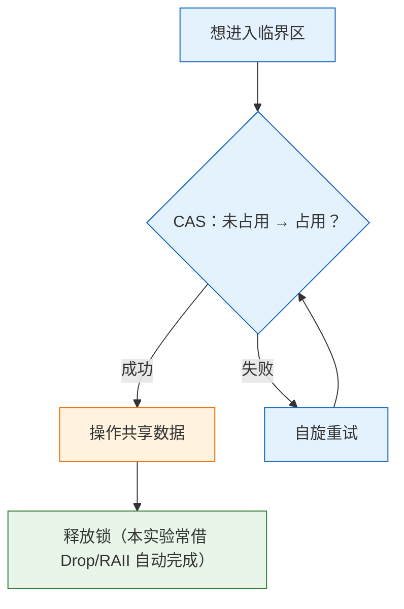

# 实验 5：文件系统与并发

> 对应 feature：`lab5`（依赖 `lab4`）。

读到这里，你已经会创建进程、切换程序、等待子进程了。可日常用电脑时还会遇到两类很「普通」的事：

1. **程序要读一份数据、写一点结果**——不能每次都把内容写死在代码里。
2. **两个进程想互相传一句话**——它们各自的地址空间是隔离的，不能直接改对方的变量。

《操作系统导论》把这两类事分别收进两大主题：**持久性（Persistence）**（数据如何被当作「文件」来读写）和 **并发（Concurrency）**（多个执行流同时碰共享数据时如何别乱套）。本实验就是第一次把这两块**同时**接到你的内核里：用**文件描述符（fd）**统一「打开的对象」，用**管道（pipe）**在进程间传字节，用**自旋锁**保护内核里的共享结构。

不用紧张：这里还没有真实磁盘文件系统（那是 Lab6 会遇到的问题），也没有复杂的工业级调度。你只要先在代码中走通「打开 → 读写 → 关掉」「一端写、一端读」「进临界区前先拿锁」这三件事。

## 零、开始之前

1. **已完成 Lab4**：理解了 `fork` / `exec` / `wait`（见 [lab4-process.md](lab4-process.md)）。本实验会继续用「父子进程 + 继承打开表」的直觉。
2. **进入工作目录**：`cd os-lab`；新开的终端记得先 `. .\scripts\activate-os-env.ps1`。
3. **自检**：`rustc --version` 与 `qemu-system-riscv64 --version` 能输出版本。
4. **建议先翻书**：文件与 I/O 导论、锁与并发错误相关章节。不必一次读完，带着「程序怎么读文件」「为什么要加锁」这两个问题进来即可。

## 一、问题场景

Lab4 结束后，内核已经能创建进程、切换程序、等待子进程——看起来很像操作系统了。但若站在用户程序的角度，仍会立刻卡住：

> 「我想打开一份叫 `testfile` 的数据读出来；并且，父进程想给子进程传一句 `hi`——怎么做？」

对照现状，至少有三个问题还没着落（答案先不要急着在这里找完，带着它们读后面的背景知识）：

- **数据从哪读、往哪写？**  
进程里的数据大多待在自己的内存里，退出就没了；总不能把整份内容硬编码进代码。操作系统通常用什么抽象来统一「打开 / 读 / 写 / 关」？进程手里那个小小的整数编号又扮演什么角色？
- **隔离的进程如何传字节？**  
Lab3 已经把地址空间隔开了，A 不能直接改 B 的变量。可 `ls | grep` 这类用法，本质就是「前一个的输出变成后一个的输入」。两边不能共享普通变量时，内核该提供怎样的通道？它和「读文件」能不能用同一套接口？
- **多人同时碰共享结构，会不会乱？**  
一旦内核里出现「两端共用的缓冲区」之类的共享数据，父写、子读（或更多持有者）可能交错访问。两个执行流同时做 `count += 1` 时，可能出什么错？教材里用什么机制避免这种交错？

本实验同时会讨论《操作系统导论》中的两大主题——**持久性**（文件与 I/O）和 **并发**（共享数据与同步）。希望你能在完成实验的同时可以更深刻的理解这两个概念。

## 二、背景知识

问题场景中提出的三个问题，其实指向同一条线索：用户程序不想（也不能）直接操作「磁盘上的某一扇区」或「内核里某块私有内存」，它只想用一套尽量统一的说法完成读写。Unix 与《操作系统导论》把这套说法叫做**文件抽象**；而进程手里拿着的那个小整数，则是走进这套抽象的门牌号。

### 2.1 从「读一份数据」到文件描述符

设想用户程序说：打开名为 `testfile` 的东西，然后 `read` 若干字节。若每次都把「整份对象」塞进系统调用参数，接口会又笨又难扩展——管道、设备、以后的磁盘文件，形态各不相同。更干净的做法是分两步：

1. **打开**：内核认领某个对象，在**当前进程**的打开表里占一个空槽，把槽位下标返回给用户；
2. **读写 / 关闭**：用户只报这个下标，内核查表得知「到底在操作什么」。

这个下标就是**文件描述符（file descriptor，简称 fd）**。可以把它想成餐馆的取餐牌：顾客只拿号码，后厨根据号码找到对应的那份订单。每个进程有自己的一张表，所以进程 A 的 `fd = 3` 和进程 B 的 `fd = 3` 完全可以指向不同对象。


本实验里，槽位存放的类型是 `FdType`，至少要能区分：


| 变体                            | 含义     | 为何要单独记              |
| ----------------------------- | ------ | ------------------- |
| `Regular { file_id, offset }` | 普通「文件」 | 顺序 `read` 必须记住读到哪里了 |
| `PipeRead(id)`                | 管道读端   | 只能读，不能写             |
| `PipeWrite(id)`               | 管道写端   | 只能写，不能读             |


`offset` 之所以重要：第一次 `read` 从 0 拷贝一段后，若不把位置往前挪，下次还会从开头读，永远读不完一份稍长的内容。管道则不靠 per-fd 的 offset，而是靠缓冲区内部的读写指针——形态不同，但对用户仍是同一个 `read(fd, …)`。

> 「一切皆文件」在教学里的第一层含义，往往就是：**不同对象，同一套 open/read/write/close 入口；差别藏在内核查表之后。**


### 2.2 本实验的「文件」从哪里来

完整磁盘文件系统要管超级块、inode、目录、块分配……对刚接上 fd 的阶段偏重。本实验采取更轻的一步：把若干只读内容**预先编进内核镜像**，放在 `os-fs` 的静态表 `DEFAULT_FILES` 里，经 `EmbeddedFs::default_fs()` 共用。

于是「打开 `testfile`」在内核中大致走成：

```mermaid
graph LR
    O["openat(\"testfile\")"] --> L["在 DEFAULT_FILES 里按名字查找"]
    L --> A["分配空闲 fd，记下 file_id，offset=0"]
    R["read(fd, buf, len)"] --> G["用 fd 取出 file_id 与 offset"]
    G --> C["按 offset 从字节切片拷到用户 buf"]
    C --> U["offset += 实际读到的长度"]

    classDef open fill:#e3f2fd,stroke:#1565c0;
    classDef data fill:#fff3e0,stroke:#ef6c00;
    class O,A open;
    class L,G,C,U data;
```


要点有三：

- **名字 → 内容**：查找发生在内核；用户态只提供路径字符串和缓冲区。
- **只读、无盘**：关机谈不上「写回磁盘」——因为本来就没有盘。这足够练习 fd 语义；真正的持久化会在后续实验用块设备接上。
- **与 Lab4 的衔接**：测例仍是用户进程，通过系统调用陷入内核完成 open/read；进程模型本身不必推倒重来。

读代码时可对照：`os-fs/src/lib.rs` 管「有哪些文件、如何按偏移拷贝」；`kernel/src/fs.rs` 管「每进程 fd 表如何分配与查找」。

### 2.3 进程之间怎样传一句话：管道

地址空间隔离解决了「别互相踩内存」，也带来新麻烦：父进程想把一句 `hi` 交给子进程时，不能再靠共享全局变量。教材与 Unix 的经典通道是**管道（pipe）**——内核里的一段缓冲区，逻辑上像一根水管：水（字节）从写端进去，从读端出来。


实现上通常做成**环形缓冲区**：

- 维护 `read_pos` / `write_pos`（或等价字段）与可读字节数 `count`；
- 下标对缓冲区长度取模，写到末尾后绕回开头，避免每次搬移整段数据；
- 空的时候读端暂时读不到数据（本实验常返回错误码，由用户程序 `yield` 再试）；满的时候写端停止继续写入（本实验简化为 `break`，尚未做成「阻塞直到有空位」）。

更关键的是：**管道的两端也是 fd**。创建管道时，内核会在当前进程的 fd 表里登记一个读端、一个写端；之后的 `read` / `write` 与读普通文件走同一扇门，只是查表后发现类型是 `PipeRead` / `PipeWrite`，于是改去操作环形缓冲。

这和 Lab4 的 `fork` 天然合拍：父进程先 `pipe`，再 `fork`，子进程通过**复制打开表**继承那两个 fd。父关掉自己不需要的一端、子关掉另一端，就能形成清晰的「单向流水线」——shell 里 `ls | grep` 的骨架，正是「管道 + 继承 fd + 关掉多余端」。

管道还多一层记账：**引用计数**。同一个管道可能被多个 fd（含 dup、多进程继承）指向；只有读端或写端的引用都归零时，才谈得上释放缓冲区或让对端感知「写端已全部关闭」（EOF 一类语义的教学版）。若过早拆掉缓冲，仍握着 fd 的进程就会踩空。

### 2.4 共享缓冲区上的交错：为何需要同步

管道一旦存在，内核里就出现了**多个执行流都可能碰到的结构**：父进程正在 `write` 推进写指针，子进程可能同时 `read` 推进读指针；`fork` 之后还可能有更多持有者。对这种共享数据，若只靠「普通的读变量、改变量、写回」，就会碰到教材反复强调的 **数据竞争（data race）**。

典型例子是无保护的 `count += 1`。它在机器层面往往拆成「读出 → 加一 → 写回」。两个执行流若都读到同一个旧值，再各自写回，最后只加了一次——更新丢失。管道里的 `count`、读写位置若以同样方式交错，轻则数据错乱，重则指针越界。

因此，凡是「同一时刻只允许一个执行流待在里面」的代码区间，都叫**临界区**；进入临界区前必须先取得某种互斥保证。管道的 `pipe_read` / `pipe_write` 之所以要在整段操作外面包一层保护，原因就在这里：不是管道特殊，而是**共享可变状态**本身特殊。

### 2.5 自旋锁：最短路上的互斥

本实验采用最简单的互斥原语之一——**自旋锁（spinlock）**。直觉上它就是一把门锁：

- 锁变量为「未占用」时，尝试把它改成「占用」；成功则进入临界区；
- 若已被占用，就在原地循环重试（「自旋」），直到对方释放；
- 离开临界区时把锁改回「未占用」。

「尝试改成占用」不能用普通赋值凑合，而要用硬件提供的原子操作，常见形态是 **CAS（compare-and-swap / compare_exchange）**：仅当锁仍是「未占用」时才改为「占用」，否则失败。这样测试与设置不会被拆成可交错的两步。




代码里对应 `SpinMutex`：内部是 `AtomicBool`，用 `compare_exchange_weak` 抢锁；拿到的 `SpinMutexGuard` 在离开作用域时 `Drop`，自动解锁，避免漏释放。内存序上的 `Acquire` / `Release` 则保证：进入临界区后看到的共享数据，不会是「锁已加上、数据却还是旧视图」的乱序结果——细节可在读 `sync.rs` 时对照教材或注释慢慢消化。

自旋锁也有边界：拿不到锁时会空转占用 CPU；在单核上若持锁者需要别的执行流先跑起来才能放锁，自旋方还可能把 CPU 占满，造成更糟的等待。因此它更适合**内核中极短**的临界区。教材后文会出现睡眠锁、信号量等；Lab8 还会把「拿不到就让出 CPU」做成面向用户线程的阻塞同步。此刻先把自旋锁当作同步问题的第一块踏脚石即可。

---

串起来看：用户用 fd 指称打开的对象；对象可以是内嵌文件，也可以是管道的一端；管道把隔离进程重新连起来的同时，也把共享缓冲推进了内核——于是锁成为刚需。下一节的任务，就是把这条链在 QEMU 里跑通。

## 三、实验任务

> 内容涵盖持久性 + 并发，但每块都不庞大。仍建议自己思考再对照代码。


| 文件                          | 角色         | 先想「如果是我会怎么设计」                 |
| --------------------------- | ---------- | ----------------------------- |
| `os-fs/src/lib.rs`          | 文件抽象       | open/read 接口怎么定？              |
| `kernel/src/fs.rs`          | 内核 FS 集成   | fd 表？Regular/Pipe 怎么区分？       |
| `kernel/src/sync.rs`        | 锁 + 管道     | CAS 怎么写？环形缓冲怎么管？              |
| `kernel/src/trap.rs`        | syscall 分发 | openat/read/write/close/pipe？ |
| `user/src/bin/fs_test.rs`   | 文件测试       | open+read+校验                  |
| `user/src/bin/pipe_test.rs` | 管道测试       | 父子如何各拿一端？                     |


> 完整解读见 `labs/answers/lab5-answers.md`。


### 任务一：跑通 lab5

```powershell
cargo run -p kernel --features lab5
```

**预期输出**（OpenSBI 日志可忽略）：

```text
os-lab kernel lab5: filesystem and sync.
Loading 5 user apps (ELF, lab4 process model)...
Hello from testfile!
fs_test pass
pipe says hi
pipe_test pass
All processes exited.
```

**通过标准**：看到 `Hello from testfile!`、`fs_test pass`、`pipe says hi`、`pipe_test pass`、`All processes exited.`，QEMU 正常退出。

> 可能看到 `pipe write failed` 与某进程 `exited with code -1`——已知现象（占位处理），不影响以 `pipe_test pass` 为准。


### 任务二：阅读理解与思考题

**参考答案见** `labs/answers/lab5-answers.md`。

1. fd 表如何设计？为什么 `Regular` 要记 `offset`？（对照 `FdTable` 与 `FdType`）
2. `sys_read` 为什么要按 fd 类型分发？普通文件与管道读有何不同？
3. 自旋锁为何必须用原子 CAS（`compare_exchange_weak`）？`Acquire`/`Release` 内存序做什么？
4. 管道写满为何 `break` 而非阻塞等待？与真实系统的「阻塞式 I/O」差在哪？
5. fork 后为何要继承 fd 表？管道为何要引用计数？

> 能讲清「建管道 → fork → 继承 fd → 写/读环形缓冲 → 引用计数回收」，lab5 就过关了。


### 任务三：动手小修改

**修改 1：新增内嵌文件**  
在 `DEFAULT_FILES` 加一项，用户程序 open+read 打印。——走通添加文件闭环。

**修改 2：去掉管道锁（理解性实验，谨慎）**  
临时不持锁写缓冲。——可能偶发错乱；做完立刻改回。

**修改 3：写满时 yield 再写（进阶）**  
结合 yield，体验「阻塞式 I/O」雏形，争取写出超过缓冲区大小的数据。

## 四、验证

以 `cargo run -p kernel --features lab5` 输出 `Hello from testfile!`、`fs_test pass`、`pipe_test pass`、`All processes exited.` 并正常退出为主要标准。

## 五、AI 提问模板

1. **概念澄清型**：「《操作系统导论》里单核自旋可能有什么问题？和多核场景有何不同？」
2. **现象解释型**：「pipe_test 偶尔乱码偶尔正常，像数据竞争吗？」
3. **代码追因型**：「自旋锁为何常用 `compare_exchange_weak`？」
4. **对比深化型**：「自旋锁和信号量各适合什么？管道若改用睡眠等待会怎样？」
5. **动手探索型**：「若做真正磁盘文件系统，inode、目录、块设备各解决什么？（对照教材持久性部分）」

