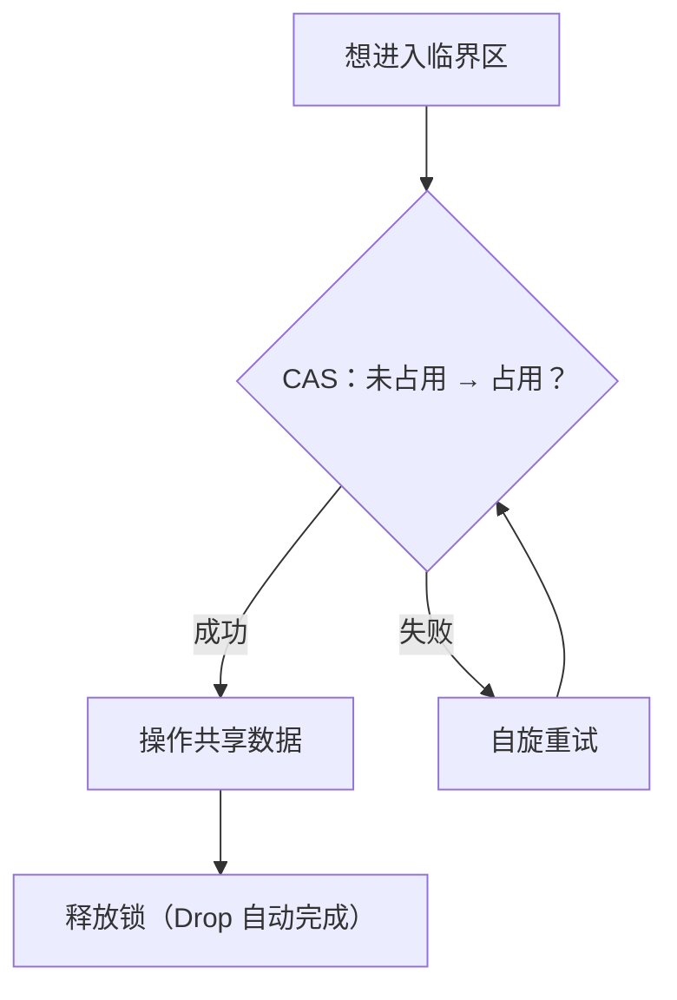
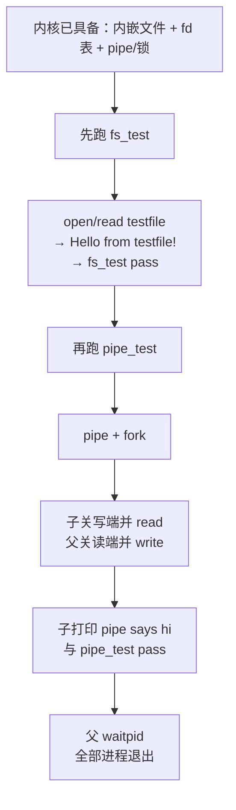

# 实验 5：文件系统与并发

> 相关教材理论：
>
>  [第 28 章 · 锁（P230）](/downloads/ostep-zh.pdf#page=230)
>
>  [第 36 章 · I/O 设备（P313）](/downloads/ostep-zh.pdf#page=313)
>
>  [第 39 章 · 插叙：文件和目录（P352）](/downloads/ostep-zh.pdf#page=352)

## 零、开始之前

在开始接入文件描述符、管道与自旋锁之前，请确认已完成以下准备：

1. **已完成 Lab4**：理解 `fork` / `exec` / `wait`（见 [Lab4 进程管理](/labs/lab4-process)）。本实验会继续用「父子进程 + 继承打开表」的直觉。
2. **快速自检**：以下两条命令都能输出版本号，说明环境就绪：
  ```powershell
   rustc --version                    # 预期：rustc 1.96.0 ...
   qemu-system-riscv64 --version      # 预期：QEMU emulator version 11.0.50 ...
  ```
3. **建议先读书**：OSTEP 第 28 章（锁）、第 36 章（I/O）、第 39 章（文件和目录）。带着「程序怎么读文件」「隔离进程如何传字节」「为什么要加锁」三个问题进来即可。Lab5 对应 feature 为 `lab5`（依赖 `lab4`）。


## 一、问题场景

Lab4 结束后，内核已经能创建进程、切换程序、等待子进程。但是换到日常写程序的视角，还是会在两件很普通的事上卡住：

> 「我想打开一份叫 `testfile` 的数据读出来；并且，父进程想给子进程传一句 `hi`——怎么做？」

想要解决第一件事，你要学会回答：**数据从哪来、怎么读**。总不能把整份内容写死在代码里，也不能假设用户程序能直接摸到内核或磁盘上的某一块内存。  
想要解决第二件事，你要学会回答：**已经隔离的进程之间，怎样安全地递几个字节**。我们在 Lab3 中把地址空间隔开了，A 不能再改 B 的变量；可 shell 里「前一个程序的输出变成后一个的输入」这种用法非常常见。

想完成这两件事，至少需要：


| 需要完成                                 | 如果没有会怎样                               |
| ------------------------------------ | ------------------------------------- |
| 一套统一的「打开 → 读/写 → 关闭」接口（用 fd 指称已打开对象） | 每种对象各搞一套调用，或每次把整份数据塞进参数，接口又笨又难扩展      |
| 进程间传字节的通道（管道：一端写、一端读）                | 地址空间隔离后，父子无法安全互传数据；也做不成 shell 式的流水线协作 |
| 对内核共享缓冲区的互斥保护（如自旋锁）                  | 多端同时改读写指针或计数时，轻则数据错乱，重则指针越界           |


OSTEP 把这类问题分别收进两条主线：

- **持久性（Persistence）**：程序眼里的「文件」如何被打开、读写；数据如何以统一方式对待（本实验先用内嵌只读内容练手，真实磁盘留给 Lab6）。
- **并发（Concurrency）**：多个执行流同时碰共享数据时，如何避免乱套（本实验用自旋锁保护管道缓冲）。

本实验的三条抓手是：

1. **文件描述符（fd）**：进程手里的小整数「门牌号」，用来指称已打开的对象；
2. **管道（pipe）**：内核里的字节通道，两端也是 fd，正好衔接 Lab4 的 `fork` 与打开表继承；
3. **自旋锁**：保护管道缓冲这类共享可变状态，避免数据竞争。

本实验新增能力与Lab4 已有能力，对照如下：


| 执行环节   | Lab4（进程）          | 本实验 Lab5（文件 + 同步）                               |
| ------ | ----------------- | ----------------------------------------------- |
| 用户侧读写  | 主要靠内存与打印          | 经 `open` / `read` / `write` / `close`，用 fd 指称对象 |
| 进程间协作  | `fork` / `wait` 等 | 再加管道：一端写、一端读；两端继承自打开表                           |
| 共享状态   | 进程内存彼此隔离          | 内核管道缓冲可被多端访问，需自旋锁保护                             |
| 磁盘文件系统 | 无                 | 仍无真实磁盘；用内嵌只读文件练 fd 语义（磁盘在 Lab6）                 |


也即完成本实验后你需要能回答下面四个问题：

- 如何用每进程一张 **fd 表**，统一「打开 / 读 / 写 / 关」不同对象？
- 本实验的「文件」内容从哪里来？普通文件读与管道读有何不同？
- 管道如何配合 `fork` **继承打开表**，实现进程间传字节？为何要关掉不用的一端？
- 为何共享缓冲区需要临界区？自旋锁里的 **CAS** 解决了什么？

**实验目标**：在 Lab4 进程模型之上，实现每进程 fd 表、内嵌只读文件的 open/read、管道与环形缓冲，以及保护共享结构的自旋锁，使 `fs_test` / `pipe_test` 在 QEMU 中稳定通过。动手点与 Lab2/Lab3/Lab4 一样落在内核：`kernel/src/fs/embedded.rs` 里补全或修复 **fork 后管道引用计数**。这里还没有真实磁盘文件系统，也没有工业级「写满就睡眠」的阻塞 I/O——我们先走通三条最短路径：「打开 → 读写 → 关掉」「一端写、一端读」「进临界区前先拿锁」。

## 二、背景知识

用户程序**不能**直接摸内核内存或磁盘扇区；它只想用一套统一的说法完成「打开 → 读/写 → 关掉」。Unix / OSTEP 把这套说法叫做**文件抽象**；进程手里那个小整数 **fd**，就是走进这套抽象的**门牌号**。

### 2.1 从「读一份数据」到文件描述符


#### 为什么需要 fd？

设想用户程序说：「打开名叫 `testfile` 的东西，再读若干字节。」

如果每次系统调用都要把「这到底是文件、管道还是设备」的全部细节塞进参数，接口会又笨又难扩展。更干净的做法是**分两步**：

1. **打开（open）**：内核认领某个对象，在**当前进程**的打开表里占一个空槽，把**槽位下标**返回给用户；
2. **读写 / 关闭**：用户以后只报这个下标；内核查表就知道「这次操作的到底是什么」。

这个下标就是**文件描述符（file descriptor，简称 fd）**。

去餐馆吃饭，你拿到的是**取餐牌号码**，不是整份订单本身。你喊「3 号取餐」时，后厨根据号码找到对应订单。同理，用户喊 `read(3, buf, len)`，内核根据「本进程 fd 表的第 3 格」找到真正对象。

注意重要一点，**每个进程有自己的一张表**。进程 A 的 `fd = 3` 和进程 B 的 `fd = 3` 完全可以指向不同东西——就像两家餐馆都可以有「3 号取餐牌」。

可以先在脑子里画出这样一张「本进程打开表」（示意）：

```text
下标(fd)   这一格记了什么（FdType）
-----------------------------------------
  0        （空 / 或被占位）
  1        （本内核里常作控制台输出）
  2        （空）
  3        Regular { file_id=testfile, offset=0 }
  4        PipeRead(0)
  5        PipeWrite(0)
  ...
```

用户永远只说「我对 3 号做什么」；内核打开第 3 格，才知道今天是读小册子，还是拧水管。


#### 门牌号背后：FdType

「下标 3」只是门牌；真正决定「能不能读、读哪里」的，是这一格里记下的类型。本实验用枚举 `FdType`（见 `kernel/src/fs/embedded.rs`）区分至少三种情况：


| 变体                            | 你可以把它想成        | 内核还要额外记住什么                        | 用户若用错会怎样        |
| ----------------------------- | -------------- | --------------------------------- | --------------- |
| `Regular { file_id, offset }` | 一本只读小册子的「打开记录」 | 读哪一份（`file_id`）、读到第几个字节（`offset`） | 读错文件或反复从开头读     |
| `PipeRead(id)`                | 水管的**出水口**     | 只能从编号 `id` 的管道取字节                 | 对读端 `write` 应失败 |
| `PipeWrite(id)`               | 水管的**进水口**     | 只能往编号 `id` 的管道送字节                 | 对写端 `read` 应失败  |


用户眼里始终是同一套调用：`open` / `read` / `write` / `close`。  
内核查完表之后才会**分岔**：是按文件 offset 拷贝，还是去动管道环形缓冲——这叫「**统一入口，内部分发**」。

有一个容易混的点：

- **fd**：进程本地的门牌号（每进程一张表）；  
- **file_id / pipe id**：内核全局认的「哪一本小册子 / 哪一根水管」。  
同一个 `pipe id` 可以被父子两个进程的不同 fd 同时指着——后面讲引用计数时会用到。


#### offset 为什么重要？（用数字走一遍）

假设内嵌文件内容是：

```text
Hello from testfile!\n
下标: 0123456789...
```

（大约 21 个字节。）用户第一次 `read(fd, buf, 5)`：

1. 内核看到 `Regular { file_id, offset: 0 }`；
2. 从内容的第 0 字节起拷 5 个字节到用户 `buf`（得到 `Hello`）；
3. 把 `offset` 改成 `5`。

第二次再 `read` 同样长度，就从第 5 字节继续（ `from`…），而不是又从 `H` 开始。  
**如果忘记推进 offset**，每次读都从开头来——稍长一点的内容永远读不完。这是初学者最容易漏掉的一点。

管道端**不在 fd 上挂 offset**：管道里字节的「读到哪 / 写到哪」记在环形缓冲自己的 `read_pos` / `write_pos` 里。对用户仍是同一个 `read(fd, …)`，只是内核走的分支不同。

> 教材常说「一切皆文件」。对本实验，先抓住**第一层含义**即可：普通文件、管道读端、管道写端，在用户眼里都可以用同一套接口操作；**差别在内核查完 fd 表之后怎么走。**


### 2.2 本实验的「文件」从哪里来


#### 还没有磁盘，那 testfile 存在哪？

完整磁盘文件系统要管超级块、inode、目录、块分配……对「刚学会用 fd」这一阶段太重。Lab5 先用更轻的办法：

把几份只读内容**预先编进内核镜像**，放在 `os-fs` 的静态表 `DEFAULT_FILES` 里。当前参考实现里大致是：

```text
("testfile", b"Hello from testfile!\n")
```

可以把它想成：内核启动时就自带几本**只读小册子**，按名字能查到，按偏移能拷贝；**没有真正的磁盘，也谈不上关机写回。** 真正「写到盘上还能再读回来」留给 Lab6。

职责分工：


| 模块                          | 管什么                                       |
| --------------------------- | ----------------------------------------- |
| `os-fs/src/lib.rs`          | 有哪些内嵌文件；按 `file_id` + offset 往缓冲区拷贝       |
| `kernel/src/fs/embedded.rs` | 每个进程一张 fd 表；open 时占槽、read 时查 `FdType` 再分发 |


#### 用户打开并读一遍，内核在干什么？

以 `fs_test` 为例，可以把流程记成一条链：

```text
用户：open("testfile")
  → ecall 进入内核
  → 在 DEFAULT_FILES 里按名字找到内容，得到 file_id
  → 在当前进程 fd 表里找一个空槽，写入
       Regular { file_id, offset: 0 }
  → 把槽位下标（比如 3）返回给用户

用户：read(3, buf, len)
  → 内核查到 Regular
  → 从内嵌字节切片的 offset 处拷贝到用户 buf
  → offset += 实际读到的长度
  → 返回读到的字节数

用户：读到期望字符串 → 打印 Hello from testfile! / fs_test pass
```

请抓住三点：

1. **名字查找在内核**：用户只交出路径字符串和自己的缓冲区，并不直接拿着文件字节；
2. **练的是 fd 语义，不是持久化**：打开表、offset、按类型分发——磁盘以后再说；
3. **仍走 Lab4 的进程 + trap**：测例是用户进程，经系统调用陷入内核完成。


### 2.3 进程之间怎样传一句话：管道


#### 为什么需要管道？

Lab3 把地址空间隔开了：进程 A 不能再改进程 B 的变量。这很安全，但也带来新问题——

> 父进程想把一句 `hi` 交给子进程，该怎么递？

教材与 Unix 的经典答案是**管道（pipe）**：内核里的一段缓冲区，像一根水管——字节从**写端**进去，从**读端**出来。两端进程各自只拿一个「水龙头把手」（也是 fd），并不共享对方的地址空间。


#### 环形缓冲：为什么叫「环」？

实现见 `kernel/src/sync.rs`。可以把它想成一个固定长度的圆环形座位：

- `write_pos`：下一个空位从哪开始坐（写）；
- `read_pos`：下一个客人从哪开始走（读）；
- `count`：现在还坐着多少人（可读字节数）。

写到数组物理末尾时，下标对长度取模，**绕回开头**继续写，所以叫环形缓冲——不必每次把整段数据搬来搬去。

对本实验还要接受两个简化：


| 情况               | 本实验常见行为                        | 真实系统常见行为      |
| ---------------- | ------------------------------ | ------------- |
| 缓冲**空**，有人 read  | 暂时读不到（常返回错误码），用户程序可 `yield` 再试 | 读进程睡眠，等有数据再唤醒 |
| 缓冲**满**，有人 write | 常直接 `break` / 少写一些             | 写进程睡眠，等有空位再唤醒 |


先把「一端写、一端读」跑通；阻塞式 I/O 可以在任务三里体验雏形。

#### 管道两端也是 fd

创建管道时，`pipe(&mut fds)` 成功后通常：

- `fds[0]` = 读端（`PipeRead`）
- `fds[1]` = 写端（`PipeWrite`）

之后用户仍调用同一个 `read` / `write`；内核查表发现类型是管道端，就去操作环形缓冲，而不是去动 `Regular` 的 `offset`。

#### 和 fork 怎么配合？（最重要的骨架）

Lab4 的 `fork` 会**复制父进程的打开表**。因此常见写法是：

```text
1. 父进程先 pipe，得到读端、写端两个 fd
2. fork：子进程也拿到「同一根水管」的两端把手
3. 父关掉自己不需要的一端，子关掉另一端
4. 形成清晰的单向流水线：一端只写，一端只读
```

用「打开表长什么样」来看更直观。假设 `pipe` 之后：

```text
父进程 fd 表（示意）
  4 → PipeRead(0)     // fds[0]
  5 → PipeWrite(0)    // fds[1]
```

`fork` 刚完成时：

```text
父进程                    子进程
  4 → PipeRead(0)          4 → PipeRead(0)     ← 复制来的
  5 → PipeWrite(0)         5 → PipeWrite(0)    ← 复制来的
         \________ 同一根水管（pipe id = 0）________/
```

若谁都不关：父子都既像读又像写，方向不清楚，引用计数也一直偏高。  
正确收束后应接近：

```text
父进程（只写）              子进程（只读）
  4 已 close               4 → PipeRead(0)
  5 → PipeWrite(0)         5 已 close
```

shell 里「前一个程序的输出接到后一个程序的输入」，骨架正是上面这套。

#### 引用计数：关一个号码 ≠ 拆掉水管

`fork` 之后，父、子打开表里可能**各自**握着指向同一根管道的写端（读端同理）。对用户是两个不同的 fd 号码；对内核是**同一块**环形缓冲。

内核用**引用计数**记账：

- 每多一个 fd 指向「写端这一侧」，`write_refs` 加一（读端同理）；
- 某个进程 `close` 掉自己的写端，或进程退出回收打开表时，计数减一；
- **只有某一侧计数减到 0**，才表示「这一侧已经没有人再持有」。

举个具体画面：

```text
父、子都继承了写端 → write_refs = 2
父先 close(写端)   → write_refs = 1（子还握着）
此时读端不应误以为「永远没人再写了」
子也 close(写端)   → write_refs = 0
读端再 read，才适合得到「没有更多数据了」（教学版 EOF）
```

所以请记住一句话：

> **管道缓冲区的寿命，跟「还有没有 fd 指着它」绑定；**  
> **不是「某一个进程关没关某一个号码」那么简单。**

若你在排错时「关了写端却总等不到结束」，先问问自己：**另一边是不是还有一个写端 fd 活着？**

### 2.4 共享缓冲区上的交错：为何需要同步

管道字节躺在**内核里的那一块环形缓冲**里。父进程 `write`、子进程 `read` 都会走进内核，去改同一份字段：`count`、`read_pos`、`write_pos`……

若两段代码交错执行，就会出现教材里的 **数据竞争（data race）**。

先看一个最小例子。无保护的 `count += 1` 在 CPU 上通常不是一步，而是：

```text
读出 count 的当前值
→ 在寄存器里加一
→ 把新值写回内存
```

设想两个执行流都想把 `count` 从 3 加到 4：

```text
执行流 A：读到 3
执行流 B：也读到 3          ← A 还没写回
执行流 A：写回 4
执行流 B：写回 4            ← 本该变成 5，结果仍是 4
```

这叫**更新丢失**。套到管道上，可能出现：

- 可读字节数算错 → 多读、少读，或误判空/满；
- 读写指针各走各的 → 字节错乱、重复或丢失；
- 更糟时指针越界 → 直接破坏内核缓冲。

因此，「改这些共享字段」的那几行代码，同一时刻只应允许一个执行流待在里面。这样的区间叫**临界区（critical section）**：

1. 进入前：先拿到互斥权（下一节的自旋锁）；
2. 在里面：安心读改写共享状态；
3. 离开时：放开互斥权，让别人进来。

`pipe_read` / `pipe_write` 要在整段操作外包一层保护——  
**不是「管道」这个词特殊，而是「内核里有一份会被多端同时改的状态」特殊。**

你可能会问：我们现在好像还是「单核、协作式切换」，为什么也会交错？  
因为父进程 `write` 进内核改缓冲时，若中途发生调度（或之后子进程 `read`），两段「读改写共享字段」的代码仍然可能一前一后交错。教学实验里先建立「共享可变状态必须进临界区」的直觉；锁保护的是**正确性**，不要求你先会画完整多核时序图。

### 2.5 自旋锁：最短路上的互斥

本实验用最简单的互斥原语之一——**自旋锁（spinlock）**，代码里是 `SpinMutex`。

直觉上它就是一把门锁：


| 步骤  | 发生了什么                                           |
| --- | ----------------------------------------------- |
| 抢锁  | 若锁是「未占用」，把它改成「占用」，进入临界区                         |
| 自旋  | 若锁已被占用，就在原地循环重试（空转等），直到对方释放                     |
| 解锁  | 离开临界区时改回「未占用」；常由 `SpinMutexGuard` 的 `Drop` 自动完成 |


「看一眼空闲 → 写成占用」这两步，**不能**用普通赋值凑合——中间仍可能被别人插队。硬件提供的原子操作里，常见形态是 **CAS（compare-and-swap）**：

> 仅当锁**仍然是**「未占用」时，才改成「占用」；否则本次失败，继续自旋。

本实验对应 `compare_exchange_weak(false, true, …)`。




使用边界（心里有数即可）：

- 拿不到锁时会**空转占 CPU**，不适合长时间持有；
- 更适合**内核中极短**的临界区（例如改几下管道指针）。

Lab8 会再谈「拿不到就让出 CPU」的阻塞同步；Lab5 先把自旋锁当作同步问题的第一块踏脚石。

### 2.6 fork 之后关哪一端：本实验动手考点

内核侧的管道、fd 继承、锁，在领取 Lab5 时已经接进你的小 OS。  
工作区 **fill / debug** 把练习落在用户测例 `user/src/bin/pipe_test.rs`，逼你把「单向流水线」写对——这和真实 shell 关端的习惯一致。

#### 健康骨架（请对照着写）

```text
pipe → fork
→ 子进程：close(写端)，从读端 read，打印内容，再打印 pipe_test pass
→ 父进程：close(读端)，write("pipe says hi\n")，close(写端)，waitpid
```

口诀：

> **读的人关写端；写的人关读端。**  
> 写完还要关写端，读端才容易看到「写侧已经结束」。

正误对照（排错时很有用）：


| 做法                        | 常见后果                        |
| ------------------------- | --------------------------- |
| 子进程关掉**写端**，再 `read(读端)`  | 正确方向；能读到父进程写入的数据            |
| 子进程误关**读端**，还去 `read(读端)` | 读的把手没了；往往看不到 `pipe says hi` |
| 父进程不关读端、子进程不关写端           | 两端角色模糊；EOF / 引用计数也难对        |
| 父写完后不关写端                  | 子进程可能一直觉得「还会有人写」，读循环不好收尾    |


| 变体        | 你在文件里看到什么                                              | 要你做什么                         |
| --------- | ------------------------------------------------------ | ----------------------------- |
| **fill**  | `child_reader` / `parent_writer` 是 `todo!()`；上方有「思路提示」 | 按提示补全关端、读写与 `waitpid`         |
| **debug** | 文件头写清现象；子进程 `close` 附近埋了关错端                            | 按「现象 → 假设 → 最小实验 → 证据 → 结论」排查 |


两者指向同一结论：

```text
fork 后父子都继承读端与写端
→ 若不关掉不用的一端，引用计数与「何时 EOF」会乱
→ 子进程若误关读端却仍去 read，往往看不到 pipe says hi / pipe_test pass
```


#### 两个容易混的细节

1. **Lab4 的 waitpid**：返回值是「等到了哪个子进程（pid）」；`exit_code` 才是退出码。父进程收尾时不要混。
2. **为什么先 open 两个 testfile？**
  测例用 placeholder 占住低号 fd，避免管道端落到 0/1。本内核里 **fd 1 常作控制台**：若管道不小心占了 1，后续打印/读写会非常难查。


### 2.7 把 fd、管道与测例放进同一条时间线

QEMU 里整条 Lab5 主测例，可以按时间这样理解：



串起来记三句话就够用：

1. **fd**：指称「我打开了什么」；
2. **管道**：让隔离的进程安全地递字节；
3. **锁**：别把内核里那块共享缓冲改乱。


## 三、实验任务

本实验主要相关文件（路径相对 `os-lab/`）：


| 文件 | 角色 | 阅读时重点确认 |
| --- | --- | --- |
| `os-fs/src/lib.rs` | 内嵌文件抽象 | `open` / `read_at`、按 offset 拷贝 |
| `kernel/src/fs/mod.rs` | FS 入口开关 | Lab5 选用 `embedded`，Lab6 起换成 `disk` |
| `kernel/src/fs/embedded.rs` | 每进程 fd 表与 syscall；**任务一动手点** | `FdType`、`clone_fd_table`、`bump_inherited_pipe_refs` / `pipe_add_refs` |
| `kernel/src/sync.rs` | 自旋锁 + 管道缓冲 | CAS、环形缓冲、`read_refs` / `write_refs` |
| `kernel/src/trap.rs` | 系统调用分发 | openat / read / write / close / pipe |
| `kernel/src/process.rs` | fork 时调用 `clone_fd_table` | 打开表如何随子进程一起走 |
| `user/src/bin/fs_test.rs` | 文件测例（参考实现，一般不必改） | open + read + 校验 |
| `user/src/bin/pipe_test.rs` | 管道测例（参考实现，一般不必改） | 父子关端与读写协议 |


> 完整代码走读与参考答案见 [lab5 参考答案](/answers/lab5-answers)。


### 任务一：完成实验

本实验的任务文件为 `kernel/src/fs/embedded.rs`，请在工作区中打开文件，并根据注释提示完成实验。用户测例 `fs_test` / `pipe_test` 保持不变。

按你领到的变体对照：

| 变体 | 你在 `embedded.rs` 里看到什么 | 要你做什么 |
| --- | --- | --- |
| **fill** | `bump_inherited_pipe_refs` 是 `todo!()`；上方有思路提示 | 遍历子进程刚继承的 fd 表，对 `PipeRead` / `PipeWrite` 调用 `sync::pipe_add_refs` |
| **debug** | 文件头写清现象；`clone_fd_table` 循环里漏掉了 `pipe_add_refs` | 按「现象 → 假设 → 最小实验 → 证据 → 结论」排查并补上 |

核心不变量（对照背景知识里的 fork + 管道）：

1. `clone_fd_table` **复制 fd 表项** 与 **管道引用计数 +1** 是两件事；
2. `sys_pipe` 时两端 refs 已是 1；fork 后再不加，子进程 `close` 某一端会把 refs 减到 0，父进程还握着那一端就会坏；
3. `Regular` 内嵌文件是静态切片，不必 bump；只有管道端需要。

运行验证：

```powershell
cargo run -p kernel --features lab5 --release
```

**预期输出**：屏幕会先刷出 **OpenSBI 启动日志**（可忽略），随后是内核与用户测例输出。示意如下：

```text
OpenSBI v1.7
  ...（OpenSBI 平台/HART 日志，可忽略）...
os-lab kernel lab5: filesystem and sync.
Loading 5 user apps (ELF, lab4 process model)...
Hello from testfile!
fs_test pass
pipe says hi
pipe_test pass
All processes exited.
```

**通过标准**（下列输出断言缺一不可）：


| 断言 | 必须看到 |
| --- | --- |
| `fs-hello` | `Hello from testfile!` |
| `fs-pass` | `fs_test pass` |
| `pipe-msg` | `pipe says hi` |
| `pipe-pass` | `pipe_test pass` |
| `all-exited` | `All processes exited.` |


且 QEMU 正常退出（终端命令返回，没有卡住或报错）。

> 未修好时常见：`fs_test pass` 仍在，但缺少 `pipe says hi` / `pipe_test pass`——优先查 `clone_fd_table` / `bump_inherited_pipe_refs`，而不是先改用户测例关端。  
> 可能看到 `pipe write failed` 与某进程 `exited with code -1`——已知占位现象，不影响以 `pipe_test pass` 为准。  
> 对比 Lab4：Lab5 在进程 API 之上增加了 fd 与管道；fill/debug 考的是**内核管道 refs**，用户侧 `pipe_test` 已是正确关端协议。


### 任务二：阅读理解

任务二为思考题。先合上代码用自己的话写答案，再回到代码逐行核对，不要急着找现成结论。

1. 对照 `FdTable` 与 `FdType`：fd 表如何设计？为什么 `Regular` 要记 `offset`，管道端却不在 fd 上挂 offset？
2. 对照 `sys_read`（或等价分发）：为什么要按 fd 类型分发？对 `PipeWrite` 做 `read` 应该怎样失败？
3. 对照 `SpinMutex`：自旋锁为何必须用原子 CAS？`SpinMutexGuard` 的 `Drop` 解决了什么粗心错误？
4. 管道写满时本实验为何常 `break` 而非阻塞等待？与真实系统的「阻塞式 I/O」差在哪？
5. `fork` 后为何要继承 fd 表？管道为何要引用计数？父先 `close` 写端、子仍握着写端时，读端应不应当立刻认为 EOF？
6. 对照任务一 fill / debug：`clone_fd_table` 在复制表之后还应对 `PipeRead` / `PipeWrite` 做什么？若漏掉，为什么往往是 `pipe_test` 坏而 `fs_test` 仍过？
7. 用户测例 `pipe_test` 里子进程应关掉哪一端再读？这与内核 bump refs 各解决哪一层问题？测例为何先 `open("testfile")` 占两个低号 fd 再 `pipe`？


### 任务三：动手修改

> 下列修改用于加深理解，可在任务一通过后再做。每项改完都运行 `cargo run -p kernel --features lab5 --release` 验证，通过后改回原样。  
> 教师下发的 **fill / debug** 是主任务（见任务一）；不要用改用户测例的方式绕过内核题。

**修改 1：观察用户侧关错端（对比任务一）**

在参考实现的 `user/src/bin/pipe_test.rs` 里，临时让子进程 `close` 读端而不是写端（改完再跑）。

- 预期：管道测例失败；这是**用户协议**错误。
- 通过标准：能用自己的话区分「用户关错端」与「内核漏 bump refs」——两者现象可能都是管道失败，但排查文件不同（`pipe_test.rs` vs `embedded.rs`）。
- **做完务必改回并**确认 `pipe_test pass` **恢复**。

**修改 2：去掉管道锁**

在管道读写路径上临时不持锁（或注释掉保护共享缓冲的加锁），再反复跑 `pipe_test`。

- 预期现象：可能偶发乱码、断言失败或表现不稳定——这正是数据竞争的直观后果。
- 通过标准：观察到异常或不稳定，并用自己的话解释**为什么**管道缓冲需要锁。
- **做完务必改回并**确认 `pipe_test pass` **恢复**。

**修改 3：写满时 yield 再写**

当前写满缓冲区时常直接 `break`。试着结合 `sys_yield`（或用户侧循环 yield）在「缓冲满」时让出 CPU，争取写出超过缓冲区大小的数据，体验阻塞式 I/O 的雏形。

- 通过标准：能说明「满则让出 / 再试」与「满则 break」的差别；若改动能跑通更大写入，记下现象即可。
- **做完务必改回并**确认恢复正常。

**修改 4（可选）：新增内嵌文件**

在 `os-fs` 的 `DEFAULT_FILES` 里加一项自定义名字与内容，再写（或改）用户程序 `open` + `read` 并打印出来，走通「加文件 → 打开 → 读出」闭环。

- 通过标准：能看到新增文件内容被正确读出，且原有 `fs_test pass` 仍保持通过。
- **做完务必改回**（若希望保留作展示，可另开分支，不要污染主测例预期）。


## 四、验证命令


| 验证项      | 命令                                                    | 通过标准                                                                                          |
| -------- | ----------------------------------------------------- | --------------------------------------------------------------------------------------------- |
| 主编译      | `cargo check -p kernel --features lab5`               | 无 error                                                                                       |
| QEMU     | `cargo run -p kernel --features lab5 --release`       | `Hello from testfile!`、`fs_test pass`、`pipe says hi`、`pipe_test pass`、`All processes exited.` |
| 组件单测（可选） | `cargo test -p os-fs --target x86_64-pc-windows-msvc` | **11** 项通过（`os-fs` 库测：内嵌文件 open/read 4 项、`fd_kind` 3 项、disk 辅助 4 项）                           |


> 任意白名单命令“退出码 0”**不等于** Lab 通过；例如缺少 `pipe_test pass` 时，命令仍可能返回 0。  
> 组件单测在 `os-lab/` 目录下执行；`--target x86_64-pc-windows-msvc` 表示在宿主机上跑，不经过 QEMU。

