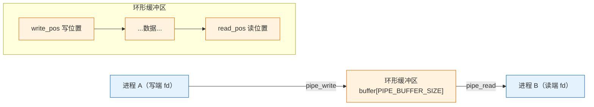
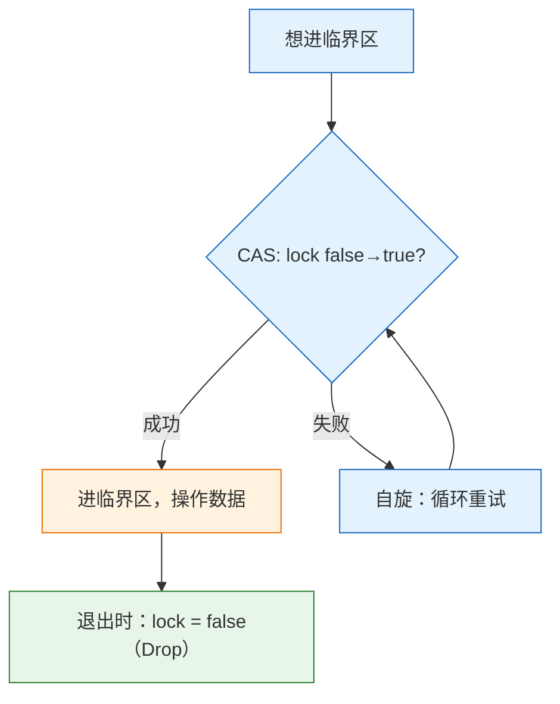

# 实验 5：文件系统与并发

> 对应 feature：`lab5`（依赖 `lab4`）。这是 os-lab 的最后一个实验，也是内容最丰富的一个——它给内核装上"文件系统"和"并发同步"两件武器。学完它，你的内核才真正像现代操作系统：能读写文件、能让进程间通过管道通信、能安全地处理并发。

## 零、开始之前

1. **已完成 Lab4**：理解了 fork/exec/wait 进程模型（见 [lab4-process.md](lab4-process.md)）。
2. **进入工作目录**：`cd os-lab`，必要时先 `. .\scripts\activate-os-env.ps1` 激活环境。
3. **自检**：`rustc --version` 与 `qemu-system-riscv64 --version` 能输出版本。
4. **建议先读书**：OSTEP 第 26-29 章（锁/条件变量/信号量/死锁）+ 第 36-37 章（文件/文件系统）是本实验的理论基础，动手前务必读。

## 一、问题场景

到目前为止（lab1-4），你的内核能管理进程，但两个尴尬的局限还在：

- **进程没法存数据，也没法交换数据**。每个程序跑完就消失，它产生的数据无处保存；两个程序想交换信息（比如 shell 把命令结果传给下一个程序），也没有任何通道。如果你是操作系统设计者，会怎么解决？
- **多个进程/线程同时操作共享数据会出错**。比如两个进程同时往同一个管道写，数据会交错混乱；两个进程同时改一个计数器，更新会丢失。你拿什么保护共享数据？

操作系统给出了两套答案，也是本实验的核心：

- **文件系统**：把"持久化数据"抽象成"文件"，每个进程通过文件描述符（fd）读写文件；再用"管道"这种特殊的文件，让两个进程像传水管一样传递数据。
- **并发同步**：用"锁"等同步原语，保证同一时刻只有一个执行流能操作共享数据，避免数据竞争。

本实验带你实现这两套机制。学完后，你的内核能跑 `fs_test`（读写文件）和 `pipe_test`（父子进程通过管道通信），具备现代 OS 的雏形。

## 二、背景知识

### 2.1 文件描述符 fd：一切皆文件的入口

> 🤔 **先想**：进程要读写文件，但内核怎么知道"这次 read 是读哪个文件"？你会给每个进程维护什么数据结构？

答案是**文件描述符表（fd table）**：每个进程有一个数组，每个槽位对应一个打开的文件。程序拿到的是一个**整数 fd**（0/1/2...），用它作为表的索引，内核查表得到真正的文件信息。


本实验的 fd 有三种类型（`FdType`）：`Regular`（普通文件，带 file_id 和 offset）、`PipeRead`（管道读端）、`PipeWrite`（管道写端）。这种"用 fd 统一抽象文件和管道"的设计，就是 Unix"一切皆文件"哲学的体现。

### 2.2 内嵌只读文件：最简文件系统

> 🤔 **先想**：完整的文件系统（磁盘、inode、目录树）非常复杂。作为教学起步，你会怎么用一个最简单的方式让进程"读到文件内容"？

本实验用最简方案：**把文件内容编译进镜像**，静态表定义在 **`os-fs/src/lib.rs` 的 `DEFAULT_FILES`**（`&[(&str, &[u8])]`）。内核 `fs.rs` 通过 `EmbeddedFs::default_fs()` 共用同一张表（`static FS`），**没有**内核内的 `EMBEDDED_FILES`。`sys_openat("testfile")` 经 `FS.open` 查到对应字节切片，`sys_read` 按 offset 拷贝到用户缓冲。

```mermaid
graph LR
    O["openat(\"testfile\")"] --> F["FS.open → DEFAULT_FILES 查到 file_id"]
    F --> A["分配 fd，记录 file_id + offset=0"]
    R["read(fd, buf, len)"] --> G["查 fd 得 file_id, offset"]
    G --> C["FS.read_at 拷贝到用户 buf"]
    C --> U["offset 前移"]

    classDef open fill:#e3f2fd,stroke:#1565c0;
    classDef data fill:#fff3e0,stroke:#ef6c00;
    class O,A open;
    class F,G,C data;
```

> 注：这是教学简化版（只读、无磁盘）。真实文件系统要管理磁盘块、inode、目录，复杂得多。后续可作为扩展项目。

### 2.3 管道 pipe：进程间的水管

> 🤔 **先想**：两个进程要交换数据。进程 A 写，进程 B 读。但它们地址空间隔离，没法直接共享内存。你会设计什么机制？

答案是**管道**：内核维护一个**环形缓冲区**，进程 A 往里写、进程 B 从中读。管道有两个 fd——读端和写端，分别分给两个进程。



关键细节：
- **环形**：`write_pos` 和 `read_pos` 到达数组末尾就绕回 0（`(pos+1) % SIZE`），复用已读走的空位。
- **count 记账**：缓冲区里有几个字节可读。count=0 时 read 返回 -1（暂无数据）；count=满时 write 停止。
- **fork 继承**：父进程创建管道后 fork，父子各拿一端——这就是 shell 管道 `ls | grep` 的实现原理。本实验用 `clone_fd_table` 让子进程继承父的 fd 表。

### 2.4 自旋锁：最简单的同步原语

> 🤔 **先想**：两个执行流同时操作同一个缓冲区（比如管道），数据会乱。你怎么保证"同一时刻只有一个能操作"？硬件能给你什么帮助？

最简单的锁是**自旋锁（spinlock）**：用一个原子变量当"门锁"，谁要进临界区就尝试把锁从 `false` 改成 `true`，改成功就进去；改不成功（别人占着）就**原地打转重试**（自旋），直到拿到。



本实验的 `SpinMutex` 用 `AtomicBool` + `compare_exchange_weak` 实现锁，靠 RAII（`SpinMutexGuard` 的 `Drop`）自动释放——`guard` 离开作用域时自动 `store(false)`，不会忘解锁。

> 自旋锁的代价：拿不到锁时 CPU 空转浪费。单核上自旋还可能死锁（占着 CPU 的那个永远没机会释放锁）。真实系统会用"让出 CPU 等待"的睡眠锁，但自旋锁是理解同步的起点。

### 2.5 为什么需要同步：数据竞争

> 🤔 **先想**：假设没有锁，两个进程同时往管道的 count 字段 `count += 1`。这个"+1"在 CPU 层面是几条指令？如果两条指令序列交错执行，结果会怎样？

`count += 1` 不是原子的，它展开成"读 count → 加 1 → 写 count"三步。两个执行流同时做，可能出现：

```
A 读到 count=5
            B 读到 count=5
A 写 count=6
            B 写 count=6   ← 本应是 7，但丢了！
```

这就是**数据竞争（data race）**。锁的作用就是让"读-改-写"这一串操作**原子化**——同一时刻只有一个执行流能进入临界区，避免交错。管道的 `pipe_read`/`pipe_write` 全程持锁，就是为此。

## 三、实验任务

> **本实验怎么学**：这是最后一个 lab，内容最多（文件系统 + 管道 + 同步），但每个机制都不复杂。代码已为你准备好完整可运行版本。这里**更要先想再对照**：fd 表、管道、自旋锁每个都先自己猜"如果是我会怎么实现"，再去看已有实现。同步原语尤其值得深究——它是理解并发的钥匙。

lab5 涉及的代码分布在这些文件，先浏览建立印象：

| 文件 | 角色 | 先想"如果是我会怎么设计" |
|------|------|-------------------------|
| `os-fs/src/lib.rs` | 组件 crate（文件抽象） | 文件怎么抽象？open/read 接口怎么定？ |
| `kernel/src/fs.rs` | 内核文件系统集成 | fd 表怎么组织？Regular/Pipe 怎么区分？ |
| `kernel/src/sync.rs` | 并发原语（锁 + 管道） | 自旋锁用原子操作怎么实现？管道环形缓冲怎么管理？ |
| `kernel/src/trap.rs` | trap 分发（lab5 扩展） | openat/read/write/close/pipe 怎么分发？ |
| `user/src/bin/fs_test.rs` | 文件测试程序 | 怎么 open+read+验证？ |
| `user/src/bin/pipe_test.rs` | 管道测试程序 | 父子进程怎么各拿一端通信？ |

> 提示：本实验不给完整代码讲解。每个文件"为什么这么写"请结合【背景知识】自己想明白。完整代码解读见 `labs/answers/lab5-answers.md`，**强烈建议先自己想完再对照答案**。

本实验分为三档任务：

### 任务一：跑通 lab5（必做）

```powershell
cargo run -p kernel --features lab5
```

**预期输出**（前面约 40 行 OpenSBI 日志可忽略，以下是内核与进程部分）：

```text
os-lab kernel lab5: filesystem and sync.
Loading 5 user apps (ELF, lab4 process model)...
Hello from testfile!                ← fs_test：open + read 读出内嵌文件内容
fs_test pass                        ← 文件读写测试通过
pipe says hi                        ← pipe_test：父子通过管道传了一句消息
pipe_test pass                      ← 管道通信测试通过
All processes exited.               ← 全部退出，关机
```

**通过标准**：看到 `Hello from testfile!`、`fs_test pass`、`pipe says hi`、`pipe_test pass`、`All processes exited.`，且 QEMU 正常退出（exit code 0）。

> 注意：输出里可能看到一条 `pipe write failed` + 某进程 `exited with code -1`。这是已知的预期现象（pipe_test 为避开内核 fd 0/1 控制台语义做的占位处理），不影响 `pipe_test pass` 的判定。看到 `pipe_test pass` 即说明管道机制工作正常。

### 任务二：阅读理解（必做）

每道题**先合上代码，自己猜一个答案，再打开代码对照**：

1. 打开 `kernel/src/fs.rs` 的 fd 表前，先想：每个进程要记录"打开了哪些文件"，你会用什么数据结构？一个 fd（整数）怎么对应到具体文件？看 `FdTable` 和 `FdType` 是怎么设计的，为什么 Regular 要记 `offset`？
2. 打开 `sys_read` 前，先想：read 怎么区分"读普通文件"和"读管道"？看代码里 `match ty { Regular => ..., PipeRead => ... }`——为什么要按 fd 类型分发？
3. 打开 `kernel/src/sync.rs` 的 `SpinMutex` 前，先想：自旋锁要"原子地"把锁从 false 改成 true，普通赋值行不行？看 `compare_exchange_weak` 是怎么做到"测试并设置"原子的。为什么用 `Ordering::Acquire`/`Release`？
4. 打开 `pipe_write` 前，先想：环形缓冲区写满了怎么办？看代码里 `if inner.count >= PIPE_BUFFER_SIZE { break }`——为什么是 break 而不是等待？这种"满了就停"的取舍有什么后果？
5. 打开 `clone_fd_table` 前，先想：fork 后子进程要继承父进程的 fd 吗？如果不继承，shell 的 `ls | grep` 还能工作吗？看代码里管道 fd 的引用计数（`pipe_add_refs`）——为什么管道要计数，普通文件不用？

> 学习提示：这 5 题串起来是"一次管道通信的完整旅程"——父进程建管道 → fork → 子进程继承 fd → 父写子读 → 通过环形缓冲传递数据 → 引用计数管理回收。能把这条链路从头讲到尾，lab5 就过关了。

### 任务三：动手小修改（选做，建议完成）

**修改 1：新增一个内嵌文件**

在 `os-fs/src/lib.rs` 的 `DEFAULT_FILES` 表里加一项，比如 `("greeting", b"Hi from new file!\n")`，然后写个小用户程序 `openat("greeting")` + `read` + 打印（内核经 `EmbeddedFs::default_fs()` 自动共用这张表）。

- 通过标准：看到 `Hi from new file!` 输出。
- 这个练习让你走通"添加文件 → open → read"的完整闭环。

**修改 2：观察无锁的后果（理解性实验，需谨慎）**

在 `pipe_write` 里临时注释掉 `let mut inner = pipe.inner.lock();`，改成不持锁直接操作缓冲区。重新跑 pipe_test。

- 预期现象：不一定每次都崩（数据竞争有随机性），但可能出现数据错乱或 count 计数错误。
- 通过标准：能观察到"无锁时数据可能出错"，理解为什么必须加锁。做完**务必改回**。
- ⚠️ 这个修改可能导致内核不稳定，做完立刻还原。

**修改 3：让管道支持"写满时等待"（进阶）**

当前 `pipe_write` 满了就 break 返回。改成"满了就 yield 让出 CPU，等读端消费后再写"。需要结合 lab2 的 yield 机制。

- 通过标准：能写超过 PIPE_BUFFER_SIZE 的数据（分批写）。
- 这个练习让你体会"阻塞式 I/O"是怎么实现的。

### 提交清单（自查）

- [ ] 能在 QEMU 中跑通 lab5，看到 fs_test pass + pipe_test pass
- [ ] 能解释 fd 表怎么把整数 fd 映射到具体文件
- [ ] 能解释自旋锁为什么用原子操作、为什么需要内存屏障
- [ ] 能解释管道的环形缓冲区 + 引用计数机制
- [ ]（选做）完成至少 1 个任务三的修改并理解现象

## 四、验证

本实验以【任务一】的 `cargo run -p kernel --features lab5` 能输出 `Hello from testfile!`、`fs_test pass`、`pipe_test pass`、`All processes exited.` 并正常退出为主要验证标准。其余任务的验证标准见各任务说明。

## 五、AI 提问模板

1. **概念澄清型**：「自旋锁在单核 CPU 上为什么会出问题？单核和多核环境下自旋锁的适用场景有什么不同？」
2. **现象解释型**：「我的 pipe_test 偶尔输出乱码，偶尔正常，这是为什么？提示：和并发有关吗？」
3. **代码追因型**：「`compare_exchange_weak` 比 `compare_exchange` 多个 weak，为什么自旋锁用 weak 版本？」
4. **对比深化型**：「自旋锁和信号量有什么区别？什么场景该用哪个？管道如果用信号量而不是自旋锁会怎样？」
5. **动手探索型**：「我想实现真正的磁盘文件系统（不是内嵌只读），需要哪些组件？inode、目录、块设备分别解决什么？」

## 六、思考题与参考答案

### 习题 1

**fd 表怎么设计？为什么 Regular 要记 offset？**

参考答案：每个进程用一个数组 `FdTable`（槽位数组），fd 就是数组下标。槽位里存 `FdType` 枚举：`Regular{file_id, offset}`（普通文件，记是哪个文件 + 读到哪了）、`PipeRead(id)`/`PipeWrite(id)`（管道读写端）。Regular 要记 offset 是因为：同一个文件可以被多次 read，每次 read 要从上次的位置继续，offset 记录"读到哪了"。不记 offset 的话每次 read 都从头读，没法顺序读完整个文件。

### 习题 2

**read 为什么要按 fd 类型分发？**

参考答案：因为 fd 是统一抽象，fd=3 可能是普通文件也可能是管道读端，它们的"读"实现完全不同：普通文件从内嵌字节切片按 offset 拷贝；管道从环形缓冲区按 read_pos 拿数据。内核拿到 fd 后必须先查它的 `FdType`，再 `match` 分发到对应逻辑。这就是"一切皆文件"的代价——统一接口背后要按类型分发。

### 习题 3

**自旋锁为什么用 compare_exchange_weak？为什么用 Acquire/Release？**

参考答案：普通赋值 `lock = true` 不是原子的（读-改-写三步可能被打断），两个执行流可能同时以为锁是 false 都进去。`compare_exchange_weak` 是硬件提供的"比较并交换"原子指令，它原子地做"如果 lock==false 就改成 true 并返回成功"。用 weak 是因为自旋锁本来就在循环重试，weak 偶尔的虚假失败可以接受（性能更好）。`Acquire`（获取锁时）保证临界区内的读不会重排到加锁前；`Release`（释放锁时）保证临界区内的写不会重排到解锁后——这两个内存屏障保证临界区的操作不被 CPU 乱序优化破坏。

### 习题 4

**管道写满了为什么 break？有什么后果？**

参考答案：环形缓冲区容量有限（PIPE_BUFFER_SIZE）。写满时 `count == PIPE_BUFFER_SIZE`，再写会覆盖未读的数据，所以 break 停止写入，返回已写入的字节数。后果是：如果读端不消费，写端写满就只能停，写不完大数据。真实系统会让写端"阻塞等待"（sleep 直到读端腾出空间），但本实验简化为"满了就返回"，调用方需要自己处理"没写完"的情况（分批写）。

### 习题 5

**fork 后为什么要继承 fd？管道为什么需要引用计数？**

参考答案：fd 继承是 shell 管道的基础——`ls | grep` 里，shell 建管道后 fork 两次，子进程各自继承一端、关闭另一端，才能形成"ls 写 → grep 读"的通道。不继承 fd 的话子进程拿不到管道端，通信无从谈起。管道要引用计数是因为：管道的读端和写端可能被多个进程持有（fork 复制），只有当**所有**读端和写端都关闭了，管道缓冲区才能释放。`pipe_add_refs` 在 fork 时给子进程的引用 +1，`pipe_close_read/write` 时 -1，归零才真正释放。普通文件不用计数是因为它是只读静态数据，没有"释放"的概念。
