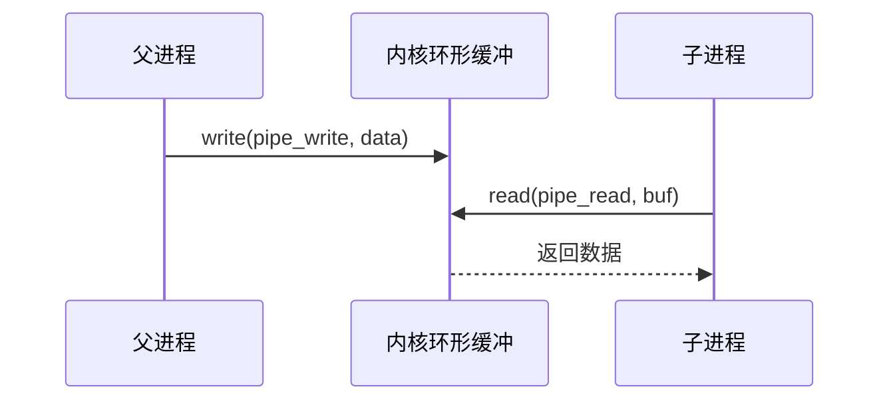
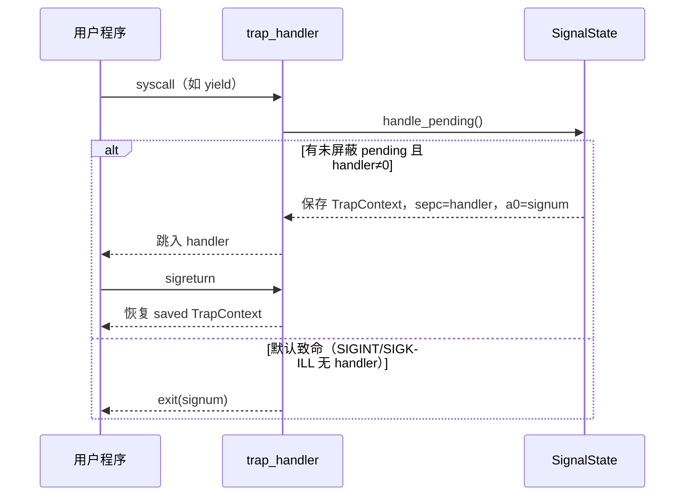

# 实验 7：IPC 与信号

> 对应 feature：`lab7`（依赖 `lab6`）。本实验在 Lab6 磁盘文件系统之上，把 Lab5 的**简化管道**纳入**统一 fd 抽象**，并新增**信号机制**（kill / sigaction / sigprocmask / sigreturn）与 **`dup`**。参考环境对应 **ch7**（无官方 exercise checker，验收以本仓库自建测例为准）。

## 零、开始之前

1. **已完成 Lab6**：能跑通 `make test-lab6`，理解 fd 表、VirtIO 与磁盘 FS。
2. **进入工作目录**：`cd os-lab`，必要时 `. .\scripts\activate-os-env.ps1`。
3. **接口文档**：syscall 编号与语义以 [lab6-8.md §十二](../../docs/lab6-8.md#十二lab7-系统调用接口) 为准（成员 A 冻结点）。
4. **建议先读书**：OSTEP 第 43 章（IPC）+ 第 44 章（信号）是本实验的理论基础。

### 环境准备（与 Lab6 相同）

Lab7 **须带 VirtIO 块设备**访问 `fs.img`：

```powershell
cd os-lab
cargo build -p user --target riscv64gc-unknown-none-elf --release --bins
cargo build -p kernel --features lab7 --release
make test-lab7
```

`kernel/build.rs` 在 `lab7` 下将 **`lab7_usertest`** 打包为 `initproc`，串联 dup → 信号 → 管道回归测例。

## 一、问题场景

Lab6 已能操作真实磁盘文件，但还有两个 ch7 核心能力尚未覆盖：

- **统一 fd**：管道与常规文件应共用同一套 `read`/`write`/`close`/`dup` 入口，而不是两套分散逻辑。
- **异步通知**：除同步 IPC（管道）外，进程还需要**信号**——一种"打断当前控制流、稍后执行处理函数"的机制（如 `Ctrl+C`、子进程结束通知等）。

本实验要回答：

1. 内核如何在**同一 fd 表**里区分 Regular / PipeRead / PipeWrite，并正确分发读写？
2. 信号从 `kill` 投递到用户处理函数，再经 `sigreturn` 恢复，中间经过哪些内核状态？

学完后，你的内核应能：

- `dup` 复制文件或管道 fd（管道会增加引用计数）
- 向指定进程投递 `SIGUSR1` 等信号，并在 syscall 返回用户态前交付
- 用户注册 handler，在 handler 末尾调用 `sigreturn` 恢复原上下文
- `sigprocmask` 屏蔽/解除屏蔽待处理信号

> **延后项**：ch7 完整的 `exec` argc/argv 栈布局与 stdout 重定向 shell 在本环境尚未实现，见接口文档第四节。

## 二、背景知识

### 2.1 统一 fd 抽象（迁移而非重写）

> 🤔 **先想**：Lab5 已有管道，Lab7 为何要"再做一遍"？

Lab7 **不是从零写管道**，而是把 Lab5/Lab6 的管道读写**合并进同一分发路径**。在 `kernel/src/fs/disk.rs` 中，`FdType` 枚举区分三类 fd：

| `FdType` | `read` | `write` |
|----------|--------|---------|
| `Regular` | ✅ | ✅ |
| `PipeRead` | ✅ | ❌ |
| `PipeWrite` | ❌ | ✅ |

`sys_read` / `sys_write` 根据 `slots[fd]` 的 `FdType` 分支：常规文件走 easy-fs inode，管道走 `sync::pipe_read` / `pipe_write`。管道 fd 的 `files[]` 槽位为 `None`（Lab6 联调结论）。

成员 B 在 `os-fs/src/fd_kind.rs` 提供 host 单测，用纯逻辑表验证上述读写矩阵，无需跑 QEMU。

### 2.2 管道 IPC 回顾

管道是**单向、内核缓冲**的字节流：



`dup_test` 验证：父进程 `dup` 管道写端后关闭原 fd，仍可通过新 fd 写入，子进程从读端收到 `dup ok\n`。

### 2.3 信号：同步锁 vs 异步通知

| 维度 | 管道（同步） | 信号（异步） |
|------|-------------|-------------|
| 通信方向 | 明确的发送方/接收方 | 任意进程可向目标 pid 发 `kill` |
| 阻塞性 | 读空管道需 `yield` 重试 | 不阻塞发送方；接收方在**返回用户态前**处理 |
| 数据结构 | 环形缓冲区 | pending 位图 + mask + handler 表 |

`os-signal` crate（`SignalState`）封装 pending/mask/handler，可在 host 上单元测试；内核 `kernel/src/signal.rs` 负责 trap 上下文保存与恢复。

### 2.4 信号处理流程（本环境）



**投递时机**：系统调用处理完毕、**返回用户态之前**（`trap_handler` 末尾）。注意：`yield` 在调度前也会检查 pending，否则基于 `yield` 等待信号的测例会饿死。

**默认动作**（handler == 0）：

| 信号 | 编号 | 行为 |
|------|------|------|
| SIGKILL | 9 | 终止（不可屏蔽） |
| SIGINT | 2 | 终止 |
| SIGUSR1 | 10 | 忽略 |

### 2.5 dup 与引用计数

`dup(old_fd)` 复制 fd 表项：

- **常规文件**：共享同一 `OpenedFile`（inode 相同；本实现各 fd 独立维护 `offset` 副本）
- **管道**：对 `pipe_add_refs` 增加读端或写端引用；**最后一个**写端关闭时才标记 `write_closed`

联调曾修复：`pipe_close_write` 在仍有 dup 出的写 fd 时不应提前 `write_closed = true`。

## 三、实验任务

> **本实验怎么学**：先 `make test-lab7` 看全链输出，再读 `signal.rs` 与 `trap.rs` 中 `yield_and_schedule`，对照 `signal_test` / `signal_mask_test` 用户代码。

主要文件：

| 文件 | 角色 |
|------|------|
| `os-signal/src/lib.rs` | `SignalState`、pending/mask、host 测 |
| `kernel/src/signal.rs` | kill / sigaction / sigprocmask / sigreturn |
| `kernel/src/trap.rs` | Lab7 syscall 分发 + 信号投递 |
| `kernel/src/fs/disk.rs` | 统一 fd 分发、`sys_dup` |
| `kernel/src/sync.rs` | 管道 + 写端关闭语义 |
| `user/src/syscall.rs` | Lab7 用户态包装 |
| `user/src/bin/lab7_usertest.rs` | initproc 链入口 |
| `user/src/bin/dup_test.rs` | 管道 dup 写 |
| `user/src/bin/signal_test.rs` | spawn + kill + handler |
| `user/src/bin/signal_mask_test.rs` | sigprocmask 屏蔽/解除 |

### 任务一：跑通 lab7（必做）

```powershell
make test-lab7
```

**预期输出**（OpenSBI 启动日志可忽略）：

```text
os-lab kernel lab7: IPC and signals.
dup_test pass
signal_test pass
signal_mask_test pass
pipe says hi
pipe_test pass
All processes exited.
```

**通过标准**：出现以上全部 `pass` 行，且 QEMU 正常退出。手册清单数据来自 `handbook/data/labs.json`。

### 任务二：阅读理解（必做）

1. `FdType` 三分支：`sys_read` 对 `PipeWrite` 为何返回 `-1`？
2. `SignalState::take_deliverable`：SIGKILL 为何能绕过 mask？
3. `sigaction` 保存的 `saved_trap_cx` 在何时写入、何时由 `sigreturn` 恢复？
4. `yield_and_schedule` 与 trap 末尾的 `handle_pending` 各在什么路径调用？
5. `dup` 管道写端后 `close` 原 fd，为何仍能通过 dup fd 写入？（提示：写端引用计数）

> 完整走读见 [answers/lab7-answers.md](answers/lab7-answers.md)。

### 任务三：动手小修改（选做）

**修改 1**：在 `signal_child` 中打印收到的 `signum`，确认 `a0` 与注册信号一致。

**修改 2**：对 `SIGINT` 注册忽略 handler（空操作 + `sigreturn`），父进程 `kill` 后子进程应继续运行。

**修改 3**（进阶）：阅读 `reference-patches/ch8-exercise.patch` 中的信号片段，对比本环境简化点（无多线程、无 `tg-signal` trait）。

### 提交清单（自查）

- [ ] `make test-lab7` 全链通过
- [ ] 能解释统一 fd 与 Lab5 管道实现的关系（迁移 + 重构）
- [ ] 能画出信号从 `kill` 到 `sigreturn` 的路径
- [ ] 能说明 `sigprocmask` 与 pending 的交互
- [ ] 完成 [exercises/lab7-exercises.md](exercises/lab7-exercises.md) 文字习题

## 四、验证

| 验证项 | 命令 | 通过标准 |
|--------|------|----------|
| 主编译 | `cargo check -p kernel --features lab7` | 无 error |
| QEMU 全链 | `make test-lab7` | 见任务一预期输出 |
| fs.img | `make check-fs-img` | `fs.img OK` |
| host 单测（可选） | `cargo test -p os-fs -p os-signal --target <host-triple>` | fd_kind 3 项 + signal 4 项 |

## 五、AI 提问模板

1. **概念澄清型**：「管道是同步还是异步？信号是同步还是异步？能否用管道模拟信号？」
2. **现象解释型**：「`signal_mask_test` 屏蔽期间 `kill` 自己，为何 handler 不立即执行？」
3. **代码追因型**：「`yield` 之后若不调用 `handle_pending`，`signal_test` 为何会超时？」
4. **对比深化型**：「本环境信号与 Linux 的 `sigaction` 栈、`SA_RESTART` 等有何简化？」
5. **动手探索型**：「若要把 stdout 重定向到文件，用户态应如何组合 `dup` 与 `close`？」

## 六、思考题与参考答案

部分习题与 [exercises/lab7-exercises.md](exercises/lab7-exercises.md) 重叠；完整答案见 [answers/lab7-answers.md](answers/lab7-answers.md)。

### 习题 1（统一 fd）

**为何 Lab7 不单独实现 `pipe_read` syscall，而要走统一 `read`？**

参考答案：与真实 Unix 语义一致——管道也是 fd，`read(2)`/`write(2)` 根据内核 fd 类型分发。统一入口便于后续 `dup`、`select`（若扩展）复用同一 fd 表，也减少用户态需要记忆的 syscall 数量。

### 习题 2（信号投递时机）

**为何在 syscall 返回用户态之前处理 pending，而不是在时钟中断里立即抢占？**

参考答案：教学简化 + 避免在用户态任意指令间插入 handler 的复杂性。本环境在 trap 返回边界检查 pending，保证处理函数从可预测的"系统调用刚结束"上下文进入。完整 OS 可在中断返回用户态前同样检查，并支持更精细的 `SA_ONSTACK` 等。
