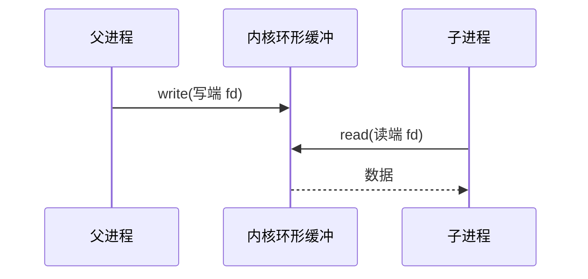
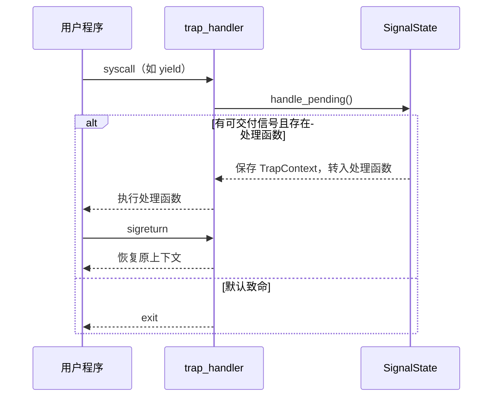

# 实验 7：IPC 与信号

> 相关教材理论：
>
>  [第 5 章 · 进程 API（P40）](/downloads/ostep-zh.pdf#page=40)
>
>  [第 33 章 · 基于事件的并发（P302）](/downloads/ostep-zh.pdf#page=302)
>
>  [第 39 章 · 文件和目录 / 管道直觉（P352）](/downloads/ostep-zh.pdf#page=352)
>
> 说明：OSTEP 无独立「信号」专章，也不单独讲解 `dup`；本实验会用第 33 章建立「异步事件何时介入执行流」的直觉，用第 39 章理解 fd 与管道。`dup` 与信号相关的 Unix API（`kill` / `sigaction` / `sigprocmask` / `sigreturn`）会在背景知识中逐个解释，信号核心概念（待交付位图 / 屏蔽字 / 处理函数 / 投递时机）以本手册与代码为准。

## 零、开始之前

在开始把统一 fd、`dup` 与教学版信号接进内核之前，请确认已完成以下准备：

1. **已完成 Lab6**：能跑通 `make test-lab6`，理解 fd、VirtIO 与磁盘 FS（见 [Lab6 磁盘文件系统](/labs/lab6-disk-fs)）。本实验会继续用同一套 `open` / `read` / `write`，并补上 `dup` 与信号。
2. **快速自检**：以下两条命令都能输出版本号，说明环境就绪：
  ```powershell
   rustc --version          # 预期：rustc 1.96.0 ...
   qemu-system-riscv64 --version   # 预期：QEMU emulator version ...
  ```
3. **建议先读书**：OSTEP 第 5 章（进程 API）、第 39 章（文件与管道直觉）、第 33 章（事件何时介入执行流）。带着「管道和信号差在哪」「信号什么时候真正执行」进来即可。Lab7 对应 feature 为 `lab7`（依赖 `lab6`）。

> Lab7 需要 VirtIO 与磁盘镜像 `fs.img`。直接跑 `make test-lab7` 即可：编内核时 `build.rs` 会自动打包用户程序与 `fs.img`（`initproc` 为 `lab7_usertest`）；也可用 `make check-fs-img` 校验镜像。  
> **请勿**使用裸的 `cargo run -p kernel --features lab7`，否则往往挂不上块设备。

## 一、问题场景

Lab6 完成之后，内核已经能创建进程、读写磁盘文件，也能用管道在父子进程之间传一句 `hi`。但程序之间打交道并不只有「递一段字节」这一种方式：一类是**同步传字节**，例如管道；另一类是**异步递事件**，例如父进程只想告诉子进程「该处理一件事了」，子进程此刻可能正卡在 `read`、在计算、或在 `yield`，并不需要先准备好接收。教材把前一类多归到 **IPC（进程间通信）**，把后一类叫做**信号（signal）**。

想把「同步传字节」与「异步递事件」同时接进内核，至少需要完成：


| 需要完成                                                      | 如果没有会怎样                             |
| --------------------------------------------------------- | ----------------------------------- |
| 统一的 `read` / `write` / `close` 入口（按 `FdType` 分发）          | 文件与管道各一套接口；每加一种对象就复制一套逻辑            |
| `dup` 与管道读写端引用计数                                          | 「多一个编号」行为不可预期；误关一端会让对端提前看到 EOF 或写失败 |
| 教学版信号（`kill` / `sigaction` / `sigprocmask` / `sigreturn`） | 只能传字节，不能递「该处理一件事了」这类轻量事件            |
| 返回用户态前（及 `yield` 路径上）的待交付信号检查                             | 信号已置位，执行流却一直空转；处理函数永远插不进去           |


Lab6 与本实验对照如下：


| 执行环节      | Lab6（磁盘 FS + 既有管道） | 本实验 Lab7（统一 fd + dup + 信号）      |
| --------- | ------------------ | ------------------------------- |
| 文件 / 管道入口 | 磁盘路径已接上，管道仍须走对的分发  | 收紧为同一套 `sys_read` / `sys_write` |
| 复制已打开对象   | 主要靠继承 fd 表         | 再加显式 `dup`，测例逼引用计数              |
| 进程协作形态    | 管道递字节；磁盘上加载程序      | 管道回归 + 异步信号递事件                  |
| 异步事件时机    | （Lab6 不强调）         | 在返回用户态 / yield 边界检查待交付信号        |
| 用户接口形态    | fd + 磁盘文件 API      | 再加信号 API；dup / 信号 / 管道测例须一起通过   |


也即完成本实验后，你需要能回答下面四个问题：

- `FdType` 三分支下，`PipeWrite` 上做 `read` 为何失败？为何不单独实现 `pipe_read` syscall？
- `dup` 管道写端后 `close` 原 fd，为何仍能通过新 fd 写入？引用计数降到 0 意味着什么？
- `kill` 置位之后，处理函数何时真正插入？`sigreturn` 恢复的是什么？
- `sigprocmask` 屏蔽期间到达的信号会丢失吗？`yield` 路径为何也要 `handle_pending`？

**实验目标**：在 Lab6 磁盘 FS 与既有管道之上，把文件和管道的读写收进同一套 `read` / `write` 入口，补上 `dup`，并接上信号（`kill` / `sigaction` / `sigprocmask` / `sigreturn`）。跑通后，你应在 QEMU 中看到 `dup_test`、信号相关测例以及管道回归都通过——协作就不止「传字节」，还能「递事件」了。

## 二、背景知识

本节所有路径都相对 `os-lab/` 根目录。

### 2.1 统一入口：还是那张 fd 表

Lab5/Lab6 里管道已经存在，但若读写路径散落在各处，后面每加一种对象都会复制一套逻辑。更干净的做法是：用户永远调用 `read` / `write` / `close`；内核根据当前进程 fd 表槽位上的 `FdType` 再分叉。

`kernel/src/fs/disk.rs` 里的 `FdTable` 是两列结构：`slots` 记录 `FdType`，`files` 记录普通文件需要的 `OpenedFile`（inode 打开对象）。`sys_read` / `sys_write` 的第一步都是查 `slots[fd]`，而不是先翻 `files[fd]`：

```rust
match slots[fd] {
    FdType::PipeRead(id)  => sync::pipe_read(id, buf, len),
    FdType::Regular { .. } => { /* 再查 files[fd]，取 inode 做 read_at */ }
    FdType::PipeWrite(_)  => -1,
}
```

`Regular` 分支才会取 `files[fd]` 里的 `OpenedFile`；`PipeRead` / `PipeWrite` 分支直接带着 pipe id 去 `sync::pipe_read` / `sync::pipe_write`。因此管道槽位的 `files[fd]` 通常是 `None`——不能假设每个 fd 背后都有 `OpenedFile`。


| `FdType`    | `read`         | `write` |
| ----------- | -------------- | ------- |
| `Regular`   | 走磁盘 / 文件 inode | 同行      |
| `PipeRead`  | 走环形缓冲          | 应失败     |
| `PipeWrite` | 应失败            | 走环形缓冲   |


这张读写矩阵被单独抽到 `os-fs/src/fd_kind.rs` 的 `FdKind` 里，可以用 host 单测先跑通，不必每次都进 QEMU：`regular_rw`、`pipe_ends_are_exclusive`、`dup_shares_kind` 三项正好覆盖「谁可读、谁可写、dup 后类型是否不变」。

「一切皆文件」在这里又深了一层：**分发点唯一、类型信息藏在表后**。

### 2.2 管道：同步递字节

管道仍是单向、内核缓冲的字节流。父进程 `write`，子进程 `read`（或反过来）；空则读端可能暂时失败并 `yield` 重试，满则写端停止继续堆积——教学实现里常见这种简化，与「阻塞直到有空位」的完整语义还有距离。

读代码时盯住 `kernel/src/sync.rs` 的 `PipeInner` 字段：


| 字段                                 | 含义                 |
| ---------------------------------- | ------------------ |
| `read_pos` / `write_pos` / `count` | 环形缓冲的读、写位置与当前可读字节数 |
| `write_closed`                     | 写端是否已全部关闭          |
| `read_refs` / `write_refs`         | 还有多少个 fd 指向读端 / 写端 |


`pipe_read` 在 `count == 0` 时：若 `write_closed` 为真则返回 `0`（读到 EOF），否则返回 `-1` 让用户程序 `yield` 再试；`pipe_write` 在 `count` 满时直接 `break`，少写一部分。`pipe_close_write` 只有在 `write_refs` 降到 `0` 时才把 `write_closed` 置真——这正是 Lab7 `dup` 之后要小心的点。




与 Lab5 的配合方式不变：先 `pipe`，再 `fork`，子进程继承两端 fd，再各自关掉不需要的一端。Lab7 要盯紧的是：这些操作是否都走统一的 `sys_read` / `sys_write`，以及关闭、复制时引用计数是否正确。

### 2.3 dup：多一个门牌，指向同一份对象

`dup(old_fd)` 的直觉很简单：在 fd 表里再占一个空槽，让它与 `old_fd` **指向同一底层对象**。

对照 `kernel/src/fs/disk.rs` 的 `sys_dup`，它实际做三件事：

1. 在 `slots` 里找第一个空位，把旧的 `FdType` 原样复制过去（类型不变）；
2. `Regular`：`files[new_fd] = files[old_fd].clone()`，两个槽位共享同一个 inode 打开对象；
3. `PipeRead` / `PipeWrite`：`sync::pipe_add_refs(id, read, write)` 把对应侧引用计数加一，`files[new_fd]` 保持 `None`。

所以「指向同一底层对象」要按类型再分一层：

- 对普通文件：共享打开对象（inode 相同）；本实现里各 fd 仍可能各自维护一份 `offset` 副本——读代码时留意，不要想当然成「完全共享偏移」。
- 对管道：除了复制 `FdType`，还要对读端或写端做 `pipe_add_refs`。只有某一侧的引用真正降到 0，才适合标记「写端已全部关闭」之类的状态。

因此会出现测例关心的现象：父进程 `dup` 出写端后 `close` 原来的写 fd，仍应能通过新 fd 写入；若过早把 `write_closed` 置位，对端就会误以为 EOF 或写失败。`dup_test` 正是在逼这条路径。

> 一个容易混的点：真实 Unix 里 `dup` 出来的两个 fd 共享同一个 open file description，文件偏移也会一起前进；本教学实现把 `offset` 放在 `FdType` 槽位里，所以普通文件 dup 后两个 fd 各持一份 offset。这不影响「dup 是为了让多编号指向同一对象」的直觉，但读代码、写测例时不要按真实 Unix 的默认行为推断。


### 2.4 信号：异步递事件

管道传字节流，信号传离散事件（信号编号）。两者对比可以帮助建立直觉：


| 维度      | 管道        | 信号                   |
| ------- | --------- | -------------------- |
| 连接方式    | 先建好 fd 对  | 知道对方 pid 即可 `kill`   |
| 发送方是否等待 | 常受缓冲区空满影响 | 一般不阻塞在「对方已处理完」       |
| 数据形态    | 字节流       | 离散事件                 |
| 内核结构    | 环形缓冲      | 待交付位图 / 屏蔽字 / 处理函数 等 |


信号用整数编号区分事件，本环境范围是 `1..=31`（`SIGINT=2`、`SIGKILL=9`、`SIGUSR1=10`）。每个进程维护三样状态：**pending（待交付信号位图，每个信号占一位）**、**mask（屏蔽字，也是位图；交付时只取** `pending & !mask`**）**，以及 **handler（处理函数）表**——`0` 表示该信号未注册处理函数。未注册处理函数时走**默认动作**：`SIGINT` / `SIGKILL` 终止进程，其余（如 `SIGUSR1`）忽略。把 pending 中的信号挑出来交给处理函数或默认动作，称为**投递（delivery）**；本环境的投递时机是从 trap 返回用户态之前，以及 `yield` 调度之前。`sigreturn` 用于恢复进入处理函数前保存的 `TrapContext`。

本环境用 `os-signal` 的 `SignalState` 描述每进程的 pending 位图、屏蔽字与处理函数表；可在 host 上单测。内核侧 `kernel/src/signal.rs` 负责与 trap 上下文打交道。

**投递与返回用户态的边界**往往比「信号长什么样」更关键。一种教学上干净的选择是：在系统调用处理完毕、**即将返回用户态之前**检查是否有可交付信号。若存在用户注册的处理函数，就先保存当前 `TrapContext`，把 `sepc` 改到处理函数地址，并把信号编号放进约定寄存器（如 `a0`）；处理函数末尾调用 `sigreturn`，再把保存的上下文恢复回去。普通函数 `ret` 无法完成这件事——因为被改掉的不只是「返回地址」，还包括整帧 trap 状态。

对照代码走一遍：`sys_kill` 只做一件事，就是 `SignalState::receive(signum)` 把对应位写进 `pending`，**处理函数不会立刻执行**。真正投递发生在 `trap_handler` 返回用户态前：`handle_pending(cx)` 调用 `take_deliverable()`，先查 `SIGKILL`（绕过 mask），再查 `pending & !mask` 的最小编号信号；若注册了处理函数，就把当前 `TrapContext` 存入 `saved_trap_cx`，设置 `cx.sepc = handler`、`cx.x[10] = signum`、`in_signal_handler = true`，然后照常返回用户态。处理函数末尾调用 `sigreturn`，内核把 `saved_trap_cx` 恢复回 `cx`，程序从被打断的位置继续。




还要注意三条细则：

- `sigprocmask`：屏蔽期间到达的信号通常进入 pending，**不轻易丢**；解除屏蔽后，往往还要再次陷入内核，才能在返回用户态前真正交付。
- `yield` **路径**：若测例靠「循环 yield 等信号」，调度前也必须检查 pending；否则信号已置位，执行流却永远在空转等待。`kernel/src/trap.rs` 的 `yield_and_schedule` 在 `sync_current_trap_cx` 和调度之前先调 `try_deliver_signals`；若已跳进处理函数（`in_signal_handler` 为真），就不再 `run_next_process`，直接回用户态执行处理函数。
- `SIGKILL` 一类「必杀」语义，教学实现里常设计成**绕过 mask**，否则无法保证终止。`SignalState::take_deliverable` 最先检查 `SIGKILL`，`is_fatal_default` 也只把 `SIGKILL` / `SIGINT` 的未注册处理函数视为致命；未注册处理函数的 `SIGUSR1` 会在交付循环里被忽略掉，而不是终止进程。

默认动作（未注册处理函数时）可先按简表理解：`SIGINT` / `SIGKILL` 倾向终止，`SIGUSR1` 在本环境中默认忽略——以代码与测例为准。

### 2.5 测例链：从 dup 到信号再到管道回归

`lab7_usertest` 是 initproc，用 `exec` 依次串联四个用户程序（见 `user/src/bin/lab7_usertest.rs`）：`dup_test` → `signal_test` → `signal_mask_test` → `pipe_test`。先理解每个测例验证什么，再运行验证：


| 测例                 | 主要验证                                               | 如果坏了，通常该查哪里                         |
| ------------------ | -------------------------------------------------- | ----------------------------------- |
| `dup_test`         | dup 管道写端后 close 原 fd，仍能通过新 fd 写入；子进程从读端读到 `dup ok` | `sys_dup` 的引用计数、统一 fd 分发            |
| `signal_test`      | `spawn` 子进程注册 `SIGUSR1` 处理函数，父进程 `kill` 后子进程继续跑完   | `SignalState`、`handle_pending` 投递时机 |
| `signal_mask_test` | 屏蔽期间 `kill` 不交付；解除屏蔽后才进处理函数                        | `sigprocmask` 的 mask 位、`yield` 路径检查 |
| `pipe_test`        | Lab5 的管道回归                                         | 统一 fd 重构不能破坏 Lab5 关端 / 引用计数协议       |


`dup_test`、`signal_test`、`signal_mask_test` 开头都会先 `open("testfile")` 占住低号 fd，再建管道或注册处理函数——这和 Lab5 一样，是为了避免管道端意外落到 `fd 1`而干扰打印与读写。

**串起来看整条链**：

```text
统一 fd 入口（FdType）     →  文件与管道共用 read / write
dup + 管道引用计数           →  「多一个编号」行为可预期
kill → pending → 交付       →  在返回用户态 / yield 边界插入处理函数
sigreturn                   →  恢复被打断前的 TrapContext
```

下一节把这条链在 QEMU 里跑通，并对照相关源文件。

## 三、实验任务

本实验主要相关文件（路径相对 `os-lab/`）：


| 文件                           | 角色                                                          | 阅读时重点确认                                |
| ---------------------------- | ----------------------------------------------------------- | -------------------------------------- |
| `os-signal/src/lib.rs`       | `SignalState`、pending/mask                                  | SIGKILL 为何绕过 mask？                     |
| `kernel/src/signal.rs`       | kill / sigaction / sigreturn / `handle_pending`（**任务一动手点**） | 何时保存、何时恢复 trap 上下文？sepc 为何要改成 handler？ |
| `kernel/src/trap.rs`         | syscall 分发 + 信号投递                                           | yield 路径为何也要 `handle_pending`？         |
| `kernel/src/fs/disk.rs`      | 统一 fd、`sys_dup`                                             | `PipeWrite` 上 read 为何失败？               |
| `kernel/src/sync.rs`         | 管道引用计数                                                      | 最后一个写端关闭意味着什么？                         |
| `os-fs/src/fd_kind.rs`       | host 侧读写矩阵                                                  | `PipeWrite` 上 read 为何失败？               |
| `user/src/bin/dup_test.rs` 等 | 测例                                                          | 各测例分别逼哪条路径？                            |


### 任务一：完成实验

本实验的任务文件为 `kernel/src/signal.rs`，请在工作区中打开文件，并根据文件头的任务标记与注释提示完成信号投递逻辑：从 `take_deliverable` 取到信号后，区分致命默认动作与用户处理函数，构造进入处理函数前的信号帧。详细任务描述以文件头注释为准。

确认环境已激活后，在 `os-lab/`（或学生工作区根目录）下运行：

```powershell
make test-lab7
```

> **请勿**使用裸的 `cargo run -p kernel --features lab7`，否则访问不到 `fs.img`。

**预期输出**：屏幕会先刷出 **OpenSBI 启动日志**（可忽略），随后是内核与用户测例输出。示意如下：

```text
OpenSBI v1.7
  ...（OpenSBI 平台/HART 日志，可忽略）...
EVOLVE kernel lab7: IPC and signals.
dup_test pass
signal_child ready        ← 可忽略的中间信息
signal_test pass
signal_mask_test pass
pipe says hi
pipe_test pass
All processes exited.
```

**通过标准**：出现以上全部关键行，且 QEMU 正常退出（终端命令返回，没有卡住或报错）。

> 常见失败现象：`signal_child timeout` 或 `signal_mask_test timeout` 时，优先查 `handle_pending` 的默认动作与信号帧（`a0` / `sepc` / `saved_trap_cx`）以及投递时机；`dup write failed` 时优先查 `sys_dup` 的引用计数；只缺 `pipe_test pass` 时，查统一 fd 是否破坏了 Lab5 的关端 / 引用计数协议。


### 任务二：阅读理解

任务二为思考题。先合上代码用自己的话写答案，再回到代码逐行核对，不要急着找现成结论。

1. `FdType` 三分支：`sys_read` 对 `PipeWrite` 为何返回 `-1`？为何不单独实现 `pipe_read` syscall，而走统一 `read`？
2. 对照 `sys_dup`：普通文件 dup 时 `files[new_fd]` 复制了什么？`offset` 存在哪里？为什么说「共享 inode、各持 offset」？
3. `dup` 管道写端后 `close` 原 fd，为何仍能通过新 fd 写入？`write_refs` 降到 `0` 意味着什么？
4. `SignalState::take_deliverable`：SIGKILL 为何能绕过 mask？pending 与 mask 各表示什么？
5. `sigaction` 保存的 `saved_trap_cx` 在何时写入、何时由 `sigreturn` 恢复？用户处理函数末尾为何不能只用普通 `ret`？
6. `yield_and_schedule` 与 trap 末尾的 `handle_pending` 各在什么路径调用？若 yield 后不检查 pending，会怎样？`sigprocmask` 屏蔽期间 `kill` 的信号会丢失吗？
7. 默认动作为何对 `SIGINT` / `SIGKILL` 是终止、对 `SIGUSR1` 是忽略？未注册处理函数的 `SIGUSR1` 进入 pending 后，`handle_pending` 的循环会怎样处理它？
8. `lab7_usertest` 为何按 `dup_test` → `signal_test` → `signal_mask_test` → `pipe_test` 的顺序串联？`signal_mask_test` 为何先 `open("testfile")` 占住低号 fd？
9. 若要把 `fd 1`（控制台输出）重定向到一个文件，用户态应如何组合 `close` 与 `dup`？结合本环境 `sys_dup` 取第一个空槽位的行为，说明为什么顺序是先关再复制。

> 能画出「kill → pending → 交付处理函数 → sigreturn」路径，Lab7 主线就过关了。


### 任务三：动手修改

> 下列修改用于加深理解，可在任务一通过后再做。每项改完都运行 `make test-lab7` 验证，通过后改回原样。

**修改 1：在处理函数中打印 signum**

在信号处理函数中打印收到的 `signum`，确认 `a0` 与注册信号一致。

```powershell
make test-lab7
```

- 通过标准：能在输出中看到与注册一致的信号编号，且原有 `signal_test pass` 等关键行仍尽量保持通过。
- **做完务必改回并** `make test-lab7` **确认恢复正常**（若希望保留作展示，可另开分支）。

**修改 2：用「忽略」处理函数接住 SIGINT**

对 `SIGINT` 注册「忽略」处理函数（空操作 + `sigreturn`），父进程 `kill` 后子进程应继续运行。

- 预期现象：未注册时 `SIGINT` 倾向终止；注册空处理函数后，子进程应能继续跑完测例路径。
- 通过标准：能用自己的话解释**为什么**处理函数 + `sigreturn` 能改变默认动作。
- **做完务必改回并** `make test-lab7` **确认恢复正常**。

**修改 3：对照参考实现写短文（进阶）**

阅读 `reference-patches` 中相关信号片段，列出本环境相对完整 OS 的简化点（例如无多线程信号、无 `SA_RESTART` 等），写成一小段话。

- 通过标准：能说清「差在哪里、各自在换什么」。


## 四、验证命令


| 验证项         | 命令                                                                 | 通过标准                                    |
| ----------- | ------------------------------------------------------------------ | --------------------------------------- |
| 主编译         | `cargo check -p kernel --features lab7`                            | 无 error                                 |
| QEMU 全链     | `make test-lab7`                                                   | 见任务一预期输出（全部关键行，QEMU 正常退出）               |
| fs.img      | `make check-fs-img`                                                | 脚本输出 `fs.img OK`                        |
| host 单测（可选） | `cargo test -p os-fs -p os-signal --target x86_64-pc-windows-msvc` | fd_kind + signal 相关项通过（须显式指定宿主机 triple） |


> 组件单测在 `os-lab/` 目录下执行；`--target x86_64-pc-windows-msvc` 表示在宿主机上跑。Windows 默认 Rust target 为 riscv 时，**必须**带上该 triple。

