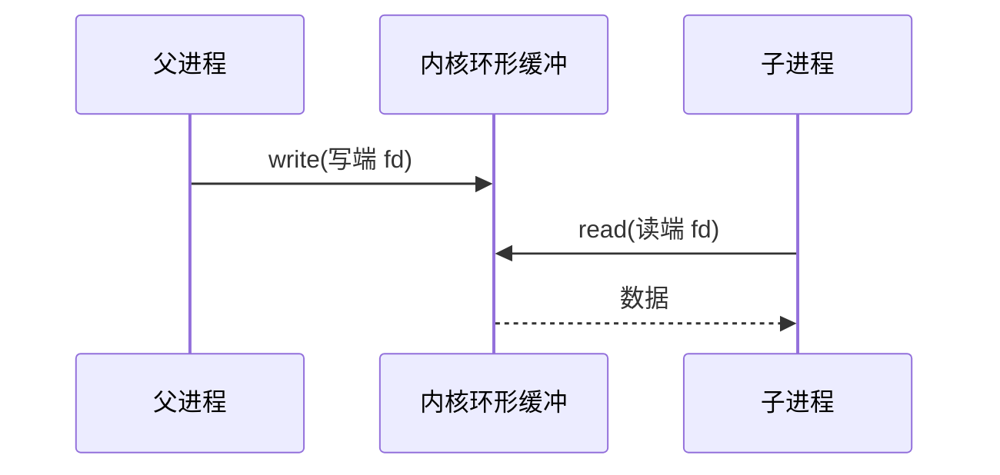
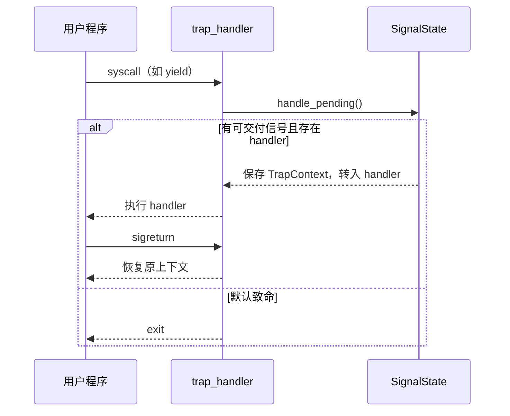

# 实验 7：IPC 与信号

> 相关教材理论：
>
>  [第 5 章 · 进程 API（P40）](/downloads/ostep-zh.pdf#page=40)
>
>  [第 33 章 · 基于事件的并发（P302）](/downloads/ostep-zh.pdf#page=302)
>
>  [第 39 章 · 文件和目录 / 管道直觉（P352）](/downloads/ostep-zh.pdf#page=352)
>
> 说明：OSTEP 无独立「信号」专章；信号机制可对照 Unix 文档，并用第 33 章理解「异步事件何时介入执行流」。

## 零、开始之前

在开始把统一 fd、`dup` 与教学版信号接进内核之前，请确认已完成以下准备：

1. **已完成 Lab6**：能跑通 `make test-lab6`，理解 fd、VirtIO 与磁盘 FS（见 [Lab6 磁盘文件系统](/labs/lab6-disk-fs)）。本实验会继续用同一套 `open` / `read` / `write`，并补上 `dup` 与信号。
2. **进入工作目录**：在本仓库根目录下，进入自研实验环境目录：
  ```powershell
   cd os-lab
  ```
3. **（可选）激活当前终端环境**：如果你新开了一个终端，请在仓库**根目录**（不是 os-lab 目录）执行以下命令，让本会话能找到 Rust 和 QEMU：
  ```powershell
   . .\scripts\activate-os-env.ps1
   cd os-lab
  ```
4. **快速自检**：以下两条命令都能输出版本号，说明环境就绪：
  ```powershell
   rustc --version          # 预期：rustc 1.96.0 ...
   qemu-system-riscv64 --version   # 预期：QEMU emulator version ...
  ```

> 如果上面任何一步报“找不到命令”，回到 [环境搭建指南](/setup/environment) 检查安装；不要急着做第 5 步预构建。

5. **预构建依赖（与 Lab6 相同）**：Lab7 同样需要 VirtIO 块设备与磁盘镜像 `fs.img`。请在**已经激活环境、并且当前目录是** `os-lab` 的前提下执行（可减少 `build.rs` 嵌套 cargo 长时间占锁）：
  ```powershell
   # 确认：pwd 应类似 ...\Or2-1-OS\os-lab
   cargo build -p user --target riscv64gc-unknown-none-elf --release --bins
   cargo build -p kernel --features lab7 --release
  ```
   成功后应能看到：

  | 路径                                                 | 说明                                               |
  | -------------------------------------------------- | ------------------------------------------------ |
  | `target/riscv64gc-unknown-none-elf/release/kernel` | Lab7 内核 ELF                                      |
  | `target/riscv64gc-unknown-none-elf/release/fs.img` | 磁盘镜像（含用户 ELF；`initproc` 为 `lab7_usertest`） |


> `kernel/build.rs` 在编译 lab7 时也会自动打包 `fs.img`（并将 `lab7_usertest` 写作 `initproc`，串联 dup → 信号 → 管道回归）；可用 `make check-fs-img` 校验镜像。

6. **建议先读书**：OSTEP 第 5 章（进程 API）、第 39 章（文件与管道直觉）、第 33 章（事件何时介入执行流）。带着「管道和信号差在哪」「信号什么时候真正执行」进来即可。Lab7 对应 feature 为 `lab7`（依赖 `lab6`）。


## 一、问题场景

完成 Lab6 之后，你的内核已经能创建进程、读写磁盘上的文件，也能用管道在父子进程之间传一句 `hi`。看起来「进程协作」好像有了答案。但是在实际应用时，程序之间打交道并不只有「递一段字节」这一种方式。

有时你确实需要像水管一样，把一串数据**同步地**从一端送到另一端：写的人往里倒，读的人从另一头接；没人读时，写方常常得等等。管道做的就是这件事。可还有另一类需求更轻、也更「突然」：父进程只想告诉子进程「该处理一件事了」，并不打算附带一大段数据；子进程此刻也不一定正卡在 `read` 上——它可能在循环、在计算，或在 `yield`。这时更合适的是轻轻「拍一下」对方，让它稍后换一条路径执行，处理完再回到原来的地方。教材把前一类多归到 **IPC（进程间通信）**，把后一类叫做**信号（signal）**。

站在「写一个能协作的用户程序」的角度，你可能会提出四个疑问：

- **文件和管道是否该走同一扇门？** 若 `read` / `write` 对管道另搞一套 syscall，用户态要记两套接口。统一之后，内核查表时如何区分「普通文件 / 读端 / 写端」？
- **复制一个已打开的 fd 意味着什么？** `dup` 之后，新旧两个编号指向的是不是同一个底层对象？关掉其中一个，另一个是否还能用？
- **信号与管道差在哪里？** 管道传字节流；信号更像带编号的事件——如何投递、如何暂时屏蔽、处理完如何回到「被打断前」的现场？
- **处理函数究竟在什么时机插入？** 是任意指令中间硬插一刀，还是选一个内核已经「站稳」的边界？若子进程只在 `yield` 循环里等待，漏掉哪一步检查会永远等不到信号？

想把「同步传字节」与「异步递事件」同时接进内核，至少需要完成：


| 需要完成                                      | 如果没有会怎样                                      |
| ----------------------------------------- | -------------------------------------------- |
| 统一的 `read` / `write` / `close` 入口（按 `FdType` 分发） | 文件与管道各一套接口；每加一种对象就复制一套逻辑                     |
| `dup` 与管道读写端引用计数                          | 「多一个编号」行为不可预期；误关一端会让对端提前看到 EOF 或写失败         |
| 教学版信号（`kill` / `sigaction` / `sigprocmask` / `sigreturn`） | 只能传字节，不能递「该处理一件事了」这类轻量事件                     |
| 返回用户态前（及 `yield` 路径上）的 pending 检查          | 信号已置位，执行流却一直空转；handler 永远插不进去                 |


Lab6 与本实验对照如下：


| 执行环节     | Lab6（磁盘 FS + 既有管道）      | 本实验 Lab7（统一 fd + dup + 信号）        |
| -------- | ----------------------- | -------------------------------- |
| 文件 / 管道入口 | 磁盘路径已接上，管道仍须走对的分发       | 收紧为同一套 `sys_read` / `sys_write` |
| 复制已打开对象  | 主要靠继承 fd 表              | 再加显式 `dup`，测例逼引用计数               |
| 进程协作形态   | 管道递字节；磁盘上加载程序           | 管道回归 + 异步信号递事件                   |
| 异步事件时机   | （Lab6 不强调）              | 在返回用户态 / yield 边界检查 pending      |
| 用户接口形态   | fd + 磁盘文件 API           | 再加信号 API；dup / 信号 / 管道测例须一起通过    |


也即完成本实验后，你需要能回答下面四个问题：

- `FdType` 三分支下，`PipeWrite` 上做 `read` 为何失败？为何不单独实现 `pipe_read` syscall？
- `dup` 管道写端后 `close` 原 fd，为何仍能通过新 fd 写入？引用计数降到 0 意味着什么？
- `kill` 置位之后，handler 何时真正插入？`sigreturn` 恢复的是什么？
- `sigprocmask` 屏蔽期间到达的信号会丢失吗？`yield` 路径为何也要 `handle_pending`？

**实验目标**：在 Lab6 磁盘 FS 与既有管道之上，把文件和管道的读写收进同一套 `read` / `write` 入口，补上 `dup`，并接上一套教学版信号（`kill` / `sigaction` / `sigprocmask` / `sigreturn`）。跑通后，你应在 QEMU 中看到 `dup_test`、信号相关测例以及管道回归都通过——协作就不止「传字节」，还能「递事件」了。

## 二、背景知识

问题场景中的四个问题，其实都在问同一类设计题：用户态手里只有整数 fd 或 pid，内核如何在**不破坏已有抽象**的前提下，把「传字节」和「递事件」都接进去。下面按这个顺序展开。

### 2.1 统一入口：还是那张 fd 表

Lab5/Lab6 里管道已经存在，但若读写路径散落在各处，后面每加一种对象（设备、将来的更多类型）都会复制一套逻辑。更干净的做法是：用户永远调用 `read` / `write` / `close`；内核根据当前进程 fd 表槽位上的 `FdType` 再分叉。


| `FdType`    | `read`         | `write` |
| ----------- | -------------- | ------- |
| `Regular`   | 走磁盘 / 文件 inode | 同行      |
| `PipeRead`  | 走环形缓冲          | 应失败     |
| `PipeWrite` | 应失败            | 走环形缓冲   |


管道槽位往往**没有**普通文件的 `OpenedFile`——不能先去查 `files[fd]` 再决定是不是管道，否则会把「管道写失败」之类的回归重新引进来。`os-fs` 里的 `fd_kind` 可在 host 上单测这张读写矩阵，帮助你先把规则想清楚，再下到 QEMU。

「一切皆文件」在这里又深了一层：不只是口号，而是**分发点唯一、类型信息藏在表后**。

### 2.2 管道：同步递字节（回顾并收紧）

管道仍是单向、内核缓冲的字节流。父进程 `write`，子进程 `read`（或反过来）；空则读端可能暂时失败并 `yield` 重试，满则写端停止继续堆积——教学实现里常见这种简化，与「阻塞直到有空位」的完整语义还有距离。




与 Lab4 的配合方式不变：先 `pipe`，再 `fork`，子进程继承两端 fd，再各自关掉不需要的一端。Lab7 要盯紧的是：这些操作是否都走统一的 `sys_read` / `sys_write`，以及关闭、复制时引用计数是否正确。

### 2.3 dup：多一个门牌，指向同一份对象

`dup(old_fd)` 的直觉很简单：在 fd 表里再占一个空槽，让它与 `old_fd` **指向同一底层对象**。

- 对普通文件：共享打开对象（inode 相同）；本实现里各 fd 仍可能各自维护一份 `offset` 副本——读代码时留意，不要想当然成「完全共享偏移」。
- 对管道：除了复制 `FdType`，还要对读端或写端做 `pipe_add_refs`。只有某一侧的引用真正降到 0，才适合标记「写端已全部关闭」之类的状态。

因此会出现测例关心的现象：父进程 `dup` 出写端后 `close` 原来的写 fd，仍应能通过新 fd 写入；若过早把 `write_closed` 置位，对端就会误以为 EOF 或写失败。`dup_test` 正是在逼这条路径。

### 2.4 信号：异步递事件

管道适合「我有一串字节要给你」；信号适合「我通知你一件编号为 N 的事」。两者对比可以帮助建立直觉：


| 维度      | 管道        | 信号                         |
| ------- | --------- | -------------------------- |
| 连接方式    | 先建好 fd 对  | 知道对方 pid 即可 `kill`         |
| 发送方是否等待 | 常受缓冲区空满影响 | 一般不阻塞在「对方已处理完」             |
| 数据形态    | 字节流       | 离散事件（信号编号）                 |
| 内核结构    | 环形缓冲      | pending / mask / handler 等 |


本环境用 `os-signal` 的 `SignalState` 描述每进程的 pending 位图、屏蔽字与处理函数表；可在 host 上单测。内核侧 `kernel/src/signal.rs` 负责与 trap 上下文打交道。

**投递与返回用户态的边界**往往比「信号长什么样」更关键。一种教学上干净的选择是：在系统调用处理完毕、**即将返回用户态之前**检查是否有可交付信号。若存在用户注册的 handler，就先保存当前 `TrapContext`，把 `sepc` 改到 handler，并把信号编号放进约定寄存器（如 `a0`）；handler 末尾调用 `sigreturn`，再把保存的上下文恢复回去。普通函数 `ret` 无法完成这件事——因为被改掉的不只是「返回地址」，还包括整帧 trap 状态。




还要注意两条细则：

- `sigprocmask`：屏蔽期间到达的信号通常进入 pending，**不轻易丢**；解除屏蔽后，往往还要再次陷入内核，才能在返回用户态前真正交付。
- `yield` **路径**：若测例靠「循环 yield 等信号」，调度前也必须检查 pending；否则信号已置位，执行流却永远在空转等待。`SIGKILL` 一类「必杀」语义，教学实现里常设计成**绕过 mask**，否则无法保证终止。

默认动作（未注册 handler 时）可先按简表理解：如 `SIGINT` / `SIGKILL` 倾向终止，`SIGUSR1` 在本环境中可能默认忽略——以代码与测例为准。

**串起来看整条链**：

```text
统一 fd 入口（FdType）     →  文件与管道共用 read / write
dup + 管道引用计数           →  「多一个编号」行为可预期
kill → pending → 交付       →  在返回用户态 / yield 边界插入 handler
sigreturn                   →  恢复被打断前的 TrapContext
```

下一节把这条链在 QEMU 里跑通，并对照相关源文件。

## 三、实验任务

本实验主要相关文件（路径相对 `os-lab/`）：


| 文件                            | 角色                           | 阅读时重点确认                        |
| ----------------------------- | ---------------------------- | ------------------------------ |
| `os-signal/src/lib.rs`        | `SignalState`、pending/mask   | SIGKILL 为何绕过 mask？             |
| `kernel/src/signal.rs`        | kill / sigaction / sigreturn | 何时保存、何时恢复 trap 上下文？            |
| `kernel/src/trap.rs`          | syscall 分发 + 信号投递            | yield 路径为何也要 `handle_pending`？ |
| `kernel/src/fs/disk.rs`       | 统一 fd、`sys_dup`              | `PipeWrite` 上 read 为何失败？       |
| `kernel/src/sync.rs`          | 管道引用计数                       | 最后一个写端关闭意味着什么？                 |
| `user/src/bin/dup_test.rs` 等  | 测例                           | 各测例分别逼哪条路径？                    |


> 完整代码走读与参考答案见 [lab7 参考答案](/answers/lab7-answers)。


### 任务一：先完成教师下发的 fill/debug 变体，再跑通内核

老师可能通过工作台为 Lab7 下发 **fill（补全）** 或 **debug（排错）** 变体，任务文件是 `user/src/bin/signal_mask_test.rs`。

- **fill**：实现 `run_mask_protocol`（屏蔽 → kill → 确认未交付 → 解除屏蔽 → 等到交付）；
- **debug**：`sigprocmask` 实际未屏蔽该信号，需按「屏蔽期间仍进入 handler」排查。

确认环境已激活，并已按「零、开始之前」完成预构建（可选但推荐）。然后在 `os-lab/` 下运行：

**第一步：确认变体。** 如果教师通过工作台下发了 debug 变体，先打开 `user/src/bin/signal_mask_test.rs` 文件头，应看到 `【Lab7 任务：排错】`；没有任务标记则用参考实现直接运行。

```powershell
make test-lab7
```

> **请勿**使用裸的 `cargo run -p kernel --features lab7`，否则访问不到 `fs.img`。

**预期输出**：屏幕会先刷出 **OpenSBI 启动日志**（可忽略），随后是内核与用户测例输出。示意如下：

```text
OpenSBI v1.7
  ...（OpenSBI 平台/HART 日志，可忽略）...
os-lab kernel lab7: IPC and signals.
dup_test pass
signal_test pass
signal_mask_test pass
pipe says hi
pipe_test pass
All processes exited.
```

**通过标准**：出现以上全部关键行，且 QEMU 正常退出（终端命令返回，没有卡住或报错）。

> 请先编 user 再编 kernel，以刷新 `fs.img`。更多联调说明见仓库文档中的 Lab6–8 说明。


### 任务二：阅读理解

参考答案见 [lab7 参考答案](/answers/lab7-answers)。每道题建议先合上代码想答案，再打开对照。

1. `FdType` 三分支：`sys_read` 对 `PipeWrite` 为何返回 `-1`？为何不单独实现 `pipe_read` syscall，而走统一 `read`？
2. `SignalState::take_deliverable`：SIGKILL 为何能绕过 mask？pending 与 mask 各表示什么？
3. `sigaction` 保存的 `saved_trap_cx` 在何时写入、何时由 `sigreturn` 恢复？用户 handler 末尾为何不能只用普通 `ret`？
4. `yield_and_schedule` 与 trap 末尾的 `handle_pending` 各在什么路径调用？若 yield 后不检查 pending，会怎样？
5. `dup` 管道写端后 `close` 原 fd，为何仍能通过新 fd 写入？`sigprocmask` 屏蔽期间 `kill` 的信号会丢失吗？

> 能画出「kill → pending → 交付 handler → sigreturn」路径，Lab7 主线就过关了。


### 任务三：动手修改

> 教师下发的 **fill / debug** 变体是本实验主任务（见任务一）。下列修改用于加深理解，可在变体通过后再做。

**修改 1：在 handler 中打印 signum**

在信号处理函数中打印收到的 `signum`，确认 `a0` 与注册信号一致。

```powershell
make test-lab7
```

- 通过标准：能在输出中看到与注册一致的信号编号，且原有 `signal_test pass` 等关键行仍尽量保持通过。
- **做完务必改回并** `make test-lab7` **确认恢复正常**（若希望保留作展示，可另开分支）。

**修改 2：用「忽略」handler 接住 SIGINT**

对 `SIGINT` 注册「忽略」handler（空操作 + `sigreturn`），父进程 `kill` 后子进程应继续运行。

- 预期现象：未注册时 `SIGINT` 倾向终止；注册空 handler 后，子进程应能继续跑完测例路径。
- 通过标准：能用自己的话解释**为什么** handler + `sigreturn` 能改变默认动作。
- **做完务必改回并** `make test-lab7` **确认恢复正常**。

**修改 3：对照参考实现写短文（进阶）**

阅读 `reference-patches` 中相关信号片段，列出本环境相对完整 OS 的简化点（例如无多线程信号、无 `SA_RESTART` 等），写成一小段话。

- 通过标准：能说清「差在哪里、各自在换什么」。


## 四、验证命令


| 验证项         | 命令                                                        | 通过标准                      |
| ----------- | --------------------------------------------------------- | ------------------------- |
| 主编译         | `cargo check -p kernel --features lab7`                   | 无 error                   |
| QEMU 全链     | `make test-lab7`                                          | 见任务一预期输出（全部关键行，QEMU 正常退出） |
| fs.img      | `make check-fs-img`                                       | 脚本输出 `fs.img OK`          |
| host 单测（可选） | `cargo test -p os-fs -p os-signal --target x86_64-pc-windows-msvc` | fd_kind + signal 相关项通过（须显式指定宿主机 triple） |


> 组件单测在 `os-lab/` 目录下执行；`--target x86_64-pc-windows-msvc` 表示在宿主机上跑。Windows 默认 Rust target 为 riscv 时，**必须**带上该 triple。


## 五、AI 提问模板

做实验时，建议用以下切入点和 AI 交互，引导自己思考而非直接要答案：

1. **概念澄清型**：「管道是同步还是异步？信号是同步还是异步？能否用管道模拟信号？」
2. **现象解释型**：「`signal_mask_test` 屏蔽期间 `kill` 自己，为何 handler 不立即执行？」
3. **代码追因型**：「`yield` 之后若不调用 `handle_pending`，`signal_test` 为何会超时？」
4. **对比深化型**：「本环境信号与 Linux 的 `sigaction` 栈、`SA_RESTART` 等有何简化？」
5. **动手探索型**：「若要把 stdout 重定向到文件，用户态应如何组合 `dup` 与 `close`？」

> 复盘与详细参考答案统一见 [lab7 参考答案](/answers/lab7-answers)。工作台默认会折叠本节。
