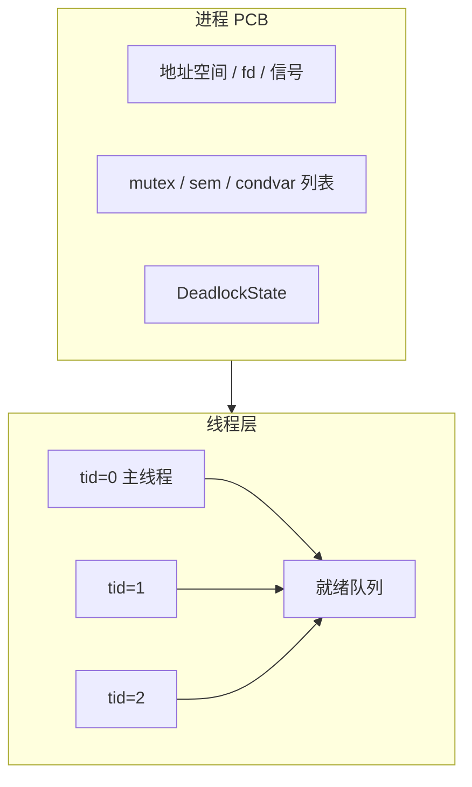
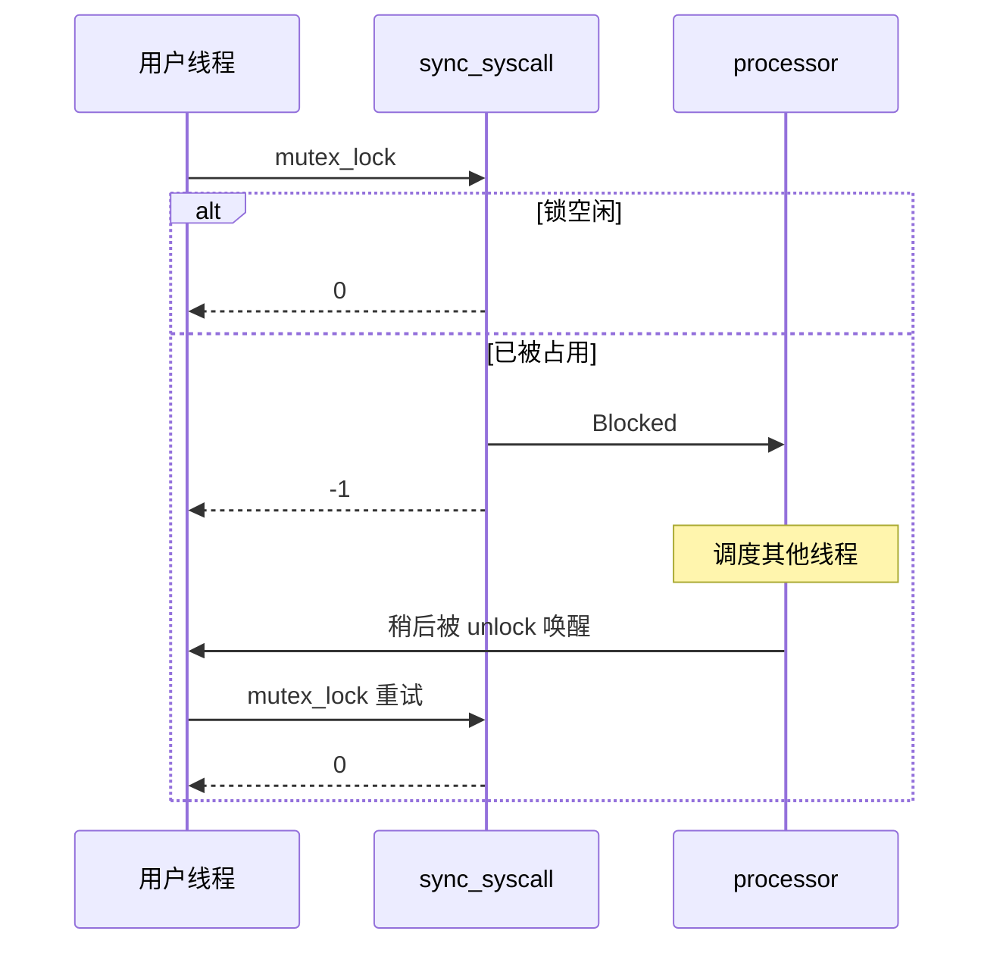

# 实验 8：线程与同步

> 相关教材理论：
>
>  [第 26 章 · 并发：介绍（P209）](/downloads/ostep-zh.pdf#page=209)
>
>  [第 27 章 · 插叙：线程 API（P221）](/downloads/ostep-zh.pdf#page=221)
>
>  [第 28 章 · 锁（P230）](/downloads/ostep-zh.pdf#page=230)
>
>  [第 30 章 · 条件变量（P260）](/downloads/ostep-zh.pdf#page=260)
>
>  [第 31 章 · 信号量（P274）](/downloads/ostep-zh.pdf#page=274)

## 零、开始之前

在开始把「同进程多执行流」与阻塞式同步接进内核之前，请确认已完成以下准备：

1. **已完成 Lab7**：理解统一 fd、信号与管道（见 [Lab7 IPC 与信号](/labs/lab7-ipc-signal)）。本实验会在同一进程地址空间里再挂线程，并加上阻塞 mutex / 信号量 / 条件变量。
2. **进入工作目录**：在本仓库根目录下，进入自研实验环境目录：
  ```powershell
   cd os-lab
  ```
3. **（可选）激活当前终端环境**：如果你新开了一个终端，请在仓库**根目录**（不是 os-lab 目录）执行以下命令，让本会话能找到 Rust 和 QEMU：
  ```powershell
   . .\scripts\activate-os-env.ps1
   cd os-lab
  ```
4. **快速自检**：以下两条命令都能输出版本号，说明环境就绪：
  ```powershell
   rustc --version          # 预期：rustc 1.96.0 ...
   qemu-system-riscv64 --version   # 预期：QEMU emulator version ...
  ```

> 如果上面任何一步报“找不到命令”，回到 [环境搭建指南](/setup/environment) 检查安装；不要急着做第 4 步预构建。

5. **预构建依赖（与 Lab6/7 相同）**：Lab8 需要 VirtIO 块设备与磁盘镜像 `fs.img`。请在**已经激活环境、并且当前目录是** `os-lab` 的前提下执行（可减少 `build.rs` 嵌套 cargo 长时间占锁）：
  ```powershell
   # 确认：pwd 应类似 ...\Or2-1-OS\os-lab
   cargo build -p user --target riscv64gc-unknown-none-elf --release --bins
   cargo build -p kernel --features lab8 --release
  ```
   成功后应能看到：

  | 路径                                                 | 说明                                                 |
  | -------------------------------------------------- | -------------------------------------------------- |
  | `target/riscv64gc-unknown-none-elf/release/kernel` | Lab8 内核 ELF                                        |
  | `target/riscv64gc-unknown-none-elf/release/fs.img` | 磁盘镜像（含用户 ELF；`initproc` 为 `lab8_integration_test`） |


> `kernel/build.rs` 在编译 lab8 时也会自动打包 `fs.img`（并将 `lab8_integration_test` 写作 `initproc`，在单进程内串联线程 / 同步 / 死锁与管道回归）；可用 `make check-fs-img` 校验镜像。

6. **建议先读书**：OSTEP 第 26–28、30–31 章（线程、锁、条件变量、信号量），有些章节之前的实验中已经读过，但不妨再读一遍，看看有没有新的理解。Lab8 对应 feature 为 `lab8`（依赖 `lab7`），也是本系列的**最后一个实验**。


## 一、问题场景

从 Lab1 走到 Lab7，你已经亲手把一个最小内核搭到了能跑进程、文件、磁盘与信号的样子。调度与协作的主角大多还是**进程**：各自有地址空间，靠系统调用、管道和信号往来。

可很多真实程序并不满足于「一个进程一条执行流」。浏览器标签页、服务器工作线程，更希望在**同一片地址空间里**再开几条路：共享内存与打开文件，却仍能交错推进。教材把这种执行流叫做**线程**。有了线程，Lab5 那把只适合内核短临界区的**自旋锁**就显得不够用——临界区一长，「拿不到锁就空转」会浪费 CPU；更常见的需求是**拿不到就让出 CPU，等别人唤醒再继续**。教材还会反复提醒另一种灾难：**死锁**——大家互相等待，谁也走不动，系统却可能一声不吭地挂在那里。

站在「写一个多任务用户程序」的角度，你可能会提出三个疑问：

- **能不能同进程多开几条执行流**，一起改同一块内存？
- **拿不到锁时**，是该空转，还是该让出 CPU？
- **加锁顺序不当**时，系统是静静挂死，还是能明确告诉我「这是死锁」？

想把并发主题再推完这关键的一段，我们至少需要完成：


| 需要完成                                            | 作用                                      |
| ----------------------------------------------- | --------------------------------------- |
| 进程之下的线程层（TCB、独立用户栈、`thread_create` / `waittid`） | 在同一地址空间内开多条执行流，共享内存与 fd，同时各自保有栈与上下文     |
| 阻塞式同步原语（mutex / 信号量 / 条件变量）                     | 保护用户态临界区、表达计数资源与「等条件成立」，避免长临界区上空转浪费 CPU |
| 阻塞与调度衔接（`Blocked` / `re_enque`，用户态重试）           | 拿不到资源时让出 CPU；唤醒后再竞争，使等待可被调度、可重试         |
| 可开关的死锁检测（返回 `-0xDEAD`）                          | 在重复加锁或等待环等危险路径上及时短路，区分「稍后再试」与「再试也无意义」   |


Lab7 的部分结构与本实验对照如下：


| 执行环节   | Lab7（进程 + IPC / 信号） | 本实验 Lab8（线程 + 阻塞同步）                 |
| ------ | ------------------- | ----------------------------------- |
| 执行流单位  | 主要以进程为调度与协作单位       | 同进程内可有多条线程，各有 TCB / 用户栈             |
| 同步手段   | 管道、信号；内核短临界区仍用自旋锁   | 再加阻塞 mutex / 信号量 / 条件变量             |
| 拿不到资源时 | （用户侧）多靠管道阻塞或自旋守护元数据 | 当前线程 `Blocked`，返回 `-1`，用户库 while 重试 |
| 死锁     | 无专门检测               | 可开启检测，危险时返回 `-0xDEAD`               |
| 用户接口形态 | 进程 API + fd / 信号    | 再加线程与同步 syscall；管道回归仍须通过            |


也即完成本实验后，你需要能回答下面四个问题：

- 线程相对进程，多了什么、少了什么？`exit` 退出的是整棵进程，还是当前这条执行流？
- 「拿不到锁」如何变成可调度的等待？谁在 `unlock` 时唤醒？用户态为何看到 `-1` 还要再试？
- 信号量与条件变量各解决什么问题？`condvar_wait` 为何必须关联一把 mutex？
- 死锁检测如何短路阻塞路径？`-0xDEAD` 与普通 `-1` 语义有何不同？

**实验目标**：在 Lab7 进程模型之上实现用户态线程与阻塞式同步原语（mutex / 信号量 / 条件变量），并提供可开关的死锁检测；Lab5 的自旋锁仍守护内核极短路径，并不被取代。跑通后，你应在 QEMU 中看到线程、互斥、条件变量、死锁测例通过，并且管道回归仍然通过。作为收官实验，Lab8 也让教材三条主线——**虚拟化、持久性、并发**——都在这套教学内核里留下脚印。

## 二、背景知识

问题场景中的四个问题指向同一条主线：在**不拆掉进程 PCB** 的前提下，再挂一层可调度的执行流，并用**阻塞**而不是自旋，把用户态的互斥与协作做完整；必要时还能把死锁「叫出名字」。下面按这个顺序展开。

### 2.1 进程之下再挂一层线程

不必推倒 Lab4 以来的进程抽象。更自然的做法是**双层管理**：

- **进程**：仍拥有地址空间、fd 表、信号状态；Lab8 再在其上挂同步原语列表与死锁检测状态。
- **线程**：每条执行流有自己的 TCB——`tid`、trap 上下文、Ready / Running / Blocked / Zombie、独立用户栈等。




可以这样记「共享什么、各自持有什么」：


|      | 进程内共享                 | 每线程独立                 |
| ---- | --------------------- | --------------------- |
| 典型内容 | 地址空间、fd 表、信号状态、同步原语列表 | `tid`、trap 上下文、状态、用户栈 |


`thread_create` 做的事，直觉上是：分配用户栈 → 填好入口与参数 → 把新线程放进就绪队列。`waittid` 等待某条线程变成 zombie 并回收；`exit` 结束的是**当前线程**。当进程里最后一条线程也退出，进程才变成 zombie，再由父进程 `wait4` 善后。

这与 Lab6 的 `spawn` 不要混：


|        | `spawn`          | `thread_create` |
| ------ | ---------------- | --------------- |
| 新建什么   | **另一个进程**（新地址空间） | **同一进程内**的一条线程  |
| 内存与 fd | 彼此隔离（写时复制等）      | 默认共享            |


读代码时可对照：`kernel/src/processor.rs`（TCB、创建 / 等待 / 退出）、`user/src/bin/lab8_integration_test.rs`（全链串联）。下一小节回答：拿不到锁时，内核如何让出 CPU。

### 2.2 阻塞：拿不到就让出 CPU

面向用户线程的 mutex，在资源不可用时通常不会让调用者在内核里空转。本环境约定（与常见教学栈一致）：


| 操作               | 可用时             | 不可用时                   |
| ---------------- | --------------- | ---------------------- |
| `mutex_lock`     | 返回 `0`          | 当前线程 `Blocked`，返回 `-1` |
| `semaphore_down` | 返回 `0`          | 同上                     |
| `condvar_wait`   | 先释放关联 mutex，再阻塞 | 返回 `-1`                |


`unlock` / `up` / `signal` 负责把等待者重新 `re_enque` 进就绪队列。用户库看到 `-1` 后**循环再次发起 syscall**——因为一次陷入只表示「尝试」；被唤醒后仍要重新竞争锁。这样 trap 边界清晰，也方便在重试间隙处理 Lab7 的信号。




请抓住三点：

1. `-1` **不是最终失败**：对阻塞锁来说，它常表示「这次没拿到，已让出 CPU，请再试」。
2. **唤醒不等于已持锁**：`re_enque` 只让线程再次可运行；真正持锁仍靠下一次成功的 `mutex_lock`。
3. **用户态 while 重试**：把「尝试 → 阻塞 → 唤醒 → 再试」留在库里，内核每次 syscall 语义更简单。

读代码时可对照：`kernel/src/sync_syscall.rs`、`user/src/syscall.rs` 中的重试循环。下一小节说明：这层阻塞锁与 Lab5 自旋锁如何并存。

### 2.3 和 Lab5 自旋锁并存，而不是互相取代

Lab5 引入的 `SpinMutex` **不会被扔掉**。两层锁服务的场景不同：


| 维度   | Lab5 `SpinMutex` | Lab8 阻塞 mutex                 |
| ---- | ---------------- | ----------------------------- |
| 等待   | CAS 自旋           | 入等待队列并让出 CPU                  |
| 典型用途 | 内核极短临界区（如管道元数据）  | 用户态可能较长的临界区                   |
| 与调度  | 基本无关             | 与线程 `Blocked` / `re_enque` 协作 |
| 死锁检测 | 无                | 可接入进程层检测                      |


`os-sync` 提供的是**新增的一层**。内部保护等待队列本身时，仍可能用很短的自旋——那是「锁住几行元数据」，与「用户线程在业务临界区里空转」不是一回事。

为何不把自旋锁直接暴露给用户态长临界区？用户代码可能持锁很久；在单核或持锁者被抢占时，自旋还会空耗 CPU，甚至饿死真正需要运行的持锁线程。阻塞 mutex 把等待变成可调度事件，更适合这一层。

### 2.4 信号量与条件变量

互斥只是同步需求的一种。教材里另外两类也很常见：

- **信号量**：计数型资源。`down` 试图取走一个；没有时阻塞。`up` 归还并唤醒等待者。适合「最多 N 个并发持有者」这类问题。
- **条件变量**：表达「等某个条件成立」。`condvar_wait(cv, mutex)` 需要在持锁情况下原子地**释放 mutex 并睡眠**；否则容易和「另一线程改条件并 signal」形成 **lost wakeup（丢失唤醒）**。被 `signal` 唤醒后，线程通常要**重新获取 mutex**，再检查条件是否仍然成立（经典写法常用 `while (!cond) wait`）。

测例里常见模式：工作线程 wait 某个标志，主线程改标志后 signal。读代码时可对照 `condvar_test` 与 `os-sync` 中条件变量实现。

### 2.5 死锁：发现它，而不是陪它挂着

开启 `enable_deadlock_detect(1)` 后，教学内核可以在加锁 / `down` 前做检查：

- **互斥锁**：维护等待图（谁持有、谁在等）；同线程重复加锁或形成环时，判定危险；
- **信号量**：可用银行家算法一类安全性检查（Available / Allocation / Need）。

一旦认为「再走下去会永久卡住」，就返回特殊码 `-0xDEAD`（十进制 **-57005**），并且**不要**再把当前线程送进阻塞等待。这与普通的 `-1` 不同：


| 返回值       | 含义                  | 调用者通常怎么做         |
| --------- | ------------------- | ---------------- |
| `-1`      | 现在不行，但可以稍后再试（已阻塞等待） | while 重试 syscall |
| `-0xDEAD` | 再试也没有意义，这是死锁        | 中止或改设计，不要当普通失败重试 |


对照测例时，`deadlock_mutex_test`（重复加同一把锁）、`deadlock_sem_test`（资源请求环）就是在逼这条短路路径。读代码时可对照 `kernel/src/deadlock.rs`。

### 2.6 测例在验证什么


| 测例                                  | 大致覆盖       |
| ----------------------------------- | ---------- |
| `threads_test` / `threads_arg_test` | 创建、参数、等待   |
| `mutex_test`                        | 多线程互斥      |
| `condvar_test`                      | 条件变量       |
| `pipetest`                          | 进程级管道与线程共存 |
| `deadlock_*`                        | `-0xDEAD`  |
| `pipe_test`                         | 既有管道回归     |


未纳入的条目见继承清单文档，不必在一期里强求齐全。

**串起来看整条链**：

```text
进程 PCB + 线程 TCB     →  同地址空间多执行流
阻塞 mutex / sem / cv   →  拿不到就让出 CPU
用户态 while 重试         →  唤醒后再竞争
死锁检测                 →  危险时返回 -0xDEAD，短路阻塞
```

下一节把这条链在 QEMU 里跑通，并对照相关源文件。

## 三、实验任务

本实验主要相关文件（路径相对 `os-lab/`）：


| 文件                                      | 角色                       | 阅读时重点确认                             |
| --------------------------------------- | ------------------------ | ----------------------------------- |
| `os-sync/src/*.rs`                      | 阻塞 mutex / sem / condvar | 拿不到锁时返回什么？等待队列如何组织？                 |
| `kernel/src/processor.rs`               | TCB、线程创建 / 等待 / 退出       | 用户栈从哪来？最后一条线程退出后进程怎样？               |
| `kernel/src/sync_syscall.rs`            | 同步 syscall + 阻塞调度        | `-1` 与 `-0xDEAD` 如何区分？谁 `re_enque`？ |
| `kernel/src/deadlock.rs`                | 死锁检测                     | 等待图在哪里短路阻塞路径？                       |
| `user/src/syscall.rs`                   | 阻塞重试循环                   | 为何 while 重试？死锁码是否也要重试？              |
| `user/src/bin/lab8_integration_test.rs` | initproc 全链              | 测例顺序如何串联？                           |


> 完整代码走读与参考答案见 [lab8 参考答案](/answers/lab8-answers)。


### 任务一：先完成教师下发的 fill/debug 变体，再跑通内核

老师可能通过工作台为 Lab8 下发 **fill（补全）** 或 **debug（排错）** 变体，任务文件是 `user/src/bin/lab8_integration_test.rs`。

- **fill**：实现 `bump_under_mutex` / `worker` / `spawn_two_workers`，两线程各累加 25 次且受互斥保护，最终计数为 50；
- **debug**：互斥测例工作量少一轮（或等价 off-by-one），需用最终计数不变量定位修复。

确认环境已激活，并已按「零、开始之前」完成预构建（可选但推荐）。然后在 `os-lab/` 下运行：

**第一步：确认变体。** 如果教师通过工作台下发了 debug 变体，先打开 `user/src/bin/lab8_integration_test.rs` 文件头，应看到 `【Lab8 任务：排错】`；没有任务标记则用参考实现直接运行。

```powershell
make test-lab8
```

> **请勿**使用裸的 `cargo run -p kernel --features lab8`，否则访问不到 `fs.img`。

**预期输出**：屏幕会先刷出 **OpenSBI 启动日志**（可忽略），随后是内核与用户测例输出。示意如下：

```text
OpenSBI v1.7
  ...（OpenSBI 平台/HART 日志，可忽略）...
threads_test pass
threads_arg_test pass
mutex_test pass
condvar_test pass
pipetest passed!
deadlock test mutex 1 OK!
deadlock test semaphore 1 OK!
pipe_test pass
All processes exited.
```

**通过标准**：出现以上全部关键行，且 QEMU 正常退出（终端命令返回，没有卡住或报错）。

> 请先编 user 再编 kernel，以刷新 `fs.img`。更多联调说明见仓库文档中的 Lab6–8 说明。


### 任务二：阅读理解

参考答案见 [lab8 参考答案](/answers/lab8-answers)。每道题建议先合上代码想答案，再打开对照。

1. `thread_create` 如何为新线程分配用户栈？`waittid` 回收时如何释放栈？`exit` 退出的是进程还是线程？最后一个线程退出后进程处于什么状态？
2. `mutex_lock` 返回 `-1` 后，内核如何把当前线程标为 `Blocked`？谁负责 `re_enque`？用户态为何要 while 重试？
3. 对比 Lab5 `SpinMutex` 与阻塞 mutex：为何后者更适合用户态长临界区？为何不把自旋锁直接暴露给用户态？
4. `condvar_wait` 为何必须传入关联的 mutex id？唤醒后为何要重新 `mutex_lock`？
5. `deadlock_mutex_test` 期望 `-0xDEAD` 而非挂死：检测逻辑在何处短路阻塞路径？`-0xDEAD` 与普通 `-1` 语义有何不同？

> 能讲清「双层调度 + 阻塞重试 + 死锁短路」，Lab8 主线就过关了。


### 任务三：动手修改

> 教师下发的 **fill / debug** 变体是本实验主任务（见任务一）。下列修改用于加深理解，可在变体通过后再做。

**修改 1：打印线程 tid**

在 `threads_test`（或集成测例中对应片段）里调用 `gettid()` 并打印，确认主线程与子线程的 tid 不同。

```powershell
make test-lab8
```

- 通过标准：能在输出中看到不同 tid，且原有 `threads_test pass` 等关键行仍尽量保持通过。
- **做完务必改回并** `make test-lab8` **确认恢复正常**（若希望保留作展示，可另开分支）。

**修改 2：关闭死锁检测后观察差异**

将 `enable_deadlock_detect(0)` 后运行原先期望 `-0xDEAD` 的 `deadlock_mutex_test` 路径，观察与开启检测时的差异。

- 预期现象：关闭检测后，重复加锁路径可能**挂死**或长时间无进展（勿长时间占用机器；观察几秒即可）。
- 通过标准：能用自己的话解释**为什么**开启检测时返回 `-0xDEAD`，关闭后却可能卡住。
- **做完务必改回检测开关并** `make test-lab8` **确认恢复正常**。

**修改 3：对照参考实现写短文（进阶）**

对照 `reference-patches/ch8-exercise.patch` 中 TCB 与 sync 模块，找出本环境相对参考实现的三处简化点（例如调度策略、等待队列结构、死锁检测范围），写成一小段话。

- 通过标准：能说清「差在哪里、各自在换什么」。


## 四、验证命令


| 验证项         | 命令                                                      | 通过标准                      |
| ----------- | ------------------------------------------------------- | ------------------------- |
| 主编译         | `cargo check -p kernel --features lab8`                 | 无 error                   |
| QEMU 全链     | `make test-lab8`                                        | 见任务一预期输出（全部关键行，QEMU 正常退出） |
| fs.img      | `make check-fs-img`                                     | 脚本输出 `fs.img OK`          |
| host 单测（可选） | `cargo test -p os-sync --target x86_64-pc-windows-msvc` | 相关项通过（须显式指定宿主机 triple）    |


> 组件单测在 `os-lab/` 目录下执行；`--target x86_64-pc-windows-msvc` 表示在宿主机上跑。Windows 默认 Rust target 为 riscv 时，**必须**带上该 triple。


## 五、AI 提问模板

做实验时，建议用以下切入点和 AI 交互，引导自己思考而非直接要答案：

1. **概念澄清型**：「线程与进程的区别是什么？同一进程的线程共享哪些资源？」
2. **现象解释型**：「`mutex_lock` 返回 -1 后用户态为什么要 while 重试，而不是 sleep？」
3. **代码追因型**：「`condvar_wait` 里先 unlock mutex 再阻塞，若中间被打断会怎样？」
4. **对比深化型**：「自旋锁、阻塞 mutex、信号量分别适合什么临界区长度与竞争程度？」
5. **动手探索型**：「若把 `pipetest` 改成多线程写同一管道，需要加锁吗？用哪种原语？」

> 复盘与详细参考答案统一见 [lab8 参考答案](/answers/lab8-answers)。工作台默认会折叠本节。

