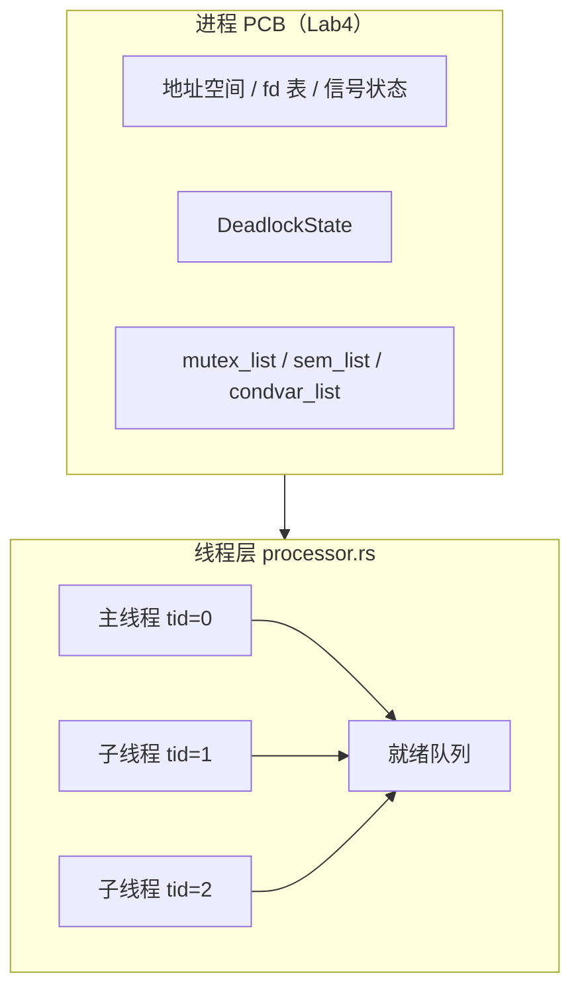
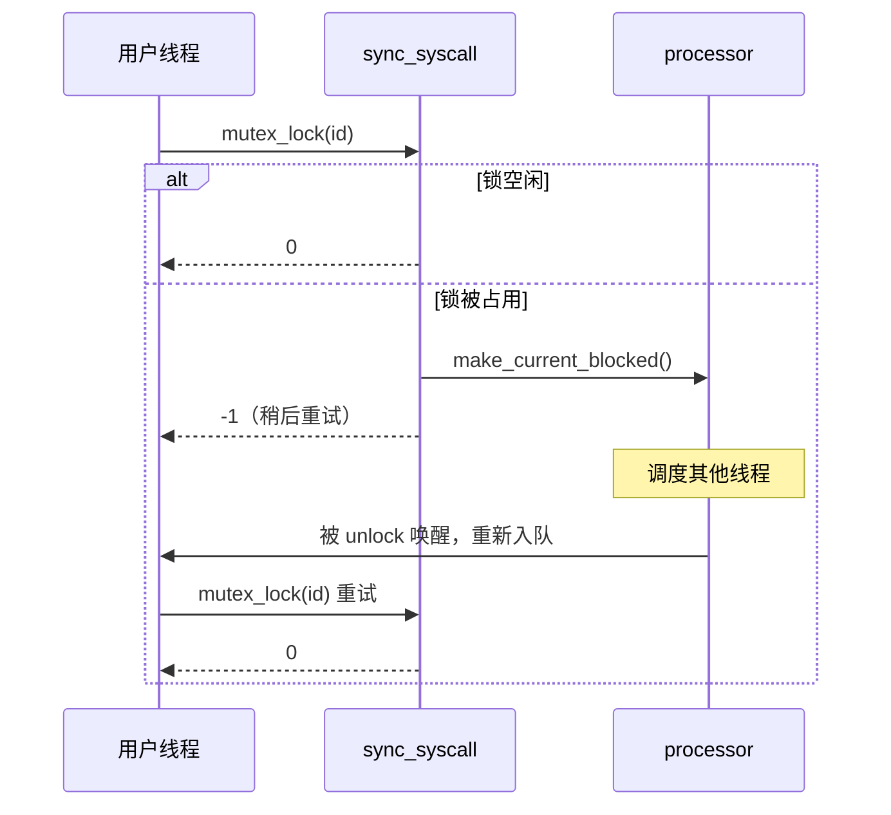

# 实验 8：线程与同步

> 对应 feature：`lab8`（依赖 `lab7`）。本实验在 Lab7 进程与 IPC 能力之上，引入**用户态线程**、**阻塞同步原语**（mutex / semaphore / condvar）与**死锁检测**。参考环境对应 **ch8**；验收以本仓库自建测例为准，对照 `reference-patches/ch8-exercise.patch`。

## 零、开始之前

1. **已完成 Lab7**：能跑通 `make test-lab7`，理解统一 fd、信号与管道回归。
2. **进入工作目录**：`cd os-lab`，必要时 `. .\scripts\activate-os-env.ps1`。
3. **接口文档**：syscall 编号与语义以 [lab6-8.md §十三](../../docs/lab6-8.md#十三lab8-系统调用接口) 为准（成员 A 冻结点）。
4. **继承清单**：ch8 exercise 覆盖范围见 [lab6-8.md §十四](../../docs/lab6-8.md#十四ch8-exercise-继承项清单)（成员 B 交付）。
5. **建议先读书**：OSTEP 第 26–28 章（并发与锁）+ 第 32 章（死锁）是本实验的理论基础。

### 环境准备（与 Lab6/7 相同）

Lab8 **须带 VirtIO 块设备**访问 `fs.img`，且须**先编用户程序再编内核**以刷新磁盘镜像：

```powershell
cd os-lab
cargo build -p user --bins --release --target riscv64gc-unknown-none-elf
cargo build -p kernel --features lab8 --release
make test-lab8
```

`kernel/build.rs` 在 `lab8` 下将 **`lab8_integration_test`** 打包为 `initproc`，在**单进程地址空间**内串联线程、同步、死锁与管道回归测例（避免多次 `exec` 加剧内核堆压力）。

## 一、问题场景

Lab4–7 以**进程**为调度单位：每个进程有独立地址空间，上下文切换成本高。真实程序（浏览器、数据库）常在**同一进程内**跑多个执行流共享内存——这就是**线程**。

同时，Lab5 的自旋锁在临界区较长或竞争激烈时会**空转浪费 CPU**；多线程环境下更需要**拿不到锁就让出 CPU** 的阻塞语义。

本实验要回答：

1. 内核如何在**不拆散 Lab4 PCB** 的前提下，增加线程层调度（进程/线程双层）？
2. 阻塞 `mutex_lock` / `semaphore_down` 如何通过 syscall 返回 `-1` + 线程 `Blocked` 实现？
3. 开启死锁检测后，为何返回 `-0xDEAD` 而不是无限阻塞？

学完后，你的内核应能：

- `thread_create` / `gettid` / `waittid`，且 `exit` 在线程语义下回收 zombie 线程
- 阻塞 mutex、信号量、条件变量，并在唤醒时重新入队
- `enable_deadlock_detect(1)` 后对可检测死锁返回 `-0xDEAD`
- Lab1–7 syscall 在 lab8 feature 下仍可回归（链末 `pipe_test`）

## 二、背景知识

### 2.1 进程 / 线程双层管理



- **进程**：仍由 `process.rs` 管理 PCB、地址空间、fd、信号；Lab8 在 PCB 上挂同步原语列表与 `DeadlockState`。
- **线程**：`processor.rs` 的 TCB 保存 `trap_cx`、状态（Ready / Running / Blocked / Zombie）、独立用户栈 `user_stack_va`。
- **`exit`**：退出**当前线程**；进程内最后一个线程退出时进程变 zombie，由 `wait4` 回收。

### 2.2 阻塞 syscall 语义（与 rCore ch8 一致）

| 操作 | 资源可用 | 资源不可用 |
|------|----------|------------|
| `mutex_lock` | 返回 `0` | 返回 `-1`，线程 `Blocked` |
| `semaphore_down` | 返回 `0` | 返回 `-1`，线程 `Blocked` |
| `condvar_wait` | 先释放 mutex，再阻塞 | 返回 `-1`，线程 `Blocked` |

被 `unlock` / `up` / `signal` 唤醒的线程重新进入就绪队列；用户态包装在 `syscall.rs` 中对 `-1` **循环重试**（见 `mutex_lock` / `semaphore_down` / `condvar_wait`）。



### 2.3 Lab5 自旋锁 vs Lab8 阻塞 mutex（重点对比）

| 维度 | Lab5 `SpinMutex`（`kernel/src/sync.rs`） | Lab8 `MutexBlocking`（`os-sync`） |
|------|------------------------------------------|----------------------------------|
| 等待方式 | `compare_exchange` 循环**自旋** | 加入 FIFO **等待队列**，返回 `false` 让调用方阻塞 |
| 适用场景 | 内核极短临界区（如管道元数据） | 用户态可能长时间持锁的共享数据 |
| 调度交互 | 不涉及线程调度 | 与 `processor` 协作：`Blocked` / `re_enque` |
| 底层保护 | 原子变量 | 内部仍用 `spin::Mutex` 保护**元数据**（等待队列），临界区极短 |
| 死锁检测 | 无 | 进程层 `DeadlockState` + 等待图 |

> **设计要点**：`os-sync` 不是替换 Lab5 自旋锁，而是**新增一层**面向用户线程的阻塞原语。内核全局数据结构（VirtIO、管道表）仍可用自旋锁；用户可见的 `mutex_create(true)` 走阻塞路径。

Lab5 自旋锁核心（拿不到就空转）：

```rust
while self.lock.compare_exchange_weak(false, true, ...).is_err() {}
```

Lab8 阻塞 mutex（拿不到就入队并返回，由内核挂起线程）：

```rust
if inner.locked {
    inner.wait_queue.push_back(tid);
    false  // 调用方 syscall 返回 -1
} else {
    inner.locked = true;
    true
}
```

### 2.4 信号量与条件变量

- **信号量**：计数资源；`down` 减 1，为 0 时阻塞；`up` 加 1 并唤醒一个等待者。
- **条件变量**：`condvar_wait(cv, mutex)` 原子地**释放 mutex 并睡眠**；`signal` 唤醒一个等待者，被唤醒线程须重新竞争 mutex。

`condvar_test` 典型模式：工作线程 `condvar_wait` 等待 `FLAG`，主线程设置 `FLAG` 后 `signal`。

### 2.5 死锁检测

`enable_deadlock_detect(1)` 后，进程层 `DeadlockState` 维护：

- **信号量**：银行家算法（`Available` / `Allocation` / `Need`）
- **互斥锁**：等待图（线程 → 等待的 mutex → 持有者）

若 `mutex_lock` / `semaphore_down` 可能导致死锁，返回 **`-0xDEAD`（-57005）**，**不阻塞**当前线程。用户态常量 `DEADLOCK_DETECTED` 定义在 `syscall.rs`。

对照 ch8 exercise：`deadlock_mutex_test`（同线程重复加锁）、`deadlock_sem_test`（信号量环路）。

### 2.6 对照 ch8 exercise

| ch8 / 本仓库测例 | 覆盖能力 |
|------------------|----------|
| `threads_test` / `threads_arg_test` | 创建、等待、参数传递 |
| `mutex_test` | 多线程互斥计数 |
| `condvar_test` | 条件变量 |
| `pipetest` | fork + 管道（进程级 IPC + 线程共存） |
| `deadlock_*` | `-0xDEAD` |
| `pipe_test` | Lab5/7 管道回归 |

未纳入一期范围：`phil_din_mutex`、`sleep`/`clock_gettime`、GPU/键盘等（见继承清单）。

## 三、实验任务

> **本实验怎么学**：先 `make test-lab8` 看全链输出，再读 `processor.rs` + `sync_syscall.rs`，对照 `lab8_integration_test` 用户代码。

主要文件：

| 文件 | 角色 |
|------|------|
| `os-sync/src/*.rs` | 阻塞 mutex / semaphore / condvar（host 可测） |
| `kernel/src/processor.rs` | TCB、就绪队列、`thread_create` / `waittid`、线程 `exit` |
| `kernel/src/sync_syscall.rs` | 同步 syscall 与阻塞调度 |
| `kernel/src/deadlock.rs` | `DeadlockState`、`-0xDEAD` |
| `user/src/syscall.rs` | Lab8 包装 + 阻塞重试 |
| `user/src/bin/lab8_integration_test.rs` | initproc 全链 |
| `user/src/bin/threads_test.rs` 等 | 独立测例（可单独 exec 调试） |

### 任务一：跑通 lab8（必做）

```powershell
make test-lab8
```

**预期输出**（OpenSBI 启动日志可忽略；以 `handbook/data/labs.json` 为准）：

```text
threads_test pass
threads_arg_test pass
mutex_test pass
condvar_test pass
pipetest passed!
deadlock test mutex 1 OK!
deadlock test semaphore 1 OK!
pipe_test pass
All processes exited.
```

**通过标准**：出现以上全部关键行，且 QEMU 正常退出。

> **联调说明**：Lab8 验收请按上文顺序先编 `lab8_integration_test` 再编 kernel 以刷新 `fs.img`。二期进度与 QEMU 预期见 [lab6-8.md](../../docs/lab6-8.md) §四–§六。

### 任务二：阅读理解（必做）

1. `thread_create` 如何为新线程分配用户栈？`waittid` 回收时如何 `free_thread_user_stack`？
2. `mutex_lock` 返回 `-1` 后，内核如何把当前线程标为 `Blocked`？谁负责 `re_enque`？
3. 对比 Lab5 `SpinMutex` 与 `MutexBlocking::lock`：为何后者更适合用户态长临界区？
4. `condvar_wait` 为何必须传入关联的 mutex id？唤醒后为何要重新 `mutex_lock`？
5. `deadlock_mutex_test` 期望 `-0xDEAD` 而非挂死，检测逻辑在何处短路阻塞路径？

> 完整走读见 [answers/lab8-answers.md](answers/lab8-answers.md)。

### 任务三：动手小修改（选做）

**修改 1**：在 `threads_test` 中打印 `gettid()`，确认主线程与子线程 tid 不同。

**修改 2**：关闭死锁检测 `enable_deadlock_detect(0)` 后运行 `deadlock_mutex_test`，观察行为差异（教学环境可能挂死，勿长时间运行）。

**修改 3**（进阶）：阅读 `reference-patches/ch8-exercise.patch` 中 `ThreadControlBlock` 与 `sync` 模块，列出本环境的三处简化点。

### 提交清单（自查）

- [ ] `make test-lab8` 全链通过（或理解当前联调阻塞项）
- [ ] 能解释进程/线程双层与 Lab4 PCB 的关系
- [ ] 能说明阻塞 syscall 的 `-1` 重试约定
- [ ] 能对比 Lab5 自旋锁与 Lab8 阻塞 mutex
- [ ] 完成 [exercises/lab8-exercises.md](exercises/lab8-exercises.md) 文字习题

## 四、验证

| 验证项 | 命令 | 通过标准 |
|--------|------|----------|
| 主编译 | `cargo check -p kernel --features lab8` | 无 error |
| QEMU 全链 | `make test-lab8` | 见任务一预期输出 |
| fs.img | `make check-fs-img` | `fs.img OK` |
| host 单测（可选） | `cargo test -p os-sync --target x86_64-pc-windows-msvc` | 5 passed |

Windows 默认 Rust target 为 riscv 时，host 单测**必须**显式指定宿主机 triple（见上表）。

## 五、AI 提问模板

1. **概念澄清型**：「线程与进程的区别是什么？同一进程的线程共享哪些资源？」
2. **现象解释型**：「`mutex_lock` 返回 -1 后用户态为什么要 while 重试，而不是 sleep？」
3. **代码追因型**：「`condvar_wait` 里先 unlock mutex 再阻塞，若中间被打断会怎样？」
4. **对比深化型**：「自旋锁、阻塞 mutex、信号量分别适合什么临界区长度与竞争程度？」
5. **动手探索型**：「若把 `pipetest` 改成多线程写同一管道，需要加锁吗？用哪种原语？」

## 六、思考题与参考答案

部分习题与 [exercises/lab8-exercises.md](exercises/lab8-exercises.md) 重叠；完整答案见 [answers/lab8-answers.md](answers/lab8-answers.md)。

### 习题 1（自旋 vs 阻塞）

**为何 Lab8 不直接把 Lab5 自旋锁暴露给用户态？**

参考答案：用户态临界区可能很长或竞争剧烈，自旋会浪费 CPU 且单核上可能饿死持锁者。阻塞 mutex 在拿不到锁时让出 CPU，由调度器运行其他线程，吞吐量更好。内核内部极短临界区仍保留自旋锁。

### 习题 2（阻塞约定）

**为何内核选择「返回 -1 + 用户重试」而不是在 syscall 内阻塞直到成功？**

参考答案：与 rCore ch8 教学栈一致，syscall 边界清晰：内核只负责「尝试一次 + 调度」，用户库封装重试循环。这样 trap 返回路径简单，也便于在重试间隙处理信号（Lab7 继承）。
