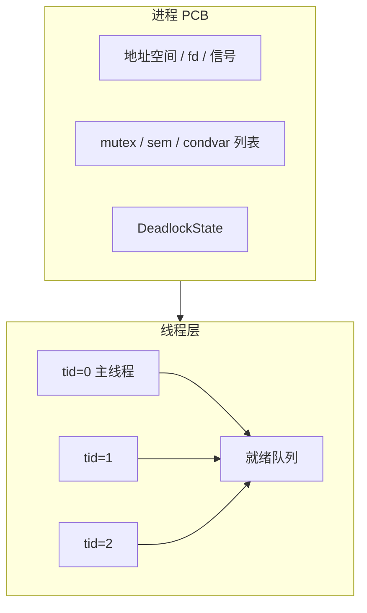
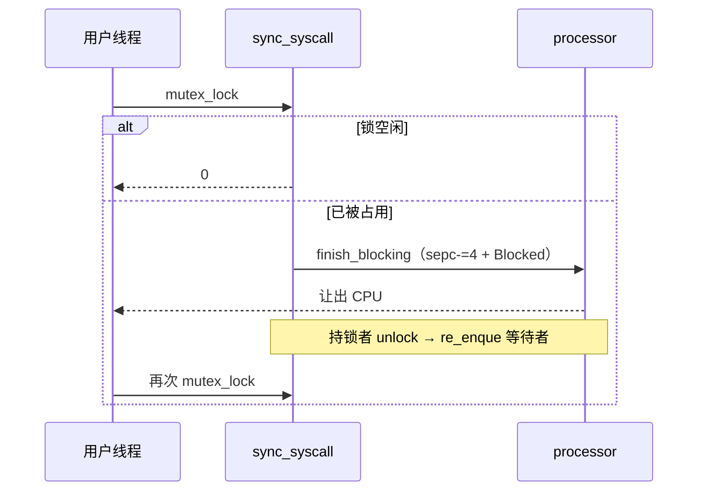

# 实验 8：线程与同步

> 相关教材理论：
>
>  [第 26 章 · 并发：介绍（P209）](/downloads/ostep-zh.pdf#page=209)
>
>  [第 27 章 · 插叙：线程 API（P221）](/downloads/ostep-zh.pdf#page=221)
>
>  [第 28 章 · 锁（P230）](/downloads/ostep-zh.pdf#page=230)
>
>  [第 30 章 · 条件变量（P260）](/downloads/ostep-zh.pdf#page=260)
>
>  [第 31 章 · 信号量（P274）](/downloads/ostep-zh.pdf#page=274)

## 零、开始之前

在开始把「同进程多执行流」与阻塞式同步接进内核之前，请确认已完成以下准备：

1. **已完成 Lab7**：理解统一 fd、信号与管道（见 [Lab7 IPC 与信号](/labs/lab7-ipc-signal)）。本实验会在同一进程地址空间里再挂线程，并加上阻塞 mutex / 信号量 / 条件变量。
2. **快速自检**：以下两条命令都能输出版本号，说明环境就绪：
  ```powershell
   rustc --version                    # 预期：rustc 1.96.0 ...
   qemu-system-riscv64 --version      # 预期：QEMU emulator version ...
  ```
3. **建议先读书**：OSTEP 第 26–28、30–31 章（线程、锁、条件变量、信号量）。Lab8 对应 feature 为 `lab8`（依赖 `lab7`），也是本系列的**最后一个实验**。

> Lab8 需要 VirtIO 与磁盘镜像 `fs.img`。直接跑 `make test-lab8` 即可：编内核时 `build.rs` 会自动打包用户程序与 `fs.img`（`initproc` 为 `lab8_integration_test`）；也可用 `make check-fs-img` 校验镜像。  
> **请勿**使用裸的 `cargo run -p kernel --features lab8`，否则往往挂不上块设备。


## 一、问题场景

从 Lab1 走到 Lab7，你已经亲手把一个最小内核搭到了能跑进程、文件、磁盘与信号的样子。但是现在调度与协作的主角大多还是**进程**：各自有地址空间，靠系统调用、管道和信号往来。

很多真实程序并不满足于「一个进程只能干一件事」。例如浏览器要同时处理多个标签页，服务器也要同时应付多个请求——它们往往仍属于**同一个进程**，因此可以**共用同一块内存和已打开的文件**，但又需要好几条彼此独立的执行流，以便轮流占用 CPU、交替往前走。教材把这种「同进程内的多条执行流」叫做**线程**。有了线程，Lab5 那把只适合内核短临界区的**自旋锁**就显得不够用——临界区一长，「拿不到锁就空转」会浪费 CPU；更常见的需求是**拿不到就让出 CPU，等别人唤醒再继续**。教材还会反复提醒另一种灾难：**死锁**——大家互相等待，谁也走不动，系统却可能一声不吭地挂在那里。

站在「写一个多任务用户程序」的角度，你可能会提出三个疑问：

- **能不能同进程多开几条执行流**，一起改同一块内存？
- **拿不到锁时**，是该空转，还是该让出 CPU？
- **加锁顺序不当**时，系统是静静挂死，还是能明确告诉我「这是死锁」？

想把并发主题再推完这关键的一段，我们至少需要完成：


| 需要完成                                            | 作用                                      |
| ----------------------------------------------- | --------------------------------------- |
| 进程之下的线程层（TCB、独立用户栈、`thread_create` / `waittid`） | 在同一地址空间内开多条执行流，共享内存与 fd，同时各自保有栈与上下文     |
| 阻塞式同步原语（mutex / 信号量 / 条件变量）                     | 保护用户态临界区、表达计数资源与「等条件成立」，避免长临界区上空转浪费 CPU |
| 阻塞与调度衔接（`Blocked` / `re_enque`，用户态重试）           | 拿不到资源时让出 CPU；唤醒后再竞争，使等待可被调度、可重试         |
| 可开关的死锁检测（返回 `-0xDEAD`）                          | 在重复加锁或等待环等危险路径上及时短路，区分「稍后再试」与「再试也无意义」   |


Lab7 的部分结构与本实验对照如下：


| 执行环节   | Lab7（进程 + IPC / 信号） | 本实验 Lab8（线程 + 阻塞同步）                 |
| ------ | ------------------- | ----------------------------------- |
| 执行流单位  | 主要以进程为调度与协作单位       | 同进程内可有多条线程，各有 TCB / 用户栈             |
| 同步手段   | 管道、信号；内核短临界区仍用自旋锁   | 再加阻塞 mutex / 信号量 / 条件变量             |
| 拿不到资源时 | （用户侧）多靠管道阻塞或自旋守护元数据 | 当前线程 `Blocked`，返回 `-1`，用户库 while 重试 |
| 死锁     | 无专门检测               | 可开启检测，危险时返回 `-0xDEAD`               |
| 用户接口形态 | 进程 API + fd / 信号    | 再加线程与同步 syscall；管道回归仍须通过            |


也即完成本实验后，你需要能回答下面四个问题：

- 线程相对进程，多了什么、少了什么？`exit` 退出的是整棵进程，还是当前这条执行流？
- 「拿不到锁」如何变成可调度的等待？谁在 `unlock` 时唤醒？用户态为何看到 `-1` 还要再试？
- 信号量与条件变量各解决什么问题？`condvar_wait` 为何必须关联一把 mutex？
- 死锁检测如何短路阻塞路径？`-0xDEAD` 与普通 `-1` 语义有何不同？

**实验目标**：在 Lab7 进程模型之上实现用户态线程与阻塞式同步原语（mutex / 信号量 / 条件变量），并提供可开关的死锁检测；动手点落在内核：`kernel/src/sync_syscall.rs` 里补全或修复 **阻塞返回** `-1` **时的调度衔接（**`finish_blocking_syscall` **/** `re_enque`**）**。跑通后，你应在 QEMU 中看到线程、互斥、条件变量、死锁测例通过，并且管道回归仍然通过。

## 二、背景知识

本节要了解的，是同一条主线上的三件事情：

1. **还用原来的进程，再在上面加线程。（主线① 进程上加线程）** Lab4–Lab7 已经有了进程控制块（PCB）：地址空间、fd、信号等都挂在进程上。Lab8 **不会推倒重来**，而是在每个进程里再挂若干条可独立调度的执行流（线程 / TCB）。这样，同一进程里的线程默认共享内存和打开文件，却又能轮流占用 CPU。
2. **用户态等锁时，用「阻塞」而不是「自旋」。（主线② 阻塞式同步）** 拿不到 mutex / 信号量时，当前线程进入 `Blocked`、让出 CPU；别人释放资源后再把它唤醒。这比 Lab5 自旋锁更适合用户态可能很长的临界区。
3. **死锁要能被明确发现。（主线③ 死锁命名）** 若加锁顺序不当会形成互相等待，教学内核可以返回特殊码 `-0xDEAD`，把「这是死锁」说清楚，而不是让系统悄悄挂死。


### 2.1 主线①：进程之下再挂一层线程

想要实现进程，不必推倒 Lab4 以来的进程抽象，更自然的做法是**双层管理**：

- **进程（PCB）**：仍拥有地址空间、fd 表、信号状态；Lab8 再在其上挂同步原语（mutex / 信号量 / 条件变量）与死锁检测状态。可以把它想成「一间办公室」——桌子、文件柜是共享的。
- **线程（TCB）**：每条执行流有自己的 `tid`、trap 上下文、状态（Ready / Running / Blocked / Zombie）、独立用户栈。可以把它想成「办公室里的几个人」——共用办公室资源，但各自有工位（栈）与手头进度（上下文）。




可以这样记「共享什么、各自持有什么」：


|      | 进程内共享                 | 每线程独立                 |
| ---- | --------------------- | --------------------- |
| 典型内容 | 地址空间、fd 表、信号状态、同步原语列表 | `tid`、trap 上下文、状态、用户栈 |


对照 `kernel/src/processor.rs`，一次 `thread_create` 大致做三件事：

1. **分配独立用户栈**（否则多线程会互相踩栈）；
2. **填好 trap 上下文**：入口地址、参数、栈指针等，让新线程「看起来像刚从 trap 返回用户态」；
3. **放进就绪队列**，之后调度器才可能选中它。

`waittid` 等待某条线程变成 zombie 并回收资源；`exit` 结束的是**当前线程**，不是整棵进程。当进程里最后一条线程也退出，进程才变成 zombie，再由父进程 `wait4` 善后——这和 Lab4「进程 exit」的直觉要分开记。

这与 Lab6 的 `spawn` 不要混：


|        | `spawn`          | `thread_create` |
| ------ | ---------------- | --------------- |
| 新建什么   | **另一个进程**（新地址空间） | **同一进程内**的一条线程  |
| 内存与 fd | 彼此隔离（写时复制等）      | 默认共享            |
| 协作方式   | 管道 / 信号 / wait 等 | 共享内存 + 同步原语     |


读到这里，主线①应已清楚：**PCB 还在，多出来的是同地址空间里的多条 TCB。**  
但多线程一起改共享数据时，必须有同步；下一主线回答——拿不到锁时，为什么不空转，而要让出 CPU。

### 2.2 主线②（核心）：阻塞——拿不到就让出 CPU

面向用户线程的 mutex，在资源不可用时通常**不会**让调用者在内核里空转。本环境约定：


| 操作               | 可用时             | 不可用时             |
| ---------------- | --------------- | ---------------- |
| `mutex_lock`     | 返回 `0`          | 返回 `-1`（随后走阻塞调度） |
| `semaphore_down` | 返回 `0`          | 同上               |
| `condvar_wait`   | 先释放关联 mutex，再阻塞 | 返回 `-1`          |


这里最容易混的一点是：`sys_mutex_lock` **本身只「尝试加锁并返回一个数」**；真正把当前线程标成 `Blocked`、切走 CPU，是 trap 返回路径上的胶水函数 `finish_blocking_syscall` 做的。可以把它拆成两拍：

```text
用户 mutex_lock()
  → ecall 陷入
  → sys_mutex_lock：锁空闲 → 返回 0；否则入等待队列并返回 -1
  → finish_blocking_syscall：若 ret == -1，则 sepc-=4，再 Blocked + 调度
  → （稍后）别人 unlock → re_enque 你
  → 你再次被调度，因为 sepc 指回 ecall，用户态 while 会再试一次
```

对照代码，`kernel/src/sync_syscall.rs` 里的胶水是：

```rust
pub fn finish_blocking_syscall(ret: isize, cx: &mut TrapContext, thread_slot: usize) {
    if ret == -1 {
        cx.sepc = cx.sepc.wrapping_sub(4); // trap 已 advance_sepc，阻塞后要重试同一条 ecall
        processor::block_thread_slot_and_run_next(thread_slot, cx);
    }
}
```

`trap.rs` 在处理完同步相关 syscall 后会调用它。为何必须 `sepc -= 4`？因为 trap 入口通常已经把 `sepc` 指到**下一条指令**；若阻塞时不回退，唤醒后就会从 `ecall` 的下一条继续跑，用户库的「再试一次加锁」就对不上了。

注意：`-0xDEAD`（死锁，见 2.5）**不要**走这条阻塞路径——那是「再试也无意义」的短路，应由用户态直接处理。

解锁唤醒侧示意：

```rust
if let Some(tid) = waking_tid {
    processor::mark_mutex_handoff(tid); // 告诉对方：下次 lock 可走 handoff 快速路径
    re_enque(tid);                      // 缺了这一步，等待者会永远停在 Blocked
}
```

`mark_mutex_handoff` 与 `re_enque` 解决的是两件不同的事：


| 步骤                   | 做什么                 | 只做它、不做另一半会怎样       |
| -------------------- | ------------------- | ------------------ |
| `mark_mutex_handoff` | 标记「锁已留给你」           | 即使线程跑起来，也可能对不上持锁约定 |
| `re_enque`           | 把 Blocked 线程放回复就绪队列 | 线程永远不会再被调度，测例卡住    |


用户库侧（`user/src/syscall.rs`）对阻塞锁是 **while 重试**：

```rust
// 示意：只有 -1 才继续循环；0 成功，-0xDEAD 直接返回给调用者
loop {
    let ret = mutex_lock_raw(id);
    if ret != -1 {
        return ret;
    }
}
```

为何内核不在一次 syscall 里「阻塞到拿到锁为止」？教学上常见取舍是：每次陷入语义更简单（尝试 / 失败返回），唤醒后再竞争；也方便在重试间隙处理 Lab7 的信号。




请先抓住三点：

1. `-1` **不是最终失败**：表示「这次没拿到，已/将让出 CPU，请再试」。
2. **唤醒不等于已持锁**：`re_enque` 只让线程再次可运行；真正持锁仍靠下一次成功的 `mutex_lock`。
3. `sepc` **回退 + 用户态 while**：两边配合，才形成「尝试 → 阻塞 → 唤醒 → 再试」闭环。

主线②的「机制骨架」到这里就齐了。下面两小节是同一骨架上的**对照**与**扩展**：先分清和 Lab5 自旋锁的关系，再看信号量 / 条件变量如何复用这套 `-1` 语义。

### 2.3 主线②（对照）：和 Lab5 自旋锁并存，而不是互相取代

开篇第 2 点说「用阻塞而不是自旋」，**并不是扔掉 Lab5 的** `SpinMutex`。两层锁服务的场景不同：


| 维度   | Lab5 `SpinMutex`  | Lab8 阻塞 mutex                 |
| ---- | ----------------- | ----------------------------- |
| 等待方式 | CAS 自旋（占着 CPU 空转） | 入等待队列并让出 CPU                  |
| 典型用途 | 内核极短临界区（如管道元数据）   | 用户态可能较长的临界区                   |
| 与调度  | 基本无关              | 与线程 `Blocked` / `re_enque` 协作 |
| 死锁检测 | 无                 | 可接入进程层检测                      |
| 若等太久 | CPU 被白白烧掉         | 别人可以继续跑                       |


`os-sync` 提供的是**新增的一层**。内部保护等待队列本身时，仍可能用很短的自旋——那是「锁住几行元数据」，与「用户线程在业务临界区里空转」不是一回事。可以记成：

```text
用户业务临界区很长  →  用阻塞 mutex（Lab8）
内核里改几行元数据   →  用自旋锁（Lab5）
```

为何不把自旋锁直接暴露给用户态长临界区？因为用户代码可能持锁很久；在单核或持锁者被抢占时，其它线程自旋只会空耗 CPU，甚至饿死真正需要运行的持锁线程。阻塞 mutex 把等待变成可调度事件，更适合这一层。

### 2.4 主线②（扩展）：信号量与条件变量

互斥只是同步需求的一种。教材里另外两类也很常见；**重要的是：它们仍走同一套「返回** `-1` **→** `finish_blocking_syscall` **→ 唤醒后** `re_enque`**」**，不必另学一套调度故事。

**信号量（semaphore）**：计数型资源。直觉是「还有几张票」：

- `down`：试图取走一张；没有票就阻塞（返回 `-1`）；
- `up`：归还一张，并 `re_enque` 一个等待者。

适合「最多 N 个并发持有者」这类问题（例如同时最多 3 个线程进入某段代码）。

**条件变量（condvar）**：表达「等某个条件成立」，而不是「等某把锁空闲」。经典写法是：

```text
mutex_lock(m);
while (!条件成立) {
    condvar_wait(cv, m);  // 原子地：释放 m + 睡眠；被 signal 后再重新抢 m
}
// 此处持锁且条件为真，做事情...
mutex_unlock(m);
```

为何 `condvar_wait` 必须传入关联的 mutex？

1. 检查条件与睡眠必须在同一把锁保护下，否则另一线程可能在「你检查完、尚未睡下」之间改条件并 `signal`，造成 **lost wakeup（丢失唤醒）**——你永远睡过去，信号已经发过了。
2. wait 期间会**释放** mutex，让别人有机会改条件；被唤醒后必须**重新获取** mutex，再检查条件是否仍然成立（所以常用 `while`，不是 `if`）。

测例里常见模式：工作线程 wait 某个标志，主线程改标志后 signal。读代码时可对照 `condvar_test` 与 `os-sync` 中条件变量实现。

至此主线②完整：**阻塞骨架（2.2）+ 与自旋对照（2.3）+ 更多原语复用同一骨架（2.4）。**

### 2.5 主线③：死锁——发现它，而不是陪它挂着

开启 `enable_deadlock_detect(1)` 后，教学内核可以在加锁 / `down` **真正入队阻塞之前**做检查：

- **互斥锁**：维护等待图（谁持有、谁在等）；同线程重复加锁或形成等待环时，判定危险；
- **信号量**：可用银行家算法一类安全性检查（Available / Allocation / Need）。

一旦认为「再走下去会永久卡住」，就返回特殊码 `-0xDEAD`（十进制 **-57005**），并且**不要**再把当前线程送进阻塞等待。这与普通的 `-1` 不同：


| 返回值       | 含义                  | `finish_blocking_syscall` | 调用者通常怎么做         |
| --------- | ------------------- | ------------------------- | ---------------- |
| `-1`      | 现在不行，但可以稍后再试（已/将阻塞） | **会**回退 `sepc` 并 Blocked  | while 重试 syscall |
| `-0xDEAD` | 再试也没有意义，这是死锁        | **不会**当阻塞处理               | 中止或改设计，不要当普通失败重试 |


对照测例时：

- `deadlock_mutex_test`：同线程对同一 mutex 二次 `lock`，等待图见自环，短路返回 `-0xDEAD`；
- `deadlock_sem_test`：资源请求形成不安全状态，同样短路。

若误把 `-0xDEAD` 送进 `finish_blocking_syscall`，调用者会被标成 `Blocked` 却永远等不到合法唤醒——比「返回死锁码」更难排查。读代码时可对照 `kernel/src/deadlock.rs` 与 `sys_mutex_lock` 里对 `DEADLOCK_DETECTED` 的提前返回。

### 2.6 收束：测例在验证什么

三条主线最终都要落到 QEMU 输出上。`lab8_integration_test` 是 initproc，负责把下列测例串成一条链（细节以源文件为准）。先理解每个测例逼哪条路径，再进入第三节动手：


| 测例                                  | 主要验证                    | 对应主线 | 如果坏了，通常该查哪里                                   |
| ----------------------------------- | ----------------------- | ---- | --------------------------------------------- |
| `threads_test` / `threads_arg_test` | 创建、参数、`waittid`         | ①    | `processor.rs` 的 TCB / 用户栈                    |
| `mutex_test`                        | 多线程互斥、阻塞唤醒              | ②    | `finish_blocking_syscall`、`unlock`/`re_enque` |
| `condvar_test`                      | wait / signal 与关联 mutex | ②    | `condvar_wait`、唤醒后的 handoff / 入队              |
| `pipetest`                          | 进程级管道与线程共存              | ①+②  | 线程模型是否破坏管道路径                                  |
| `deadlock_*`                        | 返回 `-0xDEAD` 而非挂死       | ③    | `deadlock.rs`、是否误当 `-1` 阻塞                    |
| `pipe_test`                         | Lab5/Lab7 管道回归          | 回归   | 统一 fd / 引用计数是否被线程路径破坏                         |


**把三条主线再串成一句**：

```text
① PCB + TCB                 →  同地址空间多执行流
② mutex 返回 -1             →  finish_blocking（sepc-=4 + Blocked）
   unlock / up / signal     →  re_enque；用户态 while 再竞争
③ 死锁检测返回 -0xDEAD        →  短路阻塞，不要再试
```

## 三、实验任务

本实验主要相关文件（路径相对 `os-lab/`）：


| 文件                                      | 角色                            | 阅读时重点确认                                                           |
| --------------------------------------- | ----------------------------- | ----------------------------------------------------------------- |
| `os-sync/src/*.rs`                      | 阻塞 mutex / sem / condvar      | 拿不到锁时返回什么？等待队列如何组织？                                               |
| `kernel/src/processor.rs`               | TCB、线程创建 / 等待 / 退出            | 用户栈从哪来？最后一条线程退出后进程怎样？                                             |
| `kernel/src/sync_syscall.rs`            | 同步 syscall + 阻塞调度（**任务一动手点**） | `-1` 与 `-0xDEAD` 如何区分？谁 `re_enque`？`finish_blocking_syscall` 做什么？ |
| `kernel/src/trap.rs`                    | 同步 syscall 返回后的衔接             | 何时调用 `finish_blocking_syscall`？                                   |
| `kernel/src/deadlock.rs`                | 死锁检测                          | 等待图在哪里短路阻塞路径？                                                     |
| `user/src/syscall.rs`                   | 阻塞重试循环                        | 为何 while 重试？死锁码是否也要重试？                                            |
| `user/src/bin/lab8_integration_test.rs` | initproc 全链（**不是**任务文件）       | 测例顺序如何串联？                                                         |


### 任务一：完成实验

本实验的任务文件为 `kernel/src/sync_syscall.rs`，请在工作区中打开文件，并根据文件头的任务标记与注释提示完成阻塞调度衔接。

确认环境已激活后，在 `os-lab/`（或学生工作区根目录）下运行：

```powershell
make test-lab8
```

**预期输出**：屏幕会先刷出 **OpenSBI 启动日志**（可忽略），随后是内核与用户测例输出。示意如下：

```text
OpenSBI v1.7
  ...（OpenSBI 平台/HART 日志，可忽略）...
threads_test pass
threads_arg_test pass
mutex_test pass
condvar_test pass
pipetest passed!
deadlock test mutex 1 OK!
deadlock test semaphore 1 OK!
pipe_test pass
All processes exited.
```

**通过标准**（下列断言缺一不可）：


| 断言                        | 必须看到                            |
| ------------------------- | ------------------------------- |
| `threads-pass`            | `threads_test pass`             |
| `threads-arg-pass`        | `threads_arg_test pass`         |
| `mutex-pass`              | `mutex_test pass`               |
| `condvar-pass`            | `condvar_test pass`             |
| `pipetest-pass`           | `pipetest passed!`              |
| `deadlock-mutex-pass`     | `deadlock test mutex 1 OK!`     |
| `deadlock-semaphore-pass` | `deadlock test semaphore 1 OK!` |
| `pipe-pass`               | `pipe_test pass`                |
| `all-processes-exited`    | `All processes exited.`         |


且 QEMU 正常退出（终端命令返回，没有卡住或报错）。

### 任务二：阅读理解

1. `thread_create` 如何为新线程分配用户栈？`waittid` 回收时如何释放栈？`exit` 退出的是进程还是线程？最后一个线程退出后进程处于什么状态？
2. `mutex_lock` 返回 `-1` 后，`finish_blocking_syscall` 做了什么？谁负责 `re_enque`？用户态为何要 while 重试？若只 `mark_mutex_handoff` 而不 `re_enque`，会出现什么现象？
3. 对比 Lab5 `SpinMutex` 与阻塞 mutex：为何后者更适合用户态长临界区？为何不把自旋锁直接暴露给用户态？
4. `condvar_wait` 为何必须传入关联的 mutex id？唤醒后为何要重新 `mutex_lock`？
5. `deadlock_mutex_test` 期望 `-0xDEAD` 而非挂死：检测逻辑在何处短路阻塞路径？`-0xDEAD` 与普通 `-1` 语义有何不同？为何 `finish_blocking_syscall` 不能把 `-0xDEAD` 当阻塞处理？


### 任务三：动手修改

**修改 1：打印线程 tid**

在 `threads_test`（或集成测例中对应片段）里调用 `gettid()` 并打印，确认主线程与子线程的 tid 不同。

```powershell
make test-lab8
```

- 通过标准：能在输出中看到不同 tid，且原有 `threads_test pass` 等关键行仍尽量保持通过。
- **做完务必改回并** `make test-lab8` **确认恢复正常**（若希望保留作展示，可另开分支）。

**修改 2：关闭死锁检测后观察差异**

将 `enable_deadlock_detect(0)` 后运行原先期望 `-0xDEAD` 的 `deadlock_mutex_test` 路径，观察与开启检测时的差异。

- 预期现象：关闭检测后，重复加锁路径可能**挂死**或长时间无进展（勿长时间占用机器；观察几秒即可）。
- 通过标准：能用自己的话解释**为什么**开启检测时返回 `-0xDEAD`，关闭后却可能卡住。
- **做完务必改回检测开关并** `make test-lab8` **确认恢复正常**。

**修改 3：对照参考实现写短文（进阶）**

对照 `reference-patches/ch8-exercise.patch` 中 TCB 与 sync 模块，找出本环境相对参考实现的三处简化点（例如调度策略、等待队列结构、死锁检测范围），写成一小段话。

- 通过标准：能说清「差在哪里、各自在换什么」。


## 四、验证命令


| 验证项         | 命令                                                      | 通过标准                      |
| ----------- | ------------------------------------------------------- | ------------------------- |
| 主编译         | `cargo check -p kernel --features lab8`                 | 无 error                   |
| QEMU 全链     | `make test-lab8`                                        | 见任务一通过标准表（全部断言，QEMU 正常退出） |
| fs.img      | `make check-fs-img`                                     | 脚本输出 `fs.img OK`          |
| host 单测（可选） | `cargo test -p os-sync --target x86_64-pc-windows-msvc` | 相关项通过（须显式指定宿主机 triple）    |


> 组件单测在 `os-lab/` 目录下执行；`--target x86_64-pc-windows-msvc` 表示在宿主机上跑。

