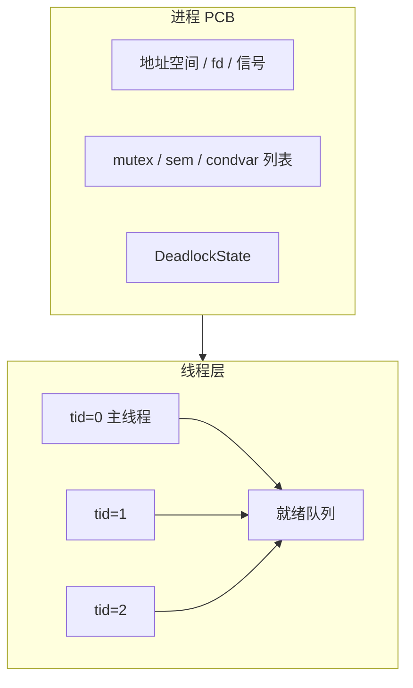
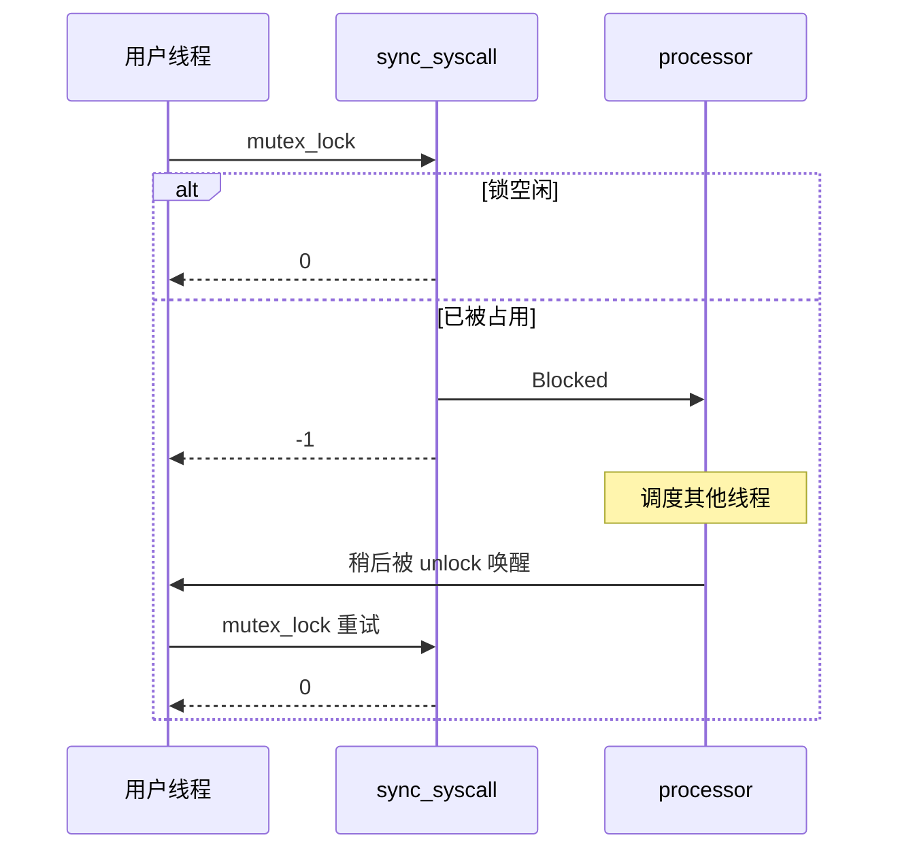

# 实验 8：线程与同步

> 对应 feature：`lab8`（依赖 `lab7`）。这是本系列的**最后一个实验**。

> **配套教材**（《操作系统导论》OSTEP 中译）：[第 26 章 · 并发简介（PDF 第 209 页）](/downloads/ostep-zh.pdf#page=209) · [第 27 章 · 线程 API（PDF 第 221 页）](/downloads/ostep-zh.pdf#page=221) · [第 28 章 · 锁（PDF 第 230 页）](/downloads/ostep-zh.pdf#page=230) · [第 30 章 · 条件变量（PDF 第 260 页）](/downloads/ostep-zh.pdf#page=260) · [第 31 章 · 信号量（PDF 第 274 页）](/downloads/ostep-zh.pdf#page=274) · [全书入口](/downloads/ostep-zh.pdf)

从 Lab1 走到这里，你已经亲手把一个最小的内核，一步步搭到了如今的样子。不妨先回头看一眼：Lab1 让内核在裸机上活下来；Lab2–4 接上陷入、虚存与进程 API，对应教材里的**虚拟化**；Lab5–6 用文件、管道与磁盘把**持久性**落到代码里；Lab7 又补上统一 fd、`dup` 与信号，让进程之间既能传字节，也能递事件。到目前为止，调度与协作的主角大多还是**进程**——各自有地址空间，靠系统调用、管道和信号往来。

可很多真实程序并不满足于「一个进程一条执行流」。浏览器标签页、服务器工作线程，更希望在**同一片地址空间里**再开几条路：共享内存与打开文件，却仍能交错推进。教材把这种执行流叫做**线程**。有了线程，Lab5 那把只适合内核短临界区的**自旋锁**就显得不够用了——临界区一长，「拿不到锁就空转」会浪费 CPU；更常见的需求是**拿不到就让出 CPU，等别人唤醒再继续**。教材还会反复提醒另一种灾难：**死锁**——大家互相等待，谁也走不动，系统却可能一声不吭地挂在那里。

作为收官实验，Lab8 要把并发主题再推完这关键的一截：用户态线程、阻塞式同步原语（mutex / 信号量 / 条件变量），以及可开关的死锁检测。Lab5 的自旋锁**不会被扔掉**——它仍守护内核里那些极短的路径；你新学的是面向用户线程的另一层。跑通之后，回头看整条 Lab1–8，你手里的就不只是「能启动的内核」，而是一本教材三大主题——**虚拟化、持久性、并发**——都已经留下脚印的教学操作系统。后面若再扩展，也是站在这座已搭好的架子上往上加，而不是从零开始。

## 零、开始之前

1. **已完成 Lab7**：能跑通 `make test-lab7`，理解统一 fd、信号与管道（见 [lab7-ipc-signal.md](lab7-ipc-signal.md)）。
2. **进入工作目录**：`cd os-lab`；新开终端先 `. .\scripts\activate-os-env.ps1`。
3. **自检**：`rustc --version` 与 `qemu-system-riscv64 --version` 能输出版本。
4. **建议先翻书**：锁、条件变量、死锁相关章节。带着「线程共享什么」「阻塞和自旋差在哪」的疑问边做实验边思考。


### 环境准备（与 Lab6/7 相同）

Lab8 同样依赖 VirtIO，且须**先编用户程序再编内核**以刷新 `fs.img`：

```powershell
cd os-lab
cargo build -p user --bins --release --target riscv64gc-unknown-none-elf
cargo build -p kernel --features lab8 --release
```

`kernel/build.rs` 在 `lab8` 下将 **`lab8_integration_test`** 打包为 `initproc`，在**单进程地址空间**内串联线程、同步、死锁与管道回归（减轻多次 `exec` 的堆压力）。

> 跑通验证请用【任务一】中的 `make test-lab8`（已封装 VirtIO）。请勿用裸 `cargo run -p kernel --features lab8`，否则访问不到 `fs.img`。

## 一、问题场景

进程 API 已经能用之后，若站在「写一个多任务用户程序」的角度，仍会觉得缺工具：

> 「能不能在同一个程序里再开几条执行流，一起改同一块内存？其中一条暂时拿不到锁时，是该空转，还是该让出 CPU？若加锁顺序不当，系统是静静挂死，还是能明确告诉我『这是死锁』？」

不妨先把问题摊开：

- **线程相对进程，多了什么、少了什么？**  
同进程内的多条执行流，通常共享哪些资源？各自又必须独立持有什么（栈、上下文、状态）？`exit` 退出的是整棵进程，还是当前这条执行流？
- **「拿不到锁」应该怎么表现？**  
自旋是一种答案。若改成阻塞：内核如何把当前线程标成不可运行？谁在 `unlock` 时把它唤醒？用户态看到 `-1` 之后为什么还要再试一次？
- **除了互斥，还有哪些常见同步需求？**  
「有 N 个同类资源」适合什么原语？「等某个条件成立再继续」为何常常要和一把 mutex 绑在一起？
- **死锁能不能被发现，而不是被等到天荒地老？**  
同线程对同一把锁加两次，或若干线程形成等待环时，教学内核可以返回什么特殊错误码？它和「暂时拿不到、稍后再试」的 `-1` 有何不同？

本实验把教材**并发**主题再推深一层。跑通后，你应能看到线程、互斥、条件变量、死锁测例通过，并且管道回归仍在。

## 二、背景知识

现在我们根据

### 2.1 进程之下再挂一层线程

不必拆掉 Lab4 的 PCB。更自然的做法是**双层管理**：

- **进程**：仍拥有地址空间、fd 表、信号状态；Lab8 再在其上挂同步原语列表与死锁检测状态。
- **线程**：每条执行流有自己的 TCB——`tid`、trap 上下文、Ready/Running/Blocked/Zombie、独立用户栈等。




`thread_create` 做的事，直觉上是：分配用户栈 → 填好入口与参数 → 把新线程放进就绪队列。`waittid` 等待某条线程变成 zombie 并回收；`exit` 结束的是**当前线程**。当进程里最后一条线程也退出，进程才变成 zombie，再由父进程 `wait4` 善后。

这与 Lab6 的 `spawn` 不同：`spawn` 新建的是**另一个进程**（新地址空间）；`thread_create` 则留在同一片地址空间里。

### 2.2 阻塞：拿不到就让出 CPU

面向用户线程的 mutex，在资源不可用时通常不会让调用者在内核里空转。本环境约定（与常见教学栈一致）：


| 操作               | 可用时             | 不可用时                   |
| ---------------- | --------------- | ---------------------- |
| `mutex_lock`     | 返回 `0`          | 当前线程 `Blocked`，返回 `-1` |
| `semaphore_down` | 返回 `0`          | 同上                     |
| `condvar_wait`   | 先释放关联 mutex，再阻塞 | 返回 `-1`                |


`unlock` / `up` / `signal` 负责把等待者重新 `re_enque` 进就绪队列。用户库看到 `-1` 后**循环再次发起 syscall**——因为一次陷入只表示「尝试」；被唤醒后仍要重新竞争锁。这样 trap 边界清晰，也方便在重试间隙处理 Lab7 的信号。




### 2.3 和 Lab5 自旋锁并存，而不是互相取代


| 维度   | Lab5 `SpinMutex` | Lab8 阻塞 mutex                 |
| ---- | ---------------- | ----------------------------- |
| 等待   | CAS 自旋           | 入等待队列并让出 CPU                  |
| 典型用途 | 内核极短临界区（如管道元数据）  | 用户态可能较长的临界区                   |
| 与调度  | 基本无关             | 与线程 `Blocked` / `re_enque` 协作 |
| 死锁检测 | 无                | 可接入进程层检测                      |


`os-sync` 提供的是**新增的一层**。内部保护等待队列本身时，仍可能用很短的自旋——那是「锁住几行元数据」，与「用户线程在业务临界区里空转」不是一回事。

### 2.4 信号量与条件变量

- **信号量**：计数型资源。`down` 试图取走一个；没有时阻塞。`up` 归还并唤醒等待者。适合「最多 N 个并发持有者」这类问题。
- **条件变量**：表达「等某个条件成立」。`condvar_wait(cv, mutex)` 需要在持锁情况下原子地**释放 mutex 并睡眠**；否则容易和「另一线程改条件并 signal」形成 lost wakeup。被 `signal` 唤醒后，线程通常要**重新获取 mutex**，再检查条件是否仍然成立（经典写法常用 `while (!cond) wait`）。

测例里常见模式：工作线程 wait 某个标志，主线程改标志后 signal。

### 2.5 死锁：发现它，而不是陪它挂着

开启 `enable_deadlock_detect(1)` 后，教学内核可以在加锁 / `down` 前做检查：

- **互斥锁**：维护等待图（谁持有、谁在等）；同线程重复加锁或形成环时，判定危险；
- **信号量**：可用银行家算法一类安全性检查（Available / Allocation / Need）。

一旦认为「再走下去会永久卡住」，就返回特殊码 `-0xDEAD`**（-57005）**，并且**不要**再把当前线程送进阻塞等待。这与普通的 `-1` 不同：`-1` 表示「现在不行，但可以稍后再试」；`-0xDEAD` 表示「再试也没有意义，这是死锁」。

对照测例时，`deadlock_mutex_test`（重复加同一把锁）、`deadlock_sem_test`（资源请求环）就是在逼这条短路路径。

### 2.6 测例在验证什么


| 测例                                  | 大致覆盖       |
| ----------------------------------- | ---------- |
| `threads_test` / `threads_arg_test` | 创建、参数、等待   |
| `mutex_test`                        | 多线程互斥      |
| `condvar_test`                      | 条件变量       |
| `pipetest`                          | 进程级管道与线程共存 |
| `deadlock_*`                        | `-0xDEAD`  |
| `pipe_test`                         | 既有管道回归     |


未纳入的条目见继承清单文档，不必在一期里强求齐全。

---

串起来：线程让「同地址空间多执行流」成为可能；阻塞同步让等待变得可调度；死锁检测让错误可被命名。下一节用全链测例确认这三层都站得住。

## 三、实验任务

> 建议先 `make test-lab8`，再读 `processor.rs` + `sync_syscall.rs`，对照 `lab8_integration_test`。


| 文件                                      | 角色                       | 先想                     |
| --------------------------------------- | ------------------------ | ---------------------- |
| `os-sync/src/*.rs`                      | 阻塞 mutex / sem / condvar | 拿不到锁时返回什么？             |
| `kernel/src/processor.rs`               | TCB、线程创建/等待/退出           | 用户栈从哪来？                |
| `kernel/src/sync_syscall.rs`            | 同步 syscall + 阻塞调度        | `-1` 与 `-0xDEAD` 如何区分？ |
| `kernel/src/deadlock.rs`                | 死锁检测                     | 等待图在哪里短路？              |
| `user/src/syscall.rs`                   | 阻塞重试循环                   | 为何 while 重试？           |
| `user/src/bin/lab8_integration_test.rs` | initproc 全链              | —                      |


> 完整解读见 `labs/answers/lab8-answers.md`。


### 任务一：跑通 lab8（必做）

**第一步：确认变体。** 如果教师通过工作台下发了 debug 变体，先打开 `user/src/bin/lab8_integration_test.rs` 文件头，应看到 `【Lab8 任务：排错】`；没有任务标记则用参考实现直接运行。

```powershell
make test-lab8
```

**预期输出**（OpenSBI 日志可忽略）：

```text
threads_test pass
threads_arg_test pass
mutex_test pass
condvar_test pass
pipetest passed!
deadlock test mutex 1 OK!
deadlock test semaphore 1 OK!
pipe_test pass
All processes exited.
```

**通过标准**：出现以上全部关键行，且 QEMU 正常退出。

> 请先编 user 再编 kernel，以刷新 `fs.img`。更多联调说明见 [lab6-8.md](../../docs/lab6-8.md)。


### 任务二：阅读理解与思考题（必做）

每道题建议**先合上代码想答案，再打开对照**；**参考答案见** `labs/answers/lab8-answers.md`。

1. `thread_create` 如何为新线程分配用户栈？`waittid` 回收时如何释放栈？`exit` 退出的是进程还是线程？最后一个线程退出后进程处于什么状态？
2. `mutex_lock` 返回 `-1` 后，内核如何把当前线程标为 `Blocked`？谁负责 `re_enque`？用户态为何要 while 重试？
3. 对比 Lab5 `SpinMutex` 与 `MutexBlocking`：为何后者更适合用户态长临界区？为何不把自旋锁直接暴露给用户态？
4. `condvar_wait` 为何必须传入关联的 mutex id？唤醒后为何要重新 `mutex_lock`？
5. `deadlock_mutex_test` 期望 `-0xDEAD` 而非挂死：检测逻辑在何处短路阻塞路径？`-0xDEAD` 与普通 `-1` 语义有何不同？

> 能讲清「双层调度 + 阻塞重试 + 死锁短路」，lab8 就过关了。


### 任务三：动手小修改（选做，建议完成）

**修改 1**：在 `threads_test` 中打印 `gettid()`，确认主线程与子线程 tid 不同。

**修改 2**：关闭死锁检测 `enable_deadlock_detect(0)` 后运行 `deadlock_mutex_test`，观察差异（可能挂死，勿长时间运行）。

**修改 3**（进阶）：阅读 `reference-patches/ch8-exercise.patch` 中 TCB 与 sync 模块，列出本环境的三处简化点。

### 提交清单（自查）

- [ ] `make test-lab8` 输出任务一列出的全部关键行，且 QEMU 正常退出
- [ ] 能说明线程 → 阻塞 → 信号量/条件变量 → 死锁检测这条主线
- [ ] 完成【任务二】5 道阅读理解题（对照答案自查）
- [ ] 能解释 `condvar_wait` 为什么必须关联 mutex、`-0xDEAD` 与普通 `-1` 的区别

## 四、验证


| 验证项         | 命令                                                      | 通过标准        |
| ----------- | ------------------------------------------------------- | ----------- |
| 主编译         | `cargo check -p kernel --features lab8`                 | 无 error     |
| QEMU 全链     | `make test-lab8`                                        | 见任务一预期输出    |
| fs.img      | `make check-fs-img`                                     | `fs.img OK` |
| host 单测（可选） | `cargo test -p os-sync --target x86_64-pc-windows-msvc` | 相关项通过       |


Windows 默认 Rust target 为 riscv 时，host 单测**必须**显式指定宿主机 triple。

## 五、AI 提问模板

做实验时，建议用以下切入点和 AI 交互，引导自己思考而非直接要答案：

1. **概念澄清型**：「线程与进程的区别是什么？同一进程的线程共享哪些资源？」
2. **现象解释型**：「`mutex_lock` 返回 -1 后用户态为什么要 while 重试，而不是 sleep？」
3. **代码追因型**：「`condvar_wait` 里先 unlock mutex 再阻塞，若中间被打断会怎样？」
4. **对比深化型**：「自旋锁、阻塞 mutex、信号量分别适合什么临界区长度与竞争程度？」
5. **动手探索型**：「若把 `pipetest` 改成多线程写同一管道，需要加锁吗？用哪种原语？」

