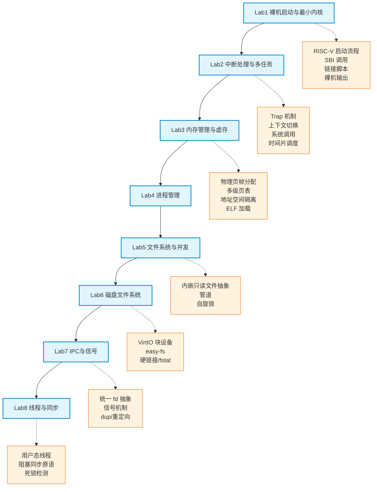
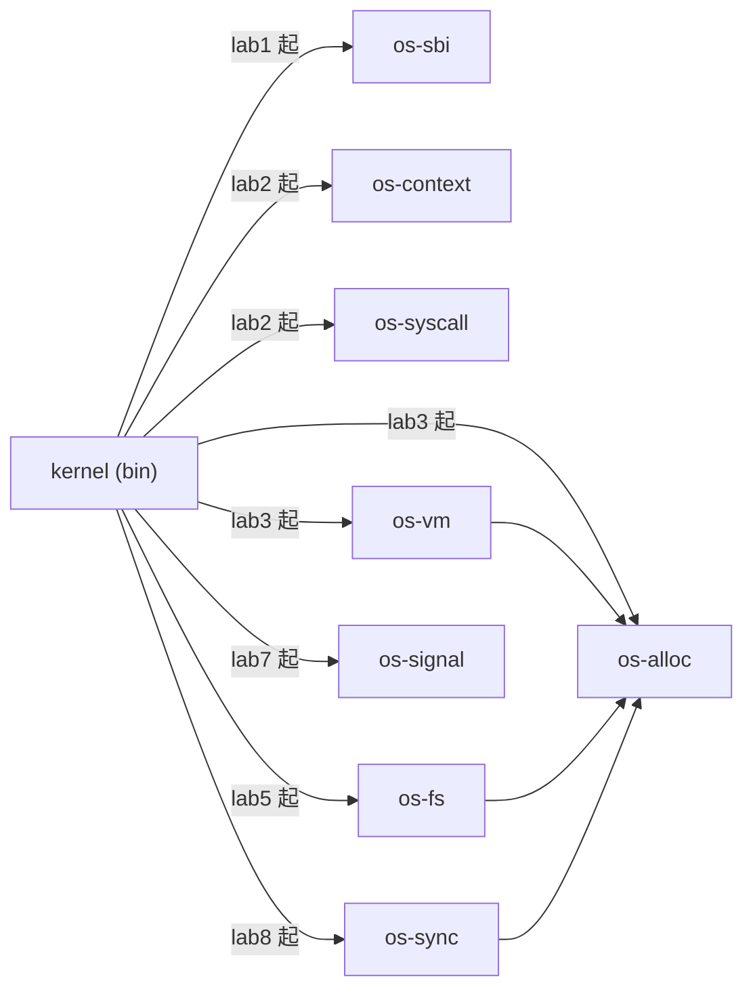

# 实验总览

> 本文档由成员 C 维护，是 EVOLVE 教学实验环境的入口。后续每个 Lab 的详细指导见同目录下对应文件。

## 一、本环境是什么

EVOLVE 是一套基于 **Rust + RISC-V 64 + QEMU** 的自研操作系统教学实验环境。它和参考环境 `tg-rcore-tutorial` 最大的区别是：**只有一个内核，通过 feature gate 让内核从裸机到完整系统逐步"长出来"**。学生始终在同一个代码库中工作，能清晰看到内核演进的脉络，而不是面对 8 个互相独立的内核。

- 编程语言：Rust（stable）
- 目标平台：`riscv64gc-unknown-none-elf`
- 运行环境：QEMU `virt` 机器（`qemu-system-riscv64`）
- 组件化：内核主体之外，另有 8 个独立的库 crate（`os-sbi`/`os-context`/`os-syscall`/`os-alloc`/`os-vm`/`os-fs`/`os-signal`/`os-sync`），外加 `user` 用户态程序 crate；组件 crate 各自具备独立测试边界

## 二、前置准备

开始实验前，请确认本机已具备以下环境（具体安装见仓库根目录 `docs/environment_setup.md`）：

```text
rustc 1.96.0（含 riscv64gc-unknown-none-elf target、rust-src、llvm-tools）
QEMU 11.0.50（qemu-system-riscv64）
Visual Studio C++ Build Tools（仅 Windows 原生编译需要）
```

在仓库根目录执行以下命令激活当前终端的实验环境（Windows PowerShell）：

```powershell
. .\scripts\activate-os-env.ps1
```

## 三、知识点地图

下图展示了 8 个实验覆盖的操作系统核心知识点及其先后依赖关系。建议按从上到下的顺序学习，每一层都建立在前一层之上。Lab6–8 二期总览见 [docs/lab6-8.md](../../docs/lab6-8.md)。



## 四、实验列表与渐进式 Feature

本环境用 Cargo feature 控制内核功能的启用层级。feature 之间是严格递进的：`lab5` 依赖 `lab4`，`lab4` 依赖 `lab3`，以此类推。学生通过切换 feature 感受内核功能逐步"长出来"。

| 实验 | 主题 | Feature | 对应文档 | 参考环境对应 | 状态 |
|------|------|---------|----------|-------------|------|
| Lab1 | 裸机启动与最小内核 | `lab1` | [lab1-bare-metal.md](lab1-bare-metal.md) | ch1 + ch2 合并 | ✅ 已交付 |
| Lab2 | 中断处理与多任务 | `lab2` | [lab2-trap-and-task.md](lab2-trap-and-task.md) | ch2 + ch3 合并 | ✅ 已交付 |
| Lab3 | 内存管理与虚存 | `lab3` | [lab3-memory.md](lab3-memory.md) | ch4 | ✅ 已交付 |
| Lab4 | 进程管理 | `lab4` | [lab4-process.md](lab4-process.md) | ch5 base | ✅ 已交付 |
| Lab5 | 文件系统与并发（入门） | `lab5` | [lab5-fs-and-sync.md](lab5-fs-and-sync.md) | ch6/ch7 简化版 | ✅ 已交付 |
| Lab6 | 磁盘文件系统 | `lab6` | [lab6-disk-fs.md](lab6-disk-fs.md) | ch6 | ✅ 已交付 |
| Lab7 | IPC 与信号 | `lab7` | [lab7-ipc-signal.md](lab7-ipc-signal.md) | ch7 | ✅ 已交付 |
| Lab8 | 线程与同步 | `lab8` | [lab8-thread-sync.md](lab8-thread-sync.md) | ch8 | ✅ 已交付 |

feature 层级定义在 `kernel/Cargo.toml`：

```toml
[features]
default = ["lab1"]
lab1 = ["dep:os-sbi"]
lab2 = ["lab1", "dep:os-context", "dep:os-syscall"]
lab3 = ["lab2", "dep:os-alloc", "dep:os-vm"]
lab4 = ["lab3"]
lab5 = ["lab4", "dep:os-fs"]
lab6 = ["lab5", "dep:easy-fs", "dep:virtio-drivers", "dep:spin"]
lab7 = ["lab6", "dep:os-signal"]
lab8 = ["lab7", "dep:os-sync"]
```

Lab6–8 依赖、分工、验收与进度见 [docs/lab6-8.md](../../docs/lab6-8.md)。

## 五、组件 Crate 依赖关系

内核之外的 8 个 `os-*` 库 crate 按实验阶段逐步引入。下图展示它们与内核主体 `kernel` 的依赖关系。



对比参考环境 `tg-rcore-tutorial` 的多内核、多 crate 结构，本环境保持 `kernel` + 8 个职责聚焦的 `os-*` 库（另加 `user`）、约 2 层依赖，让学生能沿单一演进链理解组件边界。

## 六、快速开始

进入 `os-lab` 目录后，常用命令如下（Makefile 已封装好统一入口）：

```powershell
cd os-lab

# 运行 Lab1（默认 feature）
make run
# 等价于
cargo run -p kernel --features lab1

# 切换到某个 Lab 运行
make run FEATURE=lab2

# Lab6 须带 VirtIO 块设备（勿用裸 cargo run）
make test-lab6

# Lab7：dup + 信号 + 管道回归（同样须 VirtIO）
make test-lab7

# Lab8：线程 + 阻塞同步 + 死锁（须先编 user 再编 kernel）
make test-lab8

# 检查全部 feature 是否都能编译通过
make check

# 运行某个 Lab 的验证
make test-lab1
```

> 首个 Lab（lab1）已验证可在 QEMU 中输出 `Hello, OS!` 并正常关机，作为整个学习路径的起点。

## 七、学习路径建议

1. **先读 overview（本文档）**，建立对 8 个实验和知识体系的整体认知。
2. **按 Lab 顺序逐个完成**，每个 Lab 先读文档的"问题场景"理解动机，再看"实验任务"动手编码，最后用文档给的命令验证。
3. **善用 AI 协作**：每个 Lab 文档末尾都提供「AI 提问模板」，给出与 AI 交互的推荐切入点，帮助你自主探索而非被动接受答案。
4. **完成【任务二】后自查**：阅读理解与思考题写在各 Lab 实验文档的【任务二】中；做完后对照 [answers/](answers/)（代码解读 + 任务二参考答案）。
5. **遇到阻塞**：优先检查 feature 是否选对、环境是否激活（`rustc --version`、`qemu-system-riscv64 --version` 能输出版本）。
